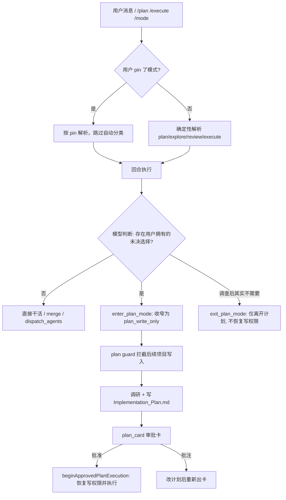

# Agent Note: 任务模式改由 Agent 自决（计划模式作为工具 + 用户覆盖命令）

Status: implemented

## Problem

任务模式此前由一个独立的 LLM 分类器（`chatPanel.resolveTurnAgentProfile` 中的路由提示词 + 一次 `chatCompletion`）每轮判定，产出 `intent`/`strategy`/若干 `explicit*Request` 标志。这带来三类问题：

1. **决策者上下文不足**：分类器只看到当前请求、activeFile 与最近 6 轮对话。真正能判断"是否需要先规划"的是主模型——它已读了仓库、看了工具结果。让一个信息更少的模型去猜，天然更容易误判。
2. **每轮额外成本与不确定性**：一次额外 LLM 调用（延迟、token、可用性），且同一句话可能被判成 execute 也可能被判成 plan；分类器不可用时还要回退到关键词正则。
3. **一个布尔值能否掉用户的执行意图**：`requiresUserDecision=true` 会把带明确写入动词的请求强制压回 plan，没有任何用户侧入口纠正；`profileForUserDomain` 硬编码 `intent:'auto', strategy:'auto'`，composer 只让选 domain。

同时缺少 DSH 那样的"模式是用户可切换状态"能力：DSH 用 `/plan` 命令 + `exit_plan_mode` 工具管理 logged plan 状态，本项目只有"进入计划模式"的自动判定，没有工具化入口，也没有用户覆盖。

## Decision

### 1. 计划模式成为 Agent 可调用的工具（2B：后置升级）

新增两个模型可见工具：

- **`enter_plan_mode({ reason })`**：用户明确要求实施方案时，模型在产出方案之前调用，即使本轮不写项目文件；否则在发现未决的用户选择后、首次项目写入之前调用，把本回合切到 Plan。实现上通过 `transitionSchedulingState` 把授权从 `workspace_write` 收窄到 `plan_write_only`、phase 切到 `plan`。
- **`exit_plan_mode({ reason })`**：仅在调查证明"确实不需要规划"时使用，phase 回到 `inspect`。**

**关键实现细节（本次踩到并修正的真实缺陷）**：`AgentToolExecutor.execute` 为每次调用构造一份 **runnerOptions 拷贝**，并把 `schedulingState` **冻结在入口值**（`agentTools.ts` 的 `toolContext`）。因此 `context.runnerOptions.schedulingState = next` 只会改到那份拷贝，状态变更无法回流。改为 `Object.assign(runnerState, next)` —— **原地改写 state 对象**，这样每次工具调用实时读取 `schedulingState.phase` 的 plan guard（`agentTools.ts` 的 `runtimePlanPhase` 判定）立刻生效，runner 也保留同一引用用于回合结束后的持久化 phase。

由此得到一个**硬门禁**：模型调用 `enter_plan_mode` 后，同一回合内任何项目写入都会被 plan guard 以 `planModeBlocked` 拒绝，只能写话题范围内的 Implementation Plan 产物。测试已覆盖这一点。

**授权方向严格单向**：`enter_plan_mode` 只收窄；`exit_plan_mode` **不恢复** `workspace_write`。恢复写权限只属于用户的审批路径（`beginApprovedPlanExecution`），因此模型无法绕过它给自己刚请求的审批开绿灯。`transitionSchedulingState` 本身的"禁止扩权"约束保持不动，并在两处边界显式断言权限阶（`AUTHORITY_RANK` 改为导出复用，不再复制第二份阶表）。

### 2. 退役 LLM 意图分类器

`resolveTurnAgentProfile` 中约 72 行的分类器调用（系统提示词 + `chatCompletion` + 解析 + 失败回退）删除，改为直接调用确定性的 `resolveAgentProfile`。`strategy`（multi/single）不再由模型猜测：它本来就被注释标记为"咨询性"，多 Agent 是运行时优化，模型可直接调用 `dispatch_agents`。

### 3. 用户覆盖命令（模式成为用户可切换状态）

新增 `/plan`、`/execute`、`/explore`、`/review` 与 `/mode [auto|plan|execute|explore|review]`（`slashCommands.ts` 数据驱动表 + `applyModeOverride`）。用户选择的模式写入 `AgentSessionCoordinator.modeOverride`，**路由随即完全跳过自动分类**（`resolveTurnAgentProfile` 开头即返回 pin 结果）——用户指令优先于任何自动判定。`/status` 与 composer 的调度状态同步刷新。

### 4. 提示词与审批链路

- 新增 `PLAN_ESCALATION_RULE` 共享段落，挂到 `buildBuildSystemPrompt`（Paradox build）与 `generalRules`（general-coder/utility）：明确"由你决定是否需要规划""有用户拥有的未决选择或用户明确要方案时先调 `enter_plan_mode`""仓库检查即可确定实现时不要升级""不得用 `exit_plan_mode` 逃避已请求的审批"。
- 计划卡片（`plan_card` 渲染）及批准/批注入口保持不变；提交凭据交接和失败处理由[审批卡说明](../bug-fix/2026-09-07-plan-approval-card-display-and-dismiss-race.md)拥有。明确要求方案优先于“检查即可确定实现”的不升级例外；不恢复关键词路由。

## Alternatives considered

1. **保留 LLM 分类器，只加用户覆盖命令**：每轮额外调用、不确定性、以及"布尔值压回 plan"三个问题都还在，只是多了一个事后纠正手段。否决——覆盖命令仍然做（作为用户主权），但分类器本身没有保留价值。
2. **2A 前置升级**（模型先调 `enter_plan_mode` 再开始任何工作）：要求模型在拿到任何仓库证据之前就预言"需要规划"，与不确定性往往在探索后才暴露的实际不符；且当时仍在 execute 授权下，收窄时机不如 2B 自然。否决。
3. **`exit_plan_mode` 一并恢复写权限**：会让模型自行解除刚请求的审批约束，等于绕过用户审批门。否决——恢复写权限只属于 `beginApprovedPlanExecution`。
4. **把模式状态持久化为日志化投影（DSH 的 `plan/mode` 事件）**：方向正确但改动面大（涉及会话日志与 projection），本轮先落地工具与用户覆盖；`approvedPlanExecutionPending` / `planContinuationPending` 两个内存态仍保留，待模式状态持久化时统一替换。暂缓。
5. **把 `strategy` 继续留在模型决策里**：多 Agent 已是运行时优化（准入评分才是真正的门），再让模型猜一遍没有增益，反而可能诱发过度委派。否决。

## Consequences

- 模式决策回到单一决策者（主模型，拥有完整仓库上下文），每轮省下一次路由 LLM 调用及其失败回退路径。
- 用户获得即时纠正手段：pin 的模式对后续所有回合生效，自动分类完全让位。
- 计划模式获得"进入/离开"的双向工具面，且进入后对项目写入是**硬拦截**（实测：进入后同回合 `write_file` 返回 `planModeBlocked`）。
- 审批链路与计划卡片零改动，用户看到的交互不变。
- 验证：`tsc` 双配置 0 错误；定向测试全绿（`agentToolSafety` 105、`agentProfile`+`chatModels` 48）；全量单测 2392 通过 + 既有 flaky 2 例（`agentToolSafety` 的后台命令超时与临时目录 EPERM 清理，改动前即存在，隔离复跑全绿）。
- 已知遗留：模式状态仍是内存态（`modeOverride` + `approvedPlanExecutionPending` + `planContinuationPending`），resume/fork 不恢复用户 pin，也未替换为 DSH 式的日志化投影；`agentProfile.ts` 中已无调用者的 `resolveAgentProfileFromModelDecision`/`parseModelAgentProfileDecision`/`shouldUseSemanticAgentRouting` 暂留（被 12 个单测引用），待清理。
