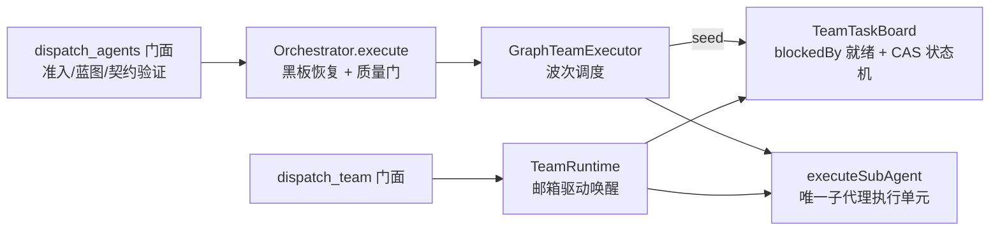

# Agent Note: DAG 执行引擎收敛到团队看板底座（GraphTeamExecutor）

Status: implemented

## Problem

系统内存在两套互不相关的多 Agent 执行实现：

1. `dispatch_agents` 的 DAG 波次执行器（原 `orchestrator/parallelExecutor.ts`，约 730 行），自带就绪计算、依赖修复、冲突批处理、重试/风暴预算、级联取消；
2. `dispatch_team` 的团队运行时（`orchestrator/team/`，前次提交引入），自带 CAS 任务看板（blockedBy 就绪、状态机、级联语义）。

同一套"任务 + 依赖 + 状态"概念被实现两遍，调度语义任何修正都要双写，模型侧也要在两个入口之间做无信息量的选择。维护成本与 AI 认知成本随时间单调上升。

## Decision

把 DAG 执行收敛到团队底座，产出 `orchestrator/team/graphTeamExecutor.ts`（`GraphTeamExecutor`），并删除原 `parallelExecutor.ts`：

- **状态载体**：每次 `executeGraph` 把 TaskGraph 播种到一块本次运行专用的 `TeamTaskBoard`——任务 id 即图节点 id（持久化、事件、answerClarifications 引用保持不变），`blockedBy` 即依赖边。看板新增内部驱动 API：`seedPipeline`（两阶段批量播种，原子拒绝重复 id/未知边/环）、`forceStatus`、`readyPendingTasks`、`cancelDownstream`（BFS 发现序与旧引擎逐字节一致）、`isSettledBoard`。
- **契约挂载**：`TeamTask.pipeline` 承载节点的静态执行契约（profileName/prompt/plannedFiles/plannedEntities/produces/consumes/acceptanceChecks/priority/maxIterations/maxRetries/模型覆盖），看板状态机只关心 pending/in_progress/completed/failed/cancelled。
- **行为逐点移植**（API 与语义对原 `ParallelExecutor` 完全兼容）：依赖缺失检测与自动修复（含二次环检测回滚）、波次调度、优先级排序、plannedFiles/plannedEntities 冲突避让、AdaptiveConcurrencyController 自适应容量、全局 token 预算超限降级串行、限流退避重排（≤30s 指数回退）、恢复风暴预算、澄清挂起（resumeContextRef/pendingClarification 供下一波恢复）、写后失败保留、超时不重试、级联取消、agentTaskManager 全生命周期事件（task_created/task_status_changed 及 stopReason 细分）、依赖 handoff 注入、实体注册表写黑板。
- **镜像策略**：`TaskNode` 对象仍是簿记与持久化镜像（orchestrationStore V3 记录、resumeGraphId/appendTasks/answerClarifications 路径零改动）；看板是唯一的调度状态权威。
- **门面不变**：`dispatch_agents` 的 ~900 行准入/蓝图/契约验证、`Orchestrator.execute` 的质量门阶段（Loc Sweep + 审查 + 最多 3 轮修复 + 保留失败修复）完全不动；`Orchestrator` 仅替换执行器字段类型。`TaskGraphEngine` 降级为图构建/校验/进度统计工具（质量门修复路径仍在用）。
- **Peer 团队零影响**：`TeamRuntime`/邮箱/CAS 工具路径不经过新执行器；`failed`/`cancelled` 状态对模型面看板工具不可达。

## Alternatives considered

1. **DAG 引擎吸收团队**（把邮箱/转向/冷启动移植进 ParallelExecutor，退役团队底座）：保留的代码更老更硬，但"成员常驻等消息"与波次执行模型语义相斥，需要把静默检测/关闭/生命周期上限塞进波次循环，等于在旧引擎里再长一个运行时；且丢失看板动态认领能力。否决。
2. **只收敛工具面、保留双引擎**（删一个工具，内部仍两套调度）：维护负担没有消除，违背本次目标。否决。
3. **一步到位合并工具面**（删除 dispatch_agents，全部走 dispatch_team 预填看板）：会同时改变模型面契约、持久化格式与 Webview 面板事件流，回归面过大。工具面保持现状，待新引擎在生产中稳定后另行决策。暂缓。
4. **持续泵调度替代波次**（任务一完成立即补位）：改变调度时机语义，超出"等价移植"的安全边界。波次语义保留，持续泵留作后续可选优化。

## Consequences

- 多 Agent 调度只剩一个实现：就绪判定、级联取消、冲突避让、重试/风暴全部收口到 `orchestrator/team/`；后续修正单点生效。
- 既有行为零回归：orchestrator.test.ts / subagentLifecycle.test.ts 的 15+ 个执行器行为用例仅改 import 即全部通过；全量单测 2408 条与基线持平；新增 6 个看板流水线驱动 API 用例。
- 持久化与恢复路径（V3 图记录、resumeGraphId、merge_results、澄清应答）完全未动，跨会话恢复的既有编排不受升级影响。
- 已知遗留：① 模型面仍是 dispatch_agents + dispatch_team 两个工具（提示词已分工：固定流水线/契约写入走前者，对等协作走后者），单工具终态待后续决策；② Peer 团队快照（teams/<id>.json）与编排记录（orchestrationStore V3）两个持久化载体尚未合并；③ Peer 团队尚未接 evaluateDispatchAdmission 与 Paradox 写契约。
