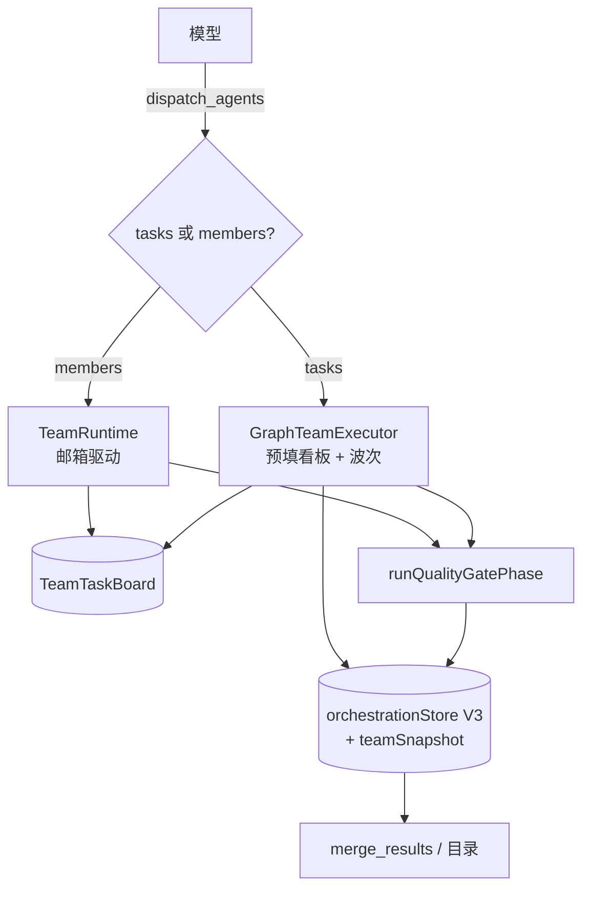

# Agent Note: 多 Agent 工具面与持久化收敛为单一入口

Status: implemented

## Problem

前一阶段把 DAG 波次的调度内核收敛到了团队看板（`GraphTeamExecutor`），但对外仍暴露两套并行的东西：

1. **两个工具**：`dispatch_agents`（tasks，DAG）与 `dispatch_team`（members，对等团队）。两者都要在 `definitions.ts`、`registry.ts`、`agentTools.ts`、`runCode` 黑名单、`modePrompts`、Webview 图标/短语/ORCHESTRATOR 集合、profile 白名单各维护一份；模型还需要在两个入口间做一次没有信息量的形态选择。
2. **两套持久化**：编排走 `orchestrationStore`（V3，`orchestrations/<id>.json`），Peer 团队走独立的 `teams/<id>.json`。结果就是 `merge_results` 与目录看不到团队产物，团队也享受不到编排记录的保留策略与恢复入口。
3. **两条结算路径**：DAG 写入波次结算必经质量门（审查 + 最多 3 轮修复），而 Peer 团队只把结算摘要推给 Lead —— 对等模式成了唯一能落地未经审查写入的多 Agent 入口。
4. **准入不一致**：`dispatch_team` 未接 `evaluateDispatchAdmission`，也未强制 Paradox 写入契约（featureManifest + produces/consumes）。

## Decision

### 1. 单一工具入口

`dispatch_agents` 成为唯一的多 Agent 工具，按参数形态路由：传 `tasks` 走 DAG 波次，传 `members` 走对等团队。`dispatch_team` 工具名退役（schema、registry 联合类型、TOOL_DOMAINS、ORCHESTRATION/TEAM 常量、MUTATING、Webview 图标与短语全部移除）。模型面工具数 93 → 92。

保留的团队工具仍是成员协作词汇：`team_send_message`、`team_members`、`team_close`、`team_task_create`/`team_task_list`/`team_task_update`（全部延迟披露，常驻提示词预算不变）。General 域的压缩 schema 同步获得 `members`/`teamName`/`objective`，使 general 域也能用对等模式。

### 2. 单一持久化载体

`orchestrationStore` 的 V3 记录新增可选 `teamSnapshot` 字段。团队结算时按与 DAG 完全相同的形状写入一条编排记录：每个成员一个节点、每个成员一份 `SubAgentResult`（`projectTeamOutcome` 投影），`teamSnapshot` 作为审计载荷附带完整看板与邮箱历史。于是 `merge_results(graphId)`、目录模式、保留上限（每话题 32 条）与 Webview 面板对两种形态完全一致；存储不可用时才回退到旧的 `teams/<id>.json`，审计链不丢。

### 3. 单结质量门

`Orchestrator.execute` 中约 260 行的质量门阶段被提取为公开方法 `runQualityGatePhase(taskGraph, result, options, emitStep)`，DAG 路径与团队结算共用。团队结算前用成员契约构造一张等价的 `TaskGraph`（成员 = 节点、`linkEntityDependencies` 补数据流边），跑同一套 Loc Sweep + 审查 + 最多 3 轮修复；质量门未通过则写入失败结论。

### 4. 准入与契约对齐

Peer 团队复用 `evaluateDispatchAdmission`（以成员简报为 objective、plannedFiles 为 expectedWrites），拒绝单成员与重复目标；Paradox 写入团队必须提供 `featureManifest`（objective + 至少一条验收条件）与逐成员的 `memberContracts`（produces/consumes），本地化成员还必须 consumes 非本地化实体，与 DAG 写入波次的校验规则一致。

## Alternatives considered

1. **保留两个工具，只共用内核**：工具面重复维护成本（7 处并行清单）与模型的选择成本都还在，收敛目标只完成一半。否决。
2. **以 `dispatch_team` 为唯一入口**：`dispatch_agents` 在代码、提示词、测试、面板事件里有 129 处引用且是 AGENTS.md 已确立的名字，改名的回归面远大于删掉 22 处引用的 `dispatch_team`；且 DAG 参数（blueprintFile/resumeGraphId/appendTasks/answerClarifications）塞进"团队"语义会造成命名与能力错配。否决。
3. **团队继续用独立 `teams/` 目录，另给 merge_results 加团队分支**：合并的是读取路径而非数据模型，团队仍得不到保留策略、恢复入口与统一目录投影，且会产生第二套投影代码。否决。
4. **团队结算不跑质量门，只报告**：对等模式会成为唯一能落地未审查写入的入口，与"写入必经质量门"的既有承诺冲突。否决。
5. **彻底删除团队工具（连 team_* 一起去掉）**：那等于放弃成员间协作与动态认领能力，退回纯 DAG。否决。

## Consequences

- 多 Agent 只有一个工具入口、一个调度内核、一个持久化载体、一条质量门路径：模型侧形态选择变成参数选择，维护侧清单不再并行漂移。
- 重复能力补齐：Peer 团队现在有准入评分、Paradox 写入契约、结算质量门与统一持久化；`merge_results` 与面板能看到团队产物。
- 向后兼容：`dispatch_team` 的历史提示词/快照不会再被识别（工具名已不在 registry），但 DAG 路径、V3 恢复、事件流、Webview 渲染全部不变。`teamSnapshot` 是可选字段，旧记录不需要迁移。
- 验证：全量单测 2419 条通过（基线 2408 + 6 看板驱动 + 2 路由 + 1 团队快照往返 + 2 团队类型），tsc 双配置 0 错误，eslint 0 错误（20 个既有告警），compile/mcp-schema（36 工具不变）/build:docs/check:release 全通过。
- 已知遗留：团队快照目前只在结算时落盘（运行中的团队不可从存储恢复），Peer 团队的澄清应答仍走邮件而非 `answerClarifications` 结构化通道。
