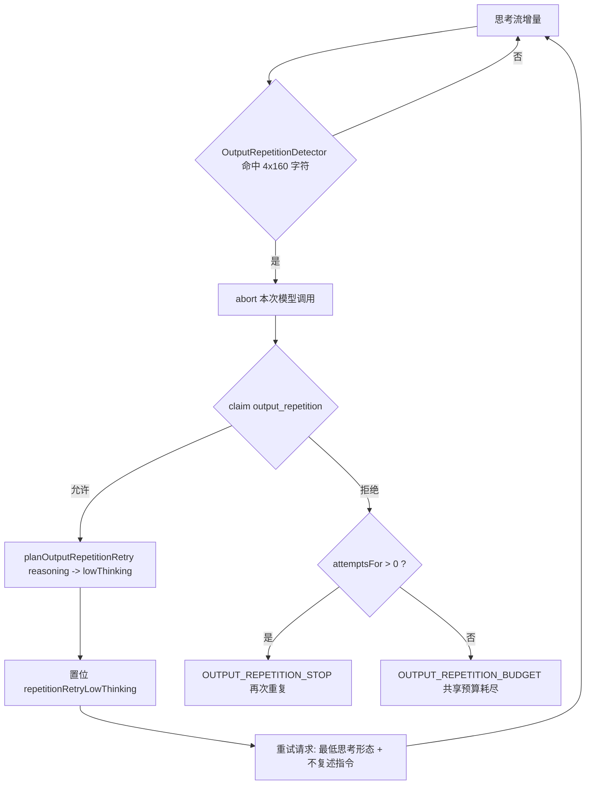

# Agent Note: 推理流重复循环导致整轮 Agent 运行中断的修复

Status: implemented

## Problem

用户反馈：一次多步任务执行到第 18 步后被硬中断，界面只显示
`模型 reasoning 再次进入重复循环，已停止生成以避免继续消耗上下文与额度。` 与
`[Agent Execution Terminated]: Repeated model output was detected twice; generation stopped safely.`
（模型 mimo-v2.5-pro，开启思考），已完成的 40 余步工作全部作废。

定位到的执行链：

1. `agentRunner.reasoningLoop` 把每个思考增量喂给 `OutputRepetitionDetector`，
   当同一段 ≥160 字符内容连续出现 4 次时判定为思考流死循环，并通过
   `modelAbortController.abort()` 中止本次模型调用。
2. `recoveryCoordinator.claim('output_repetition')` 每种恢复类型上限为 1，
   首次命中时只追加一条 `[SYSTEM]` 用户消息后 `continue` 重试。
3. **重试请求与上一次完全相同**（思考仍开启、思考强度不变），推理模型会再次进入同一
   推理吸引子，于是第二次命中时额度已耗尽，整个运行被终止。

因此这是一个“恢复策略无法逃出循环”的缺陷，而不是检测器误判：检测器要求连续 4 段完全
一致的 ≥160 字符块，不会把普通重复标识符或代码块判为死循环。

附带缺陷：`claim()` 在“同类额度用尽”和“共享恢复预算（默认 6）用尽”两种情况下都返回
`undefined`，但终止文案一律写成“再次重复”（detected twice）。当首个重复因共享预算被拒时，
提示与事实不符，用户无法判断真正的失败原因。

## Decision

1. 新增 `client/extension/ai/runner/outputRepetitionRecovery.ts`，把“重复循环重试策略”
   收口为纯函数 `planOutputRepetitionRetry(kind)`：
   - `reasoning` → `lowThinking: true`，并返回要求模型“不要复述被中止的推理、直接给出一个
     具体工具调用或简洁结论”的指令（同时声明本次重试已关闭思考）。
   - `response` → `lowThinking: false`，只丢弃被判定为重复的可见回答。
2. `reasoningLoop` 新增一次性开关 `repetitionRetryLowThinking`：命中思考流重复后置位，
   下一次模型请求通过 `requestDisableThinking = requestPlan.disableThinking || repetitionRetryLowThinking`
   强制使用最低思考形态（复用既有数据驱动表 `getReducedThinkingParams`：mimo/deepseek/glm 等
   下发 `thinking:{type:'disabled'}`，Gemini 3 降为 `thinking_level:'minimal'`，
   GPT-6 Astra 降为 `reasoning_effort:'low'`），随后立即复位，保证只影响这一次重试。
3. `RecoveryCoordinator` 新增只读访问器 `attemptsFor(kind)`；两处终止分支据此区分：
   已重试过 → `OUTPUT_REPETITION_STOP`，共享预算耗尽 → 新增 `OUTPUT_REPETITION_BUDGET`，
   并返回与之一致的英文终止串。
4. `messages.ts` 的 `OUTPUT_REPETITION_RETRY` 增加 `lowThinking` 参数（中英文同步），
   新增 `OUTPUT_REPETITION_BUDGET`（中英文同步）。
5. 回归测试：`client/test/unit/outputRepetitionRecovery.test.ts`（策略 + 文案），
   `client/test/unit/recoveryCoordinator.test.ts` 增加 `attemptsFor` 与
   “共享预算已耗尽时首个重复重试被拒且未消耗同类额度”用例。

修复后的重试流程：

## Alternatives considered

- **只提高 `output_repetition` 上限（1 → 2）**：不改变请求条件，思考流会以同样方式再次
  循环，只是把终止推迟一轮，仍然会浪费上下文与额度，故未采用。
- **放大检测阈值（提高 `REQUIRED_REPETITIONS` 或 `MIN_CYCLE_CHARS`）**：会把真正的
  死循环放过去，让模型继续空转直至耗尽输出预算；且检测器要求 4 段完全一致的 ≥160 字符块，
  误判概率极低，问题不在阈值，故未采用。
- **命中后直接终止并保留已完成步骤为最终答复**：保住历史但仍会丢失用户任务，且无法完成
  剩余工作，属于退步，故未采用。
- **停止回放历史 `reasoning_content`**：MiMo 的工具调用轮次依赖该字段
  （`preserveReasoningContentForToolCalls`），删除会破坏工具调用续写，故未采用。

## Consequences

- 思考流死循环不再直接终结整轮运行：重试改为“关闭/降低思考”的一次性请求，模型仍可继续
  推进任务，已完成步骤与上下文得以保留。
- 代价是这一次重试的推理质量下降（最低思考形态）；仅在检测到死循环时触发一次，正常轮次
  不受影响。
- 终止文案现在能区分“同类额度用尽”与“共享恢复预算耗尽”，与代码行为一致。
- 验证：`npm run typecheck:test` 与 `npm run compile` 通过；定向 `ts-mocha` 单测
  （`outputRepetitionRecovery.test.ts`、`recoveryCoordinator.test.ts`、
  `outputRepetitionDetector.test.ts`）13 项全绿。完整 `npm run test:unit` 中
  2327 项通过、26 项失败，失败项全部位于需要派生子进程/探测系统代理的套件
  （`spawn EPERM`，当前沙箱禁止管道 stdio），与本次改动无关。
