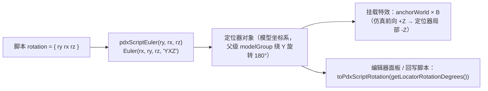

# Agent Note: 修复实体预览器脚本定位器 pitch/roll 镜像导致的特效方向反向

Status: implemented

## Problem

模组作者反馈：实体预览器中挂载的粒子特效方向与游戏内不一致（截图对比中"有一个方向反了"），并给出了定位：实体脚本里 `locator = { name = bridge_roa_far position = { 0 0 -90 } rotation = { 0 -90 0 } }` 这类定位器，"90 改成 -90 就好了"。

排查后确认根因在脚本定位器旋转的换算上：`entityPreview.ts` 的 `pdxScriptEuler()` 把脚本的第二、三个分量（pitch/roll）取负，用来"抵消" `modelGroup.rotation.y = Math.PI`。但该 PI 旋转作用在**整棵模型树**（网格几何、mesh 定位器、脚本定位器、骨骼）之上，是纯粹的观察坐标系变换，不影响任何相对朝向，因此这个补偿是多算了一次：凡是带 pitch/roll 的脚本定位器都会被镜像，挂载其上的特效、骨骼随之指向相反方向。偏航（yaw）未被取负，所以只有含 pitch/roll 的定位器（例如 `{ 0 -90 0 }`：应为向下俯仰，实际渲染成向上）暴露问题。

香草数据核对（`D:\Steam\steamapps\common\Stellaris`）确认了脚本定位器与 .mesh 同处一个模型坐标系，且挂载前向就是定位器局部 -Z：

| 证据 | 结论 |
| --- | --- |
| `dyson_gun_01_stage_1.mesh` 的 `L_barrel` 位于原点且前向为 -Z；实体脚本把 `wormhole` 放在 `{ 0 0 -210 }`（炮口前方） | 脚本 `position` 与 .mesh 同轴，未做镜像 |
| `_add_ons_entities.asset` 的 `loc1/loc2/loc3` 脚本坐标与同名的 mesh 定位器同号（+50 对应 +11.9，-50 对应 -13.9） | 脚本坐标与 .mesh 同手性 |
| `avian_01_orbital_station_frame`（环形居住站）的 part 定位器以 60° 步进偏航，脚本 `rotation = { -60 0 0 }` 等与 mesh 四元数完全一致 | 脚本 rotation 首值为 yaw，且按原值（右手、绕 +Y）应用 |
| `mammalian_01_turret_projectile_*.mesh` 的 `turret_muzzle_*` 位于炮管末端且无旋转；船只 `exhaust_*` 定位器统一旋转 180° 才是朝后 | 挂载物前向 = 定位器局部 -Z（即现有 `SIMULATION_TO_ATTACHMENT_BASIS` 正确，不能动） |

## Decision

1. 新增纯函数模块 `client/webview/pdxLocatorRotation.ts`，集中脚本定位器旋转换算：
   - `pdxScriptEuler(ry, rx, rz)` 按 PDX 的 Y/X/Z 存储顺序**原样**构造 `THREE.Euler`（`Euler(rx, ry, rz, 'YXZ')`），不再对 pitch/roll 取负；
   - `getLocatorRotationDegrees()` 同步改为返回未取负的逻辑 X/Y/Z，保证编辑器读数与回写仍是同一套约定；
   - `setLocatorRotationDegrees()` / `toPdxScriptRotation()` 保持 Y/X/Z 往返语义不变。
2. `entityPreview.ts` 改为从该模块导入四个换算函数，删除本地副本与已失效的注释。
3. 新增 `client/test/unit/pdxLocatorRotation.test.ts` 回归测试：`{ 0 -90 0 }` 必须让定位器前向朝下（原缺陷会朝上）、yaw/roll 与 mesh 四元数一致、脚本值与逻辑值往返不变号。

换算链路：

## Alternatives considered

- **翻转 `SIMULATION_TO_ATTACHMENT_BASIS`（让附着特效前向变成 +Z）**：否决。香草炮塔炮口定位器无旋转却位于炮管末端、引擎定位器旋转 180° 才朝后，都证明挂载前向是定位器局部 -Z；改动它会让所有模型上的特效（含 mesh 定位器）反向。
- **仅取反脚本 yaw**：否决。香草环形居住站/空间站的 part 定位器以 60° 步进偏航，脚本值与 .mesh 四元数逐一吻合，说明 yaw 本来就正确；取反会镜像所有脚本定位器的水平朝向。
- **只改面板显示、不改实际应用**：否决。同一组换算函数同时服务于显示、拖拽 gizmo、多选变换与脚本回写，分裂成两套约定会让"预览正确但保存后进游戏相反"。
- **改 `modelGroup.rotation.y = Math.PI`**：否决。该旋转是预览器把模型 -Z 前向对齐到 Three.js 观察习惯的全局选择，与相对朝向无关；改动它会连带影响相机、自动取景与所有子节点。

## Consequences

- 预览器中带 pitch/roll 的脚本定位器及其挂载特效、骨骼动画朝向与游戏一致，模组作者无需再"手动补 180°"。
- 编辑器读/写仍走 Y/X/Z 往返，`rotation` 的显示数值与脚本数值逐位相同，已有草稿与保存流程不受影响。
- 此前在预览器里"看着对"的 pitch/roll 值本来就是与游戏相反的镜像，修正后这些历史值在预览中会翻转，需要在预览里重新校准一次；mesh 自带定位器（四元数）与挂载基准不受影响。
