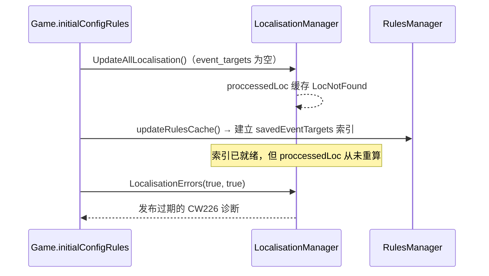

# Agent Note: 本地化事件目标命令误报（CW226）修复

Status: implemented

## Problem

用户反馈：本地化文本中以已保存事件目标作为命令链前缀的写法（例如
`[ForceSensitiveLeader.GetClass]`、`[ForceSensitiveLeader.GetName]`）在游戏内工作正常，
但编辑器报 `Localisation key "..." uses command "ForceSensitiveLeader" which doesn't exist`（CW226）。

用 `STLGame` + 事件文件保存事件目标 + 本地化文件引用复现后，确认有两层根因：

1. **处理时序过期**：`lookup.proccessedLoc` 在 `Game.initialConfigRules` 中由
   `LocalisationManager.UpdateAllLocalisation()` 生成，此时规则刷新尚未执行，
   `lookup.savedEventTargets`（事件目标索引）为空；随后 `updateRulesCache()` 才建立索引，
   但已处理条目里缓存的 `LocContextResult` 仍是 `LocNotFound`，且再没有任何路径重算，
   最终把过期诊断发布到 Problems。
   - 也就是说：**即使事件目标就在当前工作区内**（`lookup.savedEventTargets` 中确实存在该名字），
     依然会报 CW226。
   - `CommitRefreshCaches` / `CommitConfigRules` 提交时会替换 `savedEventTargets`，同样不重算。
2. **诊断与命名风格相关**：旧版本地化验证器对未知首段只有一条兜底启发式——名字包含 `_`
   或以小写字母开头时才视为变量/数据库条目（`variable_fallback`）。于是
   `[force_sensitive_leader.GetName]` 被静默接受，而同样无法解析的
   `[ForceSensitiveLeader.GetName]` 直接报错，结果仅取决于作者的命名风格。

## Decision

1. `LocalisationManager` 中把「重算已处理本地化条目」拆成不触碰增量 delta 日志的
   `reprocessLocalisationCommands`，并对外暴露 `ReprocessLocalisationCommands()`；
   原有 `UpdateProcessedLocalisation()` 保留清空 delta 日志的语义（供全量重新解析使用）。
2. `Game.fs` 新增 `refreshProcessedLocalisation()`，在所有会重建索引的路径上、
   发布校验结果之前调用：
   - `updateRulesCache()`（首次加载与 `RefreshCaches`）
   - `CommitRefreshCaches(staged)`
   - `CommitConfigRules(staged)`

   使缓存中的命令解析结果始终与当前事件目标 / 脚本化本地化 / 变量索引一致，
   同时不丢弃待处理的增量本地化批次（由既有回归测试
   `staged localisation prepare is pure and commit is guarded` 保证）。
3. `ChangeLocScope.fs` 把首段兜底启发式与命名风格解耦：当首段是标识符形状
   （字母/数字/下划线、字母开头）且命令链还有后续段时，把它视为无法静态解析的作用域前缀
   （事件目标 / 其他模组 / vanilla 数据），继续校验后续命令；单段 `[some_name]`
   与后续未知命令 `[some_name.NotReal]` 仍然报错。

## Alternatives considered

- **只在根仓库/扩展侧启动完成后调用 `RefreshLocalisationCaches()`**：治标不治本，索引仍会在
  `CommitRefreshCaches` 等路径变化，且 CWTools 的测试与 LSP 都直接使用 `LocalisationErrors`，
  扩展侧不是唯一入口。
- **校验时实时重算命令链**（让 `validateProcessedLocalisationBase` 接收活的验证器）：
  能覆盖所有路径，但需要改动 `Helpers`/`Hooks`/各游戏 hook 的签名，且每次发布都要重算全部条目，
  与方案 2 收益相当而改动面更大。
- **把首段兜底直接放宽到任意未知首段**：会连单段 `[typo]` 一起静默，噪声更大；
  因此限定为「标识符形状 + 还有后续段」。
- **不修改逻辑，只调整文档或严重级别**：无法消除真实误报（用户示例中的目标就在同一工作区内）。

## Consequences

- 任意命名风格的事件目标在本地化命令链中不再被误报；未知的后续命令仍会报出，
  CW226 对真正的命令拼写错误依然有效。
- 每次完整规则刷新会多一次本地化条目重算（与首次解析同量级），换来诊断与索引一致；
  增量本地化 delta 日志不受影响。
- 首段为标识符但实际写错作用域名（例如 `[Rott.GetName]`）不再报错，
  与既有的小写/下划线兜底保持一致。该兜底作用于使用旧版解析器的游戏
  （CK2 / EU4 / HOI4 / VIC2 / Stellaris），Jomini 解析器路径不受影响。
- 回归测试：`submodules/cwtools/CWToolsTests/LocalisationEventTargetTests.fs`（5 个用例）；
  子模块全量测试 285 通过 / 2 跳过 / 0 失败。
