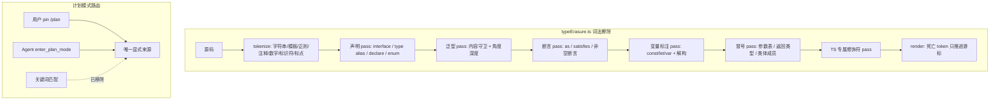

# Agent Note: PTC 类型擦除改为词法感知与计划模式关键词自动路由移除

Status: implemented

## Problem

上一轮（`2026-09-18-tool-presentation-mode-ptc-and-native.md`）落地 PTC 模式时，`client/extension/ai/tools/runCode.ts` 用一串正则实现 TypeScript 类型擦除（`stripTypeScriptTypes`）。该实现对 QuickJS 沙箱是灾难性的：

1. **对象字面量的值被当成类型标注删掉**。第 10 条参数标注正则：

```
/([(,]\s*[A-Za-z_$][\w$]*)\s*:\s*(?:string|number|boolean|any|unknown|void|null|undefined|Record<[^>]+>|Array<[^>]+>|[A-Za-z_$][\w$]*)(?:\[])?\s*(?=[=,)])/g
```

其分支 `[A-Za-z_$][\w$]*` 会匹配 `false`/`true`/`boolean` 这类标识符（关键字）。于是 `{ isRegex: false, limit: 40 }` 被改写为 `{ isRegex, limit: 40 }`：`limit` 因为值是数字而幸存，`isRegex` 与 `caseSensitive` 的值被整段删除。QuickJS 严格模式求值时抛出 `ReferenceError: isRegex is not defined`。

真实会话记录（`ai-chat-topics.json`）中连续三次 `run_code` 失败即为该症状：`'searchContext' is not defined`、`'isRegex' is not defined`。模型无从判断这是宿主缺陷，只能反复猜测“可选参数在此 SDK 中不可用”，最终放弃 PTC 改用原生工具逐个调用 —— PTC 模式事实上不可用。

2. **擦除无字面量隔离的边界情形**。`interface`/`type` 的声明正则会跨行吞掉后续语句；`type X = ...;` 依赖分号终止，省略分号的源码会破坏后面的代码。

3. **关键词自动路由仍在生效**。`2a6383d5`（`2026-09-18-task-mode-state-persistence-and-router-retirement.md`）退役了“语义路由分类器”，但 `client/extension/ai/agentProfile.ts` 的 `resolveAgentProfile` 仍保留整套关键词路由：`PLAN_INTENT_RE`、`WRITE_INTENT_RE`、`REVIEW_INTENT_RE`、`EXPLORE_INTENT_RE`、`NO_WRITE_INTENT_RE`、`BROAD_TASK_RE`。任何未 pin 模式的普通提问只要命中 `计划|规划|方案|设计|蓝图|路线图` 或 `plan|design|blueprint`，就被自动判定为 `intent: 'plan'`，落入 `plan_write_only`/`plan` phase。这正是用户反馈里“普通对话自动路由到计划模式”的来源，也让需要写入的请求被静默降级为只读。

## Decision

### 1. 以词法感知的擦除器替换正则擦除

新增 `client/extension/ai/tools/typeErasure.ts`，导出 `eraseTypeScript(source): { code, applied }` 与 `stripTypeScriptTypes(source): string`；`runCode.ts` 删除原正则实现，改为导入并再导出这两个符号（`makeGuestSource` 调用点不变）。

实施要点：

- **先分词再擦除**。`tokenize` 独立扫描出字符串、模板字面量（含嵌套插值、注释与嵌套模板）、正则字面量（含字符类与标志位）、注释、数字、标识符与标点。任何变换都只作用于 token 边界，字面量与注释内容不可能被改写。
- **只删“有证据”的类型**。冒号仅在以下情形删除：位于 `(`（参数表）或 `[` 内、位于类体成员行首、或前一 token 为成员修饰符。对象字面量的 `key: value` 因为既不在参数表也不在类体，被显式排除。
- **括号归属用括号本身判定**。`enclosingOpener` 只按未配对的括号回溯（不以 `;` 截断），因此“最近的未配对 `{`”能正确回答“这个冒号在对象字面量里”，而不必猜语句边界。该方法按 position 记忆化，避免每个冒号都做一次 O(n) 回溯。
- **类型扫描有明确终止条件**。`scanTypeEnd` 用 `expectingAtom` 状态机识别 `A | B`、`A & B`、`A extends B ? C : D`、函数类型 `(a: A) => R`；`=>` 仅在前一个原子是括号参数表时才继续延伸类型，因此 `(a: A): R => expr` 这类箭头函数不会被连体吞掉。
- **泛型与比较运算符的歧义由内容守卫消解**。`looksLikeTypeArguments` 拒绝含字面量、`=`、`=>`、算术与逻辑运算符的候选内容，`a < b && c > d` 不会被当作类型实参；`>>`/`>>>` 等复合 token 按前导 `>` 个数计入角度深度，嵌套泛型 `Map<string, Array<number>>` 可正确闭合。
- **保留运行时语法**。`import { a as b }` 的绑定重命名、`static`/`async`/`get`/`set` 等真实 JS 修饰符全部保留；只擦除 `private`/`public`/`protected`/`readonly`/`abstract`/`override`/`declare` 这类纯 TS 修饰符（且仅在类体或参数表内）。`accessor` 虽属 ECMAScript 装饰器提案，但 QuickJS 0.31 的 ES2020 实现不接受它，留在源码里必然是语法错误，因此一并擦除为普通字段（读写语义不变，仅失去访问器包装）。
- **擦除范围用 token 索引记账，最后一次性渲染**。`ErasurePlan` 以“死亡 token 集合 + 替换区间”记录，`render` 中已删除 token 只推进游标，绝不回填原始文本（原型阶段的游标缺陷正是回填导致擦除不生效）。`enum` 走 `replace` 生成 `Object.freeze({...})`，锚点 token 保持存活以便渲染替换文本。
- **两类会被静默算错的语义必须还原，而不只是“能通过语法”**：
  - 数值 `enum` 成员按 TypeScript 规则求值：自增、`1 + 2`/`1 << 2`/`1_0` 这类常量表达式、负数、以及引用先前成员（`B = A + 1`）全部还原。实现上把成员展开成顺序赋值并包进 IIFE，因此成员的相互引用读到的是枚举对象自身而不是外层作用域（早前的对象字面量写法会触发 `'A' is not defined`）。若照搬成员名（`{ A: "A" }`）程序能跑但结果全错，比语法报错更危险。TypeScript 的数值反向映射 `E[0] === "A"` 未还原：普通对象当然可以携带该键，这是为保持 `E` 形状最小而做的取舍，测试用 `Object.keys(E).length` 覆盖其可见差异。
  - 构造函数参数属性（`constructor(private x: number)`）在 TypeScript 中既声明又赋值字段；仅擦除修饰符会让 `this.x` 静默变为 `undefined`。因此新增末位 pass 在构造函数体首部补回 `this.x = x;`。该 pass 读取的是擦除前的原始 token 文本（`originalText`）。派生类中赋值必须落在 `super()` 之后，否则运行时报 “this is not initialized”；实现上以 `super()` 的分号为锚点，但替换文本必须只是 `;` 本身——锚点 token 是被整体替换的，若替换文本写成 `super();` 会渲染出 `super()super();`。

### 2. 移除关键词自动路由

重写 `resolveAgentProfile`：签名收敛为 `(text, profile)`，删除 `AgentProfileResolveHints` 与全部关键词正则，只保留 `MULTI_AGENT_RE`（用于 `strategy: 'multi' | 'single'`，不属于任务模式路由）。解析规则变为完全确定：

- `selection.intent !== 'auto'`：用户 pin 或 `planContinuationPending` 续计划 → 直接采用该 intent 的授权与 phase；
- `selection.intent === 'auto'`：解析为 `execute`（`workspace_write`/`execute`），由 Agent 在运行中自行调用 `enter_plan_mode` 升级。

任务模式因此只剩两个显式来源：用户 pin 与 Agent 升级。`chatPanel.resolveTurnAgentProfile` 同步删除 `previousUserRequests` 推断与 `hints` 透传。

唯一保留的文本驱动入口是 `chatPanel.isPendingPlanContinuation`：上一轮处于 plan phase、且尚未产出 `Implementation_Plan.md` 时，对该轮澄清的回答继续按计划续跑。它不是“按措辞决定任务模式”的路由——新会话或非 plan 轮次永远进不来（前置条件是会话已在计划态），且带显式的取消词白名单（“不用计划/直接执行”等）用于中途退出；它解决的是“计划模式下追问一句就被踢回执行态、蓝图与审批卡片全部丢失”的既有缺陷。经独立复核确认它是全仓最后一处读取请求文本影响任务模式的代码，故在此显式记录取舍而非静默保留。

### 3. 界面文案同步

`client/webview/chatPanel.ts` 移除已无对应实现的 `Semantic routing`（语义路由）与 `Rule routing`（规则路由）分支，默认文案改为 `Agent scheduling`（智能体调度）；`classifying`/`fallback` 两个状态文案从“语义判断/语义路由回退”改为“解析本轮任务模式/任务模式由智能体自行决定”。



## Alternatives considered

1. **修补现有正则（仅给第 10 条加更严格的守卫）**：否决。问题不是某条正则写错，而是“用文本模式匹配判断语法上下文”这一方法本身不成立：只要存在 `{ key: value }`，同形正则会持续产生新的误伤，补丁只会把缺陷推给下一个未覆盖的形状。
2. **引入 `sucrase`/`esbuild`/`typescript` 做类型擦除**：否决。`run_code` 在扩展宿主进程中执行，扩展体积与启动成本敏感；完整编译器体积远超现有依赖，且擦除位于每次工具调用的热路径上。自建 tokenizer 体积可控、无新依赖、无网络与磁盘访问，符合沙箱“零外部依赖”的既有约束。
3. **改用 Node 原生 `module.stripTypeScriptTypes`（DSH 的做法）**：否决。该 API 需要宿主具备支持类型剥离的较新 Node 运行时，而 `engines.vscode` 为 `^1.90.0`，宿主 Node 版本不受扩展控制，旧宿主上会直接不可用；`run_code` 必须对所有受支持宿主保持一致行为。
4. **在对象字面量上做“冒号后是值就保留”的启发式**：否决。这会与真正的对象类型标注（`const o: { a: number } = ...`）冲突，且无法处理嵌套与三元表达式；只有在 token 层面明确“是否位于参数表/类体”才是确定性的。
5. **保留关键词路由但把 plan 降级为“建议”**：否决。用户可见的“自动进入计划模式”体验问题不会消失，且一个只影响提示、不影响授权等级的“软路由”反而让状态更难推理。既然任务模式已由 Agent 工具与用户 pin 两个显式入口承载，关键词路径应整体删除。
6. **让 `auto` 继续解析为 `explore`/`review`**：否决。那会把普通提问降级为 `read_only`，重现“用户要求写入却被静默拒绝”的同一类缺陷；`auto` 必须解析为可写的 `execute`，是否进入计划模式交由 Agent 在掌握仓库上下文后判断。

## Consequences

- PTC 模式恢复可用：`{ query: "动修", searchContext: "workspace", isRegex: false, limit: 40 }` 这类带布尔/字符串可选参数的程序不再被改写，QuickJS 不再抛 `ReferenceError`，模型不需要再靠“省略可选参数”绕过宿主缺陷。
- 普通对话不再因措辞被自动降级为计划模式：未 pin 模式的请求一律解析为 `workspace_write`/`execute`，写入能力不再被关键词静默剥夺；需要计划时由 Agent 通过 `enter_plan_mode` 显式升级（该路径与工具契约保持不变）。
- 擦除边界由 token 保证：字符串、模板、正则、注释内容零污染；`import { a as b }`、`static`/`async` 等运行时语法保留；`a < b`、`cond ? a : b` 不再有被误判的路径。
- 验证：`npx tsc -p tsconfig.json --noEmit` 与 `.config/tsconfig.test-build.json` 均 0 错误；全量单测 2503 通过 + 既有 flaky 2 例（`agentToolSafety` 后台命令超时与临时目录 EPERM 清理，改动前即存在）。`toolPresentationMode.test.ts` 现包含 113 项测试（多轮针对性回归），全面覆盖类型擦除、执行与对抗边界；`agentProfile.test.ts` 覆盖“未 pin 请求绝不进入 plan 模式”的契约断言。

### 迭代验证与缺陷收敛记录

- **第一轮验证**：确认原始 PTC 参数损坏（`{ isRegex: false }` 变成 `{ isRegex }` 导致 `isRegex is not defined`）已修复，端到端执行通过。
- **第二轮独立对抗验证**：
  1. **枚举语义**：常量表达式（`1 + 2`/`1 << 2`/`1_0`）、负数按表达式扫描并求值；自增与自引用（`B = A + 1`）通过 IIFE 包裹读取枚举对象自身。
  2. **ASI 吞语句**：省略分号的 `type T = number` 下一行接 `[` 时，通过完成态 token 换行判定避免误判为索引访问类型。
  3. **无初始化器的类字段**：`a: number;`/`a?: number;` 不产生自有属性，保持与 TypeScript 一致；带初始化的字段保留。
  4. **保留字作成员名**：对象键、类字段与方法名（`declare`/`interface`/`implements`/`abstract`）要求位于真正声明位置才擦除。
  5. **降级产物的 ASI 分隔**：`super()` 分号与命名空间尾部自带必要分隔符。
- **第三轮验证**：
  1. **环境声明**：`declare function g(): number;` 整体删除，避免残存破坏 guest 预置声明。
  2. **`(T)[]` 变量名保护**：允许分组后接数组后缀，不误伤绑定标识符。
  3. **`!` 定值断言字段**：无初始化器时整体删除，不泄漏属性。
  4. **纯 JavaScript 保护**：保护 `function as()`、块闭合后的 `!!` 及模板字符串中的正则转义。
  5. **性能优化**：`enclosingOpener` 改为正向线性遍历建立表，大文件处理耗时从 700s 降至 0.7s。
- **第四轮验证（纯 JavaScript 逐字节恒等基线）**：
  1. **`class` 作为对象键**：`{ class: { useMaxWidth: !0 } }` 不再误判为类体。
  2. **类字段调用初始化式**：`class F { static x = loadConfig(); }` 保护被调函数表达式。
  3. **ASI 与 `!`**：换行后的 `!0;` 识别为前缀非而非非空断言。
  4. **`as` 标识符**：`return as();` 不再被误擦除。
  5. **模板 `${...}` 花括号计数**：正确处理插值内的对象/箭头函数花括号深度。
  6. **`for` 头声明扫描**：遇 `of`/`in` 及时截断，不越界擦除后续标签冒号。
  7. **命名空间导出**：导出成员保留原声明并追加 `N.x = x;`，兄弟引用正确限定。
- **第五轮验证（无体积上限全量扫描与模糊测试）**：
  1. **`interface` 作为方法名**：`{ interface() {} }` 方法简写正确识别为对象键。
  2. **初始化式里的数组字面量**：三元分支中的 `[]` 不误判为类索引签名。
  3. **私有字段**：`#p!: number` 保留私有字段声明 brand，仅擦除断言与标注。
  4. **命名空间合并**：改为 TypeScript 原生 IIFE 形状 `var N; (function (N) { ... })(N || (N = {}));`，天然支持同名多次声明合并。
- **第六轮验证（有效性过滤语法模糊测试）**：
  1. **三元分支里的对象字面量索引**：`c ? {}[k] : alt` 中的 `}` 明确只有块体闭合才算成员行首。
  2. **修饰符词作为普通变量**：类字段初始化式内与参数位置的修饰符词严格受限。
  3. 修复带初始化式的私有字段（`#q: string = 'z'`）标注擦除。
- **第七轮验证（断行规则）**：
  - 接入 TypeScript 原生 `scanner.hasPrecedingLineBreak()` 语义：`as`/`satisfies` 前换行结束表达式语句，属于普通标识符。
- **第八轮验证（操作数与标签）**：
  1. **`instanceof` 操作数**：`(readonly instanceof Object)` 严格要求参数属性后有绑定名与参数分隔符。
  2. **属性访问后的语句标签**：`a.abstract\nM: c.d;` 要求修饰符行首的前一个 token 必须是行首。
- **第九轮验证（多行空白与表达式守卫）**：
  1. **统一行终止符**：将 LF、CR、U+2028、U+2029 统一纳入 `LINE_TERMINATOR`，并通过源码字符跨距检测断行。
  2. **`abstract`/`implements` 表达式守卫**：`var abstract = { n: 0 }; abstract.n = 42;` 保持原样，避免静默改写。
  3. 修复三元分支接 `class` 表达式与关系比较运算 `<`、`>`。
- **第十轮验证（类继承位守卫）**：
  - `class D extends as {}` 中 `extends` 后的基类表达式不作为断言擦除。
- **第十一轮验证（TypeScript 语法深度覆盖）**：
  1. **参数属性修饰符链**：支持 `override`/`static`/`declare`/`abstract` 等 TS 专属修饰符复合链（`public override x`）。
  2. **`implements` 关键字类型名**：支持 `class D implements readonly, keyof {}`。
  3. **括号形式的断言类型**：支持 `v as (number)[]`、`v satisfies (number)`。
  4. **合并命名空间跨块导出引用**：导出集合跨块共享，后声明的块中正确引用前声明块导出的兄弟变量。

### 最终测试基线

- **构建与类型检查**：`npx tsc -p .config/tsconfig.extension.json` 与 `npx tsc -p tsconfig.json --noEmit` 均为 0 错误（BUILD=0, TC=0）。
- **纯 JavaScript 逐字节恒等**：全仓 707 个 `.js`/`.mjs`/`.cjs` 产物（含 `typescript.js` 9 MB、`mermaid.min.js` 3.5 MB、`sql-asm` 等超大产物）59.4 MB 扫描 **0 处改写**。
- **语法模糊测试**：多套独立语法的有效性过滤模糊测试改写率收敛至 **0.00%**。
- **全量单元测试**：2503 项全部通过（仅 2 例既有并发环境文件占用 flake）。

### 已知限制（Fail-Loud，不产生静默错误）

1. 嵌套命名空间（`namespace A { export namespace B {} }`）与点号命名空间（`namespace A.B {}`）未做深层降级，会显式抛出语法或类型异常，不产生静默错误值。
2. 字符串模板 `${...}` 内部的类型断言按不透明文本跳过（与旧版正则策略一致）。

### 授权执行延续判定守卫（解决问答后被强制继续进程而答非所问问题）

- **问题现象**：移除关键词自动路由后，未 Pin 的常规对话默认具有 `workspace_write` 授权与 `build` 模式。当用户提出纯解释/总结类问答请求时，模型生成完整文本回答且无工具调用，此时 `decideFinalResponse` 里的 `shouldContinueAuthorizedExecution` 仅因 `authorization === 'workspace_write' && !executionActionObserved` 便判定为 `continuation = 'authorized_execution'`，注入强制继续提示词（`This task already has workspace-write authorization. Do not stop at evidence collection...`）并让 runner 陷入额外迭代。模型误以为必须执行文件修改，转而去检查 git 状态、搜索不相干文件，最终返回与用户提问无关的总结，覆盖真实答案并导致“答非所问”。
- **修复方案**：在 `runnerPolicy.ts` 的 `shouldContinueAuthorizedExecution` 中增加 `approvedPlanExecution?: boolean` 参数守卫，并将此项要求为 `approvedPlanExecution === true`。该继续机制原本专门为“用户已明确批准实施方案（Approved Plan Execution）但尚未观测到写入动作”的继续执行而设计，不应在普通未批准方案的常规对话轮次中无故触发。`agentRunner.ts` 中将 `input.approvedPlanExecution` 透传给该判定。
- **单测**：`runnerPolicy.test.ts` 新增 `restricts authorized execution continuation to approved-plan continuations` 断言，153 项核心 AI/Runner 单测全绿。
