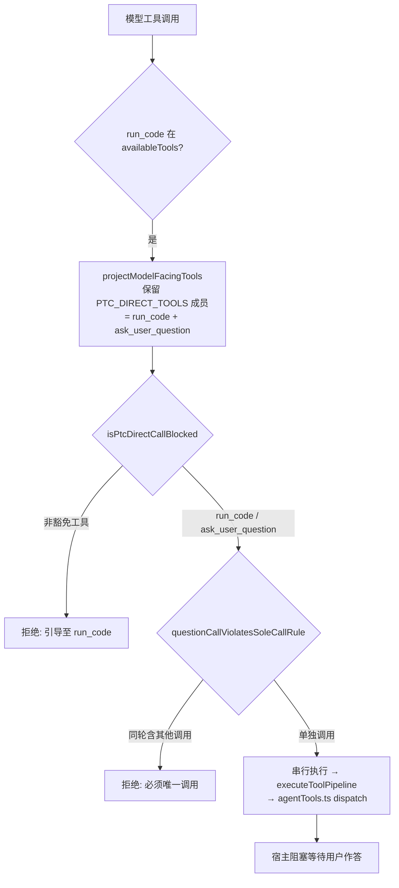

# Agent Note: PTC 模式下恢复 ask_user_question 直连调用

Status: implemented

## Problem

PTC（Programmatic Tool Calling）是 `aiService.ts` 的默认呈现模式，其设计前提是"模型可见面只剩 `run_code` 一个工具，其余能力全部收敛为脚本内的内部能力池"。该前提对绝大多数工具成立，但对 `ask_user_question` 不成立，由此产生一个功能不可达缺陷：

PTC 模式下 `ask_user_question` 有**四道门**同时关闭，任何一条都足以让模型永远无法向用户提问：

1. **投影门**（`client/extension/ai/agentRunner.ts` `projectModelFacingTools`）：`ptc` 分支只 `return tools.filter(t => t.function.name === 'run_code')`，该工具的 Schema 从不进入 API `tools` 载荷。
2. **直连拦截门**（同一文件，PTC 直连判定处）：`if (effectivePresentationMode === 'ptc' && toolName !== 'run_code')` 硬拦截并生成失败结果。该判定位于"必须是本轮唯一工具调用"约束**之前**，因此模型的合法提问会先被 PTC 拦截，连唯一性约束都到不了。
3. **脚本能力池门**（`client/extension/ai/tools/runCode.ts` `RUN_CODE_BLOCKED_TOOLS`）：该工具在名单内，四重生效——能力快照、SDK 声明生成、guest 对象构造、宿主桥接——脚本内 `tools.ask_user_question` 不存在。
4. **runner 闸门**（`agentRunner.ts` `runNestedToolStep`）：能力快照不含该工具时直接返回 `stepBlocked`。

第 3 道门**有正当理由，不能移除**：`ask_user_question` 会无限等待用户作答，而 `run_code` 有 `RUN_CODE_FANOUT_TIMEOUT_MS = 300_000` 的硬预算（`agentTools.ts` 引用）。把无界等待塞进有界执行窗口，用户思考稍久就会得到"程序超时"，比不可用更糟。

结果是：PTC 模式下模型被系统提示词反复要求"遇到歧义必须调用 `ask_user_question`"（`baseSystem.ts`、`modePrompts.ts`、`agentProfileCatalog.ts` 均如此规定），却没有任何合法途径做到这一点，只能退化为普通散文提问或反复失败重试。

## Decision

**让 `ask_user_question` 成为 PTC 模式下唯一的第二个可直连工具，其余投影与拦截行为一律不变。**

### 1. 单一事实源 `PTC_DIRECT_TOOLS`

新增模块级常量 `const PTC_DIRECT_TOOLS = new Set(['run_code', 'ask_user_question'])`，同时驱动**投影**与**拦截**两处判定：

```typescript
export function projectModelFacingTools(tools, mode) {
    const hasRunCode = tools.some(t => t.function.name === 'run_code');
    if (mode === 'ptc' && hasRunCode) {
        return tools.filter(t => PTC_DIRECT_TOOLS.has(t.function.name));
    }
    if (mode === 'native') {
        return tools.filter(t => t.function.name !== 'run_code');
    }
    return [...tools];
}

export function isPtcDirectCallBlocked(mode: ToolPresentationMode, toolName: string): boolean {
    return mode === 'ptc' && !PTC_DIRECT_TOOLS.has(toolName);
}
```

两处判定此前各自硬编码工具名（一个写 `'run_code'`、一个写 `!== 'run_code'`），必须保持同步，否则会出现"投影里有、却仍被拦截"或"投影里没有、拦截却放行"的幽灵状态。合并为同一个 Set 后该类偏差在结构上不可能发生。**豁免是有条件的**：`filter` 只保留输入集合中确实存在的工具，因此当模式/域/profile 把该工具过滤掉时，投影自然退化为仅 `run_code`，不会暴露一个空悬的 Schema。

### 2. 唯一性约束原样保留，且优先级顺序未变

`ask_user_question must be the only tool call in a model response`（原 3890 行）是**既有正确语义**，本次未削弱、未改写：

```typescript
export function questionCallViolatesSoleCallRule(questionCallIndex: number, callCount: number): boolean {
    return questionCallIndex >= 0 && callCount > 1;
}
```

它在同一批次中只要存在任何其他调用即拒绝该批次。放行直连后，"同轮既提问又执行"现在会先通过 PTC 拦截、再被此约束拦下——两道门串联，净效果仍是不允许同轮混用，唯一性语义完整保留。

### 3. 不动的部分

- `RUN_CODE_BLOCKED_TOOLS` 保持含 `ask_user_question`：直连是**唯一**通路，脚本内仍不可调用，`RUN_CODE_FANOUT_TIMEOUT_MS` 的预算安全因此不被削弱。
- `native` / `hybrid` 分支逐字节不变：`isPtcDirectCallBlocked` 对这两种模式恒返回 `false`，与改动前 `effectivePresentationMode === 'ptc'` 的短路完全等价。

### 4. 为何把判定导出为独立谓词

两个门原本内联在 `reasoningLoop` 深处。既有测试 `PTC rejection logic produces failed result for direct tool calls` **把门逻辑复制了一份到测试体内**，断言的是那份副本——门本身改坏时该测试仍会通过。改为导出生产代码自身调用的谓词，测试才真正锁住行为，而非锁住一份会腐化的拷贝。



## Alternatives considered

1. **把 `ask_user_question` 从 `RUN_CODE_BLOCKED_TOOLS` 移除，让模型在脚本内提问**：否决。用户作答时间不可预测，而 `run_code` 有 300 秒硬预算；超时会把一次正常提问变成一次超时失败，且嵌套脚本会把外层 turn 一并拖入预算，正是主控明确要求避免的失败模式。
2. **给 `ask_user_question` 单独开一条无限预算的子调用通道**：否决。这需要在 `runCode.ts` 内实现一套"可挂起、超时不杀"的 guest 桥接，远超本次 bug 修复的范围，且引入一条难以推理的混合生命周期。
3. **放宽 `RUN_CODE_FANOUT_TIMEOUT_MS`**：否决。用放宽一个全局有界预算来容纳一个无界等待，是把一个问题扩散到所有工具调用上。
4. **在 PTC 模式下改用普通散文向用户提问**：否决。这正是本缺陷的既有退化路径：系统提示词明确规定不得用散文提问，模型照做会导致流程静默偏移到"猜一个假设继续执行"，比直接失败更危险。
5. **把豁免做成配置项**：否决。会新增用户可见配置与双语 NLS 负担，换来的是一个正确的默认行为没有正确默认值；且当前决策的正确性并不依赖用户偏好。

## Consequences

- PTC 模式下模型重新具备向用户提问的能力，且不需要为此多付一个工具 Schema 之外的运行时代价。
- 模型可见面由 1 个工具变为 2 个，PTC 的 Schema token 削减收益基本保持（`<system-reminder>` 与 SDK 块本就在载荷中）。
- `ask_user_question` 在脚本内依然不可调用，无界等待无法绕过 300 秒预算。
- `native` / `hybrid` 行为零变化；两者本就可直连该工具，本修复只是让 PTC 与它们对齐。

## 验证契约

**验收标准与对应测试**（`client/test/unit/toolPresentationMode.test.ts`）：

| 验收标准 | 测试名 |
| --- | --- |
| PTC 模型可见集 = `run_code` + `ask_user_question` | `projects run_code and ask_user_question when mode is ptc and run_code is present` |
| 同上，且不泄漏其他能力 | `never leaks any other capability into the ptc projection` |
| 豁免条件性（工具缺席时退化为单工具） | `projects run_code alone when ptc has no ask_user_question available` |
| 直连不被拦截 | `lets ptc mode reach ask_user_question directly, without the run_code hop` |
| 非豁免工具仍被拦截 | `blocks non-exempt direct tool calls in ptc mode` |
| 唯一性语义未被削弱 | `still rejects a ptc step that mixes a question with another call` |
| 脚本内仍不可调用（预算安全） | `keeps ask_user_question out of the run_code capability pool` |
| native/hybrid 投影逐字节不变 | `leaves native and hybrid byte-identical to their pre-ptc-exemption behavior` |
| native/hybrid 拦截行为不变 | `never blocks a direct call in native or hybrid mode` |

**验证命令与结果**：

- `npx tsc -p ./.config/tsconfig.extension.json --noEmit` → 0 错误
- `npx tsc -p tsconfig.json --noEmit` → 0 错误
- `npx ts-mocha -p tsconfig.json client/test/unit/toolPresentationMode.test.ts` → **120 passing**，0 failing（改动前基线 113 passing）

**native/hybrid 未受影响的验证方式**：三重证据。① 代码层面，`isPtcDirectCallBlocked` 首项即 `mode === 'ptc'`，对 `native`/`hybrid` 恒 `false`，与改动前的短路求值逐字等价；两个投影分支（`native` 的 `filter(!== 'run_code')` 与 `hybrid` 的 `return [...tools]`）未触碰一行。② 测试层面，`leaves native and hybrid byte-identical to their pre-ptc-exemption behavior` 把投影结果与"手工复刻的旧实现"（`tools.filter(t => t.function.name !== 'run_code')` / `[...tools]`）做 `deep.equal` 比对，`never blocks a direct call in native or hybrid mode` 遍历 5 个工具 × 2 种模式断言恒不拦截。③ `git diff` 确认两个分支的代码文本零改动。
