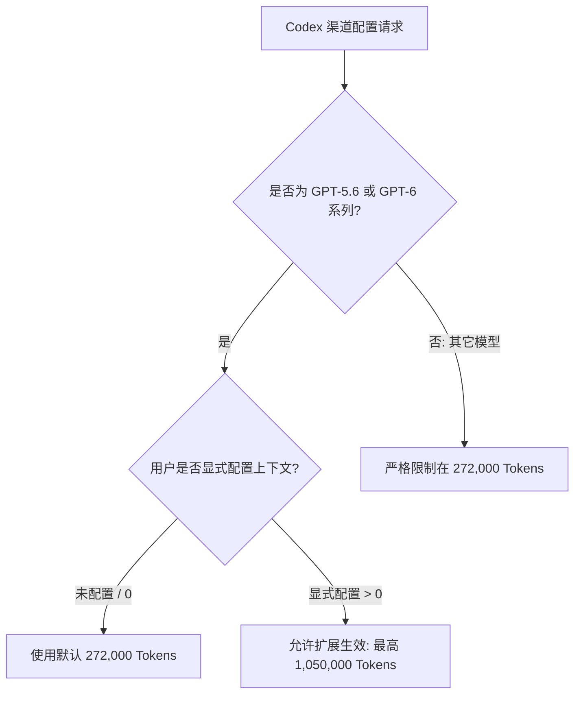

# Agent Note: 将 OpenAI 供应商与 ChatGPT 订阅渠道默认模型更新为 GPT-6 Astra 并支持订阅渠道 GPT-5.6/6 系列 1M 扩展上下文

Status: implemented

## Problem
OpenAI 近期正式发布了旗舰前沿模型 GPT-6 Astra。在先前的支持中，`gpt-6-astra` 虽已引入模型清单与推理配置，但 OpenAI API 供应商（`openai`）与 ChatGPT Codex 订阅渠道（`codex-chatgpt`）仍分别沿用旧模型作为默认项（`gpt-5.5` 与 `gpt-5.6-sol`）。

此外，ChatGPT Codex 订阅渠道对 GPT-5.6 与 GPT-6 系列模型的默认上下文为 272,000 Token（272K），但在服务端和上游客户端中，该系列模型支持用户手动将工作上下文调整为最高 1,050,000 Token（1M）。此前项目的 `clampConfiguredContextTokens` 逻辑一律按 `serviceLimit`（272K）强行截断，导致用户在设置界面即使手动修改上下文也无法突破 272K，且界面缺乏直观的默认值与 1M 扩展预设调节。

## Decision
1. **默认模型与双渠道配置更新**：
   - 将 `BUILTIN_PROVIDERS['openai'].defaultModel` 从 `gpt-5.5` 更新为 `gpt-6-astra`。
   - 将 `CODEX_CHATGPT_MODELS` 列表首位调整为 `gpt-6-astra`，使其成为 `codex-chatgpt` 的默认模型。
   - 双渠道默认上下文保持差异：OpenAI 官方 API 默认 1,050,000 Token；ChatGPT 订阅渠道未配置时默认 272,000 Token。

2. **Codex 订阅渠道 1M 扩展上下文与安全裁剪支持**：
   - 新增 `isCodexExtendedContextModel(model)` 判定函数，识别 GPT-5.6 与 GPT-6 系列模型。
   - 优化 `clampConfiguredContextTokens`：对于属于上述系列的模型，放宽用户配置上限至模型的完整能力（如 `gpt-6-astra`、`gpt-5.6-sol` 为 1,050,000；`gpt-5.6-luna` 为 400,000）；未配置（0）时仍回退至 272,000 默认值；对非扩展模型（如 `gpt-5.3-codex-spark`）仍严格安全限制在 272K。

3. **设置面板交互体验增强**：
   - 在 `chatHtml.ts` 的 `settingsCtx` 输入框旁新增 `#codexContextPresetGroup` 快捷切换按钮组（「272K」与「1M」）。
   - 在 `chatPanel.ts` 中根据当前选中的 Provider 与 Model 动态切换快捷按钮组的显示/隐藏，并更新辅助提示文本，帮助用户清晰感知默认 272K 与最高 1M 扩展能力。

4. **测试基线同步**：
   - 更新 `providers.test.ts`、`codexOAuthService.test.ts` 及 `chatSettingsLayout.test.ts`。
   - 覆盖双渠道默认模型、GPT-5.6/6 手动扩展至 1M、非扩展模型安全拦截、以及界面预设按钮布局。

## Alternatives considered
- **备选方案 1：直接将订阅渠道默认值改为 1M**：
  - 否决。Codex 渠道输入超过 272K 会更快消耗订阅高阶配额并可能产生排队延迟；保留 272K 默认并允许用户按需开启 1M 是最佳工程权衡。
- **备选方案 2：仅允许在配置文件手动编辑，不在 UI 提供切换控件**：
  - 否决。用户在图形化 AI 设置面板调整模型时，需要即时直观的预设和提示指导，避免盲目输入超出模型上限的值。

## Consequences
- 用户开箱即享 GPT-6 Astra，且 Codex 订阅渠道的 GPT-5.6 与 6 系列模型可自由在 272K 默认与 1M 扩展上下文之间切换。
- 编译、类型检查（`typecheck:test`）与全量 2,354 个单元测试和 35 个规则同步测试全部通过。
