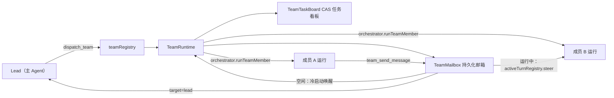

# Agent Note: Agent Teams 对等协作（邮箱 + CAS 任务看板 + 冷启动唤醒）

Status: implemented

## Problem

现有多智能体协作是中心化的树状 DAG：`dispatch_agents` 在派发前静态确定任务图，`ParallelExecutor` 按依赖批次调度，子 Agent 之间完全隔离，只能通过被动 Blackboard 读写交换状态。这带来两个结构性局限：

1. **缺乏对等通信**：子任务执行中发现歧义（例如本地化成员发现脚本成员定义的实体 key 有冲突）时，无法直接向对方提问，只能失败或上报给编排者做昂贵的二次规划。
2. **缺乏动态分工**：任务在派发时一次性绑定给成员，无法在执行中根据进展认领、转交或拆分任务。

调研参照系 DeepSeek Harness（DSH）的 Agent Teams 提供了对等邮箱、共享任务看板与上下文分叉能力，但其基于 Cordis 微内核与长驻 Session，无法直接移植到 VS Code 扩展宿主。

## Decision

在本项目现有编排基础设施之上实现了一个贴合扩展宿主约束的 Agent Teams 对等协作层（`client/extension/ai/orchestrator/team/`）：

**核心模块与语义**：

- `teamMailbox.ts`：每团队一条 append-only 消息日志。投递语义对齐宿主回合模型——目标成员运行中则经 `activeTurnRegistry.steer(runId, msg, ..., 'team_message')` 在其下一个模型步边界注入（`AgentInputQueue` 新增 `team_message` 种类，与 steer 同优先级）；目标空闲则保持 pending，由运行时循环冷启动唤醒；发往 `lead` 的消息在 Lead 运行中直接 steer，否则随结算摘要送达。消息投递后保留作审计。
- `teamTaskBoard.ts`：共享任务 DAG，所有变更走 CAS（`expectedRevision` 不匹配即失败并返回当前版本），`blockedBy` 必须引用已存在任务且拒绝成环，`writeScopes` 归一化为工作区相对前缀（拒绝绝对路径与 `..`），仅提供重叠告警而非硬锁（文件写硬互斥仍由 runner 写队列承担）。支持 claim/release/complete/edit 四种动作，claim 要求全部阻塞项已完成，complete/release 仅限 owner 或 Lead。
- `teamRuntime.ts`：团队生命周期循环。成员初始并发激活（上限 `maxConcurrency`，默认 3，封顶 4）；成员运行结束转入 `idle` 但不销毁——其 `lastRunId` 供 `runLedger.readResumeTranscript` 恢复转录上下文，下一条消息到达时带着恢复上下文与未读消息冷启动。成员输出中的 `BLOCKED_FOR_ORCHESTRATOR` 澄清自动转为发往 Lead 的邮箱消息。结算条件：无运行成员 + 无未投递消息 +（静默窗口 90s 到期 / Lead `team_close` / 30 分钟生命周期上限 / 父级中止）。结算摘要经 `agentTaskManager` 的标准 BACKGROUND TASK RESULT 通道送达 Lead，快照持久化到话题私有存储 `teams/<teamId>.json`（尽力而为）。
- `teamRegistry.ts`：进程内 teamId → TeamRuntime 注册表；成员调用经 `runnerOptions.teamId`/`teamMemberName` 绑定解析，Lead 调用按话题最近活跃团队解析；成员不得跨团队寻址。 非团队子代理（`useSlimPrompt` 且无团队绑定，例如质量门 reviewer）不会被误判为 Lead，质量门审查运行显式排除团队工具。

**成员激活提示**：每次激活注入 `<team-context>` 简报（团队目标、花名册与状态、协议说明）+ 未读消息 + 开放任务摘要；冷启动时附加“以上是你已恢复的工作上下文”提示以避免重复工具调用。

**工具面（7 个，全部 deferred 披露，group=orchestrator）**：`dispatch_team`（仅 Lead 可用，复用 dispatch_agents 的 profile 白名单、授权上限、本地化所有权、委派深度预算与工作区包含校验）、`team_send_message`、`team_task_create`、`team_task_list`、`team_task_update`、`team_members`、`team_close`（仅 Lead）。`team_task_list`/`team_members` 标记为 storm-exempt 只读轮询；`dispatch_team` 加入 run_code 沙箱阻断清单（与 dispatch_agents 同级），其余团队工具对 guest 开放。

**执行复用**：成员激活复用 `Orchestrator.executeSubAgent` 全链路（profile 解析、子代理沙箱、权限转发、空闲超时、文件写入跟踪、handoff 解析），团队成员间共享同一 Orchestrator 实例的 Blackboard，跨激活知识持续可见。`AgentRunnerOptions` 新增 `teamId`/`teamMemberName` 绑定；接通了一直声明但从未触发的 `onRunStarted` 回调，使团队运行时能记录成员的活跃 runId 以支持 steer 投递。

**UI 可见性**：复用既有事件类型（`subagent_start`/`subagent_end`/`step_appended`/`orchestrator_progress`），无需新增 reducer 或 Webview 渲染器；webview 补充了团队工具的图标、编排分类与中英双语短语。

## Alternatives considered

- **长驻成员循环（DSH 式持久 Agent）**：让成员运行永不退出、在循环内等待邮箱事件。这需要深入改动 AgentRunner 的终止与预算逻辑，风险大且与现有子代理空闲超时（20 分钟守卫）冲突。选择“运行-空闲-冷启动”模型：语义等价（消息不丢失、上下文可恢复），且完全复用现有执行器与恢复机制。
- **复用 ParallelExecutor 驱动团队**：执行器面向一次性 DAG，节点完成后不保留成员身份，无法支持唤醒。改为 TeamRuntime 自带轻量并发泵 + `Orchestrator.runTeamMember` 公开入口。
- **看板复用 Blackboard**：Blackboard 是 KV 乐观锁存储，缺少任务状态机、所有权、依赖就绪与成环检测语义，硬塞进去会让黑板 schema 校验复杂化。独立 `TeamTaskBoard` 语义内聚，且保留快照接口与 Blackboard 对齐。
- **新增 run 事件类型渲染团队时间线**：AGENTS.md 要求新事件类型同步 reducer 与 Webview 渲染器，改动面大；当前复用既有步骤事件已能完整呈现团队活动，故不新增。

## Consequences

- 主 Agent 现在可以在需要多专长反复协商的任务（事件链 + 本地化 + GUI 接线、边写边对齐 ID 的多文件改造）中选择团队模式，成员可互相实时纠偏、自主认领与完成任务。
- 静态工具目录从 86 增至 93（`toolDefinitions.test.ts` 预算护栏相应上调至 96）；7 个工具全部 deferred 披露，常驻提示词预算不变；MCP schema 不受影响（只读语义工具清单不含编排工具，`check:mcp-schema` 通过）。
- 已知限制：团队运行时驻留扩展宿主进程，VS Code 重载后活跃团队不自动恢复（结算快照已持久化，可供审计与手动续作）；团队成员之间不能嵌套 `dispatch_team`（委派深度预算与 `SUB_AGENT_EXCLUDES` 双重拦截）。
- 验证基线：`tsc -p ./.config/tsconfig.extension.json` 与 `tsc -p tsconfig.json --noEmit` 全绿；新增 `client/test/unit/agentTeams.test.ts` 20 个用例覆盖邮箱、看板 CAS/成环/写范围、运行时激活/steer/冷启动/结算；`npm run test:unit` 全量通过；`npm run check:mcp-schema` 通过。