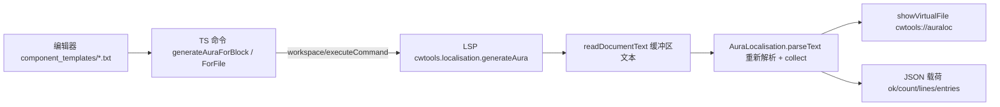

# Agent Note: 光环（friendly_aura / hostile_aura）本地化自动导出

Status: implemented

## Problem

Stellaris 的 `common/component_templates/*.txt` 中，`friendly_aura` 与 `hostile_aura` 需要一条自定义 Tooltip 本地化文本；否则玩家只能看到引擎自动拼接的修正列表，光环的作用范围（`apply_on`）与 `damage_per_day` 伤害完全不可见。模组作者目前只能手工把 `modifier` 里的每条修正抄成 `$MOD_XXX$：§G+50%§!` 的形式，键名大小写、正负号、百分比换算和换行转义都容易出错，且光环一多就无法保持一致。

已有的 `genlocfile` / `genlocall` 只处理"缺失本地化键"（CW100），无法从光环定义推导 Tooltip 内容。

## Decision

新增一条**只读** LSP 命令 `cwtools.localisation.generateAura`，把光环块自动转换成可直接粘贴的本地化行。

### 职责边界

- 生成逻辑放在纯函数模块 `src/Main/AuraLocalisation.fs`（可被 `.fsx` 直接 `#load`）。
- `src/Main/Program.fs` 中的 `auraLocalisationCommand` 负责协议适配：解析参数、读取缓冲区、调用模块、推送虚拟文档、返回 JSON 载荷。它定义在 `Server` 类之外，因此 **CWT-only 模式**（无游戏模型）同样可用；命令在两个 `gameObj` 分支（`Some` / `None`）都能命中。
- 命令在 `src/LSP/Commands.fs` 以 `readCmd` 注册：只读文档文本、只推通知，不写盘、不改游戏模型。

### 生成契约

```
<KEY>:0 "<§Y标题§!\n<作用对象>：\n <条目>...>"
```

| 元素 | 取值 |
| --- | --- |
| 标题 | `friendly_aura` → `§Y防御性光环§!`；`hostile_aura` → `§Y敌对光环§!` |
| 作用对象 | `apply_on`：`ships` → 舰船、`fleets` → 舰队（`enum[aura_types]`），未知值原样输出；前缀按光环类型取 `对盟友` / `对敌方` |
| `modifier` 条目 | ` $MOD_<键名大写>$：<带符号数值>`，按源顺序；跳过 `custom_tooltip` / `show_only_custom_tooltip` |
| `damage_per_day` 条目 | 固定顺序：每日伤害（`damage = { min max }`，相等时折叠为单值）、护盾伤害、装甲伤害、船体伤害、命中率、护盾穿透、装甲穿透、体积伤害系数，仅输出存在的字段 |
| 键名 | `stack_info.id` → 回退 `name` → 都没有则跳过并在 `message` 中说明 |
| 重复键 | 文件范围内保留首个（源顺序），其余计入 `message` |

数值渲染：`_mult` / `_mult_base` / `_perc` / `_percent` 结尾的键**或**字面量含小数部分时按百分比（`0.5` → `§G+50%§!`、`-0.5` → `§R-50%§!`、`2` → `§G+200%§!`），其余按写入形式输出（`ship_tracking_add = 10` → `§G+10§!`）。`damage_per_day` 的数值不加正号，含小数按百分比。模块内的 `forcePercentKeys` / `forceFlatKeys` 常量是逐键纠偏的入口。

### 触发入口

| 入口 | id | 说明 |
| --- | --- | --- |
| VS Code 命令（TS 注册） | `cwtools.localisation.generateAuraForBlock` | 取 `window.activeTextEditor` 光标位置 |
| VS Code 命令（TS 注册） | `cwtools.localisation.generateAuraForFile` | 当前文件全部光环 |
| LSP 命令（内部） | `cwtools.localisation.generateAura` | `arguments = [uri, scope, line?, character?]`，`scope ∈ {block, file}` |
| 代码操作（F# 服务器） | 同上 | 仅当文件位于 `common/component_templates/` 且文本含光环键；光标在光环块内时额外给出"本块"操作 |
| 编辑器右键菜单 | 同上 | `resourceExtname == .txt && resourcePath =~ /component_templates/` |

TS 侧与 LSP 侧的命令 id **必须不同**：vscode-languageclient 会把服务器广告的 `executeCommandProvider` 命令自动注册为 VS Code 命令，同名注册会直接抛错。生成结果通过既有 `showVirtualFile` 推送到只读虚拟文档 `cwtools://auraloc`，命令同时返回载荷：

```json
{ "ok": true, "scope": "file", "count": 2, "lines": ["KEY:0 \"...\""], "message": null,
  "entries": [{ "key": "SRA_Aura_5_1", "kind": "friendly", "startLine": 12 }] }
```



### 解析来源

生成器**不读取游戏模型**，而是用 `CKParser.parseString` + `ProcessCore.processNodeBasic` 重新解析当前缓冲区文本（`mkZeroFile path` 作为根 range）。这样输出始终等于编辑器里的内容（不依赖 debounce 后的模型版本），`common/component_templates` 未被 `folders.cwt` 扫描时也能工作，且生成逻辑可以脱离 `IGame` 做纯函数回归测试。

### 交付与反馈

- 有生成结果时，虚拟文档显示生成行；**没有结果时显示 `# <原因>` 注释行**，因为代码操作（灯泡）路径不经过 TS 层，只有这个通道能反馈失败原因。
- 两个 VS Code 命令的提示信息一律 `void`（fire-and-forget）：`showWarningMessage` 的 Promise 要等用户关闭提示才 resolve，`await` 会让命令与载荷一起挂起。
- `createVirtualFile` 通知处理器（`client/extension/extension.ts`）由"打开文档 → 直接 applyEdit"改为"以缓冲当前位置计算 range + 内容不一致时重读重试（最多 3 次）"。内容提供器（`cwtools://`）支撑的文档在连续更新时会返回 `IGNORING workspace edit: ... has changed in the meantime` 并丢弃编辑，旧实现会让第二次生成的缓冲区停留在上一次内容；该修复同时改善既有 `genlocfile` / `genlocall` 与各类 `listAll*` 虚拟文件。

## Alternatives considered

- **直接写入对应语言的 localisation `.yml`**：需要复用 `write_localisation` 的多语言事务、BOM/表头与写队列，并给一条 LSP 命令引入写权限与回滚语义；用户当前只需要可核对的文本，先给只读虚拟文档更小切口（未来可在其上叠加写入）。
- **暴露成 `cwtools.ai.*` 工具 / MCP 能力**：会造成模型可见的工具面膨胀，还要同步 `definitions.ts`、registry 与 MCP schema 并在子模块单独发布；本功能是确定性转换，不需要模型参与。
- **从游戏模型（`gameDispatcher` + `AllEntities()`）取 AST**：省一次解析，但输出受未落盘编辑与增量刷新时机影响，还会让 CWT-only 模式不可用；重新解析成本低且语义一致。
- **纯 TypeScript 侧用正则/手写扫描生成**：会绕过 CWTools 已有的 PDX 解析器（引号、注释、嵌套块的正确切分），与"复用既有结构化 API"的约束冲突。
- **百分比只按键名后缀判断**：`ship_evasion_add = 0.1` 这类"`_add` 结尾但以小数书写"的修正会被渲染成 `+0.1`，与游戏显示不符；因此叠加"字面量含小数即百分比"的规则。
- **沿用 `genlocfile` 的单命令 + 参数约定**：调色板入口拿不到 `activeTextEditor` 光标，无法实现"光标所在块"；因此拆成两个用户可见命令转发到同一条 LSP 命令。

## Consequences

- 修正的百分比/平铺语义在游戏内部由引擎的修正注册表决定，本仓库数据（`config/logs/modifiers.log`）只有名字与 scope 分类，无法完全准确判断。启发式在"整数字面量但游戏按百分比显示"（例如 `ship_damage_reduction_add = 10`）时会输出 `§G+10§!`；需要时用 `forcePercentKeys` / `forceFlatKeys` 纠偏。
- 覆盖范围限于 `friendly_aura` / `hostile_aura`；`ship_modifier`、`triggered_*` 等其它含 `modifier` 的块不在本次范围内。
- 命令不写盘，也不自动在光环里补 `custom_tooltip = <键名>` 接线；这条约定写在 `README.md` 的使用说明里。
- 生成文本是中文标签（`防御性光环`、`对盟友舰船效果：` 等），与 Stellaris 简体中文本地化的写法一致；生成结果与语言无关，可直接放进对应语言文件。
- 回归覆盖：`src/Main/AuraLocalisation.Tests.fsx`（纯函数，含用户示例逐字节比对、百分比/平铺、`damage_per_day` 顺序、键名回退、重复键、光标未命中、语法错误）与 `client/test/suite/auraLocalisation.test.ts`（真实语言服务的端到端调用，断言命令注册、代码操作（灯泡）返回的 command/arguments 与光标范围、命令载荷、只读缓冲区的实际内容；夹具 `client/test/cwt-game-sample/game/common/component_templates/auras.txt`）。
