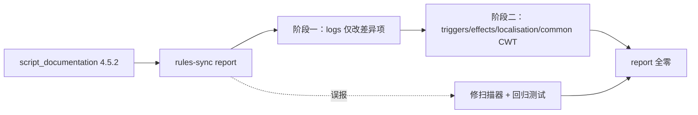

# Agent Note: Stellaris v4.5.x 规则同步与 CWT 规则补全

Status: implemented

## Problem

在 Stellaris v4.5.0 规则检查中，`rules-sync` 报告（`.rules-sync/stellaris/report/rules-sync-report.json`）发现当前脚本文档基线及 CWT 规则库存在以下漂移与未覆盖字段：

1. **游戏脚本文档命令漂移**：
   - **Triggers**：12 项新增（`can_add_random_non_blocker_deposit`, `can_spawn_random_anomaly`, `has_ethos`, `has_overclock`, `pop_ethic_amount`, `trade_action_value` 等），3 项移除，16 项变更；
   - **Effects**：19 项新增（AI 装甲/护盾/武器偏好设置与重置命令、`pop_force_remove_ethic`、`pop_force_transfer_ethic`、`set_overclock`、`transfer_resources_to_empire` 等），1 项移除，15 项变更；
   - **Modifiers**：7 项新增，4 项移除，11 项分类变更（归入 `Ships`）。
2. **命令参数类型严谨性问题**：
   - 部分新增条目初期使用了 `scalar` 通用占位符，未强类型绑定至原版对应的规则定义（如超频模式 `<mega_overclock>`、舰船角色 `value[ship_size_ship_roles]`、交易行动 `<tradable_actions>`）。
3. **Common 字段级参数未覆盖（共 47 个）**：
   - 缺少类型覆盖目录：`common/policy_categories`（政策分类，6 项定义）、`common/resource_regions`（资源区域，4 项定义）；
   - 缺失 Subtype：`common/game_rules` 缺失 `can_pop_group_auto_migrate_abroad`；`common/on_actions` 缺失 `on_cosmogenesis_exodus_fleet_reached`；
   - 缺少字段定义：`common/megastructure_overclock_types`（3 项）、`common/megastructures`（4 项）、`common/planet_classes`（2 项）、`common/policies`（1 项）、`common/pop_faction_types`（3 项）、`common/ship_sizes`（1 项）、`common/starbase_modules`（1 项）、`common/defines`（28 项）。

## Decision

严格按照两阶段与深入原版定义查验的原则执行同步与重构：

1. **阶段一（Log 文档基线同步）**：
   - 仅针对 report 报告的条目，精确同步 `config/logs/trigger_docs.log`、`config/logs/modifiers.log` 与 `config/logs/localizations.log`（补全 `GetPopsGuidingEthic`），不整量替换以避免引入原版日志格式噪音。
2. **阶段二（CWT 强类型化与字段级全面覆盖）**：
    - **全面清除残余 `scalar` 引用，强化原版类型校验**：
      - `has_overclock` 与 `set_overclock` 强绑定 `<mega_overclock>`；
      - `is_ai_ship_role` 与 `set_ai_ship_roles` 强绑定 `value[ship_size_ship_roles]`；
      - `trade_action_value` 强绑定 `<tradable_actions>`；
      - `AGREEMENT_PRESET_DEFAULT`（`defines.cwt`）强绑定 `<agreement_preset>`，并移动到 `AGREEMENT_PRESET_VASSAL` 相邻位置；
      - `overclock_group`（`megastructures.cwt`）强绑定 `value_set[megastructure_overclock_group]`；
      - `overclock_loc_key`（`megastructures.cwt`）强绑定 `localisation`；
      - `icon`（`policy_categories.cwt`）移除冗余的 `icon = scalar`，保留 `icon = <sprite>`。
    - **纠正巨构（`megastructures.cwt`）字段层级**：
      - 将误嵌在 `overclock_types = { ... }` 内的顶层字段（`nomad_reactivatable`、`custom_tooltip_with_modifiers`、`overclock_loc_key`、`overclock_cooldown`）移至 `megastructure` 顶层属性，`overclock_types` 内仅保留模式引用 `<mega_overclock>`。
    - **补全缺失的 CWT 目录定义**：
      - 新建 `common/policy_categories.cwt`，定义 `type[policy_category]` 与图标配置；
      - 新建 `common/resource_regions.cwt`，定义 `type[resource_region]` 与资源上限参数。
    - **补齐 Subtype 过滤**：
      - `common/game_rules.cwt` 补充 `can_pop_group_auto_migrate_abroad`（作用域：`this = pop_group, root = colony`）；
      - `common/on_actions.cwt` 补充 `on_cosmogenesis_exodus_fleet_reached`。
    - **补齐 47 个未覆盖字段定义**：
      - `common/megastructures.cwt`：补齐 `mega_overclock` 的 `overclock_group`, `system_modifier`, `megastructure_modifier`，以及 `megastructure` 的 `nomad_reactivatable`, `custom_tooltip_with_modifiers`, `overclock_loc_key`, `overclock_cooldown`；
      - `common/planet_classes.cwt`：补齐 `can_be_capital`, `inherit_country_district_modifiers`；
      - `common/policies.cwt`：补齐 `category` 引用 `<policy_category>`；
      - `common/pop_faction.cwt`：补齐 `use_guiding_ethic_as_growth_factor`, `pop_ethics_filter`, `pop_attraction_tag`；
      - `common/ship_sizes.cwt`：补齐 `use_ai_design_role_from = <ship_size>`；
      - `common/starbases_consolidated.cwt`：补齐 `triggered_component_set`；
      - `common/defines.cwt`：在 `NGraphics`、`NCombat`、`NGameplay`、`NAI` 各模块补齐 28 项全局参数。

### v4.5.2 增量同步

- **命令**：新增 `pop_ethics_divergence`、`is_preferred_platform_weapons` 与 6 个 `set_/clear_ai_platform_*` effect，类型与同族 starbase 命令一致（`enum[weapon_type]`、`value_field[0.0..1.0]`、`bool`）。`ethos` 原版仍可解析，仅在描述中标注废弃，不删除。
- **作用域收窄只改 log**：`is_archetype`、`is_ship_category/class/size`、`prevent_anomaly` 的 `Supported Scopes` 变化只写入 `trigger_docs.log`，CWT alias 不加 `## scopes`，保持由 log 驱动。
- **本地化**：`GetPopsGuidingEthic` 迁至 `pop_faction`；`Faction` 提升不再接受 `pop_group`（原版文档与本地化均无此用法）；`GetIcon`、`GetNamePlural` 在 log 中按原版移除/收窄，但 `localisation.cwt` 中手工维护的 `GetIcon = any` 与宽范围 `GetNamePlural` 保留，因为原版大量使用 `[job.GetIcon]` 等职业目标写法。
- **Common**：`on_actions.cwt` 补 `on_arkship_knights_detox{,_start,_cancelled}`（`this/root = planet, from = fleet`）；`defines.cwt` 补 `NShip.DESIGNER_STARBASE_WEAPON_PREF_MUL = float`；`num_buildings` 补可选 `category = any | enum[building_categories]`。
- **扫描器误报改修工具而不是改规则**：
  - `report.ts` 字段扫描跨行追踪双引号状态：`inline_script` 的 `TRIGGER = "...{` 多行字符串曾让括号深度少算一层，把 `AMOUNT` 及若干修饰符误报为建筑/职业字段。只跨行携带 `"`，避免裸撇号吞掉后续内容。
  - `scope-contracts.ts` 中“中心名词 + 关系从句”（`starbase that changed controller`）优先解析为中心名词，不再因从句中的 `controller` 被判为 `country`；现有 `on_starbase_occupied` 的 `from = starbase` 本就正确。

## Alternatives considered

1. **将 `overclock` / `role` / `action` 保持为 `scalar`**：
   - 被否决。原版 `common/` 目录下存在明确的类型系统支持（`<mega_overclock>`、`<tradable_actions>` 与 `value_set[ship_size_ship_roles]`），使用精确引用才能发挥 LSP 补全与校验的最大价值。
2. **忽略 Common 字段级报告**：
   - 被否决。Common 参数漂移会导致语言服务器报出未知属性假阳性警告，覆盖至 0 findings 能确保规则库与 v4.5.0 原版完全同步。
3. **为 `amount` 等误报字段补 CWT 规则，或为 `on_starbase_occupied` 加 errata**：
   - 被否决。前者会在规则中写入并不存在的定义字段；后者只掩盖单点，同类关系从句注释仍会误判。修正扫描器并加回归测试才能根治。
4. **从 `localisation.cwt` 同步删除 `GetIcon` / 收窄 `GetNamePlural`**：
   - 被否决。原版本地化在职业等动态目标上广泛使用这两个命令，删除会产生大量假阳性。

## Verification

- 运行 `node tools/rules-sync/stellaris-rules-sync.js report --no-open`：
  - `folders with findings: 0`（所有 47 个字段与未覆盖类型全部清零）；
  - `scope contracts missing: 0`；
  - `effect: +0 -0 ~0`；
  - `modifier: +0 -0 ~0`；
  - `scope: +0 -0 ~0`。
- 运行 `npm run compile`：前端 Webview 与 Extension Host 编译全部通过。
- 运行 `npm run typecheck:test`：全量 TypeScript 类型检查通过。
- v4.5.2：`report --no-open` 所有 diff 均为 `+0 -0 ~0`，`folders with findings: 0`，`scope contracts missing=0 mismatch=0`，`documented-but-unmodeled=0`；`npm run test:rules-sync` 通过（新增多行字符串字段扫描与关系从句作用域两条回归测试）；规则 diff 中无新增 `scalar`。
