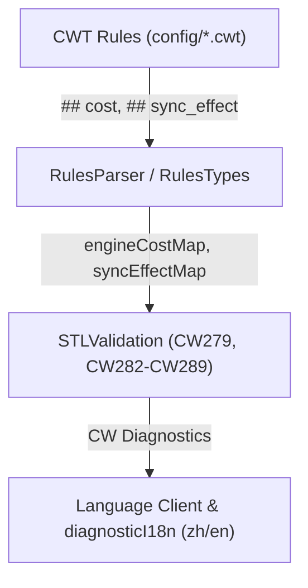

# Agent Note: 引擎事实驱动校验器 CW279-CW289 与规则注释细分（落实交接文档 A/B/C/D）

Status: implemented

## Problem

在初步实现 CW279–CW281 之后，[docs/engine-perf-lint-handoff.md](../../../../docs/engine-perf-lint-handoff.md) 梳理了 Stellaris 4.5 反编译性能分析转化为规则配置与插件功能的剩余工作：
1. **任务 A（复杂度细分）**：714 条初版标注为笼统 `o(n)` 的命令缺少粒度，无法区分遍历本对象还是全银河；且缺少“复杂脚本求值（`script_eval`）”与“作用域深拷贝（`scope_copy`）”词汇，使 `opinion`、`habitability` 等沉重命令逃逸了 CW279 检查。
2. **任务 B（结构反模式）**：
   - B1/B2：`add_building`/`remove_building`/`add_district`/`remove_district`/`set_controller`/`create_pop_group` 同步触发全星岗位重排（`EnsurePopJobsAreUpToDate`），`create_country` 同步全图联络并重建数据库；若出现在循环体内导致严重掉帧/冻结，此前无 `## sync_effect` 规则通道与校验器。
   - B3：$O(G^2)$ 嵌套迭代器（人口组/星球迭代器内通过 `owner` 向上跳转后再嵌套同族迭代器）。
   - B4：权重块内堆 `modifier = { factor = 0 ... }`，引擎在 factor=0 后仍不提前退出。
   - B5：高频循环体内跨作用域读取变量（`owner.var`），每次迭代深拷贝事件作用域。
   - B6：同一 block 内重复出现完全相同的长链作用域跳转（`prev.prev.from`），重复构造栈帧。
   - B7：高频宿主上下文内可能失败的作用域跳转（`owner = { ... }`）未加 `?` 安全导航操作符，失效时整作用域序列化写日志。
3. **任务 C（CW279 宿主扩展）**：高频轮询宿主缺少派生、法令、特殊项目、局势、考古、科技、自动化与 game_rules 等极高频上下文。
4. **任务 D（inline_script 复用提示）**：`inline_script` 在每个调用点都会全文复制并重解析 AST，无实例共享，缺少复用次数过高提示。

## Decision

严格恪守“**事实住规则文件，后端只做分类与匹配**”与“性能类一律 Information，次要风险 Warning，破坏性 Error”原则，全面落地四大任务：

1. **词汇表扩展与任务 A（复杂度细分）**：
   - `HoverPerformance.fs` 增加 `ScriptEval` (`script_eval`) 与 `ScopeCopy` (`scope_copy`) 两大类别，提供完整中英文悬停展示。
   - `STLValidation.fs` 将 `"script_eval"` 纳入 `hotContextExpensiveCosts` 集合，使 `opinion`、`habitability`、`has_valid_civic` 等在高频宿主内自动受报 CW279。
   - 对 `config/triggers.cwt`、`effects.cwt`、`scope_changes.cwt` 精准更新：将重点命令细分为 `script_eval`、`o(n)_galaxy`、`o(n)_owned`、`o(n^2)`、`o(1)`、`o(log n)`。
2. **规则元数据通道与副作用校验器（任务 B1/B2）**：
   - 在 `RulesTypes.fs` 的 `Options` 添加 `syncEffect: string option`。
   - `RulesParser.fs` 解析 `## sync_effect = ...` 并加入 `isEngineFactKey` 避免泄漏至描述；`CwtLanguageSchema.fs` 注册该指令。
   - `effects.cwt` 对 6 个岗位重排 effect 标注 `## sync_effect = pop_jobs`，对 `create_country` 标注 `## sync_effect = heavy`。
   - `validateSyncEffectsInLoop`：在循环块（`every_*`, `while`, `for_each_*`）内调用报 **CW282**（Information）与 **CW283**（单层 Information，两层及以上嵌套循环升级为 Warning 防止主线程卡死）。
3. **反模式校验器矩阵（任务 B3–B7）**：
   - **CW284 `NestedScopeIteration`**（Information）：检测人口组/星球迭代器内通过 `owner`/`overlord` 等上行跳转再次嵌套同族迭代器。
   - **CW285 `ZeroFactorInWeightModifier`**（Information）：检测 `weight`/`weight_modifier` 等权重块的 `modifier` 节点内设置 `factor = 0`。
   - **CW286 `CrossScopeVariableInLoop`**（Information）：检测循环块内跨作用域读取变量（`owner.var`）。
   - **CW287 `DuplicateScopeChaining`**（Information）：检测同一节点下出现 $\ge 2$ 次完全相同的多级链式跳转（如 `prev.prev.from`）。
   - **CW288 `UnsafeScopeSwitchInHotContext`**（Information）：检测高频宿主上下文内未加 `?` 的作用域切换。
4. **CW279 高频宿主扩展（任务 C）**：
   - 提取公共 `collectHotBlocks`，将 `common/pop_faction_types`、`common/edicts`、`common/special_projects`、`common/situations`、`common/archaeological_site_types`、`common/technology`、`common/colony_automation` 及 `common/game_rules` 全部纳入高频块。
5. **全局 inline_script 复用提示（任务 D）**：
   - **CW289 `InlineScriptHighUsage`**（Information）：全局统计每个 inline_script 路径的调用点数，超过 20 次报 Information。
6. **配套落地**：
   - 在 `Validation.fs` 定义 CW282–CW289 错误码构造器；在 `STLGame.fs` 注册所有新校验器。
   - 在 `docs/diagnostic-codes.md` 和 `docs/cwt-rule-config.md` 完整登记中英文说明。
   - 在 `client/extension/diagnosticI18n.ts` 接入中文本地化，并在 `diagnosticI18n.test.ts` 与 `FolderValidationTests.fs` 编写完整回归测试。

## Alternatives considered

- **在循环内一律禁止任何 effect**：否决。普通加减变量或标志是常见模式，只对反编译确认有严重同步副作用（同步全星岗位分配或强制数据库全量重建）的 effect 进行靶向告警。
- **CW282/CW283 采用高警报级别（Warning/Error）**：否决。根据实操体验调整梯度，避免强阻断日常编写：CW282 与单层 CW283 降为 Information，仅对深层嵌套循环（主线程卡死风险）升级为 Warning，移除了阻塞性的 Error。
- **将 inline_script 调用次数阈值设为 5**：否决。很多正常 mod 存在十余次模板复用，阈值设为 20 能更精准定位真正产生巨大解析开销的滥用。
- **将 factor=0 的检查放入已有的 CW235**：否决。CW235 是针对 modifiers 静态属性中的加法 0，而这是权重几率块中的 factor 乘数未短路机制，分离码号便于规则过滤。

## Consequences

- 诊断码 CW282 至 CW289 全部落地并完成双语文档与国际化，单元测试全部通过。
- 校验器与规则数据分工清晰：子模块 `submodules/cwtools` 与 `submodules/cwtools-stellaris-config` 先行提交，再更新根指针。
- 验收指标完全达成：`triggers.cwt`/`effects.cwt` 笼统 `o(n)` 显著下降，`EngineCostRuleParsing.Tests.fsx` 与 `HoverPerformance.Tests.fsx` 全部通过，所有新反模式均有对应测试覆盖。
