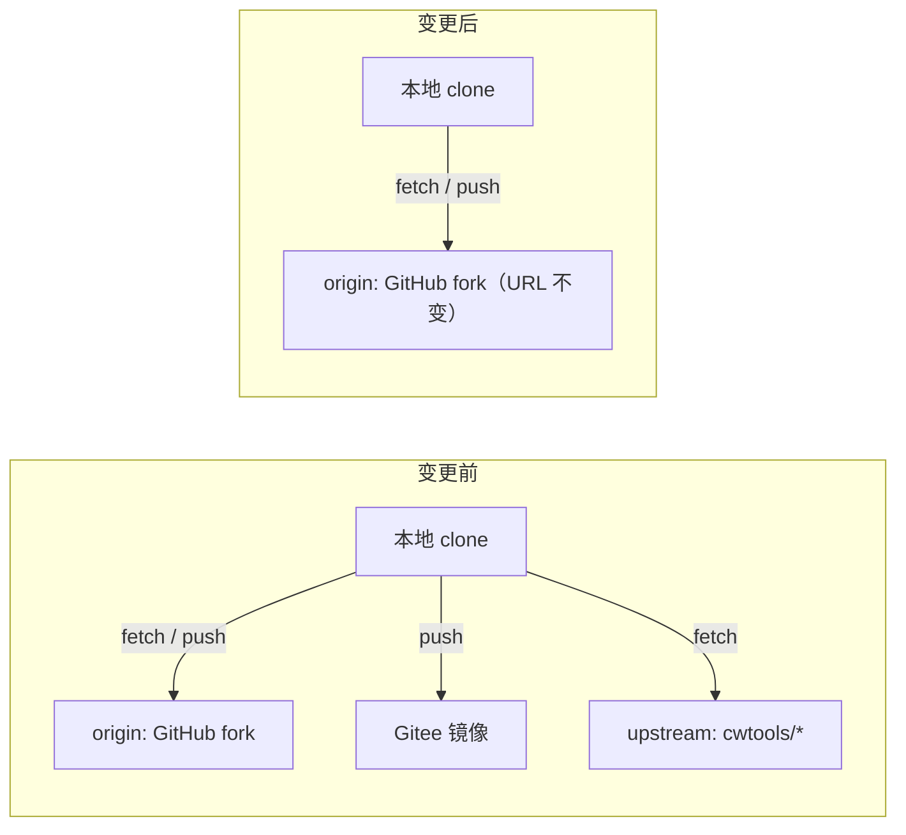

# Agent Note: 三个 fork 仓库脱离 fork 网络并移除 Gitee 镜像推送

Status: implemented

## Problem

主仓库 `cwtools-vscode` 与两个子模块仓库 `submodules/cwtools`、`submodules/cwtools-stellaris-config` 都是 `cwtools` 组织下同名仓库的 fork，本地同时配置了指向上游的 `upstream` 远程与指向 `cChen2422/*` 的 Gitee 镜像推送：

| 仓库 | fork 来源 | 变更前的远端 |
| --- | --- | --- |
| 根仓库 `cwtools-vscode` | `cwtools/cwtools-vscode` | `origin`（GitHub + Gitee 双 url）、`upstream`、`gitee` |
| `submodules/cwtools` | `cwtools/cwtools` | `origin`（GitHub + Gitee 双 url）、`upstream` |
| `submodules/cwtools-stellaris-config` | `cwtools/cwtools-stellaris-config` | `origin`（GitHub + Gitee 双 url）、`upstream`、`gitee` |

按本地缓存的跟踪引用，三者早已与上游实质分叉：根仓相对 `upstream/main` 领先 1303 个提交，`cwtools` 相对 `upstream/master` 领先 252 个，`cwtools-stellaris-config` 相对 `upstream/master` 领先 205 / 落后 182。继续以上游 fork 形态存在会带来 fork 网络共享、误推上游与 GitHub/Gitee 双远端漂移三类风险。

本次变更的硬约束：

1. 三个仓库的 URL 保持不变（`.gitmodules` 与项目内所有 URL 引用不允许改动）；
2. 根仓库与三个子模块之间的 gitlink、`.gitmodules` 关系不得改动。



## Decision

1. **本地远端收口（已完成）**：三个仓库分别执行 `git remote remove upstream`、`git remote remove gitee`，并用 `git remote set-url --delete origin <gitee url>` 去掉 `origin` 上的第二个 `url`。`submodules/cwtools-mcp` 本来就是 GitHub 单一 `origin`，未做改动。
2. **不修改任何 URL 引用**：URL 不变是本次「脱离 fork」方案的前提，因此 `.gitmodules`（3 处）、`client/extension/gameProfiles.ts:200`（Stellaris 远程规则地址）、`client/extension/updateChecker.ts:87/465`、`src/Main/Program.fs:2955`（诊断码帮助链接）、`package.ps1:311`、`release/package.json` 以及 README/CONTRIBUTING/docs 中的 `Aa728848/*` 链接全部保持原样。
3. **GitHub 侧 fork 关系由仓库属主操作**：GitHub 没有解除 fork 的自助 git 命令（官方文档存在《Detaching a fork》页面，公开资料普遍指向需通过 GitHub Support 工单解除；本机沙箱无法访问 github.com / docs.github.com，未逐字核对页面内容）。两条可行路径：
   - **路径 A（推荐，无数据丢失）**：向 GitHub Support 提交工单请求解除三个仓库的 fork 关联，保留 issues / PR / Releases / Actions 设置。
   - **路径 B（自助）**：在可访问 GitHub 的网络中先做镜像备份（`git clone --mirror <repo> <repo>-backup.git`）并确认本地已具备全部分支与标签 → 在网页删除 fork → 在同账号创建同名空仓库（URL 完全不变，且不要初始化 README）→ `git push origin --all` + `git push origin --tags` 回灌。

### 验证

- 三个仓库 `git remote -v` 均只剩 `origin` 的 GitHub 单一 fetch/push URL。
- `refs/remotes/upstream/*`、`refs/remotes/gitee/*` 随 `remote remove` 一并清理，`packed-refs` 与 `refs/remotes` 下已无 `upstream`/`gitee` 残留。
- 未触碰任何已跟踪文件：`.gitmodules`、子模块 gitlink、索引均无改动。

## Alternatives considered

1. **改 URL（新建独立仓库或改名）**：否决。项目内 `Aa728848/*` 引用 61 处，且涉及运行时与发布链路，改地址会引入大面积回归；同名重建即可在 URL 不变的前提下完成脱离。
2. **只删 Gitee 推送、保留 `upstream` 作为上游同步来源**：否决。与仓库独立演进的定位冲突（上游工作已在本地 fork 内推进数百个提交），且恢复成本极低。
3. **保留 Gitee 作为 fetch 兜底**：否决。用户明确选择只保留 GitHub；恢复方式见 Consequences。
4. **由本次会话直接删除并重建 GitHub 仓库**：不可行。沙箱内 `git ls-remote`/`gh` 被拒绝、github.com 与 api.github.com 解析到非公网地址，且属账号级不可逆操作，必须由属主确认执行。

## Consequences

- 本地不再能 `git fetch upstream` 对比上游差异（上游跟踪引用已删除）。恢复：`git remote add upstream <上游 URL> && git fetch upstream`。
- Gitee 镜像仓库（`cChen2422/*`）在 Gitee 侧保持原状，只是不再接收推送。恢复双推：`git remote set-url --add --push origin <gitee url>`。
- 在 GitHub 侧完成解除前，三个仓库仍是 fork 网络成员；这不影响本地开发、CI 与发布链路（所有 URL 未变）。
- 若走路径 B，必须保持默认分支名不变（根仓 `main`、`cwtools` 与 `cwtools-stellaris-config` 为 `master`），否则 `updateChecker.ts` 的 releases 查询与 Stellaris 规则数据路径会失配；重建后需按 tag 重新创建 GitHub Releases。
- 遗留问题（本次未处理）：`submodules/cwtools/.git` 是完整克隆目录而非 gitfile，使 `.git/modules/submodules/cwtools` 成为无人使用的孤儿配置（其 `origin` 仍指向 `cwtools/cwtools`）；建议后续用 `git submodule absorbgitdirs submodules/cwtools` 收编或对齐该配置。
- 环境备忘：本机仓库目录属主为 `BUILTIN/Administrators`，直接执行 git 会报 dubious ownership，需 `git -c safe.directory=*`；沙箱内 `git status`/`git ls-remote`/`gh` 会因管道或网络限制被拒，故本次仅在配置与引用层面完成验证。
- 踩坑记录：Gitee 地址是 `origin` 下的第二个 `url` 而非 `pushurl`，`git remote set-url --delete --push origin <url>` 会报 `fatal: could not unset 'remote.origin.pushurl'`，必须去掉 `--push`。

### 三个仓库的 URL 使用点（未来若必须改 URL，需同步修改）

| 位置 | 用途 |
| --- | --- |
| `.gitmodules` ×3 | 子模块克隆地址（根仓 ↔ 三个子模块的关系） |
| `client/extension/gameProfiles.ts:200` | Stellaris 远程 CWT 规则地址（远端规则健康检查与提示） |
| `client/extension/updateChecker.ts:87 / 465` | `api.github.com/repos/Aa728848/cwtools-vscode/releases/latest` 版本更新检查 |
| `src/Main/Program.fs:2955` | 诊断码文档帮助链接 |
| `package.ps1:311` | `gh release create --repo Aa728848/cwtools-vscode` 发布流程 |
| `release/package.json` | 市场条目的 repository / bugs / homepage |
| README.md / CONTRIBUTING.md / docs/marketplace-readme.md / release/README.md | 克隆、下载与问题反馈链接（`release/README.md` 为生成物） |
| 子模块 README（`cwtools-stellaris-config`、`cwtools-mcp`） | 跨仓库说明与规则指南链接 |
| `client/test/unit/gameProfiles.test.ts:59 / 200` | 规则地址格式与内容的回归断言 |

## 附录 A：GitHub 侧脱离 fork 网络的执行材料（2026-09-11 实测更新）

> **更正**：GitHub 现已提供自助解除入口（仓库 Settings → General → Danger Zone → **Leave fork network**），不再必须提工单。以下规则摘自官方文档源码 `github/docs:content/pull-requests/how-tos/work-with-forks/detaching-a-fork.md`（经 `gh api` 读取）。

### A.1 官方规则

- 自助解除的三个前提：仓库为 **public**、体积 **小于 1GB**、**没有任何子 fork（child forks）**。
- 解除后果（官方明示）：**issues、PR、wiki、star、watcher、评论、子 fork 等元数据均不保留**；git 提交元数据保留；**操作不可逆，无法重新加入 fork 网络**。
- 官方备选（Manual 路径）：`git clone --bare` → 删除 fork → 新建同名仓库 → 推送。

### A.2 三个仓库的资格核验（2026-09-11，来源 `gh api repos/<full_name>`）

| 仓库 | public | 体积 | 子 fork | 自助解除可用性 | 解除将丢失的元数据 |
| --- | --- | --- | --- | --- | --- |
| `Aa728848/cwtools-vscode` | 是 | 166 MB | **1**（`cowcat-box/cwtools-vscode`，2026-04-24 后再无推送） | **被阻断** | 1 个开放 issue、16 star |
| `Aa728848/cwtools` | 是 | 74 MB | 0 | 可用 | 无（0 issue / 0 star） |
| `Aa728848/cwtools-stellaris-config` | 是 | 7.4 MB | 0 | 可用 | 1 star |

三个仓库都没有指向上游的开放 PR，解除不会遗留悬空 PR。

### A.3 主仓库不能走「删除后重建」的原因

主仓库有 **100+ 个 Releases**（首屏 100 条中 99 条带资产），资产是各版本 `.vsix`（例如 `eddy-stellaris-cwt-1.8.2.vsix`）。这些资产只存在于 GitHub，删除仓库即永久丢失，历史版本下载链接也会失效。因此主仓库的推荐路径是：先让子 fork 持有者删除 `cowcat-box/cwtools-vscode`（或由 Support 处理该子 fork），再走自助解除。

### A.4 解除前需要备份的元数据

主仓库的开放 issue（解除后丢失）：

- **#6 `Compare with vanilla command not working`**，作者 `Aphyxia`，创建于 2026-08-17T07:41:06Z
- 正文：`VS Code is saying that vanilla path is not configured but it is and is valid.`
- 截图附件：`https://github.com/user-attachments/assets/46104de9-e482-496a-9e35-61124da8ede4`

### A.5 主仓库向 Support 提工单的草稿（仅当自助入口不可用时使用）

提交入口：https://support.github.com/request （需已登录 `Aa728848` 的浏览器会话；GitHub 未提供支持工单 API，`gh`/PAT 无法提交）

标题：

```text
Request to detach Aa728848/cwtools-vscode from the cwtools/cwtools-vscode fork network (keep repository and URL unchanged)
```

正文：

```text
Hello GitHub Support,

I own Aa728848/cwtools-vscode, and I would like it detached from the fork network of
cwtools/cwtools-vscode so that it becomes a standalone repository. Please do NOT delete or
rename it — the repository name and URL must stay exactly the same, because it is
referenced by an extension update checker and as a submodule parent.

The self-service "Leave fork network" option (Settings -> General -> Danger Zone) is not
available for this repository because it has one child fork attached:
cowcat-box/cwtools-vscode (dormant since 2026-04-24). I cannot remove that fork myself.

I cannot use the documented delete-and-recreate workaround either: this repository holds
100+ releases whose .vsix assets exist only on GitHub and must not be lost.

If it helps, my two other forks (Aa728848/cwtools, Aa728848/cwtools-stellaris-config) are
eligible for the self-service option and I will detach them myself.

Thank you,
Aa728848
```

### A.6 该操作没有 API

`gh api graphql` 列出的全部 mutation 中没有任何 fork 解除操作（只有企业与组织级的 forking 设置），官方文档也只描述 UI 步骤，因此该操作无法脚本化：只能人工在网页点击，或由 Support 执行。

## 关联

- 子模块指针与提交纪律见 `AGENTS.md` 的 Repository Boundaries 一节；本次未改变子模块归属与提交策略。