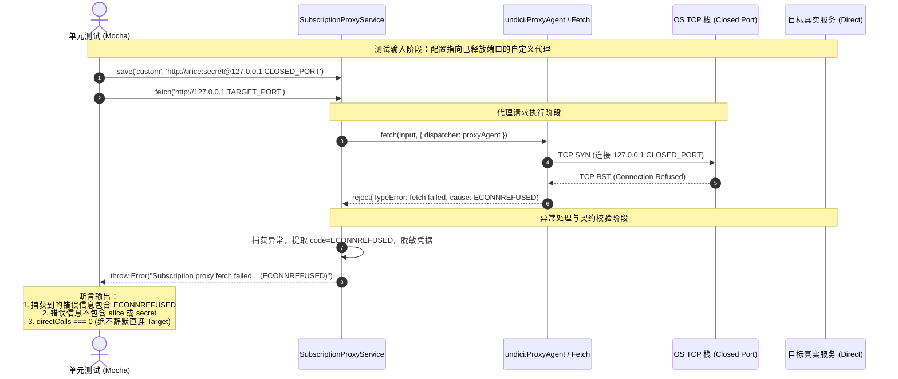

# Agent Note: Stabilize subscription proxy failure test across Linux and Windows

Status: implemented

## Problem
在 GitHub Actions CI（Linux `ubuntu-latest` 运行环境）中，单元测试任务 `TypeScript and unit tests` 持续在 `client/test/unit/subscriptionProxy.test.ts` 发生超时失败：
```
1) subscription proxy network transport
     reports proxy failure without falling back to the reachable destination or exposing credentials:
   Error: Timeout of 8000ms exceeded.
```
根本原因在于：该测试用例原先使用 `net.createServer(socket => socket.destroy())` 模拟代理失败。在 Linux 环境下，当服务端 accept 连接后立即 `socket.destroy()` 时，内核对接收缓冲区尚无数据的 socket 仅发出 TCP FIN（进入半关闭），而 undici 的 HTTP 连接池将此类连接重置视为可恢复的空闲 socket 关闭，因而持续尝试自动重连。由于该端口始终在监听并反复 accept/destroy，客户端陷入重连死循环，直至 Mocha 8000ms 超时强制退出。

## Decision
重构 `subscriptionProxy.test.ts` 中模拟代理连接失败的夹具逻辑：
通过探针（probe server）分配未占用的本地端口后立即释放（closed port），使得客户端发起的代理连接在内核层面直接被 RST 拒绝（产生 `ECONNREFUSED`）。
这一改进保证了在 Windows、Linux 以及 macOS 各平台上的一致行为，测试在几毫秒内即可确定性失败并校验错误契约（包含错误码、绝不泄露代理鉴权凭据、绝不回退至直连目标服务），彻底消除了平台差异导致的挂起问题。

### 执行流程对比与状态机

```mermaid
graph TD
    subgraph 原实现 (Linux CI 挂起)
        A1[Client: 发起代理请求] --> B1[Probe: Accept 连接]
        B1 --> C1[Server: socket.destroy]
        C1 -->|仅发送 FIN| D1[Client: 判定为可恢复的空闲 socket 关闭]
        D1 -->|undici 重试逻辑| A1
        D1 -.->|反复重试超时| E1[Mocha 8000ms 超时失败]
    end

    subgraph 新实现 (全平台秒级失败)
        A2[Client: 发起代理请求] --> B2[未监听端口 / Closed Port]
        B2 -->|OS 内核直接回复 TCP RST| C2[Client: 立即触发 ECONNREFUSED]
        C2 --> D2[Service.fetch: 拦截并转换为统一代理错误]
        D2 --> E2[Test: 验证凭据脱敏且无回退直连 (50ms 内通过)]
    end
```

### 输入输出流转图 (I/O Diagram)



## Alternatives considered
1. **大幅增加 Mocha 测试超时阈值**：未能解决根本问题；Linux 上客户端仍会在死循环中反复重试，造成测试执行耗时严重拖慢，且依然存在超时风险。
2. **模拟 HTTP 502/504 状态码响应**：这属于应用层/代理网关层失败，无法精确覆盖底层网络连接被拒绝（Connection refused / reset）的底层失败分支。

## Consequences
- 彻底解决 Linux CI 运行环境下 `npm run verify` 中单元测试由于 socket destroy 重试死循环而导致的 8s 超时问题。
- 测试执行时间从 8000ms+ 超时缩减至数十毫秒以内，保持跨平台一致性与稳定性。
