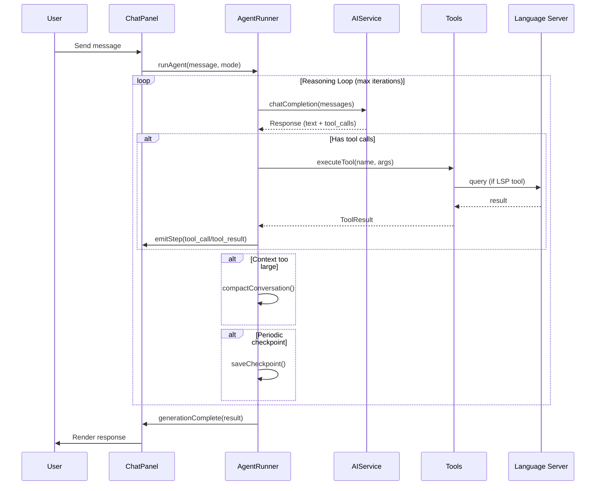
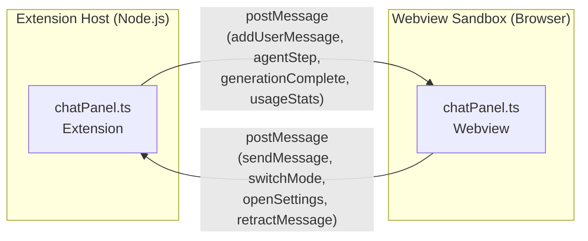

# Architecture

> **Eddy's Stellaris CWTools** — Advanced VS Code extension for Paradox Interactive game modding.

This document describes the system architecture, module relationships, and key design decisions for developers working on this codebase.

---

## High-Level Overview

The extension follows a **three-layer architecture**: a TypeScript VS Code **client** (frontend), a .NET/F# **Language Server** (backend), and sandboxed **Webview panels** for rich interactive UI.

```
┌─────────────────────────────────────────────────────────┐
│                    VS Code Extension Host                │
│                                                         │
│  ┌──────────────┐  ┌──────────────┐  ┌───────────────┐  │
│  │  Extension    │  │  AI Agent    │  │  GUI/Solar    │  │
│  │  Client       │  │  Module      │  │  Panels       │  │
│  │  (extension.ts)│  │  (ai/)      │  │  (guiPanel.ts)│  │
│  └──────┬───────┘  └──────┬───────┘  └──────┬────────┘  │
│         │                 │                  │           │
│         │    ┌────────────┴────────────┐     │           │
│         │    │      postMessage        │     │           │
│         │    │      (Webview IPC)      │     │           │
│         │    └────────────┬────────────┘     │           │
│         │                 │                  │           │
│  ┌──────┴─────────────────┴──────────────────┴────────┐  │
│  │               Webview Sandbox                       │  │
│  │  chatPanel.ts  │  guiPreview.ts  │  solarPreview.ts │  │
│  └────────────────────────────────────────────────────┘  │
└─────────────────────────┬───────────────────────────────┘
                          │ LSP (JSON-RPC over stdio)
                    ┌─────┴─────┐
                    │  F#/.NET  │
                    │  Language │
                    │  Server   │
                    └───────────┘
```

---

## Module Map

### 1. Extension Client (`client/extension/`)

| File | Responsibility |
|------|----------------|
| `extension.ts` | Main entry point. Registers commands, starts LSP client, creates panels |
| `guiPanel.ts` | GUI Preview Webview host — manages lifecycle, sends parsed data |
| `guiParser.ts` | Paradox `.gui` file AST parser — converts script to renderable tree |
| `solarSystemPanel.ts` | Solar System Visualizer host |
| `solarSystemParser.ts` | Solar system initializer parser |
| `ddsDecoder.ts` | DDS texture decoder (BC1/BC3/BC7) for GUI preview |
| `locDecorations.ts` | Localisation text indexing + inline decorations |
| `fileExplorer.ts` | Mod file tree view provider |
| `updateChecker.ts` | Extension version update notifications |

### 2. AI Agent Module (`client/extension/ai/`)

The AI subsystem is the largest module. Data flows in a cycle:

```
User Input → promptBuilder → aiService → agentRunner (reasoning loop)
    ↓                                         ↓
chatPanel ← postMessage ← steps/results ← tool execution
```

| File | Responsibility |
|------|----------------|
| **Core Loop** | |
| `agentRunner.ts` | Reasoning loop: Build/Plan/Explore/Review modes, tool dispatch, compaction, checkpointing, fallback |
| `aiService.ts` | HTTP client for all AI providers (OpenAI, Claude, Gemini, DeepSeek, MiniMax, GLM, Qwen, Ollama) |
| `promptBuilder.ts` | System prompt assembly — injects game knowledge, workspace context, tool definitions |
| `contextBudget.ts` | Token budget management — truncation, compaction triggers |
| **Provider Layer** | |
| `providers.ts` | Provider configs, model metadata, vision/FIM capability maps, Ollama detection, context window sizes |
| `pricing.ts` + `pricingData.json` | Per-model cost estimation |
| **Tool System** | |
| `tools/definitions.ts` | Tool JSON Schema definitions for the AI |
| `tools/fileTools.ts` | `read_file`, `write_file`, `edit_file`, `list_directory`, `search_mod_files` |
| `tools/lspTools.ts` | `query_scope`, `query_types`, `validate_code`, `get_completion_at`, `document_symbols` — with LRU+TTL cache |
| `tools/externalTools.ts` | `run_command`, `web_search` — with permission gating |
| `agentTools.ts` | Tool dispatch router — maps tool names to handler functions |
| `toolCallParser.ts` | Fallback parser for non-standard tool call formats (e.g., DeepSeek raw XML) |
| **UI & State** | |
| `chatPanel.ts` | VS Code Webview host — manages chat panel lifecycle, message routing, settings |
| `chatHtml.ts` | HTML template generator for chat panel |
| `chatInit.ts` | `/init` command — workspace scanning + CWTOOLS.md generation |
| `chatTopics.ts` | Conversation topic persistence (save/load/fork/archive) |
| `chatSettings.ts` | Settings persistence (provider, model, API keys) |
| **Support** | |
| `types.ts` | All TypeScript interfaces (ChatMessage, TokenUsage, ToolResult, AgentCheckpoint, etc.) |
| `messages.ts` | Centralized UI strings (i18n-ready) |
| `errorReporter.ts` | 3-tier error reporting: fatal → warn → debug |
| `usageTracker.ts` | Token usage persistence, stats aggregation, CSV/JSON export |
| `gameKnowledge.ts` | Stellaris domain knowledge injected into prompts |
| `memoryParser.ts` | Agent memory persistence across sessions |
| `mcpClient.ts` | Model Context Protocol client (stdio/SSE transports) |
| `inlineProvider.ts` | AI-powered inline code completion (FIM support) |
| `fileCache.ts` | File content LRU cache |
| `jsonRepair.ts` | Malformed JSON repair for AI responses |

### 3. Webview Scripts (`client/webview/`)

These run in **isolated browser sandboxes** — no Node.js or VS Code API access.

| File | Responsibility |
|------|----------------|
| `chatPanel.ts` + `chatPanel.css` | Chat UI: message rendering, markdown parser, virtual scroll, settings page |
| `guiPreview.ts` + `guiPreview.css` | Canvas-based GUI renderer — DDS/TGA textures, 9-slice sprites, drag-and-drop |
| `solarSystemPreview.ts` + `solarSystemPreview.css` | 3D solar system visualizer — orbit editing, celestial body placement |
| `svgIcons.ts` | Shared SVG icon library |
| `canvas.ts` | Canvas utility helpers |

### 4. F# Language Server (`src/LSP/`)

The language server provides syntax validation, auto-complete, go-to-definition, and semantic analysis for Paradox scripting languages. It uses the **CWTools** F# library (included as a Git submodule at `submodules/cwtools`).

### 5. Build System

| Command | What it does |
|---------|-------------|
| `npm run compile` | `tsc` compiles extension TS → `release/bin/`, then `rollup` bundles webview scripts |
| `npm run test` | Compile + run VS Code integration tests |
| `npm run test:unit` | Run unit tests via `ts-mocha` |
| `npm run lint` | ESLint on `client/` |
| `dotnet build` | Build F# language server |

---

## Key Data Flows

### AI Agent Reasoning Loop



### Webview Communication



> ⚠️ **Critical Rule**: Webviews cannot access `vscode` API or `require()`. All data exchange MUST go through `postMessage`.

---

## Design Decisions

### 1. Custom Markdown Renderer (not `marked`)
The chat panel uses a hand-written regex-based markdown parser instead of a library. This avoids:
- CSP violations from inline script injection
- Bundle size growth (~30KB for marked)
- Edge cases with Paradox-specific syntax in code blocks

### 2. Bounded LRU+TTL Cache for LSP Queries
LSP tools (query_scope, query_types) use a 128-entry LRU cache with 30s TTL. This prevents unbounded memory growth during long agent sessions where hundreds of unique queries would otherwise accumulate.

### 3. Fire-and-Forget Checkpointing
Agent checkpoints are saved with `void` (no await) to prevent adding latency to the reasoning loop. If disk I/O fails, the checkpoint is silently skipped — the agent continues uninterrupted.

### 4. Provider Fallback Routing
When the primary AI provider fails with a 5xx/timeout error, the agent automatically retries with a secondary provider from the `PROVIDER_FALLBACK` map. This is transparent to the user and ensures continuous service during model outages.

### 5. Exclusive File Locking for Write Tools
Write-capable tools (`edit_file`, `write_file`) acquire an exclusive lock before execution to prevent race conditions when parallel sub-agents are running. Read-only tools skip locking for performance.

### 6. Virtual Scroll with IntersectionObserver
Chat messages use `content-visibility: auto` with IntersectionObserver to skip layout/paint for off-screen DOM subtrees. This keeps 100+ message sessions performant without full DOM virtualization complexity.

---

## Security Model

- **CSP**: Webviews use strict Content-Security-Policy — no `eval()`, no inline scripts
- **API Keys**: Stored in VS Code's `SecretStorage` (OS keychain), never in plaintext
- **Command Execution**: `run_command` tool requires explicit user permission via UI card
- **File Writes**: Can be gated behind diff-confirmation mode in settings

---

## Directory Structure

```
cwtools-vscode/
├── client/
│   ├── extension/          # VS Code extension context (Node.js)
│   │   ├── ai/             # AI agent module (25+ files)
│   │   │   └── tools/      # Agent tool implementations
│   │   ├── extension.ts    # Main entry point
│   │   ├── guiPanel.ts     # GUI Preview host
│   │   └── solarSystemPanel.ts
│   ├── webview/             # Webview scripts (browser sandbox)
│   │   ├── chatPanel.ts     # Chat UI
│   │   ├── guiPreview.ts    # GUI renderer
│   │   └── solarSystemPreview.ts
│   ├── common/              # Shared utilities
│   ├── shared/              # Shared types
│   └── test/                # Tests
├── src/
│   └── LSP/                 # F# Language Server
├── submodules/
│   └── cwtools/             # CWTools F# library (git submodule)
├── release/
│   └── bin/                 # Compiled output
├── rollup.config.mjs        # Webview bundler config
├── tsconfig.extension.json  # Extension TypeScript config
└── tsconfig.webview-*.json  # Webview TypeScript configs
```
