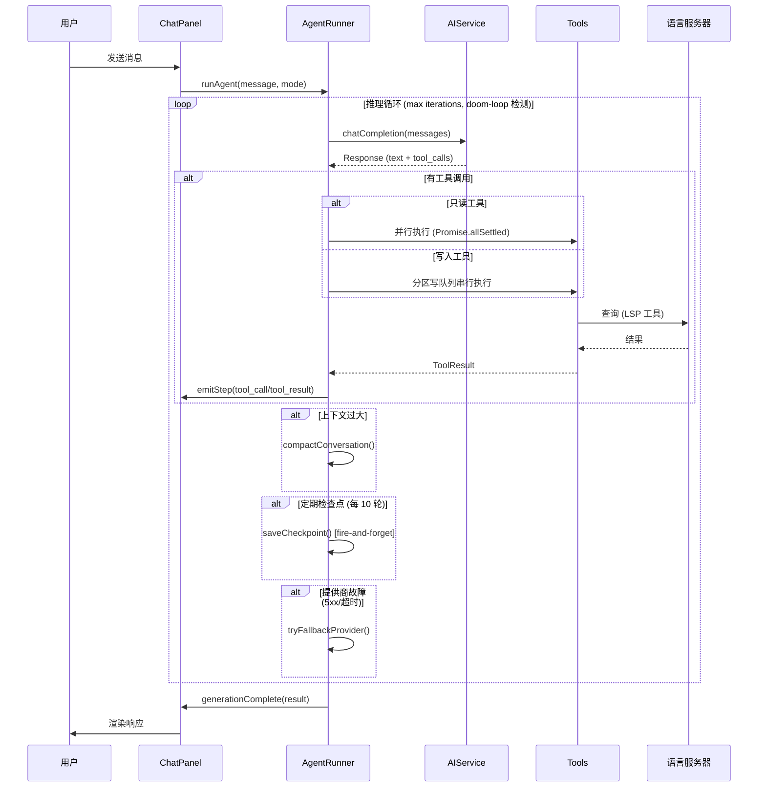
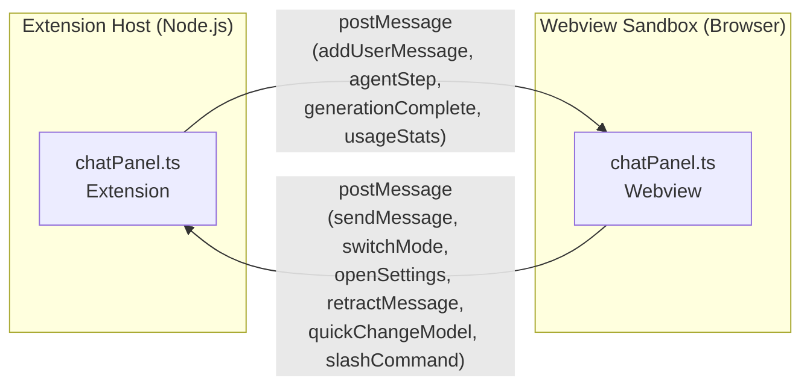
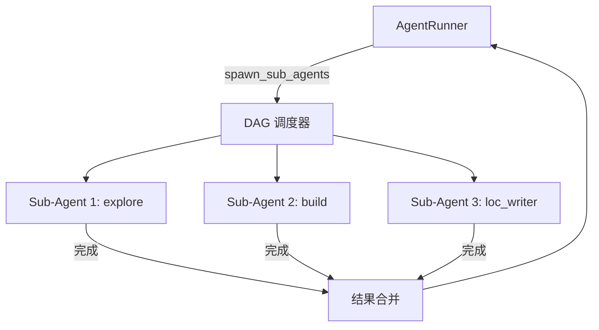

# 架构文档

> **Eddy's Stellaris CWTools** — 面向 Paradox Interactive 游戏 Modding 的高级 VS Code 扩展。

本文档描述系统架构、模块关系和关键设计决策，供开发者参考。

---

## 总体架构

扩展采用 **三层架构**：TypeScript VS Code **客户端**（前端）、.NET/F# **语言服务器**（后端）、以及沙盒化 **Webview 面板**（富交互 UI）。

```
┌──────────────────────────────────────────────────────────────────┐
│                     VS Code Extension Host                       │
│                                                                  │
│  ┌──────────────┐  ┌──────────────┐  ┌────────────────────────┐  │
│  │  Extension    │  │  AI Agent    │  │  Webview Panel Hosts   │  │
│  │  Client       │  │  Module      │  │  guiPanel.ts           │  │
│  │ (extension.ts)│  │  (ai/)       │  │  solarSystemPanel.ts   │  │
│  │              │  │              │  │  eventChainPanel.ts    │  │
│  │              │  │              │  │  techTreePanel.ts      │  │
│  └──────┬───────┘  └──────┬───────┘  └──────┬─────────────────┘  │
│         │                 │                  │                    │
│         │    ┌────────────┴────────────┐     │                    │
│         │    │      postMessage        │     │                    │
│         │    │      (Webview IPC)      │     │                    │
│         │    └────────────┬────────────┘     │                    │
│         │                 │                  │                    │
│  ┌──────┴─────────────────┴──────────────────┴─────────────────┐  │
│  │                     Webview Sandbox                          │  │
│  │ chatPanel │ guiPreview │ solarPreview │ eventChain │ techTree│  │
│  └─────────────────────────────────────────────────────────────┘  │
└──────────────────────────────┬───────────────────────────────────┘
                               │ LSP (JSON-RPC over stdio)
                         ┌─────┴─────┐
                         │  F#/.NET  │
                         │  Language │
                         │  Server   │
                         └───────────┘
```

---

## 模块地图

### 1. 扩展客户端 (`client/extension/`)

| 文件 | 职责 |
|------|------|
| `extension.ts` | 主入口。注册命令、启动 LSP 客户端、创建面板 |
| `guiPanel.ts` | GUI 预览 Webview 宿主 — 管理生命周期、发送解析数据 |
| `guiParser.ts` | Paradox `.gui` 文件 AST 解析器 — 将脚本转为可渲染树 |
| `solarSystemPanel.ts` | 星系可视化器宿主 |
| `solarSystemParser.ts` | 星系初始化器解析器 |
| `eventChainPanel.ts` | 事件链可视化器宿主 — BFS 扩展、命名空间过滤、源码跳转 |
| `eventChainParser.ts` | 事件链图解析器 — 解析事件/on_action/decision 引用关系 |
| `techTreePanel.ts` | 科技树可视化器宿主 — 按领域/层级筛选、前置科技关系图 |
| `techTreeParser.ts` | 科技树解析器 — 解析前置条件边和科技属性 |
| `codeActions.ts` | CodeActionProvider — 提供 "AI: 修复"、"AI: 解释" 快速操作 |
| `ddsDecoder.ts` | DDS 纹理解码器 (BC1/BC3/BC7) |
| `pdxTokenizer.ts` | 共享 PDX 脚本分词器 — 供 guiParser 和 solarParser 使用 |
| `exprEval.ts` | 安全的数学表达式求值器（用于 `@[...]` 表达式） |
| `locDecorations.ts` | 本地化文本索引 + 编辑器内联装饰 |
| `fileExplorer.ts` | Mod 文件树视图提供者 |
| `updateChecker.ts` | 扩展版本更新通知 |

### 2. AI Agent 模块 (`client/extension/ai/`)

AI 子系统是最大的模块（27+ 文件）。数据流：

```
用户输入 → promptBuilder → aiService → agentRunner (推理循环)
    ↓                                         ↓
chatPanel ← postMessage ← steps/results ← 工具执行
                                              ↓
                                   spawn_sub_agents (并行子代理)
```

#### 核心循环

| 文件 | 职责 |
|------|------|
| `agentRunner.ts` | 推理循环：Build/Plan/Explore/General/Review/LocTranslator/LocWriter 模式，工具分发，上下文压缩，检查点，回退，doom-loop 检测，分区写队列 |
| `aiService.ts` | 所有 AI 提供商的 HTTP 客户端（支持 16+ 提供商），SSE 流式传输，Anthropic Messages API 适配器 |
| `promptBuilder.ts` | 系统提示词组装 — 注入游戏知识、工作区上下文、工具定义、模式特化提示词 |
| `contextBudget.ts` | Token 预算管理 — 截断、压缩触发器、工具结果预算分配 |
| `diffEngine.ts` | 轻量级 Myers 行级 diff 算法 — 文件快照变更可视化 |

#### 提供商层

| 文件 | 职责 |
|------|------|
| `providers.ts` | 16+ 内置提供商配置（OpenAI, Claude, Gemini, DeepSeek, MiniMax, GLM, Qwen, MiMo, Ollama, SiliconFlow, OpenRouter, GitHub Models, Together AI, DeepInfra, OpenCode Zen），视觉/FIM 能力映射，上下文窗口大小，模型级 thinking 标记 |
| `pricing.ts` + `pricingData.json` | 按模型成本估算 |

#### 工具系统

| 文件 | 职责 |
|------|------|
| `tools/definitions.ts` | 工具 JSON Schema 定义（40+ 工具） |
| `tools/fileTools.ts` | `read_file`, `write_file`, `edit_file`, `multiedit`, `apply_patch`, `list_directory`, `glob_files`, `search_mod_files`, `codesearch`, `deploy_mod_asset` |
| `tools/lspTools.ts` | `query_scope`, `query_types`, `validate_code`, `get_completion_at`, `document_symbols`, `workspace_symbols`, `get_diagnostics`, `lsp_operation`, CWTools Deep API 工具（`query_definition`, `query_scripted_effects`, `query_enums`, `get_entity_info` 等）— LRU+TTL 缓存 |
| `tools/externalTools.ts` | `run_command`, `web_fetch`, `search_web`, `spawn_sub_agents`, 媒体工具（`mmx_generate_image`, `mmx_generate_video`, `mmx_generate_music`, `mmx_generate_speech`），资产转换（`convert_image_to_dds`, `convert_audio`），`mcp_call` — 权限控制 |
| `tools/replacerSuite.ts` | 8 种模糊匹配替换策略（移植自 OpenCode） — 确保 `edit_file` 在 AI 输出不精确时仍能匹配 |
| `agentTools.ts` | 工具分发路由 — 映射工具名称到处理函数 |
| `toolCallParser.ts` | 非标准工具调用格式回退解析器（DeepSeek DSML、Qwen `<tool_call>` 等） |
| `jsonRepair.ts` | 修复 AI 返回的格式不良 JSON |

#### UI 与状态

| 文件 | 职责 |
|------|------|
| `chatPanel.ts` | VS Code Webview 宿主 — 管理聊天面板生命周期、消息路由、设置 |
| `chatHtml.ts` | 聊天面板 HTML 模板生成器 |
| `chatInit.ts` | `/init` 命令 — 工作区扫描 + CWTOOLS.md 生成 |
| `chatTopics.ts` | 会话主题持久化（保存/加载/分叉/归档） |
| `chatSettings.ts` | 设置持久化（提供商、模型、API 密钥） |

#### 支持模块

| 文件 | 职责 |
|------|------|
| `types.ts` | 所有 TypeScript 接口（ChatMessage, TokenUsage, AgentCheckpoint, 40+ 工具类型等） |
| `messages.ts` | 集中化 UI 字符串（i18n 就绪） |
| `errorReporter.ts` | 3 级错误报告：fatal → warn → debug |
| `usageTracker.ts` | Token 使用持久化、统计聚合、CSV/JSON 导出 |
| `gameKnowledge.ts` | Stellaris 领域知识注入提示词 |
| `memoryParser.ts` | 代理记忆跨会话持久化 |
| `mcpClient.ts` | Model Context Protocol 客户端（stdio/SSE 传输） |
| `inlineProvider.ts` | AI 驱动的内联代码补全（FIM 支持），自动过滤 thinking 模型 |
| `fileCache.ts` | 文件内容 LRU 缓存 |

### 3. Webview 脚本 (`client/webview/`)

这些在 **隔离浏览器沙盒** 中运行 — 无 Node.js 或 VS Code API 访问。

| 文件 | 职责 |
|------|------|
| `chatPanel.ts` + `chatPanel.css` | 聊天 UI：消息渲染、Markdown 解析器、虚拟滚动、设置页、diff 视图、媒体播放 |
| `guiPreview.ts` + `guiPreview.css` | Canvas GUI 渲染器 — DDS/TGA 纹理、9-slice 精灵、拖放编辑 |
| `solarSystemPreview.ts` + `solarSystemPreview.css` | 3D 星系可视化器 — 轨道编辑、天体放置 |
| `eventChainPreview.ts` + `eventChainPreview.css` | 事件链可视化器 — Cytoscape.js 图渲染、ELK 自动布局、命名空间筛选、事件搜索 |
| `techTreePreview.ts` + `techTreePreview.css` | 科技树可视化器 — Cytoscape.js 图、领域/层级筛选、稀有科技标记 |
| `svgIcons.ts` | 共享 SVG 图标库 |
| `canvas.ts` | Canvas 工具函数 |

### 4. F# 语言服务器 (`src/LSP/`)

语言服务器提供语法验证、自动补全、跳转到定义和语义分析。使用 **CWTools** F# 库（Git 子模块 `submodules/cwtools`）。

| 文件 | 职责 |
|------|------|
| `LanguageServer.fs` | LSP 协议实现、自定义扩展请求处理 |
| `DocumentStore.fs` | 文档存储 — O(1) 文档查找 |
| `Parser.fs` | PDX 脚本解析器 |
| `Tokenizer.fs` | 词法分析器 |
| `Types.fs` | 类型定义和 CWTools 引擎集成 |
| `Ser.fs` | 序列化层 |

### 5. 构建系统

| 命令 | 描述 |
|------|------|
| `npm run compile` | `tsc` 编译扩展 TS → `release/bin/`，`rollup` 打包 5 个 Webview 脚本 |
| `npm run test` | 编译 + VS Code 集成测试 |
| `npm run test:unit` | 通过 `ts-mocha` 运行单元测试 |
| `npm run test:coverage` | 带覆盖率报告的单元测试 |
| `npm run lint` | ESLint 检查 `client/` |
| `dotnet build` | 构建 F# 语言服务器 |

---

## 关键数据流

### AI Agent 推理循环



### Webview 通信



### 子代理并行执行



> ⚠️ **关键规则**：Webview 无法访问 `vscode` API 或 `require()`。所有数据交换 **必须** 通过 `postMessage`。

---

## Agent 模式

| 模式 | 描述 | 工具权限 |
|------|------|---------|
| `build` | 完整构建模式（默认） | 所有工具 + 写文件 + 验证循环 |
| `plan` | 只读分析、结构化计划输出 | 只读工具 + todo_write |
| `explore` | 并行只读探索 | 只读 + CWTools Deep API |
| `general` | 研究模式，完整工具但无 todo | 所有工具 - todo_write |
| `review` | 代码审查模式 | 只读 + Deep API + query_definition |
| `gui_expert` | GUI 脚本专家子代理 | 继承父代理 |
| `script_reviewer` | 脚本审查专家子代理 | 继承父代理 |
| `loc_translator` | YML 本地化翻译模式 | 读写 + 搜索 + todo |
| `loc_writer` | YML 本地化编写模式 | 读写 + 搜索 + 查询 + todo |

---

## 设计决策

### 1. 自定义 Markdown 渲染器（非 `marked`）
聊天面板使用手写正则 Markdown 解析器。避免了：
- CSP 内联脚本注入违规
- 包体积增长（~30KB for marked）
- Paradox 特定语法在代码块中的边缘情况

### 2. 有界 LRU+TTL 缓存
LSP 工具使用 128 条目 LRU 缓存 + 30s TTL。防止长 Agent 会话中无界内存增长。

### 3. Fire-and-Forget 检查点
Agent 检查点以 `void`（无 await）保存，防止给推理循环增加延迟。磁盘 I/O 失败时静默跳过。

### 4. 提供商回退路由
主 AI 提供商 5xx/超时错误时，Agent 自动使用 `PROVIDER_FALLBACK` 映射中的备用提供商重试。对用户透明。

### 5. 分区写队列 (PartitionedWriteQueue)
替换全局单写队列。允许不同文件的并行写入，同时保持单文件内的顺序。多文件操作按路径字典序获取锁，防止 AB/BA 死锁。空闲队列 30s 后自动清理。

### 6. 虚拟滚动 + IntersectionObserver
聊天消息使用 `content-visibility: auto` + IntersectionObserver 跳过屏幕外 DOM 子树的布局/绘制。保持 100+ 消息会话流畅。

### 7. Doom-Loop 检测
两阶段方法：
- **阶段 1**：签名对追踪 — 相同 (prevSig, currSig) 对 ≥ 4 次触发阶段 2
- **阶段 2**：归一化结果哈希比较 — 相同哈希 = 原地打转 → 确认 doom-loop → 停止

### 8. 8 策略模糊替换器 (ReplacerSuite)
`edit_file` 使用 8 种递进模糊匹配策略（移植自 OpenCode），确保 AI 输出的不精确文本仍能定位到正确位置。

### 9. VLM 回退（非视觉提供商图片处理）
当提供商不支持视觉输入时，自动检测 MiniMax CLI (`mmx`) 并使用其 VLM 能力分析图片，将文本描述注入上下文。

### 10. 事务管理
写操作可以在虚拟文件系统覆盖层中暂存，通过 `commitTransaction` / `discardTransaction` 控制是否实际写入磁盘。

---

## 安全模型

- **CSP**：Webview 使用严格 Content-Security-Policy — 无 `eval()`、无内联脚本
- **API 密钥**：存储在 VS Code 的 `SecretStorage`（OS 密钥链），绝不明文存储
- **命令执行**：`run_command` 工具需要用户通过 UI 卡片显式授权
- **文件写入**：可通过设置启用 diff 确认模式
- **GLM JWT**：Zhipu API 密钥 (`{id}.{secret}`) 自动生成 HS256 JWT 令牌

---

## 目录结构

```
cwtools-vscode/
├── client/
│   ├── extension/              # VS Code 扩展上下文 (Node.js)
│   │   ├── ai/                 # AI Agent 模块 (27+ 文件)
│   │   │   ├── tools/          # Agent 工具实现
│   │   │   │   ├── definitions.ts    # 工具 JSON Schema
│   │   │   │   ├── fileTools.ts      # 文件操作工具
│   │   │   │   ├── lspTools.ts       # LSP 查询工具
│   │   │   │   ├── externalTools.ts  # 外部工具 (命令/网络/子代理/媒体)
│   │   │   │   └── replacerSuite.ts  # 模糊替换策略
│   │   │   ├── agentRunner.ts        # 核心推理循环
│   │   │   ├── aiService.ts          # 提供商 HTTP 客户端
│   │   │   ├── promptBuilder.ts      # 系统提示词组装
│   │   │   ├── chatPanel.ts          # 聊天 Webview 宿主
│   │   │   ├── providers.ts          # 16+ 提供商配置
│   │   │   ├── diffEngine.ts         # Myers diff 算法
│   │   │   └── ...
│   │   ├── extension.ts              # 主入口
│   │   ├── guiPanel.ts               # GUI 预览宿主
│   │   ├── solarSystemPanel.ts       # 星系可视化器宿主
│   │   ├── eventChainPanel.ts        # 事件链可视化器宿主
│   │   ├── techTreePanel.ts          # 科技树可视化器宿主
│   │   ├── codeActions.ts            # AI 快速修复 CodeActions
│   │   ├── pdxTokenizer.ts           # 共享 PDX 脚本分词器
│   │   └── exprEval.ts               # 数学表达式求值器
│   ├── webview/                # Webview 脚本 (浏览器沙盒)
│   │   ├── chatPanel.ts        # 聊天 UI (167KB)
│   │   ├── guiPreview.ts       # GUI Canvas 渲染器 (118KB)
│   │   ├── solarSystemPreview.ts  # 星系可视化器 (81KB)
│   │   ├── eventChainPreview.ts   # 事件链可视化器
│   │   ├── techTreePreview.ts     # 科技树可视化器
│   │   └── svgIcons.ts         # 共享图标库
│   └── test/                   # 测试
│       ├── unit/               # 单元测试 (7 个测试文件)
│       └── suite/              # 集成测试
├── src/
│   └── LSP/                    # F# 语言服务器
├── submodules/
│   └── cwtools/                # CWTools F# 库 (Git 子模块)
├── .agents/
│   ├── rules/                  # AI 编码指南
│   └── workflows/              # 自动化工作流
├── release/
│   └── bin/                    # 编译输出
├── rollup.config.mjs           # Webview 打包配置 (5 个入口)
├── tsconfig.extension.json     # 扩展 TypeScript 配置
├── tsconfig.webview-*.json     # 各 Webview 的 TypeScript 配置
├── eslint.config.mjs           # ESLint 平面配置 (异步安全规则)
└── global.json                 # .NET SDK 9.0 配置
```

---

## 支持的 AI 提供商

| 提供商 | API 兼容性 | 视觉支持 | FIM | 备注 |
|--------|-----------|---------|-----|------|
| OpenAI | OpenAI 原生 | ✅ | ❌ | gpt-5.x 系列 |
| Claude (Anthropic) | Anthropic Messages → 适配器 | ✅ | ❌ | 100 万 token 上下文 |
| Google Gemini | OpenAI 兼容 | ✅ | ❌ | 104 万 token 上下文 |
| DeepSeek | OpenAI 兼容 | ❌ | ✅ | V4 系列，支持 thinking |
| MiniMax (按量) | OpenAI 兼容 | ❌ | ❌ | M2.7 系列 |
| MiniMax (Token Plan) | Anthropic 兼容 | ❌ | ❌ | Token 套餐计费 |
| GLM (智谱) | OpenAI 兼容 + JWT | 部分 | ❌ | 仅 -v 后缀模型支持视觉 |
| Qwen (通义) | OpenAI 兼容 | 部分 | ❌ | 仅 VL 模型支持视觉 |
| MiMo (小米) | OpenAI 兼容 | ✅ | ❌ | 100 万 token 上下文 |
| MiMo Token Plan | OpenAI 兼容 | ✅ | ❌ | Token 套餐 |
| Ollama | OpenAI 兼容 | 取决模型 | ✅ | 本地模型自动检测 |
| SiliconFlow | OpenAI 兼容 | ❌ | ✅ | 硅基流动 |
| OpenRouter | OpenAI 兼容 | ✅ | ✅ | 多模型路由 |
| GitHub Models | OpenAI 兼容 | ✅ | ❌ | Azure 推理 |
| Together AI | OpenAI 兼容 | ❌ | ✅ | |
| DeepInfra | OpenAI 兼容 | ❌ | ✅ | |
| OpenCode Zen | OpenAI 兼容 | ✅ | ❌ | 托管网关，含免费模型 |
| 自定义 | OpenAI 兼容 | 可配 | 可配 | 用户自定义端点 |
