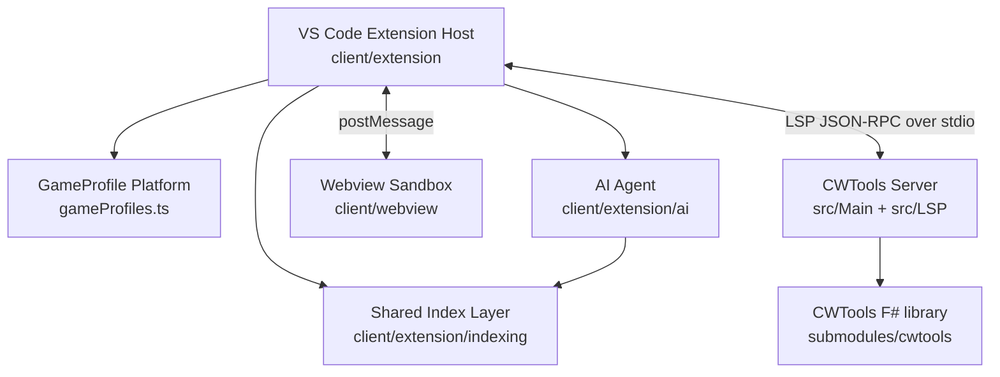
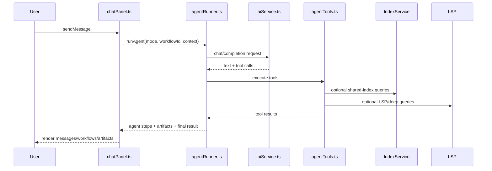

# 架构文档

本文档描述 **Eddy's Stellaris CWTools** 的当前架构、模块边界、数据流和维护约束。
项目是一个面向 Paradox 游戏 Modding 的 VS Code 扩展，主要增强 Stellaris 的语言服务、可视化预览和 AI 辅助开发能力。

版本号不在架构文档中重复维护；源码与发布清单分别以根目录 `package.json` 和 `release/package.json` 为准，并由 release gate 检查一致性。

## 总体结构

系统由四个运行层和两个共享平台能力组成：

1. VS Code Extension Host：`client/extension/`
2. AI Agent 子系统：`client/extension/ai/`
3. Webview 沙盒 UI：`client/webview/`
4. .NET/F# 语言服务器：`src/LSP/` 与 `src/Main/`
5. 共享平台能力：
   - `client/extension/gameProfiles.ts`
   - `client/extension/indexing/`


```mermaid
flowchart TD
    VS["VS Code Extension Host\nclient/extension"]
    GP["GameProfile Platform\ngameProfiles.ts"]
    IDX["Shared Index Layer\nclient/extension/indexing"]
    AI["AI Agent\nclient/extension/ai"]
    WV["Webview Sandbox\nclient/webview"]
    LSP["CWTools Server\nsrc/Main + src/LSP"]
    CW["CWTools F# library\nsubmodules/cwtools"]

    VS --> GP
    VS --> IDX
    VS --> AI
    VS <-->|postMessage| WV
    VS <-->|LSP JSON-RPC over stdio| LSP
    AI --> IDX
    LSP --> CW
```

Webviews 只能通过 `postMessage` 与 Extension Host 通信，不能直接访问 `vscode`、Node.js、`fs`、`path` 或 `require()`。

## Extension Host

`client/extension/` 运行在 VS Code 扩展宿主进程中，负责命令注册、LSP 客户端、文件系统访问、Webview 面板宿主、AI 面板宿主，以及共享平台能力的装配。

| 文件 | 作用 |
| --- | --- |
| `extension.ts` | 扩展入口，注册命令、启动语言服务器、创建 `IndexService` |
| `gameProfiles.ts` | 多游戏 profile 注册表、路径约定、能力开关和安装探测元数据 |
| `indexing/indexService.ts` | 共享增量索引服务 |
| `indexing/locParser.ts` | 本地化 YML 纯解析与查询 helper |
| `indexing/workspaceSymbolParser.ts` | PDXScript/asset/gui 符号解析、查询与引用提取 |
| `codeActions.ts` | AI 诊断修复、解释和批量修复 Code Actions |
| `guiPanel.ts` / `guiParser.ts` | `.gui` 文件解析与 Canvas 预览宿主 |
| `solarSystemPanel.ts` / `solarSystemParser.ts` | `solar_system_initializers/` 星系预览 |
| `eventChainPanel.ts` / `eventChainParser.ts` | 事件链扫描、BFS 子图、源码跳转 |
| `techTreePanel.ts` / `techTreeParser.ts` | 科技树扫描、筛选和依赖图 |
| `entityPanel.ts` / `entityAssetParser.ts` | `.asset` 实体模型预览宿主和资源解析 |
| `graphicsFeatures.ts` | 图形资源相关编辑器功能 |
| `ddsDecoder.ts` | DDS/TGA 解码支持 |
| `locDecorations.ts` | 基于 `IndexService` 的本地化 hover/definition 和装饰 |
| `fileExplorer.ts` | Mod 文件树视图 |
| `vanillaCompare.ts` | 与原版文件比较 |
| `updateChecker.ts` | 更新检查 |
| `pdxTokenizer.ts` | PDX 脚本共享分词器 |
| `exprEval.ts` | `@[...]` 数学表达式安全求值 |

## 共享平台与索引层

### GameProfile 平台

`gameProfiles.ts` 负责把多游戏差异集中到 profile 中，而不是散落在 extension、索引和 AI 代码里。当前 profile 描述：

- 语言 ID 与文件扩展名
- 原版缓存配置键
- 本地化目录、编码和语言标签
- 脚本/GUI/GFX 目录约定
- 预览能力开关
- AI 知识块映射
- Steam 安装探测元数据

扩展入口、索引层和 AI 游戏知识都应优先消费 profile helper。

### IndexService

`IndexService` 是 editor features 和 AI tools 共用的知识层：

- 本地化 key 在激活阶段即刻建立索引，用于 hover、definition 和 AI 查询。
- 更重的 workspace/vanilla symbol 索引通过 `ensureWorkspaceSymbolsReady()` 懒加载，避免拖慢启动。
- 符号层支持 `.txt`、`.gfx`、`.asset`、`.gui`，记录 `origin`、`updatedAt`、`fileVersion` 和轻量引用。
- watcher 对 `.yml` 与 symbol 文件做增量更新；symbol 索引闲置后会回收。
- AI 通过 `query_localisation_index` 和 `query_workspace_index` 消费共享索引。

该层的核心约束是：当共享索引能回答问题时，不要让每个消费者各自重新扫描工作区。

## AI Agent 子系统

AI 代码位于 `client/extension/ai/`，由聊天宿主、模型提供商、提示词构建、工具系统、workflow 系统、执行循环和多 Agent 协作层组成。

### 核心数据流


```mermaid
sequenceDiagram
    participant User as User
    participant Chat as chatPanel.ts
    participant Runner as agentRunner.ts
    participant Service as aiService.ts
    participant Tools as agentTools.ts
    participant Index as IndexService
    participant LSP as LSP

    User->>Chat: sendMessage
    Chat->>Runner: runAgent(mode, workflowId, context)
    Runner->>Service: chat/completion request
    Service-->>Runner: text + tool calls
    Runner->>Tools: execute tools
    Tools->>Index: optional shared-index queries
    Tools->>LSP: optional LSP/deep queries
    Tools-->>Runner: tool results
    Runner-->>Chat: agent steps + artifacts + final result
    Chat-->>User: render messages/workflows/artifacts
```

### 核心文件

| 文件 | 作用 |
| --- | --- |
| `agentRunner.ts` | 推理循环、工具权限、workflow 应用、上下文压缩、检查点、回退 |
| `runner/compaction.ts` | 历史压缩与上下文窗口辅助 |
| `runner/checkpoint.ts` | 断点恢复元数据 |
| `runner/writeCoordinator.ts` | `PartitionedWriteQueue` 写入协调 |
| `runner/fallbackPolicy.ts` | 模型备选字典及 API 报错备选重试管理 |
| `runner/cancellation.ts` | 大模型生成终止判定与异常抛出 |
| `runner/stepEmitter.ts` | 细粒度步骤与 Token 增量流式实时广播 |
| `runner/toolScheduler.ts` | 工具运行排它锁及跨平台路径安全规约 |
| `runner/doomLoopDetector.ts` | 基于 FNV-1a 哈希的两阶段防死循环语义检测 |
| `chat/bridge.ts` | 隔离沙盒 WebView 与 Extension Host 的高内聚通信桥接器 |
| `agentSessionCoordinator.ts` | chat / manager 共用会话状态、模式、workflow、live steps |
| `agentUiBroadcaster.ts` | 多 Webview surface 广播与定向发送 |
| `artifactStore.ts` | Agent Artifact 的会话级存储、排序和稳定 ID |
| `agentManagerHtml.ts` | detached Agent Manager 面板 HTML 模板 |
| `agentTools.ts` | 工具分发、工具超时、共享黑板和 orchestrator 工具入口 |
| `tools/registry.ts` | 工具注册、模式门控、读写分类、子 Agent 允许策略 |
| `aiService.ts` | 各 AI Provider HTTP/SSE 客户端、请求适配和回退 |
| `providers.ts` | Provider facade，聚合默认配置、能力和价格 |
| `providers/models/` | 默认模型、vision/FIM/context 能力、价格表 |
| `promptBuilder.ts` | Prompt facade、项目上下文、记忆和技能注入 |
| `prompt/sections/` | 基础规则和各模式系统提示词构建函数 |
| `workflowRegistry.ts` | workflow 元数据、工具策略和阶段定义 |
| `workflowI18n.ts` / `workflowViewModel.ts` | workflow 的本地化与 UI 视图模型 |
| `types.ts` | 消息、工具、模式、上下文、Artifact、设置类型 |
| `contextBudget.ts` | Token 预算和工具结果裁剪 |
| `contextReferences.ts` | `@file`、`@folder`、`@symbol`、`@blackboard` 引用解析 |
| `chatPanel.ts` / `chatHtml.ts` | Extension 侧聊天宿主与 Webview HTML 模板 |
| `chatSettings.ts` / `chatTopics.ts` | AI 设置和会话主题持久化 |
| `inlineProvider.ts` | AI 内联补全 |
| `mcpClient.ts` | MCP stdio/SSE 客户端 |
| `toolCallParser.ts` | DeepSeek DSML、Qwen `<tool_call>` 等非标准工具调用解析 |
| `jsonRepair.ts` | 修复不完整或格式不良的 JSON |
| `usageTracker.ts` | Token 和成本统计 |
| `memoryParser.ts` | 跨会话记忆解析 |

### Agent 模式

`AgentMode` 定义在 `client/extension/ai/types.ts`：

| 模式 | 用途 |
| --- | --- |
| `build` | 默认构建模式，允许读写和验证 |
| `plan` | 计划模式，只读为主，可写设计蓝图 |
| `explore` | 只读探索和 CWTools 查询 |
| `general` | 为旧会话保留的兼容模式 |
| `utility` | 非 PDXScript 的脚本、工具和工作区任务 |
| `review` | 只读审查模式 |
| `gui_expert` | GUI 专家子 Agent |
| `script_reviewer` | 脚本审查子 Agent |
| `loc_translator` | 本地化翻译 |
| `loc_writer` | 本地化创作 |
| `orchestrator` | 多 Agent 协作调度 |

### Workflow 系统

`workflowRegistry.ts` 当前注册 5 个 workflow：

| Workflow | 模式 | 作用 |
| --- | --- | --- |
| `diagnostic-fix` | `build` | 修复 CWTools 诊断 |
| `loc-generation` | `build` | 生成缺失本地化 |
| `event-chain-design` | `plan` | 设计事件链蓝图 |
| `rules-sync-review` | `review` | 规则同步后的诊断复核 |
| `asset-wiring` | `build` | 修复 sprite / sound 资产引用 |

Runner 会在模式工具集基础上继续应用 workflow tool policy，并把 workflow prompt supplement 注入系统提示词。聊天 UI 通过 `workflowViewModel.ts`、`workflowI18n.ts` 和 webview workflow 模块展示当前 workflow、阶段和验证要求。

### 工具系统

工具定义集中在 `client/extension/ai/tools/definitions.ts`，当前定义超过 50 个工具。

| 文件 | 作用 |
| --- | --- |
| `tools/definitions.ts` | 工具 JSON Schema |
| `tools/registry.ts` | 工具注册表、模式门控、`WRITE_TOOLS` / `READ_ONLY_TOOLS` |
| `tools/permissions.ts` | 工具模式、写权限和子 Agent 沙盒访问校验 |
| `tools/argRepair.ts` | 工具调用参数名修复、类型转换和默认推断 |
| `tools/fileTools.ts` | 文件读写、精确替换、补丁、本地化写入、资产部署 |
| `tools/lspTools.ts` | LSP 查询、诊断、CWTools Deep API、缓存 |
| `tools/externalTools.ts` | 命令、网络搜索、媒体生成/转换、外部资源 |
| `tools/memoryTools.ts` | 内存与黑板操作的物理存储及 I/O 交互逻辑 |
| `tools/replacerSuite.ts` | 通用文本替换的多策略匹配 |
| `agentTools.ts` | 工具名称到实现的路由 |
| `types.ts` | Args / Result 契约 |

新增工具时必须同步更新：

1. `tools/definitions.ts`
2. `types.ts`
3. `tools/registry.ts`
4. `tools/permissions.ts`（如果访问策略变化）
5. `agentTools.ts`

当前注意事项：

- `tools/registry.ts` 是工具读写分类和 mode gating 的事实来源。
- `tools/permissions.ts` 从 registry 读取权限元数据，统一执行 mode/sub-agent 访问校验。
- `tools/argRepair.ts` 在 Runner 执行工具前修复常见参数名和类型漂移。
- `write_file`、`multi_replace_file_content`、`replace_lines`、`apply_patch`、`write_localisation` 等写工具经由 `PartitionedWriteQueue` 管理。
- `todo_write` 是纯内存/UI 计划工具，故意不进入写文件锁。
- `.yml` 本地化文件必须使用 `write_localisation`；通用写工具会拒绝本地化写入。
- 对 PDXScript 先优先使用 `query_workspace_index`、`document_symbols`、`get_pdx_block`、`get_file_context` 等结构化读取工具，再退回到原始文本读取。
- `run_command` 带权限门控，适合作为执行和兜底通道，不应替代结构化读取路径。
- 当前多 Agent 调度工具是 `dispatch_agents`，配套 `query_blackboard` 和 `merge_results`。

### Orchestrator

`client/extension/ai/orchestrator/` 管理 DAG 子任务、多 Agent 并行、共享黑板、冲突检测和质量门。

| 文件 | 作用 |
| --- | --- |
| `agentRegistry.ts` | 子 Agent 角色、模式、预算和默认配置 |
| `blackboard.ts` | 跨 Agent 共享数据，支持 key/prefix/type 查询 |
| `taskGraphEngine.ts` | DAG 构建、拓扑排序、就绪节点和循环检测 |
| `parallelExecutor.ts` | 按依赖批次并行执行子任务 |
| `orchestrator.ts` | 调度入口、上下文注入、质量门整合 |
| `conflictDetector.ts` | 基于黑板的写意图和实体注册冲突检测 |
| `qualityGate.ts` | 审查和自动修复流程 |

已注册角色包括 `explorer`、`architect`、`builder`、`locWriter`、`reviewer`、`assetGen`、`guiExpert` 和 `locTranslator`。

## Webview 层

`client/webview/` 编译为浏览器端脚本。Rollup 打包 7 个入口：

| 入口 | 相关文件 | 作用 |
| --- | --- | --- |
| `chatPanel.ts` | `chatPanel.css`, `chat/`, `messageRenderer.ts`, `svgIcons.ts` | AI 聊天 UI、workflow、设置、Artifact、计划卡、diff 展示 |
| `agentManager.ts` | `agentManager.css`, `chatPanel.ts`, `chat/` message contracts | Detached Agent Manager，查看 agents、artifacts、tasks |
| `guiPreview.ts` | `guiPreview.css`, `canvas.ts` | `.gui` Canvas 预览、拖拽编辑、DDS/TGA 显示 |
| `solarSystemPreview.ts` | `solarSystemPreview.css` | 星系、轨道、行星和环世界交互预览 |
| `eventChainPreview.ts` | `eventChainPreview.css` | Cytoscape.js 事件引用图 |
| `techTreePreview.ts` | `techTreePreview.css` | Cytoscape.js 科技依赖图 |
| `entityPreview.ts` | `entityPreview.css`, `meshWorker.ts`, `pdxMeshParser.ts`, `pdxShaders.ts` | Three.js 实体模型、网格、动画和材质渲染 |

`client/webview/chat/` 已拆出：

- `artifacts.ts` / `artifactDrawer.ts`
- `topics.ts` / `topicViews.ts`
- `workflows.ts` / `workflowSelector.ts`
- `formatters.ts`
- `i18n.ts`
- `modes.ts`
- `slashCommands.ts`
- `settingsOverview.ts`
- `liveSteps.ts`
- `markdown.ts`
- `annotations.ts`
- `contextMentions.ts`
- `messages.chat.ts`
- `messages.manager.ts`
- `messages.shared.ts`

`client/test/unit/webviewSmoke.test.ts` 当前承担 chat Webview 与 Agent Manager 的结构契约 smoke 检查，为后续真实浏览器回归提供基础。

Webview 维护规则：

- 不要导入 Node.js 模块或 `vscode`。
- 所有数据通过 `postMessage` 从 Extension Host 注入。
- CSS 使用 VS Code 主题变量。
- 动画支持 `prefers-reduced-motion`。
- WebGL/Three.js 必须在销毁时释放资源。

## F# / .NET 后端

后端使用 .NET 9。`global.json` 当前固定 SDK `9.0.300`，允许 `latestMinor` roll-forward。

| 路径 | 作用 |
| --- | --- |
| `src/LSP/` | LSP 协议、文档存储、解析和序列化 |
| `src/Main/` | `CWTools Server` 可执行入口、游戏加载、补全、特性桥接 |
| `src/Languages/` | 本地化资源 |
| `src/CSharpExtensions/` | C# 辅助扩展 |
| `submodules/cwtools/` | 上游 CWTools F# 库子模块 |

`src/Main/Main.fsproj` 默认引用 `submodules/cwtools/CWTools/CWTools.fsproj`。
如需使用本地 CWTools，可在 `src/Main/cwtools.local.props` 中设置 `UseLocalCwtools=True` 和 `CwtoolsPath`。

## 构建系统

根目录 `package.json`：

| 命令 | 作用 |
| --- | --- |
| `npm run compile` | TypeScript 扩展编译 + Rollup Webview 打包（7 个入口） |
| `npm run lint` | ESLint 9 检查 `client/` |
| `npm run test:unit` | `ts-mocha` 单元测试 |
| `npm run test:coverage` | `nyc` 覆盖率运行单元测试 |
| `npm run test` | 编译后运行 VS Code 集成测试 |
| `npm run check:release` | 发布前质量门 |
| `npm run verify` | `lint + compile + unit + release gate` 综合验证 |

与规则同步相关的脚本：

- `npm run rules:stellaris`
- `npm run rules:stellaris:scan`
- `npm run rules:stellaris:check`
- `npm run rules:stellaris:update`

.NET 常用命令：

```bash
dotnet build src/LSP/
dotnet build src/Main/
```

便捷脚本：

- `build.cmd`
- `build.sh`
- `build.nu`

这些脚本会恢复 dotnet tools、初始化子模块，并调用 `dotnet run --project build -- -t ...`。

CI 当前由 `.github/workflows/ci.yml` 执行 `npm run verify`。

## 打包

打包流程记录在 `.agents/workflows/package.md`。当前 release 包从 `release/package.json`
生成，并在 `release/` 目录中执行：

```powershell
npx @vscode/vsce package
```

打包前需要准备 TypeScript/Webview 输出和三平台服务端输出。不要引用根目录 `package.ps1`，当前仓库没有该脚本。

## 关键设计约束

### Webview 隔离

Webview 与 Extension Host 是不同运行环境。Webview 只能发送消息，不能直接访问工作区文件、VS Code API 或 Node.js。

### 写入并发

`PartitionedWriteQueue` 按目标文件串行化写入，不同文件可并行。多文件写入应按路径字典序获取锁，避免 AB/BA 死锁。

### 本地化写入

本地化文件通常需要 BOM、语言头和 key 更新语义。AI 工具层强制使用 `write_localisation`，不要用通用文本替换写 `.yml`。

### 共享索引优先

共享索引已经承担 localisation 和 workspace symbol 查询。新的消费者优先复用 `IndexService`，而不是各自新增目录遍历和全文扫描。

### 提供商兼容

`aiService.ts` 负责不同 Provider 的请求兼容：

- Claude 使用 Anthropic Messages API 适配。
- GLM 使用 `{id}.{secret}` 生成 HS256 JWT。
- DeepSeek/Qwen 等非标准工具调用由 `toolCallParser.ts` 回退解析。
- 不支持 `tool_choice` 的 Provider 会进行请求清理。

### 内存和性能

项目会扫描大型 Mod 和原版资源：

- LSP、索引和工具查询必须使用有界缓存。
- workspace symbol 索引采用懒加载和闲置回收。
- Webview 大列表使用虚拟化或 `content-visibility`。
- Three.js、纹理、worker 和事件监听器必须显式清理。

### 错误处理与 i18n

Extension/AI 代码优先使用 `ErrorReporter`，避免裸 `console.error`。用户可见中文文本尽量集中在：

- `client/extension/ai/messages.ts`
- `client/extension/ai/workflowI18n.ts`
- `client/webview/chat/i18n.ts`
- `client/webview/chat/messages.*.ts`

## 目录概览

```text
cwtools-vscode/
  client/
    extension/
      ai/
        orchestrator/
        runner/
        chat/
        tools/
        prompt/
          sections/
        providers/
          models/
        agentRunner.ts
        agentTools.ts
        agentSessionCoordinator.ts
        agentUiBroadcaster.ts
        artifactStore.ts
        agentManagerHtml.ts
        workflowRegistry.ts
        workflowViewModel.ts
        workflowI18n.ts
      indexing/
        indexService.ts
        locParser.ts
        workspaceSymbolParser.ts
      extension.ts
      gameProfiles.ts
      guiPanel.ts
      solarSystemPanel.ts
      eventChainPanel.ts
      techTreePanel.ts
      entityPanel.ts
      codeActions.ts
    webview/
      chat/
      agentManager.ts
      agentManager.css
      chatPanel.ts
      messageRenderer.ts
      guiPreview.ts
      solarSystemPreview.ts
      eventChainPreview.ts
      techTreePreview.ts
      entityPreview.ts
      meshWorker.ts
      pdxMeshParser.ts
      pdxShaders.ts
    test/
      unit/
      suite/
  src/
    LSP/
    Main/
    Languages/
    CSharpExtensions/
  submodules/
    cwtools/
  .agents/
    rules/
    workflows/
  .github/
    workflows/
  release/
    bin/
  rollup.config.mjs
  eslint.config.mjs
  global.json
```
