# Architecture / 架构

[English](#english) | [中文](#zh-cn) | [Project overview / 项目介绍](README.md) | [Contributing / 贡献指南](CONTRIBUTING.md) | [CWT rules / CWT 规则](docs/cwt-rule-config.md) | [Diagnostic codes / 诊断码](docs/diagnostic-codes.md) | [AI instructions](AGENTS.md)

## English

This document explains the runtime boundaries, shared services, and maintenance rules of Stellaris Language Serves. It is a map for deciding where a change belongs and which neighbouring components must be checked.

Version numbers are intentionally absent. Root `package.json` and `release/package.json` are the sources of truth.

### Runtime overview

The extension has three live processes or sandboxes, plus shared source and data repositories:

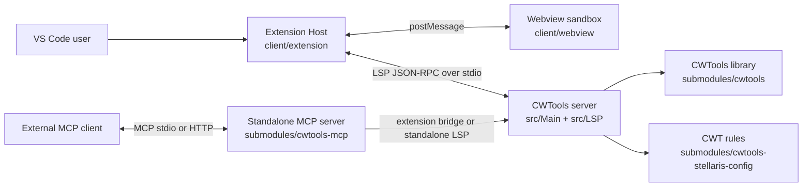
```mermaid
flowchart LR
    USER["VS Code user"]
    HOST["Extension Host\nclient/extension"]
    WEB["Webview sandbox\nclient/webview"]
    LSP["CWTools server\nsrc/Main + src/LSP"]
    CW["CWTools library\nsubmodules/cwtools"]
    RULES["CWT rules\nsubmodules/cwtools-stellaris-config"]
    MCP["Standalone MCP server\nsubmodules/cwtools-mcp"]
    EXT["External MCP client"]

    USER --> HOST
    HOST <-->|"postMessage"| WEB
    HOST <-->|"LSP JSON-RPC over stdio"| LSP
    LSP --> CW
    LSP --> RULES
    EXT <-->|"MCP stdio or HTTP"| MCP
    MCP -->|"extension bridge or standalone LSP"| LSP
```

The important boundary is the Extension Host. It owns VS Code APIs, filesystem access, process startup, secrets, commands, and Webview lifecycle. Webviews only render and collect interaction. The F# server owns Paradox syntax and semantic analysis.

### Extension Host

`client/extension/` starts in the VS Code Extension Host process. Its main responsibilities are:

- activating commands and configuration;
- starting and supervising the language client;
- reading and writing workspace resources through VS Code APIs;
- creating visual-editor and AI Webviews;
- maintaining shared indexes and game-profile information;
- translating Webview messages into validated host operations.

Useful entry points:

| Area | Files or directories |
| --- | --- |
| Activation and commands | `client/extension/extension.ts` |
| Game capabilities | `client/extension/gameProfiles.ts` |
| Shared indexes | `client/extension/indexing/` |
| Path and extension helpers | `pathScope.ts`, `fileExtensions.ts`, `fsCaseInsensitive.ts` |
| Visual-editor hosts | `*Panel.ts`, `staticGalaxyEditorProvider.ts` |
| Vanilla comparison | `vanillaCompare.ts` |
| AI runtime | `client/extension/ai/` |

Host code must validate Webview messages and other external input before acting on it. Path operations should use the shared containment and case-handling helpers rather than open-coded prefix checks.

### Shared game profiles and indexes

`gameProfiles.ts` describes differences between supported games: language IDs, folders, localisation formats, installation hints, feature flags, and generated metadata. A feature that varies by game should ask the active profile instead of assuming Stellaris conventions.

`client/extension/indexing/` supplies project knowledge that is useful outside the F# semantic model, including localisation and workspace-symbol queries. The indexes are incremental and shared by UI and AI features.

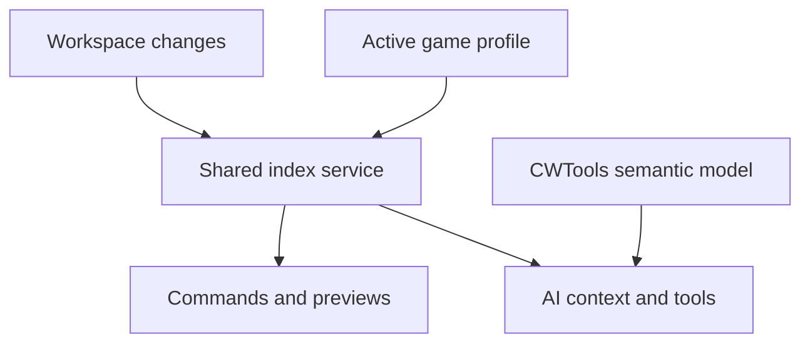
```mermaid
flowchart TD
    WATCH["Workspace changes"] --> INDEX["Shared index service"]
    PROFILE["Active game profile"] --> INDEX
    INDEX --> UI["Commands and previews"]
    INDEX --> AI["AI context and tools"]
    LSP["CWTools semantic model"] --> AI
```

Keep these caches bounded. Sort filesystem-derived results where callers or tests depend on stable order. A project index may report partial or stale coverage; callers must preserve that status instead of presenting incomplete data as complete.

### Webview sandbox

`client/webview/` is bundled by Rollup and runs in VS Code's browser sandbox. It contains the chat interface and the GUI, solar-system, static-galaxy, event, technology, entity, and particle views.

The communication pattern is always:

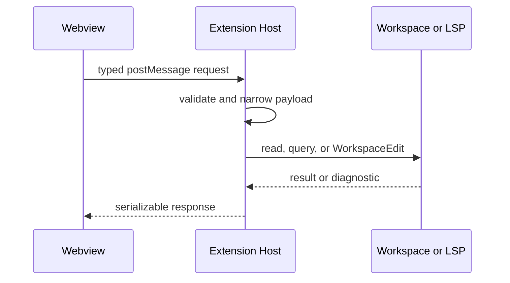
```mermaid
sequenceDiagram
    participant W as Webview
    participant H as Extension Host
    participant F as Workspace or LSP

    W->>H: typed postMessage request
    H->>H: validate and narrow payload
    H->>F: read, query, or WorkspaceEdit
    F-->>H: result or diagnostic
    H-->>W: serializable response
```

Webview code must not import `vscode`, `fs`, `path`, use `require()`, or call Node-only APIs. It uses VS Code theme variables, supports reduced motion, and disposes renderers, workers, event listeners, GPU objects, textures, and animation loops when a panel closes.

Source write-back belongs in the host. Visual editors should produce minimal `WorkspaceEdit`s so native undo, dirty state, and file-watch behaviour remain correct.

### Language server

The server is split into two root projects:

- `src/LSP/` provides the reusable Language Server Protocol and parsing-facing layer.
- `src/Main/` assembles the CWTools server executable and game integration.

Most Paradox semantics come from `submodules/cwtools/`: parsing, validation, scopes, definitions, references, scripted services, and Shader analysis. The active CWT rules describe what the server should recognise for a game.

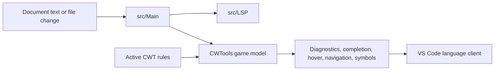
```mermaid
flowchart LR
    DOC["Document text or file change"] --> SERVER["src/Main"]
    SERVER --> LAYER["src/LSP"]
    SERVER --> MODEL["CWTools game model"]
    RULE["Active CWT rules"] --> MODEL
    MODEL --> FEATURES["Diagnostics, completion, hover, navigation, symbols"]
    FEATURES --> CLIENT["VS Code language client"]
```

Read requests may run concurrently while model-changing operations require exclusive coordination. Changes to locking, cancellation, incremental refresh, or document snapshots should be tested under concurrent edit and read traffic.

Incremental refresh must have a guarded full-refresh fallback. For changes that affect scripted types or localisation dependencies, compare incremental results with a full rebuild.

### CWT document pipeline

`.cwt` rule files are an independent editor language (`cwt` language id), not
game script. They never enter `game.Complete`/`game.ValidateFile`; their
diagnostics use the `CWT0xx` family (see
[docs/diagnostic-codes.md](docs/diagnostic-codes.md)) and are served by the
built-in CWT meta-model, not by the rules being edited.

Two server modes exist:

- **Full game mode** — the workspace has game evidence (vanilla folder, mod
  descriptor, known game language id). A game model is built as before; `.cwt`
  documents still route to the CWT pipeline.
- **CWT-only mode** — a rules repository or an opened `.cwt` file without game
  evidence. The server starts (`language: "cwt"` → `GameLanguage.CWT`) without
  building a game model; lint publishes parser/structure diagnostics only.
  Upgrading to full mode restarts the single server process in place
  (`cwtools.reloadExtension`), never a second competing process.

CWT-only mode must not trigger game guessing, vanilla cache creation, or rules
source setup; `checkOrSetGameCache` and `setupRulesCaches` skip it. Startup
mode is decided by the pure `determineServerStartMode` in
`client/extension/languageSelectors.ts`. See
[docs/cwt-language-support-handoff.md](docs/cwt-language-support-handoff.md)
for the phased plan (project index, cross-file semantics, and candidate rule
activation land in later phases).

Single-file semantics live in `submodules/cwtools/CWTools/Rules/`
(`CwtLanguageTypes.fs` / `CwtLanguageSchema.fs` / `CwtLanguageService.fs`,
namespace `CWTools.CwtLanguage`): a versioned meta-model of root blocks,
`##` directives and field-expression families drives structure/expression
diagnostics (`CWT1xx`/`CWT2xx`), local symbols, and context completion.
The LSP adapter (`src/Main/CwtLanguageFeatures.fs`) converts domain types to
diagnostics and completion items; `.cwt` completion never enters
`game.Complete`, and `.cwt` lint output is the parser diagnostics plus the
service's semantic diagnostics. `RulesParser.parseConfigWithMetadataDetailed`
reports structured parse errors, and the user-input `failwith` paths in
`RulesParser` degrade to controlled fallbacks.

Cross-file semantics run on an immutable, versioned project snapshot
(`CWTools/Rules/CwtProjectIndex.fs`): `CwtProjectIndex.buildSnapshot`
aggregates per-file documents into a symbol index and produces project
diagnostics (`CWT301` undefined reference, `CWT302` duplicate type, `CWT401`
inject cycle) with deterministic ordering and bounded file/size limits.
`src/Main/CwtLanguageFeatures.fs` owns the lifecycle: overlay-merged file
enumeration (open documents win over disk, `.git`/`node_modules`/build dirs
skipped), cancellable debounced rebuilds where only the latest requested
version can publish or activate, and LSP wiring so `.cwt` completion merges project symbols,
definition/references navigate through the index, and lint attaches project
diagnostics only when the snapshot is current. `## inject` source paths are
containment-checked against the rule root (absolute paths and `..` traversal
rejected, file/directory links resolved, and real-directory cycles suppressed).

Candidate-rule activation (`CWTools/Rules/CwtActivation.fs` + the write-locked
handler in `src/Main/Program.fs`) hot-swaps validated rule files into the game
model only for the currently configured manual rules root. CWT-only workspaces
index their workspace without activating a game model. A candidate is usable
only when every rule file parses and no Error-level (or explicitly promoted)
diagnostic exists; a content
hash + generation tracks the active rules, the swap happens atomically under
the game-state write lock, the rules/model epochs bump, and failures publish
`CWT901` while keeping last-known-good. Rejected candidates never replace the
active model (`CWT900`), and the next valid candidate retries automatically;
`reloadrulesconfig` remains the manual fallback.

### Shader subsystem

`.shader` and `.fxh` share the CWTools Shader parser and feature layer. Analysis is compile-unit aware: includes, file precedence, platform conditions, and renderer contracts affect what a symbol means.

`PdxShaderFeatures` is the shared feature surface. Do not add a second parser in TypeScript or a tool-specific approximation of Shader semantics. Agent and MCP queries should call the LSP commands that expose the same model.

Shader edits are conservative because some Effects are called by the executable rather than visible script. Renderer contracts and curated ABI evidence distinguish known calls from candidates and unknowns. Missing text references alone are not proof that an Effect is unused.

### AI subsystem

`client/extension/ai/` runs inside the Extension Host. It owns provider clients, chat state, prompt construction, tool dispatch, permission policy, workflows, memory, and multi-agent coordination.

#### Turn routing

The composer selects a capability domain: automatic, Paradox/CWTools, or general coding. Routing resolves the task intent and execution strategy for the turn. Once admitted, a run cannot broaden its domain; profiles, workflows, and child agents may only narrow it.

General coding loads normal repository instructions and cannot use Paradox-only semantic capabilities. The Paradox domain can query the active profile, CWT rules, indexes, and LSP evidence. `CWTOOLS.md` remains user-owned and is only scaffolded when absent.

#### Runner and tools

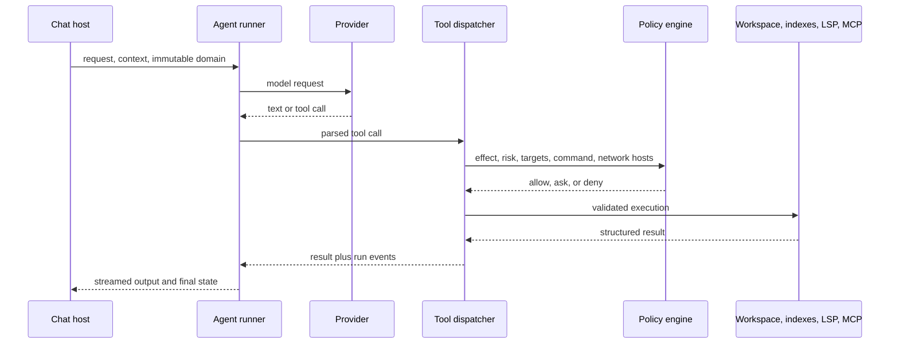
```mermaid
sequenceDiagram
    participant C as Chat host
    participant R as Agent runner
    participant P as Provider
    participant T as Tool dispatcher
    participant G as Policy engine
    participant S as Workspace, indexes, LSP, MCP

    C->>R: request, context, immutable domain
    R->>P: model request
    P-->>R: text or tool call
    R->>T: parsed tool call
    T->>G: effect, risk, targets, command, network hosts
    G-->>T: allow, ask, or deny
    T->>S: validated execution
    S-->>T: structured result
    T-->>R: result plus run events
    R-->>C: streamed output and final state
```

The tool registry is authoritative for tool availability, effects, risk, and concurrency. `agentTools.ts` dispatches calls only after the policy engine evaluates them. File writes also use path containment, per-file exclusion, sorted multi-file locking, and plan-mode gates. Shell commands pass through command preflight.

Programmable `run_code` is an authority-neutral transport, not a write permission. The runner snapshots the current mode/domain/disclosed catalog, generates its typed SDK, and executes the model-authored async-function body in a memory/stack/output-bounded QuickJS/WASM guest. The guest receives no Node, VS Code, module, filesystem, network, timer, `eval`, or `Function` authority. Its only host capability is a JSON tool bridge; every nested call is live-rechecked and re-enters the same policy, permission, scheduler, and write-queue path as a direct call. Intermediate values remain guest-local, and only bounded logs plus the explicit return value enter model context. Guest continuations are never checkpointed; an interrupted outer call resumes as an ordinary interrupted tool result.

The runner records typed events for streaming, replay, checkpoints, and resume. Adding an event requires matching reducer and Webview support. Persisted resume data remains compatible with V2.

Long runs use bounded context compaction, checkpoints, budgets, loop detection, and child-agent activity monitoring. Multi-agent coordination uses `dispatch_agents`, `query_blackboard`, and `merge_results` with a shared typed Blackboard.

#### Provider and secret boundary

Provider credentials and web-search keys are stored through VS Code SecretStorage. Provider clients normalize different request and streaming formats into the runner's common message and tool-call model.

Network and MCP access are model-visible effects and go through policy checks. Live web content, MCP payloads, and provider responses are untrusted input.

### Standalone MCP server

`submodules/cwtools-mcp/` is a separate repository and npm release. It is read-only: it exposes semantic queries but does not provide workspace write tools.

The default mode discovers the active compatible VS Code host and connects through the extension's bridge manifest. The client workspace must match the bridge workspace. A mismatch returns an unavailable result instead of querying another project.

Standalone mode can start its own LSP process. Both modes share generated tool schemas and host-service contracts. New semantic capability should be implemented as a read-only `cwtools.ai.*` LSP command first, added to the server read-command allowlist, and then exposed through generated MCP schemas.

Do not hand-edit `submodules/cwtools-mcp/packages/cwtools-shared/src/generated/mcpTools.ts`. Run `npm run generate:mcp-schema`, test inside the submodule, commit and release there, then update the root pointer.

### Submodule ownership

| Submodule | Contains | Change process |
| --- | --- | --- |
| `submodules/cwtools/` | F# library and semantic implementation | Commit and test in the submodule, then update the root pointer. |
| `submodules/cwtools-stellaris-config/` | Stellaris rules data | Treat as rules content; verify with rules tooling and keep separate from library code. |
| `submodules/cwtools-mcp/` | MCP packages and release metadata | Build and run contract tests in the submodule; publish on its own release cycle. |

### Build and release flow

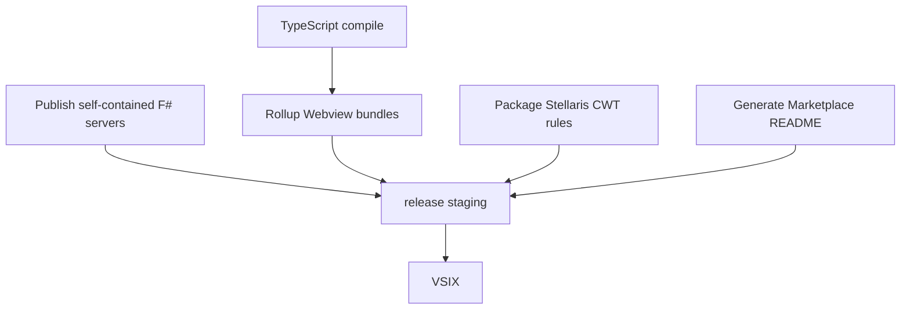
```mermaid
flowchart TD
    TS["TypeScript compile"] --> WV["Rollup Webview bundles"]
    FSHARP["Publish self-contained F# servers"] --> PACKAGE["release staging"]
    WV --> PACKAGE
    RULES["Package Stellaris CWT rules"] --> PACKAGE
    DOCS["Generate Marketplace README"] --> PACKAGE
    PACKAGE --> VSIX["VSIX"]
```

`npm run compile` builds Extension Host code and Webviews. Packaging publishes self-contained servers for Windows, Linux, and macOS, stages resources under `release/`, and creates the VSIX.

The bilingual root documents remain their own sources. `npm run build:docs` validates them and generates `release/README.md` from `docs/marketplace-readme.md`; it no longer copies the GitHub README into the Marketplace description.

### Design constraints at a glance

| Constraint | Reason |
| --- | --- |
| Webviews do not access Node.js or the filesystem | Maintains the browser sandbox and a single trusted I/O boundary. |
| Model-visible tools always pass through policy | Keeps permissions, effects, and audit events consistent. |
| Semantic capability originates in the LSP | Prevents Extension Host, MCP, and AI features from drifting into separate parsers. |
| Shared output is deterministic and bounded | Keeps large mods responsive and tests reproducible. |
| User input and wire data are validated at boundaries | Prevents malformed messages or files from becoming trusted state. |
| Submodule commits stay separate | Preserves ownership, history, and independent release cycles. |
| English and Chinese user-facing text change together | Keeps both supported documentation and UI surfaces current. |

---

## 中文

本文说明 Stellaris Language Serves 的运行边界、共享服务和维护约束，帮助开发者判断改动应放在哪里，以及需要同时检查哪些相邻模块。

文档不重复维护版本号；根 `package.json` 和 `release/package.json` 是唯一来源。

### 运行时概览

扩展包含三个实际运行的进程或沙盒，以及几份共享源码和规则仓库：

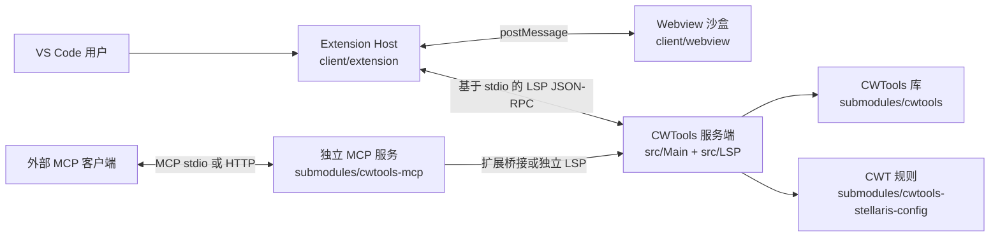
```mermaid
flowchart LR
    USER["VS Code 用户"]
    HOST["Extension Host\nclient/extension"]
    WEB["Webview 沙盒\nclient/webview"]
    LSP["CWTools 服务端\nsrc/Main + src/LSP"]
    CW["CWTools 库\nsubmodules/cwtools"]
    RULES["CWT 规则\nsubmodules/cwtools-stellaris-config"]
    MCP["独立 MCP 服务\nsubmodules/cwtools-mcp"]
    EXT["外部 MCP 客户端"]

    USER --> HOST
    HOST <-->|"postMessage"| WEB
    HOST <-->|"基于 stdio 的 LSP JSON-RPC"| LSP
    LSP --> CW
    LSP --> RULES
    EXT <-->|"MCP stdio 或 HTTP"| MCP
    MCP -->|"扩展桥接或独立 LSP"| LSP
```

Extension Host 是最重要的边界：VS Code API、文件访问、进程启动、Secret、命令和 Webview 生命周期都由它负责。Webview 只处理展示和交互，F# 服务端负责 Paradox 语法与语义。

### Extension Host

`client/extension/` 运行在 VS Code Extension Host 进程中，主要负责：

- 激活命令和配置；
- 启动并管理语言客户端；
- 通过 VS Code API 读写工作区资源；
- 创建可视化编辑器和 AI Webview；
- 维护共享索引和游戏 Profile；
- 校验 Webview 消息，再执行宿主操作。

常用入口：

| 范围 | 文件或目录 |
| --- | --- |
| 激活和命令 | `client/extension/extension.ts` |
| 游戏能力 | `client/extension/gameProfiles.ts` |
| 共享索引 | `client/extension/indexing/` |
| 路径与扩展名 helper | `pathScope.ts`、`fileExtensions.ts`、`fsCaseInsensitive.ts` |
| 可视化编辑器宿主 | `*Panel.ts`、`staticGalaxyEditorProvider.ts` |
| 原版对比 | `vanillaCompare.ts` |
| AI 运行时 | `client/extension/ai/` |

宿主代码执行操作前必须校验 Webview 消息和其他外部输入。路径判断应使用共享的包含关系与大小写 helper，不要自行写字符串前缀判断。

### 共享游戏 Profile 与索引

`gameProfiles.ts` 描述各游戏的差异：language ID、目录、本地化格式、安装提示、功能开关和生成元数据。随游戏变化的功能应查询当前 Profile，不要默认套用 Stellaris 约定。

`client/extension/indexing/` 提供 F# 语义模型之外仍需要共享的项目知识，包括本地化和工作区符号查询。这些索引按增量更新，并由 UI 与 AI 共用。

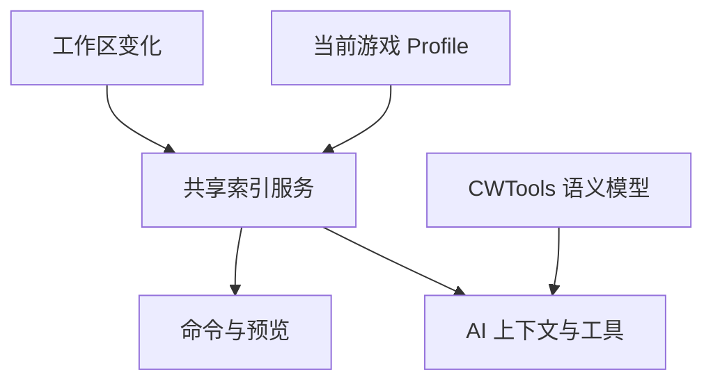
```mermaid
flowchart TD
    WATCH["工作区变化"] --> INDEX["共享索引服务"]
    PROFILE["当前游戏 Profile"] --> INDEX
    INDEX --> UI["命令与预览"]
    INDEX --> AI["AI 上下文与工具"]
    LSP["CWTools 语义模型"] --> AI
```

缓存必须有容量上限。调用方或测试依赖顺序时，应对文件系统派生结果排序。项目索引可能处于 partial 或 stale 状态，调用方要保留该状态，不能把不完整数据表述为完整结果。

### Webview 沙盒

`client/webview/` 由 Rollup 打包，在 VS Code 浏览器沙盒中运行，包含聊天界面以及 GUI、恒星系、静态银河、事件、科技、实体和粒子视图。

通信方式固定为：

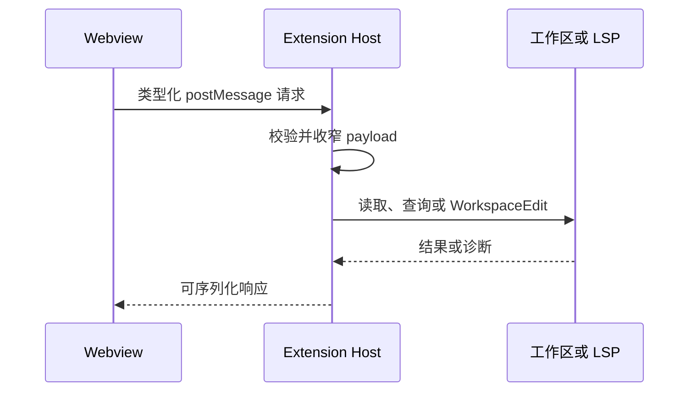
```mermaid
sequenceDiagram
    participant W as Webview
    participant H as Extension Host
    participant F as 工作区或 LSP

    W->>H: 类型化 postMessage 请求
    H->>H: 校验并收窄 payload
    H->>F: 读取、查询或 WorkspaceEdit
    F-->>H: 结果或诊断
    H-->>W: 可序列化响应
```

Webview 不得导入 `vscode`、`fs`、`path`，不得使用 `require()` 或 Node 专用 API。它应使用 VS Code 主题变量，支持 reduced motion，并在面板关闭时释放渲染器、worker、事件监听器、GPU 对象、贴图和动画循环。

源码写回属于宿主职责。可视化编辑器应生成最小 `WorkspaceEdit`，让原生撤销、dirty 状态和文件 watcher 保持正常。

### 语言服务

服务端由两个根项目组成：

- `src/LSP/` 提供可复用的 Language Server Protocol 与解析接口层。
- `src/Main/` 组装 CWTools 服务端程序和游戏集成。

大部分 Paradox 语义来自 `submodules/cwtools/`：解析、校验、作用域、定义、引用、scripted service 和 Shader 分析。当前 CWT 规则决定服务端应如何理解某个游戏。

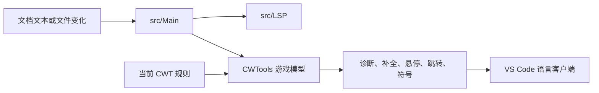
```mermaid
flowchart LR
    DOC["文档文本或文件变化"] --> SERVER["src/Main"]
    SERVER --> LAYER["src/LSP"]
    SERVER --> MODEL["CWTools 游戏模型"]
    RULE["当前 CWT 规则"] --> MODEL
    MODEL --> FEATURES["诊断、补全、悬停、跳转、符号"]
    FEATURES --> CLIENT["VS Code 语言客户端"]
```

只读请求可以并发，修改模型的操作需要独占协调。改动锁、取消、增量刷新或文档快照时，应在编辑和读取同时发生的场景中测试。

增量刷新必须保留受保护的全量刷新兜底。涉及 scripted type 或本地化依赖时，要把增量结果与全量重建对比。

### CWT 文档管线

`.cwt` 规则文件是一门独立的编辑器语言(`cwt` language id),不是游戏脚本。
它们永不进入 `game.Complete`/`game.ValidateFile`;诊断使用 `CWT0xx` 族
(见 [docs/diagnostic-codes.md](docs/diagnostic-codes.md)),由内置 CWT 元模型
提供,而不是用正在编辑的规则自我验证。

两种服务端模式:

- **Full game mode**——工作区存在游戏证据(vanilla 目录、mod descriptor、
  已知游戏 language id)。按原方式构建游戏模型;`.cwt` 文档仍走 CWT 管线。
- **CWT-only mode**——规则仓库或单独打开的 `.cwt` 文件,无游戏证据。
  服务端以 `language: "cwt"`(`GameLanguage.CWT`)启动,不构建游戏模型;
  lint 只发布解析/结构诊断。升级到 full mode 时在同一进程内重启
  (`cwtools.reloadExtension`),绝不启动第二个竞争进程。

CWT-only 不得触发游戏猜测、vanilla 缓存生成或规则源配置;
`checkOrSetGameCache` 与 `setupRulesCaches` 均跳过。启动模式由
`client/extension/languageSelectors.ts` 中的纯函数 `determineServerStartMode`
决定。分阶段计划见
[docs/cwt-language-support-handoff.md](docs/cwt-language-support-handoff.md)
(项目索引、跨文件语义与候选规则激活已落地;完整 Phase 3 仍有增强项)。

单文件语义位于 `submodules/cwtools/CWTools/Rules/`
(`CwtLanguageTypes.fs` / `CwtLanguageSchema.fs` / `CwtLanguageService.fs`,
命名空间 `CWTools.CwtLanguage`):版本化的根块、`##` 指令与字段表达式族
元模型驱动结构/表达式诊断(`CWT1xx`/`CWT2xx`)、局部符号与上下文补全。
LSP 适配器(`src/Main/CwtLanguageFeatures.fs`)将领域类型转换为诊断与补全项;
`.cwt` 补全永不进入 `game.Complete`,`.cwt` 的 lint 输出为解析器诊断加
服务的语义诊断。`RulesParser.parseConfigWithMetadataDetailed` 返回结构化
解析错误,`RulesParser` 中由用户输入触发的 `failwith` 路径降级为受控回退。

跨文件语义基于不可变、版本化的项目快照(`CWTools/Rules/CwtProjectIndex.fs`):
`CwtProjectIndex.buildSnapshot` 将各文件文档聚合成符号索引并产出项目诊断
(`CWT301` 未定义引用、`CWT302` 重复 type、`CWT401` inject 循环),输出确定
有序并设有文件数/大小上限。`src/Main/CwtLanguageFeatures.fs` 负责生命周期:
overlay 合并的文件枚举(未保存文档优先于磁盘,跳过 `.git`/`node_modules`/
构建目录)、可取消防抖重建(只有最新请求版本可发布或激活)、以及 LSP 接线——`.cwt`
补全合并项目符号、definition/references 走索引跳转、lint 仅在快照就绪时
附加项目诊断。`## inject` 源路径对规则根做包含性校验(拒绝绝对路径与 `..`
穿越,解析文件/目录链接,并用真实目录集合阻止链接循环)。

候选规则激活(`CWTools/Rules/CwtActivation.fs` + `src/Main/Program.fs` 中持写锁
的处理器)只把当前配置的手动规则根中验证通过的规则文件热替换进游戏模型;
CWT-only 工作区只索引当前工作区,不激活游戏模型。候选可用要求每个规则文件
可解析且不存在 Error 级诊断(或被显式提升为阻断项的诊断);
内容 hash + generation 追踪活动规则,替换在游戏状态写锁内原子完成,规则/
模型 epoch 递增,失败发布 `CWT901` 并保留 last-known-good。被拒绝的候选
绝不替换活动模型(`CWT900`),下一个有效候选自动重试;`reloadrulesconfig`
仍是手动兜底。

### Shader 子系统

`.shader` 和 `.fxh` 共用 CWTools Shader 解析器与 feature 层。分析按真实编译单元工作，Include、文件优先级、平台条件和 renderer contract 都会影响符号含义。

`PdxShaderFeatures` 是共享功能入口。不要在 TypeScript 或某个工具中维护第二套解析器或近似 Shader 语义。Agent 与 MCP 应调用暴露同一模型的 LSP 命令。

部分 Effect 由可执行程序调用，源码中没有直接引用，因此 Shader 修改需要保守处理。renderer contract 和已审核 ABI 证据用于区分已知调用、候选和未知；“找不到文本引用”本身不能证明 Effect 未使用。

### AI 子系统

`client/extension/ai/` 运行在 Extension Host 中，负责 Provider、聊天状态、Prompt、工具 dispatch、权限策略、工作流、记忆和多 Agent 编排。

#### 单轮路由

输入区选择能力领域：自动、Paradox/CWTools 或通用编码。路由器据此确定当前轮任务意图和执行策略。Run 一旦准入，不能扩大领域；Profile、Workflow 和子 Agent 只能进一步收窄。

通用编码会读取常规仓库指令，但不能调用 Paradox 专用语义能力。Paradox 领域可以查询当前 Profile、CWT 规则、索引和 LSP 证据。`CWTOOLS.md` 属于用户，只有缺失时才创建最小模板。

#### Runner 与工具

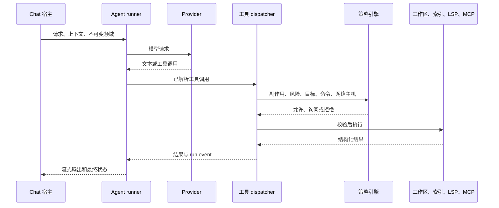
```mermaid
sequenceDiagram
    participant C as Chat 宿主
    participant R as Agent runner
    participant P as Provider
    participant T as 工具 dispatcher
    participant G as 策略引擎
    participant S as 工作区、索引、LSP、MCP

    C->>R: 请求、上下文、不可变领域
    R->>P: 模型请求
    P-->>R: 文本或工具调用
    R->>T: 已解析工具调用
    T->>G: 副作用、风险、目标、命令、网络主机
    G-->>T: 允许、询问或拒绝
    T->>S: 校验后执行
    S-->>T: 结构化结果
    T-->>R: 结果与 run event
    R-->>C: 流式输出和最终状态
```

工具可用性、副作用、风险和并发策略以 registry 为准。`agentTools.ts` 只在策略引擎完成判断后 dispatch。文件写入还要经过路径包含、单文件写排他、排序后的多文件锁和 Plan 模式门；Shell 命令先做 command preflight。

可编程 `run_code` 是不自带权限的 transport，不是写权限。Runner 会快照当前 mode/domain/已披露工具目录、生成对应类型化 SDK，并在受内存、栈和输出预算限制的 QuickJS/WASM guest 中执行模型生成的 async-function body。Guest 不具备 Node、VS Code、模块、文件系统、网络、计时器、`eval` 或 `Function` 权限；唯一宿主能力是 JSON 工具桥。每个内部调用都会实时复核可见性，并像直接调用一样重新进入策略、权限、调度和写队列。中间值只留在 guest 中，只有有界日志与显式返回值进入模型上下文。Guest continuation 不会写入 checkpoint；中断后的外层调用按普通中断工具结果恢复。

Runner 用类型化事件支持流式展示、replay、checkpoint 和恢复。新增事件必须同步 reducer 与 Webview。持久化恢复数据继续兼容 V2。

长任务使用有界上下文压缩、checkpoint、预算、循环检测和子 Agent 活动监控。多 Agent 通过 `dispatch_agents`、`query_blackboard`、`merge_results` 与共享类型化 Blackboard 协作。

#### Provider 与 Secret 边界

Provider 凭据和网页搜索 Key 通过 VS Code SecretStorage 保存。不同 Provider 的请求与流式格式会被转换为 runner 使用的统一消息和工具调用模型。

网络和 MCP 访问都是模型可见副作用，必须经过策略检查。实时网页、MCP payload 和 Provider 响应均视为不可信输入。

### 独立 MCP 服务

`submodules/cwtools-mcp/` 是独立仓库和 npm 发布包，只提供只读语义查询，不提供工作区写入工具。

默认模式会发现当前兼容的 VS Code 宿主，并通过扩展 bridge manifest 连接。客户端工作区必须与 bridge 工作区一致；不一致时返回不可用，而不是查询另一个项目。

Standalone 模式可以启动自己的 LSP。两种模式共用生成的工具 schema 和 Host Service 契约。新增语义能力时，应先实现只读 `cwtools.ai.*` LSP 命令，加入服务端只读命令 allowlist，再通过生成的 MCP schema 暴露。

不要手改 `submodules/cwtools-mcp/packages/cwtools-shared/src/generated/mcpTools.ts`。运行 `npm run generate:mcp-schema`，在子模块内测试、提交和发布，最后更新根仓库指针。

### 子模块职责

| 子模块 | 内容 | 修改流程 |
| --- | --- | --- |
| `submodules/cwtools/` | F# 库和语义实现 | 在子模块内提交和测试，再更新根指针。 |
| `submodules/cwtools-stellaris-config/` | Stellaris 规则数据 | 作为规则内容处理，用规则工具验证，并与库代码分开。 |
| `submodules/cwtools-mcp/` | MCP 包和发布元数据 | 在子模块内构建和运行契约测试，按独立周期发布。 |

### 构建与发布

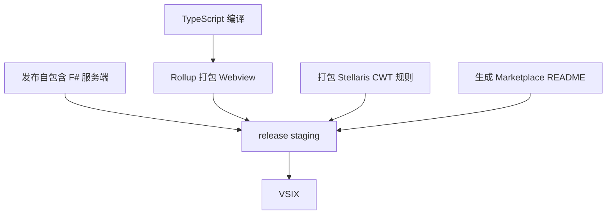
```mermaid
flowchart TD
    TS["TypeScript 编译"] --> WV["Rollup 打包 Webview"]
    FSHARP["发布自包含 F# 服务端"] --> PACKAGE["release staging"]
    WV --> PACKAGE
    RULES["打包 Stellaris CWT 规则"] --> PACKAGE
    DOCS["生成 Marketplace README"] --> PACKAGE
    PACKAGE --> VSIX["VSIX"]
```

`npm run compile` 构建 Extension Host 和 Webview。打包流程会发布 Windows、Linux 和 macOS 的自包含服务端，把资源放入 `release/`，再生成 VSIX。

根目录双语文档各自保持单一来源。`npm run build:docs` 会校验它们，并从 `docs/marketplace-readme.md` 生成 `release/README.md`；GitHub README 不再直接复制为插件市场介绍。

### 关键约束速查

| 约束 | 原因 |
| --- | --- |
| Webview 不访问 Node.js 和文件系统 | 保持浏览器沙盒和单一可信 I/O 边界。 |
| 模型可见工具全部经过策略引擎 | 统一权限、副作用和审计事件。 |
| 语义能力先进入 LSP | 避免 Extension Host、MCP 和 AI 各自演化出不同解析器。 |
| 共享输出确定且有界 | 保证大型 Mod 的响应速度和测试可复现。 |
| 在边界校验用户输入和线协议数据 | 防止异常消息或文件直接变成可信状态。 |
| 子模块提交分开 | 保留所有权、历史和独立发布周期。 |
| 用户可见英文和中文同步修改 | 保证两种受支持文档与 UI 都保持最新。 |
