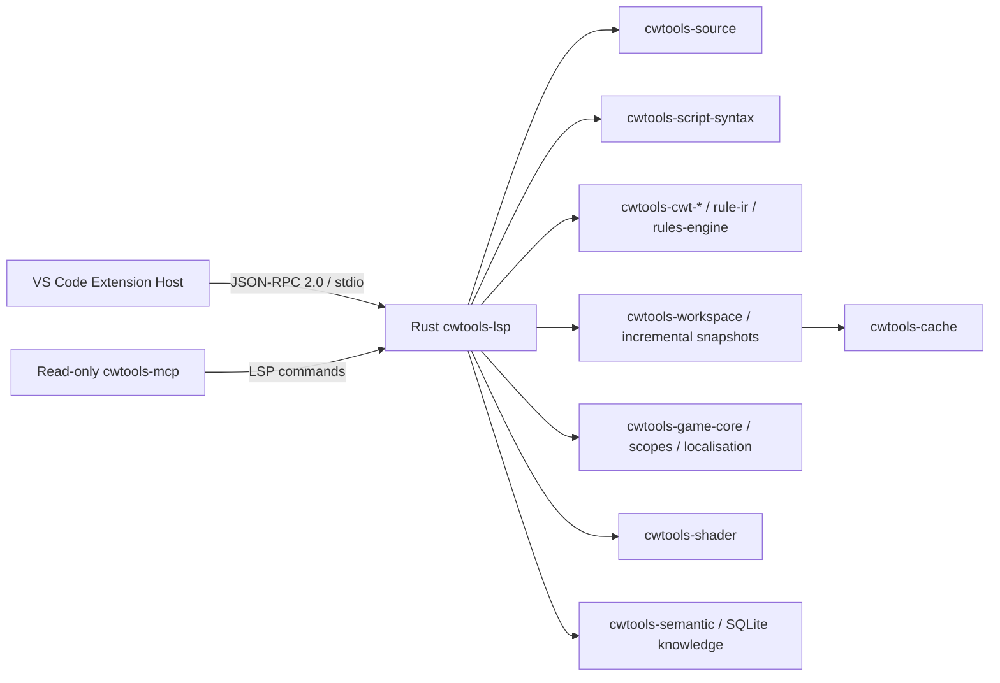

# Architecture / 架构

## English

CWTools is a Rust-only semantic platform with a TypeScript VS Code client.

```mermaid
flowchart LR
  VS[VS Code Extension Host] -->|JSON-RPC 2.0 / stdio| LSP[Rust cwtools-lsp]
  LSP --> SRC[cwtools-source]
  LSP --> SYN[cwtools-script-syntax]
  LSP --> RULES[cwtools-cwt-* / rule-ir / rules-engine]
  LSP --> WS[cwtools-workspace / incremental snapshots]
  LSP --> GAME[cwtools-game-core / scopes / localisation]
  LSP --> SHADER[cwtools-shader]
  LSP --> SEM[cwtools-semantic / SQLite knowledge]
  WS --> CACHE[cwtools-cache]
  MCP[Read-only cwtools-mcp] -->|LSP commands| LSP
```

The server validates Content-Length frames, lifecycle, cancellation, and UTF-16 positions. Open documents are overlays; prepare/commit snapshot publication is epoch guarded, cancellable, deterministic, and bounded. Diagnostics and indexes are replaced atomically. Cache envelopes contain magic, schema, game/rules/source fingerprints, compression metadata, and checksums; invalid files are misses.

The LSP command/capability ABI is `contracts/lsp-manifest.json`, embedded by the Rust server. Standard LSP and custom AI/Shader/project commands share the same standalone process. There is no implementation selector, worker, proxy, sidecar, fallback backend, or second server runtime.

Release binaries use `release/bin/server/<rid>/CWTools Server[.exe]`. CI tests Rust core and LSP on Windows, Linux, and macOS; TypeScript and MCP have separate gates. Release order is build, Rust-only audit, non-long acceptance, package inspection, then final 24-hour soak and report verification.

## 中文

CWTools 是纯 Rust 语义平台，配合 TypeScript VS Code 客户端。

服务端验证 Content-Length framing、生命周期、取消和 UTF-16 位置。打开文档作为覆盖层；增量快照采用可取消、确定、有界且带 epoch 防陈旧检查的 prepare/commit 发布。诊断与索引原子替换。缓存 envelope 包含 magic、schema、游戏/规则/源码指纹、压缩元数据和校验值；无效缓存只会触发安全 miss。

`contracts/lsp-manifest.json` 是 LSP 命令与能力 ABI，并由 Rust 服务端直接嵌入。标准 LSP、自定义 AI、Shader 和项目命令都运行于同一独立进程。仓库不存在实现 selector、worker、proxy、sidecar、后备后端或第二套服务端 runtime。

发布二进制位于 `release/bin/server/<rid>/CWTools Server[.exe]`。CI 在 Windows、Linux、macOS 验证 Rust core 与 LSP，TypeScript 和 MCP 使用独立门禁。固定发布顺序为：构建、Rust-only 审计、非长时全量验收、产物检查、最终 24 小时 soak 与报告核验。
