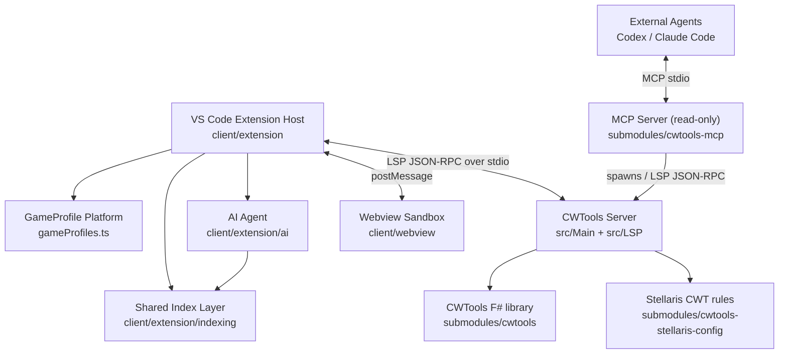
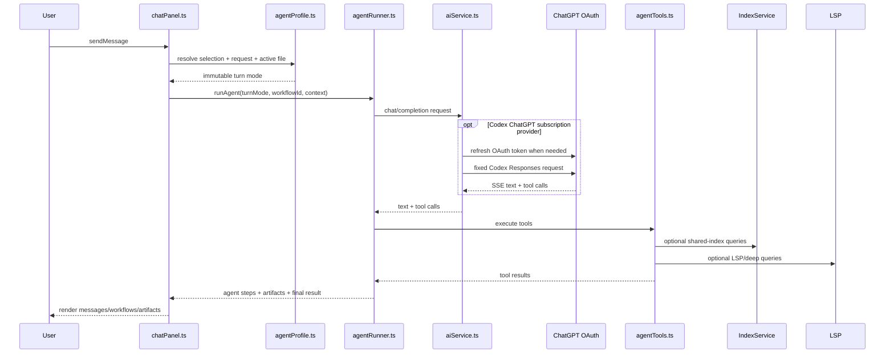
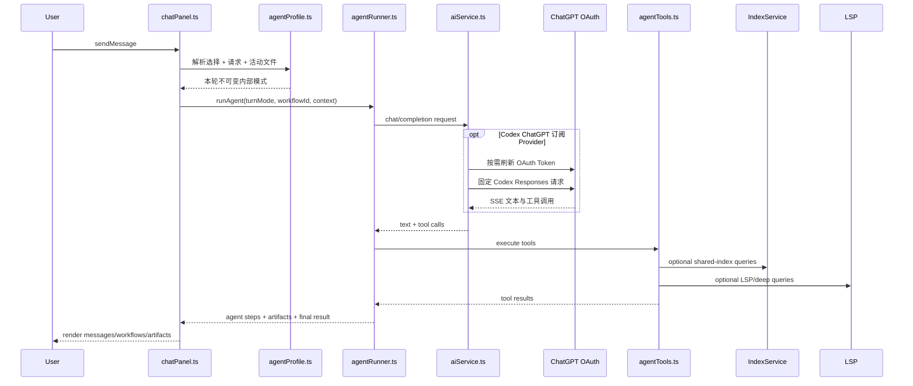

# Architecture / 架构文档

[English](#english) | [中文](#zh-cn) | [Project Overview / 项目介绍](README.md) | [Contribution Guide / 贡献指南](CONTRIBUTING.md) | [CWT Rule Guide / CWT 规则指南](docs/cwt-rule-config.md) | [Diagnostic Codes / 诊断码](docs/diagnostic-codes.md) | [AI Agent Guide](AGENTS.md)

<a id="english"></a>

## English

### Architecture Documentation

This document describes the current architecture, module boundaries, data flows, and maintenance constraints of **Stellaris Language Serves**. The project is a VS Code extension designed for Paradox game modding, primarily enhancing language services, visual previews, and AI-assisted development for Stellaris.

Version numbers are not maintained redundantly here. The sources of truth are `package.json` at the root and `release/package.json`, which are checked for consistency by the release gate.

#### Overall Structure

The system is composed of four runtime layers, two shared platform capabilities,
and two submodule data/code sources:

1. VS Code Extension Host: `client/extension/`
2. AI Agent Subsystem: `client/extension/ai/`
3. Webview Sandbox UI: `client/webview/`
4. .NET/F# Language Server: `src/LSP/` and `src/Main/`
5. Shared Platform Capabilities: `client/extension/gameProfiles.ts` and `client/extension/indexing/`
6. Standalone MCP Server: `submodules/cwtools-mcp/` (separate repository holding `cwtools-shared` and `cwtools-mcp`, a read-only semantic service installed standalone by external agents like Codex or Claude Code, see the "Standalone MCP Server" section)
7. Submodules: `submodules/cwtools/` for the upstream F# library and `submodules/cwtools-stellaris-config/` for Stellaris CWT rules/config data


```mermaid
flowchart TD
    VS["VS Code Extension Host\nclient/extension"]
    GP["GameProfile Platform\ngameProfiles.ts"]
    IDX["Shared Index Layer\nclient/extension/indexing"]
    AI["AI Agent\nclient/extension/ai"]
    WV["Webview Sandbox\nclient/webview"]
    LSP["CWTools Server\nsrc/Main + src/LSP"]
    CW["CWTools F# library\nsubmodules/cwtools"]
    RULES["Stellaris CWT rules\nsubmodules/cwtools-stellaris-config"]
    MCP["MCP Server (read-only)\nsubmodules/cwtools-mcp"]
    EXT["External Agents\nCodex / Claude Code"]

    VS --> GP
    VS --> IDX
    VS --> AI
    VS <-->|postMessage| WV
    VS <-->|LSP JSON-RPC over stdio| LSP
    AI --> IDX
    LSP --> CW
    LSP --> RULES
    EXT <-->|MCP stdio| MCP
    MCP -->|spawns / LSP JSON-RPC| LSP
```

Webviews communicate with the Extension Host exclusively via `postMessage`. They cannot access `vscode`, Node.js, `fs`, `path`, or `require()` directly.

#### Extension Host

`client/extension/` runs in the VS Code Extension Host process. It is responsible for command registration, LSP client lifecycle, filesystem access, Webview panel hosting, AI panel hosting, and assembling shared platform services.

| File | Purpose |
| --- | --- |
| `extension.ts` | Extension entry point, registers commands, starts the Language Server, and instantiates shared services |
| `gameProfiles.ts` | Multi-game profile registry, path conventions, feature toggles, and installation detection metadata |
| `indexing/indexService.ts` | Shared incremental index service |
| `indexing/locParser.ts` | Pure parser and query helper for localization YML files |
| `indexing/workspaceSymbolParser.ts` | PDXScript / asset / gui symbol parser, queries, and reference extractor |
| `codeActions.ts` | Code Actions for AI diagnostic repairs, explanations, and batch fixes |
| `diagnosticI18n.ts` | Client-side diagnostic translation: Chinese translation + fix advice, `source` normalization, and ignore-key matching |
| `fileExtensions.ts` | Case-insensitive extension matching helpers (`matchesExt`, `GRAPHICS_EXTS`) shared by UI and AI layers |
| `fsCaseInsensitive.ts` | Case-insensitive path resolution (used for unresolved resource references on Linux/macOS) |
| `pathScope.ts` | Neutral path containment helpers (`isPathInsideOrEqual` / `foldPathCase`) shared by UI and AI sandboxes |
| `guiPanel.ts` / `guiParser.ts` | `.gui` file parser and Canvas preview host |
| `solarSystemPanel.ts` / `solarSystemParser.ts` | 星系 (Solar system) previewer for `solar_system_initializers/` |
| `staticGalaxyEditorProvider.ts` / `staticGalaxyParser.ts` / `staticGalaxyEditBuilder.ts` | Static galaxy (`map/setup_scenarios/`) custom editor host, span-carrying parser, and minimal token write-back builder; shares `client/shared/staticGalaxyProtocol.ts` with the webview |
| `eventChainPanel.ts` / `eventChainParser.ts` | Event chain scanner, subgraph extraction, and code jumps |
| `techTreePanel.ts` / `techTreeParser.ts` | Tech tree scanner, filtering, and dependency graphs |
| `entityPanel.ts` / `entityAssetParser.ts` | `.asset` entity model preview host and resource parsing |
| `particlePanel.ts` / `particleAssetParser.ts` / `particleAssetSerializer.ts` | Stellaris `particle={}` preview/editor host, span parsing, and write-back |
| `graphicsFeatures.ts` | Graphics resource editor capabilities |
| `ddsDecoder.ts` | DDS/TGA decoding support |
| `locDecorations.ts` | Localization hover, definitions, and decorations backed by `IndexService` |
| `fileExplorer.ts` | Custom Mod file tree view |
| `vanillaCompare.ts` | Compare with vanilla files and migrate code blocks |
| `updateChecker.ts` | Update check logic |
| `pdxTokenizer.ts` | Shared PDX script tokenizer |
| `exprEval.ts` | Safe math expression evaluation for `@[...]` |

#### Shared Platform & Indexing Layer

##### GameProfile Platform

`gameProfiles.ts` consolidates stable platform differences instead of scattering them in extensions, indexing, and AI modules. A profile describes language IDs, file extensions, vanilla cache configuration keys, localization storage conventions, preview features, and Steam installation detection metadata. Mutable game semantics do not belong in profiles or prompts.

The extension entry point, indexing layer, and AI game knowledge should prioritize game profile helper functions.

##### IndexService

`IndexService` is a shared knowledge layer used by both editor features and AI tools:

- Localization keys are indexed during activation for hover, definitions, and AI lookups.
- Heavier workspace/vanilla symbol indexes are lazy-loaded via `ensureWorkspaceSymbolsReady()` to avoid slow startup. The workspace phase is published before the vanilla phase; Agent queries wait at most eight seconds, then consume the partial index while vanilla indexing continues in the background. Discovery requests one file beyond each configured cap so a capped index is published as `partial`, never `ready`; presence remains useful, but an empty partial result cannot prove absence.
- Workspace symbols persist in `index/workspace-symbols.sqlite` under the per-workspace extension storage root (`context.storageUri`, falling back to a hashed global-storage directory); the previous in-project `.cwtools/index/...` and `.cwtools-ai/index/...` files are read-only migration fallbacks removed after a successful save. Vanilla symbols use root-keyed SQLite files under extension global storage. Builds restore cached rows first, compare file `size + mtime`, parse only changed files with bounded concurrency, and use a sorted-name array plus binary-search prefix ranges. Normal queries remain lazy, while `/init` eagerly materializes the workspace database before deep knowledge export. A successful `.cwb` + metadata rewrite emits a validated `vanillaCacheGenerated` notification; the Extension force-rebuilds the matching vanilla database before window reload, and coalesces a simultaneous same-game watcher refresh into that build.
- The symbol layer supports `.txt`, `.gfx`, `.asset`, `.gui`, storing `origin`, `updatedAt`, and `fileVersion`. Initial parsing omits references; targeted queries load references only from the bounded result-file set.
- File system watchers incrementally update `.yml` and symbol files; symbol indexes are garbage-collected when idle.
- The AI consumes these indexes via `query_localisation_index` and `query_workspace_index`.

The core constraint of this layer is: if the shared index can answer the query, do not force consumers to scan the workspace again.

##### CWTools Semantic Graph

`src/Main/SemanticGraph.fs` builds a bounded semantic subgraph directly from the loaded CWTools `Types()`, `GetEventGraphData`, and per-file `ComputedData` caches. It does not maintain a second parser or a lexical reference database. `cwtools.ai.exploreProject` ranks typed seed definitions, traverses at most three hops, caps nodes/edges, and returns provenance, file facts, truncation, and validation/load freshness. The extension and MCP expose it as `explore_pdx_project`, the preferred first tool for project-structure and dependency questions; exact rule, scope, type, and block tools remain the write-time verification layer.

Because the graph reads the existing game model, scripted-type refreshes and ordinary file updates become visible through the same cache/locking lifecycle as diagnostics and completion. User buffer changes are debounced into `UpdateFile`; agent writes and watched file-system changes force a disk-backed update; creates, changes, and deletes update or remove typed indexes; and graph reads hold the game-state read lock while incremental commits/full refreshes hold the write lock. Query-only graph caches are invalidated on every relevant workspace mutation. Standalone MCP uses a bounded Chokidar watcher to forward the same LSP watched-file events. Empty results from a loading or stale snapshot are explicitly non-authoritative.

##### Dynamic Semantic Catalog

`cwtools.ai.getSemanticCatalog` is the shared read-only boundary for deterministic consumers that need current-game structure. The LSP combines CWTools `TypeDefs()` with the active CWT alias rules and returns type paths, `name_field`, `type_key_filter`, rule categories, supported/pushed scopes, and typed `value`/`value_set`/`<type>` references together with a rule generation and content hash. Its versioned `directoryPaths` field independently walks every active TypeDef, validates and merges literal directory paths with their entity types, and is therefore not affected by the 4,000-entry presentation cap on `definitionTypes`. Callers request only rule names present in the files they are checking; CWT aliases named with a `<TypeDef>` placeholder are retained as namespace-to-callable-type metadata. EvidenceGate and SemanticVerifier consume this catalog; they do not maintain event-key, flag-command, callable-type, entity-directory, or scope tables. Older or unavailable servers use a bounded Extension cache of the same active CWT source and mark the result degraded.

This is a reusable platform boundary rather than an Agent-owned rule base. The workspace symbol index classifies script definitions from catalog TypeDef paths/name fields/type-key filters and includes the catalog hash in its persistent-cache fingerprint. Vanilla Compare uses the same metadata for block identity and rejects ambiguous generic matches; localisation navigation uses generic assignment structure plus the actual localisation index instead of field/keyword lists. Other editor, validation, visualization, or indexing features that need mutable game semantics should query the CWTools/LSP model or stable profile helpers, not add a parallel game table.

EvidenceGate treats references to project-extensible TypeDefs as phase-aware. A definition missing (or present only under the wrong type) during `pre_write` or a single-file `post_write` is pending because another planned file or sub-agent may still provide the correct definition. Only the parent task's integrated `final` pass may promote that still-confirmed absence or type mismatch to a conflict. This applies to every TypeDef discovered from the active semantic catalog, including static/scripted modifiers, rather than a hard-coded family list. Parse errors, proven scope incompatibilities, and engine modifier keys rejected by the active CWT modifier rules remain immediate conflicts.

##### Game Directory Creation

`directoryCompletions.ts` is a UI-independent aggregator. For the selected workspace parent it extracts only the next path segment, then merges authoritative CWT `directoryPaths`, conventional `GameProfile` roots, and observed immediate vanilla child directories. Existing workspace children are read afresh and removed. Vanilla reads never recurse and use a 128-entry, five-minute LRU/TTL cache keyed by game, vanilla root URI, and relative parent; configuration changes and disposal clear it. Built-in games reject `localisation_synced` from every source, while Generic accepts it only when active custom CWT declares it.

`directoryCompletionCommand.ts` owns the Explorer/Command Palette command, workspace/game routing, Quick Pick lifecycle, cancellation, and creation. Repeated invocations use a monotonic generation and cancellation source so late LSP or file-system results cannot update the current picker. The command validates untrusted catalog, setting, picker, and directory inputs; uses `workspace.fs`, `Uri.joinPath`, and URI scheme/authority/path containment rather than local path resolution; re-stats the parent and target before writing; never overwrites; and reveals a successful result. This keeps local, multi-root, remote, and writable virtual file systems on the same boundary. The MCP remains read-only and does not expose directory creation.

##### Project Knowledge Pack

`/init` has a quick profile phase and a deep semantic phase. The quick profile discovers actual PDX content directories and stable registered game metadata; it does not manufacture a fixed list of entity families or inject samples from selected folders. `chatInit.ts` keeps a `ProgressLocation.Window` indicator in VS Code's lower-left status area while it waits for CWTools, exports the database, and publishes the artifacts. The deep phase calls the internal `cwtools.ai.exportProjectKnowledge` command against one coherently locked `IGame` snapshot, then atomically writes a normalized SQLite V3 database. Workspace definitions, embedded vanilla definitions, definition stacks, reference topology, archetypes, resource overwrite state, active CWT override modes, unresolved facts, and typed graph facts therefore share one generation boundary. Graph nodes and edges are derived from CWTools definition types and reference topology; the exporter and semantic graph use generic typed-reference edges instead of command-name or entity-name classifiers. V3 extracts event execution facts from the same parsed CWTools nodes, preserves incoming/outgoing reference direction, and reports missing caller evidence as unknown rather than inferring entry status from IDs, source order, or layout.

The persistent layout is intentionally compact:

```text
.cwtools/project/
├─ profile.json
└─ knowledge/
   ├─ manifest.json
   └─ knowledge.sqlite
```

`manifest.json` contains freshness, fingerprints, counts, domains, and the portable database reference; normalized facts live only once in `knowledge.sqlite`. `/init` requests `completeExport`, which preserves every loaded definition and enumerates every workspace topology reference without the bounded snapshot caps. The topology collector deduplicates during its single pass instead of materializing a second distinct copy. Bounded internal callers retain explicit caps and publish `partial` rather than `ready` when those caps are reached; a deterministic `partial` result is published once instead of repeating the same export, while transient `loading`/`stale` results remain retryable. A successful V1 migration removes the old capability/archetype/snapshot JSON set only after the new database and manifest are published. Ordinary file saves are debounced into one path-deduplicated batch and update only the affected SQLite rows, definition stacks, domain summaries, archetypes, references, and event facts in one WAL transaction. An update arriving during another export produces at most one incremental tail batch. Incremental export holds the game-state read lock and a per-database write gate, so completion, semantic tokens, CodeLens, and inlay hints remain available; full export keeps the protocol write lock and runs only during project load or an explicit `/init`. Graph-wide shader inputs, rule/config changes, and `.cwb` changes only persist a stale reason during the active session and are rebuilt after the next `cwtools/serverReady`. Combined multi-root packs route each root's changes to their owning manifest and fingerprint every project root. `cwtools.ai.queryProjectKnowledgeDb` is the read-only query command used by the extension and MCP, and both callers and the LSP reject database paths outside the project boundary. Explicit identifiers are resolved as indexed definition seeds, then expanded through generic incoming/outgoing typed references; requested entity types also constrain the initial incoming-reference slice. Bounded token scanning is only the fallback for intent-only queries. Agents retrieve targeted evidence through `query_project_knowledge`; complex blueprints are gated on fresh project knowledge, project/vanilla reference evidence, active CWT/LSP legality evidence, and an empty critical-unresolved list.

#### Submodules

The repository depends on two submodules with different responsibilities:

| Submodule | Role |
| --- | --- |
| `submodules/cwtools/` | Upstream CWTools F# library. The language server depends on it for parsing, validation, game model semantics, shader analysis, and scripted-type refresh behavior. |
| `submodules/cwtools-stellaris-config/` | Stellaris CWT rule/config data. Rules sync tooling compares it with game `script_documentation` logs and vanilla `common/`; `rules:stellaris:shader-abi` generates fail-closed, human-reviewed Shader ABI upgrade packs; packaging zips its `config/` directory into the fallback rules bundle. |

The first submodule is executable/library semantics; the second is rules data.
Keep that distinction visible in commits and PR descriptions.

For practical rule authoring guidance, see `docs/cwt-rule-config.md`.

#### AI Agent Subsystem

AI code is located in `client/extension/ai/`, consisting of the chat host, model providers, prompt builders, tool registries, workflows, reasoning loops, and multi-agent coordination.

##### Core Data Flow


```mermaid
sequenceDiagram
    participant User as User
    participant Chat as chatPanel.ts
    participant Profile as agentProfile.ts
    participant Runner as agentRunner.ts
    participant Service as aiService.ts
    participant OAuth as ChatGPT OAuth
    participant Tools as agentTools.ts
    participant Index as IndexService
    participant LSP as LSP

    User->>Chat: sendMessage
    Chat->>Profile: resolve selection + request + active file
    Profile-->>Chat: immutable turn mode
    Chat->>Runner: runAgent(turnMode, workflowId, context)
    Runner->>Service: chat/completion request
    opt Codex ChatGPT subscription provider
        Service->>OAuth: refresh OAuth token when needed
        Service->>OAuth: fixed Codex Responses request
        OAuth-->>Service: SSE text + tool calls
    end
    Service-->>Runner: text + tool calls
    Runner->>Tools: execute tools
    Tools->>Index: optional shared-index queries
    Tools->>LSP: optional LSP/deep queries
    Tools-->>Runner: tool results
    Runner-->>Chat: agent steps + artifacts + final result
    Chat-->>User: render messages/workflows/artifacts
```

##### Core Files

| File | Purpose |
| --- | --- |
| `agentProfile.ts` | Resolves the user-selected domain plus automatic intent and strategy into an internal per-turn execution mode |
| `agentRunner.ts` | Reasoning loops, tool permissions, workflow execution, context compression, checkpointing, and model fallbacks |
| `agentTools.ts` | Tool dispatching, execution timeouts, shared blackboard, and orchestrator tool entry |
| `aiService.ts` | Multi-provider HTTP/SSE clients, request formatting, fallback policies, and custom wire formats (`customApiFormat`) |
| `codex/` | Browser PKCE OAuth, VS Code SecretStorage credentials, automatic token refresh, account status, compatibility models, and quota windows for the ChatGPT subscription provider |
| `promptBuilder.ts` / `prompt/sections/` | Prompt builder facade, project context, and mode system instructions |
| `projectInstructions.ts` | Bounded General-domain loader for root and path-scoped standard repository instructions |
| `providers.ts` / `providers/models/` | Provider registry, default models, capabilities, pricing, and prompt caching discounts |
| `types.ts` | Messages, tools, profiles, internal modes, contexts, Artifacts, and setting schemas |
| `runnerPolicy.ts` | Mode-based tool exclusions, iteration limits, and sub-agent output token budgets |
| `planModeGuard.ts` | Plan-mode write guards: limits writes to implementation plans and plan/blueprint/walkthrough output files; provides read-only `git_ops` checks (`validateGitOpsForMode`) |
| `projectProfile.ts` | `/init` workspace scanning, project profile generation, and encoding/language detection |
| `projectKnowledge.ts` | Deep `/init` manifest + SQLite generation, V1 migration, fingerprints, retrieval, and background refresh |
| `chatInit.ts` | Command handler for `/init`, triggers quick profile plus deep semantic generation and renders `CWTOOLS.md` |
| `gameKnowledge.ts` | Stable evidence-routing policy; mutable game facts are queried from CWT/CWTools LSP |
| `skills.ts` | Skill index loader (`SKILL.md` for built-in, user, or project scopes) and `run_skill` execution |
| `memoryParser.ts` | Private structured memory with provenance, confidence, usage, expiry, redaction, and bounded consolidation |
| `workspacePaths.ts` | Separates project artifacts under `.cwtools/` from private runtime state under `ExtensionContext.storageUri`, with legacy migration |
| `workspaceSandbox.ts` | Input path cleaning, scope classification (project, workspace, outside, etc.), and trust checks |
| `runner/sandboxRunner.ts` / `sandboxBroker.ts` | Fail-closed command broker: verified native Windows helper when configured, WSL2 + Bubblewrap fallback, Linux Bubblewrap, or macOS Seatbelt |
| `runner/threadStore.ts` / `goalStore.ts` | Durable thread lineage, exact-run forks, transcript recovery, and long-running goals |
| `runner/historyPolicy.ts` | Private history persistence level, age/size retention, clear, and redacted export policy |
| `usageTracker.ts` | Persists cumulative token usages, costs, and prompt cache stats across sessions |
| `diffEngine.ts` | Structural diff engine |
| `fileCache.ts` | Bounded file content cache |
| `errorReporter.ts` | Structured error logging (fatal, warn, debug) |
| `contextBudget.ts` | Token budgets and tool output truncation rules |
| `contextReferences.ts` | `@file`, `@folder`, `@symbol`, and `@blackboard` context reference resolvers |
| `chat/bridge.ts` | Webview-to-extension IPC message handler |
| `agentSessionCoordinator.ts` | Tracks profiles, internal modes, workflow ownership/return state, and live steps between Chat and Agent Manager UIs |
| `agentUiBroadcaster.ts` | Broadcasts state changes to multiple Webviews |
| `artifactStore.ts` | Session-level storage, sorting, and lifecycle management for Artifacts |
| `chatPanel.ts` / `chatHtml.ts` | Chat host panel and HTML injection template |
| `chatSettings.ts` / `chatTopics.ts` | UI preferences and session topic persistence |
| `workflowRegistry.ts` / `workflowI18n.ts` | Workflow metadata, allowed tools, validation targets, and localization |
| `inlineProvider.ts` | AI inline (FIM) code completions |
| `mcpClient.ts` | Model Context Protocol client over stdio/SSE |
| `mcpCapability.ts` | Enforceable per-server capability-domain declaration; legacy entries default to Paradox |
| `toolCallParser.ts` / `jsonRepair.ts` | Loose JSON repairs and fallback tool-call extraction for non-standard models |

##### Runner Pipeline (`runner/`)

| File | Purpose |
| --- | --- |
| `compaction.ts` | Canonical chat-history compaction that preserves stable system instructions and tool groups |
| `contextTranscript.ts` | Provider-safe transcript normalization and resume/compaction boundary selection |
| `durableStorage.ts` | Atomic UTF-8/JSON replacement with a recoverable previous generation |
| `checkpoint.ts` | Atomic V3 resume state, V2 compatibility, transcript checksums, and interrupted tool-call repairs |
| `writeCoordinator.ts` | Koordinations entry for `PartitionedWriteQueue` and read-after-write blockades |
| `fallbackPolicy.ts` | Model fallbacks and retries on rate limits or failures |
| `cancellation.ts` | LLM generation abort tracking and exceptions |
| `stepEmitter.ts` | Broadcasts streaming tokens and agent status updates |
| `toolScheduler.ts` | Concurrency scheduling and target-file lock acquisitions |
| `toolInvocation.ts` | Normalizes raw LLM actions to validated `ToolInvocation` envelopes with risk metadata |
| `commandPreflight.ts` | Quote-aware shell sequence parsing plus unified `allow` / `prompt` / `forbidden` command policy decisions |
| `permissionPolicy.ts` | Resolves low-risk automatic grants and scopes via `cwdScope` |
| `policyEngine.ts` | Enforced hierarchical permission profiles, protected-path rules, and actionable denials |
| `effectiveToolPolicy.ts` | Shared static intersection of domain, mode, profile patterns, authorization, and sub-Agent gates |
| `autoReviewer.ts` | Optional read-only LLM reviewer with exact-action caching and denial circuit breaking |
| `runtimeItems.ts` | Canonical command, process, and permission item lifecycle types |
| `sessionPermissions.ts` | Workspace-session permission profile overrides; never persisted by the quick selector |
| `shellEnv.ts` | White-lists environment variables for child processes |
| `runLedger.ts` | Ordered JSONL events, atomic run snapshots, prompt artifacts, and disk-backed run discovery |
| `runReducers.ts` | Pure event projection reducers: reconstructs run topologies, stats, and timelines |
| `runReplay.ts` | Tool mock replayer (Mode A: uses historic inputs to answer LLM calls) |
| `readTracker.ts` | Hash-based integrity tracking (mtime + SHA-256) to ensure reads precede writes |
| `contextMemory.ts` | Summarizes compacted contexts |
| `doomLoopDetector.ts` | Detects semantic looping inside reasoning chains |

##### Tool Subsystem (`tools/`)

| File | Purpose |
| --- | --- |
| `definitions.ts` | JSON schemas for all available AI tools |
| `registry.ts` | Fact sheet mapping tools to mode gates, read/write flags, risks, and locks |
| `permissions.ts` | Access checks and sandboxes |
| `argRepair.ts` | Parameter repairs prior to execution |
| `externalTools.ts` | Shell/process handlers and the Agent-facing Web tool adapter |
| `webAccess.ts` | Provider-neutral Web search/open/find, citations, bounded caches, and the SSRF/redirect boundary |
| `fileTools.ts` | File reads, writes, and local edits |
| `lspTools.ts` | Deep semantic lookups and language server actions |
| `diagnosticMetadata.ts` | Categorization and hints for `analyze_diagnostic_error` |
| `memoryTools.ts` | Workspace and session memory actions |
| `replacerSuite.ts` | Fuzzy string search & replace engine utilizing 10 progressive algorithms |
| `schemaFlatten.ts` | Schema flattener and restorer (`nestArguments()`) for weak tools implementations |

##### Agent Profiles, Internal Modes, and Workflows

The composer exposes only the capability-domain selector. `AgentProfileSelection` retains three fields for runtime and stored-data compatibility, but normal composer changes always set `intent=auto` and `strategy=auto`:

| Runtime dimension | Values | Source |
| --- | --- | --- |
| Capability domain | `auto`, `paradox`, `general` | User-selectable; chooses automatic detection, CWT/LSP-aware Paradox behavior, or domain-neutral repository engineering |
| Task intent | `auto`, then resolved to `execute`, `plan`, `explore`, or `review` | Automatically inferred from the request |
| Execution strategy | `auto`, initially resolved to `single` unless delegation is explicit | Runtime dispatch admission decides whether an evidence-backed task graph benefits from multiple Agents |

Every non-Workflow turn first runs deterministic admission. High-confidence decisions skip the auxiliary routing call; ambiguous decisions ask the configured model for domain, intent, confidence, and bounded evidence. `agentProfile.ts` validates the response, applies continuity hysteresis to low-confidence domain changes, and falls back deterministically when routing is unavailable. The router may recommend a strategy but cannot automatically commit an ordinary broad task to Multi-Agent; explicit delegation is retained, while all other fan-out is decided later from a validated task graph. Routing never changes the user-owned permission profile or approval policy.

The admitted `domainProfile` is a Run invariant. Catalog profiles, Workflows, resume data, and child Agents may narrow tools or authorization but cannot replace that domain. General frozen prompts load bounded root `AGENTS.md`, `CLAUDE.md`, and `.github/copilot-instructions.md`; the dynamic prompt adds nested `AGENTS.md` files applicable to the current target. Paradox deliberately keeps generated `CWTOOLS.md` as its top-level project source. Once `/init` has produced `.cwtools/project/profile.json`, the mode-specific profile card replaces full `CWTOOLS.md` prompt injection; its preserved Custom Rules remain injected and are inherited in bounded form by slim child Agents. Changes to either root instruction source invalidate the frozen-prompt fingerprint.

The resolved admission creates an `AgentSchedulingState` with four independent dimensions:

| Scheduling dimension | Meaning |
| --- | --- |
| `domainProfile` | General repository engineering or Paradox/CWTools capabilities |
| `authorization` | `read_only`, topic-local `plan_write_only`, or `workspace_write`; runtime transitions may only retain or reduce it |
| `phase` | `inspect`, `plan`, `execute`, `verify`, or `finalize` |
| `dispatch` | `single`, `parallel`, or `specialist` |

Tool-stage progress drives phase changes and capability activation during the same Run. Creating a validated design blueprint can enter Plan after inspection; both the Runner and Tool Executor enforce the Plan guard, and validation can transition an authorized Run into Execute. Runtime dispatch requires distinct tasks, useful acceptance contracts, sufficient expected benefit, and no unordered writers for the same resource. Provider rate limits suspend and requeue children with exponential backoff, reduce concurrency, and recover capacity after stable completions. Prompt steering, approvals, retries, continuations, and background results use a typed priority queue. These decisions are persisted as Ledger events and Checkpoint state and projected into the Chat/Agent Manager timeline. Missing V2/V3 scheduling fields derive from `AgentMode`; malformed persisted scheduling state fails closed.

##### Runtime Kernel and Durable Domains

`AgentRuntime` serializes top-level work through `AgentLoopKernel`; typed `StepRequest` priorities cover prompts, steering, approvals, tool results, retries, Goal continuation, background results, and side-question results. Ordered hook slots, the model retry service, and `ToolExecutionPipeline` provide deterministic extension points without allowing hooks to widen authorization. `AgentRunner.run()` remains the compatibility entry point.

Scheduling, Goal, Task, Context, Prompt, Interaction, Transcript, and Permission are replayable domain models. Each Agent owns a JSONL journal, an atomic checksummed snapshot, and a monotonic sequence. Transcript steps are persisted as incremental operation batches rather than repeated full snapshots; every successful checkpoint compacts the journal prefix already covered by that snapshot. Replay and legacy migration fail closed on unknown operations, malformed state, or sequence gaps. Resume V4 records the domain anchor, typed pending work, provider/model binding, Goal and Task references, transcript checksum, and disclosed tool schemas while retaining V2/V3 readers.

`GoalSupervisor` enforces legal lifecycle transitions and token/turn/wall-clock budgets. `AgentTaskManager` is the shared plane for processes, sub-Agents, validation, compaction, hooks, and background reads; task output is bounded and paged, restart-orphaned work becomes `lost`, and terminal notifications are claimed at most once. Dynamic tool disclosure and read-only deduplication use Registry metadata, while context overflow learning and bounded compaction retries preserve the last stable context.

Conversation Undo reconciles file snapshots with Goal, Todo, Task notification, Scheduling, Context, and tool-disclosure state and refuses to cross compaction boundaries or overwrite externally changed files. `ActivityProjection` is broadcast to both Chat and Agent Manager. Side questions use a stable, tool-free context fork and never enter the main input queue.

#### Orthogonal Agent platform services

`AgentMode` is now a compatibility adapter rather than the primary scheduler. `AgentSchedulingState` selects a concrete catalog `profileName` and independent overlays for planning, verification, finalization, parallel swarm, or specialist execution. Profiles come from built-ins, the user-level `.cwtools/agents` directory, and every workspace root's `.agents/agents` or `.cwtools/agents` directory. Each `AGENT.md` has frontmatter for authority, tool patterns, subagents, model preference, and summary policy; its Markdown body is injected as isolated profile instructions after the stable base prompt. A same-name profile replaces another source only when it declares `override: true`; schema violations and attempts to change an existing profile's capability domain are reported in Runtime Inspector. Sources are watched and reloaded through a serialized, debounced catalog. Named profiles are selected automatically by admission and remain an internal policy mechanism rather than a normal composer choice. The effective profile caps authorization, binds a configured primary/secondary model, and intersects the mode's sub-Agent role allowlist. The exported catalog source interface is also the plugin integration point.

Tool state has four observable layers: registered, profile-activated, progressively disclosed, and authorization-approved. The profile activation layer is enforced by adding every inactive registry tool to the Runner exclusion set; policy, Plan Guard, sandbox, and permission checks remain authoritative for the final approval layer.

Prompt lifecycle and user interaction are separate runtime services. A `PromptQueueService` exposes launch and completion states, while `InteractionService` contains only cold approvals, questions, user tools, and plan reviews that genuinely need user input. Pending/running prompts become blocked and pending interactions become cancelled after restart, so a recovered host cannot display ghost work. Auto-approved and auto-reviewed permission requests never create interactions; all requested and resolved decisions enter the bounded, replayable Permission domain.

The user-visible Transcript is independent from model Context memory. Browser-safe idempotent operations update live text, thinking, tool calls/results, todos, tasks, prompts, and interactions with monotonic batch sequences and append-offset gap detection. Entities are anchored to turns and are removed with their owner during Undo. Transport grades (`off`, `turn`, `block`, `delta`) redact reset snapshots to the same information boundary as streamed operations, and reverse turn pagination changes delivery cost without changing model context. Agent Manager consumes this canonical Transcript alongside the Ledger event timeline.

`RuntimeScope` owns App, Session, and Agent services and disposes children before parents. Agent-scoped Domain Store, Loop Kernel, Transcript, tool activation, model binding, and Goal continuation state have no parallel ownership maps. Storage is addressed through append-log, atomic-document, and blob interfaces so domain persistence can be tested or moved without changing reducers. Successful child Agents produce a structured handoff containing summary, changed files, verification, and unresolved items; insufficient results receive one tool-free summary repair pass. Handoffs are persisted on the Blackboard, injected into dependent tasks, used by parent result merging, and supplied to the quality gate as claims requiring independent verification. Chat and Agent Manager share Runtime Inspector and Transcript projections; Inspector displays catalog revision/source errors, profile/overlays, scheduling authority, tool-layer counts, Prompt/Interaction/Transcript state, model binding and fallback provenance, scope ownership, and recent permission decisions.

`AgentMode` remains an internal execution and backward-compatibility adapter:

| Resolved profile | Internal mode |
| --- | --- |
| `strategy=multi`, `domain=paradox` | `script` (Paradox Multi-Agent) |
| `strategy=multi`, `domain=general` | `orchestrator` (General Multi-Agent) |
| `strategy=single`, `intent=plan / explore / review` | `plan / explore / review` |
| `strategy=single`, `intent=execute`, `domain=paradox / general` | `build / utility` |

As an intentional exception, a requested mutation that the router places into an initial planning phase uses the `build`/`utility` compatibility pipeline with `phase=plan` and retained `workspace_write` authority. The Plan guard blocks source mutation until evidence advances the Run to Execute. A plan-only request continues to use `plan` with `plan_write_only`.

The legacy read-only `general` mode and specialist roles (`gui_expert`, `script_reviewer`, `loc_translator`, `loc_writer`) remain for old sessions and internal sub-Agent execution; they are not the primary UI model. A topic persists its selected domain Profile, internal mode, active Workflow, and pre-Workflow return state. Activating a Workflow temporarily owns the Profile/mode; switching directly between Workflows preserves the original return state, turning the Workflow off restores it, and a manual domain change exits the Workflow.

`workflowRegistry.ts` contains:

| Workflow | Mode | Purpose |
| --- | --- | --- |
| `diagnostic-fix` | `build` | Repair CWTools diagnostics |
| `loc-generation` | `build` | Generate missing localization entries |
| `event-chain-design` | `plan` | Architect event topologies |
| `rules-sync-review` | `review` | Verify rules after synchronizations |
| `asset-wiring` | `build` | Repair broken sprite and sound file links |

The Runner restricts tools based on the active Workflow and appends supplementary prompts. Newly saved Workflows expose only public modes; older files containing specialist roles are mapped to the closest public mode when loaded.

##### Tool Constraints

- `tools/registry.ts` is the single source of truth for tool properties (`effect`, `riskLevel`, `concurrencyClass`, and `domain`). `effectiveToolPolicy.ts` computes the same static intersection of domain, mode, profile patterns, authorization, and child role for activation, schema filtering, permission checks, and execution; a legacy full-toolset flag cannot cross the domain boundary.
- General Coding receives ordinary repository tools plus provider-neutral `go_to_definition`, `find_references`, `hover_symbol`, completion, diagnostics, and guarded workspace-wide `rename_symbol`. It excludes CWTools/PDXScript queries, project/game indexes, localisation, media conversion, EvidenceGate, and CWTools-only diagnostics.
- Skills and structured memory are available in both domains. Skills may declare `capability-domain`; legacy `.cwtools/skills` and bundled skills default to Paradox, while `.agents/skills` defaults to both. Memory format V5 records a domain on each entry; General can read only `general` entries, while missing-domain legacy entries remain Paradox-only. Blackboard keys are also domain/topic-prefixed, and large-payload file references may resolve only inside the current Topic's private blackboard directory.
- A Workflow allowlist remains narrower than the mode policy. Its read-only tools stay reachable across internal runner stages, while writes, media conversion/deployment, command, and Git effects still require their normal stage, authorization, and permission gates.
- MCP server configuration declares `capabilityDomain=paradox|general|both`; disclosure and execution both enforce it, and missing legacy metadata defaults to Paradox. The bundled outbound `cwtools-mcp` remains a separate read-only Paradox semantic service.
- General context references and profile discovery are multi-root aware: the active editor selects the default root, paths can use a workspace-folder qualifier, traversal outside the selected root is rejected, and profile sources are registered for every root.
- Writes to `.yml` localization files must call `write_localisation`, not generic text replacers.
- General and Paradox execution share the same three source-editing primitives: `write_file`, `edit_file`, and `replace_lines`. PDXScript changes should obtain exact context with `get_pdx_block`, then use the smallest guarded edit so untouched comments and source text remain unchanged. Localisation remains the exception and must use `write_localisation`.
- The executable tool paths for `apply_patch`, `multi_replace_file_content`, and `edit_pdx_block` have been removed. Historical Webview rendering may still recognize old names. `ast_mutate` remains retired and receives migration guidance to use `edit_file` or `replace_lines`.
- Reads of a file queue behind pending writes via `writeCoordinator.afterCurrentWrites`.
- Multi-agent systems use `dispatch_agents`, `query_blackboard`, and `merge_results`. Sub-agents are sandboxed in `orchestrator/subAgentSandbox.ts`.
- VS Code Workspace Trust is the outer execution gate: Restricted Mode keeps read/LSP features but blocks mutations, shell, network, media, git, and MCP tools.
- Captured commands use the fail-closed broker. A configured Windows helper must pass the protocol-v1 self-test and report enforced filesystem plus allow/deny networking before selection. Background captured commands retain piped output/stdin controls through `processRegistry.ts`; explicitly escalated interactive commands use a visible VS Code Terminal. Shell networking is enforced as broad allow/deny, while declared hostnames remain approval/audit metadata and are labelled that way in permission cards.
- Agent Web access is separate from shell-command networking. `web_search` works in indexed mode; `web_open` and cached-page `web_find` are offered only in live mode. OpenAI, Brave, Exa, Tavily, Serper, SerpAPI, SearXNG, and DuckDuckGo normalize into source IDs and citations. Provider keys live in VS Code SecretStorage. Every provider request and page open uses the same public-address DNS check with connection-time address pinning, per-hop redirect validation, credential redirect guard, response-size cap, domain policy, and untrusted-content envelope. A disabled-by-default compatibility switch accepts only DNS-derived `198.18.0.0/15` addresses used by controlled synthetic-DNS proxies; literal addresses and every other private/reserved range remain blocked. The in-memory caches are bounded and the TTL cache is an efficiency cache, not a pre-indexed/cached-search claim.
- The `codex-chatgpt` provider is a native Agent HTTP runtime backed by a browser PKCE OAuth flow compatible with [OpenCode's ChatGPT Plus/Pro integration](https://github.com/anomalyco/opencode/blob/dev/packages/opencode/src/plugin/codex.ts). The extension owns a separate access/refresh token pair in VS Code SecretStorage, refreshes it automatically, and deletes only that secret on logout. It never reads or changes Codex CLI/Desktop credentials, never launches an App Server child process, rejects API keys and endpoint overrides, and does not fall back to OpenAI Platform billing. Requests go only to the fixed ChatGPT Codex Responses endpoint with `store: false`, encrypted reasoning continuation, streaming, parallel function tools, and a per-Agent session id. The selected model and effective reasoning effort are passed directly in the request. Because turns stay inside `agentRunner.ts`, every tool call crosses the same `policyEngine.ts`, mode guard, scheduler, write queue, permission flow, MCP registry, and effective sandbox profile as other providers; no external Codex MCP inventory is imported. Account, plan, and quota status are best-effort reads from the subscription usage endpoint. The model list and wire contract are compatibility data because this is an internal endpoint, not a public stable API. This provider does not participate in FIM, translation, title/routing utility calls, or child-Agent provider selection.
- Private runs, checkpoints, goals, plans, blueprints, scratch, and learned memory use per-workspace extension storage; only user-shareable project profiles, workflows, knowledge packs, and project rules remain in `.cwtools/`, and those are created lazily on explicit user action rather than at activation.

##### Multi-Agent Coordinators

The same orchestration infrastructure serves two deliberately separate execution paths:

- General Multi-Agent (`orchestrator`) is domain-neutral. It dispatches only `explore`, `plan`, `utility`, and `review`; each child inherits the General domain and cannot acquire Paradox tools or schemas. `utility` owns scoped writes plus approved formatting, build, and test commands. Its quality gate uses a general `review` Agent and does not run CWT semantics, entity contracts, localisation sweeps, EvidenceGate, or CWTools freshness polling.
- Paradox Multi-Agent (`script`) dispatches `explore`, `plan`, `build`, `review`, `loc_writer`, and `gui_expert`. It retains CWT/LSP evidence, feature manifests, entity contracts, localisation rules, semantic checks, and the Paradox review/fix path.

Both paths structure DAG sub-tasks, bound parallel execution, share results through blackboards, detect conflicting write intents, and run a domain-appropriate quality gate. Hidden review work is stopped only after 20 minutes without observable progress; active steps refresh that stall deadline.

| File | Purpose |
| --- | --- |
| `agentRegistry.ts` | Configures domain-specific sub-agent roles, prompts, and token budgets |
| `blackboard.ts` | Shared thread-safe dictionary supporting regex queries |
| `taskGraphEngine.ts` | DAG construction, cycle detection, and topological execution ordering |
| `parallelExecutor.ts` | Schedules independent tasks concurrently |
| `orchestrator.ts` | Entry point, parent-domain routing, context injectors, and review integration |
| `conflictDetector.ts` | Scans blackboards for overlapping write target intents |
| `qualityGate.ts` | Auto-review pipeline feeding verification feedback back to agents |
| `subAgentSandbox.ts` | Sets sandboxes to restrict paths and tools for sub-agents |
| `worktreeManager.ts` | Isolates tasks in separate git worktrees (optional) |

##### Reducers, Checkpoints, and Replays

- `runReducers.ts` scans events list sequentially to build state snapshots without side-effects.
- `contextTranscript.ts` canonicalizes tool-call/result groups before checkpointing or compaction and keeps leading system instructions outside replaceable history.
- `checkpoint.ts` writes V3 resume states and checksummed transcript snapshots atomically, loads V2 for compatibility, and never restores session-only approvals.
- `runReplay.ts` discovers runs and their full prompt artifacts after restart, then runs Mode A replays matching historic outputs by canonical tool arguments.
- `readTracker.ts` blocks write attempts if files were modified externally since their last read.

#### Standalone MCP Server

The packages `cwtools-shared` and `cwtools-mcp` (in the `submodules/cwtools-mcp/` submodule, a separate repository) implement a **read-only** Model Context Protocol (MCP) server. It exports 34 semantic tools of CWTools to external hosts, including seven Shader queries. The extension VSIX does not bundle it; external agents install it standalone (`npx -y cwtools-mcp`) and it bridges back into the active extension host.

##### Scope & Structure

- `cwtools-shared` (host-independent core): generated schemas, file security checks, rules loading, and readiness trackers. It does not import `vscode` or extension APIs.
- `cwtools-mcp` (adaptation layer): launches `CWTools Server`, connects via JSON-RPC, resolves configurations in user profiles, and exposes stdio transports.

##### Rules & Caches

- MCP tools return `vanillaCache` presence warnings or `readiness.ready=false` annotations to notify client models if parses are still loading.
- Workspaces aggregate errors via `cwtools.ai.getAllDiagnostics` instead of single-file evaluations.
- MCP is bundled to `release/bin/mcp/cwtools-mcp.cjs`.

#### Webview Layer

`client/webview/` contains the code compiled for the sandboxed frontend.

| Webview | Entry | Purpose |
| --- | --- | --- |
| Chat | `chatPanel.ts` | Conversation UI, workflow cards, configurations, and inline diffs |
| Manager | `agentManager.ts` | Run list logs, token dashboards, and task graphs |
| GUI | `guiPreview.ts` | Canvas render, drag modifiers, and GFX maps |
| Space | `solarSystemPreview.ts` | 3D solar orbits editing |
| Static Galaxy | `staticGalaxyPreview.ts` | Canvas2D static galaxy map; system/nebula X/Y/Z editing and explicit hyperlane operations |
| Network | `eventChainPreview.ts` | Interactive Cytoscape graphs for event files |
| Tech | `techTreePreview.ts` | Cytoscape technology pre-requisites mapping |
| Entity | `entityPreview.ts` | Three.js renderer for mesh, textures, and skeleton animations |
| Particles | `particlePreview.ts` | Three.js particle simulators and curve plots |

`chat/markdown.ts` converts fenced `mermaid` blocks into inert placeholders. `chat/mermaidRenderer.ts` observes chat/card DOM mutations and renders them asynchronously with the locally bundled Mermaid runtime, `securityLevel: strict`, disabled per-diagram config directives, SVG sanitization, VS Code theme variables, copy/fullscreen controls, and source fallback. This single pipeline covers final messages, streaming process text, tool-result cards, plans, blueprints, walkthroughs, and Agent Manager views without CDN access.

#### F# / .NET Language Server

The backend runs on .NET 10.

- **Completion locks**: Autocompletions call `TryEnterReadLock` with a 150ms timeout. Out-of-time runs fallback to stale caches.
- **Latest-wins validation**: Each editor mutation advances a per-file generation. Stellaris rule validation samples the generation between clauses and returns no partial result when superseded; diagnostic publication still requires the exact document version and model epoch. A completed interactive rule result is reused by save-time deep validation only for the same immutable entity and rule service.
- **Cross-game incremental refreshes**: Every current game adapter implements `IIncrementalTypeIndex`, `IIncrementalLocalisation`, and `ISemanticDeltaProvider`. `GameObject` discovers touched type keys from the previous index plus active CWT `pathOptions`; `RulesManager` stages type, dynamic-enum, rule, completion, info, and link snapshots without mutating the live lookup. `StagedTypeIndex.semanticChanged` ignores source ranges, so range/body-only edits retain shared tries, validation arrays, and services. Localisation updates and deletions atomically maintain provider counts, processed entries, reverse references, and affected diagnostics; the adapter-declared extension also routes CK2 CSV. Guard failure, missing contribution metadata, or an unsafe derived hook keeps the staged full-refresh fallback.
- **Staged full refreshes**: Heavy rule rebuilds run against a lookup clone under the read lock. A commit-guard miss discards the obsolete stage and retries after a quiet period instead of immediately allocating a second locked rebuild; exceptions or unsupported staging still fall back safely. Guard references and the stage are released before localisation recomputation/GC, and the type-localisation inverted map remains lazy until it is actually needed after commit.
- **Paradox Shader front end**: `PdxShaderSyntax`, `PdxShaderPreprocessor`, and `PdxShaderHlsl` form one lossless, tolerant pipeline for the outer FX DSL, embedded `[[ ... ]]` HLSL/Cg, and raw `.fxh`. The binder models lexical/function/struct scopes, receiver-typed members and swizzles, overload selection, stage constraints, resource bindings, and presence conditions; unsupported vendor syntax remains in the lossless tree instead of being discarded.
- **Compile units and provenance**: `PdxShaderProject` builds a root-scoped transitive Include graph with explicit current-document/workspace/dependency/vanilla precedence. Conditional branches are retained as presence conditions, cycles/ambiguity/missing files and hard depth/member budgets are structured problems, and content-versioned semantic/include LRUs are bounded. Every language feature consumes this same snapshot rather than a global symbol pool.
- **Runtime and interface graph**: `PdxShaderRuntime` joins Shader declarations/references with script `shader =` calls, `.gfx effectFile` sprite invocations, static `.gui GFX_*` uses, versioned renderer contracts, and the curated ABI catalog. Reachability distinguishes `data_explicit`, confirmed/candidate renderer conventions, curated `engine_hardcoded`, and `engine_or_unreferenced`; absence of text evidence never upgrades an entry to executable evidence.
- **LSP and Agent boundary**: `Program.fs` bridges the complete Shader request matrix and `cwtools.ai.shader.*` queries. Semantic-token caches are document-version checked, delta edits compare complete five-integer token records, cancelled JSON-RPC requests return `-32800`, and runtime models use a deterministic one-entry snapshot cache. The Extension, project knowledge database, Agent registry, and MCP dispatcher consume these structured queries; Shader writes additionally require the fail-closed preflight command.

#### Build System

`package.json` contains:
- `npm run compile`: Compiles TypeScript and bundles Webviews.
- `npm run lint`: Runs ESLint 9 checks.
- `npm run test:unit`: Runs TS unit tests.
- `npm run verify`: Triggers compiler, linter, tests, and release gates.

#### Critical Design Constraints

##### Webview Sandbox
Webviews are completely sandboxed. **Node.js (fs, path) and vscode APIs cannot be imported**.
- **I/O inside Host**: File operations and ReadTracker execution happen inside the Extension Host.
- **IPC Handlers**: Frontends delegate file queries and changes to the Host via `postMessage`.

##### Write Concurrency
`PartitionedWriteQueue` serializes edits per file. Multi-file actions acquire locks in dictionary path order to prevent deadlocks.

##### Command and Permission Boundary
Every model-visible tool passes the enforced `policyEngine.ts` boundary before its domain handler. `run_command` has one command-policy source of truth: a quote-aware parser accepts plain command sequences, action-sensitive Git/tool classifiers derive `allow` / `prompt` / `forbidden`, and optional ordered-token prefix rules can only refine non-destructive results. Ordinary mutations run inside the OS workspace sandbox without an approval prompt; complex syntax, Git metadata changes, extra cwd/network scope, and explicit policy prompts require approval, while destructive commands require escalation. A specifically configured Git `allow` prefix opens only the matching command's `.git` metadata writes and preserves every other sandbox boundary; broad Git/shell/interpreter allow prefixes are ignored. Approving additional cwd or network scope keeps the OS sandbox enabled, while disabling the sandbox requires a separate explicit `unsandboxed` request. Approved Git-only commands can receive a visible one-shot `.git` metadata override without dropping the rest of the sandbox. Writable workspace binds otherwise re-protect `.git`, `.agents`, `.codex`, and legacy private run-state subdirectories under `.cwtools` while leaving shareable topic artifacts writable. Permission and process work is persisted as `item_started` / `item_updated` / `item_completed` events with stable item ids, and process inspection/control is limited to the owning task thread.

##### Context Metrics
`agentRunner.ts` extracts cache hits (`usage.cached_tokens`, etc.) and pricing calculations. The frontend displays these inside a 3-bar sparkline.

#### Directory Overview

```text
cwtools-vscode/
  client/
    extension/
      ai/
        orchestrator/         Multi-agent coordination
        runner/               Compaction, checkpointing, read tracking
        chat/                 IPC bridge
        tools/                Definitions, replacer engines
        prompt/
          sections/           System prompt strings
        providers/
          models/             Models metadata & pricing
        agentRunner.ts        Reasoning execution
        agentTools.ts         Tools routers
        aiService.ts          LLM requester
        projectProfile.ts     Project indexing
      indexing/               Localization parser & indexes
      gameProfiles.ts         Game profiles specifications
      diagnosticI18n.ts       Chinese translations for errors
    webview/
      chat/                 Chat sub-modules
      messageRenderer.ts      Prompt cache metrics rendering
      entityPreview.ts        Three.js meshes
```

---

<a id="zh-cn"></a>

## 中文

### 架构文档

本文档描述 **Stellaris Language Serves** 的当前架构、模块边界、数据流和维护约束。项目是一个面向 Paradox 游戏 Modding 的 VS Code 扩展，主要增强 Stellaris 的语言服务、可视化预览和 AI 辅助开发能力。

版本号不在架构文档中重复维护；源码与发布清单分别以根目录 `package.json` 和 `release/package.json` 为准，并由 release gate 检查一致性。

#### 总体结构

系统由四个运行层、两个共享平台能力和两个子模块代码/数据源组成：

1. VS Code Extension Host：`client/extension/`
2. AI Agent 子系统：`client/extension/ai/`
3. Webview 沙盒 UI：`client/webview/`
4. .NET/F# 语言服务器：`src/LSP/` 与 `src/Main/`
5. 共享平台能力：`client/extension/gameProfiles.ts` 与 `client/extension/indexing/`
6. 独立 MCP 服务：`submodules/cwtools-mcp/`（独立仓库，内含 `cwtools-shared` 与 `cwtools-mcp`，供 Codex / Claude Code 等外部 Agent 独立安装调用的只读语义服务，见「独立 MCP 服务」一节）
7. 子模块：`submodules/cwtools/` 提供上游 F# 库，`submodules/cwtools-stellaris-config/` 提供 Stellaris CWT 规则/配置数据


```mermaid
flowchart TD
    VS["VS Code Extension Host\nclient/extension"]
    GP["GameProfile Platform\ngameProfiles.ts"]
    IDX["Shared Index Layer\nclient/extension/indexing"]
    AI["AI Agent\nclient/extension/ai"]
    WV["Webview Sandbox\nclient/webview"]
    LSP["CWTools Server\nsrc/Main + src/LSP"]
    CW["CWTools F# library\nsubmodules/cwtools"]
    RULES["Stellaris CWT rules\nsubmodules/cwtools-stellaris-config"]
    MCP["MCP Server (read-only)\nsubmodules/cwtools-mcp"]
    EXT["External Agents\nCodex / Claude Code"]

    VS --> GP
    VS --> IDX
    VS --> AI
    VS <-->|postMessage| WV
    VS <-->|LSP JSON-RPC over stdio| LSP
    AI --> IDX
    LSP --> CW
    LSP --> RULES
    EXT <-->|MCP stdio| MCP
    MCP -->|spawns / LSP JSON-RPC| LSP
```

Webviews 只能通过 `postMessage` 与 Extension Host 通信，不能直接访问 `vscode`、Node.js、`fs`、`path` 或 `require()`。

#### Extension Host

`client/extension/` 运行在 VS Code 扩展宿主进程中，负责命令注册、LSP 客户端、文件系统访问、Webview 面板宿主、AI 面板宿主，以及共享平台能力的装配。

| 文件 | 作用 |
| --- | --- |
| `extension.ts` | 扩展入口，注册命令、启动语言服务器、创建共享服务 |
| `gameProfiles.ts` | 多游戏 profile 注册表、路径约定、能力开关和安装探测元数据 |
| `indexing/indexService.ts` | 共享增量索引服务 |
| `indexing/locParser.ts` | 本地化 YML 纯解析与查询 helper |
| `indexing/workspaceSymbolParser.ts` | PDXScript / asset / gui 符号解析、查询与引用提取 |
| `codeActions.ts` | AI 诊断修复、解释和批量修复 Code Actions |
| `diagnosticI18n.ts` | 客户端诊断本地化：中文翻译 + 修复建议、`source` 归一化、ignore-key 匹配 |
| `fileExtensions.ts` | 跨平台大小写不敏感扩展名匹配（`matchesExt`、`GRAPHICS_EXTS`），UI 与 AI 层共用 |
| `fsCaseInsensitive.ts` | 大小写不敏感路径解析（用于 Linux/macOS 上大小写不匹配的资源引用） |
| `pathScope.ts` | 中立的 `isPathInsideOrEqual` / `foldPathCase` 路径包含判定，UI 与 AI 沙盒共用 |
| `guiPanel.ts` / `guiParser.ts` | `.gui` 文件解析与 Canvas 预览宿主 |
| `solarSystemPanel.ts` / `solarSystemParser.ts` | `solar_system_initializers/` 星系预览 |
| `staticGalaxyEditorProvider.ts` / `staticGalaxyParser.ts` / `staticGalaxyEditBuilder.ts` | 静态银河（`map/setup_scenarios/`）自定义编辑器宿主、带源码跨度解析器与最小 token 写回构建器；与 Webview 共用 `client/shared/staticGalaxyProtocol.ts` |
| `eventChainPanel.ts` / `eventChainParser.ts` | 事件链扫描、子图和源码跳转 |
| `techTreePanel.ts` / `techTreeParser.ts` | 科技树扫描、筛选和依赖图 |
| `entityPanel.ts` / `entityAssetParser.ts` | `.asset` 实体模型预览宿主和资源解析 |
| `particlePanel.ts` / `particleAssetParser.ts` / `particleAssetSerializer.ts` | Stellaris `particle={}` 预览编辑宿主、span 解析与写回 |
| `graphicsFeatures.ts` | 图形资源相关编辑器功能 |
| `ddsDecoder.ts` | DDS/TGA 解码支持 |
| `locDecorations.ts` | 基于 `IndexService` 的本地化 hover / definition / 装饰 |
| `fileExplorer.ts` | Mod 文件树视图 |
| `vanillaCompare.ts` | 与原版文件比较和代码块迁移 |
| `updateChecker.ts` | 更新检查 |
| `pdxTokenizer.ts` | PDX 脚本共享分词器 |
| `exprEval.ts` | `@[...]` 数学表达式安全求值 |

#### 共享平台与索引层

##### GameProfile 平台

`gameProfiles.ts` 集中稳定的平台差异，而不是把差异散落在 extension、索引和 AI 代码里。profile 描述语言 ID、扩展名、原版缓存配置键、本地化存储约定、预览能力和 Steam 安装探测元数据；会随规则和游戏版本变化的语义不属于 profile 或 prompt。

扩展入口、索引层和 AI 游戏知识都应优先消费 profile helper。

##### IndexService

`IndexService` 是 editor features 和 AI tools 共用的知识层：

- 本地化 key 在激活阶段建立索引，用于 hover、definition 和 AI 查询。
- 更重的 workspace/vanilla symbol 索引通过 `ensureWorkspaceSymbolsReady()` 懒加载，避免拖慢启动。工作区阶段先于原版阶段发布；Agent 查询最多等待八秒，之后使用已完成的部分索引，同时让原版索引继续在后台构建。文件发现会比配置上限多请求一个文件，用来准确识别截断；达到上限的索引发布为 `partial` 而不是 `ready`，因此已找到的存在性证据仍可使用，但空结果不能证明不存在。
- 工作区符号持久化到按工作区隔离的扩展存储根目录（`context.storageUri`，缺失时回退到哈希命名的 global storage 子目录）下的 `index/workspace-symbols.sqlite`；原先项目内 `.cwtools/index/...` 与 `.cwtools-ai/index/...` 仅作为只读迁移回退，成功保存后删除。原版符号按原版根目录分库存入 extension global storage。构建时先恢复缓存行，再按文件 `size + mtime` 只解析变化文件，并使用有限并发、排序名称数组和二分前缀区间。普通查询仍保持懒加载，而 `/init` 会在深层知识导出前直接创建工作区数据库。`.cwb` 与元数据成功重写后会发送经过校验的 `vanillaCacheGenerated` 通知；Extension 在窗口重载前强制重建匹配的原版数据库，并把同时到达的同游戏 watcher 刷新合并进这次构建。
- 符号层支持 `.txt`、`.gfx`、`.asset`、`.gui`，记录 `origin`、`updatedAt` 和 `fileVersion`。初始解析不收集引用；只有目标查询才从有界结果文件集合按需补充引用。
- watcher 对 `.yml` 与 symbol 文件做增量更新；symbol 索引闲置后可回收。
- AI 通过 `query_localisation_index` 和 `query_workspace_index` 消费共享索引。

该层的核心约束是：当共享索引能回答问题时，不要让每个消费者各自重新扫描工作区。

##### CWTools 语义图

`src/Main/SemanticGraph.fs` 直接基于已加载的 CWTools `Types()`、`GetEventGraphData` 和逐文件 `ComputedData` 缓存构建有界语义子图，不维护第二套解析器或词法引用数据库。`cwtools.ai.exploreProject` 对 typed seed definition 排序，最多遍历三跳，并限制节点/边数量，同时返回 provenance、文件语义事实、截断信息以及校验/加载 freshness。Extension 与 MCP 将其暴露为 `explore_pdx_project`，作为项目结构和依赖问题的首选入口；精确规则、作用域、类型和 block 工具仍负责写入前验证。

语义图复用现有 game model，因此 scripted type 增量刷新和普通文件更新会沿诊断与补全相同的缓存/锁生命周期生效。用户未保存缓冲区经过防抖后进入 `UpdateFile`；Agent 写入和文件系统 watcher 事件强制从磁盘更新；创建、修改和删除会更新或移除 typed index；语义图读取持有 game-state 读锁，而增量提交和完整刷新持有写锁。任何相关工作区变更都会使纯 query 语义图缓存失效。Standalone MCP 通过有界 Chokidar watcher 转发相同的 LSP 文件事件。加载中或 stale snapshot 的空结果会被明确标记为非权威。

##### 动态语义目录

`cwtools.ai.getSemanticCatalog` 是确定性消费者获取当前游戏结构的共享只读边界。LSP 把 CWTools `TypeDefs()` 与活动 CWT alias 规则组合，返回 type path、`name_field`、`type_key_filter`、规则类别、supported/push scope、typed `value`/`value_set`/`<type>` 引用，以及规则 generation/content hash；带版本的 `directoryPaths` 字段会独立遍历全部活动 TypeDef，校验并合并字面目录路径及其实体类型，因此不受 `definitionTypes` 4000 条展示上限影响。调用方只请求待检查文件实际出现的规则名，同时保留以 `<TypeDef>` 命名的 CWT alias，作为规则命名空间到可调用类型的元数据。EvidenceGate 与 SemanticVerifier 消费该目录，不再维护 event key、flag 指令、可调用类型、entity 目录或 scope 表。旧版或不可用 LSP 仅回退到同一活动 CWT 源的有界 Extension cache，并标记 degraded。

这是一条可复用的平台边界，而不是 Agent 私有规则库。工作区符号索引依据目录中的 TypeDef path、name field 和 type-key filter 分类脚本定义，并把目录 hash 纳入持久缓存指纹；Vanilla Compare 复用同一元数据确定块身份，对通用歧义匹配选择拒绝；本地化跳转使用通用赋值结构与真实本地化索引，不再维护字段/关键字名单。编辑器、验证、可视化或索引功能需要动态游戏语义时，也应查询 CWTools/LSP 模型或稳定 profile helper，不应建立平行的游戏常量表。

EvidenceGate 对项目可扩展 TypeDef 引用执行分阶段判定。`pre_write` 或单文件 `post_write` 时未找到定义（或只找到同名错误类型）只记为 pending，因为其它计划文件或子 Agent 仍可能补上正确类型；只有父任务合并后的 `final` 复验仍确认缺失或类型不符时，才升级为 conflict。该行为适用于活动语义目录发现的所有 TypeDef（包括 static/scripted modifier），不依赖固定实体族清单。解析错误、已证明的 scope 不兼容，以及活动 CWT modifier 规则否定的引擎 modifier key 仍是即时冲突。

##### 游戏目录创建

`directoryCompletions.ts` 是不依赖 UI 的聚合器。它针对所选工作区父目录只提取下一段路径，再合并权威的 CWT `directoryPaths`、约定性的 `GameProfile` 根目录，以及观察到的原版同层直接子目录；工作区现有子项每次重新读取并从候选移除。原版读取不递归，并使用最多 128 项、TTL 五分钟的 LRU 缓存，键包含游戏、原版根 URI 和相对父路径；配置变化和 dispose 都会清空。内置游戏会从所有来源拒绝 `localisation_synced`，Generic 只有在活动自定义 CWT 明确声明时才接受。

`directoryCompletionCommand.ts` 负责 Explorer/命令面板入口、工作区与游戏路由、Quick Pick 生命周期、取消和创建。重复调用使用单调 generation 与取消源，迟到的 LSP 或文件系统结果不能刷新当前选择器。命令会校验不可信的目录、设置、选择器和文件系统输入；使用 `workspace.fs`、`Uri.joinPath` 以及 URI scheme/authority/path 包含关系，不依赖本地路径解析；写入前重新 stat 父目录和目标，绝不覆盖，并在成功后定位。由此本地、多根、Remote 与可写 virtual filesystem 共用同一安全边界。MCP 保持只读，不暴露目录创建。

##### 项目知识包

`/init` 现在分为快速画像阶段和深度语义阶段。快速画像只发现实际存在的 PDX 内容目录和稳定的注册游戏元数据，不再构造固定实体族清单，也不从指定目录注入类型样本。`chatInit.ts` 在等待 CWTools、导出数据库和发布产物期间，通过 `ProgressLocation.Window` 在 VS Code 左下角持续显示构建进度。深度阶段通过内部命令 `cwtools.ai.exportProjectKnowledge` 从同一个一致加锁的 `IGame` 快照原子生成规范化 SQLite V3 数据库，因此工作区定义、原版缓存定义、定义栈、引用拓扑、范例、资源覆盖状态、活动 CWT 覆盖模式、未解决事实和 typed graph facts 共享同一代数据边界。图节点和边由 CWTools definition type 与 reference topology 派生；导出器和语义图使用通用 typed-reference edge，不再为各游戏子系统维护指令名或实体名分类器。V3 从同一批 CWTools 解析节点提取事件执行事实，保留引用的传入/传出方向，并把缺失调用者证据报告为未知，不再根据 ID、源码顺序或图布局推断入口。

持久化结构保持为两个核心产物：

```text
.cwtools/project/
├─ profile.json
└─ knowledge/
   ├─ manifest.json
   └─ knowledge.sqlite
```

`manifest.json` 只保存 freshness、指纹、计数、领域和可移植数据库引用；规范化事实只在 `knowledge.sqlite` 中保存一次。`/init` 会请求 `completeExport`，完整保留已加载的全部定义，并在不套用有界快照上限的情况下枚举所有工作区拓扑引用。拓扑收集器在单遍处理中直接去重，不再额外物化第二份 distinct 集合。内部有界调用仍保留明确上限，达到上限时发布 `partial` 而不是 `ready`；确定性的 `partial` 只发布一次，不再重复相同导出，临时的 `loading`/`stale` 仍可重试。V1 迁移只有在新数据库和 manifest 都发布成功后才清理旧的 capability/archetype/snapshot JSON。普通文件保存会在短静默窗口内按绝对路径去重为一个批次，并在单个 WAL 事务中只更新受影响的 SQLite 行、定义栈、领域摘要、archetype、引用和事件事实；刷新期间出现的新修改最多再合并成一个尾随增量批次。增量导出只持有游戏状态读锁和独立的单数据库写入门闩，因此补全、语义高亮、CodeLens 与嵌入提示可以继续响应；全量导出保留协议写锁，并且只在项目载入或显式 `/init` 时执行。涉及全图的 Shader 输入、规则/配置和 `.cwb` 变化在当前会话只持久记录 stale 原因，下一次 `cwtools/serverReady` 后再重建。组合式多根工作区知识包会把每个根的变更路由到所属 manifest，并将全部项目根纳入指纹。`cwtools.ai.queryProjectKnowledgeDb` 是 Extension 与 MCP 共用的只读查询命令，调用方和 LSP 都会拒绝项目边界之外的数据库路径。显式标识符会先通过定义索引解析为种子，再沿通用的入站/出站 typed reference 扩展；请求的实体类型也会约束初始入站引用切片。只有纯意图查询才退回有界文本检索。Agent 通过 `query_project_knowledge` 按任务检索项目/原版引用证据；复杂蓝图仍必须完成活动 CWT/LSP 合法性验证，并确保关键未解决列表为空。

#### 子模块

仓库依赖两个职责不同的子模块：

| 子模块 | 作用 |
| --- | --- |
| `submodules/cwtools/` | 上游 CWTools F# 库。语言服务器依赖它完成解析、校验、游戏模型语义、Shader 分析和 scripted type 刷新行为。 |
| `submodules/cwtools-stellaris-config/` | Stellaris CWT 规则/配置数据。规则同步工具会把它与游戏 `script_documentation` 日志和原版 `common/` 对比；`rules:stellaris:shader-abi` 生成保守且必须人工审核的 Shader ABI 升级包；打包时会将其中的 `config/` 目录压缩为 fallback 规则包。 |

前者是可执行/库语义，后者是规则数据。提交和 PR 说明中应保持这个边界清晰。

实际编写规则时，请参阅 `docs/cwt-rule-config.md`。

#### AI Agent 子系统

AI 代码位于 `client/extension/ai/`，由聊天宿主、模型提供商、提示词构建、工具系统、workflow 系统、执行循环和多 Agent 协作层组成。

##### 核心数据流


```mermaid
sequenceDiagram
    participant User as User
    participant Chat as chatPanel.ts
    participant Profile as agentProfile.ts
    participant Runner as agentRunner.ts
    participant Service as aiService.ts
    participant OAuth as ChatGPT OAuth
    participant Tools as agentTools.ts
    participant Index as IndexService
    participant LSP as LSP

    User->>Chat: sendMessage
    Chat->>Profile: 解析选择 + 请求 + 活动文件
    Profile-->>Chat: 本轮不可变内部模式
    Chat->>Runner: runAgent(turnMode, workflowId, context)
    Runner->>Service: chat/completion request
    opt Codex ChatGPT 订阅 Provider
        Service->>OAuth: 按需刷新 OAuth Token
        Service->>OAuth: 固定 Codex Responses 请求
        OAuth-->>Service: SSE 文本与工具调用
    end
    Service-->>Runner: text + tool calls
    Runner->>Tools: execute tools
    Tools->>Index: optional shared-index queries
    Tools->>LSP: optional LSP/deep queries
    Tools-->>Runner: tool results
    Runner-->>Chat: agent steps + artifacts + final result
    Chat-->>User: render messages/workflows/artifacts
```

##### 核心文件

| 文件 | 作用 |
| --- | --- |
| `agentProfile.ts` | 把用户选择的领域及自动解析的意图、策略转换为本轮内部执行模式 |
| `agentRunner.ts` | 推理循环、工具权限、workflow 应用、上下文压缩、检查点、回退 |
| `agentTools.ts` | 工具分发、超时、共享黑板和 orchestrator 工具入口 |
| `aiService.ts` | 各 AI Provider HTTP/SSE 客户端、请求适配、回退和 custom 线协议分发（`customApiFormat`） |
| `codex/` | ChatGPT 订阅 Provider 的浏览器 PKCE OAuth、VS Code SecretStorage 凭据、Token 自动刷新、账户状态、兼容模型与额度窗口 |
| `promptBuilder.ts` / `prompt/sections/` | Prompt facade、项目上下文和模式系统提示词 |
| `projectInstructions.ts` | 有界加载通用领域根规则和目标路径适用的标准仓库指令 |
| `providers.ts` / `providers/models/` | Provider facade、默认模型、能力、价格和缓存折扣 |
| `types.ts` | 消息、工具、Profile、内部模式、上下文、Artifact、设置类型 |
| `runnerPolicy.ts` | 模式级工具过滤、迭代上限和 slim sub-agent 输出预算 |
| `planModeGuard.ts` | 计划模式写入守卫：仅放行实现计划与 plan/blueprint/walkthrough 产物文件；并提供非写入模式的只读 `git_ops` 门控（`validateGitOpsForMode`） |
| `projectProfile.ts` | `/init` 项目扫描、profile 构建/读写、语言/编码检测 |
| `projectKnowledge.ts` | 深度 `/init` manifest + SQLite 生成、V1 迁移、指纹、检索与后台刷新 |
| `chatInit.ts` | `/init` 命令处理器、快速画像、深度语义生成和 CWTOOLS.md 渲染 |
| `gameKnowledge.ts` | 稳定证据路由策略；动态游戏事实从 CWT/CWTools LSP 查询 |
| `skills.ts` | `SKILL.md` 技能索引（built-in/user/project）+ `run_skill` 按需正文加载 |
| `memoryParser.ts` | 带来源、置信度、使用次数、过期、脱敏和有界合并的私有结构化长期记忆 |
| `workspacePaths.ts` | 分离 `.cwtools/` 项目产物与 `ExtensionContext.storageUri` 私有运行状态，并兼容迁移旧数据 |
| `workspaceSandbox.ts` | 路径输入清洗、作用域分类（project/ai/workspace/outside）和信任判定 |
| `runner/sandboxRunner.ts` / `sandboxBroker.ts` | 失败关闭的命令 Broker：优先使用已配置并验证的 Windows 原生 helper，其次回退到 WSL2 + Bubblewrap，并支持 Linux Bubblewrap 与 macOS Seatbelt |
| `runner/threadStore.ts` / `goalStore.ts` | 持久 Thread 谱系、指定 Run 分叉、转录恢复与长任务目标 |
| `runner/historyPolicy.ts` | 私有历史持久化级别、时间/容量保留、清理和脱敏导出策略 |
| `usageTracker.ts` | 跨会话 token 用量、成本和缓存统计持久化 |
| `diffEngine.ts` | 结构化 diff 引擎 |
| `fileCache.ts` | 有界文件内容缓存 |
| `errorReporter.ts` | 结构化错误报告（fatal/warn/debug） |
| `contextBudget.ts` | Token 预算和工具结果裁剪 |
| `contextReferences.ts` | `@file`、`@folder`、`@symbol`、`@blackboard` 引用解析 |
| `chat/bridge.ts` | Webview 与 Extension Host 的通信桥接 |
| `agentSessionCoordinator.ts` | chat / manager 共用 Profile、内部模式、Workflow 所有权/返回状态和 live steps |
| `agentUiBroadcaster.ts` | 多 Webview surface 广播与定向发送 |
| `artifactStore.ts` | Agent Artifact 的会话级存储、排序和稳定 ID |
| `chatPanel.ts` / `chatHtml.ts` | Extension 侧聊天宿主与 Webview HTML 模板 |
| `chatSettings.ts` / `chatTopics.ts` | AI 设置和会话主题持久化 |
| `workflowRegistry.ts` / `workflowI18n.ts` | workflow 元数据、工具策略、阶段定义和本地化 |
| `inlineProvider.ts` | AI 内联补全 |
| `mcpClient.ts` | MCP stdio/SSE 客户端 |
| `mcpCapability.ts` | 可执行的 MCP Server 能力领域声明；旧条目默认 Paradox |
| `toolCallParser.ts` / `jsonRepair.ts` | 非标准工具调用和不完整 JSON 修复 |

##### Runner 执行管线（`runner/`）

| 文件 | 作用 |
| --- | --- |
| `compaction.ts` | 规范化历史压缩，保留稳定 system 指令与完整工具调用组 |
| `contextTranscript.ts` | Provider 安全的 transcript 规范化与 resume/compaction 边界选择 |
| `durableStorage.ts` | 带上一完整版本备份的 UTF-8/JSON 原子替换 |
| `checkpoint.ts` | 原子 V3 断点状态、V2 兼容、transcript 校验和与中断工具调用补齐 |
| `writeCoordinator.ts` | `PartitionedWriteQueue` 写入协调 + `afterCurrentWrites` 读后于写屏障 |
| `fallbackPolicy.ts` | 模型备选及 API 报错重试管理 |
| `cancellation.ts` | 大模型生成终止判定与异常抛出 |
| `stepEmitter.ts` | 细粒度步骤与 token 增量流式广播 |
| `toolScheduler.ts` | 按 `concurrencyClass` 调度并发和互斥 |
| `toolInvocation.ts` | 把模型 tool call 包装为带风险元数据和稳定 ID 的 `ToolInvocation` |
| `commandPreflight.ts` | 引号感知的 Shell 序列解析，以及统一的 `allow` / `prompt` / `forbidden` 命令策略决策 |
| `permissionPolicy.ts` | 低风险预批准规则和 `cwdScope` 校验 |
| `policyEngine.ts` | 强制执行的分层权限 profile、受保护路径规则和可操作拒绝 |
| `effectiveToolPolicy.ts` | 统一求取领域、模式、Profile、授权与子 Agent 门控的静态交集 |
| `autoReviewer.ts` | 可选只读 LLM 审批 reviewer：精确 action 缓存、拒绝熔断、失败回退到用户 |
| `runtimeItems.ts` | 命令、进程与权限请求的统一 Item 生命周期类型 |
| `sessionPermissions.ts` | 当前工作区会话的权限 profile 覆盖；快捷选择不会持久化为全局设置 |
| `shellEnv.ts` | Shell 环境变量白名单构建（按平台基线 + 用户追加） |
| `runLedger.ts` | 有序 JSONL、原子 run snapshot、prompt artifact、磁盘 run 发现和前端 `runSnapshot` 数据源 |
| `runReducers.ts` | 纯事件投影 reducer：run 状态、工具时间线、Agent 拓扑图、缓存统计 |
| `runReplay.ts` | 运行回放引擎 — 模式 A (recorded-tool) 从 ledger 回答工具调用 |
| `readTracker.ts` | 文件读写完整性跟踪（mtime + SHA-256 hash） |
| `contextMemory.ts` | LLM 驱动的结构化历史压缩 |
| `doomLoopDetector.ts` | 防循环语义检测 |

##### 工具系统（`tools/`）

| 文件 | 作用 |
| --- | --- |
| `definitions.ts` | 所有工具的 JSON Schema 定义 |
| `registry.ts` | 模式门控、读写分类、effect/risk/concurrency 元数据 |
| `permissions.ts` | 模式和子 Agent 访问控制 |
| `argRepair.ts` | 执行前参数名和类型漂移修复 |
| `externalTools.ts` | `run_command`、外部进程工具与 Agent 网页工具适配器 |
| `webAccess.ts` | 供应商无关的网页搜索/打开/查找、引用、有界缓存及 SSRF/重定向边界 |
| `fileTools.ts` | 文件读写编辑工具处理器 |
| `lspTools.ts` | LSP 查询、诊断、补全和深层 API 工具处理器 |
| `diagnosticMetadata.ts` | 诊断分类（`DiagnosticAnalysisCategory`）与修复提示元数据，服务 `analyze_diagnostic_error` |
| `memoryTools.ts` | 记忆读写工具处理器 |
| `replacerSuite.ts` | 10 策略模糊替换引擎（Levenshtein、块锚定、Jaccard 相似度等） |
| `schemaFlatten.ts` | 深层 schema 自动展平及 `nestArguments()` 反向还原 |

##### Agent Profile、内部模式与 Workflow

输入框只暴露能力领域选择。`AgentProfileSelection` 为运行时与旧数据兼容保留 `domain`、`intent`、`strategy` 和可选 `profileName`；普通领域按钮固定写入 `intent=auto` 和 `strategy=auto`，命名 Profile 由运行时自动选择：

| 运行时维度 | 可选值 | 来源 |
| --- | --- | --- |
| 能力领域 | `auto`、`paradox`、`general` | 用户可选；分别表示自动识别、CWT/LSP 感知的 Paradox 能力或领域中立的仓库工程能力 |
| 任务意图 | `auto`，随后解析为 `execute`、`plan`、`explore` 或 `review` | 根据请求自动判断 |
| 执行策略 | `auto`，除非用户显式委派，否则入口先解析为 `single` | 运行时 Dispatch Admission 根据有证据的任务图决定是否值得启用多 Agent |

每个非 Workflow 回合先运行确定性准入。高置信判断会跳过辅助路由调用；存在实质歧义时，当前模型返回领域、意图、置信度和有界证据。`agentProfile.ts` 会验证结果，对低置信跨域切换应用连续性迟滞，并在模型不可用时确定性回退。路由器可以提出策略建议，但普通宽任务不会再在入口自动固定为多 Agent；用户显式委派会被保留，其余 Fan-out 均在取得并验证任务图后决定。路由不会改变始终由用户控制的权限 Profile 或审批策略。

准入后的 `domainProfile` 是 Run 不变量。Catalog Profile、Workflow、恢复数据和子 Agent 只能收紧工具或授权，不能替换领域。通用领域的冻结提示词有界加载根目录 `AGENTS.md`、`CLAUDE.md` 和 `.github/copilot-instructions.md`，动态提示词再加入当前目标路径适用的嵌套 `AGENTS.md`；Paradox 则刻意继续以生成的 `CWTOOLS.md` 作为顶层项目来源。`/init` 生成 `.cwtools/project/profile.json` 后，由对应模式卡替代整份 `CWTOOLS.md` 的 Prompt 注入；其中保留的 Custom Rules 仍会注入，并以有界形式传给 slim 子 Agent。任一根规则源变化都会使冻结提示词指纹失效。

解析后的准入会创建包含四个正交维度的 `AgentSchedulingState`：

| 调度维度 | 含义 |
| --- | --- |
| `domainProfile` | 通用仓库工程或 Paradox/CWTools 能力 |
| `authorization` | `read_only`、仅 Topic 计划制品可写的 `plan_write_only` 或 `workspace_write`；运行时只能保持或收紧 |
| `phase` | `inspect`、`plan`、`execute`、`verify` 或 `finalize` |
| `dispatch` | `single`、`parallel` 或 `specialist` |

Tool Stage 在同一 Run 内驱动阶段转换和能力激活。生成通过校验的设计蓝图后可以从侦察进入 Plan；Runner 与 Tool Executor 双重执行 Plan Guard，验证后具有写授权的 Run 可以进入 Execute。运行时 Dispatch 要求任务互异、验收契约有效、预期收益足够，且不存在无顺序的同资源 Writer。Provider 限流会挂起并指数退避重排子 Agent、收缩并发，并在稳定成功后恢复容量。Steer、Approval、Retry、Continuation 和后台结果进入带类型和优先级的 Prompt 队列。所有决定均写入 Ledger 事件和 Checkpoint，并投影到 Chat/Agent Manager 时间线；V2/V3 缺失的新字段由 `AgentMode` 推导，畸形调度状态失败关闭。

##### 运行内核与持久化领域

`AgentRuntime` 通过 `AgentLoopKernel` 串行化顶层工作；带优先级的 typed `StepRequest` 覆盖用户 Prompt、Steer、审批结果、工具结果、Retry、Goal continuation、后台结果和旁路问答结果。有序 Hook、模型重试服务和 `ToolExecutionPipeline` 提供确定性的扩展点，Hook 不能扩大授权。`AgentRunner.run()` 保持为兼容入口。

Scheduling、Goal、Task、Context、Prompt、Interaction、Transcript、Permission 使用可回放 Domain Model。每个 Agent 拥有独立 JSONL Journal、带校验和的原子 Snapshot 和单调递增 Sequence；Transcript 按增量 Op Batch 持久化，不再反复写入全量快照，成功 Checkpoint 后会压缩已被 Snapshot 覆盖的 Journal 前缀。未知 Op、畸形状态或 Sequence 缺口在 Replay/Migration 时失败关闭。Resume V4 保存 Domain 锚点、typed pending work、Provider/Model 绑定、Goal/Task 引用、Transcript 校验和及已披露工具 Schema，同时继续读取 V2/V3。

`GoalSupervisor` 约束合法生命周期和 Token/Turn/墙钟预算。`AgentTaskManager` 统一承载进程、子 Agent、验证、压缩、Hook 与后台读取；输出有界并支持分页，重启后无法附着的任务进入 `lost`，终态通知最多领取一次。动态工具披露和只读去重由 Registry 元数据驱动，上下文溢出学习与有界压缩重试始终保留最后稳定 Context。

Conversation Undo 会同时协调文件快照、Goal、Todo、Task 通知、Scheduling、Context 和工具披露状态；它拒绝跨越压缩边界，也不会覆盖被外部修改的文件。`ActivityProjection` 同时广播给 Chat 与 Agent Manager。Side Question 使用稳定、禁用全部工具的 Context Fork，且不会进入主输入队列。

#### 正交 Agent 平台服务

`AgentMode` 现在是兼容适配器，而不是主调度器。`AgentSchedulingState` 选择目录中的具体 `profileName`，并独立叠加计划、验证、收尾、并行 Swarm 或 Specialist 执行能力。Profile 来源包括内置目录、用户级 `.cwtools/agents`，以及每个工作区根的 `.agents/agents` 和 `.cwtools/agents`。每个 `AGENT.md` 用 Frontmatter 声明授权上限、工具模式、子 Agent、模型偏好和摘要策略，Markdown 正文会在稳定基础 Prompt 之后作为隔离的 Profile 指令注入；同名 Profile 只有显式声明 `override: true` 才能覆盖其他来源，Schema 错误与试图改变已有 Profile 能力领域的覆盖会显示在 Runtime Inspector。Catalog 串行、去抖地热更新 Source；命名 Profile 由准入调度自动选择，作为内部策略而不再出现在普通输入框菜单中。生效的 Profile 会实际收紧授权、绑定配置的主/次模型，并与 Mode 的子 Agent 角色集合取交集。导出的 Profile Source 接口同时作为插件接入点。

工具状态具有四个可观察层级：已注册、Profile 已激活、渐进式已披露、授权已批准。Profile 激活层会把 Registry 中所有未激活工具加入 Runner 排除集；最终批准仍由 Policy、Plan Guard、Sandbox 和 Permission 权威执行。

Prompt 生命周期与用户交互拆分为独立运行时服务。`PromptQueueService` 暴露启动与完成状态；`InteractionService` 只保存真正需要用户输入的冷 Approval、Question、User Tool 和 Plan Review。重启恢复时，Pending/Running Prompt 会转为 Blocked，Pending Interaction 会转为 Cancelled，不会留下幽灵状态。自动放行与自动审查不会创建 Interaction，但请求与决议仍完整进入有界、可回放的 Permission Domain。

面向用户的 Transcript 与模型 Context Memory 相互独立。浏览器安全的幂等操作以单调批次序列实时记录文本、思考、工具调用/结果、Todo、Task、Prompt 与 Interaction，并检测批次缺口与 Append Offset 缺口。Entity 锚定所属 Turn，Undo 删除 Turn 时同步清理；`off`、`turn`、`block`、`delta` 四档传输粒度会按同一边界脱敏 Reset Snapshot，逆向 Turn 分页只改变传输成本，不改变模型上下文。Agent Manager 在 Ledger 事件时间线之外直接消费这份规范 Transcript。

`RuntimeScope` 管理 App、Session、Agent 三层服务，并按子级优先顺序释放。Agent 级 Domain Store、Loop Kernel、Transcript、工具激活、模型绑定和 Goal continuation 不再有平行所有权 Map。持久化通过 Append Log、Atomic Document、Blob 三类访问模式接口完成，使 Domain Reducer 不依赖具体存储介质。成功的子 Agent 必须返回包含 Summary、Changed Files、Verification、Unresolved 的结构化 Handoff；不足时只允许一次禁用全部工具的摘要修复。Handoff 会进入 Blackboard、依赖任务 Prompt、父级结果合并与 Quality Gate，Verification 仍必须独立验证。Chat 与 Agent Manager 共享 Runtime Inspector 和 Transcript Projection；Inspector 展示 Catalog Revision/Source 错误、Profile/Overlay、调度授权、工具四层数量、Prompt/Interaction/Transcript、模型绑定与回退来源、Scope 所有权和最近权限决议。

`AgentMode` 继续作为内部执行与旧数据兼容层：

| 解析后的 Profile | 内部模式 |
| --- | --- |
| `strategy=multi`、`domain=paradox` | `script`（Paradox 多 Agent） |
| `strategy=multi`、`domain=general` | `orchestrator`（通用多 Agent） |
| `strategy=single`、`intent=plan / explore / review` | `plan / explore / review` |
| `strategy=single`、`intent=execute`、`domain=paradox / general` | `build / utility` |

有一个刻意保留的例外：用户已授权修改、但路由器判断应先规划的回合，会使用 `build`/`utility` 兼容工具流水线，同时设为 `phase=plan` 并保留 `workspace_write` 授权上限。Plan Guard 会在证据推动 Run 进入 Execute 前阻止源码修改；仅请求计划的回合仍使用 `plan + plan_write_only`。

旧的只读 `general` 以及 `gui_expert`、`script_reviewer`、`loc_translator`、`loc_writer` 等专职角色仅用于旧会话兼容或内部子 Agent，不再作为主要 UI 概念。Topic 会持久化所选领域 Profile、内部 Mode、活动 Workflow 以及进入 Workflow 前的返回状态。Workflow 激活后临时接管 Profile/Mode；直接切换 Workflow 会保留最初返回状态，关闭时恢复，而手动修改能力领域会退出当前 Workflow。

`workflowRegistry.ts` 当前注册：

| Workflow | 模式 | 作用 |
| --- | --- | --- |
| `diagnostic-fix` | `build` | 修复 CWTools 诊断 |
| `loc-generation` | `build` | 生成缺失本地化 |
| `event-chain-design` | `plan` | 设计事件链蓝图 |
| `rules-sync-review` | `review` | 规则同步后的诊断复核 |
| `asset-wiring` | `build` | 修复 sprite / sound 资产引用 |

Runner 会在模式工具集基础上应用 Workflow tool policy，并把 Workflow prompt supplement 注入系统提示词。新保存的 Workflow 只暴露公开模式；包含旧专职角色的历史文件会在加载时映射到最接近的公开模式。聊天 UI 通过 `workflowViewModel.ts`、`workflowI18n.ts` 和 webview workflow 模块展示 Workflow、阶段和验证要求。

##### 工具系统

工具定义集中在 `client/extension/ai/tools/definitions.ts`。新增工具时必须同步更新：

1. `tools/definitions.ts`
2. `types.ts`
3. `tools/registry.ts`
4. `tools/permissions.ts`（如果访问策略变化）
5. `agentTools.ts`

当前约束：

- `tools/registry.ts` 是工具属性（`effect`、`riskLevel`、`concurrencyClass`、`domain`）的事实来源；`effectiveToolPolicy.ts` 为激活、Schema 过滤、权限校验和执行统一求取领域、模式、Profile 工具模式、授权与子角色的静态交集，旧 full-toolset 开关也不能跨越领域边界。
- 通用编码获得普通仓库工具，以及供应商无关的 `go_to_definition`、`find_references`、`hover_symbol`、补全、诊断和受保护的工作区级 `rename_symbol`；CWTools/PDXScript 查询、项目/游戏索引、本地化、媒体转换、EvidenceGate 与 CWTools 专用诊断仍不会进入通用领域。
- Skill 与结构化长期记忆同时向两个领域开放。Skill 可声明 `capability-domain`；旧 `.cwtools/skills` 与内置 Skill 默认属于 Paradox，`.agents/skills` 默认用于两个领域。V5 记忆为每条记录保存领域；通用领域只能读取 `general` 记录，缺失领域的旧记录仍只属于 Paradox。Blackboard 键同样带领域与 Topic 前缀，大载荷文件引用只能解析到当前 Topic 的私有 blackboard 目录。
- Workflow allowlist 始终比 Mode 策略更窄；其中只读工具跨 Runner 内部阶段保持可达，而写入、媒体转换/部署、命令和 Git 效果仍必须经过正常阶段、授权及权限门。
- MCP Server 配置声明 `capabilityDomain=paradox|general|both`，工具披露和实际执行都会强制校验；缺失该元数据的旧配置默认仅允许 Paradox。随包输出的 `cwtools-mcp` 仍是独立、只读的 Paradox 语义服务。
- 通用上下文引用和 Profile 发现支持多根工作区：活动编辑器选择默认根，路径可带工作区文件夹限定符，越出所选根的遍历会被拒绝，并为每个根注册 Profile Source。
- `tools/permissions.ts` 从 registry 读取权限元数据，统一执行 mode/sub-agent 访问校验。
- `tools/argRepair.ts` 在 Runner 执行工具前修复常见参数名和类型漂移。
- `runner/toolInvocation.ts` 在执行前归一化 tool call，派生风险元数据，提取目标文件并生成稳定 `invocationId`。
- `runner/toolScheduler.ts` 根据 `concurrencyClass` 实施并发上限和 per-file-write 互斥；对存在在途写入的文件，读操作经 `writeCoordinator.afterCurrentWrites` 排在其后。`getAgentToolTargetFiles` 同时为 `read_file`/`get_pdx_block`/`get_file_context`/`edit_file` 提取目标路径。
- `runner/commandPreflight.ts` 是 `run_command` 唯一命令判定源：结构化解析普通命令序列，按参数识别 Git/工具行为，输出 `allow` / `prompt` / `forbidden`；破坏性命令必须显式提权，复杂语法和策略 `prompt` 必须审批，普通工作区突变交由 OS 沙箱约束。
- `planModeGuard.ts` 的 `validateGitOpsForMode` 在 plan/explore/review/script_reviewer/orchestrator/script 等非写入模式下只放行 `status`/`diff` 的 `git_ops`，由 `agentRunner`/`agentTools` 在执行前拦截变更性 action。
- `runner/permissionPolicy.ts` 的 `cwdScope` 判断使用 `path.relative`，避免前缀绕过。
- 写工具经由 `PartitionedWriteQueue` 管理；`.yml` 本地化写入必须使用 `write_localisation`。
- 通用与 Paradox 执行域共享 `write_file`、`edit_file`、`replace_lines` 三个源码编辑原语。PDXScript 修改应先用 `get_pdx_block` 取得精确上下文，再执行最小化的受保护编辑，使未触及的注释和源码文本保持不变；本地化文件仍必须使用 `write_localisation`。
- `apply_patch`、`multi_replace_file_content`、`edit_pdx_block` 的可执行工具路径已彻底移除，Webview 仅可为历史消息保留旧名称识别；`ast_mutate` 继续保持退役状态，并引导改用 `edit_file` 或 `replace_lines`。
- `read_file` 输出带 `N | ` 行号前缀；`write_file`/`edit_file` 会自动剥离误粘贴的前缀（`replacerSuite.ts` 的 `stripLineNumberPrefixes` 兼作 `fuzzyReplace` 的回退匹配策略）。
- 对 PDXScript 优先使用 `query_workspace_index`、`document_symbols`、`get_pdx_block`、`get_file_context` 等结构化读取工具。`get_pdx_block`/`get_file_context` 现会 `markRead` 并返回 1 基行号，读/搜索工具出错时返回 `error` 字段区别于空结果。
- 当前多 Agent 调度工具是 `dispatch_agents`，配套 `query_blackboard` 和 `merge_results`。
- `run_skill` 工具按需加载 `SKILL.md` 正文；`skills.ts` 负责索引、`promptBuilder.ts` 只注入精简技能索引，正文不进入基础 prompt。

##### 多 Agent 协调器

`client/extension/ai/orchestrator/` 复用同一套 DAG、并行执行、共享黑板和冲突检测基础设施，但保留两条明确分离的执行路径：

- 通用多 Agent（`orchestrator`）保持领域中立，只分派 `explore`、`plan`、`utility`、`review`；每个子 Agent 都继承通用领域，不能取得 Paradox 工具或 schema。其中 `utility` 负责范围内写入以及获准的格式化、构建和测试命令；质量门使用通用 `review`，不运行 CWT 语义、实体契约、本地化 sweep、EvidenceGate 或 CWTools freshness 轮询。
- Paradox 多 Agent（`script`）分派 `explore`、`plan`、`build`、`review`、`loc_writer`、`gui_expert`，继续要求 CWT/LSP 证据、feature manifest、实体契约、本地化规则、语义检查和 Paradox 专用审查/修复链。

两条路径都会限制并行度、通过黑板共享结果、检测写入意图冲突，并执行与领域匹配的质量门。隐藏审查只有在连续 20 分钟没有可观察进展时才停止；活动步骤会刷新卡死计时。

| 文件 | 作用 |
| --- | --- |
| `agentRegistry.ts` | 分领域的子 Agent 角色、提示词、预算和默认配置 |
| `blackboard.ts` | 跨 Agent 共享数据，支持 key/prefix/type 查询 |
| `taskGraphEngine.ts` | DAG 构建、拓扑排序、就绪节点和循环检测 |
| `parallelExecutor.ts` | 按依赖批次并行执行子任务 |
| `orchestrator.ts` | 调度入口、父级领域路由、上下文注入和质量门整合 |
| `conflictDetector.ts` | 基于黑板的写意图和实体注册冲突检测 |
| `qualityGate.ts` | 审查和自动修复流程 |
| `subAgentSandbox.ts` | 由 `TaskNode` + agent profile 构造 `SubAgentSandbox`，并通过 `enforceSubAgentSafety` 拦截越权工具和越界写入 |
| `worktreeManager.ts` | 可选的每 Agent git worktree 隔离：创建 / `--binary` diff / 应用 / 保留清理 |

旧角色别名仍可用于恢复历史任务；新分派使用与内部模式一致的 `explore`、`plan`、`utility`、`build`、`review`、`loc_writer` 和 `gui_expert` 角色集合，并由父级领域限制可选角色。

##### Run Ledger、Checkpoint 与 Compacted Memory

`runner/runLedger.ts` 提供单例 `RunLedger`，把每次 Agent 运行抽象为 `AgentRunRecord` + 追加式 `AgentRunEvent` 序列流。per-run 写入队列保证 JSONL 顺序与单调递增 `sequence` 一致，`run_state.json` 使用原子替换并保留上一完整版本。私有记录写入 VS Code workspace storage；`history.persistence` 支持 `off` / `metadata` / `full`，完整模式才保存带 SHA-256 的原始 prompt 和恢复转录。状态通过 `runSnapshot` 消息广播到聊天与 Agent Manager 面板，并在 Run 结束时生成确定性 invariant eval。

`runner/contextTranscript.ts` 在压缩与恢复前统一规范化消息：移除孤立/重复工具结果，为未完成调用补合成 interrupted 回复，并保证切分不拆散 assistant-tool 组。`runner/checkpoint.ts` 产出 V3 `AgentResumeState`，原子保存压缩尾部和带 SHA-256/消息数的完整 transcript，损坏时回退上一完整版本，同时兼容读取 V2；进程重启后不恢复 `sessionOnly` 审批规则。

`runner/contextMemory.ts` 产出结构化 `CompactedSummary`，由 `promptBuilder.ts` 在恢复时注入。Agent Manager 的 `runTimeline.ts` 和 `runInspector.ts` 消费 run snapshot 展示事件时间轴和单事件详情。

##### Run Reducers

`runner/runReducers.ts` 包含纯函数式的事件投影 reducer，对 `AgentRunEvent[]` 做单遍扫描产出不可变快照：

- `reduceRunState` — 运行进度、token 计数、状态
- `reduceToolTimeline` — 逐轮工具调用列表，可按 agentId 过滤
- `reduceAgentGraph` — 父/子 Agent 拓扑图与沙盒拒绝标记
- `reduceCacheStats` — 按 Agent 聚合前缀缓存命中数据
- `reduceAll` — 一次性聚合以上四个快照

Reducers 无副作用，可在单元测试和 JSONL 回放中独立运行。新增事件类型时必须更新对应 reducer。

##### Run Replay

`runner/runReplay.ts` 支持对已记录的 Agent 运行进行回放：

- **模式 A（recorded-tool）**：用新的 prompt/model/provider 重新调用 LLM，但工具调用结果从原始 ledger 回答。成本低，差异隔离到 LLM 推理层。
- **模式 B（full-replay）**：工具也重新执行——需要工作区快照，暂缓实现。
- `ReplaySession` 按 `(toolName, canonicalize(args))` 索引工具结果。
- `maybeServeFromReplay` 供工具执行器短路。

##### ReadTracker

`runner/readTracker.ts` 在 Extension Host 中跟踪每个文件的读取状态（mtime + SHA-256 hash），提供三个核心操作：

- `markRead(filePath)` — 记录文件已读
- `canWrite(filePath)` — 检查是否允许写入（未读或外部修改则拦截）
- `markWritten(filePath)` — 写操作后更新跟踪数据

严禁在 Webview 中使用此模块。

##### Workspace Paths 与 Sandbox

- `workspacePaths.ts` 将项目画像、工作流、知识包等可共享产物保留在 `.cwtools/`（仅在用户显式触发时懒创建，激活时不新建），Thread、Ledger、Checkpoint、Goal、计划、蓝图、scratch 与自动学习记忆写入按工作区隔离的 `ExtensionContext.storageUri`；旧目录只作为迁移和兼容读取源。
- `workspaceSandbox.ts` 负责路径输入清洗（去引号、去 code span、去自然语言前缀）、workspace folder 别名解析、`.cwtools` 路径别名解析、以及四级作用域分类（`project`/`ai`/`workspace`/`outside`）和信任判定。
- VS Code Restricted Mode 是外层门禁：未信任工作区保留读取/LSP 能力，但禁止写入、命令、网络、Git、媒体和 MCP 工具。
- captured 命令经独立 `sandboxBroker` 执行；Windows 后端按“已验证原生 helper → WSL2 + Bubblewrap”选择，其中 helper 必须通过 protocol-v1 自检，并明确报告文件系统强制隔离和网络允许/禁止能力；Linux/开发容器使用 Bubblewrap，macOS 使用 Seatbelt。找不到可验证的操作系统后端时失败关闭并在权限选择器显示后端健康状态。工作区写绑定会重新把 `.git`、`.agents`、`.codex` 以及 `.cwtools` 内兼容保留的私有运行状态子目录设为只读，同时保留 topic 共享产物可写。captured 后台任务保留管道输出与 stdin/终止控制；交互任务必须显式授权后在可见 VS Code Terminal 中运行。shell 网络隔离只强制广泛允许/禁止，域名列表仅作为审批和审计声明，并在权限卡片中明确标注。
- `codex-chatgpt` 是使用原生 Agent 的 HTTP 运行时，浏览器 PKCE OAuth 流程与 [OpenCode 的 ChatGPT Plus / Pro 集成](https://github.com/anomalyco/opencode/blob/dev/packages/opencode/src/plugin/codex.ts)兼容。插件在 VS Code SecretStorage 中独立保存 Access / Refresh Token 并自动刷新；退出账号只删除这份 Secret。它不会读取或修改 Codex CLI / Desktop 凭据，不会启动 App Server 子进程，拒绝 API Key 和 Endpoint 覆盖，也不会降级到 OpenAI Platform 计费。请求只发送到固定的 ChatGPT Codex Responses 端点，并启用 `store: false`、加密推理续接、流式输出、并行函数工具及每个 Agent 会话的 Session ID；所选模型与生效的思考等级直接写入请求。由于回合始终在 `agentRunner.ts` 内执行，每次工具调用都会经过与其他 Provider 相同的 `policyEngine.ts`、模式守卫、调度器、写入队列、权限流程、MCP 注册表和当前生效的沙盒 Profile，不会导入任何外部 Codex MCP 清单。账户、套餐与额度状态通过订阅额度端点尽力读取。由于该端点并非公开稳定 API，模型列表与线协议都属于兼容数据。本 Provider 同时从 FIM、翻译、标题/路由辅助调用和子 Agent Provider 选择中排除。

##### Runner Policy

`runnerPolicy.ts` 集中管理：

- `filterToolDefinitionsForMode` — 根据模式、sub-agent 标志和排除列表过滤工具
- `resolveMaxToolIterations` — 按模式和上下文窗口大小计算迭代上限
- `resolveRunMaxOutputTokens` — slim sub-agent 的输出 token 预算
- `MODE_ITERATION_LIMITS` — 每种模式的 min/base/cap 配置

##### Project Profile 与 `/init`

`projectProfile.ts` 处理 `/init` 命令的项目扫描逻辑：

- 目录检测（events/、common/、localisation/ 等）
- 本地化语言和编码检测（使用负向先行断言正则提取最右侧 `l_<lang>` 标签）
- 命名空间和标识符采样
- 游戏检测和 prompt card 生成
- `queryProjectProfile` 工具处理器

`chatInit.ts` 是 `/init` 命令的入口处理器，负责调用 `projectProfile.ts` 生成 profile 并渲染 `CWTOOLS.md`。

##### Game Knowledge

`gameKnowledge.ts` 只保存 Paradox Profile 共用的稳定证据路由策略，不再保存 9 份游戏规则知识块。公开的领域中立模式不会注入静态游戏知识包，只保留必要的动态项目约定；Paradox 模式注入当前游戏名称和一段短证据策略。规则、scope、entity、目录、event、operator、localisation 与 override 事实按任务从活动 CWT/CWTools LSP、项目知识或精确 archetype 获取。这样动态事实与规则 revision 共用失效边界，也减少静态 prompt 和 prefix cache 的无效占用。

##### Skills

`skills.ts` 索引三类作用域的 `SKILL.md` 文件（built-in / user / project），解析其 frontmatter（`name`、`description`、可选 `runAs` / `allowedTools`）。`promptBuilder.ts` 通过 `buildSkillIndexPrompt` 只把精简的技能索引注入系统提示词，受 `SKILL_INDEX_CHAR_LIMIT` 限制；完整技能正文由 `run_skill` 工具按需加载（`loadSkill`，受 `SKILL_BODY_CHAR_LIMIT` 限制），避免长期占用上下文预算。

##### Memory Parser

`memoryParser.ts` 管理 topic 级私有结构化长期记忆；`memory.json` 是来源数据，`.cwtools-memory.md` 是便于检查的镜像，旧工作区文件仍作为只读回退：

- 每条记忆记录来源、置信度、创建/更新时间、使用次数、最近使用时间、过期时间和作用域
- 写入时脱敏 API Key、Bearer Token 和常见 secret 字段；同 key 合并而不是无限追加
- 读取时移除过期项并更新使用统计；超过 `MAX_MEMORY_CHARS`（~12000 字符）时综合优先级、置信度和最近使用时间有界保留

##### Usage Tracker

`usageTracker.ts` 跨会话持久化累计 token 用量、成本和缓存统计数据。被设置概览和 Agent Manager 仪表盘消费。

##### Replacer Suite

`tools/replacerSuite.ts` 提供 10 种递进式模糊字符串替换策略，经 `FileToolHandler.replace()` 供 `edit_file` 工具与内部 hunk 应用消费：

1. 直接匹配
2. Unicode 归一化（BOM、CRLF、全角/半角、智能引号）
3. 行级 trim
4. 块锚定（首末行 + Levenshtein 内部评分）
5. 空白归一化
6. 缩进弹性
7. 转义归一化
8. 边界 trim
9. 上下文感知
10. Jaccard 相似度滑动窗口

匹配失败时 `findNearestMatch` 返回最佳部分匹配信息，帮助 AI 自我纠正。`stripLineNumberPrefixes` 可剥离 `read_file` 输出的 `N | ` 行号前缀，并作为 `fuzzyReplace` 的回退匹配策略。

##### Schema Flatten

`tools/schemaFlatten.ts` 为弱工具调用能力的 Provider 自动展平深层嵌套的 tool schema（深度 > 2 或叶子 > 10 时触发），执行工具前由 `nestArguments()` 反向还原为嵌套结构。

#### 独立 MCP 服务

`submodules/cwtools-mcp/`（独立仓库，以 submodule 挂回）内的 `cwtools-shared/` 与 `cwtools-mcp/` 两个 npm workspace 子包，构成一个**只读**的 Model Context Protocol 服务，把本项目的 PDX 语义能力（类型/规则/作用域/诊断/定义引用/补全/深层语义）平台化输出给 Codex、Claude Code 等外部 Agent。扩展 VSIX 不再随包携带；外部 Agent 独立安装（`npx -y cwtools-mcp`）后通过 bridge 连回已激活的扩展宿主。文件写入不由 MCP 负责，交给宿主 Agent 自带环境。

##### 分层与边界

- `cwtools-shared`（无 VS Code 依赖的核心）：生成式工具 schema、`HostServices` 接口、路径/规则安全、vanilla 缓存与加载就绪（readiness）标注、游戏知识。它不 import `vscode`、`vscode-languageclient`、webview 或 extension context。
- `cwtools-mcp`（薄适配层）：CLI、stdio/HTTP transport、`NodeHostServices`、`LspProcessHost`（拉起 `CWTools Server` 并走 LSP JSON-RPC）、`vscodeCache.ts`（探测已安装插件的 server 二进制、解压规则与 globalStorage 原版缓存）。经 esbuild 打成单文件自包含 `cwtools-mcp.cjs`。

##### 工具集与单一事实源

- 当前工具为 **34 个只读工具**（`cwtools-shared/src/tools/names.ts`），其中 `query_project_knowledge` 提供 `/init` 项目知识包检索，`explore_pdx_project` 是 live 有界语义图入口，七个 `query/validate/compare_shader_*` 工具覆盖 Shader 符号、编译单元、平台变体、调用方、可达性、验证与原版对比；其余工具覆盖规则、作用域、诊断、类型/定义/引用、本地化与 workspace 索引、结构化 block、补全及深层语义查询。
- schema 由 `tools/generate-mcp-schema.cjs` 从上游 `definitions.ts` + `registry.ts` 生成到 `cwtools-shared/src/generated/mcpTools.ts`，**不手写**；白名单同时存在于 `names.ts` 与生成脚本，须保持一致，contract 测试检测漂移。
- 共享 dispatcher（`tools/toolHandlers.ts`）把每个工具路由到对应 `cwtools.ai.*` LSP 命令或 host 调用。新增语义能力必须先在 `src/LSP`/`src/Main` 增加 `cwtools.ai.*` 命令（只读命令同时登记到 `LanguageServer.fs` 的 `isReadCmd`），再在 dispatcher 接线，不在 MCP 内重写 CWTools 语义。

##### 只读、结果标注与自描述

- `cwtools-mcp` 的 `createToolCallHandler` 对任何非白名单（写）工具返回 `tool_not_available`，确保纯只读面。
- 受 vanilla 影响的工具结果附 `vanillaCache`（`available`/`source`/`reason`），缺原版缓存时带 warning；依赖 game 加载的工具在加载未完成时返回 `status: "loading"` + `readiness.ready=false`，避免把"尚未加载"误读成"查无此物"。
- 连接时下发 server `instructions`（`server.ts`），引导模型在 Paradox/群星项目里优先用工具验证 ID、查语法、查诊断。

##### 后端、规则与缓存依赖

- 全工作区诊断由新增的 `cwtools.ai.getAllDiagnostics` 命令聚合 server 端 `fileDiagnosticStates`（`get_diagnostics` 不带文件时走它，而非只返回 freshness）。
- 规则源优先级：`--rules <dir|zip>` > 已装插件解压规则 > dev 仓库 `submodules/…/config` > 打包 `*-rules.zip`（zip 自动解压复用）。
- 原版缓存：`--cache <dir>` 显式指定，或自动探测插件 globalStorage 的 `<game>.cwb`；缺失时可用 `--game-path` 让 server 首次构建。

##### 分发与版本跟随

- `package.ps1` 把 MCP bundle 打到 `release/bin/mcp/cwtools-mcp.cjs` 并随 VSIX 分发；`extension.ts` 激活时把它复制到**版本无关稳定路径** `globalStorage/eddy.eddy-stellaris-cwt/mcp/cwtools-mcp.cjs`，外部 Agent 指向该路径即自动跟随插件更新。
- VS Code 对同版本号 `--force` 重装不替换文件；交付 MCP 改动需升版本号（根 `package.json` + `release/package.json` + CHANGELOG 同步）。

#### Webview 层

`client/webview/` 编译为浏览器端脚本。Rollup 打包 9 个入口：

| 入口 | 相关文件 | 作用 |
| --- | --- | --- |
| `chatPanel.ts` | `chatPanel.css`, `chat/`, `messageRenderer.ts`, `svgIcons.ts` | AI 聊天 UI、workflow、设置、Artifact、计划卡、diff 展示 |
| `agentManager.ts` | `agentManager.css`, `chat/` message contracts | Detached Agent Manager，查看 run、agents、artifacts、tasks |
| `guiPreview.ts` | `guiPreview.css`, `canvas.ts` | `.gui` Canvas 预览、拖拽编辑、DDS/TGA 显示 |
| `solarSystemPreview.ts` | `solarSystemPreview.css` | 星系、轨道、行星和环世界交互预览 |
| `staticGalaxyPreview.ts` | `staticGalaxyPreview.css`, `client/shared/staticGalaxyProtocol.ts` | 静态银河 Canvas2D 地图、系统/星云 X/Y/Z 编辑、显式航道操作与最小写回请求 |
| `eventChainPreview.ts` | `eventChainPreview.css` | Cytoscape.js 事件引用图 |
| `techTreePreview.ts` | `techTreePreview.css` | Cytoscape.js 科技依赖图 |
| `entityPreview.ts` | `entityPreview.css`, `meshWorker.ts`, `pdxMeshParser.ts`, `pdxShaders.ts` | Three.js 实体模型、网格、动画和材质渲染 |
| `particlePreview.ts` | `particlePreview.css`, `particleSimulation.ts`, `particleRenderer.ts`, `curveEditor.ts`, `inspector.ts`, `particleTypes.ts` | Stellaris 粒子特效近似模拟、实例化渲染、曲线/属性编辑和 `.asset` 写回 |

`client/webview/chat/` 承载 chat 和 Agent Manager 的共享浏览器模块，包括 artifacts、topics、workflow、formatters、i18n、modes、slash commands、settings overview、live steps、markdown、annotations、context mentions、message contracts、run timeline 和 run inspector。

`chat/markdown.ts` 将 `mermaid` fenced code block 转换为惰性占位卡片；`chat/mermaidRenderer.ts` 观察聊天和卡片 DOM 变化，使用本地打包的 Mermaid runtime 异步渲染。渲染固定使用 `securityLevel: strict`，拒绝逐图配置指令，清理 SVG，并应用 VS Code 主题变量、源码复制、全屏查看和失败源码回退。最终消息、实时过程文本、工具结果卡、计划、蓝图、walkthrough 与 Agent Manager 复用同一条无 CDN 渲染链路。

Webview 维护规则：

- 不要导入 Node.js 模块或 `vscode`。
- 所有数据通过 `postMessage` 从 Extension Host 注入。
- CSS 使用 VS Code 主题变量。
- 动画支持 `prefers-reduced-motion`。
- WebGL/Three.js 必须在销毁时释放资源。

#### F# / .NET 后端

后端使用 .NET 10。`global.json` 当前固定 SDK `10.0.301`，允许 `latestMinor` roll-forward。

| 路径 | 作用 |
| --- | --- |
| `src/LSP/` | LSP 协议、文档存储、解析和序列化 |
| `src/Main/` | `CWTools Server` 可执行入口、游戏加载、补全、特性桥接 |
| `src/Languages/` | 本地化资源 |
| `src/CSharpExtensions/` | C# 辅助扩展 |
| `submodules/cwtools/` | 上游 CWTools F# 库子模块 |
| `submodules/cwtools-stellaris-config/` | Stellaris CWT 规则配置数据子模块 |

`src/Main/Main.fsproj` 默认引用 `submodules/cwtools/CWTools/CWTools.fsproj`。如需使用本地 CWTools，可在 `src/Main/cwtools.local.props` 中设置 `UseLocalCwtools=True` 和 `CwtoolsPath`。项目使用 `RuntimeIdentifiers`（复数）声明 `win-x64`/`linux-x64`/`osx-x64`，无 RID 的普通 `dotnet build` 也能成功；文件系统比较按平台条件化（仅 Windows 用 `OrdinalIgnoreCase`）。

##### 诊断、格式化与补全降级

- **诊断元数据**：服务端发布的每条 `Diagnostic` 携带 `codeDescription`（指向 `docs/diagnostic-codes.md#<code>` 的 URL）和 LSP `tags`（Deprecated/Unnecessary）。`docs/diagnostic-codes.md` 是中英双语的 CWxxx 错误码参考，标题锚点与错误码一一对应。
- **客户端诊断增强**：`client/extension/diagnosticI18n.ts` 在 LSP middleware 中把英文校验消息替换为中文翻译 + 修复建议（非中文环境追加英文 💡 建议行），由 `cwtools.ai.enhancedDiagnostics` 开关控制；ignore-list 匹配在增强之前针对原始服务端消息执行。
- **动态参数诊断校正**：首次全量验证先完成动态数据预热，再对实际调用文件执行一次批量校正，并在校正完成后统一发布；保存后的调用方也共用一次 `ValidateFiles`，不会逐文件重复全局验证。该兼容行为由 `stellarisLanguageServices.diagnostics.deferDynamicParameterDiagnostics` / `dynamicPreflightTimeoutMs` / `dynamicPreflightMaxEntities` 配置。
- **文档格式化**：服务端实现 `DocumentFormatting`——`.yml` 本地化文件归一化缩进并保留 BOM/换行风格，PDX 脚本经 `CKPrinter` 整文档格式化。
- **补全锁降级**：`src/LSP/LanguageServer.fs` 对 Completion 请求使用 `TryEnterReadLock`（默认 `completionLockTimeoutMs = 150` 毫秒超时），超时后从 stale-completion 缓存返回降级结果，避免长校验阻塞补全。`LanguageServer.fs` 的 `isReadCmd` 列表登记只读 `cwtools.ai.*` 命令（含 `getAllDiagnostics`、`getDiagnosticsFresh`、`waitDiagnosticsFresh`、`getValidationStatus`、`revalidateFiles`、`parseFragment` 等），未登记的命令会被当成写命令做锁路由。
- **全工作区诊断聚合**：`cwtools.ai.getAllDiagnostics` 遍历 server 端 `fileDiagnosticStates`，按 severity 过滤 + limit 聚合返回整个工作区的真实诊断（供 MCP 的全项目 `get_diagnostics` 使用），区别于只返回 freshness 的 `getValidationStatus`。
- **RevalidateRequest**：编辑 `inline_scripts/` 定义文件保存后，绕过防抖立即重新校验其调用方文件。
- **跨游戏类型与本地化增量刷新**：Stellaris、HOI4、EU4、EU5、CK2、CK3、Imperator、VIC2、VIC3 以及通用/自定义 CWT 适配器均实现 `IIncrementalTypeIndex`、`IIncrementalLocalisation` 与 `ISemanticDeltaProvider`。`GameObject` 合并旧索引和活动 CWT `pathOptions` 推导受影响 type key，`RulesManager` 在私有 stage 中重建类型、动态 enum、规则、补全、Info 与 link 快照；未变化的 type trie、validation array 和服务保持引用共享。`LocalisationManager` 的新增、修改和删除会原子更新 provider 计数、processed entry、正反引用索引及受影响诊断，适配器声明的扩展名使 CK2 CSV 与各游戏 YML 走同一 LSP 生命周期。stage guard 失败、贡献元数据不足或派生 hook 无法安全局部化时，保留 staged 全量刷新兜底。
- **latest-wins 与精确复用**：每次编辑/保存/文件 watcher 变更都会推进文件级验证代次。Stellaris 规则验证在子句之间检查代次，过期后返回 `None` 而不是部分诊断；最终发布仍同时校验文档版本和 game/rules/types/localisation model epoch。交互验证的完整规则结果只在“同一不可变 Entity + 同一 RuleValidationService”时供保存深度验证复用，实体或服务变化即失效。
- **类型语义增量判定**：普通 type-defining 路径的 `StagedTypeIndex.semanticChanged` 只比较 `id`、`validate`、显式本地化和 subtype，忽略仅用于导航的位置范围。仅范围/正文变化仍提交新位置，但不推进全局 type epoch、不重建三服务、不排队全量 `RefreshCaches`，也不扫描全项目本地化；改动键的 validation array 与未变化的 type trie 继续结构共享。真实语义变化由已提交的类型索引或 scripted-service 阶段决定最小发布边界；只有增量能力缺失、提交失败或删除补丁达到阈值等明确兜底条件才进入全量刷新。

##### Shader 支持

Shader 支持覆盖 `.shader` 和 `.fxh`，涉及：

- **统一前端**：`PdxShaderSyntax`、`PdxShaderPreprocessor`、`PdxShaderHlsl` 共同处理外层 FX DSL、内嵌 `[[ ... ]]` HLSL/Cg 和 raw `.fxh`。前端无损且容错；binder 建模词法/函数/struct 作用域、按 receiver 类型解析的成员与 swizzle、重载选择、阶段限制、资源绑定和 presence condition，厂商扩展语法无法识别时仍保留原 token。
- **编译单元与来源**：`PdxShaderProject` 以根文件构建传递 Include 图，优先级显式为当前未保存文档、工作区/Mod、依赖、原版。缺失/歧义/循环以及深度/成员硬预算都返回结构化问题；语义与 Include LRU 以路径 + 内容 hash 为键且有界。所有 LSP 功能只消费该编译单元，不再使用全局同名符号池。
- **运行时与 interface 图**：`PdxShaderRuntime` 联结 Shader 声明/引用、脚本 `shader =`、`.gfx effectFile` sprite、静态 `.gui GFX_*` 使用、带版本的 renderer contract 与 curated ABI。可达性严格区分 `data_explicit`、已确认/候选 renderer 约定、curated `engine_hardcoded` 和 `engine_or_unreferenced`；缺少文本证据绝不会自动成为 EXE 硬调用证据。
- **协议边界**：`Program.fs` 负责完整 Shader LSP 请求矩阵与 `cwtools.ai.shader.*` 的协议桥接。语义 token 按文档版本校验，delta 以完整五整数 token 记录比较；取消返回 JSON-RPC `-32800`；runtime model 使用确定性的单项 snapshot 缓存。Extension 索引、知识数据库、Agent registry 与 MCP dispatcher 复用结构化结果，Shader 写入还必须通过失败关闭的 preflight。
- **语言与测试面**：语言贡献位于 `release/package.json`；vanilla/profile 来源由 `GameLoader.fs` 注入；`PdxShaderFeatures.fs` 是稳定 façade。Vanilla 4.4.6 baseline、三类 Mod fixture、Include 图预算/并发版本/property 测试和真实 URI/version/cancellation LSP contract 共同约束行为。

维护约束：

- 嵌套结构必须使用 CST/括号深度，不得恢复单层正则。
- 所有新缓存必须有硬上限；Windows 以外保持路径大小写敏感。
- 字符串区间扫描必须保留转义双引号 `\"` 的处理。
- 解析、runtime、Extension 与 Agent 不得各自复制第二套 Shader 语义。

##### Vanilla Compare

`client/extension/vanillaCompare.ts` 支持全文件 diff、光标所在块迁移（`migrateBlockFromVanilla`）和文件级批量迁移（`migrateChangedFromVanilla`）。块识别复用活动 LSP 语义目录中的 TypeDef path、`name_field` 与 `type_key_filter`；语义目录不可用时只允许无歧义的通用顶层键匹配，不使用某个游戏的事件 key 回退表。应用多个 `WorkspaceEdit` 时应按起始行从后往前替换，避免前面的替换改变后续块的行号。

#### 构建系统

根目录 `package.json`：

| 命令 | 作用 |
| --- | --- |
| `npm run compile` | TypeScript 扩展编译 + Rollup Webview 打包 |
| `npm run lint` | ESLint 9 检查 `client/` |
| `npm run test:unit` | `ts-mocha` 单元测试 |
| `npm run test:coverage` | `nyc` 覆盖率运行单元测试 |
| `npm run test` | 编译后运行 VS Code 集成测试 |
| `npm run check:release` | 发布前质量门 |
| `npm run verify` | `lint + compile + unit + release gate` 综合验证 |
| `npm run generate:mcp-schema` | 从上游 `definitions.ts`+`registry.ts` 重生成 MCP 工具 schema（写入 `submodules/cwtools-mcp`）；构建与合约测试在 `submodules/cwtools-mcp` 内执行 `npm run build` / `npm run test:contracts` |
| `npm run build`（在 `submodules/cwtools-mcp` 内执行） | 构建 MCP 子包（`cwtools-shared` / `cwtools-mcp`） |
| `npm run test:contracts` | MCP 合约测试（在 `submodules/cwtools-mcp` 内执行；schema 漂移、只读策略、工具路由、深层工具） |

规则同步脚本（`tools/rules-sync/`）：

- `npm run rules:stellaris` — 交互式入口
- `npm run rules:stellaris:scan` / `check` / `update` — 扫描、校验（支持 `--ci`）、更新
- `npm run rules:stellaris:report` — 只读对比游戏 `script_documentation` 日志、原版 `common/` 与 CWT 配置基线，生成自包含 HTML 报告（`tools/rules-sync/report.ts`，默认自动打开浏览器，`--no-open` 关闭）
- `npm run rules:stellaris:shader-abi` — 复用 CWTools Shader parser 扫描新版本 `gfx/FX` 与 EXE，生成禁止自动晋升的 ABI 审核草案；只有同时提供已审核 catalog/audit 时 `--apply` 才能写入

.NET 常用命令：

```bash
dotnet build src/LSP/
dotnet build src/Main/
```

> 注意：`build/Program.fs` 中的 Fake 构建系统为上游遗留代码。当前推荐使用 `npm run compile` 和 `package.ps1`。


#### 打包

打包流程记录在 `.agents/workflows/package.md`。当前 release 包从 `release/package.json` 生成，并在 `release/` 目录中执行：

```powershell
npx @vscode/vsce package
```

打包前需要准备 TypeScript/Webview 输出和三平台服务端输出。推荐在根目录下运行 `package.ps1` 脚本（或使用快捷指令 `npm run pack:install` / `npm run pack:quick`），可一键自动化执行所有环境的编译、静态资源复制、包体打包及本地强制升级安装。

MCP 已迁移到独立仓库 `submodules/cwtools-mcp/`，默认不随 VSIX 分发（外部 Agent 通过 `npx -y cwtools-mcp` 独立安装）；需要旧行为时可用 `package.ps1 -IncludeMcp` 从 submodule 构建并把单文件 `release/bin/mcp/cwtools-mcp.cjs` 打进 VSIX。注意 VS Code 对**同版本号**重装不替换已装文件，交付改动须升版本号（`npm run pack:install -- -Version <x>`，并同步根/release `package.json` 与 CHANGELOG）。

打包时会将 `submodules/cwtools-stellaris-config/config/` 压缩为 `release/rules/stellaris-rules.zip` 作为 fallback 规则（正常情况下通过 GitHub 拉取规则，仅在网络不可用时启用此 fallback）。F# 服务端使用 `System.IO.Compression.ZipFile` 直接从内存读取 ZIP 内容，无需解压到磁盘。

#### 关键设计约束

##### Webview 隔离

Webview 与 Extension Host 是完全隔离的运行环境。Webview 运行在受限的 Chromium 沙盒中，**禁止在前端引入任何 Node.js 原生 API（如 fs、path）或 vscode 模块**。

为保证沙盒隔离：
- **底层 I/O 收敛到 Host**：多文件并发写入和 ReadTracker 的 I/O 跟踪逻辑只在 Extension Host 中执行，不在 Webview 边界内。
- **文件操作代理化**：Webview 前端（ChatPanel、AgentManager）是纯数据驱动的展示层。需要读取/监控工作区文件元数据、文件树或发起写操作时，前端通过 `vscode.postMessage` 异步 IPC 委托给 Host，由 Host 做安全校验后返回数据，避免前端直接触达宿主文件系统。

##### 写入并发

`PartitionedWriteQueue` 按目标文件串行化写入，不同文件可并行。多文件写入应按路径字典序获取锁，避免 AB/BA 死锁。

##### 工具并发与风险

`tools/registry.ts` 为每个工具派生 `effect`、`riskLevel` 和 `concurrencyClass`。`runner/toolInvocation.ts` 把模型 tool call 封装为带 `invocationId` 的 `ToolInvocation`，`runner/toolScheduler.ts` 据此按类分配并发额度并对 per-file-write 工具按目标文件互斥。

##### 权限与命令安全

所有模型可见工具在领域 handler 前先经过强制执行的 `runner/policyEngine.ts`。`run_command` 再由 `runner/commandPreflight.ts` 统一完成引号感知的 Shell 序列解析、action-sensitive Git/工具分类和 `allow` / `prompt` / `forbidden` 决策；配置项 `ai.shell.commandRules` 支持有序 token 前缀规则，但不能削弱内置破坏性保护，也不会接受 Shell、解释器或 Git 的宽泛 allow 前缀。普通工作区写入在 OS 沙箱内直接执行，复杂语法、Git 元数据变更和额外 cwd/network scope 进入审批，破坏性命令必须显式提权；明确配置的具体 Git allow 前缀只放开匹配命令所需的 `.git` 元数据写入，仍保留其余沙箱边界。普通升级只增加获批的 cwd/network scope 并保留操作系统沙箱，纯 Git 命令可在审批卡明确展示后获得单次 `.git` 元数据写入覆盖，只有独立的 `unsandboxed` 请求可以关闭整个沙箱。`runner/permissionPolicy.ts` 用 `path.relative` 做严格的 `cwdScope` 判定，低风险会话规则绑定精确命令前缀。审批与进程统一写入带稳定 Item ID 的 `item_started` / `item_updated` / `item_completed` 事件，进程查看与控制只允许所属任务 Thread。

Agent 网页访问与 Shell 命令联网权限相互独立。`web_search` 可在 `indexed` 模式使用；`web_open` 与针对已缓存网页的 `web_find` 仅在 `live` 模式提供。OpenAI、Brave、Exa、Tavily、Serper、SerpAPI、SearXNG 和 DuckDuckGo 的结果统一为来源 ID 与引用，供应商密钥保存到 VS Code SecretStorage。所有供应商请求和网页打开都经过同一套公开地址 DNS 校验与连接时地址固定、逐跳重定向校验、跨域凭据保护、响应体上限、域名策略和“不可信外部内容”封装。默认关闭的兼容开关仅接受受控合成 DNS 代理解析出的 `198.18.0.0/15`，直接 IP 和其他所有私有/保留地址段仍会被阻止。内存缓存均有界，TTL 搜索缓存只用于效率优化，不宣称是预索引缓存搜索。

##### 子 Agent 沙盒

`orchestrator/subAgentSandbox.ts` 在分派每个子任务时构造 `SubAgentSandbox`：默认排除高危/交互式特权工具，对只读/计划角色禁用写工具，并根据角色与 `taskNode.plannedFiles` 收紧 `writeScope`。路径包含判定复用 `pathScope.ts` 的 `isPathInsideOrEqual`/`foldPathCase`（仅 Windows 折叠大小写）。`plannedFiles` 全部为本地化 `.yml` 的子任务会额外屏蔽通用写工具、只允许 `write_localisation`，且 `dispatch_agents` 会把此类任务自动升级为 `loc_writer` 角色。`enforceSubAgentSafety` 在 Host 层做最终拦截。

##### 运行账本与恢复

每次 Agent 运行通过 `runner/runLedger.ts` 串行写入 `AgentRunRecord` 与 `AgentRunEvent` 序列，并原子替换 run snapshot。`runner/checkpoint.ts` 保存可校验、可回退的 V3 resume state（兼容 V2），`runner/contextTranscript.ts` 维护工具调用与 system 指令边界，`runner/contextMemory.ts` 产出结构化压缩摘要；前端通过 `runSnapshot` 展示实时状态，回放命令可在 Extension Host 重启后从磁盘发现 run 和原始 prompt。

##### 本地化写入

本地化文件通常需要 BOM、语言头和 key 更新语义。AI 工具层强制使用 `write_localisation`，不要用通用文本替换写 `.yml`。

##### 共享索引优先

共享索引已经承担 localisation 和 workspace symbol 查询。新的消费者优先复用 `IndexService`，而不是各自新增目录遍历和全文扫描。

##### Provider 兼容

`aiService.ts` 负责不同 Provider 的请求兼容：

- Claude 使用 Anthropic Messages API 适配；`capabilities.ts` 的 `getAnthropicModelFeatures` 按模型派生 adaptive thinking / effort / sampling 移除等请求特性。
- Custom Provider 支持四种线协议，由 `cwtools.ai.customApiFormat` 选择：`openai-chat-completions`（默认）、`openai-responses`、`anthropic-messages`、`gemini-generate-content`。
- Endpoint 按 Provider 存储在 `cwtools.ai.providerEndpoints`（map）；旧的全局 `cwtools.ai.endpoint` 由 `migrateLegacyEndpoint()` 一次性迁移。
- GLM 使用 `{id}.{secret}` 生成 HS256 JWT。
- DeepSeek/Qwen 等非标准工具调用由 `toolCallParser.ts` 回退解析。
- 不支持 `tool_choice` 的 Provider 会进行请求清理。
- 模型定价与上下文窗口支持 `providerId:model` 作用域键（如 `openrouter:*`），`getModelPricing` / `getModelContextTokens` 优先匹配 Provider 级条目再回退裸模型名。

##### 内存和性能

项目会扫描大型 Mod 和原版资源：

- LSP、索引和工具查询必须使用有界缓存。
- workspace symbol 索引采用懒加载和闲置回收。
- Webview 大列表使用虚拟化或 `content-visibility`。
- Three.js、纹理、worker 和事件监听器必须显式清理。

##### 错误处理与 i18n

Extension/AI 代码优先使用 `ErrorReporter`，避免裸 `console.error`。用户可见中文文本尽量集中在：

- `client/extension/ai/messages.ts`
- `client/extension/ai/workflowI18n.ts`
- `client/webview/chat/i18n.ts`
- `client/webview/chat/messages.*.ts`

CWTools 诊断消息的中文化不走上述模块：F# 服务端硬编码英文文本，由 `client/extension/diagnosticI18n.ts` 在 LSP middleware 中按消息形态 + CW 错误码翻译并附加修复建议（见"诊断、格式化与补全降级"一节）。

##### 前缀缓存（Prompt Cache）度量与展现

系统对前缀缓存做计量、成本核算和 UI 展现：

1. **多厂商缓存字段嗅探**：
   `agentRunner.ts` 从模型响应中提取缓存计量，兼容多种字段来源——`usage.cached_tokens`、`prompt_tokens_details.cached_tokens`（OpenAI/DeepSeek）、`prompt_cache_hit_tokens`（Anthropic），并解析 Claude / DeepSeek 的新建缓存字节（`cache_creation_tokens`）。

2. **打折费率与成本核算（Pricing Engine）**：
   `providers/models/pricing.ts` 按模型类型应用差异化缓存折扣率（费率数据存于 `providers/models/pricingData.json`，如 `deepseek`/`claude` 为 0.1×、`gpt-` 系列为 0.5×），并通过 `savedCostCny` 字段发射每轮节省的人民币金额。

3. **三柱微图（Cache Sparkline）**：
   前端 `messageRenderer.ts` 拦截 `cache_stats` 事件，把命中数 / 新建数 / 穿透数渲染为三柱进度条（绿色命中 / 蓝色新建 / 橙黄穿透），并展示节省金额。

4. **全局统计与会话仪表盘**：
   - **全局统计**：`UsageTracker` 累加并持久化 `UsageRecord`，设置界面的「消耗统计」汇总总消耗、预估成本、累计缓存命中量、命中率和累计省钱金额。
   - **会话仪表盘（Context Gauge）**：聊天面板顶部的上下文进度条拦截 `tokenUsage` 消息，实时在标签上覆写当前会话的缓存字样。
   - **SVG 图标**：缓存相关 UI（仪表盘、运行管理器卡片）使用内联 SVG 矢量图标而非裸 Emoji，支持亮暗色主题自适应与垂直对齐。

#### 目录概览

```text
cwtools-vscode/
  client/
    extension/
      ai/
        orchestrator/         DAG 任务图、黑板、沙盒、冲突检测、质量门
        runner/               执行管线：压缩、检查点、调度、权限、账本、
                              reducer、回放、读跟踪、记忆
        chat/                 Webview ↔ Host 通信桥
        tools/                schema、registry、permissions、handlers、
                              模糊替换引擎、schema 展平
        prompt/
          sections/           baseSystem.ts, modePrompts.ts
        providers/
          models/             defaults.ts, capabilities.ts, pricing.ts
        agentRunner.ts        主推理循环
        agentTools.ts         工具分发入口
        aiService.ts          多 Provider AI 客户端
        promptBuilder.ts      Prompt 构建门面
        projectProfile.ts     /init 项目扫描和 profile
        chatInit.ts           /init 命令处理器
        gameKnowledge.ts      稳定证据路由策略（动态事实走 CWT/LSP）
        skills.ts             SKILL.md 索引 + run_skill 按需加载
        memoryParser.ts       长期工作区记忆
        workspacePaths.ts     AI 存储路径解析
        workspaceSandbox.ts   路径沙盒和作用域分类
        runnerPolicy.ts       模式级工具过滤和迭代上限
        planModeGuard.ts      计划模式写入守卫
        usageTracker.ts       token 用量和成本跟踪
        diffEngine.ts         结构化 diff 引擎
        fileCache.ts          有界文件缓存
        types.ts              所有 AI 类型定义
      indexing/
      extension.ts
      gameProfiles.ts
      diagnosticI18n.ts       客户端诊断中文翻译 + 修复建议
      fileExtensions.ts       大小写不敏感扩展名匹配
      fsCaseInsensitive.ts    大小写不敏感路径解析
      pathScope.ts            共享路径包含判定
      vanillaCompare.ts
    webview/
      chat/                   22 个提取的浏览器模块
      messageRenderer.ts      消息渲染（含缓存 sparkline）
      svgIcons.ts             高保真 SVG 图标库
      agentManager.ts
      chatPanel.ts
      guiPreview.ts
      solarSystemPreview.ts
      eventChainPreview.ts
      techTreePreview.ts
      entityPreview.ts
      particlePreview.ts
      particleSimulation.ts
      particleRenderer.ts
      curveEditor.ts
      inspector.ts
    test/
      unit/                   单元测试文件
      suite/
  docs/
    diagnostic-codes.md       CWxxx 诊断码中英双语参考（codeDescription 链接目标）
  src/
    LSP/
    Main/
    Languages/
    CSharpExtensions/
  submodules/
    cwtools/
    cwtools-stellaris-config/
  packages/
    cwtools-shared/           MCP 只读核心：生成式 schema、HostServices、安全、
                              vanilla/readiness 标注、游戏知识（无 VS Code 依赖）
    cwtools-mcp/              MCP stdio/HTTP server：CLI、NodeHostServices、
                              LspProcessHost、vscodeCache 探测、esbuild 单文件 bundle
  .agents/
    rules/                    coding-guidelines.md
    workflows/                package.md
  tools/
    check-release.js
    generate-mcp-schema.cjs   从上游 definitions/registry 生成 MCP 工具 schema
    rules-sync/               规则 scan/check/update/report 工具（report.ts 生成 HTML 对比报告）
  release/
    bin/
      server/                 三平台 CWTools Server（self-contained）
      mcp/                    cwtools-mcp.cjs（esbuild 单文件 MCP，随 VSIX 分发）
    rules/
      stellaris-rules.zip       Fallback 规则压缩包
    syntaxes/                 TextMate 语法（paradox, stellaris, pdxshader）
  .config/
    tsconfig.extension.json
    tsconfig.webview.json
    tsconfig.webview-chat.json
    tsconfig.webview-entity.json
    tsconfig.webview-event.json
    tsconfig.webview-solar.json
    tsconfig.webview-tech.json
  rollup.config.mjs
  eslint.config.mjs
  global.json
```
