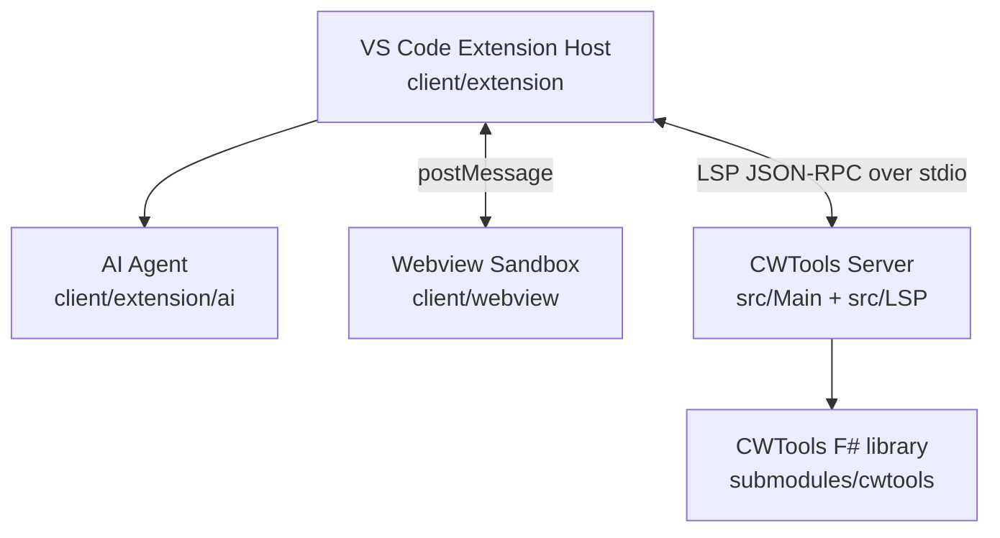
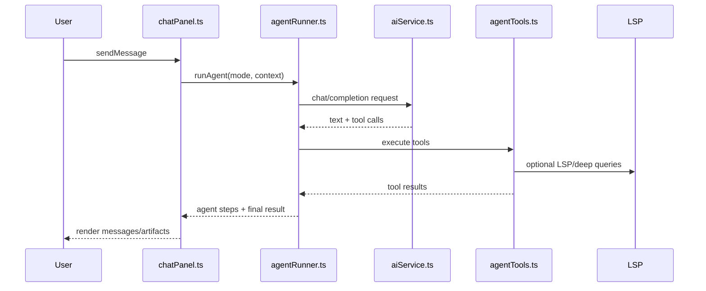

# 架构文档

本文档描述 **Eddy's Stellaris CWTools** 的当前架构、模块边界、数据流和维护约束。
项目是一个面向 Paradox 游戏 Modding 的 VS Code 扩展，主要增强 Stellaris 的语言服务、可视化预览和 AI 辅助开发能力。

当前版本：`2.1.21`

## 总体结构

系统由四层组成：

1. VS Code Extension Host：`client/extension/`
2. AI Agent 子系统：`client/extension/ai/`
3. Webview 沙盒 UI：`client/webview/`
4. .NET/F# 语言服务器：`src/LSP/` 与 `src/Main/`


```mermaid
flowchart TD
    VS["VS Code Extension Host\nclient/extension"]
    AI["AI Agent\nclient/extension/ai"]
    WV["Webview Sandbox\nclient/webview"]
    LSP["CWTools Server\nsrc/Main + src/LSP"]
    CW["CWTools F# library\nsubmodules/cwtools"]

    VS --> AI
    VS <-->|postMessage| WV
    VS <-->|LSP JSON-RPC over stdio| LSP
    LSP --> CW
```

Webviews 只能通过 `postMessage` 与 Extension Host 通信，不能直接访问 `vscode`、Node.js、`fs`、`path` 或 `require()`。

## Extension Host

`client/extension/` 运行在 VS Code 扩展宿主进程中，负责命令注册、LSP 客户端、文件系统访问、Webview 面板宿主和 AI 面板宿主。

| 文件 | 作用 |
| --- | --- |
| `extension.ts` | 扩展入口，注册命令、启动语言服务器、初始化功能 |
| `codeActions.ts` | AI 诊断修复、解释和批量修复 Code Actions |
| `guiPanel.ts` / `guiParser.ts` | `.gui` 文件解析与 Canvas 预览宿主 |
| `solarSystemPanel.ts` / `solarSystemParser.ts` | `solar_system_initializers/` 星系预览 |
| `eventChainPanel.ts` / `eventChainParser.ts` | 事件链扫描、BFS 子图、源码跳转 |
| `techTreePanel.ts` / `techTreeParser.ts` | 科技树扫描、筛选和依赖图 |
| `entityPanel.ts` / `entityAssetParser.ts` | `.asset` 实体模型预览宿主和资源解析 |
| `graphicsFeatures.ts` | 图形资源相关编辑器功能 |
| `ddsDecoder.ts` | DDS/TGA 解码支持 |
| `locDecorations.ts` | 本地化索引和编辑器装饰 |
| `fileExplorer.ts` | Mod 文件树视图 |
| `vanillaCompare.ts` | 与原版文件比较 |
| `updateChecker.ts` | 更新检查 |
| `pdxTokenizer.ts` | PDX 脚本共享分词器 |
| `exprEval.ts` | `@[...]` 数学表达式安全求值 |

## AI Agent 子系统

AI 代码位于 `client/extension/ai/`，由聊天宿主、模型提供商、提示词构建、工具系统、执行循环和多 Agent 协作层组成。

### 核心数据流


```mermaid
sequenceDiagram
    participant User as User
    participant Chat as chatPanel.ts
    participant Runner as agentRunner.ts
    participant Service as aiService.ts
    participant Tools as agentTools.ts
    participant LSP as LSP

    User->>Chat: sendMessage
    Chat->>Runner: runAgent(mode, context)
    Runner->>Service: chat/completion request
    Service-->>Runner: text + tool calls
    Runner->>Tools: execute tools
    Tools->>LSP: optional LSP/deep queries
    Tools-->>Runner: tool results
    Runner-->>Chat: agent steps + final result
    Chat-->>User: render messages/artifacts
```

### 核心文件

| 文件 | 作用 |
| --- | --- |
| `agentRunner.ts` | 推理循环、工具权限、上下文压缩、检查点、回退、写队列 |
| `agentTools.ts` | 工具分发、工具超时、共享黑板和 orchestrator 工具入口 |
| `aiService.ts` | 各 AI Provider HTTP/SSE 客户端、请求适配和回退 |
| `providers.ts` | Provider 元数据、默认模型、视觉/FIM/上下文窗口能力 |
| `promptBuilder.ts` | 系统提示词、模式提示词、项目上下文和子 Agent 提示词 |
| `types.ts` | 消息、工具、模式、上下文、Artifact、设置类型 |
| `contextBudget.ts` | Token 预算和工具结果裁剪 |
| `contextReferences.ts` | `@file`、`@folder`、`@symbol`、`@blackboard` 引用解析 |
| `chatPanel.ts` / `chatHtml.ts` | Extension 侧聊天宿主与 Webview HTML 模板 |
| `chatSettings.ts` / `chatTopics.ts` | AI 设置和会话主题持久化 |
| `inlineProvider.ts` | AI 内联补全 |
| `mcpClient.ts` | MCP stdio/SSE 客户端 |
| `toolCallParser.ts` | DeepSeek DSML、Qwen `<tool_call>` 等非标准工具调用解析 |
| `jsonRepair.ts` | 修复不完整或格式不良的 JSON |
| `usageTracker.ts` | Token 和成本统计 |
| `memoryParser.ts` | 跨会话记忆解析 |

### Agent 模式

`AgentMode` 定义在 `client/extension/ai/types.ts`：

| 模式 | 用途 |
| --- | --- |
| `build` | 默认构建模式，允许读写和验证 |
| `plan` | 计划模式，只读为主，可写设计蓝图 |
| `explore` | 只读探索和 CWTools 查询 |
| `general` | 通用研究模式，排除 `todo_write` |
| `review` | 只读审查模式 |
| `gui_expert` | GUI 专家子 Agent |
| `script_reviewer` | 脚本审查子 Agent |
| `loc_translator` | 本地化翻译 |
| `loc_writer` | 本地化创作 |
| `orchestrator` | 多 Agent 协作调度 |

### 工具系统

工具定义集中在 `client/extension/ai/tools/definitions.ts`，当前定义超过 50 个工具。

| 文件 | 作用 |
| --- | --- |
| `tools/definitions.ts` | 工具 JSON Schema |
| `tools/fileTools.ts` | 文件读写、精确替换、补丁、本地化写入、资产部署 |
| `tools/lspTools.ts` | LSP 查询、诊断、CWTools Deep API、缓存 |
| `tools/externalTools.ts` | 命令、网络搜索、媒体生成/转换、外部资源 |
| `tools/replacerSuite.ts` | `edit_file` 的多策略模糊替换 |
| `agentTools.ts` | 工具名称到实现的路由 |
| `types.ts` | `AgentToolName`、Args、Result 类型 |

新增工具时必须同步更新：

1. `tools/definitions.ts`
2. `agentTools.ts`
3. `types.ts`
4. 如果会写文件，还要加入 `agentRunner.ts` 的 `WRITE_TOOLS`

当前注意事项：

- `write_file`、`multi_replace_file_content`、`replace_lines`、`apply_patch`、`write_localisation` 等写工具经由 `PartitionedWriteQueue` 管理。
- `todo_write` 是纯内存/UI 计划工具，故意不进入写文件锁。
- `.yml` 本地化文件必须使用 `write_localisation`；通用写工具会拒绝本地化写入。
- 当前多 Agent 调度工具是 `dispatch_agents`，配套 `query_blackboard` 和 `merge_results`。
- `ast_mutate` 仍出现在类型和写工具集合中，但没有当前 schema 定义；除非专门补齐该工具，否则不要依赖它。

### Orchestrator

`client/extension/ai/orchestrator/` 管理 DAG 子任务、多 Agent 并行、共享黑板、冲突检测和质量门。

| 文件 | 作用 |
| --- | --- |
| `agentRegistry.ts` | 子 Agent 角色、模式、预算和默认配置 |
| `blackboard.ts` | 跨 Agent 共享数据，支持 key/prefix/type 查询 |
| `taskGraphEngine.ts` | DAG 构建、拓扑排序、就绪节点和循环检测 |
| `parallelExecutor.ts` | 按依赖批次并行执行子任务 |
| `orchestrator.ts` | 调度入口、上下文注入、质量门整合 |
| `conflictDetector.ts` | 基于黑板的写意图和实体注册冲突检测 |
| `qualityGate.ts` | 审查和自动修复流程 |

已注册角色包括 `explorer`、`architect`、`builder`、`locWriter`、`reviewer`、`assetGen`、`guiExpert` 和 `locTranslator`。

## Webview 层

`client/webview/` 编译为浏览器端脚本。Rollup 打包 6 个入口：

| 入口 | 相关文件 | 作用 |
| --- | --- | --- |
| `chatPanel.ts` | `chatPanel.css`, `messageRenderer.ts`, `svgIcons.ts` | AI 聊天 UI、设置、Artifact、计划卡、diff 展示 |
| `guiPreview.ts` | `guiPreview.css`, `canvas.ts` | `.gui` Canvas 预览、拖拽编辑、DDS/TGA 显示 |
| `solarSystemPreview.ts` | `solarSystemPreview.css` | 星系、轨道、行星和环世界交互预览 |
| `eventChainPreview.ts` | `eventChainPreview.css` | Cytoscape.js 事件引用图 |
| `techTreePreview.ts` | `techTreePreview.css` | Cytoscape.js 科技依赖图 |
| `entityPreview.ts` | `entityPreview.css`, `meshWorker.ts`, `pdxMeshParser.ts`, `pdxShaders.ts` | Three.js 实体模型、网格、动画和材质渲染 |

Webview 维护规则：

- 不要导入 Node.js 模块或 `vscode`。
- 所有数据通过 `postMessage` 从 Extension Host 注入。
- CSS 使用 VS Code 主题变量。
- 动画支持 `prefers-reduced-motion`。
- WebGL/Three.js 必须在销毁时释放资源。

## F# / .NET 后端

后端使用 .NET 9。`global.json` 当前固定 SDK `9.0.300`，允许 `latestMinor` roll-forward。

| 路径 | 作用 |
| --- | --- |
| `src/LSP/` | LSP 协议、文档存储、解析和序列化 |
| `src/Main/` | `CWTools Server` 可执行入口、游戏加载、补全、特性桥接 |
| `src/Languages/` | 本地化资源 |
| `src/CSharpExtensions/` | C# 辅助扩展 |
| `submodules/cwtools/` | 上游 CWTools F# 库子模块 |

`src/Main/Main.fsproj` 默认引用 `submodules/cwtools/CWTools/CWTools.fsproj`。
如需使用本地 CWTools，可在 `src/Main/cwtools.local.props` 中设置 `UseLocalCwtools=True` 和 `CwtoolsPath`。

## 构建系统

根目录 `package.json`：

| 命令 | 作用 |
| --- | --- |
| `npm run compile` | TypeScript 扩展编译 + Rollup Webview 打包 |
| `npm run lint` | ESLint 9 检查 `client/` |
| `npm run test:unit` | `ts-mocha` 单元测试 |
| `npm run test:coverage` | `nyc` 覆盖率运行单元测试 |
| `npm run test` | 编译后运行 VS Code 集成测试 |

.NET 常用命令：

```bash
dotnet build src/LSP/
dotnet build src/Main/
```

便捷脚本：

- `build.cmd`
- `build.sh`
- `build.nu`

这些脚本会恢复 dotnet tools、初始化子模块，并调用 `dotnet run --project build -- -t ...`。

## 打包

打包流程记录在 `.agents/workflows/package.md`。当前 release 包从 `release/package.json`
生成，并在 `release/` 目录中执行：

```powershell
npx @vscode/vsce package
```

打包前需要准备 TypeScript/Webview 输出和三平台服务端输出。不要引用根目录 `package.ps1`，当前仓库没有该脚本。

## 关键设计约束

### Webview 隔离

Webview 与 Extension Host 是不同运行环境。Webview 只能发送消息，不能直接访问工作区文件、VS Code API 或 Node.js。

### 写入并发

`PartitionedWriteQueue` 按目标文件串行化写入，不同文件可并行。多文件写入应按路径字典序获取锁，避免 AB/BA 死锁。

### 本地化写入

本地化文件通常需要 BOM、语言头和 key 更新语义。AI 工具层强制使用 `write_localisation`，不要用通用文本替换写 `.yml`。

### 提供商兼容

`aiService.ts` 负责不同 Provider 的请求兼容：

- Claude 使用 Anthropic Messages API 适配。
- GLM 使用 `{id}.{secret}` 生成 HS256 JWT。
- DeepSeek/Qwen 等非标准工具调用由 `toolCallParser.ts` 回退解析。
- 不支持 `tool_choice` 的 Provider 会进行请求清理。

### 内存和性能

项目会扫描大型 Mod 和原版资源：

- LSP 和工具查询必须使用有界缓存。
- Webview 大列表使用虚拟化或 `content-visibility`。
- Three.js、纹理、worker 和事件监听器必须显式清理。

### 错误处理

Extension/AI 代码优先使用 `ErrorReporter`，避免裸 `console.error`。用户可见中文文本尽量集中在 `client/extension/ai/messages.ts`。

## 目录概览

```text
cwtools-vscode/
  client/
    extension/
      ai/
        orchestrator/
        tools/
        agentRunner.ts
        agentTools.ts
        aiService.ts
        promptBuilder.ts
        providers.ts
        types.ts
      extension.ts
      guiPanel.ts
      solarSystemPanel.ts
      eventChainPanel.ts
      techTreePanel.ts
      entityPanel.ts
      codeActions.ts
    webview/
      chatPanel.ts
      messageRenderer.ts
      guiPreview.ts
      solarSystemPreview.ts
      eventChainPreview.ts
      techTreePreview.ts
      entityPreview.ts
      meshWorker.ts
      pdxMeshParser.ts
      pdxShaders.ts
    test/
      unit/
      suite/
  src/
    LSP/
    Main/
    Languages/
    CSharpExtensions/
  submodules/
    cwtools/
  .agents/
    rules/
    workflows/
  release/
    bin/
  rollup.config.mjs
  eslint.config.mjs
  global.json
```
