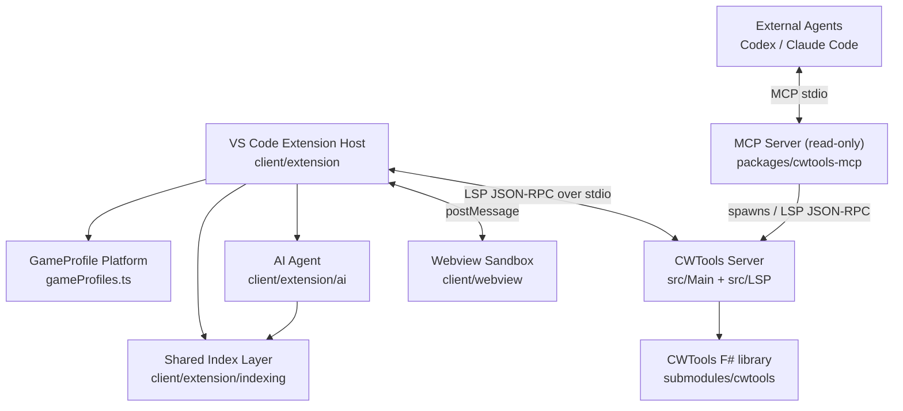
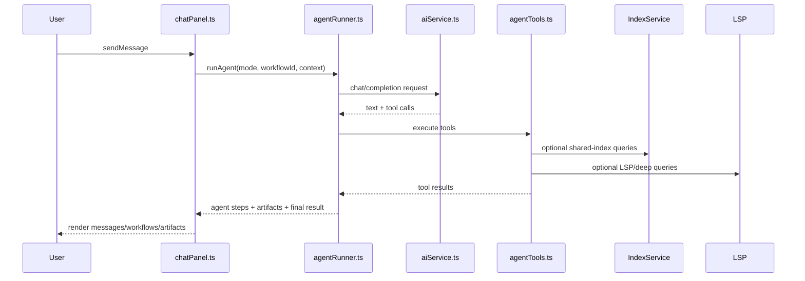

# 架构文档

本文档描述 **Eddy's Stellaris CWTools** 的当前架构、模块边界、数据流和维护约束。项目是一个面向 Paradox 游戏 Modding 的 VS Code 扩展，主要增强 Stellaris 的语言服务、可视化预览和 AI 辅助开发能力。

版本号不在架构文档中重复维护；源码与发布清单分别以根目录 `package.json` 和 `release/package.json` 为准，并由 release gate 检查一致性。

## 总体结构

系统由四个运行层和两个共享平台能力组成：

1. VS Code Extension Host：`client/extension/`
2. AI Agent 子系统：`client/extension/ai/`
3. Webview 沙盒 UI：`client/webview/`
4. .NET/F# 语言服务器：`src/LSP/` 与 `src/Main/`
5. 共享平台能力：`client/extension/gameProfiles.ts` 与 `client/extension/indexing/`
6. 通用 MCP 服务：`packages/cwtools-shared/` 与 `packages/cwtools-mcp/`（随插件分发的只读语义服务，供 Codex / Claude Code 等外部 Agent 调用，见「通用 MCP 服务」一节）


```mermaid
flowchart TD
    VS["VS Code Extension Host\nclient/extension"]
    GP["GameProfile Platform\ngameProfiles.ts"]
    IDX["Shared Index Layer\nclient/extension/indexing"]
    AI["AI Agent\nclient/extension/ai"]
    WV["Webview Sandbox\nclient/webview"]
    LSP["CWTools Server\nsrc/Main + src/LSP"]
    CW["CWTools F# library\nsubmodules/cwtools"]
    MCP["MCP Server (read-only)\npackages/cwtools-mcp"]
    EXT["External Agents\nCodex / Claude Code"]

    VS --> GP
    VS --> IDX
    VS --> AI
    VS <-->|postMessage| WV
    VS <-->|LSP JSON-RPC over stdio| LSP
    AI --> IDX
    LSP --> CW
    EXT <-->|MCP stdio| MCP
    MCP -->|spawns / LSP JSON-RPC| LSP
```

Webviews 只能通过 `postMessage` 与 Extension Host 通信，不能直接访问 `vscode`、Node.js、`fs`、`path` 或 `require()`。

## Extension Host

`client/extension/` 运行在 VS Code 扩展宿主进程中，负责命令注册、LSP 客户端、文件系统访问、Webview 面板宿主、AI 面板宿主，以及共享平台能力的装配。

| 文件 | 作用 |
| --- | --- |
| `extension.ts` | 扩展入口，注册命令、启动语言服务器、创建共享服务 |
| `gameProfiles.ts` | 多游戏 profile 注册表、路径约定、能力开关和安装探测元数据 |
| `indexing/indexService.ts` | 共享增量索引服务 |
| `indexing/locParser.ts` | 本地化 YML 纯解析与查询 helper |
| `indexing/workspaceSymbolParser.ts` | PDXScript / asset / gui 符号解析、查询与引用提取 |
| `codeActions.ts` | AI 诊断修复、解释和批量修复 Code Actions |
| `diagnosticI18n.ts` | 客户端诊断本地化：中文翻译 + 修复建议、`source` 归一化、ignore-key 匹配 |
| `fileExtensions.ts` | 跨平台大小写不敏感扩展名匹配（`matchesExt`、`GRAPHICS_EXTS`），UI 与 AI 层共用 |
| `fsCaseInsensitive.ts` | 大小写不敏感路径解析（用于 Linux/macOS 上大小写不匹配的资源引用） |
| `pathScope.ts` | 中立的 `isPathInsideOrEqual` / `foldPathCase` 路径包含判定，UI 与 AI 沙盒共用 |
| `guiPanel.ts` / `guiParser.ts` | `.gui` 文件解析与 Canvas 预览宿主 |
| `solarSystemPanel.ts` / `solarSystemParser.ts` | `solar_system_initializers/` 星系预览 |
| `eventChainPanel.ts` / `eventChainParser.ts` | 事件链扫描、子图和源码跳转 |
| `techTreePanel.ts` / `techTreeParser.ts` | 科技树扫描、筛选和依赖图 |
| `entityPanel.ts` / `entityAssetParser.ts` | `.asset` 实体模型预览宿主和资源解析 |
| `graphicsFeatures.ts` | 图形资源相关编辑器功能 |
| `ddsDecoder.ts` | DDS/TGA 解码支持 |
| `locDecorations.ts` | 基于 `IndexService` 的本地化 hover / definition / 装饰 |
| `fileExplorer.ts` | Mod 文件树视图 |
| `vanillaCompare.ts` | 与原版文件比较和代码块迁移 |
| `updateChecker.ts` | 更新检查 |
| `pdxTokenizer.ts` | PDX 脚本共享分词器 |
| `exprEval.ts` | `@[...]` 数学表达式安全求值 |

## 共享平台与索引层

### GameProfile 平台

`gameProfiles.ts` 把多游戏差异集中到 profile 中，而不是散落在 extension、索引和 AI 代码里。profile 描述语言 ID、扩展名、原版缓存配置键、本地化目录与编码、脚本/GUI/GFX 目录约定、预览能力、AI 知识块映射和 Steam 安装探测元数据。

扩展入口、索引层和 AI 游戏知识都应优先消费 profile helper。

### IndexService

`IndexService` 是 editor features 和 AI tools 共用的知识层：

- 本地化 key 在激活阶段建立索引，用于 hover、definition 和 AI 查询。
- 更重的 workspace/vanilla symbol 索引通过 `ensureWorkspaceSymbolsReady()` 懒加载，避免拖慢启动。
- 符号层支持 `.txt`、`.gfx`、`.asset`、`.gui`，记录 `origin`、`updatedAt`、`fileVersion` 和轻量引用。
- watcher 对 `.yml` 与 symbol 文件做增量更新；symbol 索引闲置后可回收。
- AI 通过 `query_localisation_index` 和 `query_workspace_index` 消费共享索引。

该层的核心约束是：当共享索引能回答问题时，不要让每个消费者各自重新扫描工作区。

## AI Agent 子系统

AI 代码位于 `client/extension/ai/`，由聊天宿主、模型提供商、提示词构建、工具系统、workflow 系统、执行循环和多 Agent 协作层组成。

### 核心数据流


```mermaid
sequenceDiagram
    participant User as User
    participant Chat as chatPanel.ts
    participant Runner as agentRunner.ts
    participant Service as aiService.ts
    participant Tools as agentTools.ts
    participant Index as IndexService
    participant LSP as LSP

    User->>Chat: sendMessage
    Chat->>Runner: runAgent(mode, workflowId, context)
    Runner->>Service: chat/completion request
    Service-->>Runner: text + tool calls
    Runner->>Tools: execute tools
    Tools->>Index: optional shared-index queries
    Tools->>LSP: optional LSP/deep queries
    Tools-->>Runner: tool results
    Runner-->>Chat: agent steps + artifacts + final result
    Chat-->>User: render messages/workflows/artifacts
```

### 核心文件

| 文件 | 作用 |
| --- | --- |
| `agentRunner.ts` | 推理循环、工具权限、workflow 应用、上下文压缩、检查点、回退 |
| `agentTools.ts` | 工具分发、超时、共享黑板和 orchestrator 工具入口 |
| `aiService.ts` | 各 AI Provider HTTP/SSE 客户端、请求适配、回退和 custom 线协议分发（`customApiFormat`） |
| `promptBuilder.ts` / `prompt/sections/` | Prompt facade、项目上下文和模式系统提示词 |
| `providers.ts` / `providers/models/` | Provider facade、默认模型、能力、价格和缓存折扣 |
| `types.ts` | 消息、工具、模式、上下文、Artifact、设置类型 |
| `runnerPolicy.ts` | 模式级工具过滤、迭代上限和 slim sub-agent 输出预算 |
| `planModeGuard.ts` | 计划模式写入守卫：仅放行实现计划与 plan/blueprint/walkthrough 产物文件；并提供非写入模式的只读 `git_ops` 门控（`validateGitOpsForMode`） |
| `projectProfile.ts` | `/init` 项目扫描、profile 构建/读写、语言/编码检测 |
| `chatInit.ts` | `/init` 命令处理器、profile 生成和 CWTOOLS.md 渲染 |
| `gameKnowledge.ts` | 按 languageId 选择的 9 款游戏 PDXScript 知识块 |
| `skills.ts` | `SKILL.md` 技能索引（built-in/user/project）+ `run_skill` 按需正文加载 |
| `memoryParser.ts` | topic 级 `.cwtools-ai/<topicId>/.cwtools-ai-memory.md` 长期记忆读写与自动裁剪 |
| `workspacePaths.ts` | AI 存储根解析、topic/scratch 目录、多 workspace folder 支持 |
| `workspaceSandbox.ts` | 路径输入清洗、作用域分类（project/ai/workspace/outside）和信任判定 |
| `usageTracker.ts` | 跨会话 token 用量、成本和缓存统计持久化 |
| `diffEngine.ts` | 结构化 diff 引擎 |
| `fileCache.ts` | 有界文件内容缓存 |
| `errorReporter.ts` | 结构化错误报告（fatal/warn/debug） |
| `contextBudget.ts` | Token 预算和工具结果裁剪 |
| `contextReferences.ts` | `@file`、`@folder`、`@symbol`、`@blackboard` 引用解析 |
| `chat/bridge.ts` | Webview 与 Extension Host 的通信桥接 |
| `agentSessionCoordinator.ts` | chat / manager 共用会话状态、模式、workflow、live steps |
| `agentUiBroadcaster.ts` | 多 Webview surface 广播与定向发送 |
| `artifactStore.ts` | Agent Artifact 的会话级存储、排序和稳定 ID |
| `chatPanel.ts` / `chatHtml.ts` | Extension 侧聊天宿主与 Webview HTML 模板 |
| `chatSettings.ts` / `chatTopics.ts` | AI 设置和会话主题持久化 |
| `workflowRegistry.ts` / `workflowI18n.ts` | workflow 元数据、工具策略、阶段定义和本地化 |
| `inlineProvider.ts` | AI 内联补全 |
| `mcpClient.ts` | MCP stdio/SSE 客户端 |
| `toolCallParser.ts` / `jsonRepair.ts` | 非标准工具调用和不完整 JSON 修复 |

### Runner 执行管线（`runner/`）

| 文件 | 作用 |
| --- | --- |
| `compaction.ts` | 历史压缩与上下文窗口辅助 |
| `checkpoint.ts` | V2 断点恢复元数据和孤儿 `tool_call` 补齐 |
| `writeCoordinator.ts` | `PartitionedWriteQueue` 写入协调 + `afterCurrentWrites` 读后于写屏障 |
| `fallbackPolicy.ts` | 模型备选及 API 报错重试管理 |
| `cancellation.ts` | 大模型生成终止判定与异常抛出 |
| `stepEmitter.ts` | 细粒度步骤与 token 增量流式广播 |
| `toolScheduler.ts` | 按 `concurrencyClass` 调度并发和互斥 |
| `toolInvocation.ts` | 把模型 tool call 包装为带风险元数据和稳定 ID 的 `ToolInvocation` |
| `commandPreflight.ts` | `run_command` 命令分词与风险分级 |
| `permissionPolicy.ts` | 低风险预批准规则和 `cwdScope` 校验 |
| `policyEngine.ts` | 分层权限 profile 解析、类型化规则匹配与可执行拒绝（shadow 模式） |
| `autoReviewer.ts` | 只读 LLM 审批 reviewer：决策缓存、fail-open 到 ask_user，绝不放宽沙盒 |
| `shellEnv.ts` | Shell 环境变量白名单构建（按平台基线 + 用户追加） |
| `runLedger.ts` | 运行账本、事件 JSONL 和前端 `runSnapshot` 数据源 |
| `runReducers.ts` | 纯事件投影 reducer：run 状态、工具时间线、Agent 拓扑图、缓存统计 |
| `runReplay.ts` | 运行回放引擎 — 模式 A (recorded-tool) 从 ledger 回答工具调用 |
| `readTracker.ts` | 文件读写完整性跟踪（mtime + SHA-256 hash） |
| `contextMemory.ts` | LLM 驱动的结构化历史压缩 |
| `doomLoopDetector.ts` | 防循环语义检测 |

### 工具系统（`tools/`）

| 文件 | 作用 |
| --- | --- |
| `definitions.ts` | 所有工具的 JSON Schema 定义 |
| `registry.ts` | 模式门控、读写分类、effect/risk/concurrency 元数据 |
| `permissions.ts` | 模式和子 Agent 访问控制 |
| `argRepair.ts` | 执行前参数名和类型漂移修复 |
| `externalTools.ts` | `run_command` 和外部进程工具处理器 |
| `fileTools.ts` | 文件读写编辑工具处理器 |
| `lspTools.ts` | LSP 查询、诊断、补全和深层 API 工具处理器 |
| `diagnosticMetadata.ts` | 诊断分类（`DiagnosticAnalysisCategory`）与修复提示元数据，服务 `analyze_diagnostic_error` |
| `memoryTools.ts` | 记忆读写工具处理器 |
| `replacerSuite.ts` | 10 策略模糊替换引擎（Levenshtein、块锚定、Jaccard 相似度等） |
| `schemaFlatten.ts` | 深层 schema 自动展平及 `nestArguments()` 反向还原 |

### Agent 模式与 Workflow

`AgentMode` 定义在 `client/extension/ai/types.ts`：

```text
build | plan | explore | general | utility | review | script |
gui_expert | script_reviewer | loc_translator | loc_writer | orchestrator
```

`general` 为旧会话兼容保留；`utility` 是通用工作区任务模式；`script` 是当前面向 PDXScript 的高吞吐脚本模式（动态 workflow 协调器，单次 `dispatch_agents` 最多 8 个任务）。

`workflowRegistry.ts` 当前注册：

| Workflow | 模式 | 作用 |
| --- | --- | --- |
| `diagnostic-fix` | `build` | 修复 CWTools 诊断 |
| `loc-generation` | `build` | 生成缺失本地化 |
| `event-chain-design` | `plan` | 设计事件链蓝图 |
| `rules-sync-review` | `review` | 规则同步后的诊断复核 |
| `asset-wiring` | `build` | 修复 sprite / sound 资产引用 |

Runner 会在模式工具集基础上应用 workflow tool policy，并把 workflow prompt supplement 注入系统提示词。聊天 UI 通过 `workflowViewModel.ts`、`workflowI18n.ts` 和 webview workflow 模块展示 workflow、阶段和验证要求。

### 工具系统

工具定义集中在 `client/extension/ai/tools/definitions.ts`。新增工具时必须同步更新：

1. `tools/definitions.ts`
2. `types.ts`
3. `tools/registry.ts`
4. `tools/permissions.ts`（如果访问策略变化）
5. `agentTools.ts`

当前约束：

- `tools/registry.ts` 是工具读写分类和 mode gating 的事实来源；每个 entry 同时携带 `effect`、`riskLevel` 和 `concurrencyClass`。
- `tools/permissions.ts` 从 registry 读取权限元数据，统一执行 mode/sub-agent 访问校验。
- `tools/argRepair.ts` 在 Runner 执行工具前修复常见参数名和类型漂移。
- `runner/toolInvocation.ts` 在执行前归一化 tool call，派生风险元数据，提取目标文件并生成稳定 `invocationId`。
- `runner/toolScheduler.ts` 根据 `concurrencyClass` 实施并发上限和 per-file-write 互斥；对存在在途写入的文件，读操作经 `writeCoordinator.afterCurrentWrites` 排在其后。`getAgentToolTargetFiles` 同时为 `read_file`/`get_pdx_block`/`get_file_context`/`edit_file` 提取目标路径。
- `runner/commandPreflight.ts` 对 `run_command` 做风险分级；destructive 或 escalated 命令必须经由用户授权。
- `planModeGuard.ts` 的 `validateGitOpsForMode` 在 explore/review/script/orchestrator/plan 等非写入模式下只放行 `status`/`diff` 的 `git_ops`，由 `agentRunner`/`agentTools` 在执行前拦截变更性 action。
- `runner/permissionPolicy.ts` 的 `cwdScope` 判断使用 `path.relative`，避免前缀绕过。
- 写工具经由 `PartitionedWriteQueue` 管理；`.yml` 本地化写入必须使用 `write_localisation`。
- `edit_file(filePath, oldString, newString, replaceAll?)` 是单处模糊替换原语（registry `EDIT`、`per-file-write`），复用 `fuzzyReplace` 与既有写守卫。
- `apply_patch`、`multi_replace_file_content`、`ast_mutate` 已从模型可见工具集退役：`agentTools.execute()` 拦截并引导改用 `edit_file`/`replace_lines`/`edit_pdx_block`/`write_localisation`，实现仅保留给内部调用。
- `read_file` 输出带 `N | ` 行号前缀；`write_file`/`edit_file` 会自动剥离误粘贴的前缀（`replacerSuite.ts` 的 `stripLineNumberPrefixes` 兼作 `fuzzyReplace` 的回退匹配策略）。
- 对 PDXScript 优先使用 `query_workspace_index`、`document_symbols`、`get_pdx_block`、`get_file_context` 等结构化读取工具。`get_pdx_block`/`get_file_context` 现会 `markRead` 并返回 1 基行号，读/搜索工具出错时返回 `error` 字段区别于空结果。
- 当前多 Agent 调度工具是 `dispatch_agents`，配套 `query_blackboard` 和 `merge_results`。
- `run_skill` 工具按需加载 `SKILL.md` 正文；`skills.ts` 负责索引、`promptBuilder.ts` 只注入精简技能索引，正文不进入基础 prompt。

### Orchestrator

`client/extension/ai/orchestrator/` 管理 DAG 子任务、多 Agent 并行、共享黑板、冲突检测和质量门。

| 文件 | 作用 |
| --- | --- |
| `agentRegistry.ts` | 子 Agent 角色、模式、预算和默认配置 |
| `blackboard.ts` | 跨 Agent 共享数据，支持 key/prefix/type 查询 |
| `taskGraphEngine.ts` | DAG 构建、拓扑排序、就绪节点和循环检测 |
| `parallelExecutor.ts` | 按依赖批次并行执行子任务 |
| `orchestrator.ts` | 调度入口、上下文注入、质量门整合 |
| `conflictDetector.ts` | 基于黑板的写意图和实体注册冲突检测 |
| `qualityGate.ts` | 审查和自动修复流程 |
| `subAgentSandbox.ts` | 由 `TaskNode` + agent profile 构造 `SubAgentSandbox`，并通过 `enforceSubAgentSafety` 拦截越权工具和越界写入 |
| `worktreeManager.ts` | 可选的每 Agent git worktree 隔离：创建 / `--binary` diff / 应用 / 保留清理 |

已注册角色包括 `explorer`、`architect`、`builder`、`locWriter`、`reviewer`、`assetGen`、`guiExpert` 和 `locTranslator`。

### Run Ledger、Checkpoint 与 Compacted Memory

`runner/runLedger.ts` 提供单例 `RunLedger`，把每次 Agent 运行抽象为 `AgentRunRecord` + 追加式 `AgentRunEvent` 序列流。事件用 per-run 单调递增的 `sequence` 排序，落盘到 `.cwtools-ai/<topic>/runs/<runId>/events.jsonl`，并通过 `runSnapshot` 消息广播到聊天与 Agent Manager 面板。

`runner/checkpoint.ts` 产出 V2 `AgentResumeState`。`prepareMessagesForResume` 为孤儿 `tool_call` 注入合成 interrupted 回复，避免 OpenAI 风格 API 拒绝恢复请求；`buildResumeMessages` 把压缩摘要前置，并限制上下文尾部。

`runner/contextMemory.ts` 产出结构化 `CompactedSummary`，由 `promptBuilder.ts` 在恢复时注入。Agent Manager 的 `runTimeline.ts` 和 `runInspector.ts` 消费 run snapshot 展示事件时间轴和单事件详情。

### Run Reducers

`runner/runReducers.ts` 包含纯函数式的事件投影 reducer，对 `AgentRunEvent[]` 做单遍扫描产出不可变快照：

- `reduceRunState` — 运行进度、token 计数、状态
- `reduceToolTimeline` — 逐轮工具调用列表，可按 agentId 过滤
- `reduceAgentGraph` — 父/子 Agent 拓扑图与沙盒拒绝标记
- `reduceCacheStats` — 按 Agent 聚合前缀缓存命中数据
- `reduceAll` — 一次性聚合以上四个快照

Reducers 无副作用，可在单元测试和 JSONL 回放中独立运行。新增事件类型时必须更新对应 reducer。

### Run Replay

`runner/runReplay.ts` 支持对已记录的 Agent 运行进行回放：

- **模式 A（recorded-tool）**：用新的 prompt/model/provider 重新调用 LLM，但工具调用结果从原始 ledger 回答。成本低，差异隔离到 LLM 推理层。
- **模式 B（full-replay）**：工具也重新执行——需要工作区快照，暂缓实现。
- `ReplaySession` 按 `(toolName, canonicalize(args))` 索引工具结果。
- `maybeServeFromReplay` 供工具执行器短路。

### ReadTracker

`runner/readTracker.ts` 在 Extension Host 中跟踪每个文件的读取状态（mtime + SHA-256 hash），提供三个核心操作：

- `markRead(filePath)` — 记录文件已读
- `canWrite(filePath)` — 检查是否允许写入（未读或外部修改则拦截）
- `markWritten(filePath)` — 写操作后更新跟踪数据

严禁在 Webview 中使用此模块。

### Workspace Paths 与 Sandbox

- `workspacePaths.ts` 解析 AI 存储根目录（`.cwtools-ai/`），支持多 workspace folder 场景下的 topic 目录、scratch 目录和多候选路径。
- `workspaceSandbox.ts` 负责路径输入清洗（去引号、去 code span、去自然语言前缀）、workspace folder 别名解析、`.cwtools-ai` 路径别名解析、以及四级作用域分类（`project`/`ai`/`workspace`/`outside`）和信任判定。

### Runner Policy

`runnerPolicy.ts` 集中管理：

- `filterToolDefinitionsForMode` — 根据模式、sub-agent 标志和排除列表过滤工具
- `resolveMaxToolIterations` — 按模式和上下文窗口大小计算迭代上限
- `resolveRunMaxOutputTokens` — slim sub-agent 的输出 token 预算
- `MODE_ITERATION_LIMITS` — 每种模式的 min/base/cap 配置

### Project Profile 与 `/init`

`projectProfile.ts` 处理 `/init` 命令的项目扫描逻辑：

- 目录检测（events/、common/、localisation/ 等）
- 本地化语言和编码检测（使用负向先行断言正则提取最右侧 `l_<lang>` 标签）
- 命名空间和标识符采样
- 游戏检测和 prompt card 生成
- `queryProjectProfile` 工具处理器

`chatInit.ts` 是 `/init` 命令的入口处理器，负责调用 `projectProfile.ts` 生成 profile 并渲染 `CWTOOLS.md`。

### Game Knowledge

`gameKnowledge.ts` 为 9 款 Paradox 游戏提供 PDXScript 知识块（Stellaris、HOI4、EU4、CK2、CK3、VIC2、VIC3、Imperator、EU5），外加一个通用 Paradox 回退。`promptBuilder.ts` 通过 `getGameKnowledge(languageId)` 动态选择注入。Stellaris 知识块包含 `common/` 各目录的覆盖/加载顺序规则（LIOS/FIOS/FIXES/DUPL/NO）和可选作用域操作符 `scope?` 的说明。

### Skills

`skills.ts` 索引三类作用域的 `SKILL.md` 文件（built-in / user / project），解析其 frontmatter（`name`、`description`、可选 `runAs` / `allowedTools`）。`promptBuilder.ts` 通过 `buildSkillIndexPrompt` 只把精简的技能索引注入系统提示词，受 `SKILL_INDEX_CHAR_LIMIT` 限制；完整技能正文由 `run_skill` 工具按需加载（`loadSkill`，受 `SKILL_BODY_CHAR_LIMIT` 限制），避免长期占用上下文预算。

### Memory Parser

`memoryParser.ts` 管理 topic 级长期记忆文件 `.cwtools-ai/<topicId>/.cwtools-ai-memory.md`（旧的工作区根目录 `.cwtools-ai-memory.md` 仍作为读取回退，新写入一律落到 topic 路径）：

- 按 topic 缓存读取（按签名检查刷新），多个 topic 可同时缓存
- 追加新记忆条目（含日期和优先级标签），自动创建 topic 目录
- 超出 `MAX_MEMORY_CHARS`（~4000 字符）时按优先级自动裁剪

### Usage Tracker

`usageTracker.ts` 跨会话持久化累计 token 用量、成本和缓存统计数据。被设置概览和 Agent Manager 仪表盘消费。

### Replacer Suite

`tools/replacerSuite.ts` 提供 10 种递进式模糊字符串替换策略，经 `FileToolHandler.replace()` 供 `edit_file` 工具与内部 hunk 应用消费：

1. 直接匹配
2. Unicode 归一化（BOM、CRLF、全角/半角、智能引号）
3. 行级 trim
4. 块锚定（首末行 + Levenshtein 内部评分）
5. 空白归一化
6. 缩进弹性
7. 转义归一化
8. 边界 trim
9. 上下文感知
10. Jaccard 相似度滑动窗口

匹配失败时 `findNearestMatch` 返回最佳部分匹配信息，帮助 AI 自我纠正。`stripLineNumberPrefixes` 可剥离 `read_file` 输出的 `N | ` 行号前缀，并作为 `fuzzyReplace` 的回退匹配策略。

### Schema Flatten

`tools/schemaFlatten.ts` 为弱工具调用能力的 Provider 自动展平深层嵌套的 tool schema（深度 > 2 或叶子 > 10 时触发），执行工具前由 `nestArguments()` 反向还原为嵌套结构。

## 通用 MCP 服务

`packages/cwtools-shared/` 与 `packages/cwtools-mcp/` 是两个 npm workspace 子包，构成一个**只读**的 Model Context Protocol 服务，把本项目的 PDX 语义能力（类型/规则/作用域/诊断/定义引用/补全/深层语义）平台化输出给 Codex、Claude Code 等外部 Agent。文件写入不由 MCP 负责，交给宿主 Agent 自带环境。

### 分层与边界

- `cwtools-shared`（无 VS Code 依赖的核心）：生成式工具 schema、`HostServices` 接口、路径/规则安全、vanilla 缓存与加载就绪（readiness）标注、游戏知识。它不 import `vscode`、`vscode-languageclient`、webview 或 extension context。
- `cwtools-mcp`（薄适配层）：CLI、stdio/HTTP transport、`NodeHostServices`、`LspProcessHost`（拉起 `CWTools Server` 并走 LSP JSON-RPC）、`vscodeCache.ts`（探测已安装插件的 server 二进制、解压规则与 globalStorage 原版缓存）。经 esbuild 打成单文件自包含 `cwtools-mcp.cjs`。

### 工具集与单一事实源

- 首期工具为 **21 个只读工具**（`cwtools-shared/src/tools/names.ts`）：`query_types`/`query_rules`/`query_scope`/`get_diagnostics`/`analyze_diagnostic_error`/`query_project_profile`/`query_workspace_index`/`query_localisation_index`/`get_pdx_block`/`get_completion_at`/`document_symbols`/`workspace_symbols`/`query_definition`/`query_definition_by_name`/`query_references`，以及深层语义 `query_scripted_effects`/`query_scripted_triggers`/`query_enums`/`query_static_modifiers`/`query_variables`/`get_entity_info`。
- schema 由 `tools/generate-mcp-schema.cjs` 从上游 `definitions.ts` + `registry.ts` 生成到 `cwtools-shared/src/generated/mcpTools.ts`，**不手写**；白名单同时存在于 `names.ts` 与生成脚本，须保持一致，contract 测试检测漂移。
- 共享 dispatcher（`tools/toolHandlers.ts`）把每个工具路由到对应 `cwtools.ai.*` LSP 命令或 host 调用。新增语义能力必须先在 `src/LSP`/`src/Main` 增加 `cwtools.ai.*` 命令（只读命令同时登记到 `LanguageServer.fs` 的 `isReadCmd`），再在 dispatcher 接线，不在 MCP 内重写 CWTools 语义。

### 只读、结果标注与自描述

- `cwtools-mcp` 的 `createToolCallHandler` 对任何非白名单（写）工具返回 `tool_not_available`，确保纯只读面。
- 受 vanilla 影响的工具结果附 `vanillaCache`（`available`/`source`/`reason`），缺原版缓存时带 warning；依赖 game 加载的工具在加载未完成时返回 `status: "loading"` + `readiness.ready=false`，避免把"尚未加载"误读成"查无此物"。
- 连接时下发 server `instructions`（`server.ts`），引导模型在 Paradox/群星项目里优先用工具验证 ID、查语法、查诊断。

### 后端、规则与缓存依赖

- 全工作区诊断由新增的 `cwtools.ai.getAllDiagnostics` 命令聚合 server 端 `fileDiagnosticStates`（`get_diagnostics` 不带文件时走它，而非只返回 freshness）。
- 规则源优先级：`--rules <dir|zip>` > 已装插件解压规则 > dev 仓库 `submodules/…/config` > 打包 `*-rules.zip`（zip 自动解压复用）。
- 原版缓存：`--cache <dir>` 显式指定，或自动探测插件 globalStorage 的 `<game>.cwb`；缺失时可用 `--game-path` 让 server 首次构建。

### 分发与版本跟随

- `package.ps1` 把 MCP bundle 打到 `release/bin/mcp/cwtools-mcp.cjs` 并随 VSIX 分发；`extension.ts` 激活时把它复制到**版本无关稳定路径** `globalStorage/eddy.eddy-stellaris-cwt/mcp/cwtools-mcp.cjs`，外部 Agent 指向该路径即自动跟随插件更新。
- VS Code 对同版本号 `--force` 重装不替换文件；交付 MCP 改动需升版本号（根 `package.json` + `release/package.json` + CHANGELOG 同步）。

## Webview 层

`client/webview/` 编译为浏览器端脚本。Rollup 打包 7 个入口：

| 入口 | 相关文件 | 作用 |
| --- | --- | --- |
| `chatPanel.ts` | `chatPanel.css`, `chat/`, `messageRenderer.ts`, `svgIcons.ts` | AI 聊天 UI、workflow、设置、Artifact、计划卡、diff 展示 |
| `agentManager.ts` | `agentManager.css`, `chat/` message contracts | Detached Agent Manager，查看 run、agents、artifacts、tasks |
| `guiPreview.ts` | `guiPreview.css`, `canvas.ts` | `.gui` Canvas 预览、拖拽编辑、DDS/TGA 显示 |
| `solarSystemPreview.ts` | `solarSystemPreview.css` | 星系、轨道、行星和环世界交互预览 |
| `eventChainPreview.ts` | `eventChainPreview.css` | Cytoscape.js 事件引用图 |
| `techTreePreview.ts` | `techTreePreview.css` | Cytoscape.js 科技依赖图 |
| `entityPreview.ts` | `entityPreview.css`, `meshWorker.ts`, `pdxMeshParser.ts`, `pdxShaders.ts` | Three.js 实体模型、网格、动画和材质渲染 |

`client/webview/chat/` 承载 chat 和 Agent Manager 的共享浏览器模块，包括 artifacts、topics、workflow、formatters、i18n、modes、slash commands、settings overview、live steps、markdown、annotations、context mentions、message contracts、run timeline 和 run inspector。

Webview 维护规则：

- 不要导入 Node.js 模块或 `vscode`。
- 所有数据通过 `postMessage` 从 Extension Host 注入。
- CSS 使用 VS Code 主题变量。
- 动画支持 `prefers-reduced-motion`。
- WebGL/Three.js 必须在销毁时释放资源。

## F# / .NET 后端

后端使用 .NET 9。`global.json` 当前固定 SDK `9.0.300`，允许 `latestMinor` roll-forward。

| 路径 | 作用 |
| --- | --- |
| `src/LSP/` | LSP 协议、文档存储、解析和序列化 |
| `src/Main/` | `CWTools Server` 可执行入口、游戏加载、补全、特性桥接 |
| `src/Languages/` | 本地化资源 |
| `src/CSharpExtensions/` | C# 辅助扩展 |
| `submodules/cwtools/` | 上游 CWTools F# 库子模块 |

`src/Main/Main.fsproj` 默认引用 `submodules/cwtools/CWTools/CWTools.fsproj`。如需使用本地 CWTools，可在 `src/Main/cwtools.local.props` 中设置 `UseLocalCwtools=True` 和 `CwtoolsPath`。项目使用 `RuntimeIdentifiers`（复数）声明 `win-x64`/`linux-x64`/`osx-x64`，无 RID 的普通 `dotnet build` 也能成功；文件系统比较按平台条件化（仅 Windows 用 `OrdinalIgnoreCase`）。

### 诊断、格式化与补全降级

- **诊断元数据**：服务端发布的每条 `Diagnostic` 携带 `codeDescription`（指向 `docs/diagnostic-codes.md#<code>` 的 URL）和 LSP `tags`（Deprecated/Unnecessary）。`docs/diagnostic-codes.md` 是中英双语的 CWxxx 错误码参考，标题锚点与错误码一一对应。
- **客户端诊断增强**：`client/extension/diagnosticI18n.ts` 在 LSP middleware 中把英文校验消息替换为中文翻译 + 修复建议（非中文环境追加英文 💡 建议行），由 `cwtools.ai.enhancedDiagnostics` 开关控制；ignore-list 匹配在增强之前针对原始服务端消息执行。
- **动态参数诊断延迟**：动态参数类诊断可延迟到工作区加载完成后批量预热再重发，由 `cwtools.diagnostics.deferDynamicParameterDiagnostics` / `dynamicPreflightTimeoutMs` / `dynamicPreflightMaxEntities` 配置。
- **文档格式化**：服务端实现 `DocumentFormatting`——`.yml` 本地化文件归一化缩进并保留 BOM/换行风格，PDX 脚本经 `CKPrinter` 整文档格式化。
- **补全锁降级**：`src/LSP/LanguageServer.fs` 对 Completion 请求使用 `TryEnterReadLock`（默认 `completionLockTimeoutMs = 150` 毫秒超时），超时后从 stale-completion 缓存返回降级结果，避免长校验阻塞补全。`LanguageServer.fs` 的 `isReadCmd` 列表登记只读 `cwtools.ai.*` 命令（含 `getAllDiagnostics`、`getDiagnosticsFresh`、`waitDiagnosticsFresh`、`getValidationStatus`、`revalidateFiles`、`parseFragment` 等），未登记的命令会被当成写命令做锁路由。
- **全工作区诊断聚合**：`cwtools.ai.getAllDiagnostics` 遍历 server 端 `fileDiagnosticStates`，按 severity 过滤 + limit 聚合返回整个工作区的真实诊断（供 MCP 的全项目 `get_diagnostics` 使用），区别于只返回 freshness 的 `getValidationStatus`。
- **RevalidateRequest**：编辑 `inline_scripts/` 定义文件保存后，绕过防抖立即重新校验其调用方文件。
- **自定义 scripted 类型增量刷新**：编辑/保存 `common/scripted_triggers/`、`common/scripted_effects/`、`common/script_values/` 下的定义文件时，绕开整库全量 `RefreshCaches`，改走增量类型补丁——`IGame.RefreshScriptedTypes` 经 `RulesManager.RefreshScriptedTypes` 按 `range.FileName` 滤除旧 `typeDefInfo` 条目、对改动实体单趟 `getTypesFromDefinitions`、仅对改动的 typeKey 增量重建 `tempTypeMap`（只重建这些类型的 `createStringSet` trie，其余类型复用已有 StringSet，不再整表 `typeMapFromTypeDefInfo`，逐键语义与全量一致），并复用 `buildServices` 重建补全/校验/Info 三服务；删除文件走 `IGame.RemoveScriptedTypes`（含 `ResourceManager.RemoveFile`）。调用方重校验复用类型引用反向索引（`TypeReferenceIndex` / `FindAllRefsByType`），并把当前打开的其它文件排入重校验队列。该路径由 `experimental` 开关门控、在 `gameStateLock` 写锁内执行，遇异常/非白名单类型/连续 25 次后回退全量；`inline_scripts`（非 `type[...]` 叶子类型）不进增量白名单，仍走全量 + 调用方重校验（见上一条）。

### Shader 支持

Shader 支持覆盖 `.shader` 和 `.fxh`，涉及：

- `release/package.json` 的 `pdx-shader` language contribution。
- `src/Main/Program.fs` 的语义 token、document symbol、document link 桥接。
- `src/Main/GameLoader.fs` 的 vanilla fx source 加载。
- `submodules/cwtools/CWTools/Game/PdxShaderFeatures.fs` 的 shader 解析与特征提取。

维护约束：

- 嵌套块如 `Samplers`、`VertexStruct` 应使用花括号深度计数解析，避免单层 `[^}]+` 正则截断嵌套内容。
- 高频语义计算应复用文件文本 hash 缓存和 lazy built-in 集合，避免重复读盘或重复构建大集合。
- 字符串区间扫描要保留转义双引号 `\"` 的处理。
- 尽量把 shader parsing helper 留在 `PdxShaderFeatures.fs`，避免让 `Program.fs` 堆积大量顶级定义。

### Vanilla Compare

`client/extension/vanillaCompare.ts` 支持全文件 diff、光标所在块迁移（`migrateBlockFromVanilla`）和文件级批量迁移（`migrateChangedFromVanilla`）。块识别依赖 game profile 的目录和标识约定。应用多个 `WorkspaceEdit` 时应按起始行从后往前替换，避免前面的替换改变后续块的行号。

## 构建系统

根目录 `package.json`：

| 命令 | 作用 |
| --- | --- |
| `npm run compile` | TypeScript 扩展编译 + Rollup Webview 打包 |
| `npm run lint` | ESLint 9 检查 `client/` |
| `npm run test:unit` | `ts-mocha` 单元测试 |
| `npm run test:coverage` | `nyc` 覆盖率运行单元测试 |
| `npm run test` | 编译后运行 VS Code 集成测试 |
| `npm run check:release` | 发布前质量门 |
| `npm run verify` | `lint + compile + unit + release gate` 综合验证 |
| `npm run build:shared` / `build:mcp` | 构建 MCP 子包（`packages/cwtools-shared` / `cwtools-mcp`） |
| `npm run generate:mcp-schema` | 从上游 `definitions.ts`+`registry.ts` 重生成 MCP 工具 schema |
| `npm run test:contracts` | MCP 合约测试（schema 漂移、只读策略、工具路由、深层工具） |

规则同步脚本（`tools/rules-sync/`）：

- `npm run rules:stellaris` — 交互式入口
- `npm run rules:stellaris:scan` / `check` / `update` — 扫描、校验（支持 `--ci`）、更新
- `npm run rules:stellaris:report` — 只读对比游戏 `script_documentation` 日志、原版 `common/` 与 CWT 配置基线，生成自包含 HTML 报告（`tools/rules-sync/report.ts`，默认自动打开浏览器，`--no-open` 关闭）

.NET 常用命令：

```bash
dotnet build src/LSP/
dotnet build src/Main/
```

> 注意：`build/Program.fs` 中的 Fake 构建系统为上游遗留代码。当前推荐使用 `npm run compile` 和 `package.ps1`。


## 打包

打包流程记录在 `.agents/workflows/package.md`。当前 release 包从 `release/package.json` 生成，并在 `release/` 目录中执行：

```powershell
npx @vscode/vsce package
```

打包前需要准备 TypeScript/Webview 输出和三平台服务端输出。推荐在根目录下运行 `package.ps1` 脚本（或使用快捷指令 `npm run pack:install` / `npm run pack:quick`），可一键自动化执行所有环境的编译、静态资源复制、包体打包及本地强制升级安装。

打包流程还会构建并用 esbuild 把 MCP 打成单文件 `release/bin/mcp/cwtools-mcp.cjs` 随 VSIX 分发；插件激活时再复制到 globalStorage 稳定路径（见「通用 MCP 服务」）。注意 VS Code 对**同版本号**重装不替换已装文件，交付改动须升版本号（`npm run pack:install -- -Version <x>`，并同步根/release `package.json` 与 CHANGELOG）。

打包时会将 `submodules/cwtools-stellaris-config/config/` 压缩为 `release/rules/stellaris-rules.zip` 作为 fallback 规则（正常情况下通过 GitHub 拉取规则，仅在网络不可用时启用此 fallback）。F# 服务端使用 `System.IO.Compression.ZipFile` 直接从内存读取 ZIP 内容，无需解压到磁盘。

## 关键设计约束

### Webview 隔离

Webview 与 Extension Host 是完全隔离的运行环境。由于 Webview 运行在受限的 Chromium 沙盒中，**绝对禁止在其前端引入任何 Node.js 原生 API (如 fs, path) 或 vscode 模块**。

为了确保沙盒的物理安全等级：
- **底层 I/O 完全收敛**：原本散落在 Webview 安全边界内的多文件并发文件写入和 ReadTracker 的 I/O 跟踪逻辑已被完全移出到了 Extension Host 中。
- **文件读取与操作代理化**：Webview 前端（如 ChatPanel 和 AgentManager）已退化为纯数据驱动的展示壳。如果需要获取或监控工作区的文件元数据、文件树或是写操作动作，前端必须通过标准的 `vscode.postMessage` 异步 IPC 机制向 Extension 宿主发起委托，由宿主执行安全校验后再将数据流式返回。这彻底杜绝了前端由于受限沙盒的间接引用漏洞导致宿主文件系统泄漏的风险。

### 写入并发

`PartitionedWriteQueue` 按目标文件串行化写入，不同文件可并行。多文件写入应按路径字典序获取锁，避免 AB/BA 死锁。

### 工具并发与风险

`tools/registry.ts` 为每个工具派生 `effect`、`riskLevel` 和 `concurrencyClass`。`runner/toolInvocation.ts` 把模型 tool call 封装为带 `invocationId` 的 `ToolInvocation`，`runner/toolScheduler.ts` 据此按类分配并发额度并对 per-file-write 工具按目标文件互斥。

### 权限与命令安全

`run_command` 命令进入执行前先由 `runner/commandPreflight.ts` 分词分类；`runner/permissionPolicy.ts` 用 `path.relative` 做严格的 `cwdScope` 父子目录判定，只放行预批准的低风险命令，其余必须经由用户授权。

### 子 Agent 沙盒

`orchestrator/subAgentSandbox.ts` 在分派每个子任务时构造 `SubAgentSandbox`：默认排除高危/交互式特权工具，对只读/计划角色禁用写工具，并根据角色与 `taskNode.plannedFiles` 收紧 `writeScope`。路径包含判定复用 `pathScope.ts` 的 `isPathInsideOrEqual`/`foldPathCase`（仅 Windows 折叠大小写）。`plannedFiles` 全部为本地化 `.yml` 的子任务会额外屏蔽通用写工具、只允许 `write_localisation`，且 `dispatch_agents` 会把此类任务自动升级为 `loc_writer` 角色。`enforceSubAgentSafety` 在 Host 层做最终拦截。

### 运行账本与恢复

每次 Agent 运行通过 `runner/runLedger.ts` 写入 `AgentRunRecord` 与 `AgentRunEvent` 序列。`runner/checkpoint.ts` 保存 V2 resume state，`runner/contextMemory.ts` 产出结构化压缩摘要，前端通过 `runSnapshot` 展示实时状态。

### 本地化写入

本地化文件通常需要 BOM、语言头和 key 更新语义。AI 工具层强制使用 `write_localisation`，不要用通用文本替换写 `.yml`。

### 共享索引优先

共享索引已经承担 localisation 和 workspace symbol 查询。新的消费者优先复用 `IndexService`，而不是各自新增目录遍历和全文扫描。

### Provider 兼容

`aiService.ts` 负责不同 Provider 的请求兼容：

- Claude 使用 Anthropic Messages API 适配；`capabilities.ts` 的 `getAnthropicModelFeatures` 按模型派生 adaptive thinking / effort / sampling 移除等请求特性。
- Custom Provider 支持四种线协议，由 `cwtools.ai.customApiFormat` 选择：`openai-chat-completions`（默认）、`openai-responses`、`anthropic-messages`、`gemini-generate-content`。
- Endpoint 按 Provider 存储在 `cwtools.ai.providerEndpoints`（map）；旧的全局 `cwtools.ai.endpoint` 由 `migrateLegacyEndpoint()` 一次性迁移。
- GLM 使用 `{id}.{secret}` 生成 HS256 JWT。
- DeepSeek/Qwen 等非标准工具调用由 `toolCallParser.ts` 回退解析。
- 不支持 `tool_choice` 的 Provider 会进行请求清理。
- 模型定价与上下文窗口支持 `providerId:model` 作用域键（如 `openrouter:*`），`getModelPricing` / `getModelContextTokens` 优先匹配 Provider 级条目再回退裸模型名。

### 内存和性能

项目会扫描大型 Mod 和原版资源：

- LSP、索引和工具查询必须使用有界缓存。
- workspace symbol 索引采用懒加载和闲置回收。
- Webview 大列表使用虚拟化或 `content-visibility`。
- Three.js、纹理、worker 和事件监听器必须显式清理。

### 错误处理与 i18n

Extension/AI 代码优先使用 `ErrorReporter`，避免裸 `console.error`。用户可见中文文本尽量集中在：

- `client/extension/ai/messages.ts`
- `client/extension/ai/workflowI18n.ts`
- `client/webview/chat/i18n.ts`
- `client/webview/chat/messages.*.ts`

CWTools 诊断消息的中文化不走上述模块：F# 服务端硬编码英文文本，由 `client/extension/diagnosticI18n.ts` 在 LSP middleware 中按消息形态 + CW 错误码翻译并附加修复建议（见"诊断、格式化与补全降级"一节）。

### 前缀缓存（Prompt Cache）度量审计与高保真展现 (D3 重构)

针对现代长上下文 AI 推理中的成本与效能问题，系统内建了完善的 **前缀缓存度量审计与高保真展现** 体系：

1. **多厂商缓存向后兼容嗅探**：
   在 `agentRunner.ts` 的执行流中，系统会自动提取大模型回传响应里的缓存计量。采用极其健壮的兼容性设计，支持包括 `usage.cached_tokens`、`prompt_tokens_details.cached_tokens`（OpenAI/DeepSeek 格式）、以及 `prompt_cache_hit_tokens`（Anthropic 格式）等多源字段，同时精准解析并获取 Claude 3.5 和 DeepSeek 特有的“新建缓存字节（`cache_creation_tokens`）”。

2. **打折费率与成本精算 (Pricing Engine)**：
   `providers/models/pricing.ts` 中集成了模型缓存节省的精算公式（费率数据存于 `providers/models/pricingData.json`）。系统能精准识别模型类型并应用差异化打折率（例如：识别为 `deepseek` 或 `claude` 则触发 0.1× 的 1 折特惠计费，识别为 `gpt-` 系列则触发 0.5× 的 5 折优惠），并将每一轮推断在物理上节省的真实人民币金额（CNY）通过 `savedCostCny` 字段流式发射。

3. **三柱微图 (Cache Sparkline) 极致展现**：
   在前端 Webview（`messageRenderer.ts`）中，系统拦截 `cache_stats` 事件，将“缓存命中数”、“新建缓存数”、“穿透数”三者按比例编译并渲染为视觉效果惊艳的“绿色 (命中) / 蓝色 (新建) / 橙黄色 (穿透) 三柱微图进度条”，并在右侧醒目高亮展现为用户节省的具体金额。

4. **全局指标与实时会话双重覆写**：
   - **全局统计**：全局多轮历史运行统计通过 `UsageTracker` 模块对 `UsageRecord` 进行累加与持久化。在设置界面的“消耗统计”中，动态汇总并渲染出总消耗、预估成本、累计缓存命中量、整体命中率以及累计省钱金额，做到彻底的数据透明度。
   - **会话仪表盘 (Context Gauge)**：在聊天面板顶部的会话上下文进度条区域中，我们通过拦截 `tokenUsage` 消息，实时为标签覆写类似于 `, ⚡ X,XXX 缓存` 的字样，让当前实时会话的缓存状态触手可得。
   - **高保真 SVG 替换规范**：所有涉及缓存命中的 UI 展现（包括仪表盘和运行管理器卡片）均杜绝了非标准的裸 Emoji（如 ⚡），必须升级并内联高清晰度的 SVG 矢量闪电图标（支持亮暗色主题自适应与垂直排版像素对齐）。

## 目录概览

```text
cwtools-vscode/
  client/
    extension/
      ai/
        orchestrator/         DAG 任务图、黑板、沙盒、冲突检测、质量门
        runner/               执行管线：压缩、检查点、调度、权限、账本、
                              reducer、回放、读跟踪、记忆
        chat/                 Webview ↔ Host 通信桥
        tools/                schema、registry、permissions、handlers、
                              模糊替换引擎、schema 展平
        prompt/
          sections/           baseSystem.ts, modePrompts.ts
        providers/
          models/             defaults.ts, capabilities.ts, pricing.ts
        agentRunner.ts        主推理循环
        agentTools.ts         工具分发入口
        aiService.ts          多 Provider AI 客户端
        promptBuilder.ts      Prompt 构建门面
        projectProfile.ts     /init 项目扫描和 profile
        chatInit.ts           /init 命令处理器
        gameKnowledge.ts      9 款游戏 PDXScript 知识块
        skills.ts             SKILL.md 索引 + run_skill 按需加载
        memoryParser.ts       长期工作区记忆
        workspacePaths.ts     AI 存储路径解析
        workspaceSandbox.ts   路径沙盒和作用域分类
        runnerPolicy.ts       模式级工具过滤和迭代上限
        planModeGuard.ts      计划模式写入守卫
        usageTracker.ts       token 用量和成本跟踪
        diffEngine.ts         结构化 diff 引擎
        fileCache.ts          有界文件缓存
        types.ts              所有 AI 类型定义
      indexing/
      extension.ts
      gameProfiles.ts
      diagnosticI18n.ts       客户端诊断中文翻译 + 修复建议
      fileExtensions.ts       大小写不敏感扩展名匹配
      fsCaseInsensitive.ts    大小写不敏感路径解析
      pathScope.ts            共享路径包含判定
      vanillaCompare.ts
    webview/
      chat/                   22 个提取的浏览器模块
      messageRenderer.ts      消息渲染（含缓存 sparkline）
      svgIcons.ts             高保真 SVG 图标库
      agentManager.ts
      chatPanel.ts
      guiPreview.ts
      solarSystemPreview.ts
      eventChainPreview.ts
      techTreePreview.ts
      entityPreview.ts
    test/
      unit/                   58 个单元测试文件
      suite/
  docs/
    diagnostic-codes.md       CWxxx 诊断码中英双语参考（codeDescription 链接目标）
  src/
    LSP/
    Main/
    Languages/
    CSharpExtensions/
  submodules/
    cwtools/
    cwtools-stellaris-config/
  packages/
    cwtools-shared/           MCP 只读核心：生成式 schema、HostServices、安全、
                              vanilla/readiness 标注、游戏知识（无 VS Code 依赖）
    cwtools-mcp/              MCP stdio/HTTP server：CLI、NodeHostServices、
                              LspProcessHost、vscodeCache 探测、esbuild 单文件 bundle
  .agents/
    rules/                    coding-guidelines.md
    workflows/                package.md
  tools/
    check-release.js
    generate-mcp-schema.cjs   从上游 definitions/registry 生成 MCP 工具 schema
    rules-sync/               规则 scan/check/update/report 工具（report.ts 生成 HTML 对比报告）
  release/
    bin/
      server/                 三平台 CWTools Server（self-contained）
      mcp/                    cwtools-mcp.cjs（esbuild 单文件 MCP，随 VSIX 分发）
    rules/
      stellaris-rules.zip       Fallback 规则压缩包
    syntaxes/                 TextMate 语法（paradox, stellaris, pdxshader）
  .config/
    tsconfig.extension.json
    tsconfig.webview.json
    tsconfig.webview-chat.json
    tsconfig.webview-entity.json
    tsconfig.webview-event.json
    tsconfig.webview-solar.json
    tsconfig.webview-tech.json
  rollup.config.mjs
  eslint.config.mjs
  global.json
```
