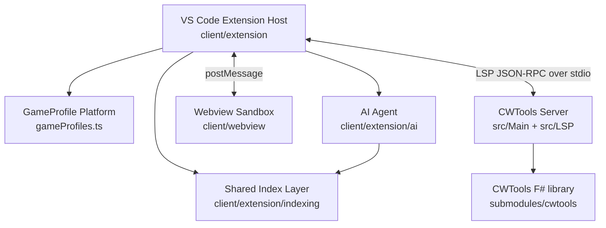
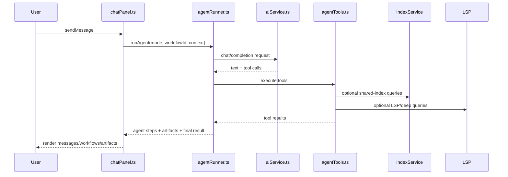

# 架构文档

本文档描述 **Eddy's Stellaris CWTools** 的当前架构、模块边界、数据流和维护约束。项目是一个面向 Paradox 游戏 Modding 的 VS Code 扩展，主要增强 Stellaris 的语言服务、可视化预览和 AI 辅助开发能力。

版本号不在架构文档中重复维护；源码与发布清单分别以根目录 `package.json` 和 `release/package.json` 为准，并由 release gate 检查一致性。

## 总体结构

系统由四个运行层和两个共享平台能力组成：

1. VS Code Extension Host：`client/extension/`
2. AI Agent 子系统：`client/extension/ai/`
3. Webview 沙盒 UI：`client/webview/`
4. .NET/F# 语言服务器：`src/LSP/` 与 `src/Main/`
5. 共享平台能力：`client/extension/gameProfiles.ts` 与 `client/extension/indexing/`


```mermaid
flowchart TD
    VS["VS Code Extension Host\nclient/extension"]
    GP["GameProfile Platform\ngameProfiles.ts"]
    IDX["Shared Index Layer\nclient/extension/indexing"]
    AI["AI Agent\nclient/extension/ai"]
    WV["Webview Sandbox\nclient/webview"]
    LSP["CWTools Server\nsrc/Main + src/LSP"]
    CW["CWTools F# library\nsubmodules/cwtools"]

    VS --> GP
    VS --> IDX
    VS --> AI
    VS <-->|postMessage| WV
    VS <-->|LSP JSON-RPC over stdio| LSP
    AI --> IDX
    LSP --> CW
```

Webviews 只能通过 `postMessage` 与 Extension Host 通信，不能直接访问 `vscode`、Node.js、`fs`、`path` 或 `require()`。

## Extension Host

`client/extension/` 运行在 VS Code 扩展宿主进程中，负责命令注册、LSP 客户端、文件系统访问、Webview 面板宿主、AI 面板宿主，以及共享平台能力的装配。

| 文件 | 作用 |
| --- | --- |
| `extension.ts` | 扩展入口，注册命令、启动语言服务器、创建共享服务 |
| `gameProfiles.ts` | 多游戏 profile 注册表、路径约定、能力开关和安装探测元数据 |
| `indexing/indexService.ts` | 共享增量索引服务 |
| `indexing/locParser.ts` | 本地化 YML 纯解析与查询 helper |
| `indexing/workspaceSymbolParser.ts` | PDXScript / asset / gui 符号解析、查询与引用提取 |
| `codeActions.ts` | AI 诊断修复、解释和批量修复 Code Actions |
| `guiPanel.ts` / `guiParser.ts` | `.gui` 文件解析与 Canvas 预览宿主 |
| `solarSystemPanel.ts` / `solarSystemParser.ts` | `solar_system_initializers/` 星系预览 |
| `eventChainPanel.ts` / `eventChainParser.ts` | 事件链扫描、子图和源码跳转 |
| `techTreePanel.ts` / `techTreeParser.ts` | 科技树扫描、筛选和依赖图 |
| `entityPanel.ts` / `entityAssetParser.ts` | `.asset` 实体模型预览宿主和资源解析 |
| `graphicsFeatures.ts` | 图形资源相关编辑器功能 |
| `ddsDecoder.ts` | DDS/TGA 解码支持 |
| `locDecorations.ts` | 基于 `IndexService` 的本地化 hover / definition / 装饰 |
| `fileExplorer.ts` | Mod 文件树视图 |
| `vanillaCompare.ts` | 与原版文件比较和代码块迁移 |
| `updateChecker.ts` | 更新检查 |
| `pdxTokenizer.ts` | PDX 脚本共享分词器 |
| `exprEval.ts` | `@[...]` 数学表达式安全求值 |

## 共享平台与索引层

### GameProfile 平台

`gameProfiles.ts` 把多游戏差异集中到 profile 中，而不是散落在 extension、索引和 AI 代码里。profile 描述语言 ID、扩展名、原版缓存配置键、本地化目录与编码、脚本/GUI/GFX 目录约定、预览能力、AI 知识块映射和 Steam 安装探测元数据。

扩展入口、索引层和 AI 游戏知识都应优先消费 profile helper。

### IndexService

`IndexService` 是 editor features 和 AI tools 共用的知识层：

- 本地化 key 在激活阶段建立索引，用于 hover、definition 和 AI 查询。
- 更重的 workspace/vanilla symbol 索引通过 `ensureWorkspaceSymbolsReady()` 懒加载，避免拖慢启动。
- 符号层支持 `.txt`、`.gfx`、`.asset`、`.gui`，记录 `origin`、`updatedAt`、`fileVersion` 和轻量引用。
- watcher 对 `.yml` 与 symbol 文件做增量更新；symbol 索引闲置后可回收。
- AI 通过 `query_localisation_index` 和 `query_workspace_index` 消费共享索引。

该层的核心约束是：当共享索引能回答问题时，不要让每个消费者各自重新扫描工作区。

## AI Agent 子系统

AI 代码位于 `client/extension/ai/`，由聊天宿主、模型提供商、提示词构建、工具系统、workflow 系统、执行循环和多 Agent 协作层组成。

### 核心数据流


```mermaid
sequenceDiagram
    participant User as User
    participant Chat as chatPanel.ts
    participant Runner as agentRunner.ts
    participant Service as aiService.ts
    participant Tools as agentTools.ts
    participant Index as IndexService
    participant LSP as LSP

    User->>Chat: sendMessage
    Chat->>Runner: runAgent(mode, workflowId, context)
    Runner->>Service: chat/completion request
    Service-->>Runner: text + tool calls
    Runner->>Tools: execute tools
    Tools->>Index: optional shared-index queries
    Tools->>LSP: optional LSP/deep queries
    Tools-->>Runner: tool results
    Runner-->>Chat: agent steps + artifacts + final result
    Chat-->>User: render messages/workflows/artifacts
```

### 核心文件

| 文件 | 作用 |
| --- | --- |
| `agentRunner.ts` | 推理循环、工具权限、workflow 应用、上下文压缩、检查点、回退 |
| `runner/compaction.ts` | 历史压缩与上下文窗口辅助 |
| `runner/checkpoint.ts` | V2 断点恢复元数据和孤儿 `tool_call` 补齐 |
| `runner/writeCoordinator.ts` | `PartitionedWriteQueue` 写入协调 |
| `runner/fallbackPolicy.ts` | 模型备选及 API 报错重试管理 |
| `runner/cancellation.ts` | 大模型生成终止判定与异常抛出 |
| `runner/stepEmitter.ts` | 细粒度步骤与 token 增量流式广播 |
| `runner/toolScheduler.ts` | 按 `concurrencyClass` 调度并发和互斥 |
| `runner/toolInvocation.ts` | 把模型 tool call 包装为带风险元数据和稳定 ID 的 `ToolInvocation` |
| `runner/commandPreflight.ts` | `run_command` 命令分词与风险分级 |
| `runner/permissionPolicy.ts` | 低风险预批准规则和 `cwdScope` 校验 |
| `runner/runLedger.ts` | 运行账本、事件 JSONL 和前端 `runSnapshot` 数据源 |
| `runner/contextMemory.ts` | LLM 驱动的结构化历史压缩 |
| `runner/doomLoopDetector.ts` | 防循环语义检测 |
| `chat/bridge.ts` | Webview 与 Extension Host 的通信桥接 |
| `agentSessionCoordinator.ts` | chat / manager 共用会话状态、模式、workflow、live steps |
| `agentUiBroadcaster.ts` | 多 Webview surface 广播与定向发送 |
| `artifactStore.ts` | Agent Artifact 的会话级存储、排序和稳定 ID |
| `agentManagerHtml.ts` | detached Agent Manager 面板 HTML 模板 |
| `agentTools.ts` | 工具分发、超时、共享黑板和 orchestrator 工具入口 |
| `tools/` | 工具 schema、registry、permissions、arg repair 和具体 handler |
| `aiService.ts` | 各 AI Provider HTTP/SSE 客户端、请求适配和回退 |
| `providers.ts` / `providers/models/` | Provider facade、默认模型、能力和价格 |
| `promptBuilder.ts` / `prompt/sections/` | Prompt facade、项目上下文和模式系统提示词 |
| `workflowRegistry.ts` | workflow 元数据、工具策略和阶段定义 |
| `workflowI18n.ts` / `workflowViewModel.ts` | workflow 的本地化与 UI 视图模型 |
| `types.ts` | 消息、工具、模式、上下文、Artifact、设置类型 |
| `contextBudget.ts` | Token 预算和工具结果裁剪 |
| `contextReferences.ts` | `@file`、`@folder`、`@symbol`、`@blackboard` 引用解析 |
| `chatPanel.ts` / `chatHtml.ts` | Extension 侧聊天宿主与 Webview HTML 模板 |
| `chatSettings.ts` / `chatTopics.ts` | AI 设置和会话主题持久化 |
| `inlineProvider.ts` | AI 内联补全 |
| `mcpClient.ts` | MCP stdio/SSE 客户端 |
| `toolCallParser.ts` / `jsonRepair.ts` | 非标准工具调用和不完整 JSON 修复 |

### Agent 模式与 Workflow

`AgentMode` 定义在 `client/extension/ai/types.ts`：

```text
build | plan | explore | general | utility | review |
gui_expert | script_reviewer | loc_translator | loc_writer | orchestrator
```

`general` 为旧会话兼容保留；`utility` 是当前通用工作区任务模式。

`workflowRegistry.ts` 当前注册：

| Workflow | 模式 | 作用 |
| --- | --- | --- |
| `diagnostic-fix` | `build` | 修复 CWTools 诊断 |
| `loc-generation` | `build` | 生成缺失本地化 |
| `event-chain-design` | `plan` | 设计事件链蓝图 |
| `rules-sync-review` | `review` | 规则同步后的诊断复核 |
| `asset-wiring` | `build` | 修复 sprite / sound 资产引用 |

Runner 会在模式工具集基础上应用 workflow tool policy，并把 workflow prompt supplement 注入系统提示词。聊天 UI 通过 `workflowViewModel.ts`、`workflowI18n.ts` 和 webview workflow 模块展示 workflow、阶段和验证要求。

### 工具系统

工具定义集中在 `client/extension/ai/tools/definitions.ts`。新增工具时必须同步更新：

1. `tools/definitions.ts`
2. `types.ts`
3. `tools/registry.ts`
4. `tools/permissions.ts`（如果访问策略变化）
5. `agentTools.ts`

当前约束：

- `tools/registry.ts` 是工具读写分类和 mode gating 的事实来源；每个 entry 同时携带 `effect`、`riskLevel` 和 `concurrencyClass`。
- `tools/permissions.ts` 从 registry 读取权限元数据，统一执行 mode/sub-agent 访问校验。
- `tools/argRepair.ts` 在 Runner 执行工具前修复常见参数名和类型漂移。
- `runner/toolInvocation.ts` 在执行前归一化 tool call，派生风险元数据，提取目标文件并生成稳定 `invocationId`。
- `runner/toolScheduler.ts` 根据 `concurrencyClass` 实施并发上限和 per-file-write 互斥。
- `runner/commandPreflight.ts` 对 `run_command` 做风险分级；destructive 或 escalated 命令必须经由用户授权。
- `runner/permissionPolicy.ts` 的 `cwdScope` 判断使用 `path.relative`，避免前缀绕过。
- 写工具经由 `PartitionedWriteQueue` 管理；`.yml` 本地化写入必须使用 `write_localisation`。
- 对 PDXScript 优先使用 `query_workspace_index`、`document_symbols`、`get_pdx_block`、`get_file_context` 等结构化读取工具。
- 当前多 Agent 调度工具是 `dispatch_agents`，配套 `query_blackboard` 和 `merge_results`。

### Orchestrator

`client/extension/ai/orchestrator/` 管理 DAG 子任务、多 Agent 并行、共享黑板、冲突检测和质量门。

| 文件 | 作用 |
| --- | --- |
| `agentRegistry.ts` | 子 Agent 角色、模式、预算和默认配置 |
| `blackboard.ts` | 跨 Agent 共享数据，支持 key/prefix/type 查询 |
| `taskGraphEngine.ts` | DAG 构建、拓扑排序、就绪节点和循环检测 |
| `parallelExecutor.ts` | 按依赖批次并行执行子任务 |
| `orchestrator.ts` | 调度入口、上下文注入、质量门整合 |
| `conflictDetector.ts` | 基于黑板的写意图和实体注册冲突检测 |
| `qualityGate.ts` | 审查和自动修复流程 |
| `subAgentSandbox.ts` | 由 `TaskNode` + agent profile 构造 `SubAgentSandbox`，并通过 `enforceSubAgentSafety` 拦截越权工具和越界写入 |

已注册角色包括 `explorer`、`architect`、`builder`、`locWriter`、`reviewer`、`assetGen`、`guiExpert` 和 `locTranslator`。

### Run Ledger、Checkpoint 与 Compacted Memory

`runner/runLedger.ts` 提供单例 `RunLedger`，把每次 Agent 运行抽象为 `AgentRunRecord` + 追加式 `AgentRunEvent` 序列流。事件用 per-run 单调递增的 `sequence` 排序，落盘到 `.cwtools-ai/<topic>/runs/<runId>/events.jsonl`，并通过 `runSnapshot` 消息广播到聊天与 Agent Manager 面板。

`runner/checkpoint.ts` 产出 V2 `AgentResumeState`。`prepareMessagesForResume` 为孤儿 `tool_call` 注入合成 interrupted 回复，避免 OpenAI 风格 API 拒绝恢复请求；`buildResumeMessages` 把压缩摘要前置，并限制上下文尾部。

`runner/contextMemory.ts` 产出结构化 `CompactedSummary`，由 `promptBuilder.ts` 在恢复时注入。Agent Manager 的 `runTimeline.ts` 和 `runInspector.ts` 消费 run snapshot 展示事件时间轴和单事件详情。

## Webview 层

`client/webview/` 编译为浏览器端脚本。Rollup 打包 7 个入口：

| 入口 | 相关文件 | 作用 |
| --- | --- | --- |
| `chatPanel.ts` | `chatPanel.css`, `chat/`, `messageRenderer.ts`, `svgIcons.ts` | AI 聊天 UI、workflow、设置、Artifact、计划卡、diff 展示 |
| `agentManager.ts` | `agentManager.css`, `chat/` message contracts | Detached Agent Manager，查看 run、agents、artifacts、tasks |
| `guiPreview.ts` | `guiPreview.css`, `canvas.ts` | `.gui` Canvas 预览、拖拽编辑、DDS/TGA 显示 |
| `solarSystemPreview.ts` | `solarSystemPreview.css` | 星系、轨道、行星和环世界交互预览 |
| `eventChainPreview.ts` | `eventChainPreview.css` | Cytoscape.js 事件引用图 |
| `techTreePreview.ts` | `techTreePreview.css` | Cytoscape.js 科技依赖图 |
| `entityPreview.ts` | `entityPreview.css`, `meshWorker.ts`, `pdxMeshParser.ts`, `pdxShaders.ts` | Three.js 实体模型、网格、动画和材质渲染 |

`client/webview/chat/` 承载 chat 和 Agent Manager 的共享浏览器模块，包括 artifacts、topics、workflow、formatters、i18n、modes、slash commands、settings overview、live steps、markdown、annotations、context mentions、message contracts、run timeline 和 run inspector。

Webview 维护规则：

- 不要导入 Node.js 模块或 `vscode`。
- 所有数据通过 `postMessage` 从 Extension Host 注入。
- CSS 使用 VS Code 主题变量。
- 动画支持 `prefers-reduced-motion`。
- WebGL/Three.js 必须在销毁时释放资源。

## F# / .NET 后端

后端使用 .NET 9。`global.json` 当前固定 SDK `9.0.300`，允许 `latestMinor` roll-forward。

| 路径 | 作用 |
| --- | --- |
| `src/LSP/` | LSP 协议、文档存储、解析和序列化 |
| `src/Main/` | `CWTools Server` 可执行入口、游戏加载、补全、特性桥接 |
| `src/Languages/` | 本地化资源 |
| `src/CSharpExtensions/` | C# 辅助扩展 |
| `submodules/cwtools/` | 上游 CWTools F# 库子模块 |

`src/Main/Main.fsproj` 默认引用 `submodules/cwtools/CWTools/CWTools.fsproj`。如需使用本地 CWTools，可在 `src/Main/cwtools.local.props` 中设置 `UseLocalCwtools=True` 和 `CwtoolsPath`。

### Shader 支持

Shader 支持覆盖 `.shader` 和 `.fxh`，涉及：

- `release/package.json` 的 `pdx-shader` language contribution。
- `src/Main/Program.fs` 的语义 token、document symbol、document link 桥接。
- `src/Main/GameLoader.fs` 的 vanilla fx source 加载。
- `submodules/cwtools/CWTools/Game/PdxShaderFeatures.fs` 的 shader 解析与特征提取。

维护约束：

- 嵌套块如 `Samplers`、`VertexStruct` 应使用花括号深度计数解析，避免单层 `[^}]+` 正则截断嵌套内容。
- 高频语义计算应复用文件文本 hash 缓存和 lazy built-in 集合，避免重复读盘或重复构建大集合。
- 字符串区间扫描要保留转义双引号 `\"` 的处理。
- 尽量把 shader parsing helper 留在 `PdxShaderFeatures.fs`，避免让 `Program.fs` 堆积大量顶级定义。

### Vanilla Compare

`client/extension/vanillaCompare.ts` 支持全文件 diff、光标所在块迁移（`migrateBlockFromVanilla`）和文件级批量迁移（`migrateChangedFromVanilla`）。块识别依赖 game profile 的目录和标识约定。应用多个 `WorkspaceEdit` 时应按起始行从后往前替换，避免前面的替换改变后续块的行号。

## 构建系统

根目录 `package.json`：

| 命令 | 作用 |
| --- | --- |
| `npm run compile` | TypeScript 扩展编译 + Rollup Webview 打包 |
| `npm run lint` | ESLint 9 检查 `client/` |
| `npm run test:unit` | `ts-mocha` 单元测试 |
| `npm run test:coverage` | `nyc` 覆盖率运行单元测试 |
| `npm run test` | 编译后运行 VS Code 集成测试 |
| `npm run check:release` | 发布前质量门 |
| `npm run verify` | `lint + compile + unit + release gate` 综合验证 |

规则同步脚本：

- `npm run rules:stellaris`
- `npm run rules:stellaris:scan`
- `npm run rules:stellaris:check`
- `npm run rules:stellaris:update`

.NET 常用命令：

```bash
dotnet build src/LSP/
dotnet build src/Main/
```

便捷脚本：

- `build.cmd`
- `build.sh`
- `build.nu`

这些脚本会恢复 dotnet tools、初始化子模块，并调用 `dotnet run --project build -- -t ...`。

## 打包

打包流程记录在 `.agents/workflows/package.md`。当前 release 包从 `release/package.json` 生成，并在 `release/` 目录中执行：

```powershell
npx @vscode/vsce package
```

打包前需要准备 TypeScript/Webview 输出和三平台服务端输出。不要引用根目录 `package.ps1`，当前仓库没有该脚本。

## 关键设计约束

### Webview 隔离

Webview 与 Extension Host 是完全隔离的运行环境。由于 Webview 运行在受限的 Chromium 沙盒中，**绝对禁止在其前端引入任何 Node.js 原生 API (如 fs, path) 或 vscode 模块**。

为了确保沙盒的物理安全等级：
- **底层 I/O 完全收敛**：原本散落在 Webview 安全边界内的多文件并发文件写入和 ReadTracker 的 I/O 跟踪逻辑已被完全移出到了 Extension Host 中。
- **文件读取与操作代理化**：Webview 前端（如 ChatPanel 和 AgentManager）已退化为纯数据驱动的展示壳。如果需要获取或监控工作区的文件元数据、文件树或是写操作动作，前端必须通过标准的 `vscode.postMessage` 异步 IPC 机制向 Extension 宿主发起委托，由宿主执行安全校验后再将数据流式返回。这彻底杜绝了前端由于受限沙盒的间接引用漏洞导致宿主文件系统泄漏的风险。

### 写入并发

`PartitionedWriteQueue` 按目标文件串行化写入，不同文件可并行。多文件写入应按路径字典序获取锁，避免 AB/BA 死锁。

### 工具并发与风险

`tools/registry.ts` 为每个工具派生 `effect`、`riskLevel` 和 `concurrencyClass`。`runner/toolInvocation.ts` 把模型 tool call 封装为带 `invocationId` 的 `ToolInvocation`，`runner/toolScheduler.ts` 据此按类分配并发额度并对 per-file-write 工具按目标文件互斥。

### 权限与命令安全

`run_command` 命令进入执行前先由 `runner/commandPreflight.ts` 分词分类；`runner/permissionPolicy.ts` 用 `path.relative` 做严格的 `cwdScope` 父子目录判定，只放行预批准的低风险命令，其余必须经由用户授权。

### 子 Agent 沙盒

`orchestrator/subAgentSandbox.ts` 在分派每个子任务时构造 `SubAgentSandbox`：默认排除高危/交互式特权工具，对只读/计划角色禁用写工具，并根据角色与 `taskNode.plannedFiles` 收紧 `writeScope`。`enforceSubAgentSafety` 在 Host 层做最终拦截。

### 运行账本与恢复

每次 Agent 运行通过 `runner/runLedger.ts` 写入 `AgentRunRecord` 与 `AgentRunEvent` 序列。`runner/checkpoint.ts` 保存 V2 resume state，`runner/contextMemory.ts` 产出结构化压缩摘要，前端通过 `runSnapshot` 展示实时状态。

### 本地化写入

本地化文件通常需要 BOM、语言头和 key 更新语义。AI 工具层强制使用 `write_localisation`，不要用通用文本替换写 `.yml`。

### 共享索引优先

共享索引已经承担 localisation 和 workspace symbol 查询。新的消费者优先复用 `IndexService`，而不是各自新增目录遍历和全文扫描。

### Provider 兼容

`aiService.ts` 负责不同 Provider 的请求兼容：

- Claude 使用 Anthropic Messages API 适配。
- GLM 使用 `{id}.{secret}` 生成 HS256 JWT。
- DeepSeek/Qwen 等非标准工具调用由 `toolCallParser.ts` 回退解析。
- 不支持 `tool_choice` 的 Provider 会进行请求清理。

### 内存和性能

项目会扫描大型 Mod 和原版资源：

- LSP、索引和工具查询必须使用有界缓存。
- workspace symbol 索引采用懒加载和闲置回收。
- Webview 大列表使用虚拟化或 `content-visibility`。
- Three.js、纹理、worker 和事件监听器必须显式清理。

### 错误处理与 i18n

Extension/AI 代码优先使用 `ErrorReporter`，避免裸 `console.error`。用户可见中文文本尽量集中在：

- `client/extension/ai/messages.ts`
- `client/extension/ai/workflowI18n.ts`
- `client/webview/chat/i18n.ts`
- `client/webview/chat/messages.*.ts`

### 前缀缓存（Prompt Cache）度量审计与高保真展现 (D3 重构)

针对现代长上下文 AI 推理中的成本与效能问题，系统内建了完善的 **前缀缓存度量审计与高保真展现** 体系：

1. **多厂商缓存向后兼容嗅探**：
   在 `agentRunner.ts` 的执行流中，系统会自动提取大模型回传响应里的缓存计量。采用极其健壮的兼容性设计，支持包括 `usage.cached_tokens`、`prompt_tokens_details.cached_tokens`（OpenAI/DeepSeek 格式）、以及 `prompt_cache_hit_tokens`（Anthropic 格式）等多源字段，同时精准解析并获取 Claude 3.5 和 DeepSeek 特有的“新建缓存字节（`cache_creation_tokens`）”。

2. **打折费率与成本精算 (Pricing Engine)**：
   `providers/models/pricing.ts` 中集成了模型缓存节省的精算公式。系统能精准识别模型类型并应用差异化打折率（例如：识别为 `deepseek` 或 `claude` 则触发 0.1× 的 1 折特惠计费，识别为 `gpt-` 系列则触发 0.5× 的 5 折优惠），并将每一轮推断在物理上节省的真实人民币金额（CNY）通过 `savedCostCny` 字段流式发射。

3. **三柱微图 (Cache Sparkline) 极致展现**：
   在前端 Webview（`messageRenderer.ts`）中，系统拦截 `cache_stats` 事件，将“缓存命中数”、“新建缓存数”、“穿透数”三者按比例编译并渲染为视觉效果惊艳的“绿色 (命中) / 蓝色 (新建) / 橙黄色 (穿透) 三柱微图进度条”，并在右侧醒目高亮展现为用户节省的具体金额。

4. **全局指标与实时会话双重覆写**：
   - **全局统计**：全局多轮历史运行统计通过 `UsageTracker` 模块对 `UsageRecord` 进行累加与持久化。在设置界面的“消耗统计”中，动态汇总并渲染出总消耗、预估成本、累计缓存命中量、整体命中率以及累计省钱金额，做到彻底的数据透明度。
   - **会话仪表盘 (Context Gauge)**：在聊天面板顶部的会话上下文进度条区域中，我们通过拦截 `tokenUsage` 消息，实时为标签覆写类似于 `, ⚡ X,XXX 缓存` 的字样，让当前实时会话的缓存状态触手可得。
   - **高保真 SVG 替换规范**：所有涉及缓存命中的 UI 展现（包括仪表盘和运行管理器卡片）均杜绝了非标准的裸 Emoji（如 ⚡），必须升级并内联高清晰度的 SVG 矢量闪电图标（支持亮暗色主题自适应与垂直排版像素对齐）。

## 目录概览

```text
cwtools-vscode/
  client/
    extension/
      ai/
        orchestrator/
        runner/
        chat/
        tools/
        prompt/
          sections/
        providers/
          models/
      indexing/
      extension.ts
      gameProfiles.ts
      vanillaCompare.ts
    webview/
      chat/
      agentManager.ts
      chatPanel.ts
      guiPreview.ts
      solarSystemPreview.ts
      eventChainPreview.ts
      techTreePreview.ts
      entityPreview.ts
    test/
      unit/
      suite/
  src/
    LSP/
    Main/
    Languages/
    CSharpExtensions/
  submodules/
    cwtools/
    cwtools-stellaris-config/
  .agents/
    workflows/
  release/
    bin/
  rollup.config.mjs
  eslint.config.mjs
  global.json
```
