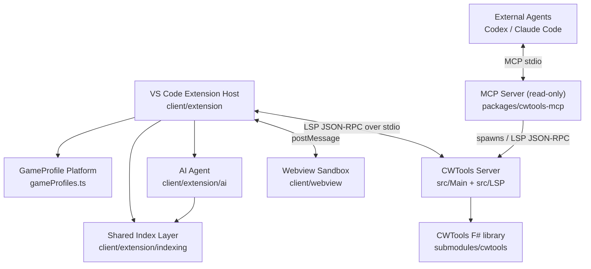
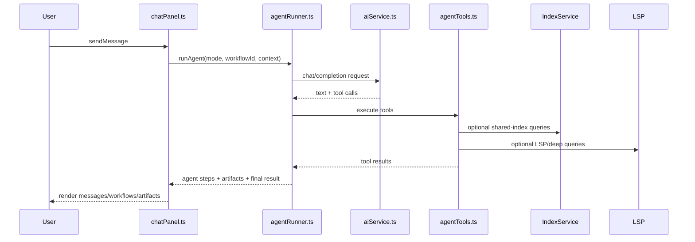

# Architecture Documentation

This document describes the current architecture, module boundaries, data flows, and maintenance constraints of **Stellaris Language Serves**. The project is a VS Code extension designed for Paradox game modding, primarily enhancing language services, visual previews, and AI-assisted development for Stellaris.

Version numbers are not maintained redundantly here. The sources of truth are `package.json` at the root and `release/package.json`, which are checked for consistency by the release gate.

## Overall Structure

The system is composed of four runtime layers and two shared platform capabilities:

1. VS Code Extension Host: `client/extension/`
2. AI Agent Subsystem: `client/extension/ai/`
3. Webview Sandbox UI: `client/webview/`
4. .NET/F# Language Server: `src/LSP/` and `src/Main/`
5. Shared Platform Capabilities: `client/extension/gameProfiles.ts` and `client/extension/indexing/`
6. Out-of-the-Box MCP Server: `packages/cwtools-shared/` and `packages/cwtools-mcp/` (a read-only semantic service bundled with the extension for external agents like Codex or Claude Code, see the "Out-of-the-Box MCP Server" section)



Webviews communicate with the Extension Host exclusively via `postMessage`. They cannot access `vscode`, Node.js, `fs`, `path`, or `require()` directly.

## Extension Host

`client/extension/` runs in the VS Code Extension Host process. It is responsible for command registration, LSP client lifecycle, filesystem access, Webview panel hosting, AI panel hosting, and assembling shared platform services.

| File | Purpose |
| --- | --- |
| `extension.ts` | Extension entry point, registers commands, starts the Language Server, and instantiates shared services |
| `gameProfiles.ts` | Multi-game profile registry, path conventions, feature toggles, and installation detection metadata |
| `indexing/indexService.ts` | Shared incremental index service |
| `indexing/locParser.ts` | Pure parser and query helper for localization YML files |
| `indexing/workspaceSymbolParser.ts` | PDXScript / asset / gui symbol parser, queries, and reference extractor |
| `codeActions.ts` | Code Actions for AI diagnostic repairs, explanations, and batch fixes |
| `diagnosticI18n.ts` | Client-side diagnostic translation: Chinese translation + fix advice, `source` normalization, and ignore-key matching |
| `fileExtensions.ts` | Case-insensitive extension matching helpers (`matchesExt`, `GRAPHICS_EXTS`) shared by UI and AI layers |
| `fsCaseInsensitive.ts` | Case-insensitive path resolution (used for unresolved resource references on Linux/macOS) |
| `pathScope.ts` | Neutral path containment helpers (`isPathInsideOrEqual` / `foldPathCase`) shared by UI and AI sandboxes |
| `guiPanel.ts` / `guiParser.ts` | `.gui` file parser and Canvas preview host |
| `solarSystemPanel.ts` / `solarSystemParser.ts` | 星系 (Solar system) previewer for `solar_system_initializers/` |
| `eventChainPanel.ts` / `eventChainParser.ts` | Event chain scanner, subgraph extraction, and code jumps |
| `techTreePanel.ts` / `techTreeParser.ts` | Tech tree scanner, filtering, and dependency graphs |
| `entityPanel.ts` / `entityAssetParser.ts` | `.asset` entity model preview host and resource parsing |
| `particlePanel.ts` / `particleAssetParser.ts` / `particleAssetSerializer.ts` | Stellaris `particle={}` preview/editor host, span parsing, and write-back |
| `graphicsFeatures.ts` | Graphics resource editor capabilities |
| `ddsDecoder.ts` | DDS/TGA decoding support |
| `locDecorations.ts` | Localization hover, definitions, and decorations backed by `IndexService` |
| `fileExplorer.ts` | Custom Mod file tree view |
| `vanillaCompare.ts` | Compare with vanilla files and migrate code blocks |
| `updateChecker.ts` | Update check logic |
| `pdxTokenizer.ts` | Shared PDX script tokenizer |
| `exprEval.ts` | Safe math expression evaluation for `@[...]` |

## Shared Platform & Indexing Layer

### GameProfile Platform

`gameProfiles.ts` consolidates multi-game differences into profiles instead of scattering them in extensions, indexing, and AI modules. A profile describes language IDs, file extensions, vanilla cache configuration keys, localization directories and encodings, script/GUI/GFX directory structures, preview features, AI knowledge mapping, and Steam installation detection metadata.

The extension entry point, indexing layer, and AI game knowledge should prioritize game profile helper functions.

### IndexService

`IndexService` is a shared knowledge layer used by both editor features and AI tools:

- Localization keys are indexed during activation for hover, definitions, and AI lookups.
- Heavier workspace/vanilla symbol indexes are lazy-loaded via `ensureWorkspaceSymbolsReady()` to avoid slow startup.
- The symbol layer supports `.txt`, `.gfx`, `.asset`, `.gui`, storing `origin`, `updatedAt`, `fileVersion`, and light references.
- File system watchers incrementally update `.yml` and symbol files; symbol indexes are garbage-collected when idle.
- The AI consumes these indexes via `query_localisation_index` and `query_workspace_index`.

The core constraint of this layer is: if the shared index can answer the query, do not force consumers to scan the workspace again.

## AI Agent Subsystem

AI code is located in `client/extension/ai/`, consisting of the chat host, model providers, prompt builders, tool registries, workflows, reasoning loops, and multi-agent coordination.

### Core Data Flow



### Core Files

| File | Purpose |
| --- | --- |
| `agentRunner.ts` | Reasoning loops, tool permissions, workflow execution, context compression, checkpointing, and model fallbacks |
| `agentTools.ts` | Tool dispatching, execution timeouts, shared blackboard, and orchestrator tool entry |
| `aiService.ts` | Multi-provider HTTP/SSE clients, request formatting, fallback policies, and custom wire formats (`customApiFormat`) |
| `promptBuilder.ts` / `prompt/sections/` | Prompt builder facade, project context, and mode system instructions |
| `providers.ts` / `providers/models/` | Provider registry, default models, capabilities, pricing, and prompt caching discounts |
| `types.ts` | Messages, tools, modes, contexts, Artifacts, and setting schemas |
| `runnerPolicy.ts` | Mode-based tool exclusions, iteration limits, and sub-agent output token budgets |
| `planModeGuard.ts` | Plan-mode write guards: limits writes to implementation plans and plan/blueprint/walkthrough output files; provides read-only `git_ops` checks (`validateGitOpsForMode`) |
| `projectProfile.ts` | `/init` workspace scanning, project profile generation, and encoding/language detection |
| `chatInit.ts` | Command handler for `/init`, triggers profile generation and renders `CWTOOLS.md` |
| `gameKnowledge.ts` | Paradox script rule-bases for 9 games mapped by language ID |
| `skills.ts` | Skill index loader (`SKILL.md` for built-in, user, or project scopes) and `run_skill` execution |
| `memoryParser.ts` | Topic-scoped `.cwtools-ai/<topicId>/.cwtools-ai-memory.md` long-term memory read/write and pruning |
| `workspacePaths.ts` | Resolves AI data directories (`.cwtools-ai/`), topic and scratch directories |
| `workspaceSandbox.ts` | Input path cleaning, scope classification (project, workspace, outside, etc.), and trust checks |
| `usageTracker.ts` | Persists cumulative token usages, costs, and prompt cache stats across sessions |
| `diffEngine.ts` | Structural diff engine |
| `fileCache.ts` | Bounded file content cache |
| `errorReporter.ts` | Structured error logging (fatal, warn, debug) |
| `contextBudget.ts` | Token budgets and tool output truncation rules |
| `contextReferences.ts` | `@file`, `@folder`, `@symbol`, and `@blackboard` context reference resolvers |
| `chat/bridge.ts` | Webview-to-extension IPC message handler |
| `agentSessionCoordinator.ts` | Tracks state, modes, workflows, and live steps between Chat and Agent Manager UIs |
| `agentUiBroadcaster.ts` | Broadcasts state changes to multiple Webviews |
| `artifactStore.ts` | Session-level storage, sorting, and lifecycle management for Artifacts |
| `chatPanel.ts` / `chatHtml.ts` | Chat host panel and HTML injection template |
| `chatSettings.ts` / `chatTopics.ts` | UI preferences and session topic persistence |
| `workflowRegistry.ts` / `workflowI18n.ts` | Workflow metadata, allowed tools, validation targets, and localization |
| `inlineProvider.ts` | AI inline (FIM) code completions |
| `mcpClient.ts` | Model Context Protocol client over stdio/SSE |
| `toolCallParser.ts` / `jsonRepair.ts` | Loose JSON repairs and fallback tool-call extraction for non-standard models |

### Runner Pipeline (`runner/`)

| File | Purpose |
| --- | --- |
| `compaction.ts` | Chat history compaction and context management helpers |
| `checkpoint.ts` | V2 resume states and synthetic tool call repairs for interrupted generations |
| `writeCoordinator.ts` | Koordinations entry for `PartitionedWriteQueue` and read-after-write blockades |
| `fallbackPolicy.ts` | Model fallbacks and retries on rate limits or failures |
| `cancellation.ts` | LLM generation abort tracking and exceptions |
| `stepEmitter.ts` | Broadcasts streaming tokens and agent status updates |
| `toolScheduler.ts` | Concurrency scheduling and target-file lock acquisitions |
| `toolInvocation.ts` | Normalizes raw LLM actions to validated `ToolInvocation` envelopes with risk metadata |
| `commandPreflight.ts` | Command string tokenization and risk level auditing for terminal actions |
| `permissionPolicy.ts` | Resolves low-risk automatic grants and scopes via `cwdScope` |
| `policyEngine.ts` | Hierarchical permission resolution and sandbox shadow audits |
| `autoReviewer.ts` | Read-only automated LLM reviewer: caches decisions, falls back safely to user prompts |
| `shellEnv.ts` | White-lists environment variables for child processes |
| `runLedger.ts` | Appends agent steps to JSONL and serves as raw data for timelines |
| `runReducers.ts` | Pure event projection reducers: reconstructs run topologies, stats, and timelines |
| `runReplay.ts` | Tool mock replayer (Mode A: uses historic inputs to answer LLM calls) |
| `readTracker.ts` | Hash-based integrity tracking (mtime + SHA-256) to ensure reads precede writes |
| `contextMemory.ts` | Summarizes compacted contexts |
| `doomLoopDetector.ts` | Detects semantic looping inside reasoning chains |

### Tool Subsystem (`tools/`)

| File | Purpose |
| --- | --- |
| `definitions.ts` | JSON schemas for all available AI tools |
| `registry.ts` | Fact sheet mapping tools to mode gates, read/write flags, risks, and locks |
| `permissions.ts` | Access checks and sandboxes |
| `argRepair.ts` | Parameter repairs prior to execution |
| `externalTools.ts` | Shell execution and process management handlers |
| `fileTools.ts` | File reads, writes, and local edits |
| `lspTools.ts` | Deep semantic lookups and language server actions |
| `diagnosticMetadata.ts` | Categorization and hints for `analyze_diagnostic_error` |
| `memoryTools.ts` | Workspace and session memory actions |
| `replacerSuite.ts` | Fuzzy string search & replace engine utilizing 10 progressive algorithms |
| `schemaFlatten.ts` | Schema flattener and restorer (`nestArguments()`) for weak tools implementations |

### Agent Modes and Workflows

`AgentMode` options are defined in `client/extension/ai/types.ts`:
```text
build | plan | explore | general | utility | review | script |
gui_expert | script_reviewer | loc_translator | loc_writer | orchestrator
```

`general` is retained for backwards compatibility; `utility` handles generic workspace tasks; `script` is the high-throughput Paradox script mode orchestrating up to 8 sub-agents concurrently.

`workflowRegistry.ts` contains:

| Workflow | Mode | Purpose |
| --- | --- | --- |
| `diagnostic-fix` | `build` | Repair CWTools diagnostics |
| `loc-generation` | `build` | Generate missing localization entries |
| `event-chain-design` | `plan` | Architect event topologies |
| `rules-sync-review` | `review` | Verify rules after synchronizations |
| `asset-wiring` | `build` | Repair broken sprite and sound file links |

The Runner restricts tools based on the active workflow and appends supplementary prompts.

### Tool Constraints

- `tools/registry.ts` is the single source of truth for tool properties (`effect`, `riskLevel`, `concurrencyClass`).
- Writes to `.yml` localization files must call `write_localisation`, not generic text replacers.
- `edit_file` leverages a 10-step fuzzy match pipeline.
- `apply_patch`, `multi_replace_file_content`, and `ast_mutate` are retired. Internal execution routes them to `edit_file` or `replace_lines`.
- Reads of a file queue behind pending writes via `writeCoordinator.afterCurrentWrites`.
- Multi-agent systems use `dispatch_agents`, `query_blackboard`, and `merge_results`. Sub-agents are sandboxed in `orchestrator/subAgentSandbox.ts`.

### Orchestrator

The orchestrator structures DAG sub-tasks, schedules parallel processes, shares memory through blackboards, and reviews outputs.

| File | Purpose |
| --- | --- |
| `agentRegistry.ts` | Configures sub-agent modes, systems, and tokens budgets |
| `blackboard.ts` | Shared thread-safe dictionary supporting regex queries |
| `taskGraphEngine.ts` | DAG construction, cycle detection, and topological execution ordering |
| `parallelExecutor.ts` | Schedules independent tasks concurrently |
| `orchestrator.ts` | Entry point, context injectors, and review integration |
| `conflictDetector.ts` | Scans blackboards for overlapping write target intents |
| `qualityGate.ts` | Auto-review pipeline feeding verification feedback back to agents |
| `subAgentSandbox.ts` | Sets sandboxes to restrict paths and tools for sub-agents |
| `worktreeManager.ts` | Isolates tasks in separate git worktrees (optional) |

### Reducers, Checkpoints, and Replays

- `runReducers.ts` scans events list sequentially to build state snapshots without side-effects.
- `checkpoint.ts` builds V2 resume states, injecting artificial tool outputs for interrupted runs.
- `runReplay.ts` runs Mode A replays matching historic outputs based on canonical tool arguments.
- `readTracker.ts` blocks write attempts if files were modified externally since their last read.

## Out-of-the-Box MCP Server

The packages `packages/cwtools-shared` and `packages/cwtools-mcp` implement a **read-only** Model Context Protocol (MCP) server. It exports 21 semantic tools of CWTools to external hosts.

### Scope & Structure

- `cwtools-shared` (host-independent core): generated schemas, file security checks, rules loading, and readiness trackers. It does not import `vscode` or extension APIs.
- `cwtools-mcp` (adaptation layer): launches `CWTools Server`, connects via JSON-RPC, resolves configurations in user profiles, and exposes stdio transports.

### Rules & Caches

- MCP tools return `vanillaCache` presence warnings or `readiness.ready=false` annotations to notify client models if parses are still loading.
- Workspaces aggregate errors via `cwtools.ai.getAllDiagnostics` instead of single-file evaluations.
- MCP is bundled to `release/bin/mcp/cwtools-mcp.cjs`.

## Webview Layer

`client/webview/` contains the code compiled for the sandboxed frontend.

| Webview | Entry | Purpose |
| --- | --- | --- |
| Chat | `chatPanel.ts` | Conversation UI, workflow cards, configurations, and inline diffs |
| Manager | `agentManager.ts` | Run list logs, token dashboards, and task graphs |
| GUI | `guiPreview.ts` | Canvas render, drag modifiers, and GFX maps |
| Space | `solarSystemPreview.ts` | 3D solar orbits editing |
| Network | `eventChainPreview.ts` | Interactive Cytoscape graphs for event files |
| Tech | `techTreePreview.ts` | Cytoscape technology pre-requisites mapping |
| Entity | `entityPreview.ts` | Three.js renderer for mesh, textures, and skeleton animations |
| Particles | `particlePreview.ts` | Three.js particle simulators and curve plots |

## F# / .NET Language Server

The backend runs on .NET 10.

- **Completion locks**: Autocompletions call `TryEnterReadLock` with a 150ms timeout. Out-of-time runs fallback to stale caches.
- **Incremental refreshes**: Saves under scripted definitions bypass full database indexing, updating only altered files and type dictionaries instantly (gated by `experimental`).
- **Shader parsing**: Renders tokens and declarations. Uses brace counts for nesting rather than simple regex.

## Build System

`package.json` contains:
- `npm run compile`: Compiles TypeScript and bundles Webviews.
- `npm run lint`: Runs ESLint 9 checks.
- `npm run test:unit`: Runs TS unit tests.
- `npm run verify`: Triggers compiler, linter, tests, and release gates.

## Critical Design Constraints

### Webview Sandbox
Webviews are completely sandboxed. **Node.js (fs, path) and vscode APIs cannot be imported**.
- **I/O inside Host**: File operations and ReadTracker execution happen inside the Extension Host.
- **IPC Handlers**: Frontends delegate file queries and changes to the Host via `postMessage`.

### Write Concurrency
`PartitionedWriteQueue` serializes edits per file. Multi-file actions acquire locks in dictionary path order to prevent deadlocks.

### Command Sanitization
`run_command` commands are tokenized in `runner/commandPreflight.ts`. Path traversals are blocked using `path.relative`.

### Context Metrics
`agentRunner.ts` extracts cache hits (`usage.cached_tokens`, etc.) and pricing calculations. The frontend displays these inside a 3-bar sparkline.

## Directory Overview

```text
cwtools-vscode/
  client/
    extension/
      ai/
        orchestrator/         Multi-agent coordination
        runner/               Compaction, checkpointing, read tracking
        chat/                 IPC bridge
        tools/                Definitions, replacer engines
        prompt/
          sections/           System prompt strings
        providers/
          models/             Models metadata & pricing
        agentRunner.ts        Reasoning execution
        agentTools.ts         Tools routers
        aiService.ts          LLM requester
        projectProfile.ts     Project indexing
      indexing/               Localization parser & indexes
      gameProfiles.ts         Game profiles specifications
      diagnosticI18n.ts       Chinese translations for errors
    webview/
      chat/                 Chat sub-modules
      messageRenderer.ts      Prompt cache metrics rendering
      entityPreview.ts        Three.js meshes
```
