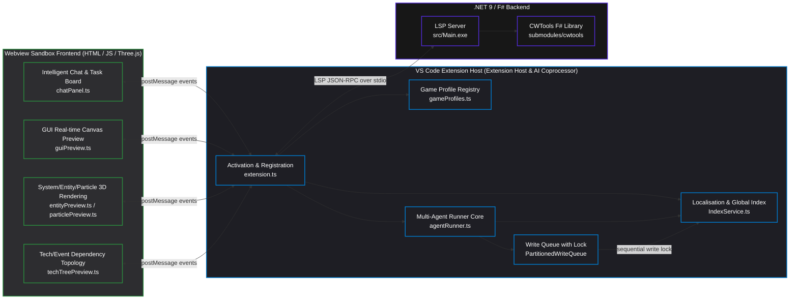

# 🌌 Stellaris Language Serves

[](https://dotnet.microsoft.com/)
[]()

**Stellaris Language Serves** is a premier, modern IDE-grade VS Code extension custom-built for Paradox game modding, centered around **Stellaris**. Based on the upstream [CWTools](https://github.com/cwtools/cwtools-vscode), it undergoes deep refactoring and customization, combining a **high-performance .NET 9 backend**, an **expressive Webview sandbox visualization engine**, and a **cutting-edge autonomous multi-agent AI coprocessor**.

> [!NOTE]
> This project is not merely a syntax highlighter and validator; it is a **modern collaborative mod development hub** integrating 3D rendering, a real-time GUI canvas, a multi-agent parallel pipeline, and high-precision migration comparison.

---

## 🚀 Four Pillars of Core Technology

### ⚡ 1. High-Performance LSP (Language Server Protocol)
The CWTools LSP server, customized using **.NET 9** and **F#**, serves as the computation base of the entire extension, providing millisecond-level responsiveness for massive mod codebases.
- **Extreme Concurrent Performance**: Refactored the `LanguageServer` read-write lock mechanism. Read-only requests (hover preview, autocompletion, go-to-definition) execute concurrently across multiple threads; write modifications acquire exclusive locks sequentially, eliminating deadlocks or interface lagging.
- **O(1) Definition Search**: The `DocumentStore` abandons traditional $O(N)$ traversals, adopting **lazy line offset cache reconstruction** to compress Hover and Go-To-Definition search times to $O(1)$, realizing instantaneous positioning even for large mod files with hundreds of thousands of lines of code.
- **Semantic Validation & Macro Evaluation**: Supports deep syntax analysis, including real-time evaluation of complex macro expressions `@[...]` and `value:xxx|`, displaying localized texts in-line (CodeLens) and allowing hover previews of `inline_script` files.
- **Incremental Type Index Refresh**: When editing custom script definitions in `scripted_triggers` / `scripted_effects` / `script_values`, you no longer experience the 15-25s lag of reload project. The backend precisely replaces the affected type entries by file name and reconstructs index ONLY for modified types (zero-overhead reuse of other types). Diagnostics and completion refresh instantly on save (when `experimental` toggle is enabled).

### 🎨 2. Sandbox Multi-Dimensional Webview Visualization Engine
This project makes deep use of the VS Code Webview isolation sandbox, utilizing modern web rendering technologies (Canvas / Cytoscape.js / Three.js) to deliver an unprecedented WYSIWYG experience to mod developers.
- **GUI Canvas Real-time Preview & Editing**: Supports real-time bidirectional interactive rendering of Stellaris `.gui` interface configuration files. It perfectly renders `corneredTileSpriteType` 9-slice stretching and multi-frame sprite (`noOfFrames`) animations. It supports visual layer trees and directly **drags controls to resize/reposition them, automatically writing back coordinate changes to the source code**.
- **3D Solar System Rendering & Orbit Editing**: Enter any solar system initializer `.txt` script in `solar_system_initializers/` to launch a gorgeous 3D system space. It supports recursive nesting of stars, planets, moons, and ring worlds. Developers can directly drag planets to modify their `orbit_distance` and `orbit_angle`, syncing changes back to the script.
- **Technology Tree & Event Reference Network**: Uses Cytoscape.js to render highly interactive tech dependency and multi-level event flow graphs. It supports quick searching, relationship filtering, and double-clicking nodes to instantly navigate to the declaring script file and line number.
- **Three.js Entity & Animation Rendering**: Supports loading and debugging Paradox native `.asset` 3D meshes, textures, and skeletal animations within the Webview sandbox.
- **Particle Effect Preview & Editor**: Provides a three-pane editor for `particle={...}` definitions in `gfx/particles/**/*.asset` files, featuring Three.js real-time simulation, curve editing, subsystem/force/property modification, texture decoding, and write-back to `.asset`.

### 🤖 3. Fully Autonomous Multi-Agent AI Coprocessor
This is the most innovative subsystem of the plugin. Unlike generic single-round chat AIs, it embeds an advanced reasoning runner orchestrated by multi-agent collaboration.
- **Dual Build / Review Modes**:
  - **Build Mode**: Allows the AI to automatically generate code, write files, manipulate shared localization indexes, and run local validation packages.
  - **Review Mode**: A secure read-only review environment that disables write permissions, designed to enforce code style rules, prevent logical flaws, and block out-of-scope write-overs.
- **Sub-Agent Parallel DAG Orchestration**: The underlying reasoning flow is based on a topologically sorted task graph, scheduling specialized sub-agents (e.g., Explorer, Builder, LocWriter, Reviewer) in parallel via `Promise.allSettled` to write complex features on a **shared Blackboard**—speeding up execution several fold.
- **Anti-Looping & Smart Context Windowing**: Built-in two-phase "Doom-Loop" prevention; when the dialogue tokens approach 70% of the maximum limit, it automatically triggers LLM-level structured memory compression and repairs orphan tool calls, ensuring high success rates for long-duration tasks.
- **Bi-directional MCP Integration**: Serves as an **MCP Client** to consume external stdio/SSE tools; simultaneously, it **exports a read-only MCP Server** (`packages/cwtools-mcp`) bundled with the plugin, opening up its 21 semantic tools (types, rules, scopes, diagnostics, etc.) for external agents like **Codex / Claude Code**—see Section 7 for details.
- **Workspace-wide Localization Indexing**: An asynchronous incremental indexing system based on VS Code `FileSystemWatcher` feeds stable, accurate localization context to the large model.

### 📂 4. Differences & Fast Migration Pipeline (Vanilla Compare)
A powerful tool for updating mods to new Paradox game patches.
- **Block-Level Diff**: Open side-by-side diff screens against corresponding vanilla files with one click.
- **Safe Bottom-Up Merge**: Supports migrating the block under the cursor (`migrateBlockFromVanilla`). The underlying algorithm applies replacements **bottom-up (from back to front)**, preventing line offsets from invalidating subsequent changes.

---

## 🏛️ System Architecture

Below is the overall module interaction and data flow topology:



---

## ⚙️ Quick Start

### Prerequisites
- **OS**: Windows / macOS / Linux
- **VS Code**: 1.90.0 or higher
- **.NET Runtime**: [.NET 9.0 SDK](https://dotnet.microsoft.com/download/dotnet/9.0) is required for local building/development.

### Installation Steps
1. Download the latest `.vsix` package from the Releases page.
2. In VS Code, open the Command Palette (`Ctrl+Shift+P` / `Cmd+Shift+P`), select `Extensions: Install from VSIX...`, and choose the downloaded VSIX file to complete the installation.
3. Upon first activation, a notification will prompt you to select the **vanilla game installation folder** to build the initial language server cache.

---

## 💡 Feature Guide

### 🎨 1. GUI Canvas Preview & Drag-and-Sync Editing
* **How to open**: Open any `.gui` file in VS Code and click the **Palette Icon (Preview GUI)** in the top right editor toolbar.
* **Operations**:
  - The dual-column attribute panel will slide in on the right, automatically parsing DDS/TGA textures.
  - You can click to select components in the canvas and **drag to resize or move them**. The AST rewriting algorithm will rewrite the code layout in the left `.gui` editor in real-time.
  - Press `Ctrl+Z` to undo canvas modifications.

### 🌌 2. 3D Solar System Interactive Editor
* **How to open**: Open any system initializer `.txt` script under `solar_system_initializers/` and click the **Telescope Icon (Preview Solar System)** in the top right.
* **Operations**:
  - Zoom with mouse wheel, pan with right-click, and rotate view with `Alt+Drag`.
  - In **Edit Mode**, right-click the canvas to create stars, planets, moons, or ring worlds.
  - **Drag a planet directly along its orbit** to modify its distance and angle; variables like `orbit_distance` and `orbit_angle` will sync back to the editor.

### 🌐 3. Tech Tree & Event Dependency Graph
* **How to open**: Inside tech or event definition scripts, click the **Graph Icon (Show Dependency Graph)**.
* **Operations**:
  - Leverages Cytoscape.js to display pre-requisites and downstream effects.
  - Supports searching, filter constraints, and node highlighting. **Double-click any node** to navigate and jump to its declaration line in the source file.

### 🤖 4. Fully Autonomous Multi-Agent AI Panel
* **How to open**: Click the **AI Icon** in the Activity Bar or execute `AI: Open Chat Panel` in the Command Palette.
* **Hotkeys**:
  - `Tab`: Cycle through agent modes (Build, Plan, Analyze, Review, Orchestrate, General).
* **Operations**: Supports context memory compression (triggered at 70% threshold) and importing/exporting full JSON execution archives.

### 📂 5. Vanilla Compare & Safe Merge
* **Diff View**: When editing a mod file that shares the same name as a vanilla file, click the **Compare with Vanilla** CodeLens.
* **Sync**: Click **Migrate Block from Vanilla** above a changed block. The system locks the write queue and applies changes bottom-up, keeping line coordinates accurate.

### 💎 6. Asset & 3D Mesh Animation Debugger
* **How to open**: In `.asset` or `.gfx` files, click the **3D Model Icon (Preview Entity)**.
* **3D & Material Debug**:
  - Parses and renders `.mesh` files.
  - Automatically loads and decodes DDS materials to render high-fidelity graphics.
* **Animation Playback**:
  - Renders skeleton node trees, allowing you to select and play animations (e.g., move, idle, attack) in the right-hand panel.
  - Fine-tune materials (e.g., diffuse, specular) using slider panels.

### 🔌 7. Out-of-the-Box MCP Server (for Codex / Claude Code)
This extension bundles a **read-only** Model Context Protocol (MCP) server, offering 21 read-only semantic tools of CWTools (syntax check, scope queries, definitions, references, diagnostics, scripted triggers/effects/enums) to external agents.
* **Zero Config**: The server automatically detects installed server binaries, configurations, and game caches in globalStorage.
* **Stable Version-Independent Path**: Activated plugins copy the script to `globalStorage/foreverskywalker.foreverskywalker-stellaris-cwtools/mcp/cwtools-mcp.cjs` to survive version upgrades.
* **Install in Codex**:
  ```sh
  codex mcp add cwtools -- node "%APPDATA%/Code/User/globalStorage/foreverskywalker.foreverskywalker-stellaris-cwtools/mcp/cwtools-mcp.cjs" --game stellaris --stdio
  ```
  Change paths accordingly on macOS/Linux. For configuration details, see [packages/cwtools-mcp/README.md](packages/cwtools-mcp/README.md).

---

## 🛠️ Developer Hub

If you intend to contribute code or perform development using AI assistants, please follow these guidelines:

### Common Commands
Run the following at the workspace root:
```bash
# 1. Compile TypeScript extension & build webviews via Rollup
npm run compile

# 2. Run ESLint code checks (ESLint 9 strict mode)
npm run lint

# 3. Run unit tests
npm run test:unit

# 4. Run VS Code integration tests
npm run test

# 5. Build .NET/F# language server backend
dotnet build src/LSP/
dotnet build src/Main/

# 6. Quality gate verify (Lint + Compile + Test + Release Gate)
npm run verify

# 7. Build and verify the MCP service (packages/)
npm run build:mcp
npm run generate:mcp-schema
npm run test:contracts
```

### 📦 Extension Packaging
To package the extension into a cross-platform VSIX file, run this inside the `release/` directory:
```bash
npx @vscode/vsce package
```
> [!IMPORTANT]
> For packaging details, see [.agents/workflows/package.md](file:///c:/Users/A/Documents/cwtools-vscode/.agents/workflows/package.md) or use `package.ps1`.

---

## 🤝 License
This project is distributed under the [MIT License](LICENSE). Special thanks to the [CWTools](https://github.com/cwtools) open-source project and all contributors in the Paradox modding ecosystem!
