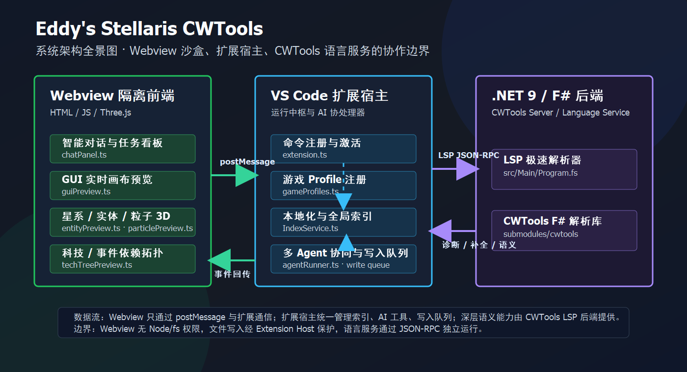

# 🌌 Stellaris Language Serves

[](https://dotnet.microsoft.com/)
[]()

**Stellaris Language Serves** 是专为 Paradox 游戏 Modding（以 **Stellaris (群星)** 为核心）打造的顶级、现代化集成开发环境（IDE）级 VS Code 扩展。它基于上游的 [CWTools](https://github.com/cwtools/cwtools-vscode) 进行了深度的重构与定制开发，融合了**超高性能的 .NET 10 后端**、**极富表现力的 Webview 沙盒可视化引擎**，以及**前沿的自主多 Agent AI 协处理器**。

> [!NOTE]
> 本项目不仅是一个语法高亮与校验工具，而是一个集成了 3D 渲染、实时 GUI 画布、多 Agent 并行流水线及高精密迁移对比的**现代化 Mod 协同开发中枢**。

---

## 🚀 核心技术四大支柱

### ⚡ 1. 超高性能语言服务引擎 (High-Performance LSP)
基于 **.NET 10** 和 **F#** 深度定制的 CWTools LSP 服务端，作为整个插件的计算底座，为庞大的 Mod 代码提供了毫秒级的极致响应。
- **极致的并发性能**：重构了 `LanguageServer` 读写锁机制，只读请求（如悬浮预览、自动补全、跳转定义）多线程共享并发执行；变更写入操作（如文件修改）持独占锁串行执行，彻底告别慢查询导致的死锁或界面卡顿。
- **O(1) 定位查找**：`DocumentStore` 摒弃了传统的 $O(N)$ 遍历，采用**惰性重建行偏移缓存**技术，将 Hover 和 Go-To-Definition 的查找时间直接压缩至 $O(1)$，对拥有数十万行代码的超大型 Mod 文件实现即时定位。
- **语义校验与宏求值**：支持深度语法分析，甚至能对复杂的宏表达式 `@[...]` 以及 `value:xxx|` 进行实时求值，在编辑器行内无缝显示本地化文本（CodeLens）及 `inline_script` 文件悬浮预览。
- **增量类型索引刷新**：编辑保存 `scripted_triggers` / `scripted_effects` / `script_values` 等自定义脚本定义时，告别旧版「必须重新加载项目」的 15–25 秒卡顿——后端按文件名精确替换受影响的类型条目、仅重建变更类型的索引（其余类型零开销复用），保存后诊断与补全即时刷新（`experimental` 开关启用）。

### 🎨 2. 沙盒化多维 Webview 可视化引擎 (Rich Visualization)
本项目深度利用了 VS Code Webview 隔离沙盒，基于现代 Web 渲染技术（Canvas / Cytoscape.js / Three.js），为 Mod 开发者带来了前所未有的所见即所得体验。
- **GUI Canvas 实时预览与编辑**：支持群星 `.gui` 文件的实时双向交互渲染。完美实现 `corneredTileSpriteType` 9-切片拉伸绘制、多帧精灵（`noOfFrames`）动画循环，支持可视化图层树和直接在画布上**拖拽调整控件尺寸及坐标并回写源码**。
- **3D 恒星系渲染与轨道编辑**：进入 `solar_system_initializers/` 脚本，即可开启精美的 3D 星系空间。支持恒星、行星、卫星、环形世界（Ring World）的任意递归嵌套。开发者可以通过直接拖动行星改变其 `orbit_distance` 与 `orbit_angle` 并自动同步至脚本。
- **科技树与事件引用网络**：利用 Cytoscape.js 渲染高交互性的科技依赖图与事件链流向图。支持快速检索、关系筛选及点击节点瞬间定位至对应的 `.txt` 脚本源码行。
- **Three.js 实体与动画渲染**：支持 Paradox 原生 `.asset` 三维网格、贴图及骨骼动画在 Webview 中的沙盒化加载与动作调试。
- **粒子特效预览与编辑**：支持 Stellaris `gfx/particles/**/*.asset` 中 `particle={...}` 的三栏粒子编辑器，提供 Three.js 实时近似模拟、曲线编辑、子系统/力/属性编辑、贴图解码预览与 `.asset` 写回。

### 🤖 3. 全自主多 Agent AI 协处理器 (Advanced AI System)
这是本插件最引以为傲的革新性子系统。不同于普通的单轮对话 AI，我们内置了一个由多 Agent 编排的高阶推理运行器。
- **Build / Review 双工作模式**：
  - **Build 模式**：允许 AI 自动生成代码、读写文件、操作共享本地化索引并运行本地验证套件。
  - **Review 模式**：独立安全的只读审查环境，禁用任何写入特权，专为强制校验代码规范、防御逻辑漏洞和越界覆盖而设计。
- **Sub-Agent 并行编排 (DAG)**：底层推理流基于拓扑排序任务图，通过 `Promise.allSettled` 并行调度多个专职子 Agent（如 Explorer, Builder, LocWriter, Reviewer），在**共享黑板 (Blackboard)** 上协同编写复杂的功能，速度相比单链 Agent 提升数倍。
- **防循环与智能压缩 (Context Smart Windowing)**：内置两阶段 "Doom-Loop" 循环调用防御机制；当长对话 Token 消耗接近上限的 70% 时，将自动触发 LLM 级别的结构化记忆压缩，并对孤儿 Tool Call 智能补齐，确保长任务的高成功率。
- **MCP 双向集成（消费 + 输出）**：作为 **MCP 客户端**集成 Model Context Protocol（stdio 与 SSE），让内置 Agent 调用外部 MCP 工具；同时**对外输出一个随插件分发的只读 MCP 服务**（`packages/cwtools-mcp`），把本项目的 PDX 语义能力（类型/规则/作用域/诊断/定义引用/补全/深层语义共 21 个只读工具）开放给 **Codex / Claude Code** 等外部 Agent 复用——详见下方功能指引第 7 节。
- **全工作区本地化索引**：全工作区本地化 YML 文本基于后台 `FileSystemWatcher` 异步实时增量索引，为大模型源源不断地输送稳定、精准的项目上下文。

### 📂 4. 原版对比与极速迁移通道 (Vanilla Compare & Sync)
处理巨型 Mod 升级与适配 Paradox 官方版本更新的利器。
- **块级无缝对比**：支持在脚本中一键开启与原版（Vanilla）对应文件的 Diff 视图。
- **自底向上安全合并**：支持光标所在块的“一键迁移同步”（`migrateBlockFromVanilla`），底层迁移算法采用**从后往前（自底向上）**的替换策略，保证前端行号修改不会导致上方偏移失效，极速适配版本变动。

---

## 🏛️ 系统架构全景图

以下为项目的整体模块交互与数据流拓扑，清晰展现了各层级之间的隔离屏障与通信管道：



---

## ⚙️ 极速安装与开始

### 运行要求
- **操作系统**：Windows / macOS / Linux
- **VS Code 版本**：1.90.0 或更高版本
- **.NET 运行时**：本地开发编译需要安装 [.NET 10.0 SDK](https://dotnet.microsoft.com/download/dotnet/10.0)

### 安装步骤
1. 在 Release 页面下载最新的 `.vsix` 打包文件。
2. 打开 VS Code，按下 `Ctrl+Shift+P` (macOS 下为 `Cmd+Shift+P`)，输入并选择 `Extensions: Install from VSIX...`，选择下载的 VSIX 文件完成安装。
3. 首次激活插件时，系统会弹出通知提示您选择**原版游戏安装目录**以构建初次语言服务器缓存，完成配置后即可开启极速开发之旅。

---

## 💡 主要功能使用指引 (Feature Guide)

为了让您能够快速上手这套极具表现力的 IDE 开发工具链，我们为您整理了如下核心功能的使用指引：

### 🎨 1. GUI 实时画布预览与拖拽同步编辑
* **如何打开**：在 VS Code 中打开任意 `.gui` 界面配置文件，点击右上角编辑器工具栏的 **画板图标 (Preview GUI)**。
* **同步操作**：
  - 双列网格属性面板将呈现在右侧，支持 DDS/TGA 贴图自动检索与解码显示。
  - 您可以直接在画布中点击选中控件并进行**拖拽缩放或平移位置**，底层的 AST 重构算法会即时重组代码并自动写回左侧的 `.gui` 源代码文件中。
  - 支持 `Ctrl+Z` 随时撤销画布和属性更改，提供所见即所得的极速开发体验。

### 🌌 2. 3D 恒星系交互编辑器 (3D Solar System)
* **如何打开**：在 `solar_system_initializers/` 目录下的星系初始化 `.txt` 脚本中，点击编辑器标题栏的 **望远镜图标 (Preview Solar System)**。
* **三维交互**：
  - 视图支持鼠标滚轮缩放、右键平移和 `Alt+拖拽` 进行多维度视角旋转。
  - 在**编辑模式**下，您可以通过右键菜单直接创建恒星、行星、卫星以及 Ring World。
  - 用鼠标**直接在 3D 轨道上拖拽行星**修改其轨道距离和角度，对应的 `orbit_distance` 与 `orbit_angle` 参数会同步写回至编辑器内的 Paradox 脚本。

### 🌐 3. 科技树与事件引用网络 (Dependency Graph)
* **如何打开**：在科技或事件定义脚本中，点击右上角的 **依赖图图标 (Show Dependency Graph)**。
* **交互导航**：
  - 底层基于 Cytoscape.js 渲染高表现力的连线节点拓扑，直观呈现复杂科技前置要求或事件的多级触发链。
  - 完美支持搜索框快速过滤、层级限制与节点高亮。**双击任意节点**，编辑器将自动跳转并精准高亮至其声明所在的源文件代码行。

### 🤖 4. 全自主多 Agent AI 开发面板 (Autonomous AI)
* **如何打开**：点击侧边栏的 **AI 图标**，或按快捷键 `Ctrl+Shift+P` 搜索并执行 `AI: Open Chat Panel` 开启会话。
* **全局快捷键**：
  - `Tab`：快捷切换Agent模式，支持构建、计划、分析、审查、协调，通用，六大基础模式一键切换。
* **特性操作**：会话支持完整的上下文压缩（超过 70% 时自动生成紧凑记忆）以及一键无损导入导出完整
运行步骤的 JSON 归档。

### 📂 5. 原版对比与块级安全合并 (Vanilla Sync)
* **一键对比**：插件激活后，当您编辑的 Mod 文件与原版游戏文件同名时，点击行上方的 CodeLens **Compare with Vanilla** 打开分屏 Diff。
* **安全替换**：如果需要提取原版官方代码段，点击代码块上方出现的 **Migrate Block from Vanilla**。系统将锁定并发队列，自底向上智能应用合并，防止因前端坐标更改导致后续块偏移失效。

### 💎 6. Asset 资产与 3D Mesh 实体动画调试器 (Asset & Mesh Previewer)
* **如何打开**：在 VS Code 中打开 `.asset` 实体配置文件或 `.gfx` 图形定义文件，点击右上角编辑器工具栏的 **3D 模型图标 (Preview Entity)**。
* **3D 网格与材质调试**：
  - 底层基于 Three.js 实现 Paradox 专有 3D 网格模型文件（`.mesh`）的极速沙盒化解析与三维渲染。
  - 自动根据配置搜寻、加载并解码 DDS 格式的材质贴图，提供高保真的光照着色预览。
* **骨骼动画微调**：
  - 完美解析绑定的骨骼节点树，支持在右侧控制台中实时挑选、播放不同的骨骼动画序列（如移动、待机、战斗）。
  - 支持材质属性（如漫反射、高光强度）在侧边栏面板上的动态滑块调节与实时重绘调试。

### 🔌 7. 通用 MCP 服务（供 Codex / Claude Code 调用）
本插件随包分发一个**只读**的 MCP 服务，把 CWTools 的 PDX 语义能力（验证 ID、查语法、查作用域、全项目诊断、定义/引用、补全、scripted effects/triggers/enums/modifiers/variables、实体信息，共 21 个只读工具）开放给任意 MCP 客户端。文件写入仍由你的 Agent 自带环境完成。

* **默认复用插件内服务**：MCP 入口脚本会通过 `globalStorage/mcp/bridge-manifest.json` 连接当前已激活的 VS Code 兼容宿主（VS Code / Cursor / VSCodium / Antigravity 等），复用 IDE 中已有的 CWTools LSP 与 Problems 诊断，不再额外启动第二个重型服务。客户端工作区会从 MCP roots、会话环境变量或 cwd 动态发现，且必须与 bridge 暴露的工作区一致；不一致时返回 `bridge_unavailable`，不会从另一个项目静默回答。
* **版本无关稳定路径**：插件激活时把 MCP 代理脚本同步到 `globalStorage/foreverskywalker.foreverskywalker-stellaris-cwtools/mcp/cwtools-mcp.cjs`（不含版本号），配置指向它即可**自动跟随插件更新**。旧的独立 LSP 模式仍可用 `--standalone` 显式启用。
* **Codex**：

```sh
codex mcp add cwtools -- node "<host-globalStorage>/foreverskywalker.foreverskywalker-stellaris-cwtools/mcp/cwtools-mcp.cjs" --stdio
```

* **Claude Code**：

```sh
claude mcp add cwtools --scope user -- node "<host-globalStorage>/foreverskywalker.foreverskywalker-stellaris-cwtools/mcp/cwtools-mcp.cjs" --stdio
```

* **Antigravity**：在 `~/.gemini/config/mcp_config.json` 中添加 `cwtools`，内容为 `"command": "node"` 和 `"args": ["<host-globalStorage>/foreverskywalker.foreverskywalker-stellaris-cwtools/mcp/cwtools-mcp.cjs", "--stdio"]`。

  请使用实际运行插件的兼容宿主自己的 `globalStorage` 路径。等价的 `~/.codex/config.toml` 手写配置、`--standalone`/`--rules`/`--cache`/`--game-path` 高级选项与 Claude Code 接入方式，详见 [packages/cwtools-mcp/README.md](packages/cwtools-mcp/README.md)。

---

## 🛠️ 开发者指南 (Developer Hub)

如果您有志于为本项目贡献代码，或者需要使用 AI 助手进行二次开发，请务必遵循以下工作流：

### 常用构建与验证命令
在项目根目录下，您可以使用以下命令验证项目的完整性：

```bash
# 1. 编译全部 TypeScript 代码并使用 Rollup 捆绑前端 Webview UI
npm run compile

# 2. 运行 ESLint 代码质量检查 (ESLint 9 严格模式)
npm run lint

# 3. 运行 TypeScript 单元测试
npm run test:unit

# 4. 运行 VS Code 集成测试套件
npm run test

# 5. 编译 C# / F# 语言服务端后端代码
dotnet build src/LSP/
dotnet build src/Main/

# 6. 一键全面质量检查 (Lint + Compile + Unit Test + Release Gate)
npm run verify

# 7. 构建并校验随插件分发的 MCP 服务（packages/）
npm run build:mcp            # 构建 MCP 子包
npm run generate:mcp-schema  # 从上游工具定义重生成 MCP schema
npm run test:contracts       # MCP 合约测试（schema 漂移 / 只读 / 路由）
```

### 📦 插件打包
如需将插件打包为跨平台的通用发布版本，请在 `release/` 目录中运行：
```bash
npx @vscode/vsce package
```
> [!IMPORTANT]
> 打包具体步骤请参阅 [.agents/workflows/package.md](file:///c:/Users/A/Documents/cwtools-vscode/.agents/workflows/package.md)，也可以使用 `package.ps1` 进行打包。

---

## 🤝 开源协议
本项目采用 [MIT 许可证](LICENSE) 分发。特别感谢 [CWTools](https://github.com/cwtools) 开源项目以及所有为 Paradox Modding 生态做出贡献的开发者们！
