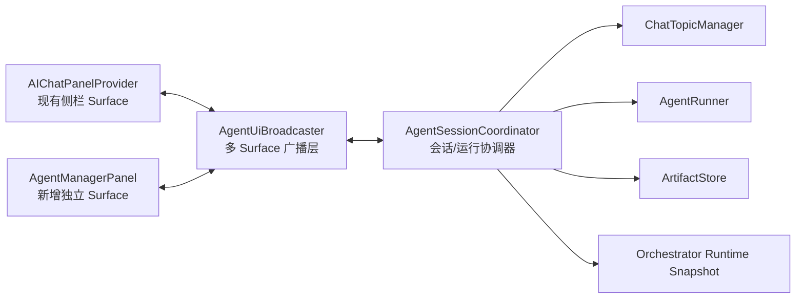

# 独立 Agent Manager 界面实现方案

## 1. 背景

当前项目已经具备较完整的 AI Agent 能力：

- 侧栏聊天宿主由 `client/extension/ai/chatPanel.ts` 提供。
- 会话持久化、搜索、归档、分叉和导出由 `client/extension/ai/chatTopics.ts` 提供。
- 宽屏右侧工作区、Artifacts、任务/蓝图承载能力已经存在于 `client/webview/chatPanel.ts` 与 `client/webview/chatPanel.css`。
- 多 Agent 协作、子 Agent 角色和执行图已经存在于 `client/extension/ai/orchestrator/`。

因此，本需求不是重新建设一套 AI 系统，而是把现有能力从“侧栏聊天页”提升为一个独立的、可长期停留的 Agent Manager 视图。

本方案默认实现的是 **VS Code 内部的独立 Manager 页面**：

- 由新的命令打开。
- 以 `WebviewPanel` 形式出现在编辑器区域。
- 可与现有侧栏 Chat 共存，并共享同一份会话与运行状态。

如果未来需要像桌面应用那样脱离 VS Code 主窗口的独立原生窗口，则应另行建设 companion app 或桌面壳，不纳入本轮范围。

## 2. 目标

### 2.1 产品目标

1. 提供一个类似 Agent Manager 的独立宽屏界面，用于：
   - 浏览工作区与历史会话
   - 新建和切换会话
   - 查看当前对话
   - 查看 Artifacts、任务进度和多 Agent 状态
2. 保留当前侧栏 Chat 的使用方式，不破坏已有快捷命令与消息链路。
3. 让 Manager 与侧栏 Chat 使用同一套业务状态，避免“两个界面各自长出一套聊天系统”。
4. 为后续多会话、并行 Agent、会话钉住、工作区分组提供稳定基础。

### 2.2 非目标

本阶段不追求：

- 脱离 VS Code 的原生独立窗口。
- 一次性实现完整的多工作区 Mission Control。
- 一次性实现多个会话真正并行生成。
- 重写现有 Chat UI 或替换现有 Agent Runner。
- 在第一版就做到与 Antigravity 完全一致。

## 3. 当前实现盘点

### 3.1 已有能力

| 能力 | 现状 | 主要位置 |
| --- | --- | --- |
| 侧栏聊天入口 | 已有 | `client/extension/extension.ts`、`client/extension/ai/chatPanel.ts` |
| 会话 CRUD | 已有 | `client/extension/ai/chatTopics.ts` |
| 会话持久化 | 已有 | `globalStorageUri/ai-chat-topics.json` |
| Artifact 中心 | 已有 | `client/extension/ai/chatPanel.ts`、`client/webview/chat/artifacts.ts` |
| 宽屏工作区 | 已有 | `client/webview/chatPanel.ts`、`client/webview/chatPanel.css` |
| 多 Agent 编排 | 已有 | `client/extension/ai/orchestrator/` |
| Webview 构建链路 | 已有 | `rollup.config.mjs`、`tsconfig.webview-chat.json` |
| Webview smoke test | 已有 | `client/test/unit/webviewSmoke.test.ts` |

### 3.2 当前主要问题

1. `AIChatPanelProvider` 同时承担：
   - Webview 生命周期
   - 会话状态
   - 运行状态
   - Artifact 状态
   - 权限/写入确认回调
   - UI 消息广播

   这会让第二个界面很难安全复用。

2. 当前状态模型仍以“一个侧栏页面”为中心，而不是以“一个会话域服务”为中心。

3. 宽屏 UI 已经具备右侧工作区，但仍属于 Chat 页面内部布局，不等于真正的 Manager 信息架构。

4. 目前没有一个统一的 Host 到多 Surface 的广播层，侧栏和 Manager 若同时打开，容易出现状态分叉。

## 4. 目标体验

### 4.1 建议的信息架构

```text
+----------------------------------------------------------------------------------+
| 顶部工具栏：当前工作区 / 新建会话 / 模型 / 打开编辑器 / 设置                       |
+-------------------------+-----------------------------------+--------------------+
| 左侧导航                 | 中央主工作区                      | 右侧检查器          |
| - New Conversation      | - 空态 / 当前会话                  | - Agents           |
| - Pinned Conversations  | - 消息流                           | - Artifacts        |
| - Conversation History  | - Composer                         | - Tasks / Activity |
| - Workspaces            | - Plan / Walkthrough / Blueprint   |                    |
+-------------------------+-----------------------------------+--------------------+
```

### 4.2 第一版必须具备的交互

1. 从命令面板或现有 Chat 页面打开独立 Manager。
2. 在 Manager 中：
   - 新建会话
   - 选择历史会话
   - 搜索会话
   - 查看当前会话内容
   - 继续发送消息
   - 查看 Artifact 列表
   - 查看当前 Orchestrator/子 Agent 状态
3. Manager 与侧栏 Chat 同时打开时：
   - 切换会话后两边保持一致
   - 新消息、Artifacts、生成状态同步
   - 权限确认与写入确认不会重复弹出或相互丢失

### 4.3 第二阶段可增强的交互

- 会话置顶
- 工作区分组
- 最近活跃会话排序
- 多 Agent lane 视图
- 任务图 DAG 视图
- 只在 Manager 显示的总览面板
- 右侧 Inspector 的可折叠和宽度持久化

## 5. 总体技术方案

### 5.1 核心原则

1. **先抽共享状态，再做新界面。**
2. **业务状态只保留一份。**
3. **UI Surface 可以有多个，但 Host 侧协调器只能有一个。**
4. **Manager 复用现有 domain 能力，不复制 Chat 逻辑。**
5. **第一版优先追求稳定和可演进，不追求一次性把全部未来能力做完。**

### 5.2 建议架构



### 5.3 新增与调整的主要模块

| 模块 | 类型 | 作用 |
| --- | --- | --- |
| `AgentManagerPanel` | 新增 | 独立 `WebviewPanel` 宿主 |
| `agentManagerHtml.ts` | 新增 | 独立 Manager HTML 模板 |
| `agentManager.ts` / `agentManager.css` | 新增 | Manager Webview 前端 |
| `AgentSessionCoordinator` | 新增 | 从 `AIChatPanelProvider` 中抽出的会话与运行状态中心 |
| `AgentUiBroadcaster` | 新增 | 负责向所有已打开 Surface 广播状态 |
| `ArtifactStore` | 新增或抽取 | 统一管理 Artifact 集合 |
| `AgentRuntimeSnapshot` | 新增 | 表示当前生成状态、live steps、子 Agent 状态 |
| `managerMessages.ts` | 新增或扩展 | Manager 专用消息协议 |

### 5.4 为什么不直接复制现有 Chat 页面

直接复制 `chatPanel.ts` 与 `chatPanel.css` 的短期成本最低，但会立刻带来：

- 两套消息处理
- 两套状态恢复
- 两套 Artifact 更新逻辑
- 两套后续 bug

这会让 Manager 成为技术债制造机。正确做法是先把业务能力抽出来，再允许侧栏和 Manager 作为两种不同 Surface 复用它。

## 6. 目标状态模型

### 6.1 Host 侧建议模型

```ts
interface AgentManagerSnapshot {
    currentTopicId: string | null;
    currentTopicTitle: string | null;
    topics: SessionSummary[];
    workspaces: WorkspaceSummary[];
    activeRun: AgentRunSnapshot | null;
    artifacts: AgentArtifact[];
    mode: AgentMode;
    workflowId: string | null;
    isGenerating: boolean;
}

interface SessionSummary {
    id: string;
    title: string;
    createdAt: number;
    updatedAt: number;
    archived?: boolean;
    pinned?: boolean;
    messageCount: number;
    parentTopicId?: string;
}

interface AgentRunSnapshot {
    topicId: string | null;
    startedAt: number;
    status: 'idle' | 'running' | 'awaiting_permission' | 'completed' | 'failed' | 'cancelled';
    liveSteps: AgentStep[];
    lanes: SubAgentLaneSnapshot[];
}

interface SubAgentLaneSnapshot {
    id: string;
    role: string;
    status: 'pending' | 'running' | 'done' | 'failed' | 'blocked' | 'cancelled';
    latestStep?: string;
    startedAt?: number;
    finishedAt?: number;
}
```

### 6.2 当前需要从 `AIChatPanelProvider` 中迁出的状态

| 当前字段 | 推荐归属 |
| --- | --- |
| `conversationMessages` | `AgentSessionCoordinator` |
| `abortController` | `AgentSessionCoordinator` |
| `currentMode` / `previousMode` | `AgentSessionCoordinator` |
| `currentWorkflowId` | `AgentSessionCoordinator` |
| `_liveSteps` / `_isGenerating` | `AgentRuntimeSnapshot` |
| `artifacts` | `ArtifactStore` |
| `pendingPermissionResolvers` | `AgentSessionCoordinator` |
| `pendingWriteResolvers` | `AgentSessionCoordinator` |
| `topicManager` | 继续存在，但由协调器持有 |

### 6.3 状态同步规则

1. `AgentSessionCoordinator` 是唯一真相源。
2. 所有 Surface 都只能：
   - 发动作
   - 收快照
   - 收增量事件
3. 当一个 Surface 执行动作后：
   - 协调器先更新状态
   - 再通过 `AgentUiBroadcaster` 广播给所有 Surface
4. Manager 与侧栏若同时打开：
   - 当前会话全局一致
   - 当前生成任务全局一致
   - Artifact 集合全局一致
5. 任何需要用户决策的交互只能由协调器维护一次，不允许每个 Surface 各自保存 resolver。

## 7. Host 侧实现步骤

### 7.1 阶段 A：共享状态抽取

#### A1. 新建共享协调器

新增建议文件：

- `client/extension/ai/agentSessionCoordinator.ts`
- `client/extension/ai/artifactStore.ts`
- `client/extension/ai/agentUiBroadcaster.ts`

迁移内容：

1. 当前会话消息状态
2. 当前模式与 workflow
3. live steps
4. Artifact 管理
5. 权限确认
6. 写入确认
7. 会话切换与恢复逻辑

#### A2. 让侧栏 Provider 退化为 Surface Adapter

`AIChatPanelProvider` 应主要负责：

- 注册 `WebviewView`
- 接收 Webview 消息
- 把动作转发给 `AgentSessionCoordinator`
- 订阅广播并渲染

不再自行持有核心业务状态。

#### A3. 引入快照恢复接口

建议协调器提供：

```ts
getSnapshot(): AgentManagerSnapshot
getCurrentTopicMessages(): ChatHistoryMessage[]
subscribe(listener: (event: AgentUiEvent) => void): Disposable
```

这样新开的 Manager 不需要依赖“重放所有历史消息”才能恢复状态。

#### A4. 完成后验收

- 侧栏 Chat 行为不变。
- 现有单元测试全部通过。
- 重新加载 Webview 后仍可恢复：
  - 当前会话
  - 当前模式
  - 当前 workflow
  - 进行中的 steps
  - artifacts

### 7.2 阶段 B：新增独立 Manager 宿主

#### B1. 注册新命令

在 `release/package.json` 与源清单中新增：

```json
{
  "command": "cwtools.ai.openAgentManager",
  "title": "Open Agent Manager",
  "category": "CWTools AI",
  "icon": "$(layout)"
}
```

并在 `client/extension/extension.ts` 中注册命令。

#### B2. 新建 `WebviewPanel`

新增建议文件：

- `client/extension/ai/agentManagerPanel.ts`
- `client/extension/ai/agentManagerHtml.ts`

建议：

- `viewType`: `cwtools.agentManager`
- `title`: `Agent Manager`
- `viewColumn`: 默认 `Beside` 或当前编辑器列
- 开启 `retainContextWhenHidden`
- `localResourceRoots` 复用扩展根目录

#### B3. 支持单例实例

第一版建议 Manager 使用单例：

- 已打开则 reveal
- 未打开则 create

这样能避免重复 Surface 太多造成状态广播复杂度过高。

#### B4. 完成后验收

- 命令可打开 Manager 页面。
- Manager 可关闭和重新打开。
- 重新打开后可拿到最新 snapshot。

### 7.3 阶段 C：新增 Manager Webview

#### C1. 新增前端入口

新增建议文件：

- `client/webview/agentManager.ts`
- `client/webview/agentManager.css`
- `client/webview/agent-manager/`

建议拆分模块：

- `layout.ts`
- `sessionList.ts`
- `conversationPane.ts`
- `agentInspector.ts`
- `artifactInspector.ts`
- `managerState.ts`
- `i18n.ts`

#### C2. 增加构建配置

更新：

- `rollup.config.mjs`
- 新增 `tsconfig.webview-manager.json`

输出：

- `release/bin/client/webview/agentManager.js`
- `release/bin/client/webview/agentManager.css`

#### C3. 第一版布局

1. 左栏：
   - New Conversation
   - Pinned Conversations 预留区
   - Conversation History
   - Workspaces
2. 中栏：
   - 当前会话消息流
   - Composer
   - 空态下的新建会话输入
3. 右栏：
   - `Agents`
   - `Artifacts`
   - `Tasks`

#### C4. 复用策略

可复用的现有模块：

- `chat/topics.ts`
- `chat/topicViews.ts`
- `chat/artifacts.ts`
- `chat/artifactDrawer.ts`
- `chat/liveSteps.ts`
- `chat/markdown.ts`
- `chat/formatters.ts`

需要避免的做法：

- 直接 import 巨型 `chatPanel.ts`
- 复制整份 CSS 再长期分叉

建议把真正通用的视图能力再往下拆一层，例如：

- `conversationRenderer.ts`
- `artifactViews.ts`
- `agentLaneViews.ts`

#### C5. 完成后验收

- 可显示会话列表。
- 可切换历史会话。
- 可显示当前对话消息。
- 可发送消息。
- 可显示 Artifact 与子 Agent 运行状态。

### 7.4 阶段 D：消息协议与 Surface 协同

#### D1. 区分通用协议与 Manager 专用协议

现有 `client/webview/chat/messageTypes.ts` 仍以 Chat 为中心。建议改为：

- `sharedUiMessages.ts`
- `chatMessages.ts`
- `managerMessages.ts`

通用消息例如：

- `loadTopic`
- `newTopic`
- `sendMessage`
- `cancelGeneration`
- `artifactList`
- `workflowList`
- `modeChanged`

Manager 专用消息例如：

- `requestManagerSnapshot`
- `managerSnapshot`
- `selectWorkspace`
- `pinTopic`
- `setInspectorTab`

#### D2. 广播事件建议

```ts
type AgentUiEvent =
    | { type: 'snapshotChanged'; snapshot: AgentManagerSnapshot }
    | { type: 'topicMessagesChanged'; topicId: string; messages: ChatHistoryMessage[] }
    | { type: 'agentStep'; step: AgentStep }
    | { type: 'artifactListChanged'; artifacts: AgentArtifact[] }
    | { type: 'permissionRequestChanged'; request?: PermissionRequest }
    | { type: 'writeConfirmationChanged'; request?: PendingWriteRequest };
```

#### D3. 冲突处理

1. 两个 Surface 同时切换会话：
   - 以最后一次 Host 动作为准。
2. 两个 Surface 同时发送消息：
   - 当前架构下建议先串行化，只允许一个 active generation。
3. 一个 Surface 已关闭：
   - 广播层静默移除订阅，不影响另一个 Surface。

### 7.5 阶段 E：Orchestrator 可视化增强

#### E1. 建立 Runtime Snapshot

从当前 live steps 中提炼 Manager 更关心的摘要：

- 当前阶段
- 子 Agent lane
- 运行时长
- 最近活动
- 失败/阻塞原因

#### E2. 初版 Agent Inspector

最小能力：

- 显示主 Agent 当前状态
- 显示子 Agent 卡片
- 点击子 Agent 查看最近步骤
- 显示任务完成比例

#### E3. 后续增强

- DAG 图
- 失败节点重试
- 从 Manager 直接查看 blackboard 摘要
- 过滤不同角色 lane

## 8. Webview 与 UI 设计建议

### 8.1 视觉方向

Manager 不应看起来像营销页，而应是工作台：

- 低饱和、信息密度更高
- 左中右三栏清晰
- 对话与状态可同时扫描
- 保留现有项目视觉语言
- 让品牌存在感弱于任务本身

### 8.2 响应式规则

| 宽度 | 布局 |
| --- | --- |
| `>= 1280px` | 三栏常驻 |
| `960px - 1279px` | 左栏 + 中栏，右栏折叠为抽屉 |
| `< 960px` | 单栏，左栏和右栏均转为 overlay |

### 8.3 关键组件

1. `SessionRail`
2. `WorkspaceSwitcher`
3. `ConversationViewport`
4. `Composer`
5. `AgentInspector`
6. `ArtifactInspector`
7. `TaskInspector`
8. `EmptyState`

## 9. 文件级改动清单

### 9.1 Extension Host

| 文件 | 动作 |
| --- | --- |
| `client/extension/extension.ts` | 注册 `openAgentManager` 命令，注入共享协调器 |
| `client/extension/ai/chatPanel.ts` | 抽离核心状态，改为 Surface Adapter |
| `client/extension/ai/chatTopics.ts` | 保持会话数据层，按需增加 pinned/workspace 元数据 |
| `client/extension/ai/agentSessionCoordinator.ts` | 新增 |
| `client/extension/ai/artifactStore.ts` | 新增 |
| `client/extension/ai/agentUiBroadcaster.ts` | 新增 |
| `client/extension/ai/agentManagerPanel.ts` | 新增 |
| `client/extension/ai/agentManagerHtml.ts` | 新增 |
| `client/extension/ai/types.ts` | 增补 snapshot / surface / manager 类型 |

### 9.2 Webview

| 文件 | 动作 |
| --- | --- |
| `client/webview/agentManager.ts` | 新增 |
| `client/webview/agentManager.css` | 新增 |
| `client/webview/agent-manager/*` | 新增拆分模块 |
| `client/webview/chat/*` | 抽取可共享视图逻辑 |
| `client/webview/chat/messageTypes.ts` | 拆分或重构消息协议 |

### 9.3 构建与清单

| 文件 | 动作 |
| --- | --- |
| `rollup.config.mjs` | 新增 Manager bundle |
| `tsconfig.webview-manager.json` | 新增 |
| `release/package.json` | 新增命令 |
| `package.json` / 根清单 | 如需同步命令，也一并更新 |

### 9.4 测试

| 文件 | 动作 |
| --- | --- |
| `client/test/unit/webviewSmoke.test.ts` | 增加 Manager shell smoke test |
| `client/test/unit/chatModels.test.ts` 或新增测试 | 增加协调器与快照测试 |
| 新增 `agentManagerPanel.test.ts` | 命令和状态恢复测试 |
| 新增 `agentUiBroadcaster.test.ts` | 多 Surface 广播测试 |

## 10. 推荐实施顺序

### Phase 0：准备与边界确认

目标：

- 明确第一版只做 VS Code 内独立 Manager。
- 明确第一版只支持单 active generation。
- 明确共享状态抽取优先于 UI 扩张。

输出：

- 本文档确认
- 数据模型确认
- Manager MVP 线框确认

### Phase 1：共享状态重构

步骤：

1. 新增 `AgentSessionCoordinator`
2. 迁移会话、mode、workflow、generation、artifact 状态
3. 新增 `AgentUiBroadcaster`
4. 让 `AIChatPanelProvider` 改为订阅协调器
5. 补单元测试

完成标准：

- 原侧栏功能无回归
- 所有既有测试通过
- Webview 重载恢复行为不变

### Phase 2：独立 Manager 壳

步骤：

1. 注册 `openAgentManager`
2. 新建 `AgentManagerPanel`
3. 新建 Manager HTML 与 bundle
4. 接入 snapshot 获取
5. 完成基础空态和布局

完成标准：

- 可稳定打开/关闭 Manager
- 能显示当前 snapshot
- 不影响侧栏聊天

### Phase 3：Manager MVP 功能

步骤：

1. 左侧会话列表
2. 当前会话加载
3. Composer 发送消息
4. Artifact 列表
5. Agent runtime 摘要
6. 与侧栏双向同步

完成标准：

- 用户可以只依赖 Manager 完成一次完整会话
- 侧栏与 Manager 同时打开时状态一致

### Phase 4：Manager 体验增强

步骤：

1. 会话 pin
2. 右侧 inspector tabs
3. 更完整的 agent lane
4. 工作区分组
5. 更好的空态和恢复态

完成标准：

- Manager 已明显区别于“放大版 Chat”
- 能承担多会话导航和执行观察职责

### Phase 5：质量门与发布

步骤：

1. 更新 smoke test
2. 补广播与状态测试
3. 跑 `npm run verify`
4. 手工测试宽屏、中屏、窄屏
5. 检查 release bundle 与命令清单

完成标准：

- `npm run verify` 通过
- 管理器打开、发送、切换、同步、恢复均通过回归

## 11. 详细任务拆分

### 11.1 可直接创建的任务列表

1. 抽取 `ArtifactStore`
2. 抽取 `AgentSessionCoordinator`
3. 抽取 `AgentUiBroadcaster`
4. 将 `AIChatPanelProvider` 改造成 Surface Adapter
5. 新增共享 snapshot 类型
6. 新增 `openAgentManager` 命令
7. 新增 `AgentManagerPanel`
8. 新增 `agentManagerHtml.ts`
9. 新增 `agentManager.ts` 与 `agentManager.css`
10. 新增 Manager bundle 与 tsconfig
11. 实现会话 rail
12. 实现 manager 中央对话区
13. 实现 manager inspector
14. 接入 Artifacts 与 live steps
15. 完成双 Surface 同步
16. 增加 manager smoke test
17. 增加 coordinator/broadcaster 测试
18. 完成手工测试与文档更新

### 11.2 建议的开发顺序

不要从“画完整 UI”开始。建议顺序：

1. 先做 Host 重构
2. 再做空白 Manager 壳
3. 再接消息与 snapshot
4. 最后做完整 UI

这样每一步都可验证，出问题时回溯成本最低。

## 12. 测试方案

### 12.1 单元测试

重点覆盖：

1. `AgentSessionCoordinator`
   - 新建会话
   - 切换会话
   - 快照恢复
   - 生成开始/结束
   - permission resolver 生命周期
2. `ArtifactStore`
   - upsert
   - clear
   - topic 切换后的行为
3. `AgentUiBroadcaster`
   - 多 listener 广播
   - listener dispose
   - manager/sidebar 同步
4. `ChatTopicManager`
   - 如新增 pin/workspace 元数据，补对应持久化测试

### 12.2 Webview smoke test

新增断言：

- Manager HTML 具备：
  - session rail
  - conversation pane
  - inspector tabs
  - composer
- Manager bundle 非空
- 关键函数存在：
  - `renderSessionList`
  - `renderConversation`
  - `renderAgentInspector`
  - `renderArtifactInspector`

### 12.3 手工测试矩阵

| 场景 | 预期 |
| --- | --- |
| 仅打开侧栏 | 原功能无回归 |
| 仅打开 Manager | 可完整聊天 |
| 两者同时打开 | topic、message、artifact、generation 同步 |
| Manager 生成中关闭再打开 | 恢复 live steps |
| 侧栏切换会话 | Manager 同步切换 |
| Manager 切换会话 | 侧栏同步切换 |
| 权限请求出现 | 只保留一个有效 pending request |
| 写入确认出现 | 任一 Surface 操作后两边同步 |
| 宽屏/中屏/窄屏 | 无重叠、无遮挡、无关键控件丢失 |

## 13. 风险与缓解

| 风险 | 说明 | 缓解 |
| --- | --- | --- |
| 共享状态抽取牵涉面大 | 当前 `chatPanel.ts` 较重 | 先做最小可工作的 coordinator，不急于一次拆净 |
| 双 Surface 状态分叉 | 两个页面都能发动作 | Host 侧单一真相源 + 广播 |
| 消息协议继续膨胀 | chat 与 manager 复用不当 | 拆分 shared/chat/manager message contracts |
| 多工作区语义不清 | 当前 topic 主要是全局存储 | MVP 先只显示当前 workspace，再扩展 workspace metadata |
| 多 Webview 性能压力 | 两个 Surface 同时渲染 | 只广播必要增量，隐藏 Surface 降低重绘 |
| 未来并行会话难扩展 | 当前 runner 以单 active session 为主 | MVP 明确限制，后续再引入 session-run map |

## 14. 验收标准

第一版 Agent Manager 完成后，应满足：

1. 用户可以通过命令打开独立 Manager。
2. Manager 可以：
   - 新建会话
   - 浏览与搜索历史
   - 加载会话
   - 发送消息
   - 查看 Artifact
   - 查看当前 Agent 运行状态
3. Manager 与侧栏 Chat 同时打开时，核心状态保持一致。
4. 关闭并重开 Manager 后，可以恢复当前状态。
5. 现有侧栏 Chat 无明显回归。
6. `npm run verify` 通过。

## 15. 推荐落地版本

### v0.1：可用骨架

- 新命令
- 独立 Manager WebviewPanel
- 会话列表
- 当前会话
- Composer
- Artifact 摘要

### v0.2：真正可替代侧栏

- 双 Surface 同步
- Agent Inspector
- 搜索/归档/分叉
- 完整恢复

### v0.3：Manager 特色能力

- Pinned Conversations
- Workspace 视图
- 更完整的 Orchestrator lanes
- 任务摘要与活动流

## 16. 最终建议

这项功能 **值得做，而且当前代码基础已经足够支撑**。  
但实现关键不在于“再画一个大屏页面”，而在于先把现在的 Chat 从“界面即状态中心”调整为“界面消费共享状态”。

只要这一步做稳，独立 Agent Manager 不会是一个孤立新功能，而会成为后续多会话、多 Agent、跨工作区协作的自然承载面。
