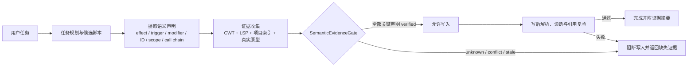

# Paradox AI Agent Reliability and Efficiency Plan / Paradox AI Agent 可靠性与效率改进计划

### 1. 文档目的

本文汇总当前 Paradox 专用 AI Agent 在运行效率、提示词效率、缓存、记忆和语义可靠性方面的审计结果，并给出分阶段改进计划。

核心结论是：**提示词精简只能降低成本，不能单独解决模型“自认为 Paradox 内容可行”的问题。** Paradox 脚本的正确性必须由运行时证据门禁保证；模型负责提出候选方案，CWT、LSP、项目索引和真实脚本原型负责证明候选方案是否可写入。

本文最初是实施计划，现已转为实施与验收记录。截至 2026-07-21，阶段 0–7 在下述验收范围内完成；基线数字来自项目自身 token 估算逻辑，适合比较相对开销，不等同于供应商最终计费。

#### 1.1 实施结果摘要

| 阶段 | 状态 | 已落地结果 |
| --- | --- | --- |
| 0. 测量基线 | 完成 | 固定静态上下文测量脚本、全注册 profile 的结构化 synthetic golden matrix、仓库 sample mod 调用链用例、cache/usage/恢复指标与回归测试 |
| 1. 可靠性门禁 | 完成 | 结构化 EvidenceClaim、四条模型可见 PDX 写路径的真实最终内容写前验证、写后诊断复验、同批定义、typed entity、on_action/triggered-only 入口、确定冲突阻断与低误杀告警策略 |
| 2. 消除重复工作 | 完成 | 移除每 turn 无条件后台摘要，统一 compaction 与取消/usage 统计 |
| 3. 运行边界 | 完成 | 顶层与子 Agent 独立的调用、wall time、未缓存输入 token 软预算；周期快照、增量事件与快照后 request artifact 重放 |
| 4. Prompt/Tools | 完成 | build 五阶段及 plan/explore/review 只读阶段化工具面、短 build 契约、按需 blueprint contract |
| 5. 缓存 | 完成 | 完整 prompt fingerprint、变更失效、有界 rules cache、cache generation、provider-call 级命中率和五维分组指标 |
| 6. 记忆 | 完成 | 运行时任务文本/game/path 相关的 top-k/容量检索、来源与 revision、新鲜度降级、实际使用记账、异步持久化 |
| 7. 灰度与收敛 | 完成 | EvidenceGate 保留 `off`/`shadow`/`enforce` 开关并默认 `enforce`；删除不可达旧 build prompt 路径 |

当前 Stellaris 空 workspace 静态测量如下；完整、可再生成的报告见 [`ai-context-baseline.md`](./ai-context-baseline.md)：

| 项目 | 实施前 | 当前 |
| --- | ---: | ---: |
| 主 build 首轮静态输入 | 约 26,500 | 7,263 |
| slim build 首轮静态输入 | 约 23,900 | 5,503 |
| 8 个并行 slim builder | 最差约 191,000 | 最差约 44,024 |
| `write_design_blueprint` Schema | 约 2,900 | 146 |

五个 build 阶段的主 Agent 静态输入均低于 8,000 token，slim 静态输入均在 4,000–6,000 token；最接近上限的是 write 阶段，分别为 7,714 和 5,954 token。预算测试覆盖所有阶段，避免只测 discovery 而遗漏后续阶段回退。

build 的 discovery/design/validation/write/finalize 五阶段均满足主 Agent 约 8k、slim Agent 4k–6k 的静态预算。plan、explore、review 也已采用只读 discovery/design/validation/finalize 子集并全部低于 8k；它们不会进入 build 的 write 阶段。这里测量的是空 workspace 的静态 prompt + tool Schema，不包含用户输入、历史、项目证据和动态记忆。

### 2. 实施前基线与主要问题

#### 2.1 上下文基线

以下为实施前的 Stellaris build 模式基线，用于与 §1.1 当前结果对照：

| 项目 | 估算 token |
| --- | ---: |
| 系统提示词 | 约 10,900 |
| 63 个工具定义 | 约 15,700 |
| 首轮静态输入合计 | 约 26,500 |
| slim build 静态输入 | 约 23,900 |
| 8 个并行 slim builder 的首轮静态输入 | 最差约 191,000 |
| `write_design_blueprint` 单个工具 Schema | 约 2,900 |

当前 slim 模式只减少了少量上下文，并没有形成真正的轻量 Agent。大量工具在当前阶段不可用或不相关，却仍然进入每次请求。

#### 2.2 运行与持久化

- [`agentRunner.ts`](../client/extension/ai/agentRunner.ts) 当前每个 turn 都会启动后台 LLM 摘要；空历史也可能触发，且它与正式 compaction 重叠，没有完整进入取消、token 和成本统计，当前运行通常也不会消费结果。
- [`runnerPolicy.ts`](../client/extension/ai/runnerPolicy.ts) 的顶层迭代上限实际可达到 10,000，无法构成有意义的调用、时间或成本边界。
- 完整 resume transcript/state 保存频率过高；原子保存需要序列化完整消息与工具结果，并进行备份、同步和重命名，长任务会产生重复磁盘 I/O。
- 请求归档重复保存完整 messages 和 tools，随着历史增长，序列化成本接近平方级累积。

#### 2.3 提示词与工具面

- 系统提示、领域知识、项目规则和工具说明存在重复表达。
- 全量工具面增加 token、选错工具和无效工具调用的概率。
- 一个超大的 Schema 会挤占真正需要的项目证据和对话上下文。
- 仅删减领域约束会降低可靠性，因此提示词压缩必须与运行时门禁同时设计。

#### 2.4 缓存

- [`promptBuilder.ts`](../client/extension/ai/promptBuilder.ts) 的冻结提示缓存指纹未完整包含实际 game、项目规则或 profile 内容、技能版本和阶段工具集。手动修改 `CWTOOLS.md` 等输入后，可能继续复用旧提示。
- 静态 system 后紧跟动态编辑器 system，导致动态内容过早截断供应商可复用的长前缀。
- `rebuildSystemPrompt` 已有定义，但正常运行路径没有形成可靠的自动失效闭环。
- [`usageTracker.ts`](../client/extension/ai/usageTracker.ts) 的缓存命中率排除了零命中请求，结果会系统性偏高。
- 扩展端 CWT rules 缓存缺少长期失效；MCP 端查询又可能重复读取规则文件。两端开销方向相反，但都缺少一致、可观察的缓存生命周期。

#### 2.5 长期记忆

- [`memoryParser.ts`](../client/extension/ai/memoryParser.ts) 会注入所有有效记忆，并在构建提示时同步重写 JSON/Markdown 和增加 `usageCount`。
- “被注入”不等于“被模型实际使用”，现有计数会让低价值记忆获得虚假的活跃度。
- 高优先级记忆可能绕过总容量淘汰，长期仍可造成结构化上下文增长。

#### 2.6 语义可靠性

当前提示虽然要求模型查询规则和验证结果，但“是否已经验证”仍很大程度由模型自己判断。这会造成以下错误：

- 语法形状看似合理，但 effect、trigger 或 modifier 并不存在。
- 名称存在，但当前 scope 不允许调用。
- 实体 ID、事件 ID、scripted effect 或 localisation key 并不存在。
- 单个片段通过解析，但入口、触发条件、引用方向或完整调用链不成立。
- CWT 没有报错，却把玩法设计建议误当成游戏运行事实。
- 工具结果已经过期或互相冲突，模型仍用语言上的自信替代证据。

因此，不能把“模型 confidence 较高”视作验证结果。

### 3. 目标架构



目标系统遵守以下边界：

1. 模型可以生成候选方案，但不能自行把 `unknown` 提升为 `verified`。
2. CWT 语法合法、scope 合法、ID 存在、调用链成立和主观设计选择必须分别判断。
3. 写入权限由确定性的运行时代码决定，而不是由系统提示中的一句要求决定。
4. 无证据时返回 `unknown`；证据冲突时返回 `conflict`；证据版本失效时返回 `stale`。
5. 只读解释和草案继续标注未验证项；写入仅在证据确认存在冲突时阻断，`unknown`、`stale` 或验证服务暂不可用时携带告警继续。
6. 用户可以通过明确的人工覆盖继续，但覆盖必须由 UI 或策略层记录，不能由模型代替用户决定。

### 4. P0：SemanticEvidenceGate

#### 4.1 结构化证据协议

建议在共享 AI/domain 类型中定义证据声明，避免 Extension Host、LSP、MCP 和 Webview 各自复制 wire format：

```ts
type EvidenceStatus = 'verified' | 'unknown' | 'conflict' | 'stale';

type EvidenceClaimKind =
    | 'syntax_shape'
    | 'scope_compatibility'
    | 'symbol_exists'
    | 'reference_exists'
    | 'call_chain'
    | 'design_choice';

interface EvidenceSource {
    tool: string;
    target: string;
    gameProfile: string;
    revision: string;
    observedAt: string;
}

interface EvidenceClaim {
    kind: EvidenceClaimKind;
    claim: string;
    status: EvidenceStatus;
    blocking: boolean;
    sources: EvidenceSource[];
    detail?: string;
}
```

`revision` 应绑定可验证的新鲜度信息，例如项目索引 generation、文件版本或 mtime、规则内容 hash、game/profile ID 和 LSP session generation。仅记录工具名称而没有目标与版本，不能算作可复验的证据。

#### 4.2 写入门禁

在 `write_file`、`edit_file`、`replace_lines`、`edit_pdx_block` 及其他能够写入 PDX 内容的工具进入实际文件修改前，执行统一的门禁：

1. 从候选 diff 或 PDX AST 中提取 effect、trigger、modifier、entity ID、event ID、scope 转换和跨文件引用。
2. 使用 CWT/LSP 校验语法形状与 scope。
3. 使用项目索引、vanilla 索引和真实 archetype 校验实体与引用存在性。
4. 对任务声明的入口和结果检查可达调用链；仅“定义存在”不等于“玩法会触发”。
5. 聚合全部声明；blocking 声明为 `conflict` 时拒绝写入，`unknown` 或 `stale` 保留为结构化告警并在写后与任务收尾重新验证。
6. 返回机器可读的缺失证据和建议查询，而不是只返回自然语言错误。
7. 写入后等待诊断刷新，再复验解析、scope、引用和受影响的调用链。

门禁必须位于工具策略和写入执行路径中，不能只作为模型可选择调用的普通工具。所有模型可见写入仍须经过现有 policy engine、路径检查、锁、权限和 plan-mode 限制。

落实结果：当前模型可见的四条通用 PDX 写路径均在文件工具生成“完整最终内容”后调用同一个异步 preflight；`edit_pdx_block` 委托结构化替换时仍经过该 preflight。直接模型调用的旧 `apply_patch` 与 `multi_replace_file_content` 已退休。成功写入后重新收集 EvidenceGate 与 fresh diagnostics；已确认的证据冲突或明确诊断错误会返回 `postWriteValidation.verdict = repair` 与 `requiresRepair = true`，证据不足本身不再破坏写入可用性。回归测试分别证明四条路径都不能绕过 enforce 门禁。

#### 4.3 不同结论的处理规则

| 结论 | 只读回答或设计草案 | PDX 文件写入 |
| --- | --- | --- |
| `verified` | 可陈述，并附主要来源 | 可进入写入及写后复验 |
| `unknown` | 明确标为未验证，可给验证步骤 | 告警后允许，写后及任务收尾重试验证 |
| `conflict` | 展示冲突来源，不替用户猜测 | 阻断 |
| `stale` | 展示过期来源并安排重新查询 | 告警后允许，不缓存该决策并尽快重新验证 |
| `design_choice` | 明确说明属于建议而非游戏事实 | 用户接受设计后，仍需验证产生的脚本声明 |

#### 4.4 为什么它能改善“AI 自认为可行”

这个门禁不依赖模型是否谦虚，也不依赖模型是否遵守“不要幻觉”的提示。即使模型声称内容可行，只要证据确认语法、scope、类型或引用存在冲突，写入层仍会拒绝；证据暂缺则继续写入并保留告警，避免自定义内容、索引刷新和多 Agent 分阶段构建被误杀。

它不能证明所有复杂玩法在游戏运行时一定符合设计预期。CWT/LSP 主要证明静态合法性，因此仍需用调用链检查、真实原型对照，以及必要时的游戏内测试来覆盖动态行为。

### 5. P0–P1：运行效率与预算

#### 5.1 统一摘要与 compaction

- 移除每 turn 无条件后台摘要。
- 只在上下文达到阈值、即将超出供应商限制或明确需要持久化摘要时执行正式 compaction。
- compaction 必须接收取消信号，并完整计入 token、成本、延迟和运行事件。
- 对相同 transcript revision 复用已生成摘要，避免后台摘要与正式 compaction 重复工作。
- 使用高低水位和最小间隔避免在阈值附近连续 compact。

#### 5.2 三类软预算

顶层运行和子 Agent 都应具备可配置的独立预算：

- 模型调用次数；
- wall time；
- 未缓存输入 token 或估算成本。

达到软预算时，Agent 应总结当前证据、剩余工作和继续执行的预计成本，请求用户继续；另设保守的紧急硬上限防止失控。初始数值应通过 benchmark 校准，不应继续依赖 10,000 次迭代作为实际保护。

#### 5.3 增量事件与周期快照

- 以现有 run ledger/event log 记录增量状态。
- 只在固定时间或事件间隔、重要状态转换、取消和 turn 结束时保存完整快照。
- 工具大结果使用内容寻址或独立 artifact，resume state 保存引用和必要摘要，避免反复内联。
- 对连续状态更新进行 debounce/coalesce。
- 保留 V2 resume 兼容，并用崩溃恢复测试证明事件重放与快照组合可恢复。

落实结果：恢复先加载最近周期快照，再定位快照之后最后一次 `model_call_start` 的 request artifact，校验 SHA-256，并在有界深度内重放 full/delta message archive；越界路径、损坏 hash 和过深 delta 链均拒绝恢复。`recoveredFromEventLog` 明确标识此次恢复是否使用了增量事件。

### 6. P1：提示词与工具效率

#### 6.1 目标预算

| Agent 类型 | system + tools 目标 |
| --- | ---: |
| 主 Build Agent | 约 8,000 token |
| slim/专职子 Agent | 4,000–6,000 token |

这是静态上下文目标，不包含用户输入、实际项目证据和必要历史。压缩优先删除重复说明、巨型示例和当前阶段无关 Schema，不删除安全策略和 Paradox 语义边界。

#### 6.2 阶段化工具面

每次请求只暴露当前阶段需要的约 8–15 个工具：

| 阶段 | 主要工具能力 |
| --- | --- |
| 发现 | 项目 profile、索引检索、目录与符号探索 |
| 设计 | 规则查询、archetype 读取、有限的 blueprint 能力 |
| 验证 | PDX 解析、scope、identifier、references、diagnostics |
| 写入 | 精确 PDX 编辑、localisation 专用写入、事务与回滚 |
| 收尾 | 诊断、diff、证据摘要和任务状态 |

阶段切换由 orchestrator/policy 决定。工具注册表继续作为 gating、effects、risk 和 concurrency 的唯一事实源，避免另建不一致的白名单。

#### 6.3 Schema 和提示词拆分

- 将 `write_design_blueprint` 等巨型 Schema 拆成摘要定义与按需加载的详细模板，或拆成更小的领域操作。
- 将稳定且可执行的全局规则保留在 system；项目知识、CWT 摘要和记忆改为检索结果。
- 对重复出现的工具使用规范生成单一短策略，不在多个 prompt section 重复。
- 为主 Agent 和专职子 Agent 分别构建最小 prompt，而不是让 slim 继承大部分主 prompt。

### 7. P1：缓存正确性与可观测性

#### 7.1 完整 prompt fingerprint

冻结提示缓存 key 至少包含：

- prompt 模板版本；
- 实际 game/profile ID 与 profile 内容 hash；
- 项目规则、`CWTOOLS.md` 和相关配置 hash；
- Agent mode、locale 和技能版本；
- 当前阶段工具集及其 Schema fingerprint；
- 会影响提示内容的功能开关。

文件监听器和配置变化应触发精确失效；`rebuildSystemPrompt` 要接入这条路径。缓存值必须有容量上限和淘汰策略。

#### 7.2 稳定前缀排序

请求尽量按以下逻辑组织：稳定 system 与安全策略、稳定阶段工具定义、可缓存历史摘要、动态项目/编辑器状态、用户本轮输入。动态编辑器内容不应夹在长静态前缀中间。

具体消息顺序仍需遵守供应商 API 对 system、tools 和 multimodal 消息的限制，并通过各 provider 的缓存测试验证，不能仅根据本地 token 估算判断命中。

#### 7.3 真实缓存指标

- 缓存命中率分母包含所有可缓存请求，包括零命中。
- 同时展示 request hit rate、cached input token ratio、节省 token 和估算节省成本。
- 按 provider、model、Agent mode、工具阶段和 prompt fingerprint 聚合。
- 记录 invalidation reason，区分正常失效、指纹缺失和供应商未命中。

落实结果：Usage 按每次完成的 provider call 保存 cache sample，而不是只保存整次 run 的汇总。主推理、compaction、fallback、validation/final summary、子 Agent、质量审查、localisation sweep、自动修复均合并进顶层；自动模式路由、权限 AutoReviewer 和首轮标题生成作为独立 Usage 请求记录，连接测试不属于 Agent 任务计量。界面展示 request hit rate、cached input token ratio、节省 token、估算节省成本，并按 provider、model、Agent mode、tool stage、prompt fingerprint 五个维度聚合零命中原因。

#### 7.4 CWT/LSP/MCP 缓存

- Extension 与 MCP 可各自持有进程内有界缓存，但必须使用一致的 game/profile/rule hash 语义。
- 用文件监听、mtime 或内容 hash 使规则修改自动失效。
- 缓存解析后的规则索引，而不是长期保存不受控的原始查询结果。
- 对 vanilla 和 workspace 规模设置 LRU/容量上限。
- 输出 cache generation，供 EvidenceGate 判断工具结果是否 `stale`。

### 8. P2：按需长期记忆

- 将“全部有效记忆注入”改为 top-k 检索，综合任务相关度、game/profile、路径范围、置信度、新鲜度和最近实际使用时间。
- 设置严格 token 上限，并为安全约束保留独立配额；高优先级不再绕过总容量。
- 仅在模型引用记忆 ID、相关工具命中或任务结果确认使用时增加 `usageCount`。
- 提示构建保持只读；记忆统计异步、debounce 后持久化，只重写发生变化的记录。
- 区分用户事实、项目事实、模型推断和临时工作记忆。模型推断不能自动升级为长期事实。
- 记忆条目绑定来源和 revision；项目或规则变化后降级为 `stale`，等待重新验证。

落实结果：AgentRunner 对所有 provider 统一将运行时记忆放在静态 system/history 前缀之后，并把本轮用户任务、实际 game/profile、活动文件及最近写入文件传给 top-k 检索。非 prefix-cache provider 不再退回“仅按优先级注入”，system prompt 也不再与 dynamic block 重复注入同一份记忆。

### 9. 实施顺序

| 阶段 | 优先级 | 状态 | 交付物 | 依赖 |
| --- | --- | --- | --- | --- |
| 0. 测量基线 | P0 | 完成 | 固定 benchmark、正确 token/cache/latency 指标、当前基线报告 | 无 |
| 1. 可靠性门禁 | P0 | 完成 | EvidenceClaim 协议、声明提取、写前门禁、写后复验、人工覆盖审计 | 阶段 0 的指标框架 |
| 2. 消除重复工作 | P0 | 完成 | 移除无条件摘要、统一 compaction、取消与计费接入 | 可与阶段 1 并行设计 |
| 3. 运行边界 | P1 | 完成 | 调用/时间/未缓存 token 软预算，增量事件与周期快照 | 阶段 0 |
| 4. Prompt/Tools | P1 | 完成 | 阶段化工具面、Schema 拆分、主/子 Agent prompt 预算 | EvidenceGate 已承接硬约束 |
| 5. 缓存 | P1 | 完成 | 完整 fingerprint、稳定前缀、真实命中率、CWT generation | 阶段 0 |
| 6. 记忆 | P2 | 完成 | top-k 检索、实际使用计数、容量和新鲜度控制 | 缓存/证据 revision 语义 |
| 7. 灰度与收敛 | P1 | 完成 | feature flag、默认 enforce、删除旧路径 | 前述阶段通过验收 |

可靠性门禁和提示词精简必须按依赖关系上线：在 EvidenceGate 覆盖关键写入前，不应大幅删除现有 Paradox 验证约束。

### 10. Benchmark 与验收标准

#### 10.1 固定用例集

至少覆盖：

- 合法且存在的 effect/trigger/modifier；
- 拼写合理但不存在的名称；
- 名称存在但 scope 错误；
- 项目 ID、vanilla ID、跨文件引用缺失；
- 语法合法但入口不可达或调用方向错误；
- CWT 规则与项目真实 archetype 冲突；
- 文件或规则更新后证据过期；
- 设计建议被错误陈述为游戏事实；
- localisation、事件链、scripted effect 和 modifier 等任务形状；其中调用链另使用仓库 `client/test/sample` 的已签入 sample mod 进行真实文件回归；
- 长任务、取消、恢复、compaction 和多 Agent 合并。

#### 10.2 核心指标

| 维度 | 指标 |
| --- | --- |
| 可靠性 | 高风险用例 false acceptance、语义写入证据覆盖率、`unknown` 被错误升级次数、写后逃逸诊断数 |
| 效率 | 首轮静态 token、每任务未缓存输入 token、模型调用数、工具调用数、wall time、compaction 次数 |
| 缓存 | 全请求命中率、cached token ratio、各失效原因、过期缓存使用次数 |
| 恢复 | 取消延迟、恢复成功率、事件重放一致性、快照大小和写入次数 |
| 质量 | 任务完成率、有效 diff 比例、用户人工覆盖次数、游戏内验证通过率（可获得时） |

首批上线的最低门槛：

1. 固定高风险用例中，已确认的语法、scope、类型或引用冲突不得自动写入；仅证据不足不得中断写入。
2. 所有语义敏感写入均产生结构化证据摘要。
3. `unknown`、`conflict` 和 `stale` 不能由模型文本自动改为 `verified`；其中只有 `conflict` 触发写前阻断。
4. compaction、fallback 和子 Agent 调用完整计入 usage 与取消链路。
5. 主 Agent 静态上下文达到约 8k、slim Agent 达到 4k–6k，且可靠性 benchmark 不回退。
6. 缓存命中率按全部请求计算，规则或项目配置更新后不会复用旧证据。
7. 恢复测试证明周期快照加增量事件可以替代高频完整 transcript 保存。

#### 10.3 当前 benchmark 与验证记录

- Paradox 高风险 golden matrix 对所有注册 game/profile 运行同一组结构化 synthetic 用例：已确认冲突 0 false acceptance，告警场景 0 false block。它证明 profile 隔离与低误杀策略，不是假装每个游戏已有独立真实 corpus。
- EvidenceGate 用例覆盖不存在名称、wrong scope、wrong entity type、缺失 ID、同批定义、索引刷新分歧、等待未来调用方的 triggered-only 事件、on_action 入口，以及 `write_file`、`edit_file`、`replace_lines`、`edit_pdx_block` 四条写入路径。
- 当前保守 typed ID 覆盖为 event、scripted effect、scripted trigger、technology、trait、building、starbase building；modifier 由 CWT modifier 规则单独校验。未被 schema 明确识别的通用参数不会被文档伪称为已验证。
- SemanticVerifier 对显式 `featureManifest.requiredEdges`、task `produces/consumes` 和 acceptance checks 生成文件/行证据；仓库 sample mod 的 `irm_faction.2 -> faction_set_leader` 调用链作为真实文件回归。该验证是“声明过的任务级边和生命周期验收”，不是任意动态玩法的形式化证明。
- 请求归档按首个完整 transcript + 后续公共前缀/增量保存；工具 Schema 与大型工具结果按内容 hash 去重；恢复测试覆盖周期快照后的 request artifact 重放。
- prompt 预算回归覆盖 build 五阶段的主/slim 上下文以及 plan/explore/review 只读阶段，而不是只覆盖首轮 discovery。
- Usage 回归覆盖零命中分母、provider-call 级 cache sample、五个聚合维度、节省 token/成本，以及子 Agent 与旁路 Agent provider 请求。
- 2026-07-21 最终门禁通过：`npm run verify`（ESLint 零警告、TypeScript/Rollup、1,454 项 extension 单元测试、20 项 rules-sync、release gate）；`dotnet build src/Main/ --no-restore` 为 0 警告/0 错误；MCP schema/shared/MCP build 与 51+38 项 contract tests 通过；`npm run build:docs` 通过。
- 本文或实现修改后必须重新运行 `npm run baseline:ai-context`、`npm run compile`、`npm run test:unit`、后端/MCP/contracts、`npm run build:docs`、release gate 和 `npm run verify`；最终一次执行结果以本次变更交付记录为准，避免在长期文档中保留会过期的测试总数。

能力边界：静态证据门禁能证明已提取声明的语法、CWT rule、scope、上述 typed identifier/reference，以及明确 `is_triggered_only = yes` 事件的项目/on_action 入口。它不能证明未识别的所有通用 entity ID、脚本参数组合、跨 DLC/版本差异或游戏内动态玩法效果。复杂行为仍需真实 archetype 对照，必要时进行游戏内测试；CWT/LSP 零诊断绝不自动升级为“玩法一定正确”。

### 11. 发布与风险控制

- EvidenceGate 使用独立的 `off`/`shadow`/`enforce` 设置；当前默认值及无效配置回退均为 `enforce`。`enforce` 只阻断已确认冲突，`unknown`、`stale` 与证据服务暂不可用均作为告警；`shadow` 仅用于显式诊断和对照。
- build 阶段化工具和新 compaction 已进入默认路径；旧 build prompt 已删除，不再保留不可达回滚实现。
- 门禁不可用时，写入继续并记录 degraded/evidenceUnavailable 告警；恢复后重新验证，避免 LSP 或索引故障演变为写入故障。
- 记录被阻断声明、来源、状态和用户人工覆盖，不记录不必要的完整私密 prompt；模型参数不能触发覆盖。
- 对各 game/profile 分别灰度；不能把 Stellaris 的证据完整度等同于所有 Paradox 游戏。
- 每个 observable behavior 变更添加定向回归测试，再运行 AI runtime 单元测试；涉及 MCP/LSP 协议时按仓库验证要求运行 schema、build 和 contract tests。

### 12. 非目标

- 不尝试仅靠更长 system prompt 消除幻觉。
- 不把 CWT 零诊断解释为玩法动态行为一定正确。
- 不允许模型以自然语言 confidence 代替工具证据。
- 不为了缓存命中而复用跨 game/profile、跨规则 revision 的旧上下文。
- 不在本计划中直接修改上游 CWTools 规则内容；发现规则缺口时应作为独立任务处理。
