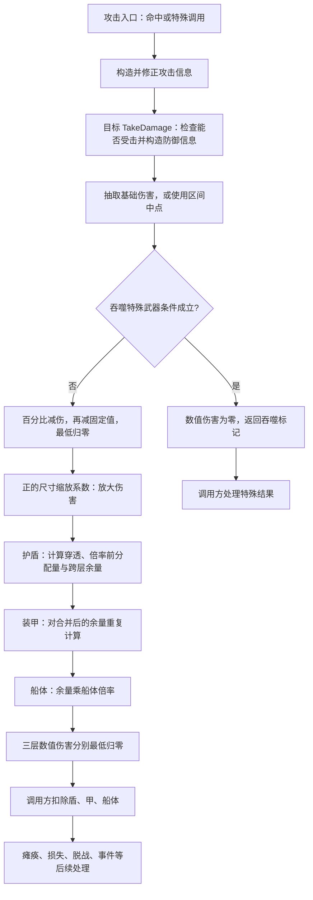

**群星伤害结算逻辑——Stellaris 4.5.2 反编译分析**

整理日期：2026-10-08。源码核验日期：2026-10-08。

依据：`anti_stellaris` 仓库的 `stellaris_4.5.2_source.cpp`（Ghidra 导出的 **Linux** 4.5.2，9,364,545 行，139,641 个函数块，符号化率 99.9993%）。本文所有 `[Sxx]` 行号均指向该文件。

> **核验状态（2026-10-08）**：本文全部可核验断言已逐条回源码比对，约 60 项断言**零反驳、零行号错位**；1 处结论被推翻并已改写（见 §9.5）。修订明细见文末[附录 A](#appendix-a)，逐项核验记录见[附录 B](#appendix-b)。
>
> **游戏版本**：`D:\Steam\steamapps\common\Stellaris`，`launcher-settings.json` 记 `v4.5.2 (9776) Cygnus`，与 dump 版本一致。
>
> **配套文件说明**：第 13 节提到的 `stellaris_damage_reference.py` 与 `stellaris_damage_example.json` **未随本文分发**，需要时请按 §13 的伪代码自行复算。`[D01]`–`[D08]` 的配置值已对照游戏安装目录 `common/defines/00_defines.txt`（v4.5.2）逐条核验，值与行号均一致。

本文“当前配置”指该 `00_defines.txt` 的数值；公式仍保留符号参数，便于核对其他配置。define 原值以游戏单位表示，例如尺寸上限 100 对应定点原始整数 10000000，不能再把配置中的 100 除以 100000。

本文覆盖太空战中一次攻击的命中入口、攻击参数修正、`NCombatRules::CalcDamage` 三层分配、目标扣血及直接相关的特殊处理。主线是普通舰船、导弹、舰载机受到攻击时的伤害结算；陆军、轨道轰炸、持续环境伤害以及任意脚本自行修改生命值的行为不由这一套公式统一定义。

本文区分三个概念：**基础伤害在各层之间如何分配、函数返回了多少伤害、目标实际上扣了多少耐久**。穿透、溢出、伤害倍率、吸血式恢复之间的大部分疑问，都来自这三种数值被混用。

结论依据分为：源码直接可见的执行顺序、由其推导出的公式与例子、尚须配置或运行时状态确认的内容。本文已做静态交叉核查和整数定点复算，未宣称在游戏进程中进行过实测。源文件本身包含反编译类型推导警告；字段中文名以读写位置和调用方相互验证，不能把反编译器生成的 `this`、指针类型和寄存器参数都当作原始 C++ 声明。

阅读导航：

- [1. 核心规则与流程](#part1)
- [2. 输入、输出与上游修正](#part2)
- [3. 基础伤害、减伤、尺寸缩放](#part3)
- [4. 单层结算：穿透与溢出如何合并](#part4)
- [5. 三层完整公式与四种容量状态](#part5)
- [6. 伤害倍率为何不改变本次跨层余量](#part6)
- [7. 上下限、异常参数与数值精度](#part7)
- [8. 普通舰船、导弹、舰载机的差异](#part8)
- [9. 特殊处理、恢复、范围与连锁攻击](#part9)
- [10. 命中判定与期望值](#part10)
- [11. 重点逐步算例](#part11)
- [12. 23 组案例对照](#part12)
- [13. 复算方式与伪代码](#part13)
- [14. 源码索引、验证范围与待确认项](#part14)
- [15. 武器字段与引擎结构偏移对照](#part15)
- [16. modder 易踩的语义陷阱](#part16)
- [附录 A：2026-10-08 源码核验修订清单](#appendix-a)
- [附录 B：逐项核验记录](#appendix-b)
<a id="part1"></a>

**1. 核心规则与流程**

第 946301 行位于 `CMissile::TakeDamage`，表示**一枚导弹正在受到伤害**，例如被点防御攻击。它并非“导弹对敌舰造成伤害”的专用公式。`CalcDamage` 的公共实现位于 2014339～2014617 行。[S01]、[S03]

普通数值伤害的流程如下；图中的“分配”与“扣血”属于不同阶段。



最重要的规则是：

1. 护盾先于装甲，装甲先于船体。
2. 有效穿透率为 `clamp(穿透率 − 硬化率, 0, 1)`。
3. 本层尚未乘伤害倍率的分配量，与本层当前耐久比较，决定多少基础伤害可以继续向内传递。
4. 本层的伤害倍率在分配之后使用，**不会回头重算本次攻击的跨层余量**。
5. 返回伤害不按目标当前耐久封顶；实际盾、甲扣血由调用方限制到剩余耐久。
6. 船体收到本次三层分配的最终余量。击毁后的过量伤害不会由本函数自动寻找另一目标。
7. 所有百分比在公式中使用小数：`50% = 0.5`；倍率 `1.5` 表示造成 150% 伤害。

<a id="part2"></a>

**2. 输入、输出与上游修正**

根据原始函数注释，逻辑签名为：

```cpp
SDamageResult CalcDamage(
    const SDefenseInfo& defense,
    const SAttackInfo& attack,
    const SShipDamageReductionInfo& reduction,
    bool randomize
);
```

在反编译文本中，`this` 实际承担返回结构地址；`param_10`、`param_11`、`param_12`、`param_13` 依次对应上面四项。`param_11` 被推导成 `CStatInterval<CFixedPoint>*`，是因为攻击结构开头恰好放了一个伤害区间。[S01]

输入字段如下，偏移均为字节偏移。

| 结构 | 偏移 | 符号 | 含义 |
|---|---:|---|---|
| 攻击 `SAttackInfo` | `+0x00` | d_min | 已修正的伤害区间下限 |
| 攻击 | `+0x08` | Δd | 已修正的区间宽度，d_max − d_min，不是上限本身 |
| 攻击 | `+0x10` | m_H | 最终船体伤害倍率 |
| 攻击 | `+0x18` | m_A | 最终装甲伤害倍率 |
| 攻击 | `+0x20` | m_S | 最终护盾伤害倍率 |
| 攻击 | `+0x28` | p_A | 装甲穿透率，尚未扣除目标硬化 |
| 攻击 | `+0x30` | p_S | 护盾穿透率，尚未扣除目标硬化 |
| 攻击 | `+0x38` | c | 目标尺寸伤害缩放系数 |
| 攻击 | `+0x40` | — | 本函数没有读取此字段，不能把它再乘到最终伤害上 |
| 攻击 | `+0x48` | component | 组件模板指针，供吞噬条件判断 |
| 防御 `SDefenseInfo` | `+0x00` | S | 当前护盾值 |
| 防御 | `+0x08` | A | 当前装甲值 |
| 防御 | `+0x10` | s | 目标的 size_multiplier |
| 防御 | `+0x18` | h_S | 护盾硬化率 |
| 防御 | `+0x20` | h_A | 装甲硬化率 |
| 减伤 `SShipDamageReductionInfo` | `+0x00` | f | 固定值减伤 |
| 减伤 | `+0x08` | r | 百分比减伤 |

**当前船体值 H 不是 `CalcDamage` 的输入。** 因此它既不能把返回船体伤害限制为当前 H，也不能独自决定舰船被摧毁、被瘫痪还是执行吞噬事件。[S01]、[S06]

返回结构的重要字段：

| 偏移 | 本文记号 | 内容 |
|---:|---|---|
| `+0x00` | — | 本函数初始化为 1 的状态字节；不要把它当作命中概率 |
| `+0x01` | engulf | 吞噬标记，普通数值伤害为 0，特殊路径为 1 |
| `+0x08` | D_H | 最终船体数值伤害 |
| `+0x10` | D_A | 最终装甲数值伤害 |
| `+0x18` | D_S | 最终护盾数值伤害 |
| `+0x20` | R_A | 传到船体的倍率前余量 |
| `+0x28` | Q_A | 分配到装甲的倍率前量 |
| `+0x30` | Q_S | 分配到护盾的倍率前量 |

后三个中文名称是对计算用途的命名，不冒充源代码原始成员名。它们也会在返回前最低归零。[S01]

攻击修正发生在上游 `CShip::ApplyModifier`，不能把界面上或组件文件中的未修正数据直接当成最终输入。[S07]

- 船体、装甲、护盾倍率分别乘攻击者提供的对应倍率。相关结构创建时可见 `1 + modifier`，所以传入 `CalcDamage` 后不再统一加 1。
- 两类穿透均为：`(组件穿透 + 穿透加法修正) × 穿透倍率修正`，然后才在 `CalcDamage` 内减去目标硬化并截断。
- `+0x38` 的尺寸伤害系数会在外层加上攻击者对应修正。
- 伤害区间的下限和宽度，分别乘综合攻击伤害因子；这个因子包含攻击者、组件标签和目标条件等来源。代码不是简单把所有修正逐项相乘，也不支持“所有增伤一律相加”的概括。
- 本文及复算脚本从这些修正完成后的输入开始；修正 ID 与所有本地化名称的完整映射需另查游戏配置。

<a id="part3"></a>

**3. 基础伤害、减伤、尺寸缩放**

记 `[x]+ = max(0,x)`，`clamp01(x) = min(1,max(0,x))`。本节先用通常实数记法说明顺序；逐步定点截断见第 7 节。

不随机时：

$$
D_0=d_{\min}+\frac{\Delta d}{2}
$$

随机时：

$$
D_0=d_{\min}+\Delta d\frac{k}{1000},\qquad k\in\{0,1,\ldots,999\}
$$

`GetRandom` 实际用随机整数的绝对值对 1000 取模，再乘 100 形成定点比例。若区间宽度为 0，直接返回下限。正常正宽度区间不抽到上端点；有 1000 个比例档位，但定点截断可能使多个档位落到同一伤害数值。[S02]

若把 1000 档视为等权且暂不考虑截断，平均抽样伤害为 `d_min + 0.4995 × Δd`，不是精确的区间中点。实际 PRNG 取模的微小分布偏差不在本文中假定为零。

减伤只在分层之前执行一次：

$$
\boxed{D_1=[D_0(1-r)-f]_+}
$$

例如基础伤害 100、百分比减伤 20%、固定值减伤 10，得到 70。护盾、装甲、船体不会各自再减一次 10；因穿透、溢出形成的不同路径也不会分别重复减伤。[S01]（2014399～2014418）

令 `M = NDefines::NShip::MAX_DAMAGE_SCALING`，**当前配置 M=100**（`00_defines.txt` 第 1787 行）。严格按源码选择有效尺寸：[D01]

$$
s_{\mathrm{eff}}=
\begin{cases}
1,&s<1\\
\min(s,M),&s\ge1
\end{cases}
$$

然后：

$$
\boxed{
D=
\begin{cases}
D_1(1+c\,s_{\mathrm{eff}}),&c>0\\
D_1,&c\le0
\end{cases}}
$$

`D` 是进入分层结算的伤害。通常配置 `M >= 1` 时，有效尺寸相当于限制在 `[1,M]`。源码的严格顺序仍以上面的分段式为准：例如人为把 M 改成 0，`s<1` 仍选择 1，而 `s>=1` 会选到 0。[S01]（2014419～2014462）

需要注意：

- c 为 0 或负数时完全跳过此阶段；不是自动变成减伤。**更精确地说**：源码判断的是 `c_raw < 1`，即真实值 `c < 0.00001` 才跳过（2014419～2014420）。因此 `c` 落在 `(0, 0.00001)` 区间仍会进入缩放，与 `c ≤ 0` 的实数口径存在半个量子差异。
- 尺寸倍率是 `1 + c × s_eff`，不是 `1 + c × (s_eff − 1)`。
- `MAX_DAMAGE_SCALING` 限制的是用于相乘的尺寸因子，不是给最终伤害设置固定上限。
- 固定值减伤在尺寸放大之前；若 D1 已归零，普通非负尺寸放大不能把它重新变成正值。
- 用户提供的当前 defines 已确认 M=100，因此当前有效尺寸范围为 `[1,100]`。文中 E14、E15、E23 取 M=8 是专门指定的演示配置，不是当前版本的配置值。

> 当前配置注：当 c>0 时，尺寸放大因子为 `1 + c × clamp(s,1,100)`，对于固定 c，其最大值为 `1 + 100c`。例如 D1=100、c=0.5、s≥100 时，放大后 D=5100。这里的 5100 尚未乘各层伤害倍率，也不是所有武器的统一伤害上限。[D01]

<a id="part4"></a>

**4. 单层结算：穿透与溢出如何合并**

把护盾或装甲看作一层，定义：输入基础量 I，当前耐久 L，输入穿透 p，硬化 h，该层伤害倍率 m。

层存在，即 `L > 0` 时：

$$
P=\operatorname{clamp01}(p-h)
$$

$$
Q=I(1-P),\qquad B=I-Q
$$

这里 Q 是分给本层的倍率前量，B 是绕过本层的量。然后：

$$
C=\min(L,Q),\qquad O=[Q-L]_+
$$

C 是本层从本次基础量中扣掉的部分，O 是该分配量超过当前耐久的部分。流入下一层：

$$
\boxed{R=I-C=B+O}
$$

本层返回的数值伤害另行计算：

$$
\boxed{D_L=[mQ]_+}
$$

若 `L <= 0`，本层直接跳过：`Q=C=O=D_L=0，B=R=I`。硬化不会使一层已经不存在的防御重新产生吸收能力。[S01]

**穿透和溢出可以同时发生，但不是重复计算同一份伤害。** 穿透来自 `I−Q`，溢出来自 `Q−L` 的正部分。正确合并为：

$$
\boxed{R=IP+[I(1-P)-L]_+=\max(IP,I-L)}
$$

这是忽略定点截断的等价式。容易写错的 `IP + max(0,I−L)`，把原本已经包含穿透的余量又加了一次，会多算伤害。

例如 `I=100、P=30%、L=40`：

```text
分给本层 Q = 70
绕过本层 B = 30
本层消耗 C = 40
容量溢出 O = 70 − 40 = 30
流入下一层 R = 30 + 30 = 60
```

错误公式会得到 `30 + (100−40) = 90`。

**判断是否发生容量溢出，应比较 Q 与 L，不应比较 I 与 L。** 例如 `I=100、P=80%、L=30` 时，虽然 I>L，但 Q=20≤30，没有容量溢出；向内的 80 全部来自穿透。

两个边界：

- `Q=L` 时，容量恰好够，O=0；不能再补一份“破盾溢出”。
- `P=1` 时 Q=0，全部绕过本层；即使 L 很低，也不存在来自该层分配量的溢出。

硬化采用相减再截断。`p=1、h=0.3` 得 P=0.7；`p=1.5、h=0.3` 得 P=1。源码没有先把输入 p 限为 1 再减 h，因此“超过 100% 的输入穿透可以抵消额外硬化”在这层算术上成立，前提是上游确实允许产生并传入这样的 p。

<a id="part5"></a>

**5. 三层完整公式与四种容量状态**

按当前护盾 S、当前装甲 A，分别使用上一节的单层函数。

$$
P_S=\operatorname{clamp01}(p_S-h_S),\qquad
P_A=\operatorname{clamp01}(p_A-h_A)
$$

$$
Q_S=\begin{cases}
D(1-P_S),&S>0,\\
0,&S\le0.
\end{cases}
$$

$$
R_S=D-\min(\max(S,0),Q_S),\qquad D_S=\max(0,m_SQ_S)
$$

$$
Q_A=\begin{cases}
R_S(1-P_A),&A>0,\\
0,&A\le0.
\end{cases}
$$

$$
R_A=R_S-\min(\max(A,0),Q_A),\qquad D_A=\max(0,m_AQ_A)
$$

$$
\boxed{D_H=\max(0,m_HR_A)}
$$

护盾绕过量与护盾溢出量先合并为 RS；装甲对**全部 RS**重新应用装甲穿透。护盾穿透并不自动意味着装甲穿透，护盾溢出也不自动成为船体伤害。[S01]

当 S、A 都为正，忽略逐步定点截断时，展开到船体的倍率前余量如下。精确到定点量子的版本应使用第 7 节与复算脚本的逐步算法，不能把下面的乘法任意合并。

$$
R_S=DP_S+\max(0,D(1-P_S)-S)
$$

$$
\boxed{
\begin{aligned}
R_A={}&\underbrace{DP_SP_A}_{\text{护盾绕过量中的装甲穿透}}\\
&+\underbrace{\max(0,D(1-P_S)-S)P_A}_{\text{护盾溢出量中的装甲穿透}}\\
&+\underbrace{\max(0,R_S(1-P_A)-A)}_{\text{合并量造成的装甲容量溢出}}
\end{aligned}
}
$$

这三个部分解释了穿透与双层溢出同时发生时的去向。代码不为不同来源保留独立伤害包或另抽随机伤害；它只维护合并后的剩余量。

为便于在不支持数学渲染的 Markdown 阅读器中核对，核心公式也列成纯文本。下列乘法同样省略逐步定点截断；`*` 表示乘法。

```text
PS = min(1, max(0, pS - hS))
PA = min(1, max(0, pA - hA))

QS = D * (1 - PS)       if S > 0, otherwise 0
RS = D - min(max(S, 0), QS)
DS = max(0, mS * QS)

QA = RS * (1 - PA)      if A > 0, otherwise 0
RA = RS - min(max(A, 0), QA)
DA = max(0, mA * QA)
DH = max(0, mH * RA)

When S > 0 and A > 0:
RS = D * PS + max(0, D * (1 - PS) - S)
RA = D * PS * PA
   + max(0, D * (1 - PS) - S) * PA
   + max(0, RS * (1 - PA) - A)
```

按“倍率前分配量是否超过该层耐久”划分四种状态。下面忽略定点截断，假定 S、A>0：

| 护盾容量状态 | 装甲容量状态 | 到达装甲的 RS | 到达船体的 RA |
|---|---|---|---|
| QS≤S | QA≤A | D·PS | D·PS·PA |
| QS>S | QA≤A | D−S | (D−S)·PA |
| QS≤S | QA>A | D·PS | D·PS−A |
| QS>S | QA>A | D−S | D−S−A |

QA 必须用该行实际 RS 计算；不能先用 `D·PS` 算 QA，再忽略盾溢出。这里的“容量不足”也不等于倍率生效后该层实际已经耗尽。

在双层容量都不足的区间中，`RA=D−S−A` 与 PS、PA 无关；这是**满足这两个分支条件时的局部结论**。增加穿透使条件跨过分界，表达式随之改变。

可以用守恒关系检查计算：

$$
\boxed{D=C_S+C_A+R_A}
$$

守恒的是倍率前基础量的消耗，不是三项返回伤害之和。事实上：

$$
Q_S+Q_A+R_A=D+O_S+O_A
$$

因此即使三层倍率全为 1，只要存在容量溢出，返回伤害之和仍可大于 D。在非负当前耐久、足够船体、没有特殊后处理、倍率全为 1 的条件下，三层**实际耐久损失**之和才等于 D。

<a id="part6"></a>

**6. 伤害倍率为何不改变本次跨层余量**

护盾阶段先在 2014499 行执行 `剩余量 -= min(当前护盾, QS)`，2014501 行之后才乘护盾倍率；装甲阶段在 2014553 行执行同类扣减，2014555 行之后才乘装甲倍率。这一顺序直接决定以下行为。[S01]

**减伤倍率可能使外层仍有耐久，内层却已经受伤。**

`D=100、S=75、PS=0、mS=0.5、A=100、PA=0、mA=1`：QS=100，RS=25，DS=50，DA=25。扣血后护盾剩 25，装甲损失 25。不是额外偷偷加了穿透；跨层余量由倍率前的 100 与当前盾 75 决定。

**增伤倍率可以打空本层，但不因此额外向内追加溢出。**

`D=100、S=150、PS=0、mS=2`：QS=100，RS=0，DS=200。盾被扣到 0，内层本次仍不受伤。不能把 `200−150=50` 再传给装甲。

**m=0 不等于自动完全穿透。**

`D=100、S=200、PS=0、mS=0`：本层仍消耗全部基础量，RS=0，DS=0。结果是不伤盾也不伤内层。若 m<0，返回的本层伤害归零，已完成的基础量消耗也不会撤销。

**倍率对未来攻击有间接影响。**

上述“倍率不改变跨层余量”只比较当前同一次攻击、同一组输入。倍率改变了扣血后的 S、A，下一次攻击重新读取当前防御值，其分配当然可能不同。

**单次大伤害和多次小伤害不等价。**

即使没有固定减伤，沿用 `S=75、A=100、mS=0.5、零穿透`：一次 100 造成盾损 50、甲损 25；连续两次 50，第一发后盾为 50，第二发倍率前恰好仍被盾容量挡住，总盾损 50、甲损 0。复算脚本专门验证了此例。

<a id="part7"></a>

**7. 上下限、异常参数与数值精度**

下表主要说明 `CalcDamage` 本身的边界；“没有限制”不表示游戏配置、修正系统和其他调用方也一定允许任意输入。

| 对象 | 本函数执行的限制 | 结论及注意事项 |
|---|---|---|
| 基础伤害区间 | 不在此处排序或修复区间 | 正常数据应满足 Δd≥0；负宽度不是被自动交换端点 |
| 随机比例 | k/1000，k=0…999 | 正宽度区间不取比例 1；不是整数伤害随机，也不是连续均匀分布 |
| 百分比减伤 r | 不在函数内单独 clamp | 正常 r≥1 且 D0、f≥0 时伤害归零；r<0 会增伤 |
| 固定减伤 f | 不在函数内单独 clamp | f<0 在算术上相当于加伤害；是否能得到这种输入取决于上游 |
| 百分比阶段的中间值 | 尚不归零 | 严格顺序是先乘、再减 f，最后才取 max(0,…) |
| 减伤后的 D1 | 最低 0 | 没有正数最低伤害，如“最少造成 1 点”的规则 |
| 缩放系数 c | 仅 c>0 时进入缩放 | 实为 `c_raw < 1`（c<0.00001）才跳过；c 本身没有在此设置正向上限 |
| 目标尺寸 s | s<1 取 1，否则 min(s,M) | 当前 M=100，即限制到 `[1,100]`；不是伤害总上限 |
| 穿透 p、硬化 h | 先求差，再限制 P 到 [0,1] | 不单独把 p、h 限到 [0,1]；负硬化可提高有效穿透 |
| 当前盾甲 L≤0 | 跳过该层 | 实为 `L_raw < 1`（L<0.00001）才跳过；硬化与该层伤害倍率都不能使本层重新参与吸收 |
| 当前盾甲 L>0 | 使用当前值，不读取该层最大值 | 哪怕只剩 0.00001 也进入该层分配 |
| 本层倍率前分配 Q | 正常非负输入下 0≤Q≤I | Q 不按 L 裁剪；`min(L,Q)`只用于消耗基础量 |
| 流入下一层 R | 正常参数下 0≤R≤I | 穿透与容量溢出相加不会超过该层输入 |
| 伤害倍率 m | 不单独 clamp | m>1 可增伤；m≤0 最终返回本层伤害为 0，但不改变已算好的余量 |
| 三层返回伤害 | 最低 0 | 实为 `raw < 1 → 0`（2014588/4594/4598/4603/4608/4613），小于 0.00001 的正伤害同样被抹掉；不按当前或最大耐久设置上限 |
| 返回的三项倍率前量 | 最低 0 | 不是额外施加的伤害，不能再加到最终伤害上 |
| 盾甲扣血后的值 | 调用方限制到最低 0 | 普通非负初始状态下，实际损失≤该层当前值 |
| 船体扣血后的值 | 先做减法，可为负数 | 随后由调用方执行瘫痪、击毁、吞噬等规则 |
| 最终伤害总量 | 没有统一百分比封顶 | 增伤倍率、尺寸系数和返回过量伤害不能混同为容量消耗 |

减伤参数一个容易忽略的异常组合：`D0=100、r=1.2、f=−30` 时，先得到 −20，再减 −30，最后归零检查得到 **10**。若在乘百分比减伤后提前归零，会误算成 30。本文只说明本函数对输入的算术结果，不断言正常配置可以产生此组合。

普通舰船读取 r、f 时，会依据对应修正元数据的标志决定是否先限制在 `[0,1]`；源码出现了这一条件分支，但没有仅凭本函数即可确认的元数据值。硬化的部分上游修正读取也有同样的条件。因此应同时区分“最终函数缺少限制”和“实际可到达的输入范围”。[S05]、[S06]

**定点精度。** `CFixedPoint` 在本路径使用比例 `Q0=100000`，真实数值 1 对应原始整数 100000，最小量子为 `ε=0.00001`。反编译中的 `&DAT_000186a0` 在这些算术表达式中应读作 100000。

> **该常量已被 dump 自证，无需推断。** 2014400 行是溢出快路径的守卫：`a + 0xb504f333 < 0x16a09e667`，其中第二个操作数的松弛量写作 `0xb5036c93`，而 `0xb504f333 − 0x186a0 = 0xb5036c93` **精确成立**。编译器把 `DAT_000186a0` 的**数值**直接折进了边界常量，因此反编译文本本身证明了该常量恰为 100000。

若原始整数为 x_raw、y_raw，一次乘法为：

$$
\operatorname{mul}_{FP}(x_{raw},y_{raw})
=\operatorname{trunc}_0\left(\frac{x_{raw}y_{raw}}{100000}\right)
$$

`trunc0` 表示向零截断；对非负值等于向下取整。百分比减伤、c 与尺寸相乘、尺寸倍率与伤害相乘、每层非穿透比例、每层伤害倍率，都是分别执行的定点乘法。不能先做一整条浮点表达式再统一四舍五入。

源码中的 `if (raw < 1)` 指原始整数小于 1，即真实数值小于 0.00001，而不是伤害小于 1。比如 0.5 点伤害可以正常存在。

上文的定点乘法模型覆盖的是 `trunc0(a·b/1e5)` 这一形态。**尺寸缩放还存在一处加性形态**（2014433、2014447）：`&DAT_000186a0 + (lVar4*lVar2)/100000`，即 `1 + c·s_eff`，常量值仍是 100000，但它是「加 1.0」而非「乘一个系数」。同理穿透比例用 `&DAT_000186a0 − P`（2014478、2014532）表达 `1−P`。读复算代码时不要把这两种形态都当成乘法。

**穿透余量的精确写法。** 实现先算 `q_raw = floor(i_raw × (100000−p_raw)/100000)`，再做 `b_raw = i_raw − q_raw`。因此非负输入下：

$$
b_{raw}=\left\lceil\frac{i_{raw}p_{raw}}{100000}\right\rceil
$$

这意味着绕过部分的量子余数留在下一层。精确单层公式是：

$$
\boxed{r_{raw}=\max\left(
\left\lceil\frac{i_{raw}p_{raw}}{100000}\right\rceil,
i_{raw}-l_{raw}\right)}
$$

适用前提为本层 L>0、I≥0、有效 P∈[0,1]，且整数运算不溢出。若直接把 `I × P` 向下截断，会少算最多一个量子；两层连续执行时可能改变最终极小伤害。

例如 `D=0.00001、S=A=1、PS=PA=0.5`：护盾 Q 向下截成 0，全部 0.00001 进入装甲；装甲 Q 又截成 0，最终船体仍收到 0.00001。直接计算 `floor(D×0.5×0.5)` 会得到 0，与逐步执行不同。P=0 本身不会凭空制造这个余量。[S01]

**大数与机器整数溢出。** 文中的“盾甲容量溢出”是游戏规则；“整数溢出”是计算机数值越界，两者必须分开。

普通乘法快路径可见阈值 `0xb504f333 = 3037000499`，约为有符号 64 位整数最大值的平方根；按定点单位换算约为 30370.00499。超过快路径范围会改用整部、余部分拆计算，不表示伤害在 30370 点封顶。

常见拆分形式是：

```text
larger = max(a_raw, b_raw)
smaller = min(a_raw, b_raw)
result = trunc0((larger % 100000) * smaller / 100000)
       + trunc0(larger / 100000) * smaller
```

这能避开许多直接乘法越界，但不保证任意大数安全。64 位有符号原始数的最大表示值为 `9223372036854775807`，约对应 `92233720368547.75807` 个真实单位；这是表示范围，不是游戏设计的伤害上限。乘法中间项、加法、区间宽度和伤害合计都可能更早越界。

极端数值还会进入带额外强制转换的区间中点路径；不能只凭本报告把这些路径认定为无限精度数学。配套脚本拒绝支持范围外的整数溢出和极端中点分支，**不会静默回绕，也不会自动设成某个游戏上限**。

<a id="part8"></a>

**8. 普通舰船、导弹、舰载机的差异**

三个受击对象共用同一分层函数，但传入的防御数据和返回后的处理不同。

| 受击对象 | 防御信息来源 | r、f | randomize | 生命结束处理 |
|---|---|---|---|---|
| 普通舰船 | 当前盾甲、舰船尺寸，以及护盾/装甲硬化修正 | 从目标修正表读取 | true | 后续可能瘫痪、损失、脱战等 |
| 导弹 | 当前盾甲；尺寸、两类硬化直接置零 | 均置零 | true | 船体≤0 时设置导弹销毁标记 |
| 舰载机 | 当前盾甲；尺寸、两类硬化从模板的相邻字段复制 | 均置零 | true | 船体≤0 时设置舰载机销毁标记 |

普通舰船的 `BuildDefenseInfo` 使用舰船尺寸结构 `+0x630` 作为 s；该字段还用于 `SHIP_SIZE_MULTIPLIER` 显示和对应触发器。硬化通过 `GetShipClassArmorHardeningModifier`、`GetShipClassShieldHardeningModifier` 等来源组合。[S05]、[S08]

**导弹受击，即第 946301 行。** 输入具体为：

```text
S = missile[+0x90]
A = missile[+0x88]
s = hS = hA = r = f = 0
randomize = true
```

所以普通数值路径中：

$$
D=\begin{cases}
\max(0,D_0)(1+c),&c>0,\\
\max(0,D_0),&c\le0.
\end{cases}
$$

尺寸 0 被内部下限提升为 1，不能据此推断导弹免疫尺寸缩放。随后 S、A 扣到最低 0，船体 `missile[+0x80]` 减 DH；船体≤0 时 `+0xb0` 置 1。[S03]

**舰载机受击。** `CStrikeCraft::TakeDamage` 将模板 `+0x1298/+0x12a0/+0x12a8` 复制到防御信息的尺寸、护盾硬化、装甲硬化位置。模板构造函数将这三项初始化为 0，但受击函数本身不是硬编码清零，不能把“构造默认值”说成“所有舰载机永远为零”。当前盾甲在舰载机 `+0x138/+0x140`，船体在 `+0x148`，销毁标记在 `+0x154`。[S04]、[S09]

在普通非负初始耐久下，直接扣血共同满足：

$$
S'=\max(0,S-D_S),\quad A'=\max(0,A-D_A),\quad H'=H-D_H
$$

盾甲实际损失分别是 `min(S,DS)` 和 `min(A,DA)`。船体用于统计“耐久损失”时可把超杀部分另列，但实际减法存储值可能为负，且普通舰船还会被后续规则改写。

<a id="part9"></a>

**9. 特殊处理、恢复、范围与连锁攻击**

**9.1 普通舰船可在 `CalcDamage` 之前返回零伤害。**

`CShip::TakeDamage` 开头检查作弊管理器的一项开关与玩家/调试对象，另检查状态位 `0x120` 和虚函数返回值；满足相应条件就返回一份全零的**数值**伤害，不进入普通分层计算。注意这不是全字节零：3817311 的 `*(undefined2 *)param_9 = 1` 把返回结构的 2 字节头整体置 1（状态字节=1、吞噬标记=0），只有六个数值字段为 0。未完全恢复出的位标志名称保留为位值，不猜作某个具体游戏状态。[S06]（3817301～3817318）

这说明零伤害可能来自上游免受伤条件，也可能来自减伤或分配公式；排查时应先确认调用链是否真的进入 `CalcDamage`。

**9.2 吞噬。**

若攻击组件非空、组件 `+0x1e1==0` 且武器类型 `+0x12e0==4`，`CalcDamage` 在抽取基础伤害之后、减伤之前设置 `+0x01` 标记并直接返回，六项数值伤害字段仍为 0。[S01]（2014394～2014397）

普通舰船调用方据此触发 `on_ship_engulfed`、设置船体为 0，并继续后续处理；射击端也使用同一标记切换 `EngulfHash` 对应的表现状态。它不需要用普通三层伤害将盾、甲、船体逐层耗尽。[S06]、[S10]

因此 `DH=DA=DS=0` 不能推断吞噬目标毫发无伤。导弹和舰载机的受击实现没有复用普通舰船的吞噬事件分支；也不能把普通舰船上的特殊标记处理直接套到所有目标。

**9.3 护盾恢复延迟、瘫痪、击毁与脱战。**

普通舰船若受击前 `S>=0` 且返回 `DS>=S`，会把护盾恢复计时设为 `SHIELD_RECHARGE_TICKS`。比较的是倍率后的返回伤害，而不是 QS；在 S=0、DS=0 时，这个条件按代码也成立。[S06]（3817470～3817472）

> 当前配置注：`NShip.SHIELD_RECHARGE_TICKS = 20`，单位是 **20 个战斗 tick**。配置注释说明它控制完全耗尽的护盾开始恢复前的等待，不是每 tick 的恢复量；本文保留原单位，不把它直接写成 20 天。[D02]

完成三层扣血后，调用方先检查可瘫痪条件和阈值。适用时将船体恢复/钳制到至少 1 点并 `SetDisabled`；否则船体≤0 才进入 `HandleShipLossInCombat`。所以“本次 DH≥当前 H”并不保证所有舰船类型都走同一摧毁结果。[S06]（3817664～3817814）

> 当前配置注：`NGameplay.STARBASE_DISABLED_HEALTH_PERCENTAGE = 0`。源码中该值会写入相应对象的瘫痪阈值比例字段 `+0xe90`；在此值适用且瘫痪资格成立时，阈值为最大船体的 0%，随后 `TakeDamage` 将瘫痪船体至少保留为 1 点。配置为 0 不等于关闭瘫痪，也不是所有舰船都共用此星基地阈值。[D08]、[S20]

仍存活的舰船可能检查脱战。这里阈值比较所用 `local_380` 是**本次扣血前**保存的船体比例；还受到脱战资格、机会数、战斗模式、修正和 `SHIP_DISENGAGE_MAX_CHANCE` 等限制。本文只确认与伤害结算衔接的顺序，不把脱战概率冒充 `CalcDamage` 的一部分。后续还会执行 `on_damage_taken` 事件；脚本可能另行改状态。[S06]

> 当前配置注：`SHIP_DISENGAGE_BASE_CHANCE = 0.75`，`SHIP_DISENGAGE_MAX_CHANCE = 0.5`，`SHIP_DISENGAGE_HEALTH_THRESHOLD = 0.5`，`SHIP_DISENGAGE_FRIENDLY_TERRITORY_MULT = 1.25`。通常阈值路径要求受击前船体比例严格低于 50%；源码中的另一战斗模式会把该阈值替换成 1。0.75 是进入后续计算的基础系数，不能直接读作每次受击必有 75% 脱战率；最终用于比较的概率值上限为 50%，友方领土阶段乘 1.25。[D03]、[D04]、[D05]、[D06]

> 当前配置补充：源码里 `SHIP_DISENGAGE_MAX_CHANCE` 的钳位发生在**掷骰之后**——3818068 先掷随机数，3818075～3818076 才把比较值钳到上限，3818079 再比较。钳位只作用于比较用的 `pCVar24`，传给 `DisengageShipFromCombat` 的 `pCVar27` 仍是未钳位的 define 原值。`SHIP_DISENGAGE_HEALTH_THRESHOLD` 则在 3817816～3817822 生效：战斗模式 2 会把它替换成 1，且要求受击前船体比例**严格小于**阈值。

**9.4 按伤害恢复攻击者耐久。**

`NCombatRules::ApplyPostDamageValues(result, attacker, λ)` 的起始恢复预算为：

$$
\boxed{B_{heal}=\operatorname{mul}_{FP}(D_H+D_A+D_S,\lambda)}
$$

它读取的是三项**返回伤害**，没有先按目标受击前剩余耐久裁剪。正常当前耐久不超上限时，依次恢复攻击者船体、装甲、护盾：

$$
X_H=\min(B_{heal},H_{max}-H_{attacker})
$$

$$
X_A=\min(B_{heal}-X_H,A_{max,modified}-A_{attacker})
$$

$$
X_S=\min(B_{heal}-X_H-X_A,S_{max,modified}-S_{attacker})
$$

超出三层缺口的预算不会继续存储。代码使用的是攻击者的修正后盾甲上限，不能拿目标防御数值代入。若攻击者当前耐久异常高于上限，该函数没有对每个“缺口”先 `max(0,…)`：2014863、2014882、2014901 三处缺口都是直接相减，2014864 的 `if (lVar1 <= lVar6)` 只与预算比较、未做下界保护。此时 2014905 的写回会把耐久往下拉。正常恢复解释不应直接用于这种异常状态。[S11]

例如第 11 节的双层溢出例中，返回伤害是 70+45+40=155，目标实际耐久损失是 100。若 λ=0.1 且此调用路径启用了恢复，初始恢复预算为 15.5，而不是 10。具体调用路径和修正仍需检查：本次确认的普通直射入口和舰载机射击入口会在对应缓存值>0 时调用该函数，不能因此推广成所有武器无条件恢复。[S10]、[S12]

**9.5 范围、连锁和脚本效果。**

直射 `CWeaponComponent::Shoot` 在主目标结算后还会处理范围（溅射）与连锁目标：分别构造新的攻击信息、调用 `CShip::ApplyModifier`（2107819、2107977），再对次级目标施加伤害（2107825、2107982）。这两处**没有**再执行 `DoHitChanceRoll`。[S10]（2107700～2107985）

**次级目标不是通过 `TakeDamage` 结算的。** 这是 2026-10-08 源码核验推翻的旧结论，旧版本文曾写“次级目标按自己的当前防御重新结算”，该说法**不成立**，依据如下。

```text
主目标   : (*目标 + 0x68)(返回缓冲区, 目标, 攻击信息, 攻击者信息)   // 2107696
溅射/连锁 : (*目标 + 0x80)(返回缓冲区, 目标, 攻击信息, 攻击者信息)   // 2107825 / 2107982
脚本伤害  : (*目标 + 0x80)(返回缓冲区, 目标, 攻击信息, 攻击者信息)   // 6418428（deal_damage 效果）
```

两者形参完全相同，但**不是同一个函数**：

1. 次级目标确实是舰船。2107752～2107765 从 `TPdxRef<CShip>::_pDatabase` 按索引取出并校验世代号，失败回退 `TPdxNullObject<CShip>::_pInstance`；动态类型不可能是导弹或舰载机。
2. 槽 `+0x68` 就是 `CShip::TakeDamage`：其返回值被 2107698 的 `ApplyPostDamageValues` 立即消费，而那是 `CalcDamage` 产出的伤害结果结构。
3. 一个虚函数在同一虚表中只占**一个**槽，因此 `+0x80` 不可能是 `TakeDamage`。`CShip::TakeDamage` 在全 dump 中只出现 4 次（3817156/3817159 定义、3818254/3818258 thunk），**零直接调用点**，只能经虚表到达。
4. 能按三层公式重算伤害的只有 `NCombatRules::CalcDamage`，它在全 dump 中只有 4 个真实调用点：946301（`CMissile::TakeDamage`）、1565682（`CStrikeCraft::TakeDamage`）、1578846（武器选目标时的伤害预估）、3817466（`CShip::TakeDamage`）。前三个都不在 `Shoot` 里，第 4 个属于 `+0x68` 那条路径。

**结论：溅射、连锁与 `deal_damage` 脚本效果共用槽 `+0x80` 的脚本伤害路径，该路径不执行本文 §3～§7 记录的三层分配模型。** 它们的伤害不能用主炮公式外推。

> **待确认**：`+0x80` 具体对应哪个函数尚未确定。Linux dump 只导出函数、不含 data section（`vftable`/`_ZTV` 全零命中），Windows PE 侧的 CShip 虚表未能正确定位（候选表的主虚表仅 6 个槽，而 Linux 侧为 93 个；且其槽 `+0x68` 指向无 `.pdata` 条目的 16 字节跳板，不可能体量等同于 `TakeDamage`）。定案需要 Linux ELF 本体，读 `.data.rel.ro` 中虚表 `+0x80` 处的 8 字节即可。

> **对 modder 的直接影响**：
> - 做吸血/回血武器时，溅射、连锁与 `deal_damage` **都不触发** `ApplyPostDamageValues`（该函数在 `Shoot` 内仅 2107698 一处调用，且以主目标的伤害结构为实参）。
> - 溅射与连锁的伤害区间来自各自的溅射伤害参数，**不来自**武器的 `min_damage`/`max_damage`：2107856～2107857 先写入模板 `+0x1230`/`+0x1238`，随后被逐目标值覆盖（溅射 2107815～2107816，连锁 2107951～2107952、2107967～2107968）。
> - 范围伤害区间、连锁区间、次数、距离、筛选对象均属于组件和射击端逻辑，不是“主目标船体超杀自动流到旁边一艘船”。

命中分支还可以在常规伤害之前执行 `OnHit`，之后注入修正。零数值伤害不保证没有这些效果；而吞噬和其他脚本改血也不能用一个数值伤害上限统一约束。[S10]

<a id="part10"></a>

**10. 命中判定与期望值**

`CalcDamage` 不负责精度、闪避、追踪或射速。普通射击在进入目标伤害调用之前完成命中判定；导弹在命中阶段有自己的对应入口。[S10]、[S19]

> 当前配置注：`NShip.SHIP_MAX_EVASION = 0.9`，即舰船上游闪避计算的配置上限为 90%；反编译代码在 1337790～1337791 行使用它封顶。`DoHitChanceRoll` 本身没有再执行一次“闪避上限 90%”的限制，且射击端还可能修正传入闪避，所以应区分上游舰船闪避值与最终传给命中函数的 e。[D07]、[S21]

**实际掷骰。** `DoHitChanceRoll(random, accuracy, tracking, evasion)` 使用同一个随机整数取模 100000，按以下顺序分类。下面 U 为还原到真实单位的随机档位：

```text
U = (random % 100000) / 100000
如果 U < evasion − tracking：返回 2（闪避分支）
否则如果 U >= accuracy：返回 1（未命中分支）
否则：返回 0（命中分支）
```

它不是分别独立掷一次精度骰和一次闪避骰。普通调用使用的 `CNoiseRandom::GetInteger` 返回值最高位为零，因此正常随机输入为非负整数；函数对异常负随机实参的有符号取模不属于正常调用前提。[S13]、[S15]

若将随机档位视作均匀分布，令 `a=accuracy、e=evasion、t=tracking`，实际命中区间的长度为：

$$
\boxed{P_{hit}=[\operatorname{clamp01}(a)-\operatorname{clamp01}(e-t)]_+}
$$

闪避区间长度为 `clamp01(e−t)`；其余且未命中的部分为普通失手。等号边界直接按上面伪代码执行：`U=e−t` 不算闪避，`U=a` 算未命中。

用于计算/估计的 `CalcChanceToHit(evasion,tracking,accuracy)` 则明确返回：

$$
\boxed{\operatorname{clamp01}(a-\operatorname{clamp01}(e-t))}
$$

在通常 `0≤a≤1` 时两者一致；若异常输入 a>1，不能不经检查就认定两条路径仍然完全一致。例如 a=1.2、e−t=0.5，实际命中区间长度为 0.5，估算函数返回 0.7。两者的边界行为来自各自代码，不能互相替换来证明异常参数结果。[S13]、[S14]

命中后已给定的单次 DH、DA、DS 不再乘命中率。只有计算长期期望且明确抽样、目标状态等假设时，才考虑命中概率的权重。

**区间中点不是最终伤害期望。** `randomize=false` 只表示取伤害区间中点后计算一次。因为存在 `max`、`min`、定点截断和目标容量分界：

$$
E[\operatorname{CalcDamage}(D_0)]\ne
\operatorname{CalcDamage}(E[D_0])
$$

例如伤害区间 0～200、当前盾 100、没有装甲、没有穿透、各倍率为 1：

- 中点路径：D=100，恰好由盾容量吸收，船体伤害 0。
- 1000 个随机档位：D 依次为 0、0.2、…、199.8，船体伤害为 `max(0,D−100)`。
- 将这些档位等权枚举，船体平均伤害为 **24.95**。

这不是某一次穿透率变化造成的误差，而是取期望与容量截断的顺序不能交换。源码中的目标评估调用确实存在 `randomize=false` 并另乘 `CalcChanceToHit` 的路径，应将其视为评估算法，不能当作精确的随机战斗统计证明。[S17]

<a id="part11"></a>

**11. 重点逐步算例**

本节所有耐久和伤害均为真实单位。没有列出的固定/百分比减伤和硬化均为 0，未列出的倍率均为 1；没有触发吞噬、瘫痪、脚本改血等额外规则。

**11.1 双层同时出现穿透和溢出：E03。**

输入 `D=100、S=40、A=20、PS=0.3、PA=0.25`，船体足够承受伤害。

| 步骤 | 护盾层 | 装甲层 |
|---|---:|---:|
| 进入本层 I | 100 | 60 |
| 有效穿透 P | 0.3 | 0.25 |
| 分给本层 Q=I(1−P) | 70 | 45 |
| 绕过本层 B=I−Q | 30 | 15 |
| 当前容量 L | 40 | 20 |
| 消耗基础量 C=min(L,Q) | 40 | 20 |
| 溢出 O=max(0,Q−L) | 30 | 25 |
| 流向下一层 R=B+O | 60 | 40 |
| 返回本层伤害 mQ | 70 | 45 |
| 实际耐久损失 min(L,mQ) | 40 | 20 |

最终船体伤害 DH=40，实际总损失为 `40+20+40=100`。返回数值总和为 `70+45+40=155`。

追踪到船体的 40：

```text
护盾绕过量 30 × 装甲穿透 25% = 7.5
护盾溢出量 30 × 装甲穿透 25% = 7.5
合并后的装甲分配 45 − 装甲容量 20 = 25
船体倍率前余量 = 7.5 + 7.5 + 25 = 40
```

这里不要给两份 30 分别应用一次完整的 20 点装甲容量；目标只有一份装甲，代码先合并为 60，再结算一次装甲层。

**11.2 同样的穿透与溢出，改用不同伤害倍率：E11。**

沿用上例输入，将 `mS=2、mA=0.5、mH=1.5`。

QS=70、RS=60、QA=45、RA=40 全部保持不变。

$$
D_S=70\times2=140,\quad D_A=45\times0.5=22.5,\quad D_H=40\times1.5=60
$$

实际盾损 40、甲损 20、船体损失 60，总计 120；返回总伤害为 222.5。这些不同的和分别描述实际损失和返回字段，不能互换。

**11.3 只有护盾容量溢出：E02。**

`D=100、S=40、A=100、PS=0.3、PA=0.25`。

护盾仍给出 `QS=70、RS=60`。装甲 QA=45，没有超过 A=100，所以装甲溢出为 0，只有 `60×0.25=15` 到达船体。不能把护盾溢出 30 不经装甲处理地全部送到船体。

**11.4 只有装甲容量溢出：E04。**

`D=100、S=100、A=10、PS=0.3、PA=0.25`。

护盾 QS=70≤100，无盾容量溢出；30 由穿透进入装甲。装甲 QA=22.5，绕过量 7.5、容量溢出 12.5，船体共受 20。不能只算 `D×PS×PA=7.5` 而遗漏装甲容量不足。

**11.5 硬化作用于两层：E06。**

`D=100、S=A=100、pS=1、hS=0.3、pA=0.5、hA=0.2`。

有效穿透 PS=0.7、PA=0.3，所以盾受 30，甲受 `70×0.7=49`，船体受 `70×0.3=21`。两层容量都足够。不能把“护盾被绕过的 70”又乘一次护盾穿透后再进入装甲。

**11.6 固定减伤和尺寸增伤：E15。**

`D0=100、r=0.2、f=10、c=0.5、s=4、M=8`。

先 `100×0.8−10=70`，再 `70×(1+0.5×4)=210`。如果没有盾甲、船体倍率 1，则 DH=210。

错误的 `(100×0.8×3)−10=230` 把固定减伤放到了尺寸增伤之后，与源码顺序不同。

<a id="part12"></a>

**12. 23 组案例对照**

以下与配套脚本 `EXAMPLES` 一一对应。默认基础伤害固定为 100，S=A=0，两类输入穿透与硬化为 0，三层倍率为 1，r=f=c=0。表中列的是对这些默认值的覆盖；E18 覆盖基础伤害为 0.00001。

| 编号 | 非默认输入 |
|---|---|
| E01 | S=100，A=100，pS=0.3，pA=0.25 |
| E02 | S=40，A=100，pS=0.3，pA=0.25 |
| E03 | S=40，A=20，pS=0.3，pA=0.25 |
| E04 | S=100，A=10，pS=0.3，pA=0.25 |
| E05 | S=A=100，pS=pA=1 |
| E06 | S=A=100，pS=1，hS=0.3，pA=0.5，hA=0.2 |
| E07 | S=A=100，pS=1.5，hS=0.3 |
| E08 | hS=hA=1；S=A=0 |
| E09 | S=75，A=100，mS=0.5 |
| E10 | S=150，A=100，mS=2 |
| E11 | S=40，A=20，pS=0.3，pA=0.25，mS=2，mA=0.5，mH=1.5 |
| E12 | S=200，mS=0 |
| E13 | S=75，A=100，mS=−1 |
| E14 | r=0.2，f=90，c=0.5，s=8，M=8 |
| E15 | r=0.2，f=10，c=0.5，s=4，M=8 |
| E16 | c=0.5，s=0 |
| E17 | S=200，pS=0.1，hS=0.2 |
| E18 | D0=0.00001，S=A=1，pS=pA=0.5 |
| E19 | r=−0.2，f=−5 |
| E20 | r=1.2，f=−30 |
| E21 | S=A=100，吞噬特殊条件已成立 |
| E22 | c=−0.5，s=4 |
| E23 | c=0.5，s=100，M=8（演示上限；当前配置为 M=100） |

| 编号 | 返回盾伤 DS | 返回甲伤 DA | 返回船体伤 DH | 实际盾损 | 实际甲损 |
|---|---:|---:|---:|---:|---:|
| E01 | 70 | 22.5 | 7.5 | 70 | 22.5 |
| E02 | 70 | 45 | 15 | 40 | 45 |
| E03 | 70 | 45 | 40 | 40 | 20 |
| E04 | 70 | 22.5 | 20 | 70 | 10 |
| E05 | 0 | 0 | 100 | 0 | 0 |
| E06 | 30 | 49 | 21 | 30 | 49 |
| E07 | 0 | 100 | 0 | 0 | 100 |
| E08 | 0 | 0 | 100 | 0 | 0 |
| E09 | 50 | 25 | 0 | 50 | 25 |
| E10 | 200 | 0 | 0 | 150 | 0 |
| E11 | 140 | 22.5 | 60 | 40 | 20 |
| E12 | 0 | 0 | 0 | 0 | 0 |
| E13 | 0 | 25 | 0 | 0 | 25 |
| E14 | 0 | 0 | 0 | 0 | 0 |
| E15 | 0 | 0 | 210 | 0 | 0 |
| E16 | 0 | 0 | 150 | 0 | 0 |
| E17 | 100 | 0 | 0 | 100 | 0 |
| E18 | 0 | 0 | 0.00001 | 0 | 0 |
| E19 | 0 | 0 | 125 | 0 | 0 |
| E20 | 0 | 0 | 10 | 0 | 0 |
| E21 | 0 | 0 | 0 | 0 | 0 |
| E22 | 0 | 0 | 100 | 0 | 0 |
| E23 | 0 | 0 | 500 | 0 | 0 |

E21 的零只表示数值伤害字段为零；普通舰船可在吞噬后处理中将船体设为零。E13、E19、E20 等异常输入案例用于说明函数边界，不证明正常游戏修正一定允许这些组合。

> 当前配置对照：将 E23 的 M 从演示值 8 改为当前值 100，其余输入不变，DH 从 500 变为 **5100**。E14、E15 将 M 改为 100 后结果仍为 0、210，因为各自尺寸 8、4 没有被原演示上限裁掉。23 组原案例继续用于展示公式边界，不能把案例自选参数误认作游戏配置。[D01]

<a id="part13"></a>

**13. 复算方式与伪代码**

下面是普通数值路径的精简伪代码。`mul` 每次做一次 100000 比例的定点乘法并截断；变量保持定点表示。吞噬分支在这之前直接返回。

```text
base = randomize ? interval_random(min, width) : min + width / 2
if engulf_condition:
    return numerical_zeros_with_engulf_flag

remaining = max(0, mul(base, 1 - percent_reduction) - flat_reduction)
if scaling > 0:
    effective_size = (size < 1) ? 1 : min(size, MAX_DAMAGE_SCALING)
    remaining = mul(remaining, 1 + mul(scaling, effective_size))

for layer in [shield, armor]:
    if layer.current <= 0:
        layer.raw = 0
        layer.damage = 0
        continue
    penetration = clamp(layer.penetration - layer.hardening, 0, 1)
    layer.raw = mul(remaining, 1 - penetration)
    remaining -= min(layer.current, layer.raw)
    layer.damage = max(0, mul(layer.raw, layer.multiplier))

hull.raw = max(0, remaining)
hull.damage = max(0, mul(remaining, hull.multiplier))
return damage_result
```

Python 参考实现使用原始整数运算，不依赖第三方库。它是本报告的复算工具，不是游戏进程模拟器；它不生成游戏 PRNG 序列，而是接收 `random_index=0…999` 以固定一个伤害档位。

在当前目录使用：

```powershell
py -3 .\stellaris_damage_reference.py --verify
py -3 .\stellaris_damage_reference.py --demo
py -3 .\stellaris_damage_reference.py --input .\stellaris_damage_example.json
```

最后一条使用同目录提供的双层溢出示例文件。也可自行创建 UTF-8 JSON：

```json
{
  "damage_min": "100",
  "damage_max": "100",
  "shield": "40",
  "armor": "20",
  "hull": "200",
  "shield_pen": "0.3",
  "armor_pen": "0.25",
  "shield_mult": "2",
  "armor_mult": "0.5",
  "hull_mult": "1.5"
}
```

输入对应 E11：输出包含各层 `allocated`（Q）、`bypass`（B）、`overflow`（O）、`consumed`（C）、`outgoing`（R）、`damage`（返回伤害）、`actual_loss`（盾甲实际扣血），以及直接相减后的船体。

省略 `damage_max` 时等于 `damage_min`；省略 `random_index` 时使用区间中点。百分比使用小数，不带 `%`。推荐用十进制字符串，最多五位小数。正缩放且 size≥1 时必须显式提供 `max_scaling`；按本次确认的当前配置应填写 `"max_scaling": "100"`。脚本保留显式参数，便于区分当前配置与案例自行设置的 M=8。

加 `--raw` 可查看原始定点整数。`engulf=true` 代表调用者已经判定特殊组件条件成立，脚本仅返回对应零数值伤害和标记，不自动执行吞噬目标、事件或瘫痪逻辑。

脚本支持无整数越界的正常定点路径及多种负参数边界；不支持机器整数回绕、异常负有效尺寸路径或极端中点反编译分支。超过范围会明确报错，不能把报错理解为游戏自身会采取相同策略。

<a id="part14"></a>

**14. 源码索引、验证范围与待确认项**

**当前版本 define 对照。**

| 索引 | 完整 define 名称 | 当前值 | 单位与本文用途 | 配置行号 |
|---|---|---:|---|---:|
| [D01] | `NShip.MAX_DAMAGE_SCALING` | 100 | 用于伤害缩放的目标尺寸上限 | 1787 |
| [D02] | `NShip.SHIELD_RECHARGE_TICKS` | 20 | 护盾耗尽后恢复等待的战斗 tick 数 | 1813 |
| [D03] | `NCombat.SHIP_DISENGAGE_BASE_CHANCE` | 0.75 | 脱战基础系数，仍须后续计算 | 1913 |
| [D04] | `NCombat.SHIP_DISENGAGE_MAX_CHANCE` | 0.5 | 脱战最终概率比较值的上限，即 50% | 1914 |
| [D05] | `NCombat.SHIP_DISENGAGE_HEALTH_THRESHOLD` | 0.5 | 通常路径的受击前船体比例阈值，即 50% | 1915 |
| [D06] | `NCombat.SHIP_DISENGAGE_FRIENDLY_TERRITORY_MULT` | 1.25 | 友方领土脱战概率倍率，即 ×1.25 | 1916 |
| [D07] | `NShip.SHIP_MAX_EVASION` | 0.9 | 舰船上游闪避上限，即 90% | 1785 |
| [D08] | `NGameplay.STARBASE_DISABLED_HEALTH_PERCENTAGE` | 0 | 可瘫痪星基地的船体比例阈值；不表示禁用瘫痪 | 1069 |

> **可复核性补充（2026-10-08）**：上表“配置行号”指游戏安装目录 `common/defines/00_defines.txt`（v4.5.2）的行号，已逐条核验一致。若要用 dump 复核同一个值，可按下表定位它的**注册读取点**（源码只能证明“从配置读取”，默认值读不出来）：
>
> | define | 注册读取点 | 实际使用点 |
> |---|---|---|
> | `MAX_DAMAGE_SCALING` | 2461878 | 2014425（与 §3 尺寸夹逼同一处） |
> | `SHIELD_RECHARGE_TICKS` | 2461273 | 3817471 |
> | `SHIP_DISENGAGE_BASE_CHANCE` | 2423082 | 3817921 |
> | `SHIP_DISENGAGE_MAX_CHANCE` | 2423103 | 3818075 |
> | `SHIP_DISENGAGE_HEALTH_THRESHOLD` | 2423124 | 3817820 / 3817822 / 3817838 |
> | `SHIP_DISENGAGE_FRIENDLY_TERRITORY_MULT` | 2423146 | 3818040 |
> | `SHIP_MAX_EVASION` | 2460940 | 1337790（另见 5249734） |
> | `STARBASE_DISABLED_HEALTH_PERCENTAGE` | 2434906 | 1496312 |
>
> 相邻的 `STARBASE_ENABLED_HEALTH_PERCENTAGE`（`00_defines.txt` L1070）当前值为 `0.05`，在 1496313 被写入 `+0xe98`。星基地的瘫痪/恢复阈值是 **0% / 5% 成对定义**，本文正文只讨论了瘫痪那一半。
>
> 此外 `ARMY_DISENGAGE_BASE_CHANCE`（L2022）当前值同为 `0.75`，但走 `ground_combat.cpp`，不在本文公式覆盖范围内——陆军脱战是独立一套系数。

行号仅对本次文件有效。
<a id="part15"></a>

**15. 武器字段与引擎结构偏移对照**

本文正文用结构偏移描述攻击信息；mod 作者面对的是 CWT 字段。下表把两者接上，全部经源码坐实（2026-10-08）。

武器组件模板 `CWeaponComponentTemplate`（Linux）没有 getter 层——模板到攻击结构是 `Shoot` 里的直接内存拷贝（2107675～2107691，连续 stride-8 装载）。

| CWT / CSV 字段 | 模板偏移 (Linux) | 模板偏移 (Win) | 攻击结构偏移 | 本文记号 | 状态 |
|---|---|---|---|---|---|
| `min_damage` | `0x11c8` | — | `+0x00` | `d_min` | 确认 |
| （区间宽度） | `0x11d0` | — | `+0x08` | `Δd` | 确认 |
| `hull_damage` | `0x11d8` | `0x1228` | `+0x10` | `m_H` | 确认 |
| `armor_damage` | `0x11e0` | `0x1230` | `+0x18` | `m_A` | 确认 |
| `shield_damage` | `0x11e8` | `0x1238` | `+0x20` | `m_S` | 确认 |
| `armor_penetration` | `0x11f0` | `0x1240` | `+0x28` | `p_A` | 确认 |
| `shield_penetration` | `0x11f8` | `0x1248` | `+0x30` | `p_S` | 确认 |
| **`size_damage_factor`** | **`0x1200`** | **`0x1250`** | **`+0x38`** | **`c`** | **确认** |
| `military_power_multiplier` | `0x1208` | `0x1258` | `+0x40` | 本函数不读 | 确认 |
| （模板自指针） | `0x1210` | — | `+0x48` | 判吞噬/武器类型 | 确认 |
| `accuracy` | `0x11a8` | — | — | `a` | 确认 |
| `tracking` | `0x11b0` | `0x1200` | — | `t` | 确认 |
| `range` / `cooldown` / `min_windup` | `0x1198` / `0x1190` / `0x1180` | — | — | — | 确认 |
| `missile_speed` / `missile_health` / `missile_evasion` / `missile_armor` / `missile_shield` / `missile_retarget_range` | `0x1298` / `0x12a8` / `0x12a0` / `0x12b0` / `0x12b8` / `0x12c0` | — | — | — | 确认 |
| `+0x50`～`+0x80` | `0x1218`～`0x1248` | — | `+0x50`～`+0x80` | 语义未命名 | 未确认 |

Windows 侧该模板段整体 `+0x50`（tracking/hull/shield/armor/s_pen/a_pen/size_damage_factor 逐条核对通过），跨平台对齐可用于快速定位。

**`size_damage_factor` 的写入者是武器 CSV 解析器**，证据链是引擎自己的硬编码英文串，不依赖任何推断：

```cpp
3878034:  FindIndexOfHeader("size_damage_factor", ...);
3878172:  *(long *)(uVar9 + 0x1200) = CString::GetFixedPoint(...);
3878215:  "[%s:%i] invalid weapon component template. Size Damage Factor should not be less than 0.0. [%s]"
```

默认值 `0`（模板构造 2101989），而 0 恰好命中 `CalcDamage` 的 `c_raw < 1` 跳过分支——**不填该字段等于完全不参与尺寸缩放**，不是“乘以 1”。

防御侧的目标尺寸是**另一套**：`defense+0x10` = `CShipSize+0x630`（3813661），在 2014424～2014431 被夹逼到 `[1.0, MAX_DAMAGE_SCALING]` 后作除数使用。它是 `ship_size.cpp` 按 token `0x2e4b` 读的普通字段（3899121），**不是修饰器**，dump 中无符号名。

<a id="part16"></a>

**16. modder 易踩的语义陷阱**

以下每条都由源码坐实，且都与 CWT 规则里“一行 `= float`”的写法形成反差。

| # | 陷阱 | 依据 |
|---|---|---|
| 1 | `ship_size_damage_factor` 修饰器（Ships 类，脚本枚举键 `0x398e`、内部 id `0x233`、默认 1.0）是**加到**武器的 `c` 上，不是相乘 | 3814024～3814025 `param_10[7] = puVar7 + param_10[7]`，`puVar7 = 攻击者 CShipSize.GetModifierValue(0x233)`。全 dump 中 `0x233` **只有这一个读取点** |
| 2 | `ship_sizes.cwt` 的 `shipsize_$_size_damage_factor` 与 `modifiers.log` 的 `ship_size_damage_factor` 是**同一个**修饰器，不构成第二条路径 | 该行位于 `modifiers = { ... }` 块内 |
| 3 | `size_damage_factor` **只校验 `>= 0`，没有上界**；`accuracy`/`tracking` 则有 0..1 校验 | 3878204 对比 3878176、3878190 |
| 4 | 尺寸缩放只放大伤害：`D = D₁·(1 + c·s_eff)`，**不是** `1 + c·(s_eff − 1)` | 2014433、2014447 |
| 5 | 超过 `MAX_DAMAGE_SCALING`（当前 100）的目标尺寸只是被夹住，**不是伤害总上限** | 2014425～2014430 |
| 6 | 溅射/连锁/`deal_damage` **不触发吸血**，且不执行三层分配 | 见 §9.5 |
| 7 | 溅射/连锁的伤害区间来自溅射伤害参数，不来自武器 `min_damage`/`max_damage` | 2107815～2107816、2107951～2107952 |
| 8 | `ship_size_multiplier` 触发器把尺寸**向上取整到 1.0 倍率**，而 tooltip 显示原值 | 7552201～7552202：`(0 < v && v != (v/100000)*100000) + (v/100000)`。例如 1.5→2.0、1.2→2.0、−1.5→−1.0 |
| 9 | 护盾恢复延迟判定比较的是**倍率后**的 `D_S` 而非分配量 `Q_S`；`S=0, D_S=0` 时同样成立 | 3817470 `(-1 < S) && (S <= D_S)` |
| 10 | 星基地瘫痪阈值 `0` **不等于关闭瘫痪**：它表示阈值取最大船体的 0%，此时仍会把船体钳到至少 1 点再 `SetDisabled` | 3817798～3802、1496312 |

| 索引 | 函数或位置 | 相关行号 | 支持的结论 |
|---|---|---|---|
| [S01] | NCombatRules::CalcDamage | 2014339～2014617 | 输入处理、减伤、缩放、穿透、容量分配、输出下限、吞噬标记 |
| [S02] | CStatInterval<CFixedPoint>::GetRandom | 1558122～1558151 | 区间下限/宽度结构、1000 档比例、逐步定点乘法 |
| [S03] | CMissile::TakeDamage | 946226～946356；调用 946301 | 导弹的防御输入、零减伤、扣血和销毁 |
| [S04] | CStrikeCraft::TakeDamage | 1565622 起，重点 1565671～1565701 | 舰载机防御模板字段、零减伤、扣血和销毁 |
| [S05] | CShip::BuildDefenseInfo | 3813633～3813708 | 当前盾甲、尺寸、两类硬化的来源 |
| [S06] | CShip::TakeDamage | 3817156～3818170 | 上游免受伤、减伤输入、扣血、吞噬、瘫痪、击毁、脱战和事件 |
| [S07] | CShip::ApplyModifier | 3813882～3814234；另见 2013993～2014017 | 伤害、倍率与穿透修正在 CalcDamage 之前形成 |
| [S08] | SHIP_SIZE_MULTIPLIER 显示 | 3859230～3859233；另见 7552194～7552202 | 尺寸字段 +0x630 的含义 |
| [S09] | CStrikeCraftComponentTemplate 构造 | 2108935 起，重点 2108994～2108998 | 舰载机模板防御附加字段的初始化 |
| [S10] | CWeaponComponent::Shoot | 2107430～2108014 | 命中入口、OnHit、主目标、恢复调用、范围和连锁 |
| [S11] | NCombatRules::ApplyPostDamageValues | 2014836～2014908 | 返回伤害合计形成恢复预算，船体→装甲→护盾顺序 |
| [S12] | CStrikeCraft::TryShooting 的命中分支 | 1564396～1564445 | 舰载机命中、修正、目标扣血和恢复调用 |
| [S13] | NCombatRules::DoHitChanceRoll | 2014625～2014644 | 同一随机档位决定闪避、失手、命中 |
| [S14] | NCombatRules::CalcChanceToHit | 2014669～2014693 | 用于估算的命中率限制顺序 |
| [S15] | CNoiseRandom::GetInteger | 8603478～8603490；宏包装 7643046 起 | 正常随机整数的非负范围 |
| [S16] | 减伤信息读取 | 3817399～3817440 | 固定/百分比减伤对应两字段，上游条件性限制 |
| [S17] | 目标评估中的 CalcDamage 调用 | 1578844～1578854 | false 中点路径与另乘命中率 |
| [S18] | MAX_DAMAGE_SCALING define 读取 | 2461868～2461880 | 尺寸上限来自配置 |
| [S19] | 导弹命中目标的入口 | 945327～945388 | 与第 946301 行“导弹受击”区别，命中后再构造攻击 |
| [S20] | 星基地瘫痪阈值赋值 | 1496312 | `STARBASE_DISABLED_HEALTH_PERCENTAGE` 写入 `+0xe90` |
| [S21] | 舰船闪避上限应用 | 1337790～1337791 | `SHIP_MAX_EVASION` 用于上游封顶 |
<a id="appendix-a"></a>

**附录 A：2026-10-08 源码核验修订清单**

核验对象：本文 v1（2026-10-08 原始版）。方法：把每条可核验断言回到 `stellaris_4.5.2_source.cpp` 逐行比对，配置类断言回到游戏 `common/defines/00_defines.txt` 比对。

**总体结果：约 60 项可核验断言，0 反驳，0 行号错位；1 处结论被推翻。**

| # | 位置 | 修订 | 性质 |
|---|---|---|---|
| 1 | §3 | 尺寸缩放门槛是 `c_raw < 1`（c<0.00001）而非 `c ≤ 0` | 表述 |
| 2 | §7 表 | 同上，`c` 行改为 `c_raw < 1` | 表述 |
| 3 | §7 表 | 层存在判定是 `L_raw < 1`（L<0.00001）而非 `L ≤ 0` | 表述 |
| 4 | §7 表 | 三层返回伤害是 `raw < 1 → 0`，小于一个量子也会被抹掉 | 表述 |
| 5 | §9.3 | 击毁判定是 `hull_raw < 1`（含 0），非字面 `≤ 0` | 表述 |
| 6 | §7 | `DAT_000186a0 = 100000` 从“应读作”升级为 dump 自证（2014400 常量折叠） | 证据加强 |
| 7 | §7 | 补充加性 `1 + c·s_eff` 与 `1 − P` 两种定点形态 | 补充 |
| 8 | §7 | 快速路径阈值在 2014400 处松弛量并不对称（`0xb5036c93`） | 补充 |
| 9 | §7 | 穿透余量表述：代码先执行 `min(l, q)`，再由 `max(…, i−l)` 补回，顺序描述需调整 | 表述 |
| 10 | §9.1 | “构造全零数值伤害”改为：2 字节头整体置 1，仅六个数值字段为 0（3817311） | 表述 |
| 11 | §9.4 | 恢复缺口无 `max(0,…)` 下界保护，补充 2014863/4882/4901 行号 | 补充 |
| 12 | §9.3 | 脱战 `MAX_CHANCE` 钳位发生在掷骰之后，且只作用于比较值 | 补充 |
| 13 | §9.5 | **推翻**“次级目标按自己的当前防御重新结算”，改写为 `+0x80` 脚本伤害路径 | **结论推翻** |
| 14 | 文首 | 三条死链（`00_defines.txt` / `stellaris_damage_reference.py` / `stellaris_damage_example.json`）改为显式说明；defines 改标游戏安装目录 | 修正 |
| 15 | §14 | `[D01]`–`[D08]` 补充 dump 注册读取点与实际使用点 | 补充 |
| 16 | §14 | 补 `STARBASE_ENABLED_HEALTH_PERCENTAGE = 0.05`、`ARMY_DISENGAGE_BASE_CHANCE` | 补充 |
| 17 | §8 | 补导弹独立 `CMissile::BuildDefenseInfo`（946177）；舰载机模板 `+0x1288`/`+0x1290` 在受击路径是死值 | 补充 |
| 18 | §8 | `ship_size_multiplier` 触发器对 `+0x630` 向上取整 | 补充 |
| 19 | 新增 §15 | 武器 CWT 字段 ↔ 模板偏移 ↔ 攻击结构偏移全表 | 新增 |
| 20 | 新增 §16 | 10 条 modder 语义陷阱 | 新增 |

<a id="appendix-b"></a>

**附录 B：逐项核验记录**

记录粒度：一个断言 = 一行。`dump` 指 `stellaris_4.5.2_source.cpp`。

| 组 | 覆盖范围 | 断言数 | 反驳 | 行号错位 |
|---|---|---:|---:|---:|
| CalcDamage 主体 | 2014339～2014617 逐行 | ~10 | 0 | 0 |
| A 定点与随机 | `[S02]` `[S18]`、`DAT_000186a0`、溢出阈值、穿透余量 | 13 | 0 | 0 |
| B 三类受击对象 | `[S03]` `[S04]` `[S05]` `[S08]` `[S09]` | 5 | 0 | 0 |
| C 命中与后处理 | `[S10]`～`[S15]` | 10 | 0 | 0 |
| D defines 与舰船下游 | `[S06]` `[S20]` `[S21]`、`[D01]`–`[D08]` | 16 | 0 | 0 |
| §12 案例表 | 23 组算例按实数公式手算复核 | 23 | 0 | 0 |
| 深挖 1 | `size_damage_factor` 写入链 | 6 | 0 | 0 |
| 深挖 2 | 次级目标虚表槽 | — | **1（推翻）** | 0 |

**两次独立复核**：CalcDamage 主体、护盾/装甲/船体三段、`DoHitChanceRoll`、`CalcChanceToHit`、§12 案例表由主分析者直接逐行复核；D 组的 6 条关键结论另做二次复核，纠正了一处子代理转述错误（脱战钳位不影响传入 `DisengageShipFromCombat` 的实参）。

**已排除的候选路径**（供后续复核者省时）：

- `param_12` 是**减伤**结构（`f` 在 `+0`、`r` 在 `+0x08`），不是穿透；穿透在攻击结构 `+0x28`/`+0x30`。
- `defense+0x10` 是**目标尺寸**（`CShipSize+0x630`），不是武器的 `size_damage_factor`（后者是攻击结构 `+0x38`）。
- `SDefenseInfo` 的字段写入是 **4 字节索引**（3813707 护盾硬化写 `param_1+6`、3813685 装甲硬化写 `param_1+8`，步长 8 字节）；按 8 字节索引会让结构大到不合理，可据此排除反编译类型噪声的误导。
- Windows PE 侧定位到的候选虚表（构造函数形态匹配）**不是** CShip 主虚表：其主虚表仅 6 个槽而 Linux 侧为 93 个，且槽 `+0x68` 指向无 `.pdata` 条目的 16 字节跳板。

**仍未闭合**：槽 `+0x80` 的具体函数身份。需 Linux ELF 本体；本机无 ELF（`anti_stellaris/README.md` 已记载本机魔数扫描确认）。
