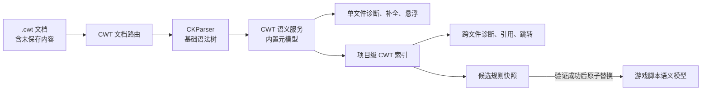

# CWT Language Support Engineering Handoff / CWT 语言支持工程执行交接

> - 状态：设计与执行交接稿
> - 面向对象：CWTools 核心库、F# Language Server、VS Code Extension 维护者
> - 目标：为 `.cwt` 规则文档提供独立、可靠、可测试的补全与验证能力
>
> 相关资料：[项目架构](../ARCHITECTURE.md)、[CWT 规则配置指南](cwt-rule-config.md)、[诊断码](diagnostic-codes.md)、[贡献指南](../CONTRIBUTING.md)

## 1. 执行摘要

当前项目已经能够读取 CWT 规则，并用这些规则验证和补全 Paradox 游戏脚本，但尚未把 CWT 本身作为一门独立的编辑器语言处理。

本项目需要新增一条独立的 CWT 文档管线：



最终实现必须满足以下原则：

- CWT 文档不能继续依赖普通游戏脚本的 `game.Complete`/`game.ValidateFile` 路径。
- 基础语法诊断应在没有 vanilla 数据、没有完整游戏模型时仍然可用。
- CWT 的语言定义必须来自稳定的内置元模型，不能使用正在编辑的规则自我验证。
- 本地诊断应快速响应；跨文件诊断应使用版本化、可取消、确定性排序的项目快照。
- 编辑活动规则时，只有完整候选规则集验证成功后才能替换当前规则；失败时保留最后一份有效快照。
- 所有文件路径、`## inject` 目标和配置根目录都按不可信输入处理，并执行工作区/规则根目录边界检查。

## 2. 目标与非目标

### 2.1 目标

首个完整版本应支持：

- 独立的 `cwt` VS Code language id。
- `.cwt` 基础语法诊断。
- CWT 根块、指令、字段表达式、布尔值和已知引用的上下文补全。
- CWT 结构与字段表达式的语义验证。
- type、subtype、enum、value、alias、scope、scope group、link 的项目级索引。
- 未定义引用、重复定义、非法指令值和非法注入路径诊断。
- 悬浮说明、跳转定义和查找引用。
- 纯规则仓库中的轻量启动，不要求存在游戏安装或 vanilla 缓存。
- 在游戏/mod 工作区中读取当前游戏 profile，提供游戏相关 scope 和元数据补全。
- 安全、原子的活动规则重载。

### 2.2 首版非目标

以下内容不应阻塞首版：

- 自动重写或格式化整份 CWT 文件。
- 自动推断规则是否准确描述了游戏运行时行为。
- 根据 vanilla 数据自动生成 CWT 规则。
- 在首版中覆盖所有历史或实验性 CWT 方言。
- 为 CWT 建立新的 Webview 编辑器。
- 复制一份 TypeScript CWT 解析器。

### 2.3 完成定义

满足以下条件才可认为功能完成：

1. 在仅含 `config/**/*.cwt` 的仓库打开 CWT 文件，可以在不加载 vanilla 模型的情况下得到语法诊断和基础补全。
2. 在已识别游戏的工作区，scope、type、enum 等补全使用正确的游戏上下文。
3. 未保存的文档内容优先于磁盘内容参与诊断、补全和项目索引。
4. 快速连续编辑不会发布旧版本诊断，也不会让旧索引覆盖新索引。
5. 一个损坏的 CWT 文件不会清空当前可用的游戏规则模型。
6. `.txt/.gui/.gfx/.asset` 的既有补全和诊断行为无回归。
7. 新增用户可见文本同时维护英文和中文。

## 3. 当前实现基线

### 3.1 已有能力

| 能力 | 当前入口 | 可复用部分 | 当前缺口 |
| --- | --- | --- | --- |
| CWT 基础解析 | [`CKParser.parseString`](../submodules/cwtools/CWTools/Parser/CKParser.fs) | token、括号、赋值、注释、位置 | 没有 CWT 专用恢复策略和诊断分类 |
| CWT 规则转换 | [`RulesParser.parseConfigWithMetadata`](../submodules/cwtools/CWTools/Rules/RulesParser.fs) | rules/types/enums/values/metadata 模型 | 失败只写日志；部分非法输入使用异常；缺少结构化诊断 |
| 普通文档语法诊断 | [`Program.lint`](../src/Main/Program.fs) | 文档版本、诊断合并、过期结果抑制 | CWT 与普通游戏脚本共用入口，语义验证不正确 |
| 游戏脚本补全 | [`completionCallLSP`](../src/Main/Completion.fs) | LSP CompletionItem 转换、范围处理、缓存 | 无 CWT 上下文分支，当前直接调用 `game.Complete` |
| 游戏脚本规则服务 | [`CompletionService`](../submodules/cwtools/CWTools/Rules/CompletionService.fs) | CWT 驱动的游戏脚本补全 | 服务目标是游戏 AST，不是 CWT AST |
| 规则加载 | [`RulesManager.loadBaseConfig`](../submodules/cwtools/CWTools/Game/RulesManager.fs) | 多文件规则合并、游戏 profile scope | 没有候选快照验证与 last-known-good 切换协议 |
| VS Code 文档选择 | [`languageSelectors.ts`](../client/extension/languageSelectors.ts) | 集中生成 language client selector | 没有独立 `cwt` id |
| 扩展启动 | [`maybeStartForEditor`](../client/extension/extension.ts) | 懒启动和游戏选择 | 当前明确忽略 `.cwt`，纯规则仓库不会因此启动 LSP |
| 规则作者文档 | [`cwt-rule-config.md`](cwt-rule-config.md) | 语法、字段表达式、根块、游戏差异 | 不是可执行的语言元模型 |

### 3.2 需要保持的现有行为

- `RulesParser.parseConfig` 和 `parseConfigs` 的公开行为不能因增加编辑器诊断而破坏。
- 游戏脚本继续由现有 `RuleValidationService`、`InfoService` 和 `CompletionService` 处理。
- `Program.fs` 中已有的诊断 freshness、document version 和 model epoch 机制必须继续生效。
- 既有 completion 锁等待、超时回退和缓存策略不能被 CWT 路径绕过。
- CWT 修改导致游戏规则刷新时，必须保留取消、超时、日志和错误上报能力。
- 子模块变更与根仓库变更必须分别提交。

### 3.3 已知技术债

- `RulesParser` 中存在 `failwith`/`failwithf` 输入路径，例如非法 severity 和 subtype。编辑器输入属于不可信且经常不完整的内容，不能让这些异常越过语言服务边界。
- `parseConfigWithMetadata` 在解析失败时返回空模型，调用方无法区分“合法空文件”和“解析失败”。
- `.cwt` 当前同时列入多个游戏 language definition，文件语言归属不够明确。
- 纯 CWT 仓库与游戏/mod 工作区的启动需求不同，不能只复用当前重型游戏初始化。
- 跨文件规则一致性检查目前主要通过日志暴露，缺少稳定诊断码、位置和 related information。

## 4. 核心设计决策

### 4.1 使用独立 `cwt` language id

新增 `cwt` language id，并让 `.cwt` 只由该语言声明。不要再通过 `stellaris`、`hoi4`、`paradox` 等文档 language id 判断 CWT 所属游戏。

游戏上下文按以下优先级解析：

1. 工作区已保存/已确认的游戏 profile。
2. 当前规则根目录对应的配置设置。
3. 规则仓库中的明确元数据；只有存在稳定格式时才使用。
4. 无法确定时使用 neutral CWT profile，只启用共享语义。

不得根据单个文件名（例如 `effects.cwt`）猜测具体游戏。

### 4.2 新建 CWT 语义服务，不复用 `game.Complete`

推荐分层：

- `CWTools` 子模块：CWT 语法到语义模型、元模型、单文件分析、项目符号定义。
- `src/Main`：文档存储适配、项目索引生命周期、LSP Completion/Diagnostic/Hover/Definition 转换。
- `client/extension`：language id、selector、启动模式、配置和用户提示。

不要在 Extension Host 中重新实现 CWT parser，也不要把 `RulesParser.fs` 中的私有处理逻辑复制到 `src/Main`。

### 4.3 使用内置、版本化的 CWT 元模型

CWT 语言服务需要一份描述 CWT 本身的稳定元模型，包括：

- 合法根块及其子项。
- 指令名称、允许位置、值类型和基数。
- 字段表达式的语法族与参数。
- 可引用符号种类及命名空间。
- 共享、Legacy、Jomini 和游戏特定能力标签。

建议先用 F# 判别联合与只读表表达，不要首版就用另一份 CWT 文件描述 CWT。这样可以避免 bootstrap 失败导致语言服务整体不可用。

元模型应有显式 schema version，但不要复制产品版本号。

### 4.4 局部分析与全局分析分离

局部分析必须只依赖当前文档文本和内置元模型，可在每次编辑后快速执行：

- parser 错误；
- 当前节点结构；
- 指令名称和值；
- 字段表达式语法；
- 当前文件内重复定义。

全局分析使用项目快照并允许 debounce：

- 未定义 type/enum/value/alias/scope；
- 跨文件重复定义；
- inject 目标和循环；
- scope 继承循环；
- profile 相关元数据缺失；
- 项目级定义、引用与补全。

局部诊断不能等待全局索引完成；全局索引 pending 时保留仍然有效的局部诊断。

### 4.5 使用不可变、版本化项目快照

建议模型：

```fsharp
type CwtSnapshotVersion = int64

type CwtProjectSnapshot =
    { version: CwtSnapshotVersion
      profileId: string option
      documents: Map<string, CwtDocumentModel>
      symbols: CwtSymbolIndex
      diagnosticsByFile: Map<string, CwtDiagnostic list>
      createdAt: DateTimeOffset }
```

要求：

- 文档内容优先级为 open document overlay > 磁盘。
- 文件路径先规范化，再使用平台正确的大小写比较。
- 文件枚举和输出排序必须确定性。
- 重建任务携带输入版本；完成时只有仍为最新版本才能发布。
- 索引缓存必须有边界，不能无限保存历史快照或文档模型。
- 删除、重命名和配置根变化必须使受影响的引用诊断失效。

### 4.6 活动规则采用 last-known-good

规则编辑与游戏语义模型切换应采用两阶段流程：

1. 从当前文档 overlay 和磁盘构建候选 CWT 项目快照。
2. 执行 parser、CWT 语义和规则一致性检查。
3. 若存在阻止加载的错误，发布诊断但不替换活动规则。
4. 若候选有效，在写锁内原子替换规则模型并增加 rules/model epoch。
5. 只重验证实际受规则变化影响的游戏脚本；无法安全缩小时再退化为全量刷新。

必须区分：

- `CWT 文件可以被编辑器解析`；
- `CWT 项目可以生成可用规则模型`；
- `新规则模型已成为活动模型`。

这三个状态不能合并成一个布尔值。

## 5. 建议的领域模型与接口

以下类型用于明确边界，具体命名可按现有 F# 风格调整。

```fsharp
type CwtDiagnosticPhase =
    | Syntax
    | Structure
    | Expression
    | Project
    | Activation

type CwtDiagnostic =
    { code: string
      severity: Severity
      messageKey: string
      messageArgs: string list
      range: range
      phase: CwtDiagnosticPhase
      related: (string * range) list }

type CwtSymbolKind =
    | Type
    | Subtype
    | Enum
    | ComplexEnum
    | ValueSet
    | Alias
    | SingleAlias
    | Scope
    | ScopeGroup
    | Link
    | ModifierCategory

type CwtCompletionRequest =
    { filePath: string
      text: string
      position: pos
      documentVersion: int option
      profileId: string option
      snapshot: CwtProjectSnapshot option }

type CwtAnalysisResult =
    { document: CwtDocumentModel option
      diagnostics: CwtDiagnostic list
      canContributeToProjectIndex: bool
      canActivateRules: bool }
```

建议服务接口：

```fsharp
type ICwtLanguageService =
    abstract AnalyzeDocument: filePath:string * text:string -> CwtAnalysisResult
    abstract Complete: CwtCompletionRequest -> CwtCompletionItem list
    abstract Hover: filePath:string * text:string * position:pos * CwtProjectSnapshot option -> CwtHover option
    abstract Definition: filePath:string * text:string * position:pos * CwtProjectSnapshot -> range list
    abstract References: filePath:string * text:string * position:pos * CwtProjectSnapshot -> range list
    abstract BuildSnapshot: CwtSnapshotInput * CancellationToken -> CwtProjectSnapshot
```

边界要求：

- 服务返回领域类型，不直接依赖 LSP JSON 类型。
- LSP 转换只放在 `src/Main`。
- `AnalyzeDocument` 不抛出由用户文本触发的异常。
- message 使用稳定 key；最终英文/中文文本在现有服务端本地化边界生成。
- completion 和 diagnostics 的输入必须显式携带文档版本或快照版本。

## 6. 诊断设计

### 6.1 诊断码范围

建议为 CWT 使用独立前缀，避免与游戏脚本 `CW001` 等诊断混淆：

| 范围 | 用途 | 示例 |
| --- | --- | --- |
| `CWT001`–`CWT099` | parser/结构恢复 | 缺少 `}`、意外 token |
| `CWT100`–`CWT199` | 根块和指令 | 未知根块、非法 `## cardinality` |
| `CWT200`–`CWT299` | 字段表达式 | 未知 expression、非法参数范围 |
| `CWT300`–`CWT399` | 项目符号和引用 | 未定义 enum/type/alias、重复定义 |
| `CWT400`–`CWT499` | 跨文件一致性 | inject 循环、scope 继承循环 |
| `CWT900`–`CWT999` | 激活和降级 | 候选规则被拒绝、继续使用旧快照 |

诊断码在发布前写入 [`diagnostic-codes.md`](diagnostic-codes.md)，并保持稳定。

### 6.2 严重级别

- Error：无法解析、会产生歧义模型、引用目标必须存在、候选规则不可安全激活。
- Warning：可解析但高度可疑，例如 profile 不支持的构造、重复但有明确覆盖策略。
- Information：兼容性建议、可替代写法、全局索引暂不可用。
- Hint：废弃表达式或可简化写法；应使用 `DiagnosticTagDeprecated`/`Unnecessary` 时沿用现有转换。

### 6.3 编辑中恢复策略

- 不完整的当前行不应产生大量级联错误。
- parser 失败时尽可能保留已闭合顶层块的模型，用于补全和局部诊断。
- 一个引用的根因只产生一条主要诊断；相关定义通过 related information 展示。
- 全局索引未完成时，不发布“未定义”这类负向结论。
- 文档版本变化后不得发布旧版本诊断。

### 6.4 必须覆盖的验证规则

第一阶段：

- 括号、赋值、字符串和注释结构。
- 已知根块名称。
- 指令名称、允许位置和值形状。
- `type[...]`、`subtype[...]`、`alias[...]`、`enum[...]` 等声明形状。
- `int/float` 范围、`enum[...]`、`scope[...]`、`scope_group[...]`、`<type>`、`prefix_field[...]` 等字段表达式。
- yes/no 字段和 cardinality。

第二阶段：

- 引用目标存在性和类型匹配。
- 重复 symbol 与命名空间冲突。
- subtype 的父 type 存在。
- `## inject` 目标、节点路径和循环。
- scope alias/继承/group/link 引用。
- type/enum/value/alias 间的跨文件引用。
- 规则一致性检查返回文件和范围，而不是只写日志。

## 7. 补全、悬浮与导航

### 7.1 补全上下文矩阵

| 光标上下文 | 候选来源 | 示例 |
| --- | --- | --- |
| 文件根部 | 内置根块元模型 | `types`, `enums`, `scopes`, `links` |
| 注释指令名 | 当前节点允许的指令 | `## cardinality`, `## push_scope` |
| 指令值 | 指令值类型 + 项目索引 | scope、severity、路径 |
| 声明方括号内 | 对应命名空间 | `type[...]`, `enum[...]`, `alias[...]` |
| 字段左侧 | CWT expression/声明模式 | `alias_name[...]`, `<type>` |
| 字段右侧 | 字段表达式和固定值 | `bool`, `int[...]`, `localisation` |
| scope 位置 | profile scope + 项目 scopes | `country`, `planet`, `any` |
| inject 路径 | 受限规则根文件索引 | `common/foo.cwt@type/path` |

候选必须：

- 使用当前未保存文档和最新可用快照。
- 稳定排序：精确上下文优先，再按 label 的确定性顺序。
- 去重时保留更具体的文档和来源。
- 明确标记 Shared/Legacy/Jomini/Game-specific/Advanced。
- 在快照过期或锁竞争时返回局部候选，而不是阻塞编辑器。

### 7.2 悬浮

悬浮内容应来自内置元模型和项目符号：

- 语法与用途摘要。
- 允许位置与参数。
- 支持标签。
- 定义位置和引用种类。
- 对 type/enum/scope 等显示当前项目定义摘要。

不要在代码和悬浮文案中复制长篇 CWT 指南；元模型保存短说明，详细内容链接到 [`cwt-rule-config.md`](cwt-rule-config.md)。

### 7.3 跳转与引用

- declaration token 的范围应只覆盖名称，不覆盖整行或整个块。
- 多定义时返回所有位置，并稳定排序。
- `## inject` 同时支持文件跳转和 `@path` 目标跳转。
- 查找引用必须区分同名但不同命名空间的 symbol。
- 找不到精确语义引用时不要静默退化为全工作区文本搜索并声称结果完整。

## 8. 启动与运行模式

### 8.1 Full game mode

适用于已识别游戏或 mod 工作区：

- 使用 active game profile。
- CWT 服务可以读取游戏提供的 scope、generated metadata 和规则根。
- 游戏脚本服务与 CWT 服务共享只读的 profile 数据，但不共享可变文档状态。
- CWT 候选快照可进入安全激活流程。

### 8.2 CWT-only mode

适用于规则仓库或单独打开的 CWT 文件：

- 启动 F# server，但不构建完整 vanilla/game model。
- 提供 parser、内置元模型、工作区 CWT 索引和共享补全。
- profile 未知时不产生 game-specific 的“未定义”错误。
- 后续打开游戏脚本或用户选择游戏后，可以升级为 full game mode；升级过程不得启动第二个竞争的 server 进程。

### 8.3 工作区识别

`.cwt` 文件本身仍不应被视为某个具体游戏的证据，但可以作为启动 CWT-only mode 的证据。

建议识别：

- `config/**/*.cwt`；
- 已配置的 rules folder；
- `.cwtools/<game>/config/**/*.cwt`；
- 用户直接打开的任意 `.cwt` 文件。

游戏识别仍使用现有 game profile、descriptor、游戏目录和用户选择逻辑。

## 9. 分阶段工程计划

### Phase 0：契约、样例语料与基线

目标：在改动主路径前固定语义边界和性能基线。

任务：

- 从 `submodules/cwtools-stellaris-config/config/` 选取代表性规则样例。
- 增加最小 golden corpus，覆盖 shared、Legacy、Jomini、注入、字段表达式和错误恢复。
- 定义 `CwtDiagnostic`、symbol namespace、snapshot version 和 completion context。
- 记录典型小文件、大文件和规则仓库的 parse/index/completion 基线。
- 明确哪些 parser 错误阻止索引，哪些只阻止规则激活。

交付物：

- 领域类型和契约测试。
- 语料目录及 README，说明每个 fixture 的目的。
- 性能基线记录，不设拍脑袋阈值。

验收：

- 每类关键 CWT 构造至少有一份合法和一份非法样例。
- 测试不依赖本机游戏安装。

### Phase 1：独立语言与基础诊断

目标：纯 CWT 仓库可获得可靠语法诊断。

任务：

- 在 `release/package.json` 增加 `cwt` language definition。
- 从各游戏 language definition 中移除 `.cwt` 的直接归属，验证打包后关联唯一。
- 在 `languageSelectors.ts` 加入 `cwt`。
- 调整懒启动：`.cwt` 启动 CWT-only mode，不触发游戏猜测。
- 在 server 中按扩展名/文档类型路由 CWT 文档。
- 将 `CKParser` 失败和结构恢复结果映射为 `CWT0xx`。
- 在 didOpen/didChange/didSave/close 中维护文档 overlay 和版本。

主要文件：

- `release/package.json`
- `client/extension/languageSelectors.ts`
- `client/extension/extension.ts`
- `src/Main/Main.fsproj`
- `src/Main/Program.fs`
- 新增 `src/Main/CwtLanguageFeatures.fs` 或等价适配器

测试：

- 更新 `client/test/unit/languageSelectors.test.ts`。
- 把 CWT 启动判定提取为纯函数并增加单元测试。
- 新增 F# parser/diagnostic regression script。
- 增加一个不含 vanilla 的 Extension Host CWT smoke test。

验收：

- 打开合法 CWT 无错误。
- 缺失右括号显示精确范围诊断，修复后诊断消失。
- 连续编辑不会出现旧诊断回写。
- 只打开 CWT 不加载重型游戏模型。

### Phase 2：单文件语义与补全

目标：提供可日常使用的 CWT 编写体验。

任务：

- 在 CWTools 子模块增加 CWT 元模型和单文件语义服务。
- 为 `RulesParser` 增加诊断丰富的 API；保留旧 API 兼容。
- 将用户输入触发的 `failwith` 转换为结构化诊断或受控错误。
- 实现根块、指令、字段表达式和本文件 symbol 补全。
- 增加短悬浮说明。
- 在 `Completion.fs` 中给 `.cwt` 增加专用路由，不进入 `game.Complete`。

建议子模块文件：

- 新增 `CWTools/Rules/CwtLanguageTypes.fs`
- 新增 `CWTools/Rules/CwtLanguageSchema.fs`
- 新增 `CWTools/Rules/CwtLanguageService.fs`
- 修改 `CWTools/Rules/RulesParser.fs`
- 修改 `CWTools/CWTools.fsproj` 编译顺序

测试：

- 合法/非法 expression 表驱动测试。
- 指令合法位置和非法位置测试。
- 不完整当前行补全测试。
- parser recovery 后仍能返回根块补全的测试。
- 所有测试同时覆盖文件名、范围和诊断码。

验收：

- 文档指南中主要共享字段表达式均有补全和验证。
- completion 不调用或等待完整 game model。
- 用户输入不能让服务崩溃或产生未处理异常。

### Phase 3：项目索引与跨文件语义

目标：完成 type/enum/alias/scope 等项目级能力。

任务：

- 解析配置根下的 CWT 文件，建立不可变 symbol index。
- 将 open document overlay 合并到磁盘快照。
- 实现增量失效：create/change/delete/rename/config root change。
- 实现跨文件补全、未定义引用、重复定义、循环检测。
- 为 `## inject` 实现受限路径解析、路径补全和目标节点解析。
- 增加 definition/references/document symbols/workspace symbols。
- 为索引设置最大文件数、最大单文件大小和历史快照边界；超限时显式报告 partial 状态。

安全要求：

- inject 路径 resolve 后必须仍位于允许的规则根内。
- 不跟随会逃逸规则根的符号链接或相对路径。
- 文件扫描忽略 `.git`、`node_modules`、构建输出和无关缓存目录。
- 并发读取有上限，结果按规范化相对路径排序。

测试：

- overlay 胜过磁盘。
- 删除定义后引用诊断更新。
- 重命名文件后 inject 引用更新。
- Windows 大小写与 Unix 大小写行为。
- inject traversal、绝对路径、符号链接逃逸。
- 两次索引重建乱序完成时只接受新版本。

验收：

- 纯规则仓库可以完成跨文件 type/enum/scope 补全和跳转。
- 全局索引 pending 时不发布虚假的未定义诊断。
- 文件枚举顺序变化不影响结果或快照 hash。

### Phase 4：候选规则激活

目标：编辑活动 CWT 规则时安全更新游戏脚本语义。

任务：

- 引入 candidate/active snapshot 状态。
- 把规则一致性日志转换为结构化结果。
- 定义阻止激活的诊断集合。
- 在 game state 写锁内执行最小原子交换。
- 增加 rules generation/content hash/model epoch。
- 根据变化的 symbol/rule 域确定重验证范围。
- 激活失败时发布 `CWT9xx` 并继续使用 last-known-good。
- 提供手动“重新加载规则”作为故障恢复，但不依赖手动命令维持正常行为。

测试：

- 合法规则编辑成功激活并改变游戏脚本补全。
- 非法规则编辑不改变活动补全/诊断模型。
- 修复非法规则后能够从旧快照升级。
- 激活期间 completion 走已有超时/回退策略。
- 取消、关闭工作区和 server shutdown 不泄漏任务或锁。

验收：

- 无中间空规则窗口。
- 无旧候选覆盖新候选。
- 失败信息含目标文件、规则 generation 和可操作原因。

### Phase 5：产品化与发布

任务：

- 更新 README 英文/中文功能说明。
- 更新 CWT 指南，加入编辑器能力和诊断码链接。
- 更新 `diagnostic-codes.md` 英文/中文。
- 为新增设置、命令、提示和诊断消息同步英文/中文 catalog。
- 验证 VSIX 中 language contribution、grammar/configuration path 和 server 文件完整。
- 在 changelog/release 文档中说明 CWT-only 与 full game mode 的差异。

验收：

- 新用户在规则仓库打开 `.cwt` 即可使用，无额外手工 file association。
- 安装包内行为与开发环境一致。
- 文档没有复制固定版本号。

## 10. 文件级改动清单

| 区域 | 文件 | 预期改动 |
| --- | --- | --- |
| Manifest | `release/package.json` | 独立 `cwt` language；移除多重 `.cwt` 归属；需要时增加 activation event |
| Language selector | `client/extension/languageSelectors.ts` | language client selector 加入 `cwt`；明确 semantic token 策略 |
| Profile | `client/extension/gameProfiles.ts` | 保留“规则文件属于 profile 的资源类型”，但不要把 CWT 文档 language id 当作游戏 id |
| Startup | `client/extension/extension.ts` | `.cwt` 启动 CWT-only；支持升级 full game；新增可测试判定函数 |
| Server build | `src/Main/Main.fsproj` | 按 F# 编译顺序加入 CWT adapter/index 文件 |
| LSP routing | `src/Main/Program.fs` | CWT lint、didOpen/change/save/close、hover/definition/reference 路由 |
| Completion | `src/Main/Completion.fs` | `.cwt` 专用 completion；复用 LSP item/range 转换 |
| CWT adapter | 新增 `src/Main/CwtLanguageFeatures.fs` | 文档 overlay、snapshot lifecycle、LSP/领域类型转换 |
| Core types | 新增 `submodules/cwtools/CWTools/Rules/CwtLanguageTypes.fs` | 诊断、symbol、document model、schema 类型 |
| Meta schema | 新增 `submodules/cwtools/CWTools/Rules/CwtLanguageSchema.fs` | 稳定、版本化的 CWT 元模型 |
| Core service | 新增 `submodules/cwtools/CWTools/Rules/CwtLanguageService.fs` | 分析、补全、hover、symbol/reference extraction |
| Parser bridge | `submodules/cwtools/CWTools/Rules/RulesParser.fs` | detailed API；把输入异常转换为诊断；保留兼容入口 |
| Core project | `submodules/cwtools/CWTools/CWTools.fsproj` | 新文件编译顺序 |
| Diagnostics docs | `docs/diagnostic-codes.md` | CWT 诊断码英文/中文 |
| Authoring docs | `docs/cwt-rule-config.md` | 编辑器能力、限制、故障排查英文/中文 |
| Architecture | `ARCHITECTURE.md` | CWT-only 服务和候选规则激活边界英文/中文 |

## 11. 测试计划

### 11.1 单元测试

必须覆盖：

- 元模型表的唯一性与完整性。
- 所有字段表达式 parser。
- 指令位置和值。
- range 与 token span。
- symbol namespace 与重复定义。
- completion 上下文分类。
- snapshot merge、排序、版本和 hash。
- 路径 containment 与 inject 解析。
- last-known-good 状态机。

### 11.2 回归脚本

建议增加：

- `src/Main/CwtLanguageService.Tests.fsx`
- `src/Main/CwtProjectIndex.Tests.fsx`
- `src/Main/CwtActivation.Tests.fsx`

每个脚本从自身目录运行，引用已构建的 `CWTools.dll` 和 server assembly。测试失败应给出 fixture、期望诊断码和实际范围。

### 11.3 TypeScript 测试

- 扩展 `client/test/unit/languageSelectors.test.ts`。
- 为启动模式判定增加纯函数测试。
- 为 profile 与 CWT language id 分离增加测试。
- 验证 `.cwt` 不再被工作区 association 重写成某个游戏 language id。

### 11.4 Extension Host 集成测试

至少覆盖两个 fixture：

1. `cwt-only-workspace`：只有 `config/*.cwt`，没有 descriptor 和 vanilla。
2. `cwt-game-workspace`：有游戏 profile 和最小规则/脚本 fixture。

测试操作：

- open -> diagnostics；
- change -> versioned diagnostics；
- completion；
- save -> project index update；
- create/delete/rename -> cross-file diagnostics；
- invalid candidate -> active rules unchanged；
- repair -> activation succeeds。

### 11.5 性能与并发

先记录基线，再设 CI 阈值。至少测量：

- 单文件 parse/局部分析 p50/p95。
- completion 在无快照、有效快照和快照重建期间的延迟。
- 典型和大型规则仓库的全量索引时间与内存。
- 单文件编辑的增量重建范围。
- 快速连续 50 次 didChange 后发布次数和最终版本。
- game state 写锁竞争期间的 completion 回退。

性能测试不得依赖目录枚举顺序或本机 vanilla 安装。

## 12. 验证命令

按改动范围运行最窄的有效检查；失败后只重跑受影响项。

CWTools 子模块：

```powershell
dotnet build submodules/cwtools/CWTools/
```

F# server：

```powershell
dotnet build src/LSP/
dotnet build src/Main/
dotnet fsi CwtLanguageService.Tests.fsx
dotnet fsi CwtProjectIndex.Tests.fsx
dotnet fsi CwtActivation.Tests.fsx
```

`dotnet fsi` 应从对应脚本目录执行。

Extension Host：

```powershell
npm run compile
npm run typecheck:test
npm run test:unit
```

涉及 LSP/VS Code 集成后：

```powershell
npm test
```

涉及公开文档和打包后：

```powershell
npm run build:docs
npm run check:release -- --skip-compile --skip-test
```

发布前：

```powershell
npm run verify
```

## 13. 风险与缓解

| 风险 | 影响 | 缓解措施 |
| --- | --- | --- |
| 自我验证循环 | 损坏的规则导致 CWT 服务也失效 | 使用内置元模型；活动规则只作为被分析数据 |
| parser 在不完整输入上抛异常 | server 请求失败或进程崩溃 | detailed API 捕获并转换用户输入错误；边界 fuzz tests |
| CWT-only 仍触发重型加载 | 规则作者启动缓慢、无 vanilla 时功能不可用 | 独立启动模式；延迟构建 game model |
| 全局负向诊断过早 | 编辑时大量虚假“未定义” | snapshot ready 前只发布局部结论 |
| 旧异步结果覆盖新结果 | 诊断和补全闪回 | document version + snapshot version + current check |
| 活动规则被半成品替换 | 所有游戏脚本诊断/补全失真 | candidate/active 双快照和 last-known-good |
| `.cwt` 多语言关联 | selector 和 profile 推断不稳定 | 独立 `cwt` id，游戏上下文另行解析 |
| inject 路径逃逸 | 读取规则根外文件 | 规范化、real path/containment、允许根白名单 |
| 索引无界增长 | 大规则仓库内存持续上升 | 文件/大小/并发/历史快照上限，partial 状态 |
| 子模块与根仓库不同步 | 根仓库引用不可构建的 CWTools API | 子模块先提交推送，再更新根指针；CI 固定验证 |

## 14. 提交与交付顺序

推荐按可审查的垂直切片提交，避免一个提交同时包含 parser 重构、LSP 路由和 manifest 大改。

1. 根仓库：fixture、契约和测试骨架，不改变行为。
2. CWTools 子模块：领域类型、元模型、detailed parser API、单文件服务和测试。
3. CWTools 子模块：提交并推送。
4. 根仓库：更新子模块指针，加入 server adapter、CWT-only 路由和测试。
5. 根仓库：独立 language id、Extension Host 启动与 selector。
6. 根仓库/子模块：项目索引和导航能力。
7. 根仓库/子模块：candidate activation 与 last-known-good。
8. 根仓库：英文/中文文档、诊断码和发布说明。

每个 PR 描述应明确：

- 所处 Phase 和不包含的后续范围。
- 是否改变公开诊断码或 language association。
- 是否包含子模块提交和对应 commit。
- 运行了哪些检查，哪些因环境限制未运行。
- 是否需要迁移 workspace file association。

## 15. Code Review 检查表

### 正确性

- [ ] `.cwt` 请求不会进入普通 `game.Complete`/`ValidateFile`。
- [ ] 用户文本不会触发未处理异常。
- [ ] 未保存 overlay 参与所有相关查询。
- [ ] 诊断、补全和索引结果绑定正确版本。
- [ ] 全局 negative diagnostics 只在完整快照上发布。
- [ ] 多定义和多引用结果稳定排序。

### 并发与生命周期

- [ ] 重建可取消，dispose/shutdown 会停止后台任务。
- [ ] 同时最多一个 snapshot build 结果可提交。
- [ ] CWT 分支没有绕过现有 game state 锁策略。
- [ ] 缓存有界，旧快照不会无限保留。
- [ ] watcher create/change/delete/rename 都有覆盖。

### 安全

- [ ] 文件、路径、指令值和 LSP 参数均在边界验证。
- [ ] inject 不能逃逸允许规则根。
- [ ] 不跟随未验证的外部文件或网络资源。
- [ ] 错误日志包含操作与目标，但不泄露无关绝对路径或内容。

### 产品体验

- [ ] CWT-only 不要求 vanilla。
- [ ] 英文/中文用户可见文本同步。
- [ ] 修复错误后诊断及时清除。
- [ ] snapshot pending/partial/failed 状态不会被伪装成完整结果。
- [ ] 打包后的 language association 与开发环境一致。

## 16. 开始实施前的最终确认

以下决策已在本文中给出推荐默认值，实施者只有在发现代码事实冲突时才需要重新提案：

| 问题 | 默认决策 |
| --- | --- |
| CWT 是否使用独立 language id | 是，使用 `cwt` |
| CWT 是否通过游戏脚本规则自我验证 | 否，使用内置元模型 |
| 核心语义服务放在哪里 | CWTools 子模块；LSP 转换放 `src/Main` |
| 纯规则仓库是否启动完整游戏模型 | 否，使用 CWT-only mode |
| 项目索引是否包含未保存内容 | 是，overlay 优先 |
| 全局索引未就绪时是否报告未定义 | 否 |
| 非法候选规则是否替换活动规则 | 否，保留 last-known-good |
| 首版是否实现自动格式化 | 否 |

第一位实施者应从 Phase 0 和 Phase 1 开始，不要先修改 `CompletionService.fs`。在独立文档路由、诊断版本和 CWT-only 生命周期稳定之前，直接扩展游戏脚本补全服务会把两种语义模型继续耦合在一起。
