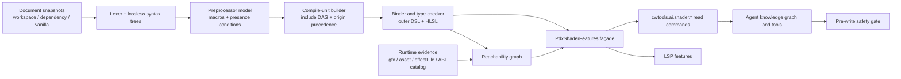

# Paradox Shader 完整语言支持与 Agent 知识架构改造方案

> 状态：功能改造已完成；待按子模块边界提交（VS Code Extension Host 测试执行由用户豁免）
> 适用范围：Stellaris / Paradox Shader（`.shader`、`.fxh`）
> 基线游戏：Stellaris 4.4.6
> 基线样本：`C:\Program Files (x86)\Steam\steamapps\common\Stellaris\gfx\FX`
> 目标：将当前基于文本提取和局部规则的支持，迁移为可增量、可解释、可验证的完整语言服务，并让内置 Agent 具备安全修改 Shader 所需的项目语义与运行时知识。

## 1. 决策摘要

Paradox Shader 不是一种独立的通用着色语言。它最接近：

- 以 Paradox 自定义声明 DSL 作为外层容器；
- 以内嵌 HLSL/Cg 方言作为函数体和表达式语言；
- 以自定义 `@/#` 预处理、平台宏、Include 和引擎注入符号组成构建环境；
- 以 `Effect`、`MainCode`、渲染状态和顶点布局作为引擎 ABI（Application Binary Interface）；
- 以 `.gfx/.asset` 数据调用、`effectFile` 约定调用和 EXE 硬编码调用共同决定运行时可达性。

因此，不能继续把它实现成“若干正则表达式加一个 HLSL TextMate 注入”。目标实现必须同时建立五层模型：

1. 无损语法树：外层 DSL、预处理指令、内嵌及独立 `.fxh` HLSL；
2. 编译单元：根 `.shader`、传递 Include、加载顺序和平台变体；
3. 语义系统：作用域、类型、重载、阶段、资源绑定和状态引用；
4. 运行时入口：显式数据调用、`effectFile` 约定、版本化 EXE ABI；
5. Agent 知识图谱：带来源、置信度、版本和有效覆盖状态的可查询事实。

改造后的实现已经删除旧全局符号池和正则语义路径，以统一无损前端、编译单元、HLSL binder、运行时/renderer 图和版本化 ABI 数据作为唯一语义来源。LSP、项目知识、内置 Agent、shared/MCP 与写前安全门均消费同一结构化模型；按本计划的功能范围，代码与文档改造已经完成。当前只保留两个交付态事项：按仓库所有权边界创建可独立回滚的提交，以及按用户决定不再执行的 VS Code Extension Host 测试；二者均不得被文档伪装为已发生。

## 2. 范围与非目标

### 2.1 必须完成

- `.shader` 外层 DSL 的词法、语法、恢复、节点范围和注释保留；
- `[[ ... ]]` 内嵌 HLSL/Cg 与独立 `.fxh` 文件的统一前端；
- `@/#` 指令、宏、条件表达式、平台变体和 presence condition；
- 根文件到传递 Include 的编译单元与符号可见性；
- HLSL 名称绑定、基础类型系统、函数重载和阶段约束；
- `Effect`、`MainCode`、结构体、ConstantBuffer、Sampler、渲染状态之间的引用关系；
- `.gfx/.asset` 显式调用、`effectFile` 约定调用与 EXE 硬编码入口分类；
- `interface/*.gfx` 中 UI 精灵声明通过 `effectFile` 应用 Shader 的专门调用模型；
- 完整且保守的 LSP 功能；
- Shader 专属 Agent 知识域、只读查询接口和修改前安全门；
- Vanilla、Mod、未保存编辑内容和多工作区环境中的增量更新；
- 有版本的 Vanilla/EXE ABI 数据、回归快照、性能预算和迁移开关。

### 2.2 明确不做

- 不尝试复刻 Stellaris EXE 内部完整 Shader 编译器或 GPU 驱动编译器；
- 不承诺静态推导所有引擎运行时注入值；未知内容必须被显式标注为 `engine-provided` 或 `unknown`；
- 不把“未找到文本调用”直接断言为“确认由 EXE 调用”；只能在版本化清单有证据时标记为 `engine_hardcoded`；
- 不允许 Agent 因静态告警自动删除、重命名或替换疑似硬编码入口；
- 不以调用外部 `dxc/fxc` 作为基础正确性的唯一来源；它们可作为可选交叉验证器；
- 不在本次改造中泛化成任意 Paradox 游戏均完全兼容。跨游戏复用前端，但每个游戏必须有独立 profile、宏和 ABI 数据。

## 3. 术语与不可破坏的规则

| 术语 | 定义 |
| --- | --- |
| Root Shader | 作为引擎加载入口的 `.shader` 文件。 |
| Include Unit | 由 `Include` 或预处理 include 引入的 `.shader/.fxh` 文件。 |
| Compile Unit | 一个 Root Shader、其传递 Include DAG、宏环境、平台和加载来源共同构成的分析上下文。 |
| Presence Condition | 符号或语句存在所需的布尔条件，而不是简单地把非当前分支删除。 |
| Effective Symbol | 按工作区、依赖、Vanilla 与 Include/加载顺序解析后，实际生效的符号。 |
| Engine Entry | EXE 通过固定名称或内部表调用的 Effect/函数/状态入口。 |
| Reachability | Effect 是否能由数据、文件约定或已知 Engine Entry 到达。 |
| Provenance | 事实的文件、范围、来源层、游戏版本、分析方式与置信度。 |

以下规则必须成为代码、诊断和 Agent 策略中的硬约束：

1. **Effect 名称可能是 ABI。** 未证明可安全重命名前，默认禁止重命名。
2. **新增 Effect 不等于会被执行。** 必须存在数据调用、`effectFile` 约定或已知引擎入口。
3. **UI 精灵选择的是 Shader 文件，不一定显式命名 Effect。** 引擎会按精灵/控件类型和状态选择文件内的约定入口，例如按钮的 `Up/Down/Over/Disable/Text*`；这些名称同样属于渲染器契约。
4. **文件可见性由编译单元决定。** 不相关文件中的同名声明不能满足当前文件引用。
5. **覆盖优先级必须可解释。** 工作区/Mod 对 Vanilla 的覆盖不能因枚举顺序被反转。
6. **条件声明不能被无条件合并。** 补全、定义和诊断必须携带平台/宏条件。
7. **未知不是错误。** 引擎注入、版本差异和动态选择无法证明时，输出带证据的 `unknown`，不得伪造确定性。
8. **编辑内容优先。** LSP 分析必须使用内存中的未保存文本，而不是重新读取磁盘旧内容。
9. **Agent 只消费结构化语义。** 不允许用全仓库文本搜索结果代替作用域、可达性或 ABI 判断。

## 4. 当前状态审计

### 4.1 已有能力

- VS Code 已注册 `.shader` 与 `.fxh` 为 `pdx-shader`；
- 已有 TextMate 着色、括号、折叠和基础 snippets/completion；
- 服务端会加载 Vanilla Shader；
- 已有文档符号、Include 文档链接；
- 已有 `CWFX001`–`CWFX004` 基础诊断；
- 已有 MainCode、ConstantBuffer、渲染状态和 Include 的部分 hover/definition；
- 已有 F# Shader 特性测试与语法配置测试，可作为迁移回归基础。

### 4.2 分项完成度估计

| 能力 | 当前估计 | 关键缺口 |
| --- | ---: | --- |
| 文件注册、着色、折叠 | 100% | `.shader/.fxh` 注册、TextMate、语义 token、折叠与选择范围均接通 |
| 外层 DSL 解析 | 100% | 无损容错 CST、trivia/source span、错误恢复与格式化共用同一前端 |
| 预处理与平台条件 | 100% | 对象/函数宏、递归预算、presence condition 与平台 variant 已建模 |
| HLSL 语法 | 100% | 内嵌 `[[...]]` 与 raw `.fxh` 共用容错 lexer/parser |
| HLSL 语义 | 100% | 词法 scope、类型、成员/swizzle、重载、调用边和阶段约束可用 |
| Include/编译单元 | 100% | root、传递 Include DAG、条件、显式 origin/load order、歧义/循环与硬预算完整 |
| 运行时调用模型 | 100% | data/effectFile/renderer contract/curated ABI/unknown 严格分层；4.4.6 ABI 候选审计已完成且无合格 EXE 证据，因此 catalog 保持 0 项 |
| CWT Shader 引用 | 100% | 5 个 `shader` 字段使用 `$shader_effect`，2 个 `effectFile` 使用受限 `.shader` filepath，并导出引用种类、字段路径与动态值政策 |
| Agent Shader 知识 | 100% | watcher、knowledge graph、七个只读工具和强制写前安全门已统一接入 |
| 回归与 Vanilla 基线 | 100% | 4.4.6 全量、真实 Mod fixtures、确定性 fuzz/property、性能预算和升级演练均有测试 |

### 4.3 原始审计确认的错误与迁移风险

本节保留立项时的错误描述，作为迁移验收依据；其中已修复或部分修复的状态统一记录在 4.5，不能据此误读为当前仍完全未实现。

#### P0：所有 Shader 被合并为全局符号池

`submodules/cwtools/CWTools/Game/PdxShaderFeatures.fs` 当前资源聚合路径会把 Mod 与 Vanilla Shader 全部合并。结果是：

- 未 Include 的文件也能“提供”符号；
- 无效引用被误判为有效；
- 补全泄漏无关符号；
- 同名符号的定义跳转不稳定；
- Agent 无法知道修改会影响哪些根编译单元。

这是语义架构错误，不应通过更多过滤正则修补。

#### P0：来源优先级可能反转

若以当前 `Seq.append` 管道顺序和 first-match 策略取定义，Vanilla 可能先于 Mod/当前文档命中，破坏覆盖语义。目标实现必须使用显式 `OriginRank` 与稳定排序，而不是依赖集合枚举顺序。

#### P0：Effect 运行时语义缺失

必须区分五种状态：

- `data_explicit`：在 `.gfx/.asset` 中以 `shader = EffectName` 明确调用；
- `effect_file_convention`：数据选择 `effectFile = "x.shader"`，内部入口按引擎约定使用；
- `effect_file_convention_candidate`：已选择 Shader 文件，但尚未证明该资源类型的渲染器会选择某个具体 Effect；
- `engine_hardcoded`：由版本化、人工校验的 ABI 清单确认；
- `engine_or_unreferenced`：仅因没有文本调用而推断，不能自动视为死代码或确认硬编码。

当前不存在该模型，Agent 因而可能给出危险建议。

#### P1：HLSL 被当作不透明文本

现有实现无法可靠处理局部作用域、表达式、类型、函数重载、结构体成员、语义标记、资源类型或阶段限制。正则抽取不具备演进为完整前端的结构，必须迁移到 lexer/parser/binder。

#### P1：Agent 知识管线排除 Shader

- `client/extension/ai/projectKnowledge.ts` 的扫描与 watcher 未完整纳入 `.shader/.fxh`；
- `client/extension/indexing/workspaceSymbolParser.ts` 主要索引 `.txt/.gfx/.asset/.gui`；
- `src/Main/ProjectKnowledge.fs` 主要从 `game.Types()` 和 `game.AllEntities()` 构建定义与拓扑，而 Shader 是资源，不会自然进入这些集合；
- `client/extension/ai/gameKnowledge.ts` 没有可依赖的权威 Shader 语义源；
- Stellaris CWT 粒子规则仍有 Shader keys TODO，Shader 字段多为普通 scalar，不能表达真实引用。

#### P1：其他技术债

- `.fxh` 未进入部分命令快照与目标扩展名归一化；
- Include basename fallback 会掩盖歧义；
- 动态路径中有磁盘重读，可能忽略未保存文本；
- Shader 解析缓存无界；
- 路径比较未始终遵循“仅 Windows 不区分大小写”；
- Vanilla 读取异常可能被静默吞掉；
- 全局补全被硬编码/挖掘符号污染；
- 结构体成员推导只覆盖少量精确类型名；
- 函数重载按名称折叠；
- 缺少 references、受限 rename、formatter、signature help、code action 等能力。

### 4.4 Vanilla 4.4.6 基线

原版 `gfx/FX` 当前样本：

| 项目 | 数量 |
| --- | ---: |
| 文件总数 | 72 |
| `.shader` | 49 |
| `.fxh` | 23 |
| Effect 声明 | 473 |
| Effect 唯一名称 | 438 |
| Vertex MainCode | 69（30 个唯一名称） |
| Pixel MainCode | 104（63 个唯一名称） |
| ConstantBuffer | 78（50 个唯一名称） |
| Blend/DepthStencil/Rasterizer state | 62 / 30 / 28 |
| Include 条目 | 122 |

当前提取器得到 69 个 vertex MainCode 声明（30 个唯一名称）、104 个 pixel MainCode 声明（63 个唯一名称）、78 个 ConstantBuffer 声明（50 个唯一名称）、62/30/28 个三类渲染状态声明和 96 个唯一 define。声明数与唯一名称数的差异仍需逐项分类为“有效多阶段/条件重复”“解析遗漏”或“语言构造未支持”，不能以调整快照掩盖。

数据调用基线：

- `.gfx` 中约 2,888 个 `shader =`，46 个唯一值，其中 45 个匹配 Effect；
- `.asset` 中约 6,657 个相关赋值，21 个唯一值，均匹配 Effect；
- 合并后约 54 个 Effect 由名称显式调用；
- interface `.gfx` 中的 `effectFile` 最终涉及 9 个唯一 Shader 文件，全部由版本化 renderer contract 覆盖；
- 现有声明可粗分为：54 个显式名称调用、42 个位于 `effectFile` 所选文件、376 个无文本调用。

“376 个无文本调用”只能暂记为 `engine_or_unreferenced`。确认 EXE ABI 需要版本化证据。

当前 Vanilla 出现 3 个 `CWFX001`：`PixelLineLegacy` 与 `VertexPdxMeshShieldHitEffectSkinned`。它们只在磁盘上表现为引用，可能是引擎提供或遗留入口，必须列入兼容调查，不得成为 Agent 自动修复依据。

### 4.5 2026-07-26 完成检查点

- `PdxShaderSyntax`、`PdxShaderPreprocessor`、`PdxShaderHlsl`、`PdxShaderProject`、`PdxShaderRuntime` 与 `PdxShaderFeatures` 已形成统一前端、编译单元、binder、运行时图和稳定 façade；旧全局符号池与最后的 `.gfx/.asset` 正则语义提取路径均已删除；
- current document、workspace、按序 dependency 与 vanilla origin 已显式排序；Include DAG 处理缺失、歧义、循环、反向依赖、条件分支、深度/成员预算，并以有界内容版本 LRU 缓存语义和 include 结果；
- HLSL 绑定覆盖嵌套 lexical scope、参数/局部 shadowing、struct receiver member、swizzle、数组/向量/矩阵转换、调用参数类型和精确 overload call edge；
- Effect 到 MainCode、state、struct、resource 与 HLSL symbol 的声明/引用图已供 definition/references/rename/signature/semantic token/format/inlay/call hierarchy/workspace symbol 使用；
- `PdxShaderRuntime` 严格区分 `data_explicit`、`effect_file_convention`、candidate、curated `engine_hardcoded` 和 unknown；空的 4.4.6 ABI catalog 是“尚无经审阅 EXE 证据”的正确结果，绝不由无文本调用反推；
- Stellaris CWT 中审计到的 5 个 `shader` 字段均已改为专用 `$shader_effect`，2 个 `effectFile` 均保持 `gfx/FX/*.shader` 文件约束；LSP 与 Agent semantic catalog 输出 `shader_effect`/`shader_file`、完整字段路径和 `allow_expression`/`literal_or_parameter` 动态政策；
- `shader/abi-audit.json` 已记录 49 个根 Shader、473 个 Effect 声明/438 个唯一名称、Vanilla/启动器/EXE 指纹、文本调用与 9/9 renderer 文件覆盖，以及 EXE 中 80 个 ASCII/3 个 UTF-16LE 名称命中和不构成调用证据的排除理由；审计状态为 complete、自动晋升被 schema 禁止、`abi-catalog.json` 的确认入口仍为 0；
- interface `.gfx`、静态 `.gui` sprite use、带版本的 `SpriteRendererContract` 和资源输入已进入可达性、知识图与 `preflightEdit`；动态表达式保持 unknown；
- 七个只读 Shader Agent/MCP 工具以及内部写前 `cwtools.ai.shader.preflightEdit` 已在 LSP、Extension、registry、shared schema、MCP dispatcher 与 policy gate 对齐；MCP 总工具数为 34；
- `.shader/.fxh` 已进入扫描、watcher、fingerprint、未保存快照、项目知识 SQLite 与增量失效；缓存、取消、JSON-RPC `-32800`、文档版本竞争和 semantic-token delta 均有确定性处理；
- 回归面包含真实 Stellaris 4.4.6 全量 baseline、interface graph、三类真实 Mod fixture、损坏输入 fuzz、生成式 property、十图性能预算、Include 硬预算、缓存/并发版本和 4.4.6 → 4.4.7 ABI 升级演练；
- `src/Main/Program.fs` 中 Shader 代码只承担参数边界、快照捕获、取消/版本协调和 JSON/LSP 结果转换；解析、绑定、可达性及安全策略事实均位于专用 Shader 模块，不存在第二套语义实现；
- VS Code Extension Host contract 源码与独立 runner 已保留，但按用户决定不再执行；不得在验收记录中写成“已通过”。根仓库与两个子模块的提交也尚未由本次任务创建。

## 5. 目标架构



### 5.1 模块边界

在 `submodules/cwtools/CWTools/Game/` 中拆分以下模块；最终命名可按 F# 项目约定微调，但职责不得重新混合：

| 模块 | 职责 |
| --- | --- |
| `PdxShaderSyntax.fs` | token、trivia、source span、外层 DSL AST、容错解析、增量可复用节点 |
| `PdxShaderPreprocessor.fs` | `@/#` 指令、宏表、条件表达式、presence condition、条件分支诊断 |
| `PdxShaderHlsl.fs` | HLSL/Cg AST、表达式、声明、类型、重载集合、语义标记、内建函数 profile |
| `PdxShaderProject.fs` | 文档快照、根文件识别、Include DAG、循环/歧义、来源优先级、编译单元缓存 |
| `PdxShaderRuntime.fs` | `.gfx/.asset/effectFile` 调用证据、ABI 清单、Effect 可达性和安全重命名规则 |
| `PdxShaderFeatures.fs` | 对 LSP/项目知识暴露的稳定 façade；迁移期适配旧调用，不承载解析细节 |

`src/Main/Program.fs` 只负责 LSP 协议桥接、参数验证、取消传播和结果转换。`src/Main/GameLoader.fs` 只负责将资源快照与游戏 profile 注入 Shader 项目服务。不得再次把解析和业务规则堆入 `Program.fs`。

### 5.2 核心数据结构

建议以判别联合和不可变快照表达：

```fsharp
type ShaderOrigin = Workspace | Dependency of string | Vanilla | Generated

type ShaderDocumentId = {
    CanonicalPath: string
    Origin: ShaderOrigin
}

type ShaderSnapshot = {
    Id: ShaderDocumentId
    Version: int64
    ContentHash: string
    Text: string
}

type CompileUnitKey = {
    Root: ShaderDocumentId
    Platform: ShaderPlatform
    MacroFingerprint: string
    ProfileVersion: string
}

type Reachability =
    | DataExplicit of callers: SourceSpan list
    | EffectFileConvention of callers: SourceSpan list
    | EngineHardcoded of catalogEntry: string
    | EngineOrUnreferenced
```

所有对外符号必须包含稳定 ID、声明范围、名称范围、compile-unit 上下文、presence condition、origin、effective/overridden 状态和 provenance。

## 6. 完整语法前端

### 6.1 Lexer

实现单次线性扫描，并保留 trivia：

- identifier、keyword、数字、字符串、操作符、标点；
- `//`、`/* ... */` 注释及换行；
- `[[` / `]]` HLSL 边界；
- 外层 DSL 的 `{}`、`=`、列表和命名 block；
- `@if/@else/@endif`、`#if/#ifdef/#define/#include` 等指令行；
- escaped quote、转义反斜线和未闭合字符串；
- 未闭合 block、注释和嵌入区的错误 token。

必须采用括号深度扫描处理嵌套 block，禁止使用“匹配到下一个 `}`”的正则。每个 token 使用半开区间 `[start, end)`，统一 UTF-16 LSP 列转换，保留原始偏移供 formatter 和快速编辑使用。

### 6.2 外层 DSL AST

至少建模：

- Shader 文件和 Include；
- Effect；
- VertexShader / PixelShader / GeometryShader（如 profile 支持）；
- MainCode 引用与声明；
- VertexStruct、成员、semantic；
- ConstantBuffer、Sampler、Texture/资源声明；
- BlendState、DepthStencilState、RasterizerState；
- 宏/变量式声明、属性和值；
- 未识别 block 和属性，作为 `UnknownNode` 保留，不丢文本。

不能把未知构造直接报为错误。语法层只判断结构是否可解析；是否为当前游戏版本支持的键由 profile/语义层判断。

### 6.3 HLSL/Cg 前端

同一 parser 同时处理：

- `.shader` 中 `[[ ... ]]` 代码；
- `.fxh` 的全文件代码；
- Include 后的逻辑 token stream，但诊断仍映射回原文件。

语法覆盖至少包括：

- scalar/vector/matrix、数组、struct、typedef/alias；
- variable、parameter、function prototype/definition；
- attribute、semantic、register 注解；
- member/index/call/cast/constructor 表达式；
- unary/binary/ternary/assignment 运算；
- if/switch/for/while/do、break/continue/return/discard；
- texture/sampler/resource 类型和常见采样调用；
- Paradox 方言中的宏展开后构造、宽松分号和已知扩展。

解析器应是 error-tolerant：使用同步 token（`;`、`}`、指令边界、`]]`）恢复，并产生缺失 token 节点。一个函数体错误不得阻止后续 Effect 和符号建立。

### 6.4 预处理与 presence condition

预处理不能只选择“当前活动分支”。需要保存布尔条件 AST：

```text
defined(PDX_OPENGL) && !defined(PDX_DIRECTX_11)
```

每个条件声明都带 presence condition。提供三种查询模式：

- `active`：按当前平台/profile/用户宏求值；
- `allVariants`：返回所有条件分支并标注条件；
- `satisfiable`：用于判断重复声明或引用是否可能在某个变体冲突。

第一阶段可实现结构化布尔简化器，不必引入完整 SAT solver；若表达式超出支持范围，标记为 `UnknownCondition` 并保守合并。宏需要区分 object-like、function-like、引擎预定义和未解析宏，禁止无界递归展开。

### 6.5 源映射与格式化基础

- 宏展开结果保留 expansion stack；
- Include token 保留 physical file span 与 logical compile-unit span；
- 诊断首选用户可编辑的原始范围；
- formatter 操作 CST/trivia，不从语义 AST 重建源码；
- 换行风格和文件末尾换行沿用原文件；
- 不擅自重排宏、状态项或 Effect 顺序。

## 7. 项目与编译单元语义

### 7.1 文档来源和覆盖优先级

建立显式且可配置的优先级：

1. 当前未保存文档快照；
2. 当前工作区/Mod；
3. 已声明依赖 Mod，按实际加载顺序；
4. Vanilla；
5. 生成或兜底 profile。

同一逻辑路径只选择最高优先级文件为 effective，其他文件保留为 overridden 候选，供 compare-with-vanilla 和定义来源解释。排序键必须稳定：`OriginRank + DependencyOrder + CanonicalPath`。

Windows 下路径比较不区分大小写，其他平台区分；显示路径保留原始大小写。所有路径先通过共享路径安全 helper 归一化，不接受越出允许根目录的 Include。

### 7.2 Include 解析

Include 查找依次使用：

1. 明确相对路径，以包含文件目录为基准；
2. 当前游戏 profile 的合法 Shader include roots；
3. 相同逻辑路径的覆盖规则。

仅 basename 命中多个文件时必须产生歧义结果，不得静默选择第一个。构建有向图并检测：

- 缺失 Include；
- 大小写不一致；
- 循环及完整 cycle path；
- 同一文件重复包含；
- 被覆盖文件和实际命中文件；
- 条件 Include 的 presence condition。

### 7.3 作用域与绑定顺序

作用域至少分为：

- profile 引擎内建；
- compile unit；
- 外层声明 block；
- HLSL 文件/namespace-like 全局；
- struct；
- function 参数；
- lexical block/local。

名称解析返回候选集合而非单一字符串，并携带：重载签名、来源、condition、有效性和遮蔽关系。局部变量优先于参数和全局；当前 compile unit 的 effective 声明优先于引擎兜底；无关编译单元永不参与普通绑定。

### 7.4 类型与重载

最低完整类型系统：

- `bool/int/uint/half/float/double` 及向量/矩阵；
- struct、数组、texture、sampler、buffer；
- `void`、未知类型、错误类型；
- lvalue/rvalue、const、in/out/inout；
- 标量提升、向量 splat、矩阵维度兼容；
- 构造器与用户函数重载；
- 成员访问和 swizzle；
- profile 提供的 HLSL/Paradox 内建函数签名。

重载解析至少考虑参数数量、方向、精确匹配、合法隐式转换和模板/维度约束。不能再按名称折叠重载。

### 7.5 阶段和接口验证

- MainCode 与 Vertex/Pixel block 的阶段必须一致；
- 输入/输出 struct semantic 进行兼容性检查；
- VertexStruct 字段和 HLSL struct 关联通过符号与签名完成，不能依赖几个硬编码名称；
- stage-only intrinsic 和资源用法输出诊断；
- ConstantBuffer/资源重复绑定与不兼容声明按 profile 检查；
- Effect 引用的状态、shader block、MainCode 必须在该 compile unit 和 condition 下可见。

## 8. Effect 运行时与 EXE ABI 模型

### 8.1 证据采集

从现有 CWT/脚本实体和文本结构中抽取两类明确证据：

- `shader = EffectName`：建立 `DataInvocation -> Effect` 边；
- `effectFile = "path.shader"`：建立 `EffectFileInvocation -> ShaderFile` 边。

抽取必须使用解析结果和字段规则，文本搜索仅作审计工具。每条边保存调用文件、范围、实体类型、字段路径、condition 和 origin。

### 8.2 Interface 精灵图 Shader 调用

Stellaris 的 `interface/*.gfx` 是 `effectFile` 最重要的调用来源之一。`spriteTypes` 下的 `spriteType`、`corneredTileSpriteType`、`frameAnimatedSpriteType`，以及 `progressbartype` 等声明，可以通过 `effectFile` 把 Shader 应用于 UI 精灵图：

```text
GUI widget
  -> spriteType = GFX_example
  -> interface/*.gfx: textureFile + effectFile
  -> gfx/FX/buttonstate.shader
  -> Effect Up / Down / Over / Disable / Text*
```

这里 `effectFile` 通常只选择 Shader 文件，具体 Effect 由 UI 渲染器根据精灵类型、绘制通道和控件状态选择。计划必须增加独立的 `InterfaceSpriteInvocation`，至少记录：

- 精灵名称、精灵类型、声明文件和范围；
- `textureFile`、`masking_texture`、frame/animation 等会影响 Shader 输入的属性；
- effective `effectFile` 及其 Mod/Vanilla 覆盖来源；
- 从 `.gui` 控件到 `GFX_*` sprite 的引用；
- 从 sprite 到 Shader 文件，再到候选约定 Effect 的边；
- 控件状态或渲染模式对应的 Effect 名称集合及其 profile/游戏版本；
- 引擎注入的纹理、UV、颜色、帧、遮罩和状态参数；未知绑定必须标记为 `unknown`；
- sprite 本身是否被 `.gui`、其他 sprite 或已知引擎入口使用。

约定不能写成全局固定的“文件内所有 Effect 都可达”。按钮 Shader 常见 `Up/Down/Over/Disable/Text*`，progress Shader 常见 `Color/Texture`，但准确入口集合必须由 `sprite type + renderer contract + game version` 的 profile 决定。只有文件引用、尚未验证入口映射时，使用 `effect_file_convention_candidate`，不能获得 confirmed reachability。

运行时链需要分为三层：

1. `GuiSpriteUse -> InterfaceSprite`：`.gui` 或其他数据是否使用该精灵；
2. `InterfaceSprite -> ShaderFile`：`effectFile` 选择及覆盖后的实际文件；
3. `SpriteRendererContract -> Effect`：引擎按类型/状态选择的约定入口。

即使某个 sprite 没有文本 `.gui` 引用，也不能直接判定无用：`GFX_*` 名称可能由 EXE 或动态 UI 代码硬调用，应采用与 Effect 相同的 curated/unknown 保守分类。修改 sprite 的 `effectFile` 时，Agent 必须同时验证目标 Shader 的 UI 输入契约、所需状态 Effect 是否齐全，以及所有引用该 sprite 的 GUI 控件。

### 8.3 ABI 清单

版本化数据位于 Stellaris config 子模块的 `config/shader/`：`abi-catalog.json` 只保存已确认引擎入口，`abi-audit.json` 保存候选全集、证据阶段、版本/语料指纹和排除结论。每个 catalog 条目包含：

```yaml
game: stellaris
game_version: 4.4.6
entry_kind: effect
name: ExampleEffect
shader_file: example.shader
evidence: manual_runtime_test | executable_observation | official_vanilla_contract
rename_policy: forbidden
notes: "..."
```

清单必须人工审阅，不能把“无文本引用”批量生成成 confirmed ABI。审计 schema 强制 `automatic_promotion = false`，并要求完整审计覆盖 Vanilla inventory、文本调用、renderer contracts、EXE/运行时证据四阶段。当前 4.4.6 审计覆盖 473 个声明（438 个唯一名称）；由于没有单个 Effect 的合格 runtime/executable/official 证据，确认入口为 0。升级游戏版本时由 `npm run rules:stellaris:shader-abi` 复用 `PdxShaderRuntime` 生成语料/声明/EXE 指纹、字符串候选、升级报告及 catalog/audit 草案；版本或指纹跨界时旧条目不会自动继承，只有同时提供完成四阶段审核且与新扫描一致的 catalog/audit，`--apply` 才可写入正式配置。

### 8.4 可达性判定

优先级与展示规则：

1. 有显式调用：`data_explicit`；
2. 位于被 `effectFile` 选择的文件，且由对应资源类型的 renderer contract 明确选择：`effect_file_convention`；
3. 只有文件引用、尚未确认具体入口映射：`effect_file_convention_candidate`；
4. 命中当前版本 ABI 清单：`engine_hardcoded`；
5. 其他：`engine_or_unreferenced`。

一个 Effect 可以保留多条证据，但对外给出最高确定性分类和完整 evidence list。`engine_or_unreferenced` 不是错误；默认只给 hint/info，且不得提供删除 quick fix。

### 8.5 安全编辑规则

| 操作 | 条件 | 默认策略 |
| --- | --- | --- |
| 重命名 `data_explicit` Effect | 所有调用均可定位且无条件/跨版本歧义 | 可预览 workspace edit |
| 重命名 `effect_file_convention` Effect | profile 明确允许 | 默认拒绝，解释约定风险 |
| 重命名 `engine_hardcoded` Effect | ABI 标记允许 | 通常拒绝 |
| 重命名 `engine_or_unreferenced` Effect | 无法证明安全 | 拒绝或要求用户显式强制 |
| 新增 Effect | 有明确调用接入计划 | 允许并验证可达性 |
| 新增无调用 Effect | 无运行时入口 | 警告“不会因声明而自动执行” |
| 修改现有硬编码 Effect 内容 | 名称/签名不变且变体验证通过 | 允许，列出受影响编译单元 |
| 修改 UI sprite 的 `effectFile` | renderer contract、状态入口和资源输入均兼容 | 允许前列出所有 GUI 使用点并验证目标文件 |
| 删除/重命名按钮状态 Effect | 被 sprite renderer contract 使用或可能使用 | 默认拒绝；这不是普通未引用声明 |

## 9. LSP 完整功能矩阵

| 功能 | 最终行为 | 验收重点 |
| --- | --- | --- |
| Diagnostics | 语法、Include、条件、绑定、类型、阶段、状态、可达性分层诊断 | 无跨编译单元假阴性；unknown 不误报 error |
| Completion | 按 AST 位置、作用域、类型、阶段、condition 排序 | 不混入无关文件；重载与来源可见 |
| Hover | 签名、类型、文档、来源、condition、覆盖、可达性 | Engine Entry 显示 ABI 风险 |
| Definition | 返回有效定义，必要时返回条件/覆盖候选 | Mod 优先；未保存内容优先 |
| References | 区分语义引用、文本调用、Include、ABI 证据 | 支持 Effect/MainCode/state/HLSL symbol |
| Rename | 先执行安全策略，再产生确定性的跨文件 edit | 禁止默认重命名硬编码/不明入口 |
| Signature Help | 用户函数、构造器、内建函数的重载筛选 | 参数位置和转换评分正确 |
| Semantic Tokens | 外层实体、HLSL 类型/函数/变量、宏、inactive code | 支持增量与 theme fallback |
| Document Symbols | 完整层次 AST，不依赖正则 | 72 个 Vanilla 文件快照稳定 |
| Workspace Symbols | Shader 实体进入统一索引，标注 domain/origin | 搜索不改变绑定语义 |
| Document Links | Include、effectFile、可定位资源路径 | 歧义时不伪造唯一链接 |
| Folding/Selection | block、condition、HLSL scope | 错误文本下仍稳定 |
| Formatting | CST 驱动，可配置缩进，最小改动 | 宏和嵌入边界不被破坏 |
| Code Actions | 缺失 Include、可定位拼写、生成调用骨架等安全修复 | 永不提供删除疑似 Engine Entry |
| Inlay Hints | 推断类型、重载、condition/variant（可配置） | 默认低噪音 |
| Call Hierarchy | HLSL 调用与 Effect 运行时调用分开呈现 | 不把数据调用伪装成函数调用 |

所有功能必须通过 `PdxShaderFeatures` façade 消费同一个快照，不能各自扫描文本形成互相矛盾的答案。

## 10. 诊断体系

保留现有 `CWFX001`–`CWFX004` 的兼容映射，并逐步迁移到分组编号；对已发布编号不得无说明改变含义。

| 范围 | 类别 | 示例 |
| --- | --- | --- |
| `CWFX1xx` | 词法/语法/预处理 | 未闭合 `[[`、非法指令、宏递归、不可满足分支 |
| `CWFX2xx` | 项目/Include/覆盖 | Include 缺失、歧义、循环、大小写、被覆盖来源 |
| `CWFX3xx` | 名称/类型/HLSL | 未定义符号、重复声明、重载不明确、类型/成员错误 |
| `CWFX4xx` | Effect/阶段/渲染状态 | MainCode 阶段不匹配、state 不可见、接口 semantic 不兼容 |
| `CWFX5xx` | 运行时/ABI/可达性 | 新 Effect 不可达、危险重命名、ABI 版本过期 |
| `CWFX9xx` | 分析限制 | 引擎符号未知、条件表达式未支持、分析预算超限 |

每个诊断定义必须包含：默认 severity、可抑制范围、是否 variant-specific、是否允许 quick fix、Agent 自动修改政策、文档链接和测试 fixture。

Vanilla 基线不要求“零诊断”，要求“零未分类 error、零新增未知 warning”。已知兼容告警进入带版本和原因的 baseline，升级后必须重新审计。

## 11. Agent Shader 知识架构

### 11.1 Shader domain 实体

项目知识增加独立 `shader` domain，不把 Shader 强行伪装成普通 CWT TypeDef：

- `ShaderFile`、`CompileUnit`、`IncludeEdge`；
- `Effect`、`MainCode(stage)`、`VertexStruct`；
- `ConstantBuffer`、`Sampler`、`TextureResource`；
- `BlendState`、`DepthStencilState`、`RasterizerState`；
- `Macro`、`Condition`、`PlatformVariant`；
- `HlslFunction`、`HlslVariable`、`HlslType`；
- `DataInvocation`、`EffectFileInvocation`、`InterfaceSpriteInvocation`、`GuiSpriteUse`、`SpriteRendererContract`、`EngineEntry`。

主要关系：

```text
CompileUnit INCLUDES ShaderFile
Effect USES MainCode
Effect USES RenderState
MainCode DECLARES_OR_CALLS HlslFunction
DataInvocation CALLS Effect
EffectFileInvocation SELECTS ShaderFile
GuiSpriteUse USES InterfaceSprite
InterfaceSpriteInvocation SELECTS ShaderFile
SpriteRendererContract SELECTS Effect
EngineEntry BINDS Effect
Symbol PRESENT_WHEN Condition
WorkspaceSymbol OVERRIDES VanillaSymbol
```

### 11.2 事实 provenance

每个事实至少具有：

- `sourceKind`：`gfx`、`asset`、`effectFile`、`include`、`engine_catalog`、`semantic_analysis`；
- `confidence`：`explicit`、`derived`、`curated`、`unknown`；
- `gameVersion` 与可选 checksum/profile version；
- `condition` 与 platform；
- `origin`：workspace/dependency/vanilla/generated；
- `effectiveState`：effective/overridden/ambiguous；
- 文件、范围、内容版本和分析快照 ID。

知识查询必须可以返回“结论 + 证据”，而不是只有名称列表。

### 11.3 索引与更新管线

需要修改：

- `client/extension/ai/projectKnowledge.ts`：纳入 `.shader/.fxh` 扫描、watcher、失效和规模预算；
- `client/extension/indexing/workspaceSymbolParser.ts`：接收服务端 Shader 符号导出，禁止用客户端正则再实现一套；
- `src/Main/ProjectKnowledge.fs`：增加 Shader domain 的导出和图关系，不依赖 `game.Types()`/`game.AllEntities()`；
- `client/extension/ai/gameKnowledge.ts`：路由 Shader 查询到新的权威 LSP 命令；
- `client/extension/ai/tools/externalTools.ts` 及共享扩展名列表：同时包含 `.shader` 与 `.fxh`。

事件流程：文档变更 → compile-unit 反向依赖失效 → 服务端生成新 Shader semantic snapshot → 增量输出实体/边 diff → 客户端事务性更新知识 DB。删除、覆盖变化和 profile 切换必须产生 tombstone，避免陈旧事实残留。

### 11.4 Agent 只读工具

模型可见名称可按项目 registry 规范调整，但能力至少包括：

- `query_shader_symbol`：按名称/种类/compile unit 查询有效声明和候选；
- `query_shader_callers`：查询数据、函数、Effect 与引擎入口调用证据；
- `query_shader_compile_unit`：返回根文件、Include DAG、宏环境和受影响 roots；
- `explain_shader_reachability`：解释 Effect 为什么可达或为何未知；
- `query_shader_platform_variants`：比较各平台/宏分支；
- `validate_shader`：验证文件或所有受影响编译单元；
- `compare_shader_with_vanilla`：结构化对比 effective 与 overridden Vanilla 声明。

这些能力应先实现成只读 `cwtools.ai.shader.*` LSP commands，再通过 shared/MCP/Agent registry 暴露，确保 VS Code Agent 和 MCP 使用同一语义。

### 11.5 Agent 修改前安全门

每次创建或修改 Shader 前，Agent workflow 必须取得以下答案：

1. 目标 Effect 属于 `data_explicit`、`effect_file_convention`、`effect_file_convention_candidate`、`engine_hardcoded` 还是 `engine_or_unreferenced`？
2. 名称能否改变，证据是什么？
3. 新增入口将如何被运行时到达？
4. 目标文件被哪些根 `.shader` compile units 包含？
5. 修改影响哪些宏与平台变体？
6. 所有受影响 compile units 是否通过验证？
7. 如果来自 `interface/*.gfx`，哪些 sprite 类型、GUI 使用点、控件状态和纹理/遮罩输入属于目标 renderer contract？

缺任一项时，Agent 可以继续分析或提出保守修改，但不得宣称“安全完成”。硬编码/未知入口重命名必须停下并向用户解释风险。

### 11.6 内置知识内容

将静态 prompt 中容易过期的 Shader 名称表迁移为数据和查询。系统级知识只保留不随版本变化的原则：

- Paradox 外层 DSL + HLSL/Cg 内层的语言结构；
- Effect 可能是 EXE ABI；
- 新声明不会自动获得调用；
- 编译单元和平台条件决定符号有效性；
- 先查询证据，后编辑，编辑后验证所有受影响 roots。

版本相关的宏、函数、Effect、状态、平台和已知例外由 profile/ABI catalog 提供，并在回答中注明版本。

## 12. LSP、共享协议与 MCP

### 12.1 LSP 命令

在服务端增加只读命令，例如：

- `cwtools.ai.shader.symbols`
- `cwtools.ai.shader.compileUnit`
- `cwtools.ai.shader.callers`
- `cwtools.ai.shader.reachability`
- `cwtools.ai.shader.variants`
- `cwtools.ai.shader.validate`
- `cwtools.ai.shader.compareVanilla`

参数只接受工作区范围内的规范化 URI、有限枚举和有上限的分页参数。结果类型放在共享协议层，不在 Extension Host、MCP 和 Webview 重复定义。新命令加入 `LanguageServer.fs` 的只读命令白名单。

### 12.2 Agent 工具注册

遵循 `client/extension/ai/agentTools.ts` 与工具 registry 的现有机制：

- 定义 schema、类型、registry metadata、权限、effects/risk、并发策略和 dispatch；
- 所有调用经过 policy engine；
- 查询默认只读；未来若增加 Shader write tool，必须经过 plan-mode write gate、路径检查和每文件锁；
- 返回大小有上限，使用 cursor 分页；
- 服务端诊断/超时必须带操作与目标上下文报告，不能静默吞掉。

### 12.3 MCP

- 在 `packages/cwtools-shared/` 增加协议源和 schema generation 输入；
- 生成 `packages/cwtools-shared/src/generated/mcpTools.ts`，禁止手工修改；
- `packages/cwtools-mcp/` 保持只读，拒绝非白名单写操作；
- 验证工具名称、LSP command、shared types 和 MCP schema 一致；
- 同版本已安装扩展无法获取新 bundled MCP 时，按发布流程 bump 版本并重装。

## 13. 客户端、语法配置与 CWT 集成

### 13.1 VS Code 客户端

- `.shader/.fxh` 统一进入文档 selector、watcher、索引快照和命令上下文；
- TextMate 保留为无服务端时的 fallback，语义 token 覆盖可确定部分；
- `.fxh` 顶层按 HLSL 方言处理，`.shader` 只在嵌入区域进入 HLSL；
- settings、命令、诊断文档与 UI 同步中英文；
- 提供 platform/profile、分析严格度、inlay hints、formatter 和实验性功能开关。

### 13.2 CWT 规则

`submodules/cwtools-stellaris-config/config/gfx/particles.cwt`、`gfx/model_entities.cwt` 与 `common/00_small_types_consolidated.cwt` 中审计到的 5 个 `shader` 字段已从普通 scalar 提升为 CWTools 专用 `$shader_effect`。该字段允许 Paradox 模板/动态表达式，但不会把动态值伪造为静态 Effect；实际 Effect 解析与可达性仍由 Shader runtime service 完成。

`submodules/cwtools-stellaris-config/config/interface/sprites.cwt` 的 `progressbartype` 与 `sprite` 两个 `effectFile` 已收紧为 `gfx/FX/*.shader` 文件路径。semantic catalog 将它们导出为 `shader_file`，并将 `$shader_effect` 导出为 `shader_effect`；每项都携带实体类型、嵌套字段路径、路径前缀/扩展名和动态值政策。运行时服务独立保留父实体的 sprite subtype，建立 `InterfaceSpriteInvocation`、静态 `.gui` 使用边和版本化 renderer contract。

全配置 `shader`/`effectFile` 审计已由回归测试锁定为 5 + 2 项；CWT 中不存在额外 MainCode/状态调用字段，这些引用属于 `.shader` DSL 并由统一 Shader AST/binder 建模。机器可读映射同时由 LSP 主路径和 CWT fallback/shared 查询提供，新增或退回 scalar 的字段会使 contract test 失败。

## 14. 增量、性能与可靠性

### 14.1 增量失效

缓存层级：

1. `contentHash -> syntax tree`；
2. `document + macro profile -> preprocessor summary`；
3. `CompileUnitKey -> include graph/bound model`；
4. `workspace snapshot -> runtime reachability graph`；
5. `semantic snapshot -> Agent export page`。

编辑 Include 文件时，只失效反向可达 roots；修改 `.gfx/.asset` 调用字段时，只重算相关 invocation/reachability 边；切换 platform/profile 时复用无条件语法树。

### 14.2 缓存约束

- 所有随 workspace/Vanilla 增长的缓存必须有 entry/byte 双上限和 LRU；
- cache key 包含内容 hash、profile version、宏 fingerprint 和 origin；
- 文档关闭后保留有限 warm cache；
- 内存压力下可丢弃 bound model，但不得丢当前打开文档的 syntax tree；
- 暴露命中率、重建原因和耗时到调试日志，不记录 Shader 源码内容。

### 14.3 取消、并发与错误

- lexer/parser/binder/include traversal 每个阶段检查 cancellation；
- compile-unit 并发有固定上限，输出按稳定 key 排序；
- 同一 snapshot 的构建去重，旧版本结果不得覆盖新版本；
- Include I/O 失败、Vanilla 根不可读、profile 缺失必须通过 `ErrorReporter` 报告；
- 单文件损坏不得使整个项目知识导出失败；返回 partial result + structured errors。

### 14.4 性能预算

在标准开发机、72 个 Vanilla 文件基线上设初始门槛，评审后由 CI 机器校准：

- Vanilla 冷解析与索引：目标 ≤ 3 秒，硬门槛 ≤ 5 秒；
- 打开文件单字符增量语法反馈 p95 ≤ 100 ms；
- 受影响 compile-unit 语义反馈 p95 ≤ 500 ms；
- completion/hover 热查询 p95 ≤ 75 ms；
- Agent 单页知识查询 p95 ≤ 300 ms；
- 10 倍 Vanilla 规模下峰值 Shader 缓存目标 ≤ 300 MB，且无无界增长。

性能测试必须记录文件数、字节数、compile units、include edges、平台数和机器信息，避免只记录耗时。

## 15. 安全与输入边界

- 文件内容、URI、Include、LSP/MCP 参数、JSON 和进程输出均视为不可信；
- Include 只能解析到已批准的 workspace/dependency/Vanilla roots；
- 防止 `..`、符号链接/junction 和大小写绕过；
- 宏展开设深度、token 数和单次分析预算；
- Include DAG 设节点/边/深度上限，并对超限给出可解释诊断；
- MCP 只读命令不允许通过参数触发文件写入或任意外部进程；
- 外部编译器验证默认关闭，启用时必须走命令策略与超时；
- Agent 返回的 workspace edit 在应用前重新校验文档版本和 ABI safety decision。

## 16. 实施工作包

### 阶段 0：冻结基线与 Feature Flags（1 个工作包）

目标：在替换实现前，建立可比较的证据。

- 保存 Stellaris 4.4.6 Vanilla 文件清单、哈希、解析计数和现有诊断快照；
- 将 3 个现有 `CWFX001` 单独记录为待分类兼容样本；
- 为旧提取器、新 parser、新 binder、runtime graph、Agent tools 建立独立 feature flags；
- 增加 dual-run 模式：新旧结果同时计算但只展示旧结果，差异写调试日志；
- 固化 8 个 F# 与 26 个语法/config 现有测试。

验收：CI 能确定性复现基线；关闭新 flags 时用户行为不变。

### 阶段 1：无损语法与 `.fxh` 统一（3 个工作包）

1. Lexer/CST/source mapping；
2. 外层 DSL parser 与错误恢复；
3. HLSL parser，覆盖嵌入和 raw `.fxh`。

主要文件：

- 新增 `submodules/cwtools/CWTools/Game/PdxShaderSyntax.fs`；
- 新增 `submodules/cwtools/CWTools/Game/PdxShaderHlsl.fs`；
- 更新 CWTools F# project 编译顺序；
- 由 `PdxShaderFeatures.fs` 暂时适配新 AST；
- 更新 `.shader/.fxh` grammar tests。

验收：72 个 Vanilla 文件均能生成树；所有 token 被 AST 或 trivia 覆盖；损坏 fixture 可恢复到后续声明；无 panic/无限循环。

### 阶段 2：预处理与编译单元（3 个工作包）

1. 指令/宏/condition AST；
2. Include DAG、覆盖与来源优先级；
3. 增量反向依赖和有界缓存。

主要文件：

- 新增 `PdxShaderPreprocessor.fs`、`PdxShaderProject.fs`；
- 更新 `src/Main/GameLoader.fs` 的 snapshot/profile 注入；
- 将 `PdxShaderFeatures.fs` 的全局资源聚合替换为 compile-unit 查询；
- 统一共享路径与扩展名 helpers。

验收：未 Include 的符号不再可见；Mod 覆盖稳定优先于 Vanilla；Include 循环和歧义有准确范围；未保存 Include 编辑能立即影响 roots。

### 阶段 3：绑定、类型与 Effect 语义（4 个工作包）

1. 外层实体/引用 binder；
2. HLSL 作用域、类型和表达式；
3. 重载、内建 profile、struct/semantic；
4. Effect、MainCode、state 和 stage 验证。

验收：Vanilla 中所有可解析引用有确定绑定或明确 engine/unknown 分类；重载不再按名称折叠；局部/成员补全来自类型；跨 compile-unit 假绑定为零。

### 阶段 4：运行时图与 ABI（3 个工作包）

1. CWT 引用字段映射与 `.gfx/.asset` 调用抽取；
2. `effectFile` 文件选择和约定 profile；
3. interface sprite/GUI 使用图与按 sprite subtype 区分的 renderer contract；
4. 版本化 ABI catalog、reachability 和安全重命名规则。

主要文件：

- 新增 `PdxShaderRuntime.fs`；
- 更新 Stellaris config 子模块 Shader 引用规则；
- 增加 ABI 数据、校验 schema 和版本 diff 工具；
- 在 LSP façade 暴露证据和分类。

验收：显式调用 Effect 与 9 个唯一 interface `effectFile` Shader 文件基线可解释且 renderer contract 覆盖 9/9；interface sprite 能追踪到 GUI 使用点、实际 Shader 文件和有证据的状态 Effect；无引用声明不被自动断言为死代码/硬编码；危险 rename 被拒绝。

### 阶段 5：完整 LSP（可并行工作包）

按依赖顺序实现：diagnostics/symbols/links → completion/hover/definition → references/signature/tokens → rename/actions/formatting/inlay/call hierarchy。

主要文件：

- `submodules/cwtools/CWTools/Game/PdxShaderFeatures.fs`；
- `src/Main/Program.fs`；
- `src/LSP/` 对应 handler、capability 与协议转换；
- 客户端 language configuration、semantic token legend、settings 和 i18n。

验收：第 9 节矩阵全部有 contract test；同一 snapshot 下各功能结果一致；取消和文档版本竞争测试通过。

### 阶段 6：Agent 知识与工具（4 个工作包）

1. 服务端 Shader knowledge export；
2. 客户端增量 DB、watcher 与索引；
3. `cwtools.ai.shader.*` commands 与 shared/MCP schema；
4. Agent tools、prompt 原则和 pre-write safety gate。

主要文件：

- `src/Main/ProjectKnowledge.fs`；
- `client/extension/ai/projectKnowledge.ts`；
- `client/extension/indexing/workspaceSymbolParser.ts`；
- `client/extension/ai/gameKnowledge.ts`；
- `client/extension/ai/agentTools.ts` 及工具 registry/dispatch/types；
- `packages/cwtools-shared/`、`packages/cwtools-mcp/`；
- `client/extension/ai/tools/externalTools.ts`。

验收：Agent 能以证据回答七个安全门问题；`.fxh` 不再漏索引/快照；MCP 与 Extension Host 查询同一输入返回等价事实；工具仍全部受 policy engine 管控。

### 阶段 7：迁移、优化与发布（3 个工作包）

1. dual-run 差异清零或逐项批准；
2. 性能/内存、fuzz、安全与大型 Mod 压测；
3. 默认切新实现、保留一版回滚开关，随后删除旧正则语义路径。

验收：所有 release gates 通过；文档、设置、诊断说明中英文同步；旧路径删除后无功能回退。

## 17. 测试策略

### 17.1 单元与 Golden Tests

- lexer：转义字符串、注释、嵌入边界、Unicode、CRLF；
- outer parser：每类 block、未知字段、错误恢复；
- HLSL parser：声明、表达式、控制流、semantic、资源、错误节点；
- preprocessor：嵌套条件、宏参数、递归/预算、unknown condition；
- golden：AST、tokens、diagnostics、symbols 和 formatting round-trip。

### 17.2 Property/Fuzz Tests

- 任意输入不得崩溃或无限循环；
- lexer token 范围单调、无重叠、覆盖全部源文本；
- formatter 幂等；
- parse → format → parse 保留等价结构；
- Include 图遍历在循环与恶意深度下受限；
- 宏展开严格遵守预算。

### 17.3 编译单元与覆盖 Fixtures

建立最小 Mod/Vanilla 双根 fixture，覆盖：

- 当前文件覆盖 Vanilla；
- 两个依赖 Mod 的加载顺序；
- 相同 basename 不同目录歧义；
- 条件 Include；
- Include cycle；
- 未保存文档覆盖磁盘；
- Windows 大小写与非 Windows 大小写行为；
- 同名符号存在于未 Include 文件时不得绑定。

### 17.4 类型与平台 Fixtures

- 标量/向量/矩阵转换；
- struct member 与 swizzle；
- 重载选择和歧义；
- Vertex/Pixel stage 限制；
- 各平台同名不同签名；
- 条件声明在 active/allVariants 查询下的差异；
- 引擎内建与用户覆盖冲突。

### 17.5 Runtime/ABI Tests

- 显式 `shader =` 跨文件引用；
- `effectFile` 文件存在/覆盖/缺失；
- interface `spriteType`、`corneredTileSpriteType`、`progressbartype` 到 Shader 文件的边；
- `.gui` 控件到 `GFX_*` sprite，再到按钮/progress 状态 Effect 的完整链；
- 替换 `effectFile` 时缺少 `Up/Down/Over/Disable` 或 `Color/Texture` 等 renderer contract 入口；
- texture、mask、frame 和 animation 输入与 profile 不兼容；
- 无文本 GUI 引用但可能由引擎调用的 sprite 不被自动删除；
- curated ABI 命中、版本过期和未知；
- 同一 Effect 多类 evidence；
- 不可达新增 Effect 的提示；
- 五类 Effect 的 rename policy；
- `PixelLineLegacy` 等兼容样本不会触发自动破坏性修复。

### 17.6 LSP 与 Agent Contract Tests

- 使用真实 URI、版本变更和 cancellation 测试每项 LSP 功能；
- 定义/引用/重命名 edit 范围精确；
- Agent 查询结果包含 provenance/confidence/version；
- pre-write gate 在缺少证据时失败关闭（fail closed）；
- 工具参数拒绝越界路径、超大 page 和未知 enum；
- MCP schema、shared types、registry 与 LSP command 一致；
- 知识增量删除不会留下幽灵实体。

### 17.7 Vanilla 与真实 Mod 回归

- 对全部 72 个 Vanilla 文件建立按 profile 版本化的统计与诊断快照；
- 对 473 个 Effect 声明（438 个唯一名称）逐个记录声明、compile units、condition 和 reachability；
- 选取至少三个真实 Mod fixture：纯覆盖、Include 扩展、大型图形重制；
- 游戏升级时运行结构 diff，不直接覆盖旧 baseline；
- Vanilla 读取失败必须使相关 gate 明确失败，不能以空结果通过。

### 17.8 验证命令

每阶段先运行窄测试，再扩展：

```powershell
dotnet build src/LSP/
dotnet build src/Main/
npm run compile
npm run test:unit
npm run generate:mcp-schema
npm run build:shared
npm run build:mcp
npm run test:contracts
npm run verify
```

具体测试项目命令在实现阶段按 `CONTRIBUTING.md` 补齐。无法运行的 gate 必须在 PR 中明确说明原因和替代证据。

## 18. 验收标准与发布门槛

### 18.1 语言正确性

- Vanilla 72/72 文件可解析，任何失败都有结构化诊断而非异常；
- `.fxh` 全文件与 `[[ ]]` 内嵌 HLSL 使用同一语法/语义核心；
- 不相关 compile unit 的符号绝不满足引用；
- 工作区/Mod/依赖/Vanilla 优先级可测试且确定；
- Include 循环、歧义和条件可解释；
- HLSL 局部作用域、成员、类型与重载达到第 6、7 节覆盖范围；
- 所有声明/诊断/引用具有准确 source span 和 document version。

### 18.2 运行时安全

- 所有 Effect 都有五类之一的 reachability 状态和 evidence；
- interface sprite 的可达性单独经过 `GUI use -> sprite -> shader file -> renderer contract Effect` 计算，不把“文件被引用”等同于“文件内所有 Effect 都可达”；
- 只有 curated catalog 能产生 `engine_hardcoded`；
- Agent/LSP 不会建议删除未知入口；
- 默认拒绝硬编码和未知 Effect rename；
- 新增 Effect 时明确报告调用是否可达。

### 18.3 Agent 可靠性

- `.shader/.fxh` 进入扫描、watcher、索引和命令快照；
- Agent 七项安全门可由结构化工具回答；
- 所有答案带 provenance、confidence 和 game/profile version；
- 修改后验证全部受影响 compile units，而非只验证编辑文件；
- 知识服务不可用时 Agent 明确降级，不以文本猜测冒充语义结论。

### 18.4 工程质量

- 新缓存有界，性能达到第 14.4 节门槛；
- fuzz/property、LSP contract、MCP contract 和 Vanilla 回归通过；
- 没有新增未验证 `any`、外部数据断言或静默错误；
- 用户可见设置、命令、诊断和文档中英文同步；
- submodule 与 root 提交顺序正确；
- 旧实现仅在回滚期开关后存在，最终完全删除重复语义路径。

## 19. 迁移、回滚和兼容策略

### 19.1 渐进迁移

1. 新 parser 只做 shadow analysis；
2. 切换 document symbols/links 等低风险只读功能；
3. 切换 diagnostics/completion/definition；
4. 启用 runtime graph 和受限 rename；
5. 启用 Agent knowledge/tools；
6. 一版稳定期后移除旧正则提取器。

每次切换都记录 old/new 差异分类：旧实现错误、新实现错误、预期语义变化、版本/profile 未知。不能仅以“新数量更多”作为正确性证据。

### 19.2 Feature Flags

建议 flags：

- `shader.syntaxV2`
- `shader.compileUnitsV2`
- `shader.semanticV2`
- `shader.runtimeGraph`
- `ai.shaderKnowledge`

开发版允许单独开启；稳定版只暴露总开关或诊断开关，避免形成长期组合矩阵。Flags 有删除版本，不能永久保留。

### 19.3 回滚

- 新语义服务崩溃或超预算时，对当前请求返回 partial result，并可回退到纯语法能力；
- 不允许回退到全局符号池后仍声称语义准确；
- Agent safety gate 不可用时禁用 Shader 自动修改建议，只保留读取和解释；
- ABI catalog 可按版本单独回滚，不影响 parser；
- 回滚不删除用户缓存之外的任何文件。

### 19.4 遥测与隐私

若项目已有且用户启用了遥测，只记录：阶段耗时、缓存命中、文件/节点数量、诊断代码计数和回退原因。不得记录路径、标识符、Shader 源码、Mod 名称或 Agent 查询文本。

## 20. 提交与子模块顺序

Shader 核心位于 `submodules/cwtools`，Stellaris 规则/ABI 数据可能位于 `submodules/cwtools-stellaris-config`，必须分别管理：

1. 在 `submodules/cwtools` 内完成并提交语法/语义核心；
2. 在 `submodules/cwtools-stellaris-config` 内独立提交规则/profile/ABI 数据；
3. 在 root 仓库更新两个 submodule 指针；
4. root 仓库再提交 LSP bridge、Extension Host、Agent、shared/MCP、测试与文档；
5. PR 描述列出子模块 commit、依赖顺序和可独立回滚点。

不要把 CWTools 库代码与 Stellaris 数据变更混成一个不可区分的提交，也不要在 root 提交中伪装子模块内部未提交改动。

## 21. 版本化未知事实与后续证据

| 风险/问题 | 当前策略 | 关闭条件 |
| --- | --- | --- |
| Paradox HLSL 方言与标准 HLSL 差异未知 | 容错 parser + versioned builtins/profile | Vanilla + Mod corpus 分类完毕 |
| EXE 硬编码入口无法从文本证明 | 4.4.6 候选审计已完成；curated catalog 为 0，其余保持 unknown | 获得单个入口的可重复运行时/可审阅可执行文件调用路径/官方证据后再增加 catalog 项 |
| `effectFile` 内部选择约定可能随版本变化 | 9 个唯一 Vanilla interface Shader 文件已由 13 个 subtype contract 覆盖，禁止把文件内全部 Effect 视为可达 | 每次游戏升级重新扫描 9/9 覆盖与 contract diff |
| 平台宏组合爆炸 | presence condition + 按需 variant + 预算 | 目标平台集合与宏 profile 固化 |
| 外部编译器与游戏编译器不一致 | 仅作附加 lint，不作唯一真相 | 差异样本和版本矩阵建立 |
| 大型 Mod Include 图导致内存增长 | 反向依赖、有界 LRU、按 root 延迟绑定 | 10 倍规模压测达标 |
| CWT 字段允许动态值 | 5 个 `$shader_effect` 使用 `allow_expression`，2 个 `shader_file` 使用 `literal_or_parameter`；动态值不解析成静态缺失引用 | 已关闭；字段数和机器可读映射由 contract fixture 锁定 |
| Vanilla 更新造成 ABI/诊断漂移 | baseline/profile 按版本保存 | 升级流程可生成并审核 diff |

以下事实仍可通过新证据逐步增强，但不再是实现缺口；未确认项继续以 `unknown` 暴露：

- `@` 与 `#` 指令的完整集合、优先级和实际宏展开差异；
- `effectFile` 选择后，文件内 Effect 的准确选择契约；
- interface 的各类 sprite/progress renderer 分别注入哪些纹理、UV、颜色、frame、mask 与控件状态参数；
- 引擎注入的全局变量、函数、semantic 和资源绑定清单；
- Mod 依赖加载顺序与 Shader 同逻辑路径覆盖是否存在特殊规则；
- `PixelLineLegacy`、`VertexPdxMeshShieldHitEffectSkinned` 的真实来源；
- 其他 Paradox 游戏可复用的语法核心与必须隔离的 profile 边界。

ABI 审计“完成”表示候选全集、证据来源和排除理由均已版本化并可校验，不表示已经证明 EXE 没有硬编码入口。危险自动编辑始终依据当前 catalog/renderer evidence 决策；当确认入口为 0 时，未知 Effect 仍默认拒绝危险 rename/delete。

## 22. Definition of Done

只有以下项目全部满足，才能宣称“完整支持”，不能以高亮、补全或 Vanilla 零错误之一替代：

- [x] 外层 DSL、预处理、内嵌 HLSL 和 raw `.fxh` 有统一、容错、无损前端；
- [x] 编译单元、Include DAG、覆盖和条件变体正确；
- [x] HLSL 作用域、类型、成员、重载和阶段语义可用；
- [x] Effect/MainCode/state/struct/resource 的定义与引用图完整；
- [x] 数据、`effectFile`、EXE ABI 与 unknown 可达性严格区分；
- [x] interface sprite/GUI 使用图与 renderer contract 已纳入 Effect 可达性和安全编辑；
- [x] CWT Shader Effect/文件字段审计完成，机器可读字段路径、引用种类与动态值政策已接入 LSP/Agent/shared fallback；
- [x] 4.4.6 ABI 候选审计 artifact、schema、语料/EXE 指纹、catalog 一致性与版本/过期验证完成；无合格证据时确认项保持 0；
- [x] 规则同步器提供 Shader ABI 游戏版本升级扫描、空 catalog 草案、四阶段审核门和双产物 `--apply` 校验，且不维护第二套 Shader parser；
- [x] LSP 功能矩阵全部实现并有 contract test（VS Code 宿主执行由用户豁免，不记为通过）；
- [x] `.shader/.fxh` 进入 Agent 扫描、watcher、索引、知识图谱和快照；
- [x] Agent 七项修改前安全门为强制策略；
- [x] `cwtools.ai.shader.*`、shared、MCP 和 Agent registry 协议一致；
- [x] Vanilla 4.4.6 全量 baseline、真实 Mod fixtures、fuzz 和性能测试通过；
- [x] 缓存有界，取消、错误和文档版本竞争行为正确；
- [x] 用户可见内容中英文同步，诊断有文档；
- [ ] 子模块和 root 提交可审计、可独立回滚；
- [x] 旧全局符号池与正则语义路径已删除；
- [x] 至少完成一个 Stellaris 小版本升级演练，证明 profile/ABI/baseline 更新流程可用。

未勾选的提交项是交付操作，不是功能缺口：当前改动仍分别位于 `submodules/cwtools`、`submodules/cwtools-stellaris-config` 和 root 工作树；本任务遵守“不自行提交”的约束，留给维护者按第 20 节顺序创建独立 commit。

## 23. 文件改造索引

| 路径 | 计划改造 |
| --- | --- |
| `submodules/cwtools/CWTools/Game/PdxShaderFeatures.fs` | 从正则/全局池实现收敛为稳定 façade |
| `submodules/cwtools/CWTools/Game/PdxShaderSyntax.fs` | 新增外层 DSL lexer/parser/CST |
| `submodules/cwtools/CWTools/Game/PdxShaderPreprocessor.fs` | 新增宏、条件和 presence condition |
| `submodules/cwtools/CWTools/Game/PdxShaderHlsl.fs` | 新增 HLSL/Cg parser、binder、types |
| `submodules/cwtools/CWTools/Game/PdxShaderProject.fs` | 新增 compile unit、Include DAG、覆盖、缓存 |
| `submodules/cwtools/CWTools/Game/PdxShaderRuntime.fs` | 新增调用证据、ABI 和 reachability |
| `src/Main/GameLoader.fs` | 注入文档快照、游戏 profile 和资源来源 |
| `src/Main/Program.fs` | LSP handler/command 桥接，不承载解析逻辑 |
| `src/Main/ProjectKnowledge.fs` | 导出 Shader domain 实体和关系 |
| `client/extension/ai/projectKnowledge.ts` | Shader 文件发现、watcher、增量知识更新 |
| `client/extension/indexing/workspaceSymbolParser.ts` | 消费权威 Shader symbols，不重复文本解析 |
| `client/extension/ai/gameKnowledge.ts` | Shader 查询路由与证据展示 |
| `client/extension/ai/agentTools.ts` | 工具定义/dispatch 接入；保持 policy gate |
| `client/extension/ai/tools/externalTools.ts` | `.shader/.fxh` 快照范围一致 |
| `packages/cwtools-shared/` | 共享查询类型与生成 schema 输入 |
| `packages/cwtools-mcp/` | 只读 Shader 查询工具与 contract tests |
| `submodules/cwtools-stellaris-config/config/gfx/` | Shader reference CWT 规则与字段审计 |
| `submodules/cwtools-stellaris-config/config/interface/sprites.cwt` | 将 sprite/progress `effectFile` 建模为 Shader 文件引用并保留 renderer subtype |
| `submodules/cwtools-stellaris-config/config/shader/abi-audit.json` | 版本化 ABI 候选全集、证据阶段、语料/EXE 指纹和排除结论；禁止自动晋升 |
| `docs/diagnostic-codes.md` | 新增 CWFX 分组、严重度和修复政策 |
| `README.md` / `ARCHITECTURE.md` | 功能转正后同步中英文能力与数据流说明 |

## 24. 建议的首批实施切片

为尽快消除当前最危险的错误，首批 PR 不应从“更多补全”开始，而应按以下顺序：

1. 建立 Vanilla baseline、feature flags 和 dual-run test harness；
2. 引入文档快照与显式 origin precedence，修复 Mod/Vanilla 顺序；
3. 建立 Include DAG 和 root compile-unit，仅让真实可见符号参与现有诊断/补全；
4. 把 `.fxh` 纳入所有 watcher、snapshot 和 extension normalization；
5. 引入 Effect 四态 reachability 数据模型，先以现有提取器提供保守 evidence；
6. 给 Agent 增加 read-only reachability/compile-unit 查询和强制安全门；
7. 再逐步用完整 lexer/parser/binder 替换旧提取器。

该切片能在完整 HLSL 类型系统完成前，先阻止跨文件假绑定、Vanilla 覆盖反转和 Agent 危险重命名三类高风险行为，同时为后续前端替换建立稳定接口。
