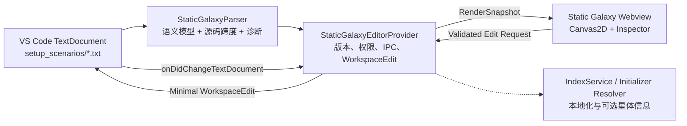

# Static Galaxy Preview and Position Editor Implementation Plan / 静态银河预览与位置编辑实施计划

## 1. 文档状态

- 状态：首版实现完成，进入验收与缺陷收敛阶段。
- 目标版本：后续功能版本，具体版本号以根目录 `package.json` 和 `release/package.json` 为准。
- 功能范围：Stellaris `map/setup_scenarios/*.txt` 中的 `static_galaxy_scenario`。
- 主要参考实现：
  - `client/extension/solarSystemPanel.ts`
  - `client/extension/solarSystemParser.ts`
  - `client/webview/solarSystemPreview.ts`
  - `client/webview/solarSystemPreview.css`
  - `client/extension/texturePreviewEditor.ts`
- 规则来源：`submodules/cwtools-stellaris-config/config/map/map.cwt`。
- 外部验证样例：
  - `$STELLARIS/map/setup_scenarios/static_galaxy_example.txt`
  - `map/setup_scenarios/04 STNC_galaxy_2000.txt`（大型 Workshop 验证样例，不提交到仓库）。

本文档是实现顺序、模块边界和验收标准的单一计划来源。实施过程中若修改核心交互或写回语义，应先更新本文档，再修改代码。

## 2. 背景与已确认事实

Stellaris 支持 `static_galaxy_scenario`，可以在脚本中直接声明恒星系统坐标、星云和显式超空间航道。原版只提供了注释形式的示例，没有为 Mod 制作者提供可视化编辑工具。

大型 Workshop 样例的实际结构如下：

- 文件约 248 KB，共 2002 个 `system`、27 个 `nebula`。
- 2002 个系统均使用 `{ min max }` 范围坐标，其中绝大多数为中心点加减 2。
- 文件设置 `random_hyperlanes = yes`，没有显式 `add_hyperlane`、`remove_hyperlane` 或 `prevent_hyperlane`。
- 文件中存在反向范围、重复中心点等需要可视化诊断但不应自动修复的情况。
- `system` 既可能使用单行格式，也可能使用多行格式；不能依靠行正则进行可靠回写。

原版示例和当前 CWT 规则共同要求解析层覆盖：

- `x`、`y`、`z` 的固定数值和 `{ min max }` 范围数值。
- 按文档出现顺序生效的 `coordinate_transform`。
- `system`、`nebula`、`add_hyperlane`、`remove_hyperlane`。
- 为兼容原版示例，同时识别 `prevent_hyperlane`，但不主动改写其名称。
- 一个文件内存在多个 `static_galaxy_scenario` 的情况。

## 3. 产品目标

### 3.1 必须实现

1. 从 `map/setup_scenarios/*.txt` 打开独立的静态银河预览器。
2. 在顶部工具栏提供与现有星系预览一致的“预览 / 编辑”分段按钮。
3. 预览系统中心、坐标范围、星云和源码中明确声明的航道。
4. 支持选择恒星系统或星云、查看详情、跳转源码和拖拽修改 X/Y 位置。
5. Inspector 支持固定/范围 X/Y/Z；当源码没有 Z 时可显式补充固定 Z。
6. 支持在两个系统之间添加或断开显式超空间航道，分别写回 `add_hyperlane` / `remove_hyperlane`。
7. 拖动范围坐标时默认整体平移 `min/max`，保持原有随机范围宽度。
8. 使用精确源码跨度和 `WorkspaceEdit` 做最小写回，不重排文件、不删除注释。
9. 使用 VS Code 原生文档保存、撤销、重做和脏状态。
10. 在文档外部变化或请求过期时拒绝旧编辑并重新同步。
11. 对解析失败、反向范围、重复 ID、悬空航道等情况显示诊断。
12. 在约 2000 个系统规模下保持流畅缩放、平移、选择和拖拽。

### 3.2 后续增强

- 多选、框选和批量平移。
- 星云半径编辑。
- 通过 initializer 解析恒星类型并显示更接近游戏的颜色或图标。
- “估算随机航道”可选图层。
- 坐标对齐、均匀分布和碰撞检查等辅助工具。

### 3.3 明确不做

- 不尝试完整模拟 Stellaris 的银河生成器。
- 不宣称能够精确预测 `random_hyperlanes = yes` 的运行时航道。
- 第一版不创建、复制或删除完整的 `system` 脚本块。
- 第一版不修改 initializer、spawn weight、effect 或帝国生成逻辑。
- 不在 Webview 中访问文件系统、`vscode`、Node.js API 或语言服务器。
- 不为此功能增加 MCP 写能力，也不需要修改 F# 后端。

## 4. 用户体验设计

### 4.1 打开方式

新增命令：

```text
cwtools.previewStaticGalaxy
Stellaris: Preview/Edit Static Galaxy
Stellaris：预览/编辑静态银河
```

命令入口：

- 命令面板。
- 编辑器标题栏按钮。
- `map/setup_scenarios/*.txt` 的资源管理器和编辑器上下文菜单。
- 可选 Custom Editor：`cwtools.staticGalaxyEditor`，`priority` 设为 `option`，不替换默认文本编辑器。
- 标题栏命令使用 `$(map)` 地图图标，避免与本地化翻译命令的 `$(globe)` 图标混淆。

打开前由 Extension Host 检查文件：

1. URI 必须是可读取的文本资源。
2. 文件扩展名必须为 `.txt`。
3. 路径匹配 `map/setup_scenarios` 时直接进入；其他路径允许用户确认后继续。
4. 文件中没有 `static_galaxy_scenario` 时显示说明，并提供“打开源码”。

### 4.2 顶部工具栏

顶部工具栏直接参考现有 `SolarSystemPanel._getHtml()` 的结构和视觉层次，但使用“静态银河”术语，避免与太阳系初始化器混淆。

推荐 DOM 结构：

```text
app-header
├─ app-identity
│  ├─ app-kicker: STATIC GALAXY / 静态银河
│  └─ title: 当前文件名
├─ scenario-picker      （仅当文件含多个场景时显示；单场景文件隐藏并收起该列）
│  └─ scenario-select
├─ mode-switch
│  ├─ btn-preview
│  └─ btn-edit
└─ document-actions
   ├─ btn-undo            edit-only
   ├─ btn-redo            edit-only
   ├─ btn-save            edit-only
   ├─ edit-status
   └─ btn-toggle-inspector
```

模式按钮的行为必须与现有星系预览保持一致：

- `btn-preview`
  - 初始为激活状态。
  - `aria-pressed="true"`。
  - 画布允许缩放、平移、悬停、选择和跳转源码。
  - 禁止拖动节点和修改属性。
- `btn-edit`
  - 使用与现有星系预览相同的铅笔图标和分段按钮样式。
  - 标题为“编辑模式 (E)”。
  - 激活后给 `body` 增加 `is-edit-mode`。
  - 显示 `edit-only` 文档操作，启用系统/星云拖拽、X/Y/Z 坐标输入和显式航道操作。
  - 鼠标进入可编辑节点时使用 `move`，空白区域保持 `grab`。
- 两种模式使用同一个 Canvas，不重建场景，不重置缩放、平移、筛选和选中项。
- 模式变化同步更新 `.active`、`aria-pressed`、光标、属性面板和命令可用状态。
- 当焦点位于普通输入框之外时，按 `E` 切换模式；按 `Escape` 取消当前拖拽或退出临时操作。

工具栏右侧状态：

- `saved`：已保存。
- `modified`：有未保存修改。
- `applying`：正在提交坐标修改。
- `readonly`：当前文档不可编辑。
- `stale`：源文件已变化，正在重新同步。
- `error`：最近一次解析或写回失败，悬停显示详情。

不要直接导入完整的 `solarSystemPreview.css`。第一版复制和适配必要的顶部壳层样式与交互语义；若后续还有第三个同类编辑器，再单独评估提取共享 Preview Editor Shell，避免本功能引入无关的大范围重构。

### 4.3 主界面布局

```text
┌──────────────────────────── 顶部工具栏 ────────────────────────────┐
│ STATIC GALAXY  [场景▼]     [预览 | 编辑]    [撤销][重做][保存][状态] │
├───────────────────────────────┬───────────────────────────────────┤
│                               │ 搜索 / 筛选                       │
│                               ├───────────────────────────────────┤
│       银河 Canvas             │ 当前选择                          │
│                               │ ID / 名称 / initializer           │
│       星点、范围、星云、航道   │ 原始坐标 / 有效坐标 / 范围宽度    │
│                               │ 诊断 / 跳转源码                   │
│                               │                                   │
├───────────────────────────────┴───────────────────────────────────┤
│ 浮动视图工具：缩放、适应、标签、范围、航道、网格、坐标模式          │
└───────────────────────────────────────────────────────────────────┘
```

右侧 Inspector 默认展开，可通过顶部按钮折叠；折叠后 Canvas 立即重新计算尺寸但不改变世界坐标中心。

### 4.4 预览模式

预览模式支持：

- 滚轮以鼠标位置为锚点缩放。
- 中键、`Alt + 左键` 或空格拖动画布。
- 单击选择系统或星云。
- 双击节点跳转源码。
- 悬停显示 ID、名称、initializer、原始坐标、有效坐标和诊断摘要。
- 搜索 ID、名称和 initializer。
- 切换标签、坐标范围、星云、显式航道和估算航道图层。
- 点击“适应全部”使用所有可见系统和星云计算视口范围。
- 点击“聚焦”将选中节点移动到画布中心。

### 4.5 编辑模式

编辑模式在预览模式基础上增加：

- 拖动恒星系统或星云中心修改 X/Y。
- Inspector 中输入精确 X/Y/Z；Z 未声明时显示空输入，用户填入后才新增 `z = ...`。
- 固定坐标与范围坐标使用不同的属性控件。
- 系统 Inspector 可选择另一端点并执行“添加航道”或“断开航道”。
- 拖动过程中显示坐标 HUD、位移量和吸附结果。
- `Escape` 取消本次拖动并恢复拖动前模型。
- `pointerup` 后只提交一次写回。
- 提交期间锁定该节点，避免连续请求覆盖。
- 写回失败时恢复 Host 返回的最新状态，而不是继续使用前端猜测值。

星云半径仍为只读；位置编辑与系统共用相同的 span、transform 逆变换和 revision 安全检查。

## 5. 技术架构

### 5.1 总体数据流



### 5.2 运行边界

Extension Host 负责：

- 读取 `TextDocument`。
- 解析 PDXScript。
- 保存源码跨度和当前文档版本。
- 校验 Webview 消息。
- 查询本地化和 initializer 索引。
- 构造、提交和验证 `WorkspaceEdit`。
- 保存、撤销、重做和跳转源码。
- 处理外部文件变化、只读状态和错误报告。

Webview 负责：

- 渲染 Host 发送的纯数据快照。
- 维护视口、筛选、选择和当前 UI 模式。
- 进行拖拽时的即时视觉反馈。
- 发送语义化编辑请求，不发送任意文件路径、任意源码文本或任意替换范围。
- 在释放资源时移除监听器、取消动画帧并断开观察器。

### 5.3 编辑器类型

优先采用 `CustomTextEditorProvider`：

- `TextDocument` 继续作为唯一数据源。
- `WorkspaceEdit` 自动进入 VS Code 文本撤销栈。
- VS Code 管理保存、Auto Save 和外部文件变化。
- 不需要像当前 `SolarSystemPanel` 一样维护 20 份完整文档快照。
- 命令通过 `vscode.openWith` 打开 `cwtools.staticGalaxyEditor`。

实现阶段必须验证 Custom Text Editor 中 `undo`/`redo` 命令的实际行为。只有在 VS Code 原生撤销无法满足“一次拖动一次撤销”时，才设计额外的轻量事务层；不得直接复制完整文档快照方案。

## 6. 共享协议与数据模型

新增依赖环境中立的共享协议文件：

```text
client/shared/staticGalaxyProtocol.ts
```

该文件只能包含可序列化类型、常量和无平台依赖的类型守卫，不得导入 `vscode`、`fs` 或 `path`。

### 6.1 坐标类型

```ts
type StaticGalaxyAxis =
    | {
        kind: 'fixed';
        value: number;
        center: number;
    }
    | {
        kind: 'range';
        min: number;
        max: number;
        center: number;
        width: number;
        reversed: boolean;
    }
    | {
        kind: 'unresolved';
        raw: string;
        reason: string;
    };
```

源码跨度不能发送给 Webview 作为写权限依据。Host 在当前 revision 的解析缓存中保存跨度，Webview 只持有不透明的 `nodeKey`。

### 6.2 系统渲染模型

```ts
interface StaticGalaxySystemView {
    nodeKey: string;
    id: string;
    name?: string;
    displayName: string;
    initializer?: string;
    rawPosition: StaticGalaxyPosition;
    effectivePosition: StaticGalaxyPosition;
    editable: boolean;
    diagnostics: StaticGalaxyDiagnosticView[];
    visual?: {
        color?: string;
        starClass?: string;
    };
}
```

`nodeKey` 使用“解析 revision 内稳定”的不透明 ID，而不是只使用系统 `id`。重复 ID 是需要报告的错误，但不能导致前端节点互相覆盖。

星云渲染模型同样携带 `rawPosition`、`effectivePosition`、`editable` 和 `editBlockedReason`；半径保留为预览字段。Host 私有解析模型额外保存 `positionBlockSpan`，仅用于用户填写缺失 Z 时在位置块闭合括号前插入一个字段，该跨度不会发送到 Webview。

### 6.3 场景模型

```ts
interface StaticGalaxyScenarioView {
    scenarioKey: string;
    name: string;
    systems: StaticGalaxySystemView[];
    nebulas: StaticGalaxyNebulaView[];
    hyperlanes: StaticGalaxyHyperlaneView[];
    settings: {
        randomHyperlanes: boolean;
        maxHyperlaneDistance?: number;
        hyperlaneDensity?: number;
    };
    bounds: StaticGalaxyBounds;
    diagnostics: StaticGalaxyDiagnosticView[];
}
```

### 6.4 Revision

每次成功解析生成：

```ts
interface StaticGalaxyRevision {
    revisionId: string;
    documentVersion: number;
    scenarios: StaticGalaxyScenarioView[];
}
```

所有编辑请求必须同时携带 `revisionId` 和 `documentVersion`。任一不一致时，Host 拒绝请求并发送最新快照。

## 7. 解析计划

### 7.1 不使用正则定位属性

禁止通过“从系统行开始向后搜索 30 行”之类的策略定位坐标。该策略会在以下情况写错目标：

- 单行和多行混合。
- 内部 `spawn_weight`、`effect` 等嵌套块出现同名属性。
- 注释包含看似合法的脚本。
- 文档发生变化后行号过期。
- 同一行出现多个范围块。

解析器必须基于 token 的 `startOffset/endOffset` 构建带跨度的轻量 AST。

### 7.2 Tokenizer 前置工作

复用 `client/extension/pdxTokenizer.ts`，但在使用前完成以下回归工作：

1. 为字符串中的转义双引号增加测试并修复扫描逻辑。
2. 保证 CRLF 只计为一次换行。
3. 保证注释被跳过时后续 token offset 仍准确。
4. 覆盖正负数、小数、`@[...]` 和未知标识符。
5. 不改变现有 GUI 和 Solar System parser 的可观察结果。

### 7.3 轻量 AST

内部节点至少保留：

```ts
interface PdxAssignmentNode {
    key: string;
    keySpan: OffsetSpan;
    valueSpan: OffsetSpan;
    blockSpan?: OffsetSpan;
    value?: string | number;
    children?: PdxAssignmentNode[];
    line: number;
}
```

数字 token 的跨度需要精确到数字本身，以便将：

```text
position = { x = { min = -97 max = -93 } y = 20 }
```

修改为目标值时只替换 `-97`、`-93` 或 `20`，保留空格、注释、换行和字段顺序。

### 7.4 场景解析顺序

对每个顶层 `static_galaxy_scenario`：

1. 建立空的坐标变换状态。
2. 按 children 的源码顺序遍历。
3. 遇到 `coordinate_transform` 时更新后续系统使用的变换快照。
4. 遇到 `system` 时解析字段并附加当前变换快照。
5. 遇到 `nebula` 时解析位置和半径。
6. 遇到航道声明时保存端点和声明类型。
7. 未识别字段不报错、不删除、不参与写回。

### 7.5 坐标变换

`coordinate_transform` 的 `add/sub/mul/div` 必须按源码出现顺序执行。

对每个系统保存：

- 文件中的 raw position。
- 变换后的 effective position。
- 可逆变换链。
- 不可逆原因。

编辑画布使用 effective position；写回前逆序应用变换链得到 raw position。遇到下列情况禁止画布拖动，但仍允许预览和源码跳转：

- `mul = 0`。
- `div = 0`。
- 变换参数不是有限数字。
- 坐标值是未解析变量或表达式。

### 7.6 范围坐标

范围坐标同时保留：

- 原始 `min`、`max`。
- `center = (min + max) / 2`。
- `width = max - min`。
- `reversed = min > max`。
- 用于显示的 `low/high`，但不能覆盖原始顺序。

反向范围仍以中心点显示，并附加诊断；拖动只平移两个端点，不自动交换。Inspector 提供显式“修正范围顺序”快速操作时，才允许交换数值。

## 8. 渲染计划

### 8.1 渲染技术

使用 Canvas2D，不引入 Three.js：

- 2000 个点和数千条线在 Canvas2D 中足够轻量。
- 交互是二维坐标编辑，不需要 3D 场景管理。
- 更容易实现精确屏幕命中、LOD 标签和 VS Code 主题适配。

画布设置：

- 使用 `devicePixelRatio`，最大截断为 2，避免超高 DPI 占用过多内存。
- 所有世界坐标通过统一 `worldToScreen/screenToWorld` 变换。
- X/Y 轴方向在 `worldToScreen/screenToWorld` 中统一转换（Stellaris 银河地图 X 正方向朝左、Y 朝上），不在各绘制函数中散落负号；网格与范围框等需要世界极值的绘制按翻转后的方向归一化。
- Z 轴第一版不改变 X/Y 布局；Inspector 展示 Z，视图可选用亮度或小型高度标记表达 Z。

### 8.2 绘制层级

按以下顺序绘制：

1. 背景和网格。
2. 星云范围。
3. 估算航道（若启用，弱化虚线）。
4. 显式航道。
5. 系统坐标范围框。
6. 普通系统节点。
7. 悬停和选中节点。
8. 标签、诊断标记和拖拽 HUD。

### 8.3 节点样式

首版样式不依赖 initializer 解析：

- 普通系统：VS Code 前景色或中性星光色。
- 有名称或 initializer：较高亮度。
- 有错误：红色外圈。
- 有警告：黄色外圈。
- 选中：主题 focus border 色和更大半径。
- 不可编辑：虚线外圈或锁图标。

增强阶段通过索引找到 initializer，并复用 `parseSolarSystemFile` 解析首颗恒星类型。解析结果按 initializer 名称放入有界缓存；只解析当前文档实际引用的 initializer，不做无界工作区扫描。

### 8.4 标签 LOD

- 低缩放：不显示普通标签，只显示选中和诊断节点。
- 中缩放：显示具名系统。
- 高缩放：显示具名系统和 ID。
- 悬停标签始终可见。
- 同屏标签过多时按屏幕网格做简单避让，不能创建 2000 个绝对定位 DOM 元素。

### 8.5 命中测试

首版可使用屏幕网格空间索引：

1. 每次视口变换后将可见节点投影到固定尺寸 bucket。
2. 指针移动时只检查所在 bucket 及相邻 bucket。
3. 选中优先级为：已选中节点、系统节点、星云。
4. 命中半径使用屏幕像素，不随世界缩放缩小到不可点击。

### 8.6 重绘策略

- 使用 `scheduleRender()` 合并同一帧内的多次状态变化。
- 只在数据、视口、悬停、选择或主题发生变化时请求动画帧。
- 不运行永久 `requestAnimationFrame` 循环。
- 拖动过程中最多每帧绘制一次。
- Webview 隐藏时停止不必要的重绘。

## 9. 编辑和写回计划

### 9.1 拖拽状态机

```text
idle
  └─ pointerdown on editable node
       └─ armed
            ├─ pointermove < threshold → still armed
            ├─ pointermove ≥ threshold → dragging
            │    ├─ pointermove → update preview model
            │    ├─ Escape/pointercancel → rollback local model
            │    └─ pointerup → submit one MoveSystemsRequest
            └─ pointerup without move → select only
```

要求：

- 使用 Pointer Events 和 `setPointerCapture`。
- 拖拽阈值建议为 4 CSS 像素。
- 拖拽开始时保存原始节点模型。
- 拖拽过程中不向 Host 连续写文件。
- 释放指针时发送一次请求。
- 等待 Host 结果期间显示 `applying` 状态。

### 9.2 坐标吸附

默认吸附到 raw coordinate 的整数，因为 CWT 当前将静态系统位置声明为 `int`。

- 无修饰键：1 单位网格。
- `Shift`：5 单位网格。
- `Alt`：临时关闭网格，但最终仍根据字段约束得到合法整数。
- Inspector 精确输入始终展示 raw 与 effective 两套结果。

如果未来确认游戏支持小数系统坐标，应先更新规则和测试，再开放小数输入，不能只放宽前端。

### 9.3 固定坐标写回

原始：

```text
x = 20
```

向右移动 7 后：

```text
x = 27
```

只替换数字 token，不替换 `x =` 或相邻字段。

### 9.4 范围坐标写回

原始：

```text
x = { min = -97 max = -93 }
```

向右移动 10 后：

```text
x = { min = -87 max = -83 }
```

默认规则：

- `delta` 同时加到 `min` 和 `max`。
- 保留范围宽度和原始正反顺序。
- 不把范围自动折叠为固定值。
- 只有 Inspector 中显式选择“转换为固定坐标”时才改变语法形态。

### 9.5 Z 坐标写回

- 已声明 Z 时沿用固定/范围 token 的精确替换规则。
- 未声明 Z 时 Inspector 显示空输入，不把空值当作 0，也不因修改 X/Y 自动增加 Z。
- 用户明确填写 Z 后，Builder 只在当前节点的 `position = { ... }` 闭合括号前插入 `z = <int>`，并保持原文件的单行/多行结构和 CRLF/LF 风格。
- Canvas 仍是二维投影，拖拽只改变 X/Y；Z 仅通过 Inspector 精确编辑。

### 9.6 WorkspaceEdit 构建

新增纯逻辑模块：

```text
client/extension/staticGalaxyEditBuilder.ts
```

输入：

- 最新 `TextDocument` 文本和版本。
- 当前 Host revision 的解析索引。
- 已通过类型守卫的语义编辑请求。

输出：

- 一组确定性的跨度替换：坐标数字 token、航道声明 key，或缺失字段/新航道的最小插入。
- 变更摘要。
- 或明确的拒绝原因。

提交前检查：

1. 请求 revision 与 Host 当前 revision 一致。
2. `document.version` 未变化。
3. `nodeKey` 存在且属于当前场景；航道的两个端点必须同场景、非自身且 ID 唯一。
4. 目标节点仍可编辑。
5. 当前跨度内文本与解析时保存的 token 文本一致。
6. 新值为有限、合法、在合理上限内的数字。
7. 多个替换范围不重叠。

所有替换通过一个 `WorkspaceEdit` 提交，使一次拖动对应一次撤销。编辑顺序按起始 offset 从后向前排序，保证构建结果确定且便于单元测试。

### 9.7 显式航道写回

- Webview 只提交两个系统 `nodeKey` 和目标状态 `connected`，不提交系统 ID、源码 key、offset 或替换文本。
- Host 从当前 revision 解析模型解析端点 ID，并按无向端点对匹配已有 `add_hyperlane` / `remove_hyperlane` / `prevent_hyperlane`。
- 已有声明时只把匹配声明的 key 统一改为目标 key；因此断开不会删除用户的端点、空格或行尾注释，重新连接也可逆。
- 没有声明时，在当前 `static_galaxy_scenario` 闭合括号前插入一条声明，并复用源文件换行符和现有子节点缩进。
- 不修改 `random_hyperlanes`，也不根据距离重算其他航道。

### 9.8 文档同步

Provider 监听 `onDidChangeTextDocument`：

- 只处理当前 Custom Editor 的 URI。
- 150–250 ms debounce，合并快速输入。
- 解析新版本时取消或丢弃旧解析结果。
- 每次成功解析生成新 revision 并发送完整轻量快照。
- 解析失败时保留最后一次可显示快照，但进入只读预览并显示“源码存在语法错误”。
- 不使用容易产生竞态的单个 `_skipNextReload` 标志；自有编辑也通过同一文档变化流程收敛。

### 9.9 保存与撤销

- `btn-save` 调用 `TextDocument.save()`。
- Ctrl+S 在 Webview 有焦点时转发到 Host。
- `btn-undo` / Ctrl+Z 执行 VS Code 原生 undo。
- `btn-redo` / Ctrl+Shift+Z 执行 VS Code 原生 redo。
- 不在每次坐标拖动后强制保存。
- 状态来源只使用 `document.isDirty` 和最近一次操作结果，不在前端自行猜测。

## 10. Host 与 Webview 消息

### 10.1 Host → Webview

```ts
type StaticGalaxyHostMessage =
    | { type: 'render'; revision: StaticGalaxyRevision; activeScenarioKey?: string }
    | { type: 'documentState'; state: DocumentState; dirty: boolean; message?: string }
    | { type: 'editAccepted'; requestId: string; revisionId: string }
    | { type: 'editRejected'; requestId: string; code: EditRejectCode; message: string; revision?: StaticGalaxyRevision }
    | { type: 'focusNode'; nodeKey: string }
    | { type: 'permissions'; canEdit: boolean; reason?: string; workshopFile: boolean };
```

### 10.2 Webview → Host

```ts
type StaticGalaxyWebviewMessage =
    | { type: 'ready' }
    | { type: 'moveSystems'; requestId: string; revisionId: string; documentVersion: number; moves: SystemMove[] }
    | { type: 'moveNebula'; requestId: string; revisionId: string; documentVersion: number; move: NodeMove }
    | { type: 'updatePosition'; requestId: string; revisionId: string; documentVersion: number; update: PositionUpdate }
    | { type: 'setHyperlane'; requestId: string; revisionId: string; documentVersion: number; update: HyperlaneUpdate }
    | { type: 'goToSource'; revisionId: string; nodeKey: string }
    | { type: 'saveDocument' }
    | { type: 'undo' }
    | { type: 'redo' }
    | { type: 'requestWorkshopEdit' }
    | { type: 'copyToWorkspace' };
```

消息处理规则：

- `onDidReceiveMessage` 的入参按 `unknown` 处理。
- 先判别 discriminant，再逐字段校验。
- 限制 `moves` 长度；第一版最大为 1，批量编辑启用后设置明确上限。
- Webview 不能指定 URI、源码 offset 或任意替换文本。
- `setHyperlane` 只接受两个不同的非空 `nodeKey` 与布尔 `connected`；端点 ID 和声明文本只能由 Host 推导。
- 所有失败通过结构化拒绝消息返回，并使用 `ErrorReporter` 记录必要上下文。

## 11. 航道预览策略

### 11.1 精确航道

- `add_hyperlane`：实线。
- `remove_hyperlane` 和兼容读取的 `prevent_hyperlane`：红色或警告色虚线。
- 端点不存在：仍进入诊断列表，但不绘制到不存在节点。
- 重复的反向声明在渲染模型中去重，源码诊断保持各自位置。

### 11.2 精确航道编辑

- 仅系统选择显示端点下拉框；星云不参与航道操作。
- “添加航道”目标状态为 `add_hyperlane`，“断开航道”目标状态为 `remove_hyperlane`。
- 已经处于目标状态时禁用对应按钮；冲突声明可由任一操作归一为用户选择的状态。
- 端点缺失、重复 ID、跨场景或自身连接由 Host 拒绝，不依赖 Webview 的 UI 限制作为安全边界。
- 画布快捷操作与 Inspector 按钮共用同一 `setHyperlane` 消息：
  - 编辑模式下右键点击系统进入航道绘制模式；该模式下左键不能拖动系统、不能选中星云，只用于续链端点。
  - 左键逐个把端点加入链路（已在链中的系统被忽略），再次按右键把链路的所有航段合并为**一次** `add_hyperlane` 写回（单个 WorkspaceEdit、单次撤销）；新声明按场景合并为一个锚点插入，冲突声明就地改名，重复端点对去重。左键命中空白或非系统、`Escape` 或未续链时按右键均取消绘制。
  - 右键直接点击已绘制的 `add_hyperlane` 航道时删除源码中的整条声明（不写 `remove_hyperlane`）：独占一行的声明连行删除，行尾注释与其他字段保留；同一端点对的重复声明一并删除；删除前按解析时保存的声明原文做过期校验。

### 11.3 随机航道

当 `random_hyperlanes = yes` 且源码没有明确拓扑时，最终航道由游戏运行时生成。第一版必须：

- 默认不绘制随机航道。
- 在工具栏显示“运行时随机航道，无法精确预览”的说明。
- 不根据截图或距离直接声称得到真实航道。

“估算航道”图层已实现（默认关闭，视图工具栏“估算”开关，状态持久化）：

- 仅在 `random_hyperlanes = yes` 的场景可用；其他场景按钮禁用并说明原因。
- 算法为文档化的 k 近邻启发式（`client/shared/staticGalaxyEstimate.ts`）：每个系统连接 `max_hyperlane_distance`（缺省 50）内最多 k 个最近邻，k 随 `hyperlane_density` 缩放并夹在 [1, 6]；无向去重。**明确标注为近似，不宣称是游戏算法。**
- 视觉上使用明显弱化的虚线，绘制在显式航道之下。
- 图例固定标注“估算航道 — 启发式近似，非游戏实际生成结果”。
- 估算只存在于前端，不自动转换为 `add_hyperlane`；新 revision 到达后惰性重算，不引入 `d3-delaunay` 等新依赖。

## 12. 诊断设计

解析器内部诊断不替代 LSP 的 CWT 诊断，而是补充可视化编辑所需的结构和安全提示。

### 12.1 Error

- 顶层场景或关键位置块无法解析。
- 重复系统 ID 导致航道引用不唯一。
- X/Y 是无法解析的表达式。
- 坐标变换不可逆，但用户尝试编辑。
- 航道端点 ID 不存在或不唯一。
- 写回目标跨度与当前文档不匹配。

### 12.2 Warning

- `min > max`。
- 多个系统中心相同。
- 多个坐标范围重叠。
- 系统缺少 X 或 Y，预览使用 0 回退。
- 星云半径为负数或非有限值。
- `random_hyperlanes = yes`，航道预览不是精确结果。
- 正在直接编辑 Steam Workshop 文件。

### 12.3 Information

- 系统没有名称或 initializer。
- Z 坐标存在但当前使用二维 X/Y 投影。
- coordinate transform 已影响显示坐标。

诊断显示位置：

- 顶部状态摘要。
- Inspector 当前节点诊断。
- Canvas 节点外圈或小图标。
- 可展开的全场景诊断列表。
- “跳转源码”操作。

## 13. Steam Workshop 与只读安全

Workshop 文件可能被 Steam 更新覆盖。路径匹配 `steamapps/workshop/content` 时：

1. 预览始终允许。
2. 顶部显示 Workshop 风险横幅。
3. 第一次点击“编辑”时显示一次确认：
   - 推荐操作：“复制到 Mod 工作区”。
   - 次要操作：“本次会话仍然原地编辑”。
   - 取消：保持预览模式。
4. 不提供“永久忽略所有 Workshop 风险”的全局无界开关。
5. URI scheme 不可写或文件系统报告只读时，禁用编辑按钮并解释原因。

复制到工作区属于有明确用户确认的外部写操作；目标目录和覆盖策略必须由用户选择，不根据文件名自动覆盖已有 Mod 文件。

## 14. 性能与资源预算

目标基线为大型样例的 2002 个系统和 27 个星云。

### 14.1 Host

- 解析使用单次 tokenization 和单次顺序 AST 遍历。
- 不为每次 Webview 筛选重新解析文档。
- initializer 和本地化解析使用有界缓存。
- 文档变化 debounce，并丢弃过期 parse result。
- 只向 Webview 发送所需字段，不发送完整 AST 或源码。

### 14.2 Webview

- Canvas2D 按需重绘。
- DPR 上限 2。
- 不为每个系统创建 DOM 节点。
- 命中测试使用空间索引。
- 标签使用 LOD。
- estimated lane 只在视图稳定或拖拽结束后重算。
- `ResizeObserver`、事件监听器和 RAF 在 dispose 时全部清理。

### 14.3 建议验收预算

- 2000 节点文件打开后 1 秒内出现可交互画布；CI 不使用过紧的毫秒断言。
- 普通缩放和平移目标 60 FPS，低性能机器最低不低于可用的 30 FPS。
- 单点拖动过程中不触发文件解析。
- 一次拖动只产生一个 `WorkspaceEdit`。
- Webview 隐藏后不持续消耗显著 CPU。

## 15. 实施阶段

### 阶段 0：测试夹具与协议骨架

任务：

1. 创建最小静态银河测试夹具，不复制完整 Workshop 文件。
2. 夹具覆盖固定/范围坐标、Z、星云、航道、多个场景和 coordinate transform。
3. 新增 `client/shared/staticGalaxyProtocol.ts`。
4. 定义 Host/Webview discriminated unions 和类型守卫。
5. 为 `pdxTokenizer` 增加转义引号、CRLF 和 offset 回归测试。

完成门槛：

- 共享协议不依赖 Host 或 Webview 专属 API。
- 现有 tokenizer/parser 测试全部通过。
- fixture 足以覆盖后续每个编辑分支。

### 阶段 1：带跨度解析器

任务：

1. 实现轻量带跨度 AST。
2. 实现 static scenario、system、position、nebula、hyperlane 和 transform 解析。
3. 生成 raw/effective position。
4. 建立 Host 私有的 `nodeKey → source spans` 索引。
5. 实现结构诊断。
6. 使用生成的 2000 节点内容做非脆弱性能测试。

完成门槛：

- 单行和多行得到相同语义模型。
- 解析后不写文件。
- 所有数字跨度可精确映射回原文。
- 反向范围和重复 ID 有稳定诊断。
- transform 顺序和逆变换测试通过。

### 阶段 2：Provider、命令与打包接线

任务：

1. 实现 `StaticGalaxyEditorProvider`。
2. 在 `extension.ts` 使用 `safeRegisterCommand` 注册打开命令。
3. 在 `gameProfiles.ts` 增加 Stellaris 专属 `staticGalaxyPreview` capability。
4. 更新 `gameProfiles.test.ts`。
5. 更新 `release/package.json` 的 command、menu 和 custom editor contribution。
6. 同步 `release/package.nls.json`、`package.nls.zh.json`、`package.nls.zh-cn.json`。
7. 在 Rollup 中新增 `staticGalaxyPreview` Webview entry 和 CSS copy。

完成门槛：

- Stellaris profile 可用，其他游戏 profile 不显示功能。
- 命令可以从源码和资源管理器打开 Custom Editor。
- 非 static scenario 文件得到可理解的空状态。
- 打包产物包含 JS/CSS，不依赖 CDN。

### 阶段 3：预览 UI

任务：

1. 实现与星系预览一致的顶部工具栏。
2. 实现顶部“预览 / 编辑”按钮，但先让编辑模式只改变 UI 状态。
3. 实现场景选择器、Canvas、Inspector 和浮动视图工具。
4. 实现系统、范围、星云和显式航道绘制。
5. 实现缩放、平移、适应、聚焦、选择、悬停和源码跳转。
6. 实现搜索、过滤、标签 LOD 和诊断标记。
7. 实现 Webview state 持久化，恢复模式之外的安全视图状态；每次重新打开仍默认预览模式。

完成门槛：

- `btn-preview` 默认激活，按钮视觉和 aria 状态正确。
- `btn-edit` 位于顶部工具栏并沿用现有设计语言。
- 两种模式切换不重置视图。
- 2000 节点可流畅交互。
- `prefers-reduced-motion` 生效。
- dispose 后无持续 RAF 或遗留监听器。

### 阶段 4：位置编辑与最小写回

任务：

1. 实现 `staticGalaxyEditBuilder.ts`。
2. 实现编辑消息 runtime validation。
3. 实现固定坐标拖动。
4. 实现范围坐标整体平移。
5. 实现 coordinate transform 逆变换。
6. 实现 revision/version/stale span 校验。
7. 实现 Inspector 精确输入。
8. 接通保存、撤销、重做和 document state。
9. 实现错误回滚和 Host 最新快照重同步。
10. 实现 Workshop 风险确认和只读模式。
11. 让星云复用系统的拖拽与坐标写回路径。
12. 增加 Z 精确输入和缺失 Z 的最小字段插入。
13. 增加显式航道端点选择、添加/断开消息与声明写回。

完成门槛：

- 一次拖动只产生一次原生撤销记录。
- 坐标编辑除目标数字或明确新增的 Z 字段外，文件其他字节保持不变；航道编辑只改声明 key 或插入一条声明。
- 范围宽度保持不变。
- 外部修改后旧请求不会写到错误位置。
- 不可逆 transform 节点无法从 Canvas 编辑。
- 预览模式下不会产生任何文档写入。
- 系统和星云均可安全拖动；航道端点异常会被 Host 拒绝。

### 阶段 5：增强和润色

任务：

1. initializer 解析和恒星类型着色。
2. 多选、框选和批量平移。
3. 星云半径编辑。
4. 评估并实现 estimated lane 图层。
5. 增加碰撞和范围重叠辅助视图。

这些任务不得阻塞首个可用的系统坐标预览/编辑版本。

### 阶段 6：文档和发布验证

任务：

1. 更新 `README.md` 的中英文功能列表和操作说明。
2. 更新 `ARCHITECTURE.md` 的 Extension Host/Webview 文件表和数据流。
3. 如有新增用户设置，同步中英文 setting 文案。
4. 记录用户可见行为到 CHANGELOG。
5. 运行文档构建和 release 检查。

完成门槛：

- 文档中不复制版本号。
- English/Chinese 用户可见内容同步。
- `release/README.md` 由构建脚本生成，不手工编辑。

## 16. 预计文件变更

### 16.1 新增

```text
client/shared/staticGalaxyProtocol.ts
client/extension/staticGalaxyParser.ts
client/extension/staticGalaxyEditBuilder.ts
client/extension/staticGalaxyEditorProvider.ts
client/webview/staticGalaxyPreview.ts
client/webview/staticGalaxyPreview.css
client/test/unit/staticGalaxyParser.test.ts
client/test/unit/staticGalaxyEditBuilder.test.ts
client/test/unit/staticGalaxyProtocol.test.ts
client/test/fixtures/static-galaxy/*.txt
```

### 16.2 修改

```text
client/extension/pdxTokenizer.ts
client/extension/extension.ts
client/extension/gameProfiles.ts
client/test/unit/gameProfiles.test.ts
client/test/unit/webviewSmoke.test.ts
rollup.config.mjs
release/package.json
release/package.nls.json
release/package.nls.zh.json
release/package.nls.zh-cn.json
README.md
ARCHITECTURE.md
CHANGELOG.md
```

### 16.3 不修改

- `submodules/cwtools/`：首版不需要后端语义能力。
- `submodules/cwtools-stellaris-config/`：现有规则已描述主要静态场景结构，除非实施时发现真实规则缺口。
- `packages/cwtools-mcp/`：MCP 保持只读，且本功能没有新增语义 API 的必要。

## 17. 测试计划

### 17.1 Parser 单元测试

- 固定 X/Y/Z。
- X/Y/Z 范围。
- 单行和多行系统。
- 字符串、转义引号、注释和 CRLF。
- 多个 `static_galaxy_scenario`。
- 多个按顺序生效的 `coordinate_transform`。
- transform 的正向和逆向结果。
- `add_hyperlane`、`remove_hyperlane`、`prevent_hyperlane`。
- 星云位置和半径。
- 重复 ID、缺失端点、反向范围和缺失 X/Y。
- 不支持表达式时的稳定降级。
- 生成 2000 个系统时模型数量、边界和稳定性。

### 17.2 Edit Builder 单元测试

- 固定坐标只替换一个 token。
- 范围平移只替换 min/max token。
- 同时移动 X/Y 使用一个事务。
- 原始空格、换行、注释和字段顺序保持不变。
- CRLF 保持不变。
- transform 逆变换正确。
- 系统与星云共享拖拽写回且各自校验 editable 状态。
- 已有 Z 的固定/范围更新，以及缺失 Z 的单字段插入。
- 新增航道保持 LF/CRLF 和场景缩进；断开/重连只修改声明 key 并保留注释。
- 跨场景、自身端点、空 ID 和重复 ID 航道请求被拒绝。
- 反向范围拖动不被静默修正。
- stale revision、错误 document version 和 token mismatch 被拒绝。
- NaN、Infinity、过大数组和未知 nodeKey 被拒绝。
- 多个编辑范围按确定顺序生成且不重叠。

### 17.3 Webview 测试

在 `webviewSmoke.test.ts` 中验证：

- 顶部存在 `btn-preview` 和 `btn-edit`。
- 初始 preview 按钮激活。
- mode switch 有正确 role 和 aria 属性。
- edit-only 控件只在编辑模式显示。
- Canvas、Inspector、状态、适应视图和图层按钮存在。
- 星云 move 消息、Z 输入和添加/断开航道控件存在。
- 标题栏使用 `$(map)`，不与翻译命令共用 `$(globe)`。
- CSS 使用 VS Code theme variables。
- CSS 包含 `prefers-reduced-motion`。
- Rollup 复制对应 CSS 并产出 JS。
- Webview 源码不导入 Node.js 或 `vscode`。

### 17.4 Provider/集成测试

- 命令只对 Stellaris profile 启用。
- 路径识别大小写和 Windows/Unix 分隔符。
- 一个文件多场景可切换。
- 文档外部修改后重新解析。
- 保存状态正确。
- Ctrl+Z 一次撤销一次拖动。
- Workshop 文件弹出风险确认。
- 只读 URI 无法进入编辑模式。

### 17.5 验证命令

按风险从窄到宽执行：

```text
npm run compile
```

然后运行新增的定向单元测试，再运行：

```text
npm run test:unit
npm run build:docs
npm run check:release -- --skip-compile --skip-test
```

发布前运行：

```text
npm run verify
```

任何无法运行的检查必须在交付说明中明确列出原因。

## 18. 验收清单

### 18.1 UI

- [ ] 预览和编辑按钮位于顶部工具栏，外观和现有星系预览一致。
- [ ] 打开时默认预览模式。
- [ ] 模式切换不重置缩放、平移、筛选或选中项。
- [ ] 编辑模式显示保存、撤销、重做和状态控件。
- [ ] Inspector 可以折叠，Canvas 正确自适应。
- [ ] 静态银河标题栏使用地图图标，与翻译命令图标可区分。
- [ ] 中英文文案完整，键盘和屏幕阅读器状态正确。

### 18.2 预览

- [ ] 大型样例的 2002 个系统和 27 个星云完整出现。
- [ ] 范围坐标以中心点和可选范围框展示。
- [ ] 显式航道正确绘制。
- [ ] 随机航道不会被展示为精确结果。
- [ ] 反向范围、重复 ID 和悬空航道可见且可跳转源码。
- [ ] 搜索、缩放、平移、适应和聚焦可用。

### 18.3 编辑

- [ ] 预览模式不能修改文档。
- [ ] 固定坐标拖动只修改目标数字。
- [ ] 范围坐标拖动保持范围宽度。
- [ ] 系统和星云均可拖动；不可写坐标或不可逆 transform 会禁用拖动。
- [ ] Inspector 显示 X/Y/Z；缺失 Z 保持空白，明确填写后只新增一个 Z 字段。
- [ ] 添加航道生成/转换为 `add_hyperlane`，断开航道生成/转换为 `remove_hyperlane`。
- [ ] 航道编辑不修改 `random_hyperlanes` 或其他端点对。
- [ ] 一次拖动对应一次撤销。
- [ ] Ctrl+S 或保存按钮保存当前文档。
- [ ] 外部修改导致旧编辑请求安全失败。
- [ ] 解析错误时编辑自动降级为只读。
- [ ] Workshop 文件有明确风险提示。

### 18.4 性能与资源

- [ ] 约 2000 节点下交互流畅。
- [ ] 拖动过程中不解析文件、不连续写文件。
- [ ] 无永久动画循环。
- [ ] Webview dispose 后监听器、Observer 和 RAF 全部清理。
- [ ] initializer/本地化缓存有明确上限。

### 18.5 工程质量

- [ ] 新增协议在 Host/Webview 共用，没有复制 wire interface。
- [ ] Webview 不使用 Node.js、`vscode`、`fs`、`path` 或 `require()`。
- [ ] Host 对所有消息进行边界校验。
- [ ] 错误通过 `ErrorReporter` 报告。
- [ ] 没有使用整文件重新序列化来修改坐标。
- [ ] 未修改或格式化无关用户文件。
- [ ] 定向测试、`test:unit`、文档构建和 release check 通过。

## 19. 主要风险与缓解措施

### 风险：预览被误认为游戏最终结果

缓解：将“显式航道”和“估算航道”分层；随机航道默认不显示；固定图例和状态提示。

### 风险：拖动写错相邻系统

缓解：精确 token span、revision、document version、旧 token 内容复核和单事务最小写回。

### 风险：coordinate transform 导致显示和文件值不一致

缓解：同时展示 raw/effective 坐标；每个系统保存变换快照；不可逆时禁止编辑。

### 风险：大型文档频繁重解析

缓解：文档变化 debounce、丢弃过期结果、拖动期间不写回、pointerup 单次提交。

### 风险：直接修改 Workshop 后被 Steam 覆盖

缓解：编辑模式前风险确认，优先提供复制到 Mod 工作区，预览始终可用。

### 风险：为了复用视觉样式而扩大重构范围

缓解：首版只复用顶部工具栏的结构、交互语义和视觉规范，不同时重构所有现有 Preview CSS。

## 20. 完成定义

首个可交付版本以“准确预览、可靠选择、系统/星云范围保持拖动、X/Y/Z 最小源码写回、显式航道添加/断开、原生撤销和明确随机航道限制”为完成标准。

initializer 图标、估算航道、多选和星云半径编辑仍属于增强功能；系统/星云位置、Z 与显式航道编辑已经纳入当前交付范围，并必须满足相同的 revision、类型守卫和最小写回约束。
