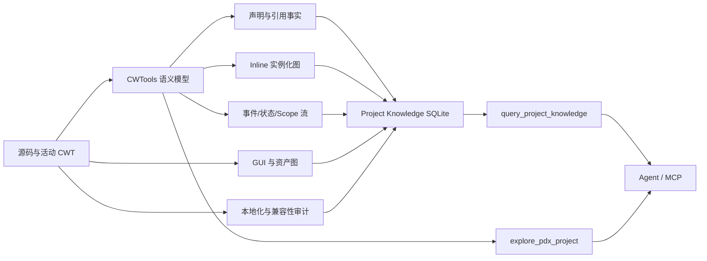

# Stellaris Agent Improvement Plan / Stellaris Agent 改进计划

> Status: Implemented (2026-08) / 已落实
> Scope: `cwtools-vscode` 中面向 Paradox/Stellaris 项目的 Agent、CWTools LSP、项目知识库、共享索引与 MCP 只读接口
> Evidence baseline: `KuatAncientEmpire` 实际 Mod 项目，只用于验证需求与建立基准，不把该项目源码复制进仓库

## 1. 背景与结论

当前 Stellaris Agent 已具备较好的局部合法性能力：它能够从活动 CWT/CWTools 模型查询类型、规则、scope、定义、引用、补全与诊断；能够安全写入本地化文件；能够通过受保护的文本编辑保持未触及源码；Shader 子系统也已经具备编译单元、平台变体、调用关系和原版对比能力。

但在大型实际 Mod 中，Agent 仍主要回答“某个 ID 在哪里、某个字段是否合法”，不能稳定回答以下系统级问题：

- 一个参数化 `inline_script` 调用最终生成了哪些定义，修改模板会影响哪些调用者；
- 事件、`on_action`、特殊项目、局势、GUI 按钮之间如何传递 scope、变量、Flag 和 event target；
- 一个原版覆盖在当前游戏版本与实际加载顺序下由谁胜出，与原版相比改变或遗漏了什么；
- GUI、button effect、GFX、DDS、entity、mesh、animation 是否组成完整可运行的资源链；
- 多语言本地化是否对齐，是否存在重复、孤立或动态展开后缺失的 key；
- 高频 pulse、循环、全银河遍历和大型事件链是否存在性能或可维护性风险。

本计划的核心目标，是把 Agent 从“局部规则查询器”升级为“有证据、有覆盖说明、可做影响分析的 Stellaris 工程助手”。

## 2. 实证基线

用于需求验证的 `KuatAncientEmpire` 项目包含：

| 项目 | 数量 |
| --- | ---: |
| 总文件 | 2,528 |
| PDXScript `.txt` | 371 |
| `common/inline_scripts` 文件 | 123 |
| `inline_script` 调用 | 422 |
| `$PARAM$` 占位 | 4,585 |
| 事件文件 | 33 |
| 工作区事件定义 | 约 1,155 |
| `event_target:` 使用 | 2,420 |
| 保存 event target | 375 |
| `set_variable` / `change_variable` | 290 / 181 |
| `while` | 188 |
| GUI / GFX / asset | 13 / 72 / 145 |
| mesh / anim / DDS | 147 / 45 / 1,587 |
| 本地化文件 | 英文 12，简中 12 |

现有 `/init` 产物暴露了以下可复现问题：

1. Profile 只记录 `l_simp_chinese`，实际同时存在英文和简中。
2. `identifiers.byType` 为空，无法提供项目类型摘要。
3. 项目知识库处于 `workspace_files_changed`、`vanilla_cache_changed` stale 状态。
4. 知识库把 50,187 个合成 modifier 归到一个很小的特殊项目文件第 0 行，显著污染工作区定义统计和检索排序。
5. 知识库能看到部分 inline 展开定义，但没有 inline 调用边、参数合同或实例化 source map。
6. 事件图存在 1,543 条边，但本样本的边标签全部为空，`eventLogic=0`。
7. 存在 119 组工作区/原版重名定义和 5 个直接覆盖的原版事件，但没有字段级原版差异和确定的胜出者说明。
8. Profile 未记录 `supported_version`、外部 Mod 依赖或兼容分支；项目配置中存在 53 项 ignored diagnostics。
9. 英文有 82 个重复 key，简中有 26 个重复 key；仅英文 1 个、仅简中 28 个，当前没有项目级审计工具直接报告这些差异。

这些数字是本计划的回归基线。实现过程中应另外创建最小化、可公开的合成 fixture，不能把实际 Mod 内容直接提交到测试目录。

## 3. 设计原则

### 3.1 事实分层

所有返回给 Agent 的事实必须标明来源和可信度：

- `declared`：源码中存在明确声明和真实范围；
- `expanded`：由 inline/template/macros 展开得到，并能追溯到模板与调用点；
- `derived`：由 CWTools 语义模型计算得到；
- `heuristic`：名称、目录或文本模式推断，只能作为检索提示；
- `runtime_observed`：来自用户明确提供的游戏日志或运行结果。

任何缺少真实位置的合成事实不得伪装为普通工作区定义。空查询结果必须同时返回覆盖率、freshness 和截断信息，不能被解释为“不存在”。

### 3.2 LSP 命令优先

新的 Stellaris 语义能力应先实现为只读 `cwtools.ai.*` LSP 命令，再由 Extension Agent 和 MCP 复用。不得在 Agent 工具层通过独立正则重新实现一套与 CWTools 不一致的类型、scope 或引用语义。

### 3.3 增强现有入口，控制工具数量

优先扩展：

- `query_project_profile`
- `explore_pdx_project`
- `query_project_knowledge`
- `query_workspace_index`
- `query_localisation_index`
- `query_override_modes`

只有当输入/输出合同与现有入口明显不同，且模型需要独立发现该能力时，才新增模型可见工具。每个新增工具都必须同步定义、类型、registry、权限、dispatch、MCP schema 和契约测试。

### 3.4 有界与增量

- 所有查询必须支持 `limit`、截断说明和稳定排序；
- 缓存必须有界；
- 单文件保存不得触发无条件全项目重建；
- inline 模板变化只刷新其调用闭包；
- 状态流只刷新变化文件及受影响的引用闭包；
- vanilla、规则或 override 全图输入变化可以标记 stale，并在明确的全量刷新边界重建。

### 3.5 保守编辑

继续保留 `get_pdx_block` + `edit_file`/`replace_lines` 的最小受保护编辑策略。语义图首先用于探索、影响分析和写前验证，不以大范围 AST 重写替代用户源码格式、注释和文件组织。

## 4. 目标架构



目标不是构建一个无界的通用程序分析器，而是围绕 Stellaris 的高价值关系建立可解释、可增量维护的语义事实。

## 5. 分阶段实施计划

### Phase 0：基准、覆盖合同与测试夹具

#### 目标

在调整数据结构之前建立可重复的正确性、规模与性能基准，避免“新增了更多节点，但查询质量反而下降”。

#### 工作项

1. 新建合成 fixture 组，至少覆盖：
   - `$TYPE$` 生成顶层定义；
   - `$ID$` 生成事件 ID、本地化 key 和特殊项目 ID；
   - 动态 event target 名；
   - 带 `days`、`scopes`、`random_list`、`if/else` 的事件调用；
   - GUI `effectButtonType` → button effect → scripted effect；
   - FIOS/LIOS/MERGE 路径上的 workspace/vanilla 重名定义；
   - 英文/简中缺失、重复与动态 key；
   - 外部 Mod ID 和 ignored diagnostic。
2. 为知识导出增加基准报告：
   - 各 origin、entity type、provenance kind 的定义数量；
   - 真实位置、line 0、缺少范围的记录数量；
   - 各 edge kind 的数量、带 label 比例、解析成功比例；
   - stale、partial、truncated 状态；
   - SQLite 大小、全量导出时间、单文件增量时间。
3. 为每个语义查询增加统一 `coverage`：
   - `filesConsidered`
   - `filesIndexed`
   - `definitionsConsidered`
   - `edgesConsidered`
   - `truncated`
   - `staleReasons`
   - `unsupportedConstructs`

#### 主要文件

- `src/Main/ProjectKnowledge.fs`
- `src/Main/SemanticGraph.fs`
- `client/extension/ai/projectKnowledge.ts`
- `client/test/unit/`
- F# 对应测试项目

#### 验收标准

- fixture 能稳定复现当前缺口；
- 基准结果确定性排序，相同输入重复运行结果一致；
- line 0 和缺失范围事实有独立统计；
- 查询返回缺失结果时必带 freshness/coverage；
- 不改变现有用户文件。

### Phase 1：修正 Project Profile

#### 目标

让 `/init` 的第一层路由信息真实反映项目，而不是由有限抽样和字母顺序决定。

#### 工作项

1. 本地化检测改为按目录/语言头采样：
   - 每个 localisation 根至少读取所有一级语言目录名称；
   - 从每个候选语言读取一个小样本验证文件头；
   - 记录混合 BOM 或混合编码，而不是用多数票覆盖异常；
   - 分别记录 `languages`, `defaultLanguage`, `encodingByLanguage`。
2. 扩充 descriptor 信息：
   - `supportedVersion`
   - `remoteFileId`
   - `dependencies`（若 descriptor 支持）
   - 解析失败和未知字段警告。
3. 填充 `identifiers.byType`：
   - 从活动 LSP semantic catalog 或共享索引取得有界摘要；
   - 至少覆盖 event、scripted effect/trigger、on_action、button effect、situation、megastructure、sprite、sound；
   - 只保存数量和有界样本，不把全量 ID 塞进 profile。
4. 重构目录摘要：
   - 顶层目录与关键高价值子系统分开；
   - 按文件数、调用中心性和类型覆盖排序；
   - Prompt card 明确展示 `inline_scripts`、`scripted_effects`、`events`、`on_actions`、`situations`、`megastructures`、`interface`；
   - 避免 `common` 与所有子目录重复计数。
5. `vanillaCache` 必须验证实际配置、元数据和可读性，不能只检查 `.cwtools` 目录。
6. Profile 增加 `freshness` 和 `warnings`，与 knowledge manifest 状态一致。

#### 数据合同

Profile schema 升级为 V2。读取端继续接受 V1，并明确标记 `legacyProfile=true`；`/init` 写入 V2。

#### 主要文件

- `client/extension/ai/projectProfile.ts`
- `client/extension/ai/types.ts`
- `client/extension/ai/chatInit.ts`
- `client/extension/ai/promptBuilder.ts`
- `client/test/unit/projectProfile.test.ts`
- `client/test/unit/promptBuilderSnapshot.test.ts`

#### 验收标准

- 双语言 fixture 同时报告 `l_english` 和 `l_simp_chinese`；
- 混合 BOM 被报告为 warning；
- `supported_version` 可查询；
- `identifiers.byType` 不再为空；
- Prompt card 的关键目录不受字母顺序支配；
- `.cwtools` 空目录不能导致 `vanillaCache=configured`。

### Phase 2：知识库 provenance 与噪声治理

#### 目标

确保每条定义都能解释“从哪里来、为什么存在、能否作为源码声明使用”。

#### 工作项

1. Knowledge schema 升级，给 definition 增加：
   - `provenance_kind`: `declared | expanded | derived | synthetic`
   - `source_file`, `source_line`, `source_end_line`
   - `template_file`, `template_line`
   - `invocation_file`, `invocation_line`
   - `has_real_range`
   - `confidence`
2. 不再把动态全局 modifier 候选归到任意业务文件第 0 行。
3. `synthetic`/无范围定义：
   - 默认不参与项目模式排名；
   - 仅在精确 ID 或明确请求 derived/synthetic 时返回；
   - 与真实 workspace definition 分开计数。
4. Query ranking 增加来源权重：
   - 当前项目真实声明；
   - 当前项目 inline 展开；
   - vanilla 真实声明；
   - derived/synthetic；
   - heuristic。
5. definition stack 保存具体候选顺序、origin、逻辑路径与 override mode，不只保存 `consult_override_mode`。

#### 迁移

- Knowledge SQLite 使用唯一的当前 schema（实施时为 V7）；
- V2 manifest 可读取，但任何需要 provenance 的查询返回 `rebuildRequired`；
- `/init` 或下次完整加载重建当前 schema，不尝试不可靠地原地推断旧记录 provenance；
- 增量导出只读写当前 schema，旧库统一返回 `rebuildRequired`。

#### 主要文件

- `src/Main/ProjectKnowledge.fs`
- `src/Main/Program.fs`
- `client/extension/ai/projectKnowledge.ts`
- `client/extension/ai/types.ts`

#### 验收标准

- fixture 中每个真实定义都有非零源码行；
- synthetic modifier 不再算作普通 workspace declaration；
- 意图查询不会被大量合成 modifier 淹没；
- 精确查询仍能按需返回 derived/synthetic 事实；
- 数据库统计能解释总数与各 provenance 分项。

### Phase 3：Inline Script 实例化图

#### 目标

把 inline script 从“展开后偶然可见”提升为一等语义关系。

#### 数据模型

建议增加以下表或等价结构：

```text
inline_templates
  template_id, logical_path, file, line, content_hash

inline_parameters
  template_id, name, usage_kind, required, inferred_type, occurrences

inline_invocations
  invocation_id, caller_file, caller_line, template_id, enclosing_definition

inline_arguments
  invocation_id, name, raw_value, resolved_value, value_kind

inline_expansions
  invocation_id, expanded_symbol_id, entity_type,
  template_line, generated_file_context, generated_line, confidence
```

#### 工作项

1. 解析两种调用形式：
   - `inline_script = path`
   - `inline_script = { script = path ARG = value }`
2. 从模板中提取 `$PARAM$` 使用，并区分：
   - 标识符片段；
   - 数字/标量；
   - scope/event target 片段；
   - localisation/GFX/path 片段；
   - 完整 block 注入。
3. 输出参数问题：
   - 缺失参数；
   - 未使用参数；
   - 同一参数在不兼容上下文中使用；
   - 展开后非法标识符；
   - 模板或调用形成递归/循环；
   - 同一调用生成重名定义。
4. 建立调用与展开结果的双向 source map。
5. 增量失效：
   - 修改模板刷新全部直接/间接调用者；
   - 修改调用点只刷新该实例；
   - 删除模板清理调用边和展开定义；
   - content hash 未变化时复用结果。
6. 扩展 `explore_pdx_project`：
   - `relationshipKinds=["inline_invocation", "inline_expansion"]`
   - 返回模板、参数、调用点、展开定义和截断信息。
7. 扩展 `query_project_knowledge`，允许以模板路径、调用点或展开 ID 为种子。

#### 是否新增工具

先扩展现有图查询。如果模型仍难以表达“预览一次调用的完整展开”，再新增只读 `query_inline_instantiation`，输入必须是精确调用点或模板+参数，不能接受无界全项目展开。

#### 主要文件

- CWTools 上游 inline 展开/动态参数实现（若需改动，先在 `submodules/cwtools` 单独提交）
- `src/Main/ProjectKnowledge.fs`
- `src/Main/SemanticGraph.fs`
- `src/Main/Program.fs`
- `src/LSP/LanguageServer.fs`
- `client/extension/ai/tools/lspTools.ts`
- `client/extension/ai/tools/definitions.ts`
- `client/extension/ai/agentTools.ts`
- `client/extension/ai/tools/registry.ts`
- `client/extension/indexing/workspaceSymbolParser.ts`

#### 验收标准

- `$TYPE$` fixture 的四次调用产生四组可追溯定义；
- `$ID$` 生成的事件、本地化和特殊项目引用都能回到同一调用实例；
- 模板变更的影响分析能列出全部调用者和展开 ID；
- 缺失参数产生结构化问题，不依赖字符串搜索；
- 不出现无界递归或无界结果集。

### Phase 4：事件、Scope 与状态数据流

#### 目标

让 Agent 能解释事件系统“如何运行”，而不只是列出事件之间存在引用。

#### 事件边扩展

为事件调用/入口边记录：

- `call_operator`: `country_event`, `fleet_event`, `ship_event`, `fire_on_action` 等；
- `phase`: `trigger`, `immediate`, `option`, `hidden_effect`, `after`, `on_success`, `on_fail`, `potential`, `allow` 等；
- `condition_path`: 包含 `if/else_if/else`, `AND/OR/NOR/NOT`, `random_list`, `switch`, `while`；
- `delay`: `days`, `months`, `years`, `random`；
- `scope_map`: `ROOT`, `FROM`, `PREV`, `scopes={...}` 的调用映射；
- `source_scope` / `target_scope`；
- `target_event_id`；
- `confidence` 与源码范围。

#### 状态事实

统一抽取：

- variables：set/change/clear/check/export/read；
- country/planet/fleet/ship/system flags：set/remove/has；
- event targets：save/clear/read，以及 global/local；
- technologies、special projects、situations 和 event chains 的启用/完成关系；
- created object 与 `last_created_*` 使用；
- scripted effect/trigger 的调用边。

每条访问记录至少包含：

```text
symbol_kind, symbol_name, operation, scope, phase,
condition_path, enclosing_definition, file, line, confidence
```

#### 分析能力

1. use-before-save / use-before-init；
2. 分支不完全初始化；
3. local event target 跨延迟调用的风险提示；
4. set 无 remove、enable 无 disable 的生命周期不平衡；
5. 不可达 triggered-only event；
6. 明确的事件调用环和带延迟自循环；
7. `while` 缺少可见进度变量或上界；
8. scope bridge 不完整或调用目标 event type 不匹配。

上述分析必须区分“确定错误”和“需要人工复核”。例如 set 无 remove 可能是设计意图，只能默认作为 lifecycle warning。

#### 查询接口

- `explore_pdx_project` 增加 `relationshipKinds` 和 `includeStateFlow`；
- `query_project_knowledge` 返回有方向的状态邻域；
- 若需要专门的诊断入口，新增 `analyze_pdx_flow`，输入必须限定 file、definition 或 identifier，不能默认全项目。

#### 主要文件

- `src/Main/SemanticGraph.fs`
- `src/Main/ProjectKnowledge.fs`
- `src/Main/Program.fs`
- `client/extension/eventChainParser.ts`
- `client/extension/ai/tools/lspTools.ts`
- `client/extension/ai/types.ts`
- `client/webview/eventChainPreview.ts`

#### 验收标准

- 带 `days` 和 `scopes` 的调用保留全部属性；
- event edge label 非空率在支持的调用类型上达到 100%；
- fixture 的变量、Flag、event target 读写能形成双向查询；
- 条件路径可区分 `requires`、`alternative`、`blocks`；
- 事件图不再以事件编号或源码顺序推断因果；
- 大型文件查询仍受 node/edge budget 限制。

### Phase 5：Override、Vanilla Diff 与依赖兼容性

#### 目标

让 Agent 在修改覆盖文件前知道实际加载语义、当前胜出者和版本漂移。

#### 工作项

1. 定义栈解析：
   - 列出 workspace、dependency、vanilla 的全部候选；
   - 应用活动 override mode；
   - 应用路径和文件加载顺序；
   - 返回 winner、losers、ambiguous reason；
   - 对 FIOS/LIOS/MERGE/DUPL/NO/UNKNOWN 分别给出结构化解释。
2. 增加通用定义对比：
   - 精确 block 的字段级增加、删除、修改；
   - 子 block 按稳定 identity 对齐；
   - 保留 source order 差异；
   - 显示原版在目标版本新增但 workspace override 未包含的字段；
   - 不把格式、注释差异当语义变化。
3. 将 Shader 的原版比较经验抽象为通用 `compare_definition_with_vanilla` LSP 能力，而不是在 Agent 层读取两份全文自行猜测。
4. Profile 增加 compatibility 信息：
   - supported game version；
   - 已声明依赖；
   - 从未解析 ID 推断的“可能软依赖”，明确标为 heuristic；
   - dependency root 与 load order 来源。
5. ignored diagnostics 审计：
   - 精确 ID、消息片段、类型名、过宽 pattern 分组；
   - 检查 ignore 是否仍命中现有诊断；
   - 区分外部依赖、可选兼容、已解决问题和危险宽泛屏蔽；
   - 不自动删除用户 ignore。

#### 查询接口

- 扩展 `query_override_modes` 返回 `definitionStack` 和 `resolvedWinner`；
- 新增只读 `compare_definition_with_vanilla`，仅接受精确 type + ID 或精确文件 block；
- `query_project_profile(section="compatibility")` 返回依赖和版本摘要。

#### 验收标准

- fixture 能正确判断 FIOS/LIOS winner；
- `!!` 文件名前缀参与实际加载顺序说明；
- workspace/vanilla 字段差异稳定、可读、有源码位置；
- 不确定 winner 时返回 `ambiguous`，不得伪造结论；
- 宽泛 ignored diagnostic 被标记为高风险，但保持用户配置不变。

### Phase 6：GUI、Button、GFX 与模型资产图

#### 目标

把扩展已有 GUI/Shader/资产能力连接到 Agent 的实际项目探索路径。

#### GUI 图

建立以下节点与边：

- GUI 文件、container、nested control、template、instance；
- `effectButtonType.effect` → button effect；
- GUI sprite field → GFX sprite；
- GUI text → localisation key；
- custom GUI contract → event/custom window；
- parent/child、template instance、off-canvas preservation 标记。

共享索引必须递归识别深层 named GUI control，不能只索引浅层 block。单行 nested `effectButtonType` 必须保留 name、effect、sprite、parent 和范围。

#### 资产图

建立：

```text
script field
  → sprite / sound / entity
  → .gfx / .asset declaration
  → texture / sound file / mesh
  → material / shader / animation
```

增加以下检查：

- 引用目标文件存在；
- 路径大小写与部署路径一致；
- `noOfFrames` 与纹理尺寸/布局可验证时一致；
- entity 引用的 mesh/animation 存在；
- mesh material 的 texture/shader 引用存在；
- asset 覆盖 winner 与重复定义；
- 资源节点必须有 origin 和真实文件位置。

#### Interface knowledge 调整

保留静态 Wiki 安全规则，但返回值中清晰区分：

- `engineGuidance`：静态、版本化的安全规则；
- `projectGraph`：当前项目事实；
- `vanillaContract`：当前版本原版结构；
- `unresolved`：仍需游戏内验证的硬编码行为。

#### 主要文件

- `client/extension/indexing/workspaceSymbolParser.ts`
- `client/extension/indexing/indexService.ts`
- `client/extension/guiParser.ts`
- `client/extension/ai/interfaceKnowledge.ts`
- `client/extension/ai/tools/lspTools.ts`
- Shader renderer-contract 相关实现
- `src/Main/ProjectKnowledge.fs`

#### 验收标准

- nested effectButton 可按按钮名和 effect ID 查询；
- GUI → button effect → scripted effect/event 可遍历；
- GUI → sprite → DDS 可遍历；
- asset → mesh → material/texture 缺失可结构化报告；
- off-canvas 控件不被自动判为无用或建议删除；
- 查询不会加载或返回整棵大型 GUI 树。

### Phase 7：本地化完整性与多语言事务

#### 目标

在保留 `write_localisation` 编码安全的基础上，增加项目级完整性分析。

#### 工作项

1. 索引 occurrence，而不仅是最后一个 key/value：
   - key、language、file、line、value hash；
   - duplicate group；
   - active/winner 语义；
   - BOM/encoding/header。
2. 增加审计维度：
   - 语言差集；
   - 同语言重复 key；
   - 脚本引用但缺失；
   - 定义存在但无引用；
   - `[Command]` 与 scope；
   - `$ID$`/inline 参数展开后的动态 key；
   - GUI text、事件 title/desc/option、tooltip、modifier 自动 key。
3. 扩展 `query_localisation_index`：
   - `includeDuplicates`
   - `compareLanguages`
   - `referenceStatus`
   - `origin`
4. 新增有界 `audit_localisation` 或在现有工具增加 `mode="audit"`；默认只返回摘要与前 N 个问题。
5. 扩展 `write_localisation` 支持显式多文件事务：
   - 用户/Agent 明确提供目标语言集合；
   - 全部验证通过后再写；
   - 任一目标失败则不进行部分写入；
   - 不自动机器翻译缺失语言。

#### 验收标准

- fixture 的重复、仅英文、仅简中 key 全部被报告；
- 动态 `$ID$` key 能关联 inline 调用实例；
- 混合编码和错误语言头被单独报告；
- 多语言写入保持 BOM、稳定排序和用户已有格式；
- generic write 仍不能写 localisation `.yml`。

### Phase 8：性能、玩法与可维护性分析

#### 目标

在语义图可信之后，增加不改变代码的工程分析能力。

#### 静态成本模型

对以下操作赋予可解释的相对成本，不假装得到精确游戏运行时间：

- `every_*`、`random_*`、`ordered_*`；
- `while`；
- `on_daily/monthly/yearly_*`；
- galaxy/country/system/planet/fleet 全局遍历；
- 循环内事件调用、变量访问和嵌套遍历；
- 高频 on_action 到事件链的扇出。

输出：触发频率、遍历范围、嵌套深度、可能放大因子、源码路径和人工复核建议。

#### 玩法关系分析

优先实现可确定的数据传播：

- component → section template → global ship design → ship size；
- megastructure upgrade/from/to 链；
- technology prerequisite 与解锁关系；
- special project → success/fail event；
- situation stage/progress/approach/event；
- scripted value 与 modifier 引用。

战斗平衡、经济平衡和 AI 决策只返回输入事实、公式与敏感参数，不直接宣称“平衡”或“不平衡”。

#### 验收标准

- pulse + nested every fixture 被标为高成本路径；
- 有上界并明显推进的 while 不被当作确定错误；
- 舰船/巨构/科技关系可沿有类型边遍历；
- 所有成本结论带规则、输入和不确定性说明。

### Phase 9：Agent 写作与重构工作流

#### 目标

让新的语义能力真正约束写入，而不是只增加查询结果。

#### 工作项

1. 写前影响门：
   - 修改 inline 模板前必须读取调用闭包；
   - 修改原版覆盖前必须读取 winner 和 vanilla diff；
   - 修改事件 ID/变量/Flag/target 前必须读取入站与出站状态关系；
   - 修改 GUI effect/sprite 前必须读取资源链。
2. 写后验证：
   - changed files fresh diagnostics；
   - inline 调用者批量重验证；
   - definition stack winner 未意外变化；
   - localisation parity 摘要；
   - 新增 unresolved relationship 必须显式报告。
3. Rename 增强：
   - 精确语义引用可使用 LSP rename；
   - 动态拼接名先展示 expansion plan；
   - localisation/GFX/GUI/inline composite name 不允许盲目文本全替换。
4. Blueprint evidence gate 增加覆盖要求：
   - 不仅要求 knowledge status=`ready`；
   - 还要求相关 subsystem 的 coverage 完整或 unresolved 明确列出；
   - `eventLogic=0` 但设计依赖状态流时不能填写空 `unresolvedCritical` 通过。

#### 验收标准

- 高风险变更在缺少影响证据时被拒绝或降级为计划；
- 写后验证覆盖间接受影响的 inline 调用者；
- stale/partial/unsupported 不会被当成“没有问题”；
- 小范围普通 PDXScript 编辑不被不必要地阻塞。

## 6. 建议的模型可见接口变化

优先扩展现有接口：

| 工具 | 建议扩展 |
| --- | --- |
| `query_project_profile` | `compatibility`、profile warnings、按类型摘要、准确 freshness |
| `explore_pdx_project` | relationship kinds、inline graph、state flow、GUI/assets、coverage |
| `query_project_knowledge` | provenance filter、state neighbours、inline seeds、resolved stacks |
| `query_workspace_index` | recursive GUI controls、provenance、duplicate/stack awareness |
| `query_localisation_index` | occurrences、duplicates、language comparison、reference status |
| `query_override_modes` | concrete candidates、winner、ambiguity、load-order evidence |

可能新增的最小工具集：

| 工具 | 新增条件 |
| --- | --- |
| `compare_definition_with_vanilla` | 通用定义 diff 无法合理塞入 override query 时新增 |
| `analyze_pdx_flow` | 状态流问题需要独立、有界的 definition/file 输入时新增 |
| `audit_localisation` | 项目审计输出与精确 key 查询合同差异过大时新增 |

不建议为每种实体类型新增独立工具。实体差异应由活动 CWT TypeDef 和统一图查询表达。

## 7. 数据库与协议版本策略

### 7.1 Knowledge SQLite

- manifest 与数据库只发布唯一的当前 schema；
- manifest 记录 `schemaVersion`, `graphVersion`, `capabilityVersions`；
- capability 单独版本化：`inlineGraph`, `stateFlow`, `overrideResolution`, `interfaceGraph`, `localisationAudit`；
- 查询返回所需 capability 是否 `ready | partial | stale | unavailable`；
- 旧 V2 数据可做基础定义查询，但不能假装支持新关系。

### 7.2 LSP

- 新命令先加入 `src/Main/Program.fs`；
- 在 `src/LSP/LanguageServer.fs` 加入只读白名单；
- 参数在边界处从 `unknown`/JSON 严格校验；
- 保留取消、超时和读锁语义；
- 返回结果必须有 version、freshness、coverage。

### 7.3 MCP

当模型可见定义变化时：

1. 更新 `client/extension/ai/tools/definitions.ts`、types、registry、dispatch；
2. 运行 `npm run generate:mcp-schema`；
3. 在 `submodules/cwtools-mcp` 内构建与运行 contract tests；
4. submodule 内单独提交并推送；
5. 根仓库只更新 submodule pointer；
6. 按其独立发布周期发布 `cwtools-mcp`。

不得手工修改生成的 `mcpTools.ts`。

## 8. 性能预算

以下预算以 Phase 0 实测基线为分母：

- 完整 `/init`：不超过当前基线的 1.25 倍；超出必须提供 profile 结果与优化说明；
- 单文件普通脚本增量：不得触发全量知识库重建；
- inline 模板增量：只刷新调用闭包，耗时与调用者数量相关；
- 精确 ID 的 warm SQLite 查询 p95 目标小于 500 ms；
- 有界图查询 p95 目标小于 2 s；
- SQLite 体积目标不超过现有基线的 1.25 倍，且应通过删除错误 synthetic duplication 尽量抵消新增图数据；
- 所有 node/edge/occurrence 结果必须有服务端硬上限；
- references、state accesses、localisation occurrences 的缓存必须有界；
- 保存和查询期间保持 cancellation，不阻塞补全、诊断和语义高亮。

这些目标应在 Windows 上用大型 fixture 与用户授权的本地基准项目分别验证。

## 9. 测试计划

### 9.1 TypeScript 单元测试

至少新增或扩展：

- `projectProfile.test.ts`
- `workspaceSymbolParser.test.ts`
- `indexServiceCompleteness.test.ts`
- `interfaceKnowledge.test.ts`
- `agentToolSafety.test.ts`
- `toolDefinitions.test.ts`
- `promptBuilderSnapshot.test.ts`
- `eventChainParser.test.ts`
- project knowledge query/manifest 测试

覆盖正常路径、partial/stale、截断、错误输入、文件删除、重命名和增量刷新。

### 9.2 F# 测试

覆盖：

- inline 参数提取和实例化；
- 调用 source map；
- 事件 phase、delay、scope map；
- state access 与 condition path；
- override winner；
- definition diff；
- provenance 和 synthetic 隔离；
- 当前 SQLite schema 的写入、查询、增量删除与旧库拒绝重建。

### 9.3 契约测试

- Extension Agent 与 LSP 返回结构一致；
- MCP schema 与 tool definitions 一致；
- MCP 保持只读；
- 新命令全部进入 `isReadCmd`；
- malformed JSON、越界路径、过大 limit 被拒绝或收窄。

### 9.4 集成测试

用合成项目执行：

1. `/init`；
2. 查询 profile；
3. 查询 inline 影响图；
4. 查询事件状态流；
5. 修改模板并触发增量；
6. 比较 workspace/vanilla override；
7. 审计本地化；
8. 删除文件并确认旧节点、边和 occurrence 被清理。

### 9.5 验证命令

按变更范围执行：

```text
npm run compile
npm run test:unit
dotnet build src/Main/
dotnet build src/LSP/
npm run generate:mcp-schema
cd submodules/cwtools-mcp && npm run build && npm run test:contracts
npm run verify
```

只运行与阶段相关的最小检查开始，合并前再运行广泛 gate。无法运行的检查必须在 PR 中明确说明。

## 10. 交付拆分与依赖关系

| 里程碑 | 内容 | 依赖 | 建议规模 |
| --- | --- | --- | --- |
| M0 | 基准、coverage、fixture | 无 | M |
| M1 | Profile V2 | M0 | M |
| M2 | Knowledge current-schema provenance | M0 | L |
| M3 | Inline 实例化图 | M2 | XL |
| M4 | 事件/状态/scope 流 | M2、M3 的 source map | XL |
| M5 | Override winner、vanilla diff、compatibility | M2 | L |
| M6 | GUI/button/GFX/model 资产图 | M2 | XL |
| M7 | 本地化审计与多语言事务 | M1、M2、M3 | L |
| M8 | 性能与玩法关系分析 | M4、M6 | L |
| M9 | Agent 写前/写后 evidence gates | M3-M8 对应能力 | L |

M3、M5、M6 可在 M2 完成后并行开发，但它们修改共享 SQLite schema 或 semantic graph 类型时，必须先冻结公共接口并分配文件所有权。

## 11. 每阶段 Definition of Done

每个阶段只有同时满足以下条件才算完成：

1. 语义来源明确，不以 Agent Prompt 代替服务端事实；
2. 输入在 LSP/Extension/MCP 边界严格校验；
3. 输出有 provenance、freshness、coverage 和 truncation；
4. 增量 add/change/delete 都有测试；
5. 缓存、并发、取消、超时有界；
6. 中英文用户可见文本同时更新；
7. 新工具同步 registry、权限、dispatch 和 MCP；
8. 目标回归 fixture 通过；
9. 相关构建与测试通过；
10. 文档说明能力边界，特别是 heuristic 与 runtime-required 部分。

## 12. 非目标

本计划不承诺：

- 仅凭静态分析精确预测游戏运行性能；
- 自动判断复杂舰船、经济或危机设计是否“平衡”；
- 自动修改或删除 ignored diagnostics；
- 自动机器翻译所有缺失本地化；
- 自动解决所有外部 Mod 的加载顺序；
- 用格式化 AST 重写替换现有最小文本编辑；
- 在缺少当前版本 vanilla、CWT 或运行证据时给出确定结论。

这些限制必须在 Agent 返回中明确表达，而不是隐藏在内部日志里。

## 13. 推荐的首批实现 PR

建议先落地五个相对独立的 PR：

1. `profile-v2-localisation-and-compatibility`
   - 修复语言检测；
   - 增加 supported version、cache verification、warnings；
   - 不改知识数据库。
2. `knowledge-coverage-and-provenance-baseline`
   - 增加 coverage/统计；
   - 暂不改 schema，只暴露 line 0/synthetic 污染规模。
3. `knowledge-v3-definition-provenance`
   - 当前 schema 的 provenance 字段；
   - 隔离 synthetic modifier；
   - 调整查询排名。
4. `inline-instantiation-graph`
   - 模板、参数、调用、展开和增量失效；
   - 扩展现有图查询。
5. `event-edge-context`
   - 先补 call operator、phase、delay、condition path、scope map；
   - 后续 PR 再增加完整变量/Flag/target 生命周期分析。

这五个 PR 完成后，Agent 才具备继续实现 override diff、GUI 资源图和本地化审计的可靠数据基础。

## 14. 实施记录（2026-08）

本计划已按 Phase 0-9 全部落实，主要交付如下。

### 已实现能力

| 阶段 | 交付 |
| --- | --- |
| Phase 0 | 知识导出 `baseline` 报告（origin/provenance 计数、line 0、edge label 比例、SQLite 大小、导出耗时）与统一 `coverage` 契约；查询空结果必带 freshness/coverage |
| Phase 1 | Profile V2：按目录/语言头采样、`defaultLanguage`/`encodingByLanguage`、混合 BOM warning、descriptor `supportedVersion`/`remoteFileId`/`dependencies`、`identifiers.byType`/`byTypeCounts` 从共享索引填充、`vanillaCache` 实际缓存文件验证、`freshness`/`warnings`、`compatibility` section；V1 读取端标记 `legacyProfile` |
| Phase 2 | 当前 Knowledge schema：definitions 增加 `provenance_kind`/`source_file`/`source_line`/`source_end_line`/`has_real_range`/`confidence`/template/invocation 列；synthetic 与 derived 定义默认不参与项目模式排名，精确 ID 查询仍可返回；来源加权排序；stack_candidates 保存候选顺序/origin/logical_path/override_strategy |
| Phase 3 | Inline 实例化图：参数按语法上下文推断 `usageKinds`/`inferredType`，参数保留 `resolvedValue`；有界递归实例化嵌套模板并输出生成定义、本地化/GFX/路径/事件/modifier 引用与模板/调用点双向 source map；检测不兼容参数使用、缺失/未使用、非法 ID、递归与重名；当前 SQLite V7 按内容哈希和反向调用闭包增量失效；`cwtools.ai.exploreInlineGraph` 与 `query_inline_instantiation` 均有界 |
| Phase 4 | 事件边记录 `call_operator`/`phase`/`delay`/`condition_path`/`scope_map`/真实 source/target scope；状态流覆盖 variable/flag/event_target 与 created scope，并报告读前未初始化、分支不完整、生命周期失衡、延迟 local target、循环、不可达事件及 scope/type bridge 问题；scripted effect/trigger 使用已加载定义 ID 精确建边 |
| Phase 5 | `compare_definition_with_vanilla` LSP 命令提供递归字段 diff、重复 occurrence、source-order 和真实位置；definition stack 解释 FIOS/LIOS/MERGE/DUPL/NO/UNKNOWN；来源复用显式加载根和资源 scope，区分 workspace/dependency/vanilla 并返回 dependency candidates；`get_ignored_diagnostics` 提供 exact/message/type/broad/unmatched 审计 |
| Phase 6 | GUI 递归索引保存深层控件、off-canvas 位置、localisation/custom_gui/effect/sprite 事实；`includeAssetChain` 有界遍历 button effect、sprite、entity、mesh、animation、material、shader、sound 与文件，并报告 origin、存在性、路径大小写和可验证 DDS 布局；interface knowledge 合并当前项目/vanilla GUI 图而非只返回静态指南 |
| Phase 7 | `query_localisation_index` 保留 occurrence/重复组、语言差集、reference status 与 origin；`auditMode=true` 复用 CWTools validator 返回完全缺失脚本 key（CW100）和 command/scope 问题，动态 inline key 连接调用实例；`write_localisation` 对全部显式语言目标预验证、加锁、快照并在失败时整体回滚 |
| Phase 8 | `analyze_pdx_flow` 提供带规则与不确定性的静态成本模型和玩法关系；字段名推断明确标为 heuristic，component 关系限定在 section/ship-design，技术/特殊项目/巨构/situation/scripted value/modifier 保持有类型边 |
| Phase 9 | 高风险写前证据必须精确匹配 inline 模板、override ID、事件 ID、GUI 目标或 localisation audit；普通小修不被无差别阻断；写后按原参数重跑权威查询并更新结果 revision，失败重验证不会被视为通过 |

### 接口与工具

- 新增 LSP 只读命令（均进入 `LanguageServer.fs` `isReadCmd` 白名单）：
  `cwtools.ai.exploreInlineGraph`、`cwtools.ai.compareDefinitionWithVanilla`、`cwtools.ai.analyzePdxFlow`、`cwtools.ai.queryLocalisationAudit`
- 新增模型可见工具：`query_inline_instantiation`、`compare_definition_with_vanilla`、`analyze_pdx_flow`（同步 definitions/types/registry/dispatch/MCP schema/契约测试）
- `explore_pdx_project` 增加 `relationshipKinds`；`query_workspace_index` 增加 `includeAssetChain`；`query_localisation_index` 增加 `includeDuplicates`/`compareLanguages`；`write_localisation` 增加 `languages`
- MCP 工具名单由 34 增至 37；`generate:mcp-schema` 白名单同步

### 数据库与协议

- Knowledge SQLite 只保留当前 V7（provenance、inline 图、事件边上下文与状态流、source map、generated references、精确增量）；代码不保留 V3-V6 查询分支
- manifest、SQLite 元数据、Extension 查询和 MCP 查询必须同时为 V7；任何旧版或不一致版本均不执行查询并返回 `rebuildRequired`
- Project Knowledge 只从 `.cwtools/project/knowledge` 读取；移除 `.cwtools-ai/project/knowledge` 的 Extension/MCP fallback，旧目录中的知识生成物不迁移到当前目录
- 后续普通字段和能力增强继续使用当前版本；仅真正不兼容的持久化格式变更才切换新的当前版本，并要求旧库全量重建
- manifest 记录 `baseline`/`coverage`、`capabilityVersions`/`capabilityStatus`；查询结果带统一 `coverage`（considered/indexed/truncated/staleReasons/unsupportedConstructs）

### 验证

- TypeScript 单元测试：1938 passing；rules-sync：35 passing（含 Profile V2、GUI/asset chain、Project Knowledge add/change/delete、localisation、精确 evidence gate 与工具合同）
- F# 回归脚本：`ProjectKnowledge.Tests.fsx`（临时库清理/coverage/provenance/状态流/definition stack/40 次 warm-query p95）、`InlineGraph.Tests.fsx`（参数上下文、source map、传递展开、非法/重名/递归）、`SemanticGraph.Tests.fsx`、`PdxFlowAnalysis.Tests.fsx` 全部通过
- `npm run compile`、`dotnet build src/Main/`、`dotnet build src/LSP/`、MCP schema 检查、`submodules/cwtools-mcp` build + contract tests（62+41）、`npm run verify` 全部通过；`verify` 包含 ESLint、compile、1941+35 tests 与 release gate
- 详细的当前能力版本与最后待执行边界见 `stellaris-agent-improvement-implementation-status.md`

### 边界说明

- 静态成本模型只给相对权重与不确定性说明，不预测游戏运行时间
- inline 展开的 symbol 识别以模板顶层 block 为准；block 内 `$ID$` 等参数作为参数事实而非独立符号
- 资产链服务端上限为每个查询入口深度 3、最多 100 条关系；DDS 帧校验只在文件头可读且声明 `noOfFrames` 时验证水平整除关系，复杂 atlas 仍需运行时确认
- 本地化 reference status 每次最多审计前 20 个返回 occurrence；LSP 无结果可证明“未发现静态引用”，不能证明动态 `$ID$`、脚本化本地化或引擎自动 key 不存在，因此这些构造在 coverage 中明确列为 unsupported/unknown
- descriptor 能提供 declared dependency 与声明层 load order；启动器实际排序和从全量未解析 ID 推断软依赖在没有 launcher/LSP 证据时保持 `partial`/`not_available`，不会伪造依赖根或 winner
- `analyze_pdx_flow` 的玩法关系目前覆盖科技/特殊项目/巨构/section 类；舰船经济与 AI 决策不做平衡判定
