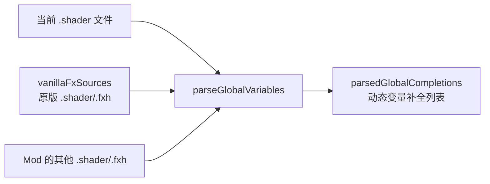

# 从穷举到动态：PDX Shader 变量补全与高亮的架构升级

## 问题描述

当前系统对 ConstantBuffer 变量和辅助函数采用**硬编码穷举**的方式：
- F# 端 `hlslPdxGlobals`：手动罗列了 ~100 个 `CompletionResponse.CreateSnippet(...)` 条目
- TM 端 `pdxshader.tmLanguage.json`：在正则表达式中手动拼接了所有变量名

每当 Paradox 更新或 Mod 新增变量时，都需要手动追加，维护成本极高。

## 当前架构分析

系统中**已经存在**一套动态解析机制，但只覆盖了一半场景：

### ✅ 已有的动态补全（F# 后端）



[parseGlobalVariables](file:///c:/Users/A/Documents/cwtools-vscode/submodules/cwtools/CWTools/Game/PdxShaderFeatures.fs#L1673-L1688) 在补全时会：
1. 扫描**当前文件 + 所有 vanilla .fxh + 所有 mod .shader/.fxh** 的 `ConstantBuffer(...){}` 块
2. 用正则提取 `float/int/uint/half/bool` 类型的变量声明
3. 将它们作为 `parsedGlobalCompletions` 动态注入补全列表

### ❌ 动态解析存在的盲区

| 盲区 | 原因 |
|---|---|
| **摄像机变量** (`vCamPos` 等) | 定义在引擎内部 C++ 中，不在任何 `.fxh` 文件里 |
| **系统矩阵** (`WorldMatrix` 等) | 同上，引擎注入 |
| **纹理采样器** (`DiffuseMap` 等) | 在 `Samplers = {}` 块中声明，不是 `float` 类型 |
| **辅助函数** (`UnpackRRxGNormal` 等) | 定义在 `.fxh` 的 `[[ ]]` HLSL 块内，当前解析器会跳过 HLSL 块 |
| **语法高亮** | TextMate 是纯静态正则，无法动态适配 |

### ❌ TextMate 语法高亮的根本限制

TextMate 语法文件（`pdxshader.tmLanguage.json`）是**纯静态**的正则表达式定义。它在文件加载时就已经确定了高亮规则，**不可能**在运行时动态扩展。这是 VS Code 的 TextMate 引擎的根本性限制。

## 提案：三层渐进式改进

### 第一层：增强 `parseGlobalVariables` 解析器（中等工作量）

> [!IMPORTANT]
> 这是性价比最高的改动。直接扩展已有的动态解析，让它覆盖更多场景。

#### A. 解析 `.fxh` 中 `[[ ]]` HLSL 块内的函数签名

当前 `parseGlobalVariables` 只解析 `ConstantBuffer` 块中的变量。我们可以增加一个正则，扫描 `.fxh` 文件中 `[[ ]]` 块内的**函数定义签名**：

```fsharp
// 新增：从 [[ ]] 块中提取函数声明
let funcDeclRegex = Regex(@"\b(?:float[234]?|int|uint|half|bool|void|PointLight|float[234]x[234])\s+([A-Za-z_]\w*)\s*\(", RegexOptions.Compiled)
```

这样 `UnpackRRxGNormal`、`MetalnessToDiffuse` 等函数就会被自动从 `standardfuncsgfx.fxh` 中解析出来，无需穷举。

#### B. 解析 `Samplers = {}` 块中的纹理采样器名称

```fsharp
let samplerNameRegex = Regex(@"^\s*(\w+)\s*=\s*\{", RegexOptions.Compiled ||| RegexOptions.Multiline)
```

这样 `DiffuseMap`、`NormalMap` 等采样器名就能被自动提取。

#### [MODIFY] [PdxShaderFeatures.fs](file:///c:/Users/A/Documents/cwtools-vscode/submodules/cwtools/CWTools/Game/PdxShaderFeatures.fs)
- 增强 `parseGlobalVariables` 函数，增加函数签名和采样器名提取
- 将函数结果转换为带括号 snippet 的补全项
- `hlslPdxGlobals` 中可以删除那些能被动态解析到的条目，只保留引擎内置的不可见变量

### 第二层：LSP 语义高亮替代 TextMate 穷举（较大工作量）

> [!WARNING]
> 这是解决 TextMate 静态限制的**唯一正道**方案，但工作量较大。

VS Code 支持 [Semantic Tokens](https://code.visualstudio.com/api/language-extensions/semantic-highlight-guide)，由语言服务器（LSP）在运行时动态返回令牌分类。实现后：

1. F# 后端的 `parseGlobalVariables` 解析到的**所有变量**都能被动态高亮
2. 用户自定义的 ConstantBuffer 变量也会自动获得高亮
3. 完全不需要在 `pdxshader.tmLanguage.json` 中穷举变量名

#### 实现路径
- 在 F# 后端新增 `semanticTokens` 函数
- 利用已有的 `parseGlobalVariables` + `parseVertexStructs` 构建令牌映射
- 在 TypeScript LSP 客户端注册 `DocumentSemanticTokensProvider`

### 第三层：保留 `hlslPdxGlobals` 作为引擎内置的基底（最小工作量）

无论动态解析多强，总有一些变量是**引擎 C++ 端注入**的，在任何 `.shader`/`.fxh` 文件中都看不到声明：

- `vCamPos`、`vCamLookAtDir`、`vCamRightDir`、`vCamUpDir`（摄像机状态）
- `WorldMatrix`、`ViewProjectionMatrix`（系统变换矩阵）
- `HdrRange_Time_ClipHeight`（引擎全局时间/HDR 包）
- `LightPosition`、`LightDirection`、`SunColor`、`AmbientColor`（全局光照）

这些**必须**保留在 `hlslPdxGlobals` 穷举列表中，因为它们的来源是引擎二进制，不存在于任何文本文件中。

## 推荐执行顺序

| 优先级 | 改动 | 效果 |
|---|---|---|
| 🥇 **立即** | 增强 `parseGlobalVariables` | 自动补全覆盖所有 CBuffer 变量、`.fxh` 函数、采样器名 |
| 🥈 **后续** | LSP 语义令牌 | 动态高亮代替 TextMate 穷举 |
| 🥉 **保留** | `hlslPdxGlobals` 精简版 | 仅保留引擎内置不可见变量 |

## 开放问题

> [!IMPORTANT]
> 1. 第一层改动可以立即执行，是否先做这个？
> 2. 第二层（LSP 语义令牌）是否值得在本轮实施？它需要修改 TS 端和 F# 端两侧代码。
> 3. 是否需要将 `hlslPdxGlobals` 精简为只保留引擎内置变量？（这会让列表从 ~100 项缩减到 ~20 项）
