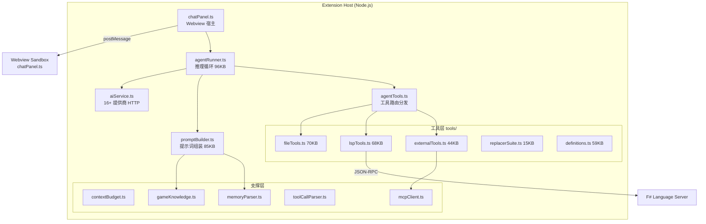
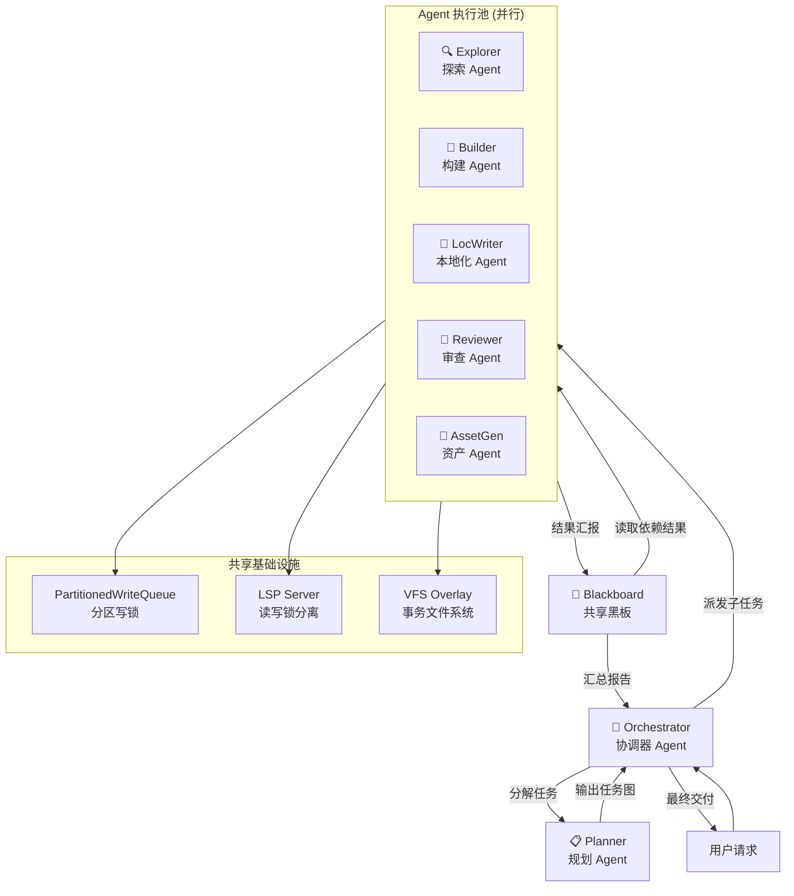
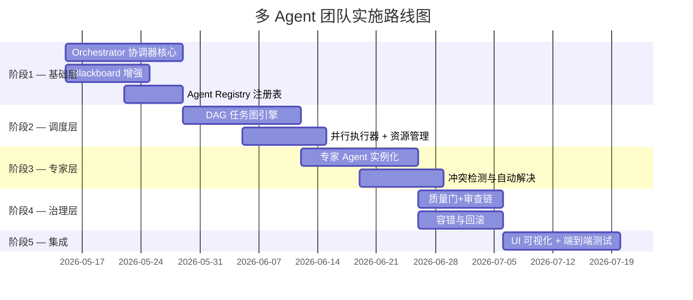

# 多 Agent 团队协作功能 — 深度分析报告

> **项目**: Eddy's Stellaris CWTools · **日期**: 2026-05-11 · **版本**: v1.6.0

---

## 一、现有 AI Agent 架构全景

### 1.1 核心组件拓扑



### 1.2 现有 Agent 模式

| 模式 | 角色 | 工具权限 | 独立推理循环 |
|------|------|----------|------------|
| `build` | 全功能构建 | 全部 40+ 工具 | ✅ |
| `plan` | 只读规划 | 只读 + todo + blueprint | ✅ |
| `explore` | 代码探索 | 只读 + Deep API | ✅ |
| `general` | 研究问答 | 全部 - todo | ✅ |
| `review` | 代码审查 | 只读 + diagnostics | ✅ |
| `gui_expert` | GUI 脚本专家 | 继承父代理 | ❌ (子代理) |
| `script_reviewer` | 脚本审查专家 | 继承父代理 | ❌ (子代理) |
| `loc_translator` | 本地化翻译 | 读写 + 搜索 | ✅ |
| `loc_writer` | 本地化编写 | 读写 + 查询 | ✅ |

### 1.3 现有协作机制

#### 已实现但已移除的 `spawn_sub_agents`

在 [agentTools.ts:332](file:///c:/Users/A/Documents/cwtools-vscode/client/extension/ai/agentTools.ts#L332) 中发现：
```typescript
// spawn_sub_agents — REMOVED: sub-agent system not suitable for current architecture
```

当前子代理系统已被**标记移除**。架构文档中的 DAG 调度器图示仍然保留，但实际代码中该工具已不可用。这意味着**目前不存在真正的多 Agent 协作能力**。

#### 已存在的协作基础设施

| 基础设施 | 文件 | 状态 | 描述 |
|----------|------|------|------|
| 分区写队列 | `agentRunner.ts:225` | ✅ 可用 | `PartitionedWriteQueue` — 按文件路径分区的写锁 |
| 黑板内存 | `agentTools.ts:184` | ✅ 可用 | `sharedMemory` Map — LRU 200 条目 |
| 持久记忆 | `memoryParser.ts` | ✅ 可用 | `.cwtools-ai-memory.md` 跨会话记忆 |
| Token 累加器 | `agentRunner.ts:594` | ✅ 可用 | `parentTokenAccumulator` 子代理费用合并 |
| 检查点系统 | `agentRunner.ts:455` | ✅ 可用 | 每 10 轮保存进度快照 |
| MCP 连接池 | `agentTools.ts:450` | ✅ 可用 | 外部工具服务器连接复用 |
| Doom-Loop 检测 | `agentRunner.ts:42-57` | ✅ 可用 | 两阶段签名+哈希死循环检测 |
| 提供商回退 | `agentRunner.ts:294` | ✅ 可用 | 5xx/超时自动切换备用模型 |

---

## 二、多 Agent 团队协作方案设计

### 2.1 目标架构



### 2.2 技术路线总览



---

## 三、详细实现方案

### 阶段 1：基础层 — Orchestrator + Blackboard

#### 3.1.1 Orchestrator 协调器

**核心职责**：接收用户请求 → 调用 Planner 分解 → 管理 Agent 生命周期 → 汇总结果

```
新增文件:
├── ai/orchestrator/
│   ├── orchestrator.ts        — 协调器主逻辑
│   ├── taskGraph.ts           — DAG 任务图数据结构
│   ├── agentRegistry.ts       — Agent 类型注册表
│   └── types.ts               — 多 Agent 专用类型
```

**与现有代码的关联**：
- 复用 `AgentRunner.run()` 作为单个 Agent 的执行引擎
- 复用 `PromptBuilder.buildSystemPromptForMode()` 为每个 Agent 角色生成专属提示词
- 复用 `AgentToolExecutor` 作为共享工具执行器（多 Agent 共用一个实例）

**关键设计**：
- Orchestrator 本身也是一个 Agent（mode = `orchestrator`），拥有特殊工具 `dispatch_agents`、`query_blackboard`、`merge_results`
- 它使用 **同一个 LLM** 但配备元级提示词（Meta-Prompt），专注于任务分解和结果综合

#### 3.1.2 Blackboard 增强

**现状**：`sharedMemory`（Map, LRU 200）仅支持 key-value 存取，无类型约束、无版本控制、无订阅机制。

**增强方向**：

| 特性 | 现状 | 目标 |
|------|------|------|
| 存储模型 | 纯 KV | 带类型标签的条目（FileSnapshot / ScopeInfo / DiagResult / FreeText） |
| 容量 | 200 条目 | 按 Agent 分区 + 全局区，各 500 条目 |
| 通知 | 无 | 发布-订阅模式（Agent 可 watch 特定 key 前缀） |
| 版本 | 无 | 乐观锁版本号（写入时 CAS） |
| 持久化 | 仅运行时 | 可选溢出到 `.cwtools-ai/{topicId}/blackboard.json` |

### 阶段 2：调度层 — DAG 任务图引擎

#### 3.2.1 任务图结构

```typescript
interface TaskNode {
    id: string;
    agentType: AgentMode;           // 复用现有 AgentMode
    prompt: string;                  // 子任务描述
    dependencies: string[];          // 前置任务 ID
    priority: 'critical' | 'normal' | 'low';
    estimatedTokens?: number;        // 预估 token 消耗
    status: 'pending' | 'running' | 'done' | 'failed' | 'cancelled';
    result?: unknown;
    retryCount: number;
    maxRetries: number;
}

interface TaskGraph {
    nodes: Map<string, TaskNode>;
    // 拓扑排序确定执行顺序
    // 同层无依赖关系的节点可并行
}
```

#### 3.2.2 并行执行器

**与现有 `Promise.allSettled` 的区别**：

现有的只读工具并行（`agentRunner.ts:1475`）是**工具级**并行——同一个 Agent 在一次响应中的多个只读工具调用并行执行。

新方案是 **Agent 级**并行——多个独立的 `AgentRunner.run()` 实例并行运行，各自拥有独立的推理循环。

**资源管理**：

| 资源 | 限制策略 |
|------|----------|
| 并发 Agent 数 | `Math.min(CPU_CORES, 4)` — VS Code 扩展宿主是单进程，过多并发会阻塞事件循环 |
| 总 Token 预算 | 所有子 Agent 共享父级 `tokenAccumulator`（已有 `parentTokenAccumulator` 机制） |
| LSP 并发 | 读操作已有 `ReaderWriterLockSlim`（F# 端），写操作必须串行 |
| 文件写入 | 通过现有 `PartitionedWriteQueue` 保证无冲突 |

### 阶段 3：专家 Agent 实例化

#### 3.3.1 专家角色定义

| Agent 角色 | 基础模式 | 特化能力 | 输出格式 |
|-----------|---------|---------|---------|
| **Explorer** | `explore` | 项目结构扫描、依赖图绘制 | Blackboard: 结构化项目元数据 |
| **Architect** | `plan` | 实体蓝图设计、事件链编排 | `design_blueprint.md` |
| **Builder** | `build` | 代码生成、文件写入 | 代码文件 + diff |
| **LocWriter** | `loc_writer` | 多语言本地化 | `.yml` 文件 |
| **Reviewer** | `review` | 代码审查、诊断验证 | 审查报告 |
| **AssetGen** | `build` (受限) | 图标/音效生成、DDS 转换 | 媒体资产文件 |

#### 3.3.2 冲突检测

**文件级冲突**：两个 Builder Agent 同时编辑同一文件。
- **检测**：`PartitionedWriteQueue` 已按路径串行化，但不足以检测**语义冲突**
- **方案**：引入 `ConflictDetector` — 在 Agent 写入前检查 Blackboard 中其他 Agent 的 "intent" 声明

**语义冲突**：Agent A 创建了 `event_id = X`，Agent B 引用了尚未存在的 `X`。
- **方案**：Builder Agent 写入文件后立即在 Blackboard 发布 `created_entities: [X, Y, Z]`，其他 Agent 在引用前查询

### 阶段 4：治理层

#### 3.4.1 质量门

```
Builder Agent 完成 → 自动触发 Reviewer Agent →
  ├── 通过 → 合并到最终输出
  └── 不通过 → 返回 Builder 修复（最多 3 轮）
```

#### 3.4.2 容错与回滚

- **Agent 崩溃**：复用现有 `AgentCheckpoint` 机制，每个子 Agent 独立存储检查点
- **事务回滚**：复用 `vfsOverlay` — 子 Agent 的写入先暂存在虚拟文件系统，Orchestrator 审批后 `commitTransaction()`
- **全局回滚**：`git_ops(action="checkout")` 回退到最后已知良好状态

---

## 四、与现有系统的关联矩阵

| 现有组件 | 多 Agent 中的角色 | 需修改程度 |
|---------|-----------------|-----------|
| `agentRunner.ts` | 每个 Agent 实例的执行引擎 | 🟡 中 — 需暴露 `runSubAgent()` 接口 |
| `agentTools.ts` | 共享工具执行器 | 🟢 低 — 新增 `dispatch_agents` 路由 |
| `promptBuilder.ts` | 为每个角色生成专属 Prompt | 🟡 中 — 新增 `orchestrator` 模式 |
| `aiService.ts` | 共享 LLM 通信层 | 🟢 低 — 无需修改 |
| `PartitionedWriteQueue` | 多 Agent 写入串行化 | 🟢 低 — 已满足需求 |
| `sharedMemory` | 升级为 Blackboard | 🔴 高 — 需重构为类型化发布-订阅 |
| `chatPanel.ts` | UI 展示多 Agent 进度 | 🟡 中 — 新增并行任务可视化 |
| `types.ts` | 新增多 Agent 类型定义 | 🟡 中 — 新增 TaskNode/Graph 类型 |
| `tools/definitions.ts` | 新增协调器专用工具定义 | 🟢 低 — 追加 3 个工具 Schema |
| `contextBudget.ts` | 多 Agent 共享预算 | 🟡 中 — 需支持全局预算分配 |
| `mcpClient.ts` | MCP 连接池复用 | 🟢 低 — 已支持多客户端 |
| `memoryParser.ts` | 跨 Agent 持久记忆 | 🟢 低 — 现有设计已足够 |
| `errorReporter.ts` | 多 Agent 日志隔离 | 🟢 低 — 需加 agentId 标签 |
| `usageTracker.ts` | 多 Agent 费用拆分 | 🟡 中 — 需按 Agent 分类统计 |

---

## 五、潜在问题与风险分析

### 5.1 实现过程中的问题

| 问题 | 严重度 | 影响 | 缓解方案 |
|------|-------|------|---------|
| **事件循环阻塞** | 🔴 致命 | VS Code 扩展宿主是单线程 Node.js，多个 Agent 的 LLM API 调用虽然是异步 I/O，但大量工具执行（特别是 `validate_code`）会阻塞事件循环 | 限制并发 Agent 数 ≤ 4；重 CPU 操作（diff、hash）使用 `setImmediate` 分片 |
| **上下文窗口爆炸** | 🔴 致命 | 每个 Agent 独立维护对话历史，Orchestrator 还需汇总结果，总 Token 消耗可能是单 Agent 的 5-10 倍 | 全局 Token 预算池；强制使用小上下文模型（如 flash 变体）用于探索类 Agent |
| **LSP 读写竞争** | 🟡 高 | F# 语言服务器的 `ReaderWriterLockSlim` 支持并发读，但 `validate_code` 持写锁时会阻塞所有查询 Agent | 将 `validate_code` 调度到专用审查阶段，避免与 Explorer/Builder 并行 |
| **Doom-Loop 跨 Agent 传播** | 🟡 高 | Agent A 的输出触发 Agent B 的修复，Agent B 的修复又触发 Agent A 的重做 | Orchestrator 维护全局修复计数；同一文件修复超过 3 轮自动升级为人工干预 |
| **工具名称冲突** | 🟢 中 | `spawn_sub_agents` 已被移除，新的 `dispatch_agents` 需要按"三位一体"规则注册 | 严格遵循 `definitions.ts` + `agentTools.ts` + `types.ts` 三文件同步 |
| **子 Agent Prompt 膨胀** | 🟡 高 | 现有 `promptBuilder.ts` 的 Build 模式提示词已达数千 token，多个 Agent 各自携带完整提示词会严重浪费 | 为子 Agent 设计精简版提示词；共享上下文注入一次而非每个 Agent 重复注入 |

### 5.2 实现后的运行时问题

| 问题 | 严重度 | 影响 | 缓解方案 |
|------|-------|------|---------|
| **费用失控** | 🔴 致命 | 多 Agent 并行调用 LLM，单次任务可能产生 500K+ tokens | UI 显示实时费用；设置全局预算上限；超限自动降级为单 Agent |
| **结果不一致** | 🟡 高 | Explorer 发现的上下文可能在 Builder 执行时已过期（文件被另一个 Builder 修改） | Blackboard 版本号 + CAS 写入；Builder 写入前重新验证关键前提 |
| **用户认知过载** | 🟡 高 | 多个 Agent 同时产出步骤日志，Chat Panel 信息爆炸 | 默认折叠子 Agent 步骤；只显示 Orchestrator 的高层进度汇总 |
| **调试困难** | 🟡 高 | 问题出现时难以定位是哪个 Agent 的哪一步出错 | 每个 AgentStep 携带 `agentId` + `parentTaskId`；支持按 Agent 过滤日志 |
| **模型能力不足** | 🟢 中 | Orchestrator 需要元级推理能力，小模型可能无法正确分解任务 | Orchestrator 强制使用高性能模型（Claude/GPT-5/Gemini Pro/deepseek v4 pro等）；子 Agent 可用轻量模型 |
| **死锁风险** | 🟡 高 | Agent A 等 B 写入 Blackboard，B 等 A 的文件写入完成 | DAG 保证无循环依赖；Blackboard 读操作永远非阻塞 |
| **回滚不完整** | 🟡 高 | 部分 Agent 成功、部分失败时，需要回滚成功 Agent 的写入 | 所有写入经过 `vfsOverlay`；Orchestrator 最终统一 commit 或 discard |

### 5.3 架构约束与设计权衡

> [!IMPORTANT]
> **核心权衡**：多 Agent 并行度 vs. 一致性保证。Paradox 游戏脚本的跨文件引用极其密集（事件→on_action→修饰符→本地化），完全并行几乎必然产生引用不一致。

**建议策略**：**流水线并行 > 全面并行**

```
阶段1: Explorer (并行扫描) → Blackboard 写入项目快照
阶段2: Architect (串行规划) → 输出 TaskGraph
阶段3: Builder×N (半并行) → 按文件分区并行，同目录串行
阶段4: LocWriter (并行翻译) → 按语言文件分区
阶段5: Reviewer (串行审查) → 质量门
阶段6: Orchestrator (串行汇总) → 最终报告
```

这种 **阶段内并行 + 阶段间流水线** 的混合模式，既利用了并行加速，又通过阶段边界保证了数据一致性。

---

## 六、总结与建议

### 可行性评估

| 维度 | 评分 | 理由 |
|------|------|------|
| 技术可行性 | ⭐⭐⭐⭐ | 现有基础设施（写队列、检查点、Token 累加器）覆盖了 60% 的需求 |
| 工程复杂度 | ⭐⭐ | 预计新增/修改 15+ 文件，~3000 行代码 |
| 投入产出比 | ⭐⭐⭐ | 大型 Mod 开发（20+ 文件）可提速 3-5 倍，但简单任务无收益 |
| 维护成本 | ⭐⭐ | 显著增加调试复杂度和 edge case |

### 建议实施优先级

1. **P0 — Blackboard 增强** (阶段1)：最低风险、最高复用价值
2. **P0 — Orchestrator 原型** (阶段1)：验证端到端可行性
3. **P1 — 流水线调度** (阶段2)：实现阶段间并行
4. **P2 — 专家 Agent** (阶段3)：按需扩展角色
5. **P3 — 质量门 + 容错** (阶段4)：生产化必备

> [!TIP]
> **快速验证路径**：先实现最小可行版本 — Orchestrator + Explorer + Builder 三角色流水线，验证 Blackboard 通信和 DAG 调度后再扩展。
